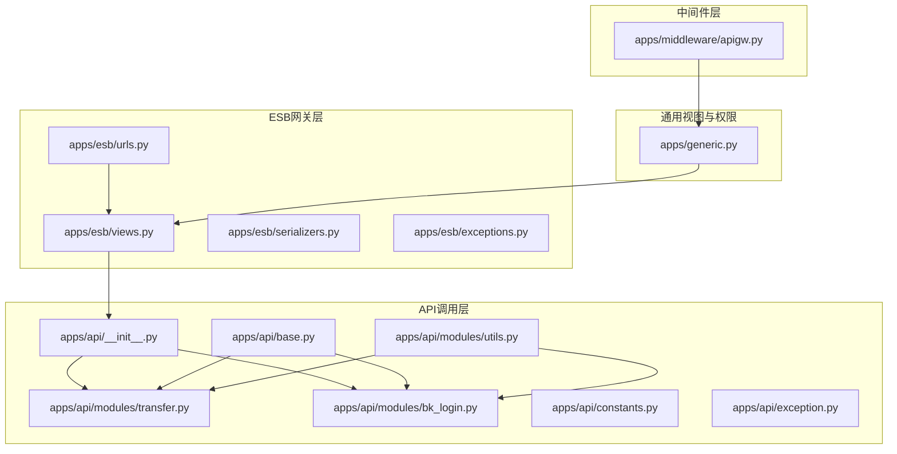
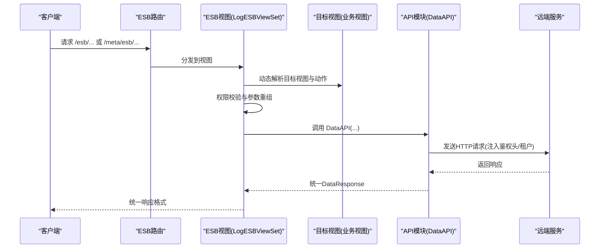
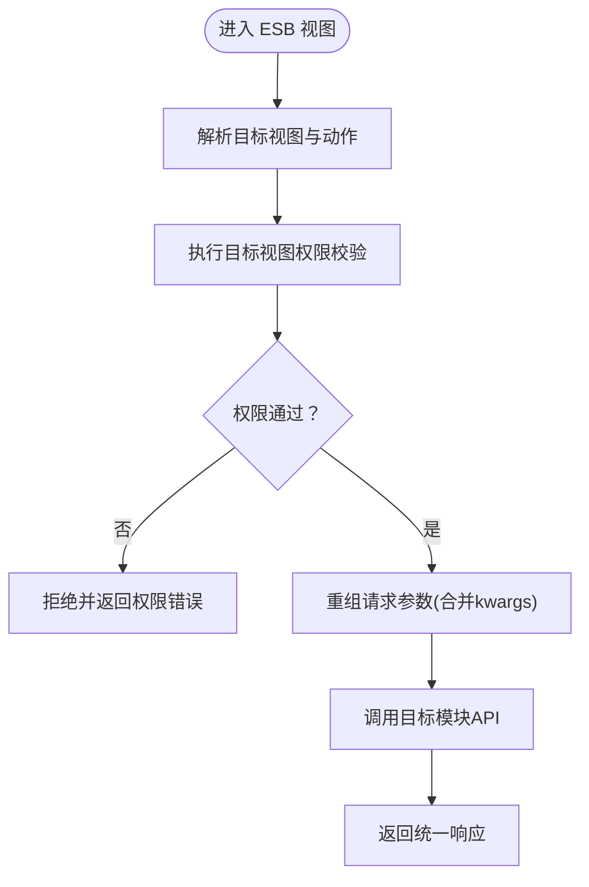
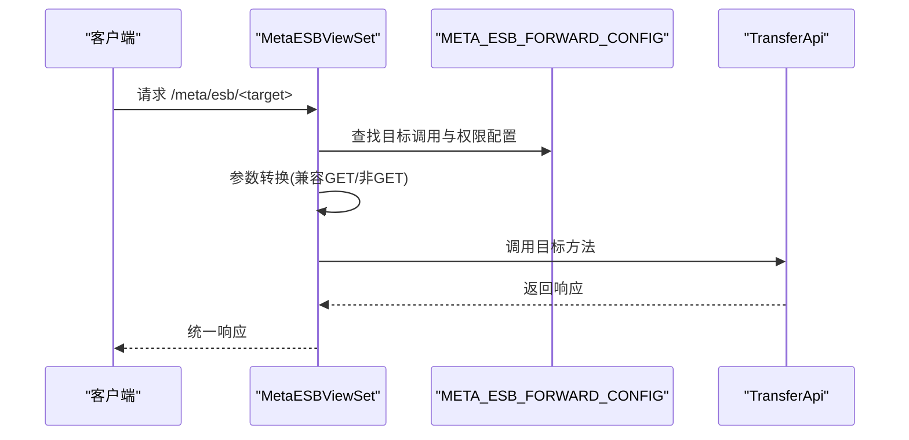
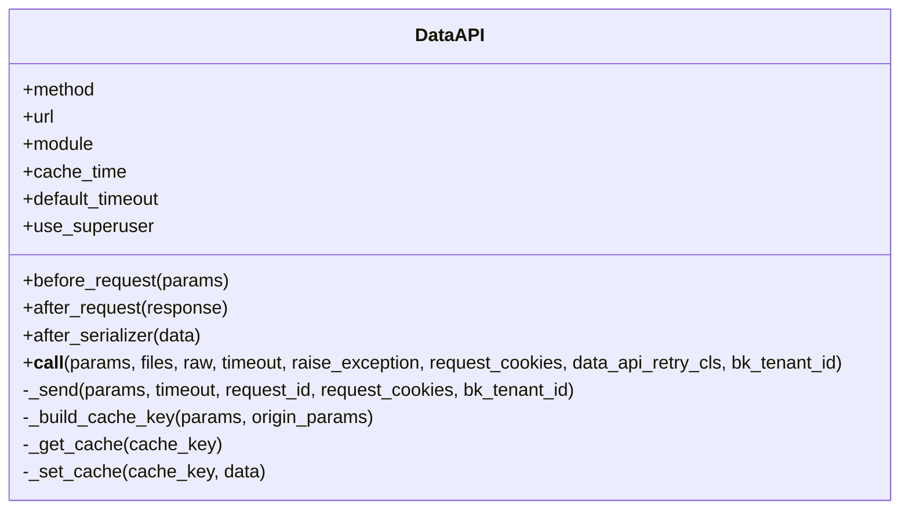
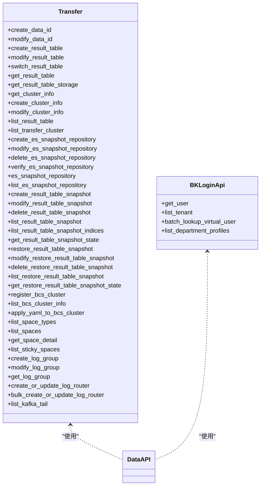
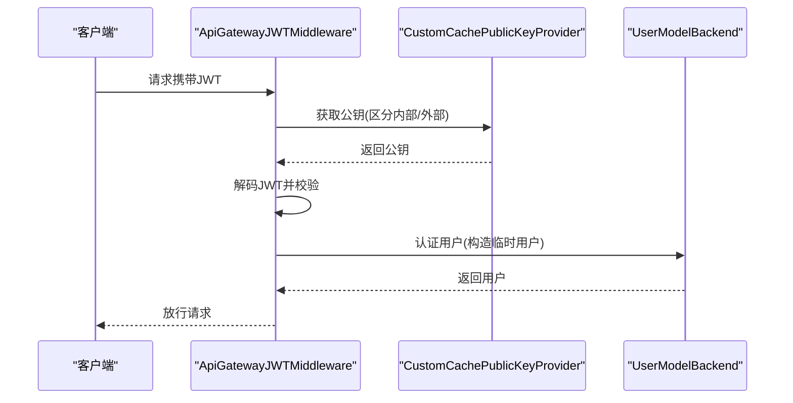
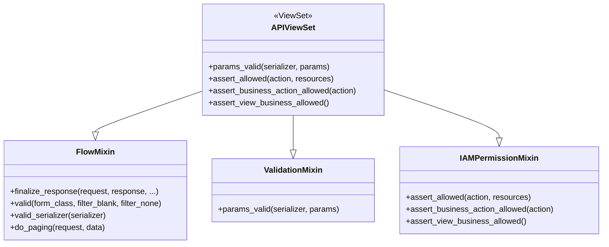
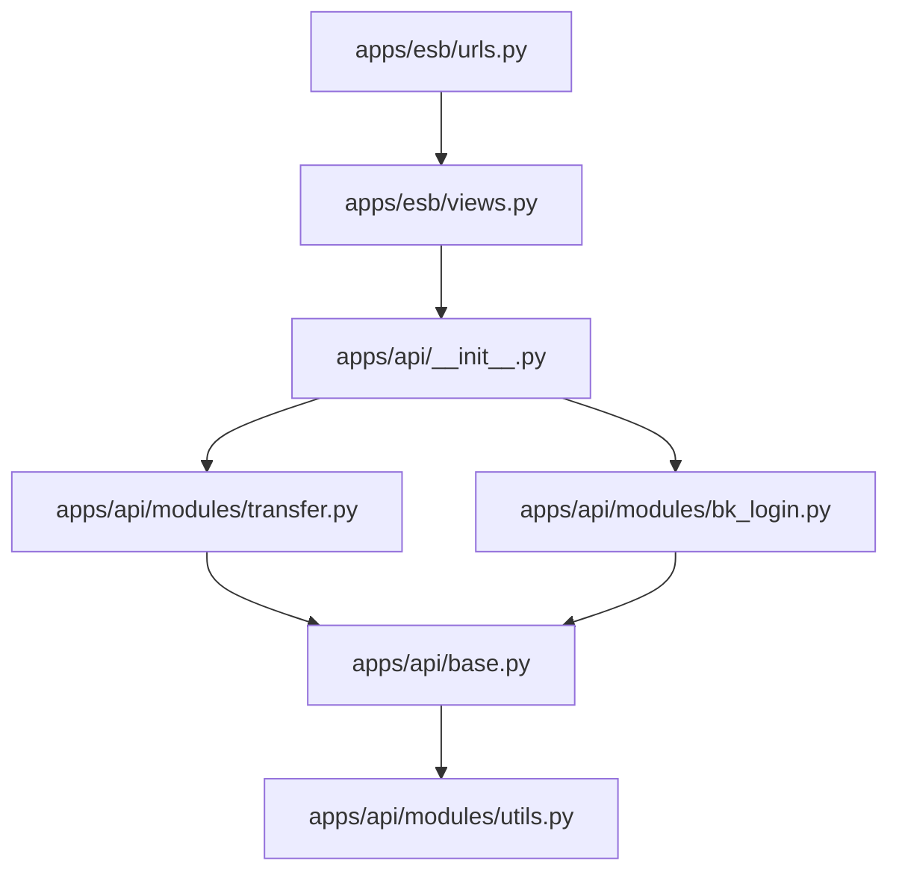

# API网关集成

<cite>
**本文引用的文件**
- [apps/esb/__init__.py](file://apps/esb/__init__.py)
- [apps/esb/views.py](file://apps/esb/views.py)
- [apps/esb/urls.py](file://apps/esb/urls.py)
- [apps/esb/serializers.py](file://apps/esb/serializers.py)
- [apps/esb/exceptions.py](file://apps/esb/exceptions.py)
- [apps/generic.py](file://apps/generic.py)
- [apps/api/base.py](file://apps/api/base.py)
- [apps/api/exception.py](file://apps/api/exception.py)
- [apps/api/constants.py](file://apps/api/constants.py)
- [apps/api/modules/utils.py](file://apps/api/modules/utils.py)
- [apps/api/modules/transfer.py](file://apps/api/modules/transfer.py)
- [apps/api/modules/bk_login.py](file://apps/api/modules/bk_login.py)
- [apps/api/__init__.py](file://apps/api/__init__.py)
- [apps/middleware/apigw.py](file://apps/middleware/apigw.py)
</cite>

## 目录
1. [简介](#简介)
2. [项目结构](#项目结构)
3. [核心组件](#核心组件)
4. [架构总览](#架构总览)
5. [详细组件分析](#详细组件分析)
6. [依赖分析](#依赖分析)
7. [性能考虑](#性能考虑)
8. [故障排查指南](#故障排查指南)
9. [结论](#结论)
10. [附录](#附录)

## 简介
本文件面向蓝鲸API网关集成场景，系统性梳理蓝鲸日志平台（bk-log）在API网关与ESB之间的集成实现，覆盖以下主题：
- 网关配置与认证授权：包括API网关JWT中间件、应用鉴权头注入、租户隔离与权限控制。
- 接口管理与ESB转发：ESB视图层如何解析路径、动态解析目标视图并执行权限校验与参数重组。
- 外部服务集成机制：通过DataAPI封装统一请求、重试、缓存、序列化与错误处理，支撑Transfer、登录、消息等模块。
- 安全机制：身份验证、权限控制、敏感参数脱敏与审计日志。
- 最佳实践：接口设计、版本管理、性能优化与错误处理策略。
- 实际调用示例与集成开发指南：基于现有模块与视图的调用路径说明。

## 项目结构
围绕API网关与ESB集成的关键目录与文件如下：
- ESB网关层：apps/esb/* 提供ESB转发与Meta转发能力，统一入口与权限校验。
- API调用层：apps/api/* 提供DataAPI抽象、各模块API封装与工具函数。
- 中间件层：apps/middleware/apigw.py 提供API网关JWT解码与用户认证。
- 通用视图与权限：apps/generic.py 提供统一响应格式、参数校验与IAM权限混合类。

**图表来源**
- [apps/esb/urls.py:28-37](file://apps/esb/urls.py#L28-L37)
- [apps/esb/views.py:27-38](file://apps/esb/views.py#L27-L38)
- [apps/api/__init__.py:32-88](file://apps/api/__init__.py#L32-L88)
- [apps/api/base.py:191-276](file://apps/api/base.py#L191-L276)
- [apps/api/modules/transfer.py:131-173](file://apps/api/modules/transfer.py#L131-L173)
- [apps/api/modules/bk_login.py:62-109](file://apps/api/modules/bk_login.py#L62-L109)
- [apps/api/modules/utils.py:147-248](file://apps/api/modules/utils.py#L147-L248)
- [apps/middleware/apigw.py:123-125](file://apps/middleware/apigw.py#L123-L125)
- [apps/generic.py:180-181](file://apps/generic.py#L180-L181)

**章节来源**
- [apps/esb/urls.py:28-37](file://apps/esb/urls.py#L28-L37)
- [apps/esb/views.py:27-38](file://apps/esb/views.py#L27-L38)
- [apps/api/__init__.py:32-88](file://apps/api/__init__.py#L32-L88)
- [apps/api/base.py:191-276](file://apps/api/base.py#L191-L276)
- [apps/api/modules/transfer.py:131-173](file://apps/api/modules/transfer.py#L131-L173)
- [apps/api/modules/bk_login.py:62-109](file://apps/api/modules/bk_login.py#L62-L109)
- [apps/api/modules/utils.py:147-248](file://apps/api/modules/utils.py#L147-L248)
- [apps/middleware/apigw.py:123-125](file://apps/middleware/apigw.py#L123-L125)
- [apps/generic.py:180-181](file://apps/generic.py#L180-L181)

## 核心组件
- DataAPI：统一请求封装，负责参数清洗、鉴权头注入、重试、缓存、序列化与日志记录。
- ESB视图层：LogESBViewSet与MetaESBViewSet分别实现ESB路径转发与Meta转发，动态解析目标视图并执行权限校验。
- API模块封装：Transfer、BKLogin等模块通过DataAPI声明具体接口，统一前处理与后处理。
- API网关JWT中间件：解析JWT令牌，按来源选择公钥，构造用户后端，完成认证。
- 通用视图与权限：APIViewSet统一响应格式、参数校验与IAM权限控制。

**章节来源**
- [apps/api/base.py:191-276](file://apps/api/base.py#L191-L276)
- [apps/esb/views.py:69-141](file://apps/esb/views.py#L69-L141)
- [apps/esb/views.py:143-211](file://apps/esb/views.py#L143-L211)
- [apps/api/modules/transfer.py:131-173](file://apps/api/modules/transfer.py#L131-L173)
- [apps/api/modules/bk_login.py:62-109](file://apps/api/modules/bk_login.py#L62-L109)
- [apps/middleware/apigw.py:123-125](file://apps/middleware/apigw.py#L123-L125)
- [apps/generic.py:180-181](file://apps/generic.py#L180-L181)

## 架构总览
下图展示ESB与API网关的交互流程：客户端经由ESB入口访问，视图层解析目标路径并动态调用对应模块API，同时注入鉴权头与租户信息，最终返回统一格式响应。

**图表来源**
- [apps/esb/urls.py:31-36](file://apps/esb/urls.py#L31-L36)
- [apps/esb/views.py:73-122](file://apps/esb/views.py#L73-L122)
- [apps/api/base.py:277-320](file://apps/api/base.py#L277-L320)
- [apps/api/base.py:509-600](file://apps/api/base.py#L509-L600)

## 详细组件分析

### ESB视图层与权限控制
- 动态解析：通过URL解析目标视图类与动作，读取目标视图的权限配置并执行has_permission校验。
- 参数重组：区分GET/非GET请求，合并kwargs与请求参数，确保下游接口签名与参数一致。
- 权限策略：支持业务视图权限、业务动作权限与实例级数据权限，结合IAM动作与资源定义。

**图表来源**
- [apps/esb/views.py:73-106](file://apps/esb/views.py#L73-L106)
- [apps/esb/views.py:124-140](file://apps/esb/views.py#L124-L140)

**章节来源**
- [apps/esb/views.py:69-141](file://apps/esb/views.py#L69-L141)
- [apps/generic.py:155-178](file://apps/generic.py#L155-L178)

### Meta转发与特殊处理
- MetaESBViewSet：根据配置表动态转发至Transfer等模块，支持视图权限与实例权限组合。
- 特殊接口：如创建ES快照仓库时对参数进行合法性校验与命名规范处理。

**图表来源**
- [apps/esb/views.py:143-194](file://apps/esb/views.py#L143-L194)
- [apps/esb/views.py:205-211](file://apps/esb/views.py#L205-L211)

**章节来源**
- [apps/esb/views.py:143-211](file://apps/esb/views.py#L143-L211)

### DataAPI请求封装与重试
- 鉴权头注入：自动拼装X-Bkapi-Authorization，包含应用标识与用户名等。
- 租户隔离：注入X-Bk-Tenant-Id，支持静态或动态租户ID。
- 重试与缓存：可配置重试策略与缓存时间，避免瞬时故障与热点查询。
- 日志与审计：记录请求耗时、参数与响应，便于追踪与审计。

**图表来源**
- [apps/api/base.py:191-276](file://apps/api/base.py#L191-L276)
- [apps/api/base.py:332-481](file://apps/api/base.py#L332-L481)
- [apps/api/base.py:509-600](file://apps/api/base.py#L509-L600)

**章节来源**
- [apps/api/base.py:64-74](file://apps/api/base.py#L64-L74)
- [apps/api/base.py:191-276](file://apps/api/base.py#L191-L276)
- [apps/api/base.py:332-481](file://apps/api/base.py#L332-L481)
- [apps/api/base.py:509-600](file://apps/api/base.py#L509-L600)

### API模块封装（以Transfer与BKLogin为例）
- Transfer：封装元数据相关接口，如结果表、集群、快照仓库等，统一前处理与后处理，支持租户ID注入。
- BKLogin：封装用户与租户查询接口，支持多租户模式下的租户列表与虚拟用户查询。

**图表来源**
- [apps/api/modules/transfer.py:131-492](file://apps/api/modules/transfer.py#L131-L492)
- [apps/api/modules/bk_login.py:62-109](file://apps/api/modules/bk_login.py#L62-L109)
- [apps/api/base.py:191-276](file://apps/api/base.py#L191-L276)

**章节来源**
- [apps/api/modules/transfer.py:131-492](file://apps/api/modules/transfer.py#L131-L492)
- [apps/api/modules/bk_login.py:62-109](file://apps/api/modules/bk_login.py#L62-L109)

### API网关JWT中间件与认证
- 解析JWT：根据请求头与网关名称选择公钥，支持内部网关与外部网关切换。
- 用户后端：构造临时用户对象，避免频繁入库与查询。
- 错误处理：对无效令牌进行捕获与告警。

**图表来源**
- [apps/middleware/apigw.py:123-125](file://apps/middleware/apigw.py#L123-L125)
- [apps/middleware/apigw.py:60-92](file://apps/middleware/apigw.py#L60-L92)
- [apps/middleware/apigw.py:41-58](file://apps/middleware/apigw.py#L41-L58)

**章节来源**
- [apps/middleware/apigw.py:123-125](file://apps/middleware/apigw.py#L123-L125)
- [apps/middleware/apigw.py:60-92](file://apps/middleware/apigw.py#L60-L92)
- [apps/middleware/apigw.py:41-58](file://apps/middleware/apigw.py#L41-L58)

### 通用视图与权限混合类
- APIViewSet：继承FlowMixin（统一响应）、ValidationMixin（参数校验）、IAMPermissionMixin（IAM权限），提供统一的视图基类。
- 权限控制：支持业务视图权限、业务动作权限与实例级数据权限，结合ActionEnum与ResourceEnum进行校验。

**图表来源**
- [apps/generic.py:180-181](file://apps/generic.py#L180-L181)
- [apps/generic.py:59-135](file://apps/generic.py#L59-L135)
- [apps/generic.py:137-178](file://apps/generic.py#L137-L178)

**章节来源**
- [apps/generic.py:180-181](file://apps/generic.py#L180-L181)
- [apps/generic.py:59-135](file://apps/generic.py#L59-L135)
- [apps/generic.py:137-178](file://apps/generic.py#L137-L178)

## 依赖分析
- ESB路由与视图：ESB路由注册两类转发视图，视图内部通过settings中的ALLOWED_MODULES_FUNCS/META_ESB_FORWARD_CONFIG进行权限与调用映射。
- API模块懒加载：apps/api/__init__.py采用懒加载机制，避免循环引用与模型提前加载。
- DataAPI依赖：统一依赖utils与local模块进行鉴权信息注入、请求ID与租户ID获取。

**图表来源**
- [apps/esb/urls.py:28-37](file://apps/esb/urls.py#L28-L37)
- [apps/esb/views.py:27-38](file://apps/esb/views.py#L27-L38)
- [apps/api/__init__.py:32-88](file://apps/api/__init__.py#L32-L88)
- [apps/api/modules/transfer.py:131-173](file://apps/api/modules/transfer.py#L131-L173)
- [apps/api/modules/bk_login.py:62-109](file://apps/api/modules/bk_login.py#L62-L109)
- [apps/api/base.py:191-276](file://apps/api/base.py#L191-L276)
- [apps/api/modules/utils.py:147-248](file://apps/api/modules/utils.py#L147-L248)

**章节来源**
- [apps/esb/urls.py:28-37](file://apps/esb/urls.py#L28-L37)
- [apps/esb/views.py:27-38](file://apps/esb/views.py#L27-L38)
- [apps/api/__init__.py:32-88](file://apps/api/__init__.py#L32-L88)
- [apps/api/base.py:191-276](file://apps/api/base.py#L191-L276)

## 性能考虑
- 缓存策略：DataAPI支持缓存时间配置，适用于高频查询接口（如结果表信息）。
- 批量与并发：DataAPI提供批量请求与线程池并发请求能力，减少多次往返与提升吞吐。
- 重试机制：可配置重试次数与等待范围，降低瞬时网络抖动影响。
- 超时控制：统一默认超时与可覆盖的超时参数，避免长尾阻塞。

**章节来源**
- [apps/api/constants.py:22-24](file://apps/api/constants.py#L22-L24)
- [apps/api/base.py:632-741](file://apps/api/base.py#L632-L741)
- [apps/api/base.py:108-174](file://apps/api/base.py#L108-L174)

## 故障排查指南
- ESB异常：UrlNotExistError、UrlNotImplementError、MethodNotAllowedError等，通常由路径解析或权限配置不当导致。
- API异常：DataAPIException封装底层异常，统一错误消息与响应体；可结合日志定位URL与参数。
- 权限异常：IAMPermissionMixin触发的权限不足会返回标准化错误结构，包含申请链接与权限信息。
- JWT异常：ApiGatewayJWTProvider在公钥缺失或令牌无效时会记录警告并拒绝请求。

**章节来源**
- [apps/esb/exceptions.py:32-49](file://apps/esb/exceptions.py#L32-L49)
- [apps/api/exception.py:29-40](file://apps/api/exception.py#L29-L40)
- [apps/generic.py:329-344](file://apps/generic.py#L329-L344)
- [apps/middleware/apigw.py:116-120](file://apps/middleware/apigw.py#L116-L120)

## 结论
本项目通过ESB与API网关的协同，实现了统一的接口入口、严格的权限控制与高可靠的调用链路。DataAPI作为统一抽象，屏蔽了第三方服务差异，提供了重试、缓存、序列化与可观测性等能力；ESB视图层则承担了路径解析与权限校验职责，确保安全与合规。配合API网关JWT中间件与通用视图权限混合类，整体架构具备良好的扩展性与可维护性。

## 附录

### API调用示例与集成开发指南
- ESB调用路径
  - ES路径转发：/esb/... → 动态解析目标视图 → 执行权限校验 → 调用DataAPI → 返回统一响应。
  - Meta转发：/meta/esb/<target> → 依据配置表映射 → 调用Transfer等模块 → 特殊接口参数校验。
- 参数传递与响应处理
  - 参数重组：GET/非GET请求分别处理，合并kwargs与请求体，确保下游签名一致。
  - 统一响应：APIViewSet统一返回{result, data, code, message}，便于前端消费。
- 外部服务集成
  - 通过DataAPI声明接口，设置before_request/after_request/after_serializer，注入鉴权头与租户ID。
  - 对于批量/分页场景，使用DataAPI提供的批量请求与并发请求能力。
- 安全与合规
  - 鉴权头：X-Bkapi-Authorization自动注入应用标识与用户名。
  - 租户隔离：X-Bk-Tenant-Id贯穿请求链路，支持静态或动态租户ID。
  - 敏感参数：日志记录时对敏感参数进行剔除，避免泄露。
- 最佳实践
  - 接口设计：统一前/后处理，明确错误码与消息格式。
  - 版本管理：通过模块与方法名区分版本，避免破坏性变更。
  - 性能优化：合理设置缓存与重试，控制超时与并发度。
  - 错误处理：利用统一异常与日志，快速定位问题根因。

**章节来源**
- [apps/esb/views.py:73-141](file://apps/esb/views.py#L73-L141)
- [apps/esb/views.py:143-211](file://apps/esb/views.py#L143-L211)
- [apps/generic.py:67-76](file://apps/generic.py#L67-L76)
- [apps/api/base.py:64-74](file://apps/api/base.py#L64-L74)
- [apps/api/base.py:541-553](file://apps/api/base.py#L541-L553)
- [apps/api/base.py:435-455](file://apps/api/base.py#L435-L455)