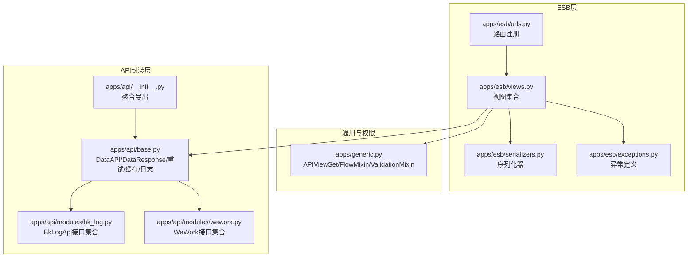
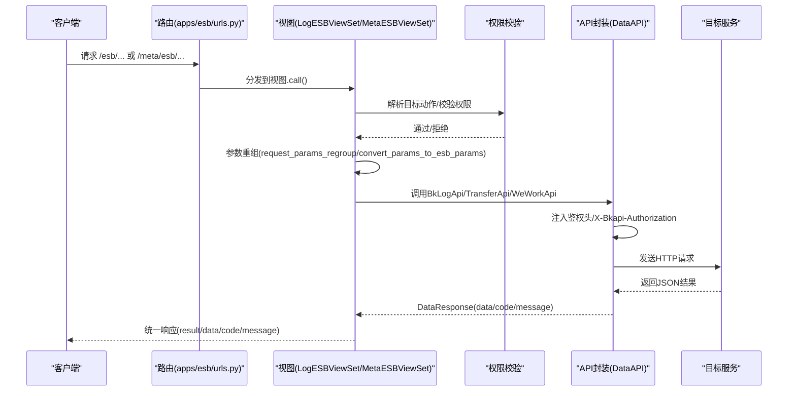
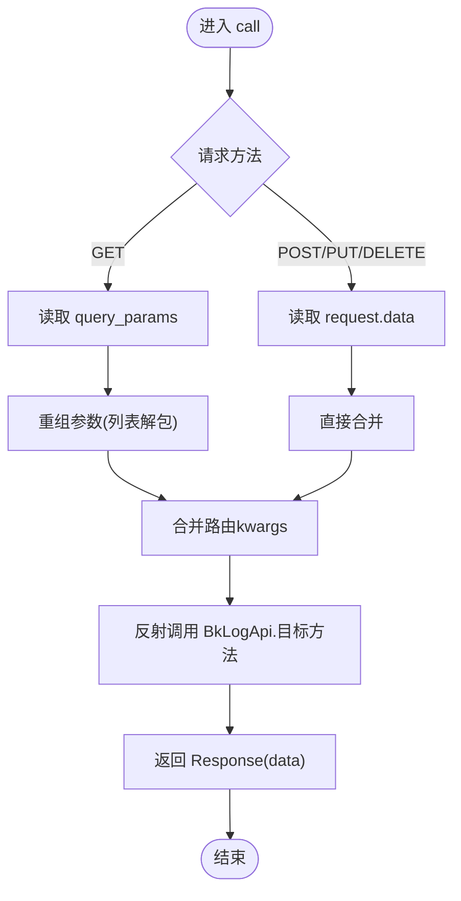
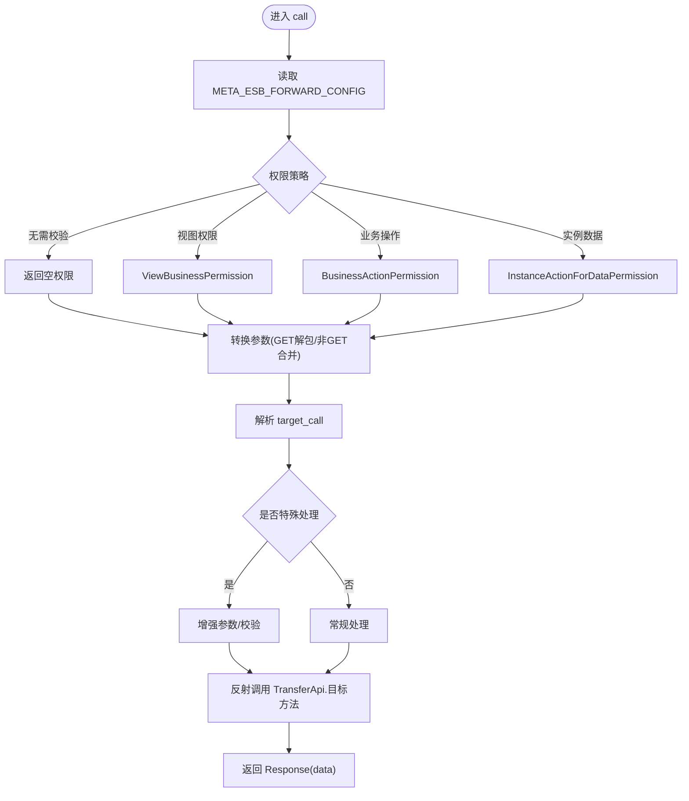
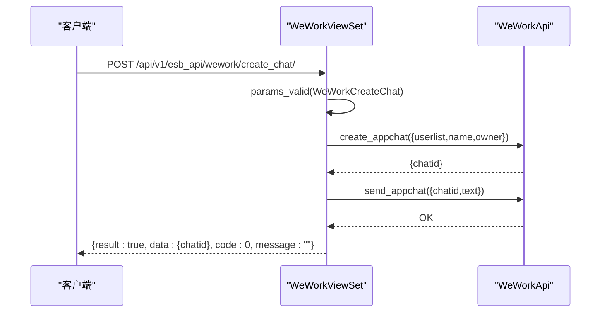
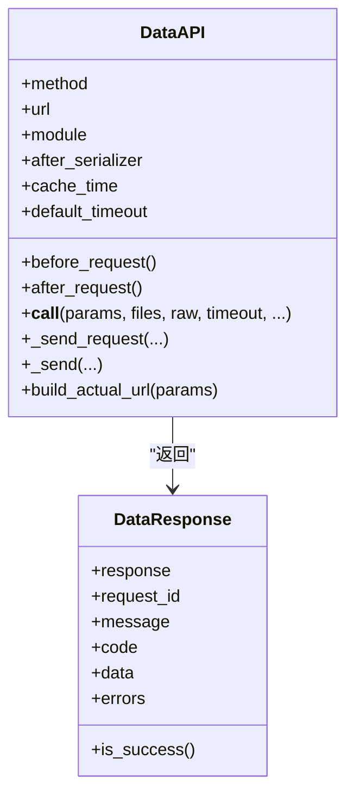
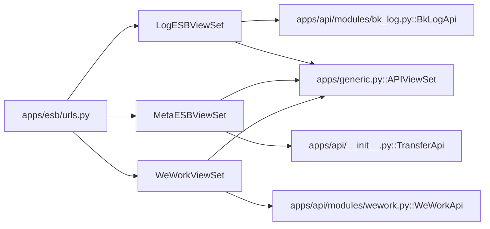

# ESB接口

<cite>
**本文引用的文件**
- [apps/esb/views.py](file://apps/esb/views.py)
- [apps/esb/urls.py](file://apps/esb/urls.py)
- [apps/esb/serializers.py](file://apps/esb/serializers.py)
- [apps/esb/exceptions.py](file://apps/esb/exceptions.py)
- [apps/generic.py](file://apps/generic.py)
- [apps/api/base.py](file://apps/api/base.py)
- [apps/api/modules/bk_log.py](file://apps/api/modules/bk_log.py)
- [apps/api/__init__.py](file://apps/api/__init__.py)
- [apps/api/modules/wework.py](file://apps/api/modules/wework.py)
</cite>

## 目录
1. [简介](#简介)
2. [项目结构](#项目结构)
3. [核心组件](#核心组件)
4. [架构总览](#架构总览)
5. [详细组件分析](#详细组件分析)
6. [依赖分析](#依赖分析)
7. [性能考虑](#性能考虑)
8. [故障排查指南](#故障排查指南)
9. [结论](#结论)
10. [附录](#附录)

## 简介
本文件面向ESB（Event Service Bus）接口的技术文档，聚焦于ESB接口的实现架构、调用流程、参数传递与响应处理、认证与权限控制、错误处理机制、序列化与数据格式化，以及与蓝鲸API网关的关系与选型建议。文档基于仓库中的ESB视图、路由、序列化器、异常定义、通用视图基类、API封装层与具体模块实现进行深入分析，并提供流程图与时序图帮助理解。

## 项目结构
ESB相关代码主要位于 apps/esb 目录，配合 apps/api 模块提供的统一API封装层，形成“ESB转发层 → API封装层 → 后端服务”的调用链路。路由层将 /esb/* 与 /meta/esb/* 的请求转发至相应的视图集合，视图层负责参数重组、权限校验与调用目标API。

图表来源
- [apps/esb/urls.py:31-37](file://apps/esb/urls.py#L31-L37)
- [apps/esb/views.py:69-141](file://apps/esb/views.py#L69-L141)
- [apps/esb/serializers.py:24-26](file://apps/esb/serializers.py#L24-L26)
- [apps/esb/exceptions.py:27-49](file://apps/esb/exceptions.py#L27-L49)
- [apps/generic.py:180-181](file://apps/generic.py#L180-L181)
- [apps/api/base.py:191-770](file://apps/api/base.py#L191-L770)
- [apps/api/modules/bk_log.py:30-124](file://apps/api/modules/bk_log.py#L30-L124)
- [apps/api/modules/wework.py:28-48](file://apps/api/modules/wework.py#L28-L48)
- [apps/api/__init__.py:67-88](file://apps/api/__init__.py#L67-L88)

章节来源
- [apps/esb/urls.py:28-37](file://apps/esb/urls.py#L28-L37)
- [apps/esb/views.py:69-141](file://apps/esb/views.py#L69-L141)
- [apps/generic.py:180-181](file://apps/generic.py#L180-L181)
- [apps/api/base.py:191-770](file://apps/api/base.py#L191-L770)

## 核心组件
- 视图集合
  - LogESBViewSet：解析目标路径与动作，执行权限校验，重组参数并调用 BkLogApi 的具体方法。
  - MetaESBViewSet：基于 META_ESB_FORWARD_CONFIG 动态配置进行权限校验与目标调用，支持特殊处理逻辑。
  - WeWorkViewSet：提供企业微信群聊创建等具体业务接口。
- 路由
  - 注册 /esb/* 与 /meta/esb/* 的任意HTTP方法到对应视图的 call 方法。
  - 注册 /esb_api/wework/* 到 WeWorkViewSet。
- 序列化器
  - WeWorkCreateChat：对群聊创建请求参数进行校验。
- 异常体系
  - BaseESBException 及 UrlNotExistError、UrlNotImplementError、MethodNotAllowedError、NotHaveInstanceIdError 等，统一错误码与消息。
- 通用视图基类
  - APIViewSet：统一响应格式、参数校验、权限混合（IAMPermissionMixin）、CSRF豁免等。
- API封装层
  - DataAPI：统一请求发送、重试、缓存、日志、鉴权头注入、参数清洗、结果标准化、分页批量请求等。
  - BkLogApi/WeWorkApi：具体模块的接口集合，前置钩子注入ESB信息。

章节来源
- [apps/esb/views.py:41-66](file://apps/esb/views.py#L41-L66)
- [apps/esb/views.py:69-141](file://apps/esb/views.py#L69-L141)
- [apps/esb/views.py:143-212](file://apps/esb/views.py#L143-L212)
- [apps/esb/urls.py:28-37](file://apps/esb/urls.py#L28-L37)
- [apps/esb/serializers.py:24-26](file://apps/esb/serializers.py#L24-L26)
- [apps/esb/exceptions.py:27-49](file://apps/esb/exceptions.py#L27-L49)
- [apps/generic.py:180-181](file://apps/generic.py#L180-L181)
- [apps/api/base.py:191-770](file://apps/api/base.py#L191-L770)
- [apps/api/modules/bk_log.py:30-124](file://apps/api/modules/bk_log.py#L30-L124)
- [apps/api/modules/wework.py:28-48](file://apps/api/modules/wework.py#L28-L48)
- [apps/api/__init__.py:67-88](file://apps/api/__init__.py#L67-L88)

## 架构总览
ESB接口采用“路由 → 视图 → 权限校验 → 参数重组 → API封装层调用 → 统一响应”的架构。其中：
- 路由层将外部请求映射到视图集合。
- 视图层解析目标URL与动作，执行权限校验，按GET/非GET重组参数。
- API封装层负责请求发送、鉴权头注入、结果标准化、缓存与重试、日志记录等。
- 响应统一为 {result, data, code, message} 格式。

图表来源
- [apps/esb/urls.py:31-37](file://apps/esb/urls.py#L31-L37)
- [apps/esb/views.py:69-141](file://apps/esb/views.py#L69-L141)
- [apps/api/base.py:528-553](file://apps/api/base.py#L528-L553)
- [apps/api/base.py:332-424](file://apps/api/base.py#L332-L424)

## 详细组件分析

### LogESBViewSet：ESB转发核心
- 权限校验
  - 通过解析目标URL定位真实视图类，复用其 get_permissions 与 has_permission，确保与后端资源权限一致。
  - 依据 ALLOWED_MODULES_FUNCS 映射校验动作是否允许转发。
- 参数重组
  - GET请求：将 query_params 中的列表值解包为标量；非GET请求：直接合并。
  - 合并路由捕获的 kwargs，形成最终调用参数。
- 调用目标
  - 从 settings.ALLOWED_MODULES_FUNCS 中解析出目标方法名，反射调用 BkLogApi 的对应方法。
- 响应
  - 直接返回 DataResponse.data，由 APIViewSet 的 FlowMixin 统一包装为 {result,data,code,message}。

图表来源
- [apps/esb/views.py:107-141](file://apps/esb/views.py#L107-L141)
- [apps/generic.py:67-76](file://apps/generic.py#L67-L76)

章节来源
- [apps/esb/views.py:69-141](file://apps/esb/views.py#L69-L141)
- [apps/generic.py:67-76](file://apps/generic.py#L67-L76)

### MetaESBViewSet：动态转发与权限
- 权限策略
  - 从 META_ESB_FORWARD_CONFIG 中读取目标配置，支持：
    - 不校验权限（need_check_permission=False）
    - 视图级权限（ViewBusinessPermission）
    - 业务操作权限（BusinessActionPermission）
    - 实例级数据权限（InstanceActionForDataPermission）
- 参数转换
  - GET请求：将 query_params 中的列表值解包为标量；非GET：直接合并。
- 特殊处理
  - 针对特定目标（如创建ES快照仓库）进行参数增强与校验。
- 调用目标
  - 通过反射调用 TransferApi 的目标方法。

图表来源
- [apps/esb/views.py:143-212](file://apps/esb/views.py#L143-L212)

章节来源
- [apps/esb/views.py:143-212](file://apps/esb/views.py#L143-L212)

### WeWorkViewSet：企业微信群聊
- 接口：创建群聊并自动发送欢迎消息。
- 参数校验：使用 WeWorkCreateChat 序列化器。
- 调用链：WeWorkApi.create_appchat → WeWorkApi.send_appchat。

图表来源
- [apps/esb/views.py:41-66](file://apps/esb/views.py#L41-L66)
- [apps/esb/serializers.py:24-26](file://apps/esb/serializers.py#L24-L26)
- [apps/api/modules/wework.py:28-48](file://apps/api/modules/wework.py#L28-L48)

章节来源
- [apps/esb/views.py:41-66](file://apps/esb/views.py#L41-L66)
- [apps/esb/serializers.py:24-26](file://apps/esb/serializers.py#L24-L26)
- [apps/api/modules/wework.py:28-48](file://apps/api/modules/wework.py#L28-L48)

### API封装层：DataAPI与统一响应
- 鉴权头注入
  - X-Bkapi-Authorization 包含 app_code/app_secret/username 等认证信息。
  - X-Bk-Tenant-Id 支持多租户。
- 请求发送
  - 支持GET/POST/PUT/PATCH/DELETE，自动设置 Content-Type、Cookies透传、超时控制。
  - 支持文件上传分离。
- 结果处理
  - 统一断言 result 字段，非标准返回会补全 result=True。
  - after_request 与 after_serializer 支持结果清洗与序列化校验。
- 缓存与重试
  - 支持缓存键构建与读取，支持自定义重试策略（异常/结果判定）。
- 日志与可观测
  - 记录请求/响应关键信息，包含 cost_time、request_id、trace_id 等。

图表来源
- [apps/api/base.py:191-770](file://apps/api/base.py#L191-L770)

章节来源
- [apps/api/base.py:191-770](file://apps/api/base.py#L191-L770)

### 错误处理与异常体系
- ESB层异常
  - UrlNotExistError、UrlNotImplementError、MethodNotAllowedError、NotHaveInstanceIdError 等，携带模块化错误码与消息。
- 通用异常处理
  - custom_exception_handler：统一将异常转为 {result:false, code, message, data, errors} 格式，支持权限异常、序列化异常、自定义异常等。
- API层异常
  - DataAPI 抛出 DataAPIException、ApiRequestError、ApiResultError 等，封装底层错误与模块信息。

章节来源
- [apps/esb/exceptions.py:27-49](file://apps/esb/exceptions.py#L27-L49)
- [apps/generic.py:299-379](file://apps/generic.py#L299-L379)
- [apps/api/base.py:318-331](file://apps/api/base.py#L318-L331)

### 认证与权限控制
- 认证方式
  - ESB层通过 X-Bkapi-Authorization 注入 app_code/app_secret/username 等认证信息，供后端服务识别调用方。
  - 通过 API封装层统一注入，避免各模块重复处理。
- 权限控制
  - LogESBViewSet：解析目标视图的真实权限策略，复用其 get_permissions 与 has_permission。
  - MetaESBViewSet：根据 META_ESB_FORWARD_CONFIG 配置选择不同权限策略（视图/业务操作/实例数据）。
  - WeWorkViewSet：使用 APIViewSet 的 ValidationMixin 与 IAMPermissionMixin 提供参数校验与权限断言能力。

章节来源
- [apps/api/base.py:528-553](file://apps/api/base.py#L528-L553)
- [apps/esb/views.py:73-106](file://apps/esb/views.py#L73-L106)
- [apps/esb/views.py:143-161](file://apps/esb/views.py#L143-L161)
- [apps/generic.py:180-181](file://apps/generic.py#L180-L181)

### 序列化与数据格式化
- 参数序列化
  - WeWorkCreateChat：对 user_list（列表）与 name（字符串）进行校验。
  - APIViewSet.params_valid：统一 GET/POST 参数校验，支持自定义序列化器。
- 响应格式
  - FlowMixin.finalize_response：将响应包装为 {result:true, data, code:0, message:""}。
  - custom_exception_handler：将各类异常格式化为 {result:false, code, message, data, errors}。

章节来源
- [apps/esb/serializers.py:24-26](file://apps/esb/serializers.py#L24-L26)
- [apps/generic.py:137-153](file://apps/generic.py#L137-L153)
- [apps/generic.py:67-76](file://apps/generic.py#L67-L76)
- [apps/generic.py:299-379](file://apps/generic.py#L299-L379)

## 依赖分析
- 路由到视图
  - /esb/* 与 /meta/esb/* → LogESBViewSet/MetaESBViewSet.call
  - /esb_api/wework/* → WeWorkViewSet.create_chat
- 视图到API封装层
  - BkLogApi（apps/api/modules/bk_log.py）：ES查询、索引、集群、Tail等接口。
  - TransferApi（apps/api/__init__.py 导出）：Meta转发目标。
  - WeWorkApi（apps/api/modules/wework.py）：企业微信群聊。
- 视图到通用基类
  - APIViewSet 继承 FlowMixin/ValidationMixin/IAMPermissionMixin，统一响应、参数校验与权限。

图表来源
- [apps/esb/urls.py:31-37](file://apps/esb/urls.py#L31-L37)
- [apps/api/__init__.py:67-88](file://apps/api/__init__.py#L67-L88)
- [apps/api/modules/bk_log.py:30-124](file://apps/api/modules/bk_log.py#L30-L124)
- [apps/api/modules/wework.py:28-48](file://apps/api/modules/wework.py#L28-L48)
- [apps/generic.py:180-181](file://apps/generic.py#L180-L181)

章节来源
- [apps/esb/urls.py:31-37](file://apps/esb/urls.py#L31-L37)
- [apps/api/__init__.py:67-88](file://apps/api/__init__.py#L67-L88)
- [apps/api/modules/bk_log.py:30-124](file://apps/api/modules/bk_log.py#L30-L124)
- [apps/api/modules/wework.py:28-48](file://apps/api/modules/wework.py#L28-L48)
- [apps/generic.py:180-181](file://apps/generic.py#L180-L181)

## 性能考虑
- 缓存
  - DataAPI 支持 cache_time，通过 _build_cache_key 生成稳定键，减少重复请求。
- 批量与分页
  - batch_request：按切片并发请求，适合大批量数据。
  - bulk_request：按分页并发请求，适合总量较大场景。
- 超时与重试
  - default_timeout 与自定义重试策略（异常/结果判定），提升稳定性。
- 日志与追踪
  - 记录 cost_time、request_id、trace_id，便于性能分析与问题定位。

章节来源
- [apps/api/base.py:482-507](file://apps/api/base.py#L482-L507)
- [apps/api/base.py:632-741](file://apps/api/base.py#L632-L741)
- [apps/api/base.py:366-424](file://apps/api/base.py#L366-L424)

## 故障排查指南
- 常见错误码
  - 001：请检查对应请求path（UrlNotExistError）
  - 002：该url暂时不支持转发（UrlNotImplementError）
  - 003：该method暂时不支持（MethodNotAllowedError）
  - 004：没有传入鉴权实例id（NotHaveInstanceIdError）
- 定位步骤
  - 检查路由是否命中 /esb/* 或 /meta/esb/*
  - 查看权限配置与 ALLOWED_MODULES_FUNCS/META_ESB_FORWARD_CONFIG
  - 关注 DataAPI 日志中的 url、module、code、message、cost_time
  - 使用 custom_exception_handler 的统一错误格式快速定位
- 调试技巧
  - 设置 DEBUG=true 查看原生异常栈（生产环境不建议开启）
  - 通过 SENSITIVE_PARAMS 过滤敏感参数日志
  - 使用 OpenTelemetry trace_id 串联请求链路

章节来源
- [apps/esb/exceptions.py:32-49](file://apps/esb/exceptions.py#L32-L49)
- [apps/api/base.py:457-481](file://apps/api/base.py#L457-L481)
- [apps/generic.py:299-379](file://apps/generic.py#L299-L379)

## 结论
ESB接口通过“路由 → 视图 → 权限 → 参数重组 → API封装 → 统一响应”的清晰分层，实现了对内部模块接口的统一转发与治理。结合 DataAPI 的鉴权、缓存、重试与日志能力，以及统一的异常与响应格式，ESB在易用性与可观测性方面具备良好表现。对于需要严格权限与多租户控制的场景，MetaESBViewSet 提供了灵活的动态配置能力。

## 附录

### 使用示例与最佳实践
- 接口调用规范
  - GET参数：列表值将被解包为标量；非GET参数：直接透传。
  - 认证：X-Bkapi-Authorization 由 DataAPI 自动注入，无需手动拼装。
- 性能优化
  - 对高频查询启用缓存（cache_time），合理设置 default_timeout。
  - 大数据量场景优先使用 batch_request/bulk_request。
- 调试技巧
  - 通过日志中的 cost_time、request_id、trace_id 快速定位问题。
  - 生产环境避免开启 DEBUG，使用 custom_exception_handler 统一错误输出。

### 与蓝鲸API网关的区别与选型
- ESB接口
  - 适用于内部模块间转发与快速集成，权限与参数校验在ESB层完成，调用链路短。
  - 适合对权限与参数有强约束的场景，且与现有视图权限体系无缝衔接。
- API网关
  - 更强调对外暴露与统一鉴权、限流、灰度发布等能力，适合跨域/跨系统的服务编排。
- 选型建议
  - 内部模块间调用、强权限控制：优先ESB。
  - 对外开放、统一治理与合规：优先API网关。