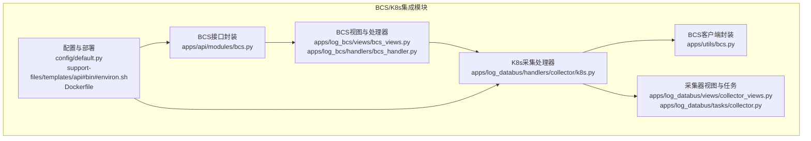
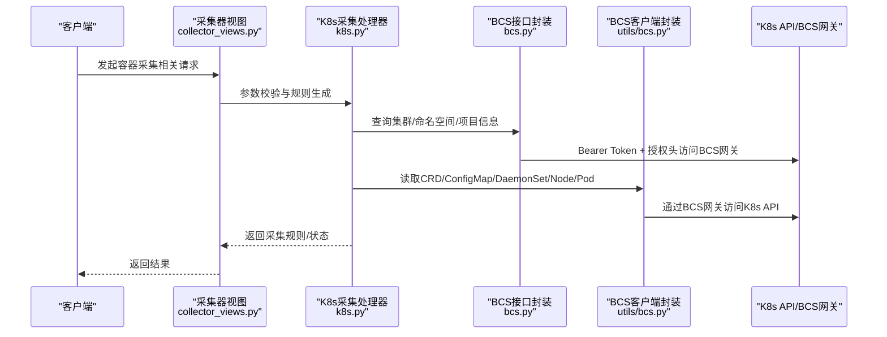
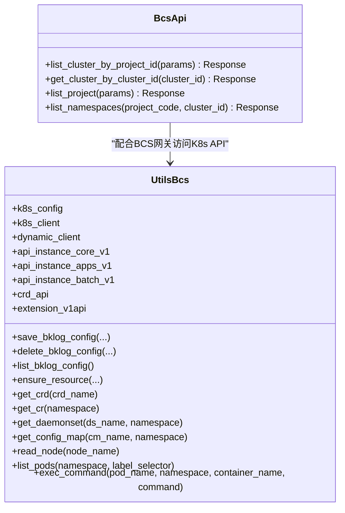
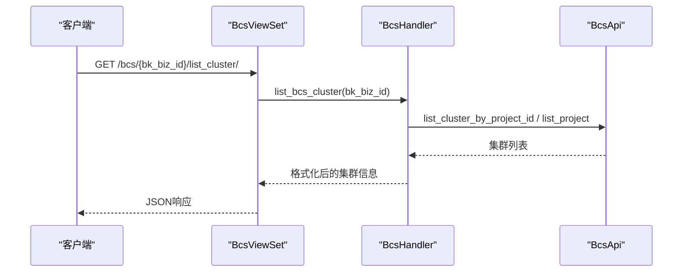
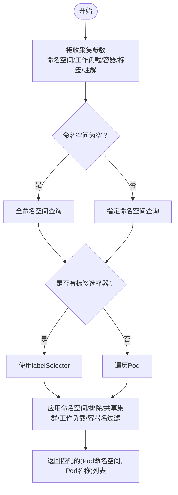
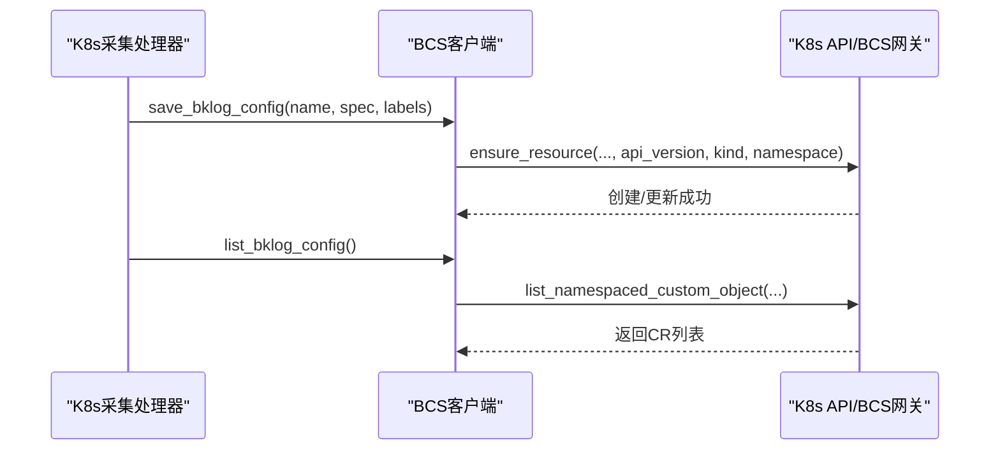
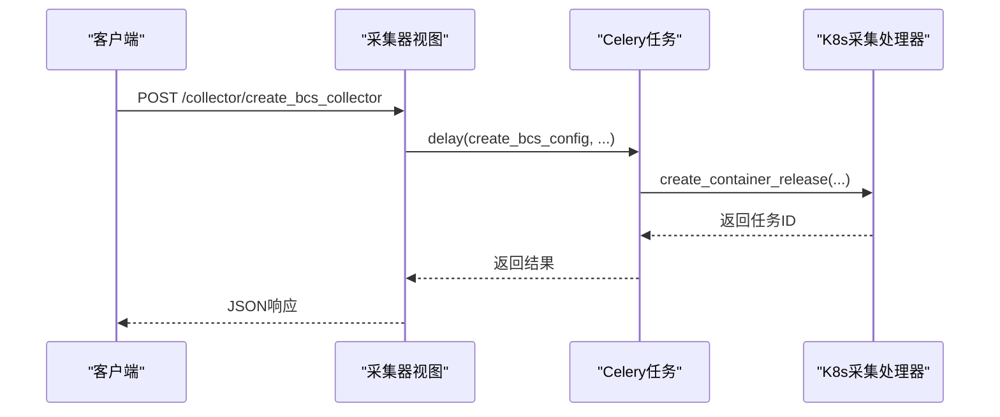
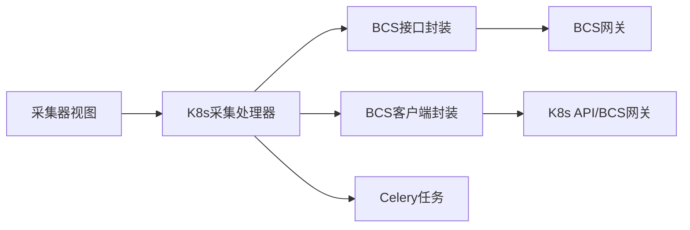

# BCS/Kubernetes集成

<cite>
**本文档引用的文件**
- [apps/log_bcs/handlers/bcs_handler.py](file://apps/log_bcs/handlers/bcs_handler.py)
- [apps/log_bcs/views/bcs_views.py](file://apps/log_bcs/views/bcs_views.py)
- [apps/log_databus/handlers/collector/k8s.py](file://apps/log_databus/handlers/collector/k8s.py)
- [apps/api/modules/bcs.py](file://apps/api/modules/bcs.py)
- [apps/utils/bcs.py](file://apps/utils/bcs.py)
- [config/default.py](file://config/default.py)
- [apps/log_databus/views/collector_views.py](file://apps/log_databus/views/collector_views.py)
- [apps/log_databus/tasks/collector.py](file://apps/log_databus/tasks/collector.py)
- [support-files/templates/api#bin#environ.sh](file://support-files/templates/api#bin#environ.sh)
- [Dockerfile](file://Dockerfile)
</cite>

## 目录
1. [简介](#简介)
2. [项目结构](#项目结构)
3. [核心组件](#核心组件)
4. [架构总览](#架构总览)
5. [详细组件分析](#详细组件分析)
6. [依赖关系分析](#依赖关系分析)
7. [性能考虑](#性能考虑)
8. [故障排查指南](#故障排查指南)
9. [结论](#结论)
10. [附录](#附录)

## 简介
本文件面向BCS/Kubernetes集成场景，系统性梳理蓝鲸日志平台在容器化环境下的集群管理、命名空间配置、Pod监控与日志采集能力。重点覆盖：
- BCS容器服务平台与Kubernetes集群的对接方式
- 集群发现、命名空间查询、资源拓扑获取
- Pod标签过滤、命名空间隔离、工作负载匹配
- 容器日志采集策略（标准输出捕获、文件日志收集、多行合并、日志轮转）
- BCS集成配置参数（API网关地址、认证令牌、集群标识）
- 容器化部署最佳实践、性能调优与故障排查

## 项目结构
围绕BCS/K8s集成的关键模块分布如下：
- BCS接口封装与视图：apps/api/modules/bcs.py、apps/log_bcs/views/bcs_views.py、apps/log_bcs/handlers/bcs_handler.py
- Kubernetes采集处理器：apps/log_databus/handlers/collector/k8s.py
- BCS客户端与K8s原生交互：apps/utils/bcs.py
- 配置与部署：config/default.py、support-files/templates/api#bin#environ.sh、Dockerfile
- 采集器视图与任务：apps/log_databus/views/collector_views.py、apps/log_databus/tasks/collector.py

**图表来源**
- [apps/api/modules/bcs.py:42-87](file://apps/api/modules/bcs.py#L42-L87)
- [apps/log_bcs/views/bcs_views.py:27-62](file://apps/log_bcs/views/bcs_views.py#L27-L62)
- [apps/log_bcs/handlers/bcs_handler.py:26-71](file://apps/log_bcs/handlers/bcs_handler.py#L26-L71)
- [apps/log_databus/handlers/collector/k8s.py:112-200](file://apps/log_databus/handlers/collector/k8s.py#L112-L200)
- [apps/utils/bcs.py:51-102](file://apps/utils/bcs.py#L51-L102)
- [config/default.py:909-919](file://config/default.py#L909-L919)
- [support-files/templates/api#bin#environ.sh:55-59](file://support-files/templates/api#bin#environ.sh#L55-L59)
- [Dockerfile:1-23](file://Dockerfile#L1-L23)

**章节来源**
- [apps/api/modules/bcs.py:42-87](file://apps/api/modules/bcs.py#L42-L87)
- [apps/log_bcs/views/bcs_views.py:27-62](file://apps/log_bcs/views/bcs_views.py#L27-L62)
- [apps/log_bcs/handlers/bcs_handler.py:26-71](file://apps/log_bcs/handlers/bcs_handler.py#L26-L71)
- [apps/log_databus/handlers/collector/k8s.py:112-200](file://apps/log_databus/handlers/collector/k8s.py#L112-L200)
- [apps/utils/bcs.py:51-102](file://apps/utils/bcs.py#L51-L102)
- [config/default.py:909-919](file://config/default.py#L909-L919)
- [support-files/templates/api#bin#environ.sh:55-59](file://support-files/templates/api#bin#environ.sh#L55-L59)
- [Dockerfile:1-23](file://Dockerfile#L1-L23)

## 核心组件
- BCS接口封装：提供集群列表、集群详情、项目列表、命名空间列表等API调用，统一鉴权头与租户映射。
- BCS视图与处理器：对外暴露集群列表查询接口，内部根据业务空间类型选择不同查询路径。
- K8s采集处理器：负责容器日志采集规则生成、Pod筛选、命名空间与标签过滤、CRD下发、任务状态查询等。
- BCS客户端封装：基于Kubernetes Python SDK与动态客户端，封装CRD、ConfigMap、DaemonSet、Node等资源操作。
- 配置与部署：集中定义BCS API网关、认证令牌、CRD版本、容器采集配置目录等关键参数。

**章节来源**
- [apps/api/modules/bcs.py:42-87](file://apps/api/modules/bcs.py#L42-L87)
- [apps/log_bcs/handlers/bcs_handler.py:26-71](file://apps/log_bcs/handlers/bcs_handler.py#L26-L71)
- [apps/log_databus/handlers/collector/k8s.py:112-200](file://apps/log_databus/handlers/collector/k8s.py#L112-L200)
- [apps/utils/bcs.py:51-102](file://apps/utils/bcs.py#L51-L102)
- [config/default.py:909-919](file://config/default.py#L909-L919)

## 架构总览
下图展示从BCS/K8s采集入口到Kubernetes API与BCS API网关的整体流程：

**图表来源**
- [apps/log_databus/views/collector_views.py:2096-2186](file://apps/log_databus/views/collector_views.py#L2096-L2186)
- [apps/log_databus/handlers/collector/k8s.py:112-200](file://apps/log_databus/handlers/collector/k8s.py#L112-L200)
- [apps/api/modules/bcs.py:30-33](file://apps/api/modules/bcs.py#L30-L33)
- [apps/utils/bcs.py:64-102](file://apps/utils/bcs.py#L64-L102)

## 详细组件分析

### BCS接口封装与集群发现
- 统一鉴权：在请求前自动附加Authorization头与ESB信息，确保BCS网关鉴权通过。
- 集群查询：支持按项目ID查询集群列表、按集群ID查询集群详情、获取项目列表、列出命名空间。
- 缓存策略：部分接口启用短时缓存，降低频繁查询成本。

**图表来源**
- [apps/api/modules/bcs.py:42-87](file://apps/api/modules/bcs.py#L42-L87)
- [apps/utils/bcs.py:51-102](file://apps/utils/bcs.py#L51-L102)

**章节来源**
- [apps/api/modules/bcs.py:30-33](file://apps/api/modules/bcs.py#L30-L33)
- [apps/api/modules/bcs.py:46-64](file://apps/api/modules/bcs.py#L46-L64)
- [apps/api/modules/bcs.py:75-87](file://apps/api/modules/bcs.py#L75-L87)
- [apps/utils/bcs.py:64-102](file://apps/utils/bcs.py#L64-L102)

### BCS视图与集群列表查询
- 视图层提供按业务ID查询BCS集群列表的接口，内部通过空间类型判断走不同查询路径（业务空间或BCS项目空间）。
- 返回字段包含区域、项目、集群ID、环境、状态、是否开启日志采集等。

**图表来源**
- [apps/log_bcs/views/bcs_views.py:31-62](file://apps/log_bcs/views/bcs_views.py#L31-L62)
- [apps/log_bcs/handlers/bcs_handler.py:37-71](file://apps/log_bcs/handlers/bcs_handler.py#L37-L71)
- [apps/api/modules/bcs.py:46-64](file://apps/api/modules/bcs.py#L46-L64)

**章节来源**
- [apps/log_bcs/views/bcs_views.py:31-62](file://apps/log_bcs/views/bcs_views.py#L31-L62)
- [apps/log_bcs/handlers/bcs_handler.py:37-71](file://apps/log_bcs/handlers/bcs_handler.py#L37-L71)

### K8s采集处理器与Pod筛选
- 采集规则生成：支持基于命名空间、工作负载类型/名称、容器名称、标签/注解选择器、多行合并等参数生成容器采集配置。
- Pod筛选：支持按命名空间、命名空间排除、共享集群命名空间白名单、工作负载类型/名称正则、容器名称包含/排除等条件过滤。
- 标签与注解过滤：支持表达式形式的标签/注解匹配，生成K8s API的labelSelector或annotationSelector。
- 任务状态：提供容器采集任务状态查询与重试能力。

**图表来源**
- [apps/log_databus/handlers/collector/k8s.py:2034-2089](file://apps/log_databus/handlers/collector/k8s.py#L2034-L2089)
- [apps/log_databus/handlers/collector/k8s.py:2159-2188](file://apps/log_databus/handlers/collector/k8s.py#L2159-L2188)

**章节来源**
- [apps/log_databus/handlers/collector/k8s.py:1498-1884](file://apps/log_databus/handlers/collector/k8s.py#L1498-L1884)
- [apps/log_databus/handlers/collector/k8s.py:2034-2089](file://apps/log_databus/handlers/collector/k8s.py#L2034-L2089)
- [apps/log_databus/handlers/collector/k8s.py:2159-2188](file://apps/log_databus/handlers/collector/k8s.py#L2159-L2188)

### CRD下发与K8s原生集成
- CRD资源管理：支持创建/更新/删除BkLogConfig CRD，确保采集配置在目标集群生效。
- 资源查询：支持读取ConfigMap、DaemonSet、Node、Pod等资源，便于诊断与运维。
- 命令执行：支持在指定Pod/容器内执行命令，辅助排障。

**图表来源**
- [apps/log_databus/handlers/collector/k8s.py:112-200](file://apps/log_databus/handlers/collector/k8s.py#L112-L200)
- [apps/utils/bcs.py:104-167](file://apps/utils/bcs.py#L104-L167)
- [apps/utils/bcs.py:141-144](file://apps/utils/bcs.py#L141-L144)

**章节来源**
- [apps/utils/bcs.py:104-167](file://apps/utils/bcs.py#L104-L167)
- [apps/utils/bcs.py:141-144](file://apps/utils/bcs.py#L141-L144)

### 采集器视图与任务调度
- 采集器管理：提供创建、启动、停止、删除、重试、存储切换等接口。
- 任务调度：通过Celery异步任务执行容器采集配置的创建/删除/重试等操作。

**图表来源**
- [apps/log_databus/views/collector_views.py:2136-2186](file://apps/log_databus/views/collector_views.py#L2136-L2186)
- [apps/log_databus/tasks/collector.py:379-391](file://apps/log_databus/tasks/collector.py#L379-L391)

**章节来源**
- [apps/log_databus/views/collector_views.py:2096-2186](file://apps/log_databus/views/collector_views.py#L2096-L2186)
- [apps/log_databus/tasks/collector.py:379-391](file://apps/log_databus/tasks/collector.py#L379-L391)

## 依赖关系分析
- 组件耦合：采集处理器依赖BCS接口封装与BCS客户端封装；视图层依赖采集处理器；配置层贯穿各模块。
- 外部依赖：BCS API网关、Kubernetes API、Celery任务队列、Redis缓存等。
- 关键依赖链：
  - 视图层 → 采集处理器 → BCS接口封装 → BCS API网关
  - 采集处理器 → BCS客户端封装 → K8s API/BCS网关
  - 采集处理器 → Celery任务 → 容器采集配置下发

**图表来源**
- [apps/log_databus/views/collector_views.py:2096-2186](file://apps/log_databus/views/collector_views.py#L2096-L2186)
- [apps/log_databus/handlers/collector/k8s.py:112-200](file://apps/log_databus/handlers/collector/k8s.py#L112-L200)
- [apps/api/modules/bcs.py:42-87](file://apps/api/modules/bcs.py#L42-L87)
- [apps/utils/bcs.py:51-102](file://apps/utils/bcs.py#L51-L102)

**章节来源**
- [apps/log_databus/views/collector_views.py:2096-2186](file://apps/log_databus/views/collector_views.py#L2096-L2186)
- [apps/log_databus/handlers/collector/k8s.py:112-200](file://apps/log_databus/handlers/collector/k8s.py#L112-L200)
- [apps/api/modules/bcs.py:42-87](file://apps/api/modules/bcs.py#L42-L87)
- [apps/utils/bcs.py:51-102](file://apps/utils/bcs.py#L51-L102)

## 性能考虑
- API缓存：BCS接口封装对部分查询启用短时缓存，减少重复请求。
- 异步任务：容器采集配置创建/删除/重试通过Celery异步执行，避免阻塞主线程。
- 资源查询优化：在标签/注解过滤时尽量使用labelSelector，缩小查询范围。
- 日志轮转与多行合并：合理配置多行合并参数，避免过大批次上报导致延迟。

[本节为通用指导，无需特定文件引用]

## 故障排查指南
- 集群查询失败
  - 检查BCS API网关地址与认证令牌配置是否正确。
  - 确认Bearer Token是否有效，网络连通性是否正常。
- Pod筛选异常
  - 核对命名空间、工作负载类型/名称、容器名称匹配规则。
  - 检查标签/注解选择器表达式格式是否符合K8s规范。
- CRD下发失败
  - 确认目标集群已安装对应CRD版本，且具有相应RBAC权限。
  - 查看BCS网关返回错误，定位具体资源创建/更新问题。
- 采集任务状态异常
  - 通过任务状态查询接口确认容器采集配置状态。
  - 必要时触发重试或删除后重建。

**章节来源**
- [apps/api/modules/bcs.py:30-33](file://apps/api/modules/bcs.py#L30-L33)
- [apps/utils/bcs.py:146-167](file://apps/utils/bcs.py#L146-L167)
- [apps/log_databus/handlers/collector/k8s.py:1545-1627](file://apps/log_databus/handlers/collector/k8s.py#L1545-L1627)

## 结论
本方案通过BCS接口封装与K8s采集处理器，实现了对BCS/Kubernetes集群的完整集成：从集群发现、命名空间与资源查询，到Pod标签/注解过滤、工作负载匹配与容器日志采集，再到CRD下发与任务状态管理。结合配置层的统一参数与部署脚本，能够满足生产环境的稳定性与可维护性要求。

[本节为总结性内容，无需特定文件引用]

## 附录

### BCS集成配置参数清单
- BCS API网关主机与端口：用于访问BCS网关的主机与端口配置
- BCS API网关认证令牌：用于请求BCS网关的Bearer Token
- CRD版本与Kind：用于定义BkLogConfig CRD的API版本、Kind与Plural
- 容器采集配置目录：容器侧采集配置文件的挂载目录
- 容器采集CR全局标签：用于在CR上追加全局标签

**章节来源**
- [config/default.py:909-919](file://config/default.py#L909-L919)
- [support-files/templates/api#bin#environ.sh:55-59](file://support-files/templates/api#bin#environ.sh#L55-L59)

### 容器化部署最佳实践
- 使用Docker镜像构建Python虚拟环境，预装依赖，提升启动效率。
- 通过环境变量传递BCS网关地址与认证令牌，避免硬编码。
- 在Kubernetes中为日志采集组件配置合适的资源限制与探针，保障稳定性。

**章节来源**
- [Dockerfile:1-23](file://Dockerfile#L1-L23)
- [support-files/templates/api#bin#environ.sh:55-59](file://support-files/templates/api#bin#environ.sh#L55-L59)