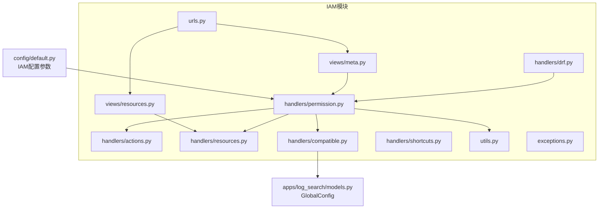
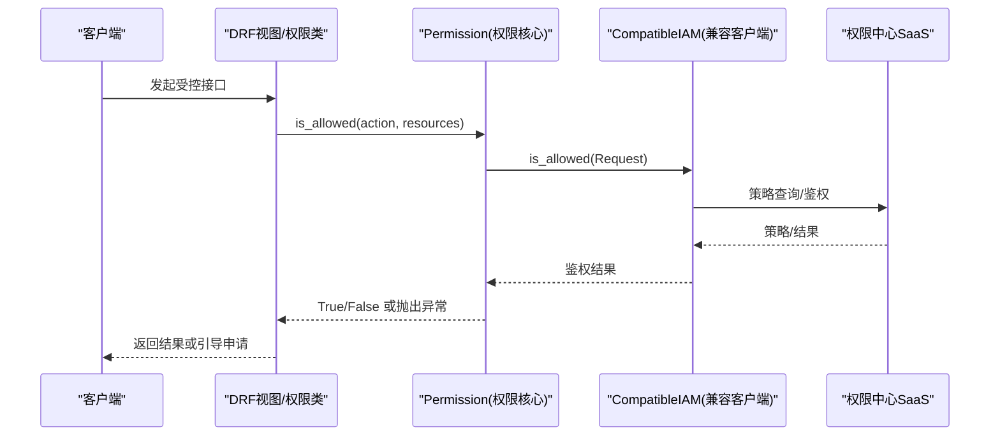
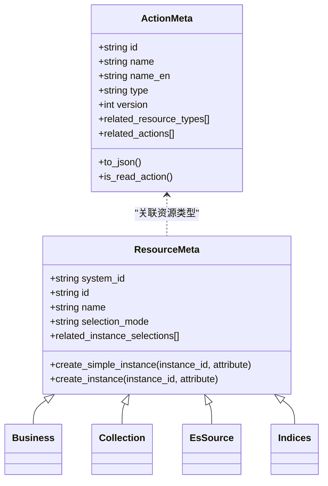
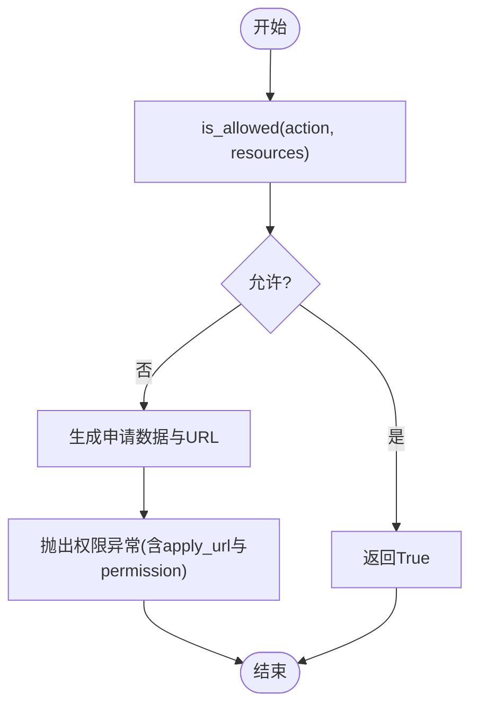
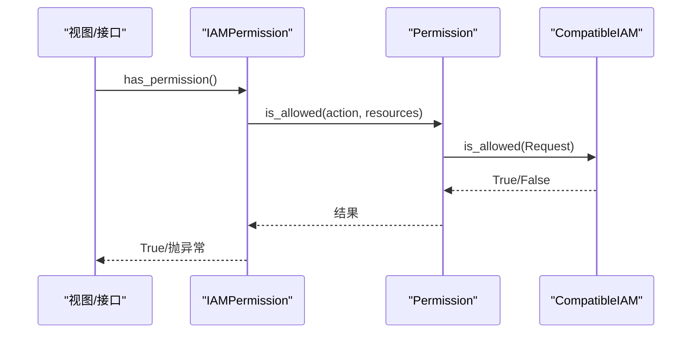
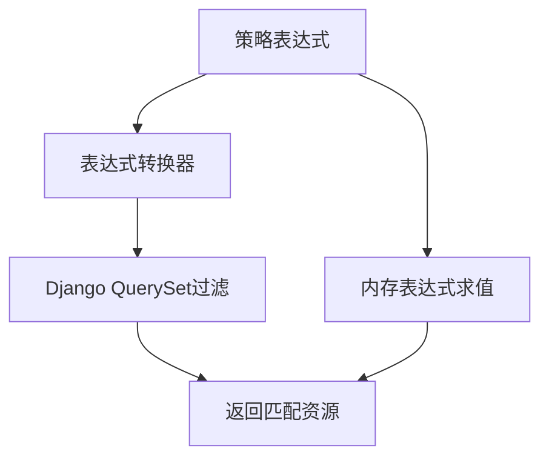
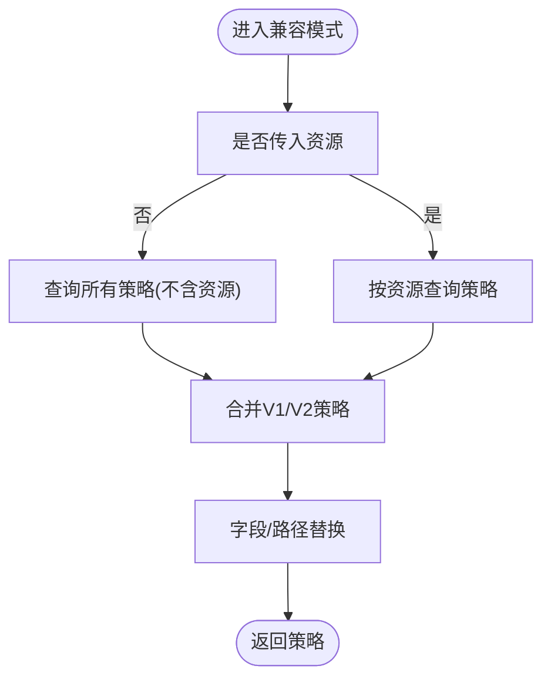
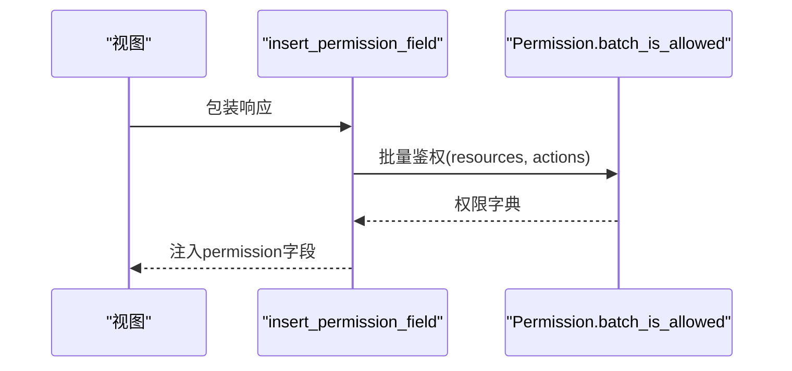
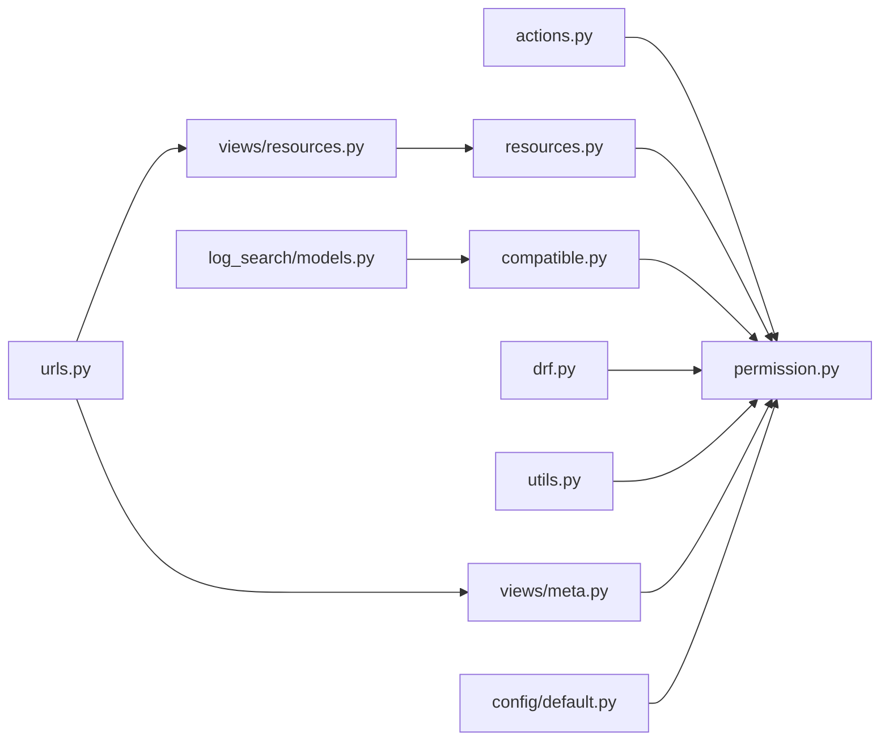

# IAM权限集成

<cite>
**本文引用的文件**
- [apps/iam/handlers/__init__.py](file://apps/iam/handlers/__init__.py)
- [apps/iam/handlers/actions.py](file://apps/iam/handlers/actions.py)
- [apps/iam/handlers/resources.py](file://apps/iam/handlers/resources.py)
- [apps/iam/handlers/permission.py](file://apps/iam/handlers/permission.py)
- [apps/iam/handlers/drf.py](file://apps/iam/handlers/drf.py)
- [apps/iam/handlers/compatible.py](file://apps/iam/handlers/compatible.py)
- [apps/iam/handlers/shortcuts.py](file://apps/iam/handlers/shortcuts.py)
- [apps/iam/utils.py](file://apps/iam/utils.py)
- [apps/iam/views/meta.py](file://apps/iam/views/meta.py)
- [apps/iam/views/resources.py](file://apps/iam/views/resources.py)
- [apps/iam/urls.py](file://apps/iam/urls.py)
- [apps/iam/exceptions.py](file://apps/iam/exceptions.py)
- [apps/log_search/models.py](file://apps/log_search/models.py)
- [config/default.py](file://config/default.py)
</cite>

## 目录
1. [简介](#简介)
2. [项目结构](#项目结构)
3. [核心组件](#核心组件)
4. [架构总览](#架构总览)
5. [详细组件分析](#详细组件分析)
6. [依赖关系分析](#依赖关系分析)
7. [性能考量](#性能考量)
8. [故障排查指南](#故障排查指南)
9. [结论](#结论)
10. [附录](#附录)

## 简介
本文件面向BKLog项目的IAM权限集成，系统性阐述与权限中心的对接实现，覆盖权限模型设计（资源类型、操作权限映射、授权策略）、权限申请与审批流程、权限验证（RBAC、继承与动态计算）、配置参数、安全与审计、以及运维排障与最佳实践。文档以代码为依据，结合可视化图示帮助读者快速理解并落地实施。

## 项目结构
IAM相关能力集中在apps/iam目录，采用“处理器+视图+工具”的分层组织：
- handlers：权限核心逻辑（动作、资源、鉴权、DRF插件、兼容客户端、快捷入口）
- views：对外API（系统元信息、资源鉴权、资源Provider）
- utils：权限申请数据生成工具
- urls：路由注册（Meta API + 资源Provider）

**图表来源**
- [apps/iam/handlers/permission.py:57-120](file://apps/iam/handlers/permission.py#L57-L120)
- [apps/iam/handlers/actions.py:76-291](file://apps/iam/handlers/actions.py#L76-L291)
- [apps/iam/handlers/resources.py:34-240](file://apps/iam/handlers/resources.py#L34-L240)
- [apps/iam/handlers/drf.py:41-269](file://apps/iam/handlers/drf.py#L41-L269)
- [apps/iam/handlers/compatible.py:9-140](file://apps/iam/handlers/compatible.py#L9-L140)
- [apps/iam/utils.py:6-79](file://apps/iam/utils.py#L6-L79)
- [apps/iam/views/meta.py:30-200](file://apps/iam/views/meta.py#L30-L200)
- [apps/iam/views/resources.py:40-480](file://apps/iam/views/resources.py#L40-L480)
- [apps/iam/urls.py:38-52](file://apps/iam/urls.py#L38-L52)
- [apps/log_search/models.py:107-180](file://apps/log_search/models.py#L107-L180)
- [config/default.py:421-422](file://config/default.py#L421-L422)

**章节来源**
- [apps/iam/urls.py:38-52](file://apps/iam/urls.py#L38-L52)
- [apps/iam/handlers/__init__.py:23-31](file://apps/iam/handlers/__init__.py#L23-L31)

## 核心组件
- 动作与资源定义：集中于动作与资源枚举，定义动作类型、关联资源、版本与依赖；资源元数据负责实例化与路径补全。
- 权限核心：封装IAM客户端、批量鉴权、申请数据生成、系统信息拉取、多租户适配。
- DRF插件：基于REST Framework的权限类，支持业务动作、实例动作、批量实例动作与返回数据注入权限字段。
- 兼容客户端：兼容V1/V2策略查询，支持批量鉴权与策略合并。
- 视图层：提供系统信息、权限检查、申请数据生成接口；资源Provider实现资源列表、搜索、策略匹配等。
- 工具与快捷入口：生成申请数据、断言权限。

**章节来源**
- [apps/iam/handlers/actions.py:76-291](file://apps/iam/handlers/actions.py#L76-L291)
- [apps/iam/handlers/resources.py:34-240](file://apps/iam/handlers/resources.py#L34-L240)
- [apps/iam/handlers/permission.py:57-444](file://apps/iam/handlers/permission.py#L57-L444)
- [apps/iam/handlers/drf.py:41-269](file://apps/iam/handlers/drf.py#L41-L269)
- [apps/iam/handlers/compatible.py:9-140](file://apps/iam/handlers/compatible.py#L9-L140)
- [apps/iam/views/meta.py:30-200](file://apps/iam/views/meta.py#L30-L200)
- [apps/iam/views/resources.py:40-480](file://apps/iam/views/resources.py#L40-L480)
- [apps/iam/utils.py:6-79](file://apps/iam/utils.py#L6-L79)
- [apps/iam/handlers/shortcuts.py:29-34](file://apps/iam/handlers/shortcuts.py#L29-L34)

## 架构总览
IAM集成围绕“动作-资源-策略”三要素展开，系统通过DRF中间件与视图层发起鉴权请求，权限核心封装IAM客户端，兼容模式处理V1/V2策略差异，资源Provider负责资源列表与策略匹配，Meta API提供系统信息与权限检查。

**图表来源**
- [apps/iam/handlers/drf.py:41-74](file://apps/iam/handlers/drf.py#L41-L74)
- [apps/iam/handlers/permission.py:249-283](file://apps/iam/handlers/permission.py#L249-L283)
- [apps/iam/handlers/compatible.py:47-91](file://apps/iam/handlers/compatible.py#L47-L91)

## 详细组件分析

### 权限模型设计
- 动作（Action）：以ActionMeta封装动作元数据，含ID、名称、类型（view/create/manage）、版本、关联资源类型与依赖动作，支持递归获取依赖动作集合。
- 资源（Resource）：以ResourceMeta封装资源元数据，含系统ID、资源ID、选择模式、实例选择器；提供简单实例与完整实例创建，自动补全路径与属性。
- 关联关系：动作可声明关联资源类型，权限校验时需提供对应资源实例；资源实例可携带业务ID与路径，便于策略匹配。

**图表来源**
- [apps/iam/handlers/actions.py:29-75](file://apps/iam/handlers/actions.py#L29-L75)
- [apps/iam/handlers/resources.py:34-126](file://apps/iam/handlers/resources.py#L34-L126)

**章节来源**
- [apps/iam/handlers/actions.py:76-291](file://apps/iam/handlers/actions.py#L76-L291)
- [apps/iam/handlers/resources.py:80-240](file://apps/iam/handlers/resources.py#L80-L240)

### 权限申请与审批流程
- 无权限引导：当鉴权失败且raise_exception=True时，权限核心生成申请数据与跳转URL，前端引导用户前往权限中心申请。
- 申请数据生成：按动作与资源聚合，生成标准申请协议数据，包含系统、动作、关联资源类型与实例列表。
- 批量申请：支持多动作、多资源组合生成申请数据，便于一次性提交。

**图表来源**
- [apps/iam/handlers/permission.py:187-222](file://apps/iam/handlers/permission.py#L187-L222)
- [apps/iam/handlers/permission.py:275-283](file://apps/iam/handlers/permission.py#L275-L283)
- [apps/iam/utils.py:6-79](file://apps/iam/utils.py#L6-L79)

**章节来源**
- [apps/iam/handlers/permission.py:187-222](file://apps/iam/handlers/permission.py#L187-L222)
- [apps/iam/utils.py:6-79](file://apps/iam/utils.py#L6-L79)

### 权限验证与RBAC实现
- RBAC模型：以用户(subject)、动作(action)、资源(resources)为核心，结合策略表达式进行判定。
- 动态权限计算：支持批量资源与动作的组合校验，兼容演示业务的权限豁免策略。
- 权限继承：动作可声明依赖动作，系统在生成申请数据时可递归纳入依赖动作，确保完整授权链。
- 路径与属性：资源实例携带业务ID与路径，策略匹配时可基于路径进行过滤。

**图表来源**
- [apps/iam/handlers/drf.py:41-74](file://apps/iam/handlers/drf.py#L41-L74)
- [apps/iam/handlers/permission.py:249-283](file://apps/iam/handlers/permission.py#L249-L283)

**章节来源**
- [apps/iam/handlers/drf.py:41-170](file://apps/iam/handlers/drf.py#L41-L170)
- [apps/iam/handlers/permission.py:249-314](file://apps/iam/handlers/permission.py#L249-L314)

### 资源Provider与策略匹配
- Provider职责：提供资源列表、搜索、实例详情与策略匹配能力；支持多租户模式下的资源过滤。
- 策略匹配：通过表达式转换器将IAM策略表达式转换为数据库查询，或在内存中评估表达式，筛选满足条件的资源。
- 路径构建：资源实例自动补全业务路径，便于策略按业务维度匹配。

**图表来源**
- [apps/iam/views/resources.py:131-152](file://apps/iam/views/resources.py#L131-L152)
- [apps/iam/views/resources.py:304-330](file://apps/iam/views/resources.py#L304-L330)

**章节来源**
- [apps/iam/views/resources.py:55-177](file://apps/iam/views/resources.py#L55-L177)
- [apps/iam/views/resources.py:179-353](file://apps/iam/views/resources.py#L179-L353)
- [apps/iam/views/resources.py:355-480](file://apps/iam/views/resources.py#L355-L480)

### 兼容模式与V1/V2策略
- 兼容模式开关：通过全局配置读取兼容模式开关，未配置时默认开启。
- 策略查询：在兼容模式下，同时查询V1与V2策略，合并表达式；对V1策略进行字段替换，保证策略一致性。
- 批量鉴权：支持不传资源进行批量策略查询，再逐个资源计算结果。

**图表来源**
- [apps/iam/handlers/compatible.py:14-30](file://apps/iam/handlers/compatible.py#L14-L30)
- [apps/iam/handlers/compatible.py:47-91](file://apps/iam/handlers/compatible.py#L47-L91)
- [apps/iam/handlers/compatible.py:92-140](file://apps/iam/handlers/compatible.py#L92-L140)

**章节来源**
- [apps/iam/handlers/compatible.py:9-140](file://apps/iam/handlers/compatible.py#L9-L140)
- [apps/log_search/models.py:107-180](file://apps/log_search/models.py#L107-L180)

### DRF权限插件与返回数据注入
- 权限类：IAMPermission、BusinessActionPermission、InstanceActionPermission、BatchIAMPermission等，覆盖不同场景的权限校验。
- 返回数据注入：insert_permission_field装饰器在序列化后批量注入权限字段，支持条件豁免与多条数据处理。

**图表来源**
- [apps/iam/handlers/drf.py:198-269](file://apps/iam/handlers/drf.py#L198-L269)
- [apps/iam/handlers/permission.py:295-314](file://apps/iam/handlers/permission.py#L295-L314)

**章节来源**
- [apps/iam/handlers/drf.py:41-269](file://apps/iam/handlers/drf.py#L41-L269)
- [apps/iam/handlers/permission.py:295-314](file://apps/iam/handlers/permission.py#L295-L314)

### API与路由
- Meta API：提供系统信息、权限检查、申请数据生成接口，便于前端侧预检与引导。
- 资源Provider：注册collection/es_source/indices三种资源的Provider，供权限中心资源管理使用。
- 路由：统一注册Meta与资源Provider路由。

**章节来源**
- [apps/iam/views/meta.py:30-200](file://apps/iam/views/meta.py#L30-L200)
- [apps/iam/views/resources.py:40-480](file://apps/iam/views/resources.py#L40-L480)
- [apps/iam/urls.py:38-52](file://apps/iam/urls.py#L38-L52)

## 依赖关系分析
- 权限核心依赖动作与资源元数据，通过兼容客户端与权限中心交互；DRF插件依赖权限核心；Meta与Provider视图依赖权限核心与资源Provider。
- 配置参数通过settings传递，兼容模式依赖全局配置读取。

**图表来源**
- [apps/iam/handlers/permission.py:57-120](file://apps/iam/handlers/permission.py#L57-L120)
- [apps/iam/handlers/drf.py:41-74](file://apps/iam/handlers/drf.py#L41-L74)
- [apps/iam/views/meta.py:30-50](file://apps/iam/views/meta.py#L30-L50)
- [apps/iam/views/resources.py:40-480](file://apps/iam/views/resources.py#L40-L480)
- [apps/iam/urls.py:38-52](file://apps/iam/urls.py#L38-L52)
- [apps/log_search/models.py:107-180](file://apps/log_search/models.py#L107-L180)
- [config/default.py:421-422](file://config/default.py#L421-L422)

**章节来源**
- [apps/iam/handlers/permission.py:57-120](file://apps/iam/handlers/permission.py#L57-L120)
- [apps/iam/urls.py:38-52](file://apps/iam/urls.py#L38-L52)

## 性能考量
- 批量鉴权：优先使用批量接口减少权限中心往返次数；在兼容模式下，可通过“无资源查询”统一策略后再逐资源计算，降低复杂度。
- 策略表达式：尽量使用路径字段进行粗粒度过滤，减少内存求值成本。
- 缓存与开关：通过全局配置控制兼容模式与演示业务豁免，避免不必要的鉴权开销。
- 多租户过滤：在Provider中尽早过滤租户范围内的资源，缩小策略匹配范围。

[本节为通用指导，无需特定文件引用]

## 故障排查指南
- 异常类型：动作不存在、资源不存在、系统信息获取失败、缺少实例ID、权限拒绝等。
- 常见问题定位：
  - 鉴权失败：检查动作ID与资源类型是否正确，确认资源实例属性与路径是否完整。
  - 兼容模式异常：确认全局配置开关状态，核对V1/V2策略是否正确合并。
  - 申请数据为空：确认动作是否声明关联资源类型，资源实例是否有效。
  - 权限拒绝异常：捕获异常并记录apply_url与permission，引导用户申请。
- 日志与调试：启用IAM模块日志，观察策略查询与表达式求值过程。

**章节来源**
- [apps/iam/exceptions.py:29-65](file://apps/iam/exceptions.py#L29-L65)
- [apps/iam/handlers/permission.py:275-283](file://apps/iam/handlers/permission.py#L275-L283)
- [apps/iam/handlers/compatible.py:47-91](file://apps/iam/handlers/compatible.py#L47-L91)

## 结论
本IAM集成以清晰的动作-资源-策略模型为基础，通过权限核心与兼容客户端实现对权限中心的稳定对接，配合DRF插件与Meta/Provider视图，覆盖从权限校验到资源管理的全链路能力。通过批量鉴权、策略合并与路径过滤等手段优化性能，并提供完善的异常与申请引导机制，保障生产可用性与可观测性。

[本节为总结性内容，无需特定文件引用]

## 附录

### IAM集成配置参数
- 权限中心网关地址：BK_IAM_APIGATEWAY_URL
- 应用ID与密钥：APP_CODE、SECRET_KEY
- 权限中心系统ID与名称：BK_IAM_SYSTEM_ID、BK_IAM_SYSTEM_NAME
- SaaS主机：BK_IAM_SAAS_HOST
- 租户ID：BK_APP_TENANT_ID
- 跳过权限校验开关：IGNORE_IAM_PERMISSION、SKIP_IAM_PERMISSION_CHECK
- 演示业务ID与编辑开关：DEMO_BIZ_ID、DEMO_BIZ_EDIT_ENABLED
- 兼容模式开关：IAM_V1_COMPATIBLE（通过GlobalConfig读取）

**章节来源**
- [config/default.py:421-422](file://config/default.py#L421-L422)
- [apps/iam/handlers/permission.py:62-92](file://apps/iam/handlers/permission.py#L62-L92)
- [apps/iam/handlers/permission.py:224-248](file://apps/iam/handlers/permission.py#L224-L248)
- [apps/log_search/models.py:107-180](file://apps/log_search/models.py#L107-L180)

### 权限模型与动作/资源清单
- 动作示例：业务访问、日志检索、采集查看/新建/管理、ES源配置新建/管理、索引集配置新建/管理、仪表盘查看/管理、脱敏规则管理、客户端日志下载/任务创建等。
- 资源示例：业务(BUSINESS)、采集项(COLLECTION)、ES源(ES_SOURCE)、索引集(INDICES)。

**章节来源**
- [apps/iam/handlers/actions.py:76-291](file://apps/iam/handlers/actions.py#L76-L291)
- [apps/iam/handlers/resources.py:80-240](file://apps/iam/handlers/resources.py#L80-L240)

### 安全与审计要点
- 权限最小化：仅授予完成任务所需的最小权限集合，避免过度授权。
- 审计日志：结合系统日志与权限中心审计，记录关键操作与异常。
- 异常检测：对鉴权失败、策略缺失、兼容模式切换等事件建立告警。
- 多租户隔离：通过租户ID与Provider过滤，确保资源边界清晰。

[本节为通用指导，无需特定文件引用]