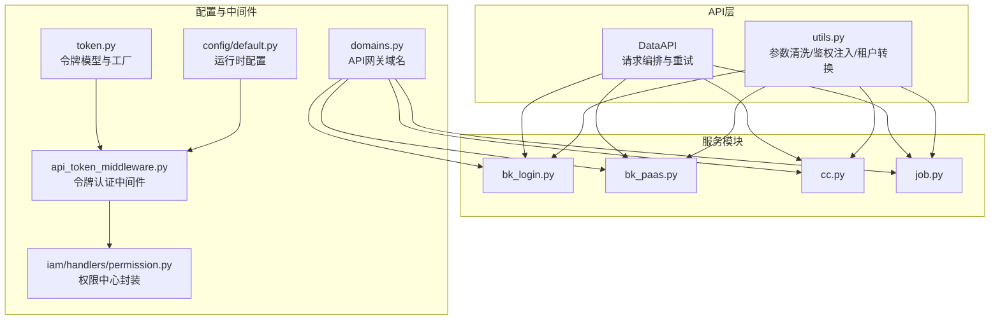
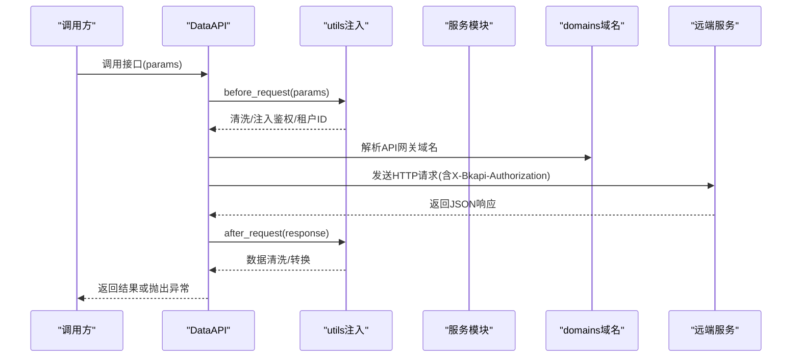
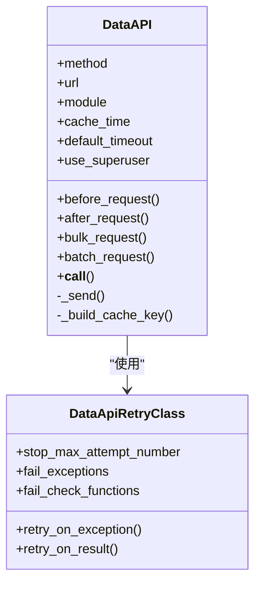
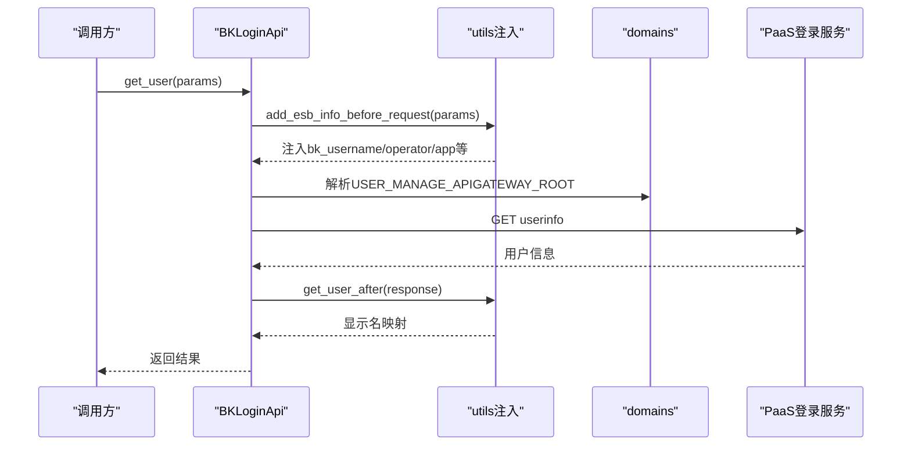
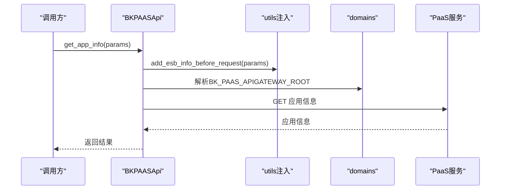
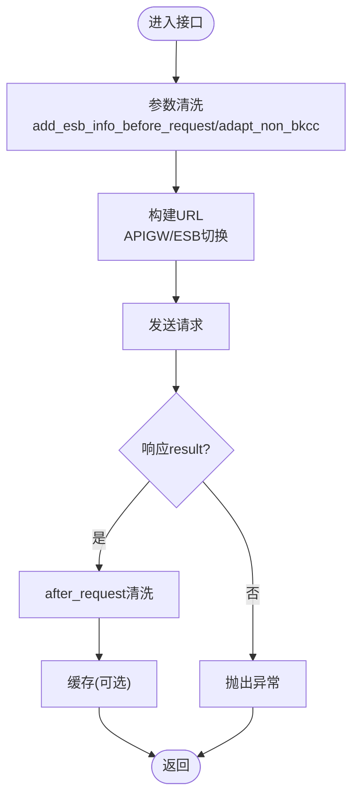
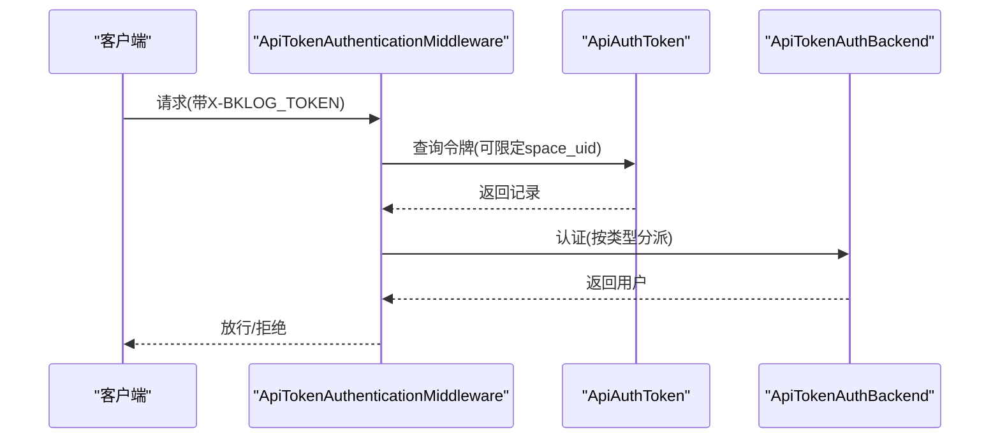
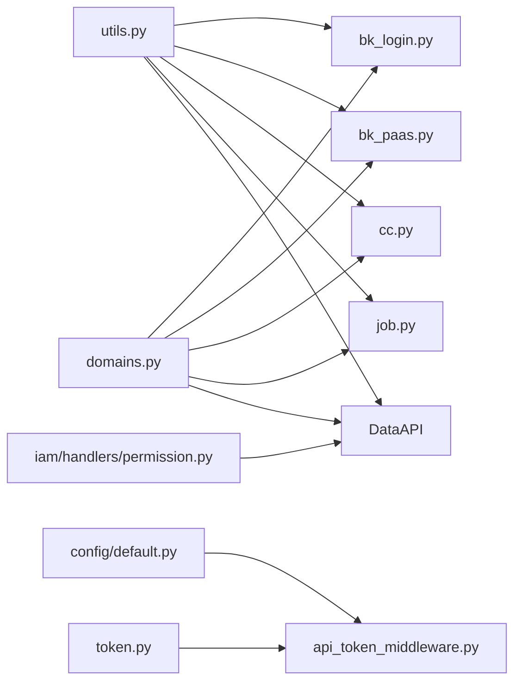

# 外部服务集成

<cite>
**本文引用的文件**
- [apps/api/base.py](file://apps/api/base.py)
- [apps/api/modules/utils.py](file://apps/api/modules/utils.py)
- [apps/api/modules/bk_login.py](file://apps/api/modules/bk_login.py)
- [apps/api/modules/bk_paas.py](file://apps/api/modules/bk_paas.py)
- [apps/api/modules/cc.py](file://apps/api/modules/cc.py)
- [apps/api/modules/job.py](file://apps/api/modules/job.py)
- [config/domains.py](file://config/domains.py)
- [apps/log_commons/token.py](file://apps/log_commons/token.py)
- [apps/middleware/api_token_middleware.py](file://apps/middleware/api_token_middleware.py)
- [apps/iam/handlers/permission.py](file://apps/iam/handlers/permission.py)
- [config/default.py](file://config/default.py)
- [apps/api/constants.py](file://apps/api/constants.py)
</cite>

## 目录
1. [简介](#简介)
2. [项目结构](#项目结构)
3. [核心组件](#核心组件)
4. [架构总览](#架构总览)
5. [详细组件分析](#详细组件分析)
6. [依赖分析](#依赖分析)
7. [性能考虑](#性能考虑)
8. [故障排查指南](#故障排查指南)
9. [结论](#结论)
10. [附录](#附录)

## 简介
本文件面向外部服务集成场景，系统性梳理蓝鲸生态服务在本项目中的集成架构与实现细节，覆盖服务发现、连接管理、数据同步策略、权限控制与访问管理、配置指南、常见问题与性能优化建议。重点涉及 bk_login、bk_paas、cc、job 等蓝鲸生态服务的对接方式与最佳实践。

## 项目结构
围绕外部服务集成的关键模块分布如下：
- API 层：统一的 DataAPI 抽象与请求编排，位于 apps/api/base.py
- 模块化服务封装：apps/api/modules 下按服务拆分，如 bk_login、bk_paas、cc、job
- 通用工具：apps/api/modules/utils.py 提供参数清洗、鉴权注入、租户ID转换等
- 配置与域名：config/domains.py 统一加载各平台 API 网关域名
- 访问令牌与中间件：apps/log_commons/token.py、apps/middleware/api_token_middleware.py
- 权限控制：apps/iam/handlers/permission.py 对接权限中心
- 默认配置：config/default.py 提供运行时配置、中间件、认证后端等

**图表来源**
- [apps/api/base.py](file://apps/api/base.py)
- [apps/api/modules/utils.py](file://apps/api/modules/utils.py)
- [apps/api/modules/bk_login.py](file://apps/api/modules/bk_login.py)
- [apps/api/modules/bk_paas.py](file://apps/api/modules/bk_paas.py)
- [apps/api/modules/cc.py](file://apps/api/modules/cc.py)
- [apps/api/modules/job.py](file://apps/api/modules/job.py)
- [config/domains.py](file://config/domains.py)
- [apps/log_commons/token.py](file://apps/log_commons/token.py)
- [apps/middleware/api_token_middleware.py](file://apps/middleware/api_token_middleware.py)
- [apps/iam/handlers/permission.py](file://apps/iam/handlers/permission.py)
- [config/default.py](file://config/default.py)

**章节来源**
- [apps/api/base.py](file://apps/api/base.py)
- [apps/api/modules/utils.py](file://apps/api/modules/utils.py)
- [config/domains.py](file://config/domains.py)
- [config/default.py](file://config/default.py)

## 核心组件
- DataAPI：统一的外部服务调用抽象，负责请求发送、重试、缓存、序列化、日志记录与错误处理
- 服务模块：针对具体蓝鲸服务的封装，如登录、PAAS、配置平台、作业平台等
- 通用工具：参数清洗、ESB鉴权注入、租户ID转换、非CC业务适配等
- 配置与域名：集中管理 API 网关域名，支持 APIGW 与旧 ESB 两种模式
- 令牌与中间件：基于令牌的访问控制与认证，支持多种类型
- 权限中心：对接 IAM，提供动作与资源的鉴权封装

**章节来源**
- [apps/api/base.py](file://apps/api/base.py)
- [apps/api/modules/utils.py](file://apps/api/modules/utils.py)
- [config/domains.py](file://config/domains.py)
- [apps/log_commons/token.py](file://apps/log_commons/token.py)
- [apps/middleware/api_token_middleware.py](file://apps/middleware/api_token_middleware.py)
- [apps/iam/handlers/permission.py](file://apps/iam/handlers/permission.py)

## 架构总览
外部服务集成采用“统一抽象 + 模块化封装 + 通用工具 + 配置中心”的分层设计：
- 统一抽象层：DataAPI 提供请求生命周期管理、重试与缓存、超时控制、分页批量请求等能力
- 服务封装层：各服务模块按 DataAPI 声明接口，注入 before/after 钩子与租户ID
- 工具支撑层：参数清洗、ESB鉴权注入、非CC业务适配、租户ID转换
- 配置管理层：域名集中加载、运行时配置、中间件与认证后端
- 访问控制层：令牌中间件、权限中心封装

**图表来源**
- [apps/api/base.py](file://apps/api/base.py)
- [apps/api/modules/utils.py](file://apps/api/modules/utils.py)
- [config/domains.py](file://config/domains.py)

**章节来源**
- [apps/api/base.py](file://apps/api/base.py)
- [apps/api/modules/utils.py](file://apps/api/modules/utils.py)
- [config/domains.py](file://config/domains.py)

## 详细组件分析

### DataAPI 组件分析
DataAPI 是外部服务调用的核心抽象，具备以下能力：
- 请求生命周期：before_request、发送请求、after_request、序列化、缓存
- 重试与异常：基于 Retrying 的异常与结果重试策略
- 超时与分页：默认超时、分页批量请求、线程池并发
- 多租户：自动注入 X-Bk-Tenant-Id，支持函数式租户ID获取
- 日志与可观测：统一记录请求/响应、耗时、错误码等

**图表来源**
- [apps/api/base.py](file://apps/api/base.py)

**章节来源**
- [apps/api/base.py](file://apps/api/base.py)

### 服务模块封装（bk_login）
- 功能：用户信息查询、租户列表、虚拟用户查询、部门档案查询
- 关键点：
  - 支持 APIGW 与旧 ESB 两种模式，通过 settings.USE_APIGW 切换
  - 用户查询参数注入 ESB 鉴权信息，响应数据中文名字段映射
  - 多租户模式下提供租户列表，否则返回固定内容

**图表来源**
- [apps/api/modules/bk_login.py](file://apps/api/modules/bk_login.py)
- [apps/api/modules/utils.py](file://apps/api/modules/utils.py)
- [config/domains.py](file://config/domains.py)

**章节来源**
- [apps/api/modules/bk_login.py](file://apps/api/modules/bk_login.py)
- [apps/api/modules/utils.py](file://apps/api/modules/utils.py)
- [config/domains.py](file://config/domains.py)

### 服务模块封装（bk_paas）
- 功能：应用信息查询、应用列表（V3）、uni_applications 查询
- 关键点：
  - 支持 APIGW 与旧 ESB 两种模式
  - V3 接口使用独立域名，带缓存策略

**图表来源**
- [apps/api/modules/bk_paas.py](file://apps/api/modules/bk_paas.py)
- [apps/api/modules/utils.py](file://apps/api/modules/utils.py)
- [config/domains.py](file://config/domains.py)

**章节来源**
- [apps/api/modules/bk_paas.py](file://apps/api/modules/bk_paas.py)
- [apps/api/modules/utils.py](file://apps/api/modules/utils.py)
- [config/domains.py](file://config/domains.py)

### 服务模块封装（cc）
- 功能：业务/主机/拓扑/动态分组/服务模板等查询
- 关键点：
  - 支持 APIGW 与旧 ESB 两种模式
  - 参数清洗：剔除非bk_前缀参数、供应商账号注入、无业务时适配CC业务
  - 多租户：通过 biz_to_tenant_getter 动态获取租户ID

**图表来源**
- [apps/api/modules/cc.py](file://apps/api/modules/cc.py)
- [apps/api/modules/utils.py](file://apps/api/modules/utils.py)

**章节来源**
- [apps/api/modules/cc.py](file://apps/api/modules/cc.py)
- [apps/api/modules/utils.py](file://apps/api/modules/utils.py)

### 服务模块封装（job）
- 功能：公共脚本列表、快速执行脚本/文件、作业日志/状态查询
- 关键点：
  - 支持 APIGW 与旧 ESB 两种模式
  - 非CC业务适配、ESB鉴权注入、租户ID注入

**章节来源**
- [apps/api/modules/job.py](file://apps/api/modules/job.py)
- [apps/api/modules/utils.py](file://apps/api/modules/utils.py)

### 通用工具（utils）
- ESB鉴权注入：add_esb_info_before_request，区分后台任务与WEB请求
- 非CC业务适配：adapt_non_bkcc、adapt_non_bkcc_for_bknode
- 租户ID转换：biz_to_tenant_getter、space_to_tenant_getter
- 数据平台鉴权：update_bkdata_auth_info，支持token/user两种模式

**章节来源**
- [apps/api/modules/utils.py](file://apps/api/modules/utils.py)

### 配置与域名（domains）
- 统一加载 API_ROOTS 中的域名，支持 BK_PAAS、CC、JOB、IAM 等
- 通过环境变量注入，便于多环境部署

**章节来源**
- [config/domains.py](file://config/domains.py)

### 访问令牌与中间件
- 令牌模型：ApiAuthToken，支持过期时间、类型、参数、创建者
- 令牌工厂：TokenHandlerFactory，扩展不同类型的令牌处理器
- 中间件：ApiTokenAuthenticationMiddleware，支持 X-BKLOG_TOKEN 与 X-BKLOG_SPACE_UID，按类型分派认证逻辑

**图表来源**
- [apps/middleware/api_token_middleware.py](file://apps/middleware/api_token_middleware.py)
- [apps/log_commons/token.py](file://apps/log_commons/token.py)

**章节来源**
- [apps/middleware/api_token_middleware.py](file://apps/middleware/api_token_middleware.py)
- [apps/log_commons/token.py](file://apps/log_commons/token.py)

### 权限控制（IAM）
- 封装：Permission 类，支持单动作/多动作请求、生成申请URL、兼容多租户
- 集成：与 DataAPI 结合，通过 before_request 注入鉴权信息

**章节来源**
- [apps/iam/handlers/permission.py](file://apps/iam/handlers/permission.py)

## 依赖分析
- DataAPI 依赖 utils（参数清洗/鉴权注入）、domains（域名解析）、config（运行时配置）
- 各服务模块依赖 DataAPI 与 utils，部分模块依赖 domains
- 令牌中间件依赖令牌模型与认证后端
- 权限中心封装依赖 IAM SDK 与配置

**图表来源**
- [apps/api/modules/utils.py](file://apps/api/modules/utils.py)
- [apps/api/modules/bk_login.py](file://apps/api/modules/bk_login.py)
- [apps/api/modules/bk_paas.py](file://apps/api/modules/bk_paas.py)
- [apps/api/modules/cc.py](file://apps/api/modules/cc.py)
- [apps/api/modules/job.py](file://apps/api/modules/job.py)
- [config/domains.py](file://config/domains.py)
- [apps/log_commons/token.py](file://apps/log_commons/token.py)
- [apps/middleware/api_token_middleware.py](file://apps/middleware/api_token_middleware.py)
- [apps/iam/handlers/permission.py](file://apps/iam/handlers/permission.py)
- [config/default.py](file://config/default.py)

**章节来源**
- [apps/api/base.py](file://apps/api/base.py)
- [apps/api/modules/utils.py](file://apps/api/modules/utils.py)
- [apps/api/modules/bk_login.py](file://apps/api/modules/bk_login.py)
- [apps/api/modules/bk_paas.py](file://apps/api/modules/bk_paas.py)
- [apps/api/modules/cc.py](file://apps/api/modules/cc.py)
- [apps/api/modules/job.py](file://apps/api/modules/job.py)
- [config/domains.py](file://config/domains.py)
- [apps/log_commons/token.py](file://apps/log_commons/token.py)
- [apps/middleware/api_token_middleware.py](file://apps/middleware/api_token_middleware.py)
- [apps/iam/handlers/permission.py](file://apps/iam/handlers/permission.py)
- [config/default.py](file://config/default.py)

## 性能考虑
- 缓存策略：DataAPI 支持 cache_time，配合 _build_cache_key 生成稳定键，减少重复请求
- 分页与批量：bulk_request、batch_request 通过线程池并发拉取，降低总体延迟
- 超时与重试：默认超时与 Retrying 配置，避免长时间阻塞
- 多租户与鉴权：统一注入 X-Bk-Tenant-Id 与 X-Bkapi-Authorization，减少鉴权失败重试成本
- 日志与可观测：统一记录请求/响应、耗时、错误码，便于定位性能瓶颈

**章节来源**
- [apps/api/base.py](file://apps/api/base.py)
- [apps/api/constants.py](file://apps/api/constants.py)

## 故障排查指南
- 常见错误类型
  - 请求超时：检查 default_timeout 与网络连通性
  - 鉴权失败：确认 X-Bkapi-Authorization 与 ESB 鉴权注入是否正确
  - 结果格式非JSON：DataAPI 会抛出格式异常，检查远端服务响应
  - 权限不足：IAM 鉴权失败，检查用户权限与资源范围
- 令牌认证
  - 确认 X-BKLOG_TOKEN 与 X-BKLOG_SPACE_UID 是否正确
  - 检查令牌是否过期、类型是否匹配
- 日志定位
  - DataAPI 统一记录请求/响应、耗时、错误码，结合日志级别定位问题

**章节来源**
- [apps/api/base.py](file://apps/api/base.py)
- [apps/middleware/api_token_middleware.py](file://apps/middleware/api_token_middleware.py)

## 结论
本项目通过 DataAPI 抽象与模块化封装，实现了对蓝鲸生态服务的统一接入与治理。配合通用工具、配置中心、令牌中间件与权限中心，形成从服务发现、连接管理到权限控制的完整闭环。建议在生产环境中合理配置缓存、分页与重试策略，确保稳定性与性能。

## 附录

### 外部服务集成配置指南
- 服务地址配置
  - 使用 config/domains.py 中的 API_ROOTS 加载域名，支持多环境注入
  - 通过 settings.USE_APIGW 控制 APIGW 与旧 ESB 模式切换
- 认证参数设置
  - ESB 鉴权：add_esb_info_before_request 会自动注入 app_code、username、operator 等
  - API 网关鉴权：DataAPI 自动构造 X-Bkapi-Authorization 请求头
- 网络连接配置
  - 默认超时：default_timeout，可在 DataAPI 初始化时覆盖
  - 重试策略：DataApiRetryClass 支持异常与结果级重试
  - 分页批量：bulk_request、batch_request 降低单次请求压力
- 多租户与非CC业务
  - 通过 biz_to_tenant_getter、space_to_tenant_getter 注入 X-Bk-Tenant-Id
  - adapt_non_bkcc 将非CC业务映射为关联的CC业务ID

**章节来源**
- [config/domains.py](file://config/domains.py)
- [apps/api/modules/utils.py](file://apps/api/modules/utils.py)
- [apps/api/base.py](file://apps/api/base.py)
- [config/default.py](file://config/default.py)