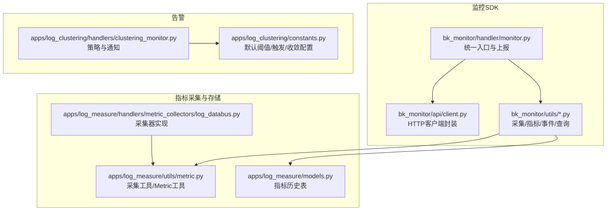
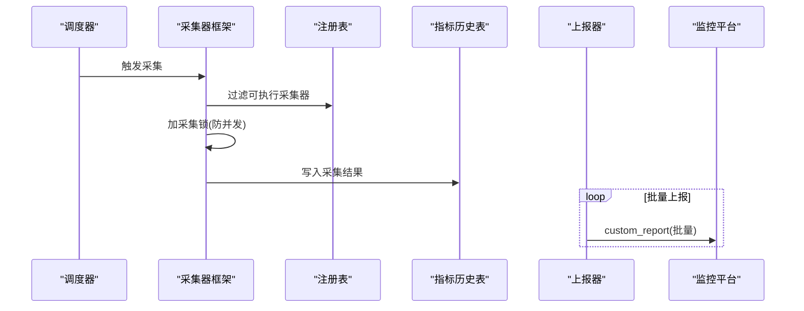
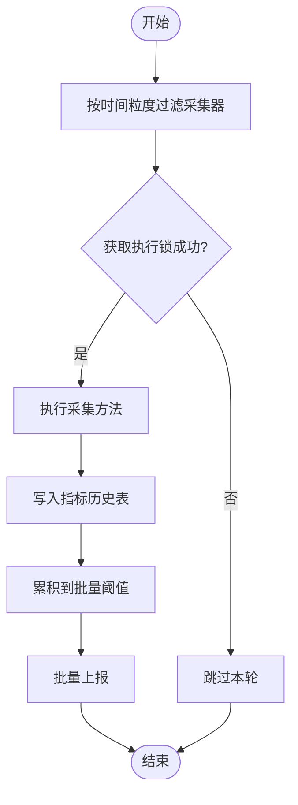
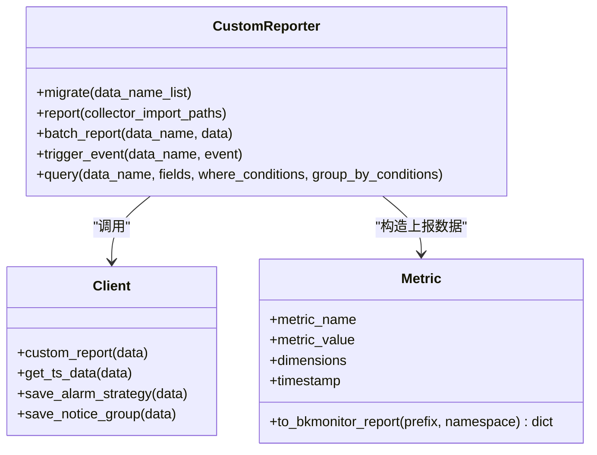
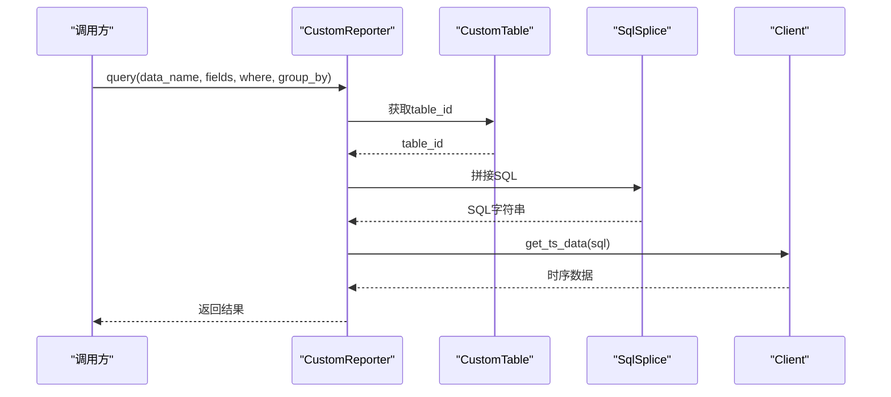
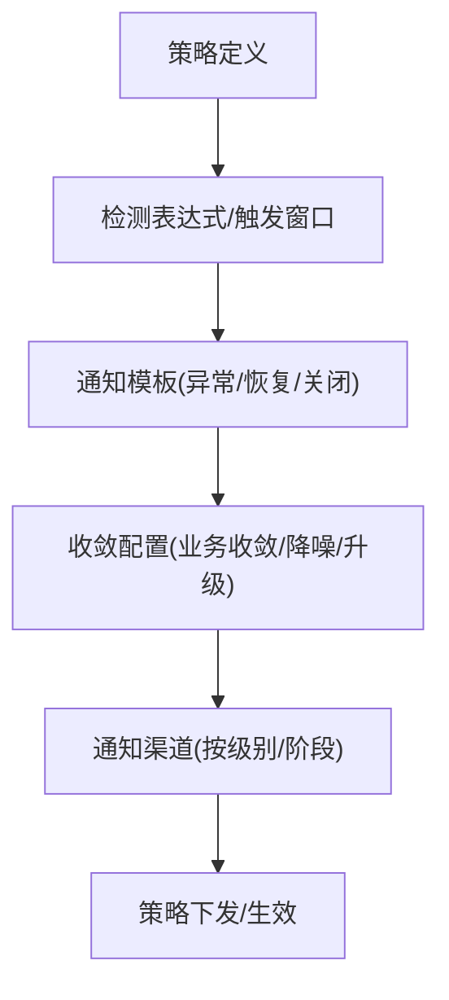
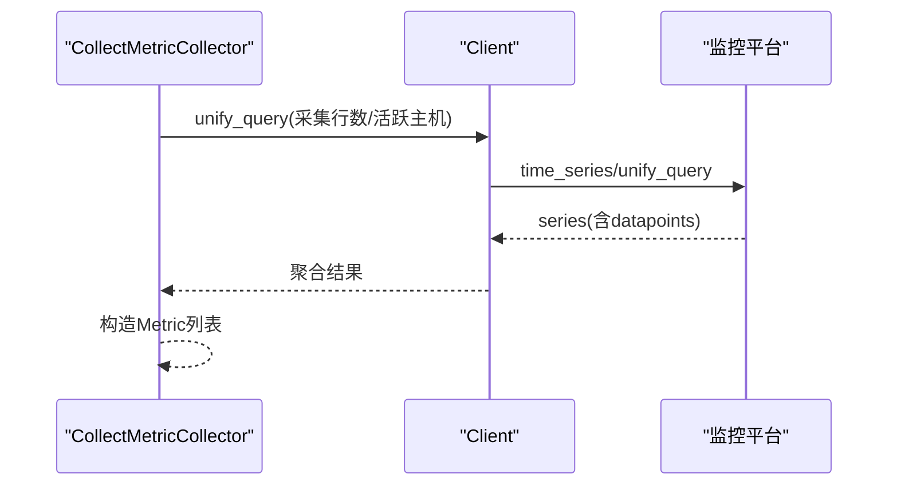
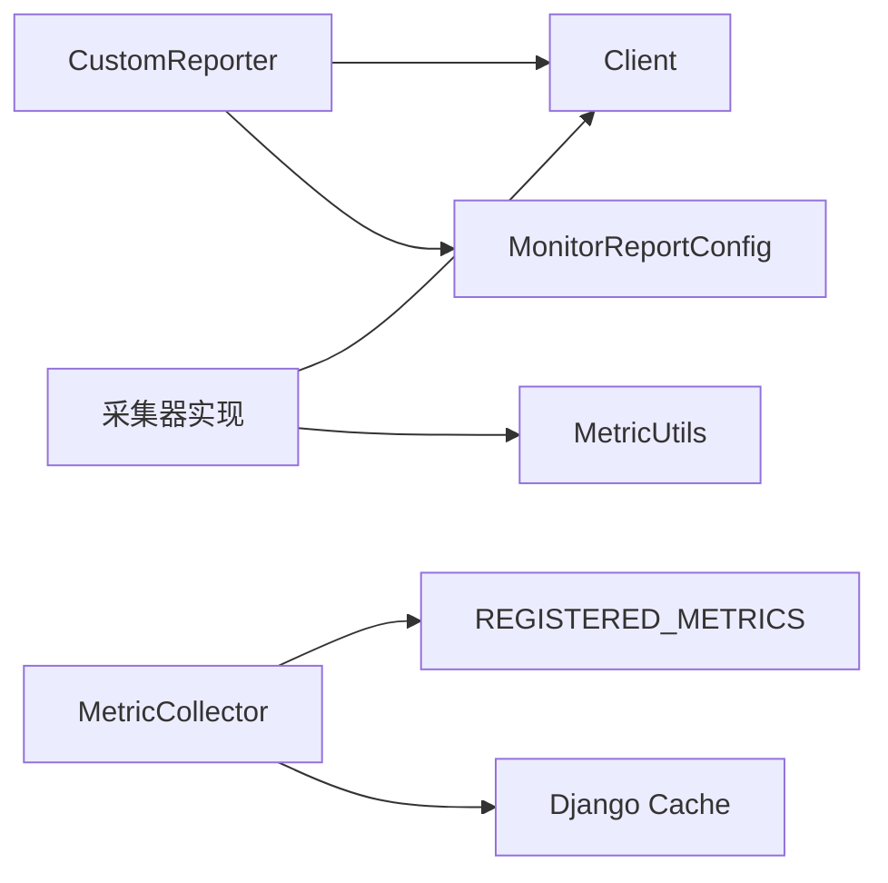
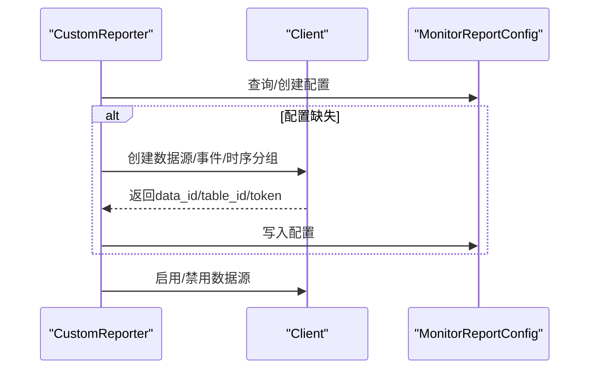

# 监控系统集成

<cite>
**本文引用的文件**   
- [bk_monitor/handler/monitor.py](file://bk_monitor/handler/monitor.py)
- [bk_monitor/utils/collector.py](file://bk_monitor/utils/collector.py)
- [bk_monitor/utils/metric.py](file://bk_monitor/utils/metric.py)
- [bk_monitor/utils/event.py](file://bk_monitor/utils/event.py)
- [bk_monitor/utils/query.py](file://bk_monitor/utils/query.py)
- [bk_monitor/utils/data_name_builder.py](file://bk_monitor/utils/data_name_builder.py)
- [bk_monitor/models.py](file://bk_monitor/models.py)
- [bk_monitor/constants.py](file://bk_monitor/constants.py)
- [bk_monitor/api/client.py](file://bk_monitor/api/client.py)
- [apps/log_measure/utils/metric.py](file://apps/log_measure/utils/metric.py)
- [apps/log_measure/models.py](file://apps/log_measure/models.py)
- [apps/log_measure/handlers/metric_collectors/log_databus.py](file://apps/log_measure/handlers/metric_collectors/log_databus.py)
- [apps/log_clustering/handlers/clustering_monitor.py](file://apps/log_clustering/handlers/clustering_monitor.py)
- [apps/log_clustering/constants.py](file://apps/log_clustering/constants.py)
</cite>

## 目录
1. [简介](#简介)
2. [项目结构](#项目结构)
3. [核心组件](#核心组件)
4. [架构总览](#架构总览)
5. [详细组件分析](#详细组件分析)
6. [依赖分析](#依赖分析)
7. [性能考虑](#性能考虑)
8. [故障排查指南](#故障排查指南)
9. [结论](#结论)
10. [附录](#附录)

## 简介
本技术文档面向“监控系统集成”的目标，系统性阐述蓝鲸日志平台（bk-log）与监控系统的对接实现，覆盖以下关键能力：
- 监控数据采集：通过注册式指标采集器与定时调度，实现主动采集与批量上报。
- 指标收集与格式：统一指标模型、命名空间与维度，输出符合监控平台时序数据规范的上报格式。
- 查询接口：基于自定义结果表的SQL拼装与统一查询接口封装，支持时序数据查询与聚合。
- 告警处理：结合聚类场景策略与通知收敛，提供告警规则配置、通知渠道管理与收敛策略。
- 配置参数：采集间隔、批量大小、数据保留与告警阈值等参数的来源与作用范围。
- 最佳实践与性能优化：采集锁控制、批量上报、错误处理与重试策略。
- 故障诊断：常见问题定位路径与日志要点。

## 项目结构
监控集成相关代码主要分布在以下模块：
- 监控SDK与上报：bk_monitor（客户端、上报、查询、事件）
- 指标采集与存储：apps/log_measure（采集器注册、采集执行、历史数据存储）
- 采集器实现：apps/log_measure/handlers/metric_collectors（采集器示例，如采集配置、主机、行数等）
- 告警策略与通知：apps/log_clustering（聚类告警策略、通知模板与收敛）

**图表来源**
- [bk_monitor/handler/monitor.py:1-358](file://bk_monitor/handler/monitor.py#L1-L358)
- [bk_monitor/api/client.py:1-107](file://bk_monitor/api/client.py#L1-L107)
- [apps/log_measure/utils/metric.py:1-151](file://apps/log_measure/utils/metric.py#L1-L151)
- [apps/log_measure/models.py:1-44](file://apps/log_measure/models.py#L1-L44)
- [apps/log_measure/handlers/metric_collectors/log_databus.py:1-516](file://apps/log_measure/handlers/metric_collectors/log_databus.py#L1-L516)
- [apps/log_clustering/handlers/clustering_monitor.py:187-585](file://apps/log_clustering/handlers/clustering_monitor.py#L187-L585)
- [apps/log_clustering/constants.py:95-142](file://apps/log_clustering/constants.py#L95-L142)

**章节来源**
- [bk_monitor/handler/monitor.py:1-358](file://bk_monitor/handler/monitor.py#L1-L358)
- [apps/log_measure/handlers/metric_collectors/log_databus.py:1-516](file://apps/log_measure/handlers/metric_collectors/log_databus.py#L1-L516)

## 核心组件
- 统一入口与上报：负责数据源初始化、批量上报、事件触发、查询封装与启用/禁用开关维护。
- 采集器框架：注册式采集器、采集过滤与执行锁、批量组装与上报。
- 指标模型与命名：统一指标对象、指标ID构建、命名空间/前缀/子类型组合。
- 事件与告警：事件构建与上报；聚类场景告警策略、通知模板与收敛配置。
- 查询与SQL拼装：基于数据源表ID生成SQL，支持where与group by条件拼接。
- 配置与常量：数据源类型、ETL配置、批量大小、时间粒度枚举与错误码。

**章节来源**
- [bk_monitor/handler/monitor.py:39-358](file://bk_monitor/handler/monitor.py#L39-L358)
- [bk_monitor/utils/collector.py:15-96](file://bk_monitor/utils/collector.py#L15-L96)
- [bk_monitor/utils/metric.py:11-86](file://bk_monitor/utils/metric.py#L11-L86)
- [bk_monitor/utils/event.py:5-58](file://bk_monitor/utils/event.py#L5-L58)
- [bk_monitor/utils/query.py:9-57](file://bk_monitor/utils/query.py#L9-L57)
- [bk_monitor/constants.py:1-55](file://bk_monitor/constants.py#L1-L55)

## 架构总览
监控系统集成采用“采集-存储-上报-查询-告警”的闭环设计：
- 采集阶段：注册式采集器按分钟粒度筛选执行，避免并发冲突；采集结果写入历史表。
- 上报阶段：按数据源分组批量上报，遵循批量大小限制；支持启用/禁用开关。
- 查询阶段：通过SQL拼装与统一查询接口，支持时序数据查询与聚合。
- 告警阶段：聚类场景策略与通知模板，结合收敛与通知渠道配置。

**图表来源**
- [bk_monitor/utils/collector.py:25-96](file://bk_monitor/utils/collector.py#L25-L96)
- [apps/log_measure/models.py:40-44](file://apps/log_measure/models.py#L40-L44)
- [bk_monitor/handler/monitor.py:177-234](file://bk_monitor/handler/monitor.py#L177-L234)

## 详细组件分析

### 采集策略与执行流程
- 主动采集：通过采集器框架按分钟粒度筛选，使用缓存作为执行锁，避免重复执行。
- 批量组装：采集完成后写入历史表，上报器按数据源分组批量上报，超过阈值即发送。
- 时间粒度：支持1/2/5/10/30/60/180/360/720/1440分钟粒度，仅在对应分钟位执行。

**图表来源**
- [bk_monitor/utils/collector.py:61-96](file://bk_monitor/utils/collector.py#L61-L96)
- [apps/log_measure/models.py:40-44](file://apps/log_measure/models.py#L40-L44)
- [bk_monitor/constants.py:40-55](file://bk_monitor/constants.py#L40-L55)

**章节来源**
- [bk_monitor/utils/collector.py:15-96](file://bk_monitor/utils/collector.py#L15-L96)
- [bk_monitor/constants.py:40-55](file://bk_monitor/constants.py#L40-L55)

### 指标数据格式与传输协议
- 指标模型：包含指标名、数值、维度、时间戳；支持命名空间与前缀组合。
- 上报格式：统一输出metrics字典、target、dimension、timestamp（毫秒）。
- 传输协议：通过HTTP POST调用监控平台的custom_report接口，携带data_id与access_token。

**图表来源**
- [bk_monitor/utils/metric.py:49-86](file://bk_monitor/utils/metric.py#L49-L86)
- [bk_monitor/handler/monitor.py:79-329](file://bk_monitor/handler/monitor.py#L79-L329)
- [bk_monitor/api/client.py:78-107](file://bk_monitor/api/client.py#L78-L107)

**章节来源**
- [bk_monitor/utils/metric.py:49-86](file://bk_monitor/utils/metric.py#L49-L86)
- [bk_monitor/handler/monitor.py:177-234](file://bk_monitor/handler/monitor.py#L177-L234)
- [bk_monitor/api/client.py:78-82](file://bk_monitor/api/client.py#L78-L82)

### 查询接口与SQL拼装
- 表ID解析：通过数据源配置获取结果表ID，若未初始化则抛出异常。
- SQL拼装：支持fields、where条件、group by条件拼接，最终调用统一查询接口。
- 返回结果：返回时序数据，供采集器或外部查询使用。

**图表来源**
- [bk_monitor/utils/query.py:9-57](file://bk_monitor/utils/query.py#L9-L57)
- [bk_monitor/handler/monitor.py:266-285](file://bk_monitor/handler/monitor.py#L266-L285)
- [bk_monitor/api/client.py:100-106](file://bk_monitor/api/client.py#L100-L106)

**章节来源**
- [bk_monitor/utils/query.py:9-57](file://bk_monitor/utils/query.py#L9-L57)
- [bk_monitor/handler/monitor.py:266-285](file://bk_monitor/handler/monitor.py#L266-L285)

### 告警集成与收敛策略
- 策略配置：聚类场景策略包含检测表达式、触发与恢复配置、通知模板与收敛配置。
- 通知渠道：支持多种通知方式与不同级别/阶段的通知配置。
- 收敛策略：支持业务级收敛、通知方式排除、降噪配置与升级配置。

**图表来源**
- [apps/log_clustering/handlers/clustering_monitor.py:187-302](file://apps/log_clustering/handlers/clustering_monitor.py#L187-L302)
- [apps/log_clustering/handlers/clustering_monitor.py:559-585](file://apps/log_clustering/handlers/clustering_monitor.py#L559-L585)
- [apps/log_clustering/constants.py:95-142](file://apps/log_clustering/constants.py#L95-L142)

**章节来源**
- [apps/log_clustering/handlers/clustering_monitor.py:187-302](file://apps/log_clustering/handlers/clustering_monitor.py#L187-L302)
- [apps/log_clustering/handlers/clustering_monitor.py:559-585](file://apps/log_clustering/handlers/clustering_monitor.py#L559-L585)
- [apps/log_clustering/constants.py:95-142](file://apps/log_clustering/constants.py#L95-L142)

### 采集器实现示例（采集配置/主机/行数）
- 采集配置：按业务、状态、采集场景聚合采集配置数量，并汇总总数。
- 自定义采集：按自定义类型聚合自定义采集配置数量。
- 主机与行数：通过统一查询接口获取采集行数与活跃主机数，按任务/目标维度聚合。

**图表来源**
- [apps/log_measure/handlers/metric_collectors/log_databus.py:55-87](file://apps/log_measure/handlers/metric_collectors/log_databus.py#L55-L87)
- [apps/log_measure/handlers/metric_collectors/log_databus.py:143-167](file://apps/log_measure/handlers/metric_collectors/log_databus.py#L143-L167)
- [apps/log_measure/handlers/metric_collectors/log_databus.py:224-257](file://apps/log_measure/handlers/metric_collectors/log_databus.py#L224-L257)
- [apps/log_measure/handlers/metric_collectors/log_databus.py:170-222](file://apps/log_measure/handlers/metric_collectors/log_databus.py#L170-L222)
- [apps/log_measure/handlers/metric_collectors/log_databus.py:260-310](file://apps/log_measure/handlers/metric_collectors/log_databus.py#L260-L310)

**章节来源**
- [apps/log_measure/handlers/metric_collectors/log_databus.py:55-87](file://apps/log_measure/handlers/metric_collectors/log_databus.py#L55-L87)
- [apps/log_measure/handlers/metric_collectors/log_databus.py:143-167](file://apps/log_measure/handlers/metric_collectors/log_databus.py#L143-L167)
- [apps/log_measure/handlers/metric_collectors/log_databus.py:224-257](file://apps/log_measure/handlers/metric_collectors/log_databus.py#L224-L257)
- [apps/log_measure/handlers/metric_collectors/log_databus.py:170-222](file://apps/log_measure/handlers/metric_collectors/log_databus.py#L170-L222)
- [apps/log_measure/handlers/metric_collectors/log_databus.py:260-310](file://apps/log_measure/handlers/metric_collectors/log_databus.py#L260-L310)

## 依赖分析
- 组件耦合
  - 上报器依赖监控SDK客户端与配置模型，用于数据源初始化、启用/禁用与批量上报。
  - 采集器框架依赖注册表与缓存，用于采集器筛选与执行锁。
  - 采集器实现依赖统一查询接口与业务工具，用于拉取时序数据与业务信息。
- 外部依赖
  - 监控平台Esb/网关接口：数据源创建、启用/禁用、事件/时序上报、统一查询。
  - Elasticsearch：部分采集器通过统一查询接口间接使用。

**图表来源**
- [bk_monitor/handler/monitor.py:93-175](file://bk_monitor/handler/monitor.py#L93-L175)
- [bk_monitor/utils/collector.py:20-96](file://bk_monitor/utils/collector.py#L20-L96)
- [apps/log_measure/handlers/metric_collectors/log_databus.py:170-222](file://apps/log_measure/handlers/metric_collectors/log_databus.py#L170-L222)

**章节来源**
- [bk_monitor/handler/monitor.py:93-175](file://bk_monitor/handler/monitor.py#L93-L175)
- [bk_monitor/utils/collector.py:20-96](file://bk_monitor/utils/collector.py#L20-L96)
- [apps/log_measure/handlers/metric_collectors/log_databus.py:170-222](file://apps/log_measure/handlers/metric_collectors/log_databus.py#L170-L222)

## 性能考虑
- 采集锁与并发控制：通过缓存键与超时控制避免重复执行，降低并发抖动。
- 批量上报：按批量阈值分批上报，减少HTTP调用次数与单次负载。
- 时间粒度：合理设置采集器时间粒度，避免高频采集造成压力。
- 查询优化：统一查询接口支持聚合与分组，减少跨服务调用。
- 存储与清理：指标历史表按时间戳存储，建议定期清理历史数据以控制容量。

[本节为通用性能建议，无需列出具体文件来源]

## 故障排查指南
- 数据源初始化失败
  - 现象：获取data_id失败或创建后仍无法获取。
  - 排查：确认监控网关地址、应用鉴权信息、数据源名称与业务ID；检查返回消息与错误码。
  - 参考
    - [bk_monitor/handler/monitor.py:105-141](file://bk_monitor/handler/monitor.py#L105-L141)
    - [bk_monitor/api/client.py:58-68](file://bk_monitor/api/client.py#L58-L68)
- 上报失败
  - 现象：custom_report返回非成功状态。
  - 排查：检查data_id/access_token/table_id是否正确；确认批量大小与上报频率。
  - 参考
    - [bk_monitor/handler/monitor.py:217-234](file://bk_monitor/handler/monitor.py#L217-L234)
    - [bk_monitor/constants.py:17-18](file://bk_monitor/constants.py#L17-L18)
- 查询异常
  - 现象：获取table_id不存在或SQL拼装错误。
  - 排查：确认数据源已初始化且启用；检查fields/where/group_by拼装逻辑。
  - 参考
    - [bk_monitor/utils/query.py:47-56](file://bk_monitor/utils/query.py#L47-L56)
    - [bk_monitor/handler/monitor.py:266-285](file://bk_monitor/handler/monitor.py#L266-L285)
- 采集未执行
  - 现象：采集器未按预期执行。
  - 排查：检查时间粒度与当前分钟位；确认采集锁是否被占用；查看日志中的“not allowed”提示。
  - 参考
    - [bk_monitor/utils/collector.py:80-96](file://bk_monitor/utils/collector.py#L80-L96)
    - [bk_monitor/constants.py:40-55](file://bk_monitor/constants.py#L40-L55)

**章节来源**
- [bk_monitor/handler/monitor.py:105-141](file://bk_monitor/handler/monitor.py#L105-L141)
- [bk_monitor/handler/monitor.py:217-234](file://bk_monitor/handler/monitor.py#L217-L234)
- [bk_monitor/utils/query.py:47-56](file://bk_monitor/utils/query.py#L47-L56)
- [bk_monitor/constants.py:17-18](file://bk_monitor/constants.py#L17-L18)
- [bk_monitor/constants.py:40-55](file://bk_monitor/constants.py#L40-L55)
- [bk_monitor/utils/collector.py:80-96](file://bk_monitor/utils/collector.py#L80-L96)

## 结论
本集成方案通过注册式采集器与统一SDK，实现了从采集、存储、上报到查询与告警的完整链路。其关键优势在于：
- 明确的采集锁与时间粒度控制，保障稳定性；
- 批量上报与灵活的查询接口，兼顾性能与可用性；
- 告警策略与通知收敛配置，满足生产级告警需求。

建议在生产环境中结合业务规模调整采集粒度与批量阈值，并完善监控与日志告警，确保异常可感知、可追踪。

[本节为总结性内容，无需列出具体文件来源]

## 附录

### 配置参数与含义
- 数据源类型
  - 时序数据：time_series
  - 事件数据：event
- ETL配置
  - 时序标准：bk_standard_v2_time_series
  - 事件标准：bk_standard_v2_event
- 批量大小：默认5000条
- 时间粒度枚举：1/2/5/10/30/60/180/360/720/1440分钟
- 启用/禁用：通过modify_data_id接口切换

**章节来源**
- [bk_monitor/constants.py:4-18](file://bk_monitor/constants.py#L4-L18)
- [bk_monitor/constants.py:40-55](file://bk_monitor/constants.py#L40-L55)
- [bk_monitor/handler/monitor.py:316-328](file://bk_monitor/handler/monitor.py#L316-L328)

### 数据源初始化流程

**图表来源**
- [bk_monitor/handler/monitor.py:93-175](file://bk_monitor/handler/monitor.py#L93-L175)
- [bk_monitor/models.py:8-26](file://bk_monitor/models.py#L8-L26)
- [bk_monitor/api/client.py:62-76](file://bk_monitor/api/client.py#L62-L76)