# 第三方平台集成

<cite>
**本文引用的文件**
- [apps/api/modules/bkdata_access.py](file://apps/api/modules/bkdata_access.py)
- [apps/api/modules/bkdata_auth.py](file://apps/api/modules/bkdata_auth.py)
- [apps/api/modules/bkdata_databus.py](file://apps/api/modules/bkdata_databus.py)
- [apps/api/modules/bkdata_dataflow.py](file://apps/api/modules/bkdata_dataflow.py)
- [apps/api/modules/bkdata_meta.py](file://apps/api/modules/bkdata_meta.py)
- [apps/api/modules/bkdata_query.py](file://apps/api/modules/bkdata_query.py)
- [apps/api/modules/bkdata_resource_center.py](file://apps/api/modules/bkdata_resource_center.py)
- [apps/api/modules/bkdata_storekit.py](file://apps/api/modules/bkdata_storekit.py)
- [apps/api/modules/bkdata_aiops.py](file://apps/api/modules/bkdata_aiops.py)
- [apps/api/modules/utils.py](file://apps/api/modules/utils.py)
- [apps/api/base.py](file://apps/api/base.py)
- [config/domains.py](file://config/domains.py)
- [config/env.py](file://config/env.py)
- [apps/log_databus/utils/bkdata_clean.py](file://apps/log_databus/utils/bkdata_clean.py)
- [apps/log_databus/tasks/collector.py](file://apps/log_databus/tasks/collector.py)
- [apps/middlewares.py](file://apps/middlewares.py)
- [support-files/apigw/definition.yaml](file://support-files/apigw/definition.yaml)
</cite>

## 目录
1. [简介](#简介)
2. [项目结构](#项目结构)
3. [核心组件](#核心组件)
4. [架构总览](#架构总览)
5. [详细组件分析](#详细组件分析)
6. [依赖分析](#依赖分析)
7. [性能考虑](#性能考虑)
8. [故障排查指南](#故障排查指南)
9. [结论](#结论)
10. [附录](#附录)

## 简介
本技术文档面向第三方平台集成，系统性阐述与BK Data数据平台的对接实现，覆盖数据接入、AI分析、权限管理、数据总线、数据流、元数据、查询服务、资源中心与存储套件等模块。文档重点说明：
- 数据传输协议与API接口规范
- 数据格式与参数约定
- 数据同步策略（实时、批量、增量）
- 权限控制与数据安全（访问令牌、鉴权、加密、审计）
- 第三方平台配置指南（平台地址、认证参数、网络设置）
- 性能优化与故障排查

## 项目结构
围绕BK Data集成的关键模块位于apps/api/modules下，采用按功能域划分的模块化设计，每个模块封装一组与BK Data子系统的交互API，并通过统一的DataAPI/DataDRFAPISet抽象层实现请求构建、鉴权注入、缓存与重试、序列化与日志记录。

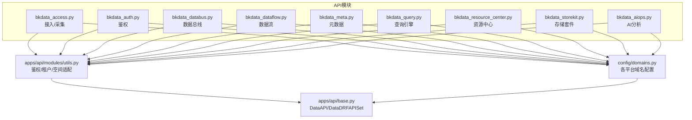

图表来源
- [apps/api/modules/bkdata_access.py](file://apps/api/modules/bkdata_access.py)
- [apps/api/modules/bkdata_auth.py](file://apps/api/modules/bkdata_auth.py)
- [apps/api/modules/bkdata_databus.py](file://apps/api/modules/bkdata_databus.py)
- [apps/api/modules/bkdata_dataflow.py](file://apps/api/modules/bkdata_dataflow.py)
- [apps/api/modules/bkdata_meta.py](file://apps/api/modules/bkdata_meta.py)
- [apps/api/modules/bkdata_query.py](file://apps/api/modules/bkdata_query.py)
- [apps/api/modules/bkdata_resource_center.py](file://apps/api/modules/bkdata_resource_center.py)
- [apps/api/modules/bkdata_storekit.py](file://apps/api/modules/bkdata_storekit.py)
- [apps/api/modules/bkdata_aiops.py](file://apps/api/modules/bkdata_aiops.py)
- [apps/api/modules/utils.py](file://apps/api/modules/utils.py)
- [config/domains.py](file://config/domains.py)
- [apps/api/base.py](file://apps/api/base.py)

章节来源
- [apps/api/modules/bkdata_access.py](file://apps/api/modules/bkdata_access.py)
- [apps/api/modules/bkdata_auth.py](file://apps/api/modules/bkdata_auth.py)
- [apps/api/modules/bkdata_databus.py](file://apps/api/modules/bkdata_databus.py)
- [apps/api/modules/bkdata_dataflow.py](file://apps/api/modules/bkdata_dataflow.py)
- [apps/api/modules/bkdata_meta.py](file://apps/api/modules/bkdata_meta.py)
- [apps/api/modules/bkdata_query.py](file://apps/api/modules/bkdata_query.py)
- [apps/api/modules/bkdata_resource_center.py](file://apps/api/modules/bkdata_resource_center.py)
- [apps/api/modules/bkdata_storekit.py](file://apps/api/modules/bkdata_storekit.py)
- [apps/api/modules/bkdata_aiops.py](file://apps/api/modules/bkdata_aiops.py)
- [apps/api/modules/utils.py](file://apps/api/modules/utils.py)
- [config/domains.py](file://config/domains.py)
- [apps/api/base.py](file://apps/api/base.py)

## 核心组件
- DataAPI/DataDRFAPISet：统一的HTTP客户端抽象，负责请求构造、鉴权头注入、参数清洗、缓存、重试、序列化与日志记录。
- 鉴权工具链：add_esb_info_before_request_for_bkdata_user/token、biz_to_tenant_getter、空间/业务适配等，确保调用BK Data时携带正确的用户身份、应用凭证与租户上下文。
- 域名配置：config.domains集中声明各BK Data子系统API网关根地址，支持多环境加载与替换。

章节来源
- [apps/api/base.py](file://apps/api/base.py)
- [apps/api/modules/utils.py](file://apps/api/modules/utils.py)
- [config/domains.py](file://config/domains.py)

## 架构总览
第三方平台通过蓝鲸API网关访问BK Data子系统，请求在进入网关前由中间件注入公钥提供方与外部标识，随后由DataAPI层统一处理鉴权、租户、缓存与重试，最终转发至BK Data对应模块。

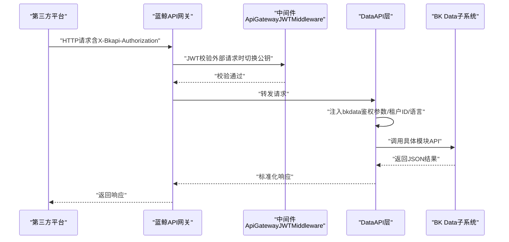

图表来源
- [apps/middlewares.py](file://apps/middlewares.py)
- [apps/api/base.py](file://apps/api/base.py)
- [apps/api/modules/utils.py](file://apps/api/modules/utils.py)
- [support-files/apigw/definition.yaml](file://support-files/apigw/definition.yaml)

## 详细组件分析

### 数据接入与采集（Access）
- 关键能力：源数据列表、部署计划查询/创建/更新、采集器启停。
- 鉴权：统一注入bkdata用户鉴权参数，支持租户ID注入。
- URL构建：支持API网关与旧路径双栈，自动选择。

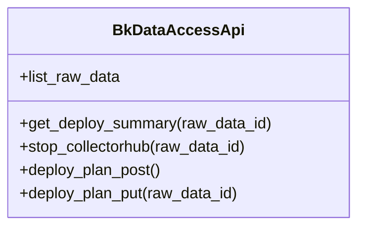

图表来源
- [apps/api/modules/bkdata_access.py](file://apps/api/modules/bkdata_access.py)

章节来源
- [apps/api/modules/bkdata_access.py](file://apps/api/modules/bkdata_access.py)

### 权限管理（Auth）
- 关键能力：用户权限检查、权限范围查询、令牌详情、令牌更新、项目数据添加、资源组申请。
- 鉴权：支持token与user两种鉴权方式，自动注入bkdata_authentication_method与bkdata_data_token或admin。

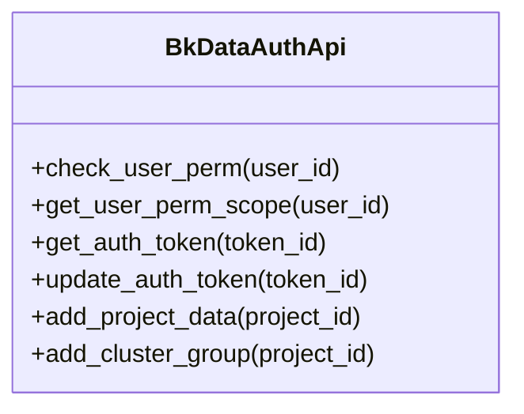

图表来源
- [apps/api/modules/bkdata_auth.py](file://apps/api/modules/bkdata_auth.py)

章节来源
- [apps/api/modules/bkdata_auth.py](file://apps/api/modules/bkdata_auth.py)
- [apps/api/modules/utils.py](file://apps/api/modules/utils.py)

### 数据总线（Databus）
- 关键能力：数据入库列表、创建/更新入库；清洗配置列表、创建/更新清洗、调试；清洗任务创建/停止。
- 版本兼容：同时支持v3/v4路径，便于平滑迁移。
- 租户注入：针对不同接口动态解析result_table_id或bk_biz_id提取租户ID。

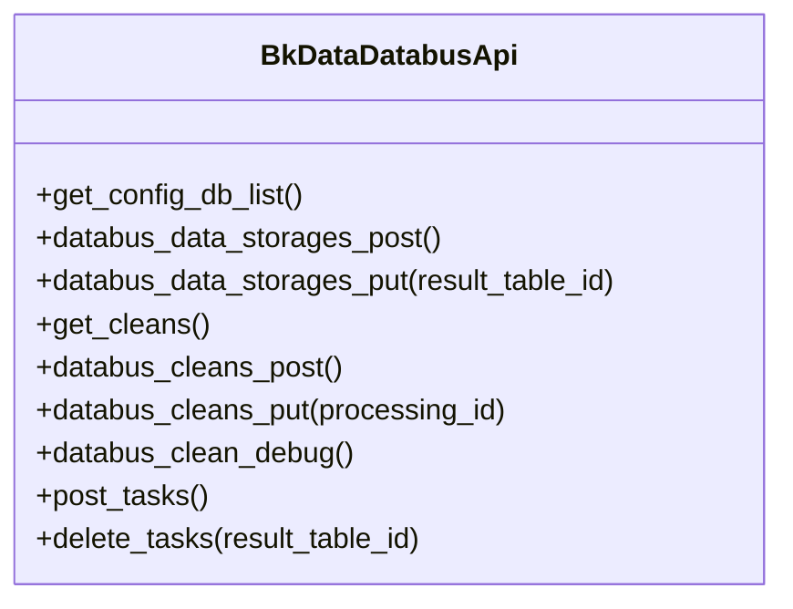

图表来源
- [apps/api/modules/bkdata_databus.py](file://apps/api/modules/bkdata_databus.py)

章节来源
- [apps/api/modules/bkdata_databus.py](file://apps/api/modules/bkdata_databus.py)

### 数据流（Dataflow）
- 关键能力：导出/创建/启动/停止/重启流程；获取流程图、节点增删改；获取最新部署信息；设置资源。
- 超时与租户：部分接口设置较长超时，支持按流程/节点维度注入租户ID。

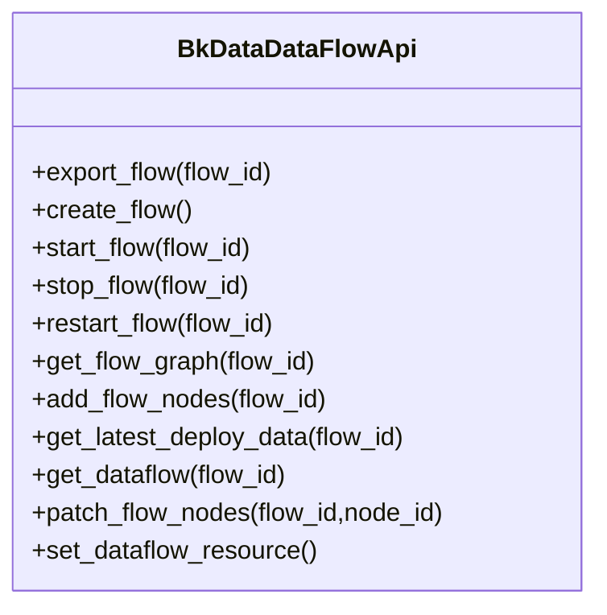

图表来源
- [apps/api/modules/bkdata_dataflow.py](file://apps/api/modules/bkdata_dataflow.py)

章节来源
- [apps/api/modules/bkdata_dataflow.py](file://apps/api/modules/bkdata_dataflow.py)

### 元数据（Meta）
- 关键能力：结果表集合CRUD，支持storages/mine/fields等动作。
- 多租户：根据bk_biz_id或result_table_id推导租户ID。

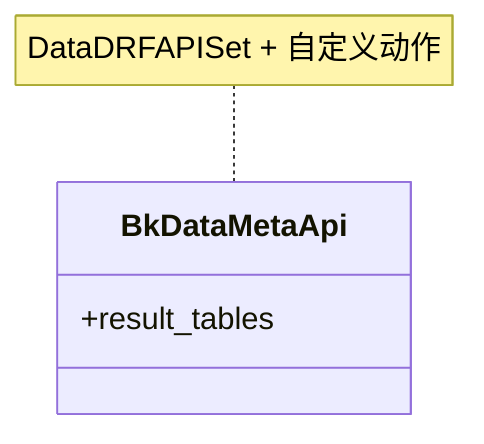

图表来源
- [apps/api/modules/bkdata_meta.py](file://apps/api/modules/bkdata_meta.py)

章节来源
- [apps/api/modules/bkdata_meta.py](file://apps/api/modules/bkdata_meta.py)

### 查询引擎（Query）
- 关键能力：原始数据同步查询。
- 鉴权：使用超级用户模式，强制注入bkdata鉴权参数。

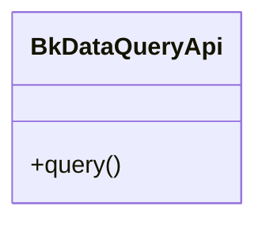

图表来源
- [apps/api/modules/bkdata_query.py](file://apps/api/modules/bkdata_query.py)

章节来源
- [apps/api/modules/bkdata_query.py](file://apps/api/modules/bkdata_query.py)
- [apps/api/modules/utils.py](file://apps/api/modules/utils.py)

### 资源中心（Resource Center）
- 关键能力：集群摘要查询、资源集创建/更新。
- 租户注入：按业务ID推导租户ID。

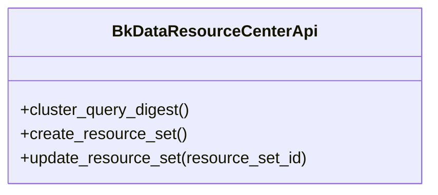

图表来源
- [apps/api/modules/bkdata_resource_center.py](file://apps/api/modules/bkdata_resource_center.py)

章节来源
- [apps/api/modules/bkdata_resource_center.py](file://apps/api/modules/bkdata_resource_center.py)

### 存储套件（Storekit）
- 关键能力：结果表Schema与SQL查询、存储集群配置查询、ES路由转发。
- 场景：对接ES存储时的路由与元信息查询。

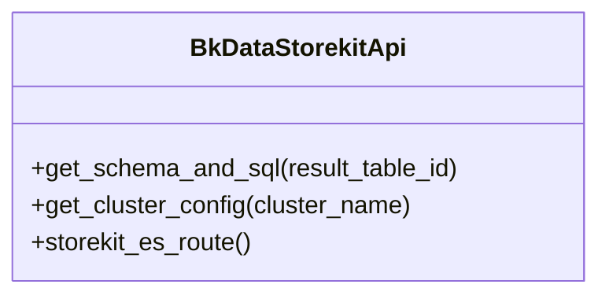

图表来源
- [apps/api/modules/bkdata_storekit.py](file://apps/api/modules/bkdata_storekit.py)

章节来源
- [apps/api/modules/bkdata_storekit.py](file://apps/api/modules/bkdata_storekit.py)

### AI分析（AIOPS）
- 关键能力：模型发布、模型文件获取、在线训练任务创建/更新、服务实例配置与存储集群查询。
- 租户注入：按data_processing_id推导租户ID。

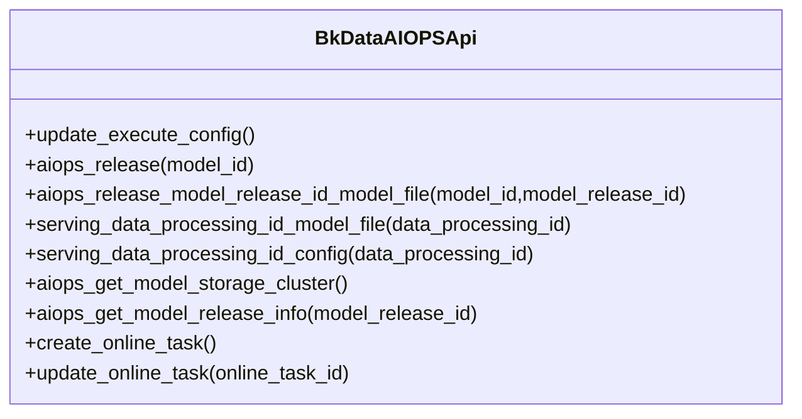

图表来源
- [apps/api/modules/bkdata_aiops.py](file://apps/api/modules/bkdata_aiops.py)

章节来源
- [apps/api/modules/bkdata_aiops.py](file://apps/api/modules/bkdata_aiops.py)

### 数据传输协议与API规范
- 协议：HTTPS；请求头包含X-Bkapi-Authorization（包含bk_app_code、bk_app_secret、bk_username等），以及X-Bk-Tenant-Id（多租户）。
- 方法：GET/POST/PUT/PATCH/DELETE，部分接口支持方法覆盖（X-METHOD-OVERRIDE）。
- 超时：默认60秒，部分Dataflow接口设置更长超时。
- 缓存：支持按接口粒度开启缓存，缓存键基于URL与参数哈希。
- 重试：可配置重试次数与等待区间，支持基于异常类型与结果判定的重试策略。
- 序列化：支持after_serializer对响应进行DRF风格校验与清洗。

章节来源
- [apps/api/base.py](file://apps/api/base.py)
- [apps/api/modules/utils.py](file://apps/api/modules/utils.py)

### 数据格式与参数约定
- 用户/应用鉴权：统一注入bk_username/operator/app_code/X-Bk-App-Code；token模式下注入bkdata_authentication_method与bkdata_data_token。
- 租户ID：通过biz_to_tenant_getter或space_to_tenant_getter从请求参数中解析业务/空间ID并映射为租户ID。
- 空间适配：对非CC业务场景，自动替换为关联的CC业务ID，确保跨空间调用一致性。

章节来源
- [apps/api/modules/utils.py](file://apps/api/modules/utils.py)

### 数据同步策略
- 实时同步：通过DataAPI的即时调用实现，适用于低延迟场景。
- 批量同步：DataAPI提供bulk_request与batch_request，支持分页/切片并发拉取，提升吞吐。
- 增量更新：结合Dataflow的清洗/分发任务与Meta的结果表变更，实现增量配置下发与状态同步。

章节来源
- [apps/api/base.py](file://apps/api/base.py)
- [apps/api/modules/bkdata_databus.py](file://apps/api/modules/bkdata_databus.py)
- [apps/api/modules/bkdata_dataflow.py](file://apps/api/modules/bkdata_dataflow.py)
- [apps/api/modules/bkdata_meta.py](file://apps/api/modules/bkdata_meta.py)

### 权限控制与数据安全
- 访问令牌管理：支持token与user两种鉴权方式，token模式下自动注入bkdata_data_token与authentication_method。
- 数据加密：请求头X-Bkapi-Authorization承载敏感认证信息，传输走HTTPS。
- 审计日志：DataAPI统一记录请求/响应、耗时、错误码与消息，便于审计与追踪。

章节来源
- [apps/api/modules/utils.py](file://apps/api/modules/utils.py)
- [apps/api/base.py](file://apps/api/base.py)

### 第三方平台配置指南
- 平台地址：通过config.domains加载各模块API网关根地址（ACCESS、AUTH、DATAQUERY、DATABUS、META、RESOURCECENTER、STOREKIT、AIOPS、DATAFLOW等）。
- 认证参数：确保第三方平台在请求头中提供X-Bkapi-Authorization，包含bk_app_code、bk_app_secret、bk_username；必要时设置X-Bk-Tenant-Id。
- 网络设置：API网关环境配置包含超时、负载均衡与Header转换；外部调用时中间件会切换公钥提供方。

章节来源
- [config/domains.py](file://config/domains.py)
- [config/env.py](file://config/env.py)
- [apps/middlewares.py](file://apps/middlewares.py)
- [support-files/apigw/definition.yaml](file://support-files/apigw/definition.yaml)

## 依赖分析
- 模块内聚：各模块职责清晰，均通过DataAPI/DataDRFAPISet抽象对外暴露。
- 模块耦合：统一依赖apps/api/modules/utils.py提供的鉴权与租户工具，config/domains.py提供域名配置。
- 外部依赖：蓝鲸API网关、BK Data各子系统；内部依赖apps/api/base.py与config/*。

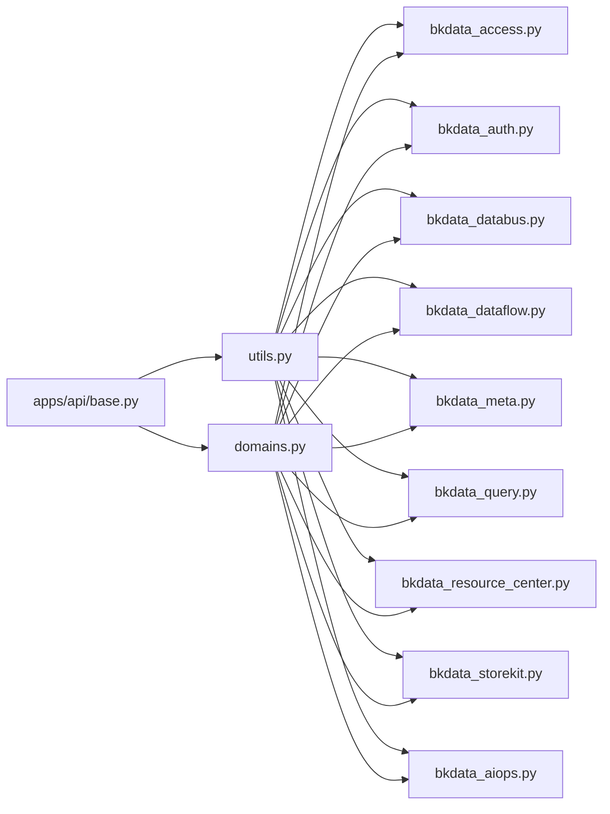

图表来源
- [apps/api/modules/utils.py](file://apps/api/modules/utils.py)
- [apps/api/modules/bkdata_access.py](file://apps/api/modules/bkdata_access.py)
- [apps/api/modules/bkdata_auth.py](file://apps/api/modules/bkdata_auth.py)
- [apps/api/modules/bkdata_databus.py](file://apps/api/modules/bkdata_databus.py)
- [apps/api/modules/bkdata_dataflow.py](file://apps/api/modules/bkdata_dataflow.py)
- [apps/api/modules/bkdata_meta.py](file://apps/api/modules/bkdata_meta.py)
- [apps/api/modules/bkdata_query.py](file://apps/api/modules/bkdata_query.py)
- [apps/api/modules/bkdata_resource_center.py](file://apps/api/modules/bkdata_resource_center.py)
- [apps/api/modules/bkdata_storekit.py](file://apps/api/modules/bkdata_storekit.py)
- [apps/api/modules/bkdata_aiops.py](file://apps/api/modules/bkdata_aiops.py)
- [apps/api/base.py](file://apps/api/base.py)
- [config/domains.py](file://config/domains.py)

章节来源
- [apps/api/modules/utils.py](file://apps/api/modules/utils.py)
- [apps/api/base.py](file://apps/api/base.py)
- [config/domains.py](file://config/domains.py)

## 性能考虑
- 并发与分页：优先使用bulk_request/batch_request进行分页/切片并发拉取，减少单次请求压力。
- 缓存：对高频读取接口启用cache_time，降低后端压力与延迟。
- 超时与重试：合理设置default_timeout与重试策略，避免慢请求阻塞。
- 日志与监控：利用DataAPI统一日志记录，关注耗时与错误率指标，定位瓶颈。

章节来源
- [apps/api/base.py](file://apps/api/base.py)

## 故障排查指南
- 请求失败：检查X-Bkapi-Authorization是否完整、X-Bk-Tenant-Id是否正确、域名配置是否匹配环境。
- 超时与重试：确认default_timeout设置与重试策略；关注DataAPI日志中的错误码与消息。
- 权限问题：核对bkdata_authentication_method与bkdata_data_token配置；必要时切换为user鉴权。
- 清洗与分发：若清洗任务异常，检查result_table_id与租户ID解析逻辑；必要时重新创建任务。
- 存储路由：ES路由失败时，先查询集群配置再尝试直连。

章节来源
- [apps/api/base.py](file://apps/api/base.py)
- [apps/api/modules/utils.py](file://apps/api/modules/utils.py)
- [apps/api/modules/bkdata_databus.py](file://apps/api/modules/bkdata_databus.py)
- [apps/api/modules/bkdata_storekit.py](file://apps/api/modules/bkdata_storekit.py)

## 结论
通过统一的DataAPI抽象与完善的鉴权/租户/空间适配工具链，第三方平台可稳定、高效地接入BK Data全栈能力。建议在生产环境中充分利用并发拉取、缓存与重试策略，并严格遵循认证与租户配置规范，确保数据同步与查询的可靠性与安全性。

## 附录

### 数据清洗与同步要点
- 清洗同步：提供锁机制与超时控制，避免重复与冲突。
- 集群统计：批量更新存储使用情况，保障资源可视化与容量管理。

章节来源
- [apps/log_databus/utils/bkdata_clean.py](file://apps/log_databus/utils/bkdata_clean.py)
- [apps/log_databus/tasks/collector.py](file://apps/log_databus/tasks/collector.py)