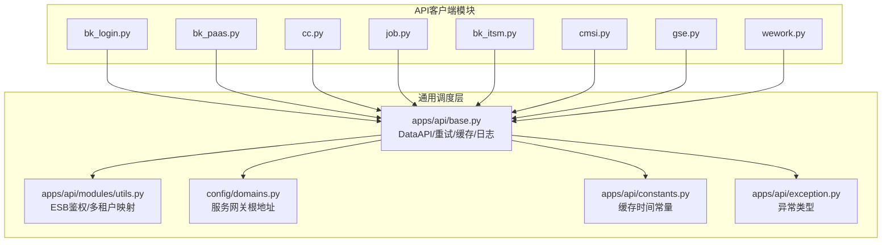
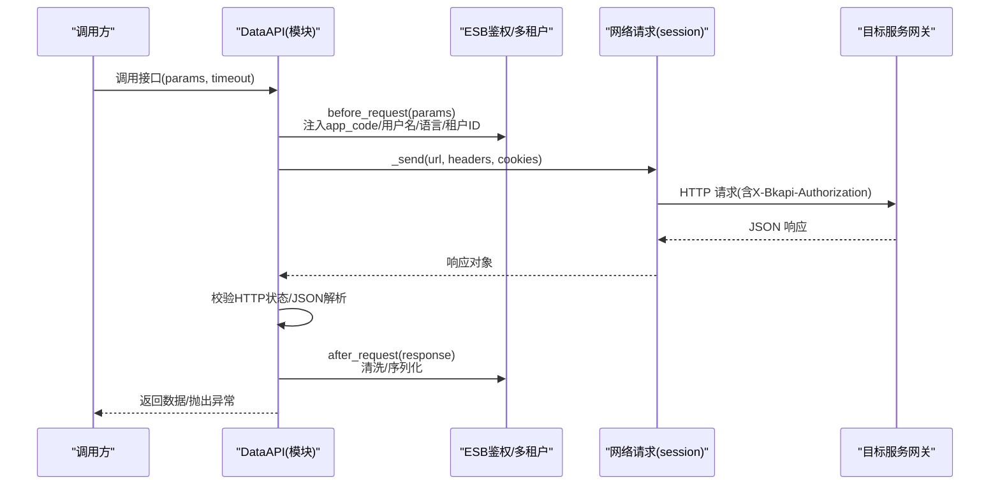
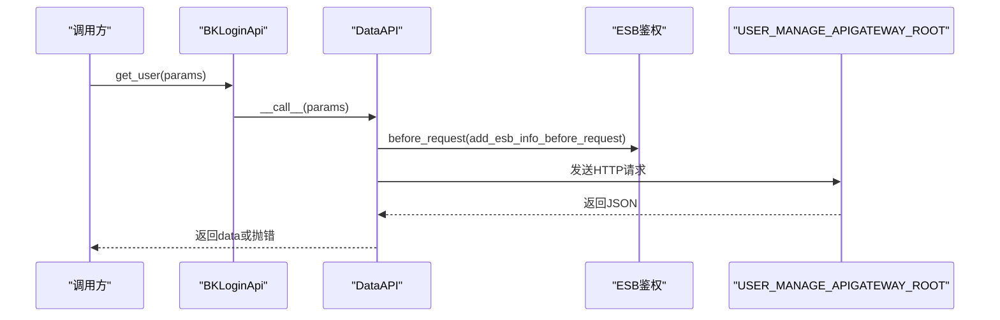
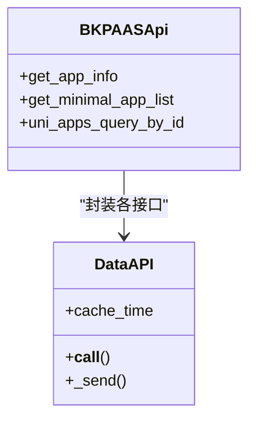
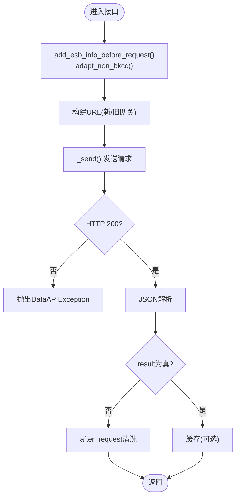
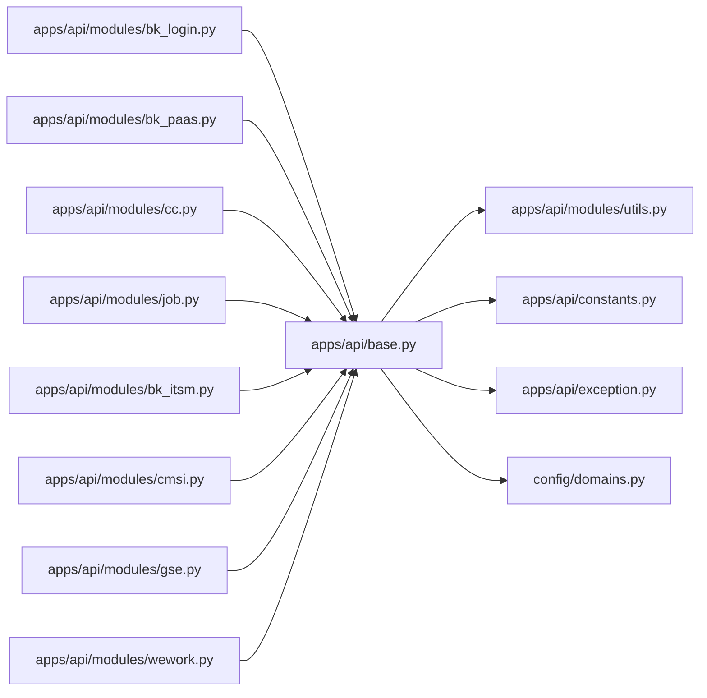

# 蓝鲸生态服务集成

<cite>
**本文引用的文件**
- [apps/api/base.py](file://apps/api/base.py)
- [apps/api/modules/utils.py](file://apps/api/modules/utils.py)
- [apps/api/modules/bk_login.py](file://apps/api/modules/bk_login.py)
- [apps/api/modules/bk_paas.py](file://apps/api/modules/bk_paas.py)
- [apps/api/modules/cc.py](file://apps/api/modules/cc.py)
- [apps/api/modules/job.py](file://apps/api/modules/job.py)
- [apps/api/modules/bk_itsm.py](file://apps/api/modules/bk_itsm.py)
- [apps/api/modules/cmsi.py](file://apps/api/modules/cmsi.py)
- [apps/api/modules/gse.py](file://apps/api/modules/gse.py)
- [apps/api/modules/wework.py](file://apps/api/modules/wework.py)
- [config/domains.py](file://config/domains.py)
- [apps/api/exception.py](file://apps/api/exception.py)
- [apps/api/constants.py](file://apps/api/constants.py)
- [docs/apidocs/bk_log.yaml](file://docs/apidocs/bk_log.yaml)
- [README.md](file://README.md)
</cite>

## 目录
1. [简介](#简介)
2. [项目结构](#项目结构)
3. [核心组件](#核心组件)
4. [架构总览](#架构总览)
5. [详细组件分析](#详细组件分析)
6. [依赖分析](#依赖分析)
7. [性能考虑](#性能考虑)
8. [故障排查指南](#故障排查指南)
9. [结论](#结论)
10. [附录](#附录)

## 简介
本文件面向蓝鲸生态服务集成，围绕用户认证(bk_login)、应用管理(bk_paas)、配置平台(cc)、作业平台(job)、流程服务(itsm)、消息管理(cmsi)、管控平台(gse)、企业微信(wework)等核心服务，系统化梳理其集成实现方式，包括：
- API 调用方法、认证机制、数据格式与错误处理
- 服务间依赖关系与调用顺序
- 服务发现、负载均衡与故障转移机制
- 配置参数说明（API 地址、认证密钥、超时与重试策略）
- 最佳实践与常见问题解决方案

## 项目结构
蓝鲸生态服务集成的核心位于 apps/api 模块，采用“模块化 API 客户端 + 通用 DataAPI 调度器”的架构：
- 每个蓝鲸服务在 apps/api/modules 下对应一个模块文件，封装该服务的 API 客户端
- 通用调度器 DataAPI 提供统一的请求发送、参数清洗、缓存、重试、日志与异常处理
- config/domains.py 统一加载各服务网关根地址
- apps/api/modules/utils.py 提供通用的请求前置处理（ESB 鉴权、多租户映射等）

图表来源
- [apps/api/base.py:191-800](file://apps/api/base.py#L191-L800)
- [apps/api/modules/utils.py:147-248](file://apps/api/modules/utils.py#L147-L248)
- [config/domains.py:29-84](file://config/domains.py#L29-L84)
- [apps/api/constants.py:22-25](file://apps/api/constants.py#L22-L25)
- [apps/api/exception.py:29-41](file://apps/api/exception.py#L29-L41)

章节来源
- [apps/api/base.py:191-800](file://apps/api/base.py#L191-L800)
- [apps/api/modules/utils.py:147-248](file://apps/api/modules/utils.py#L147-L248)
- [config/domains.py:29-84](file://config/domains.py#L29-L84)
- [apps/api/constants.py:22-25](file://apps/api/constants.py#L22-L25)
- [apps/api/exception.py:29-41](file://apps/api/exception.py#L29-L41)

## 核心组件
- DataAPI：统一的蓝鲸 API 客户端封装，负责请求发送、参数清洗(before_request/after_request)、缓存(cache_time)、重试、日志记录与异常抛出
- ESB 鉴权工具：add_esb_info_before_request/add_app_info_before_request 等，自动注入 app_code、用户名、语言等上下文
- 多租户映射：biz_to_tenant_getter/space_to_tenant_getter，将业务/空间映射为租户ID
- 服务网关根地址：config/domains.py 从环境加载各服务网关根地址

章节来源
- [apps/api/base.py:191-800](file://apps/api/base.py#L191-L800)
- [apps/api/modules/utils.py:147-248](file://apps/api/modules/utils.py#L147-L248)
- [config/domains.py:29-84](file://config/domains.py#L29-L84)

## 架构总览
以下序列图展示一次典型 API 调用的完整链路：客户端调用 -> DataAPI -> ESB 鉴权 -> 发送请求 -> 结果清洗/缓存 -> 返回

图表来源
- [apps/api/base.py:332-481](file://apps/api/base.py#L332-L481)
- [apps/api/base.py:509-600](file://apps/api/base.py#L509-L600)
- [apps/api/modules/utils.py:147-248](file://apps/api/modules/utils.py#L147-L248)

## 详细组件分析

### 用户认证(bk_login)
- 主要能力
  - 获取单个用户信息
  - 获取用户列表（带字段过滤）
  - 获取租户列表（多租户模式）
  - 批量查找虚拟用户
  - 查询用户部门档案
- 认证与参数
  - 使用 ESB 鉴权 add_esb_info_before_request 注入 app_code、用户名、语言等
  - 支持 API 网关与旧网关双栈切换（USE_APIGW 控制）
- 数据格式
  - 请求：标准 JSON；响应：包含 result/message/data/code 等字段
  - 用户列表返回 chname 字段映射 display_name
- 错误处理
  - HTTP 非 200 或 JSON 解析失败时抛出 DataAPIException
  - raise_exception=True 时抛出 ApiResultError

图表来源
- [apps/api/modules/bk_login.py:72-109](file://apps/api/modules/bk_login.py#L72-L109)
- [apps/api/base.py:277-320](file://apps/api/base.py#L277-L320)
- [apps/api/modules/utils.py:183-216](file://apps/api/modules/utils.py#L183-L216)

章节来源
- [apps/api/modules/bk_login.py:31-109](file://apps/api/modules/bk_login.py#L31-L109)
- [apps/api/modules/utils.py:183-216](file://apps/api/modules/utils.py#L183-L216)
- [apps/api/exception.py:29-41](file://apps/api/exception.py#L29-L41)

### 应用管理(bk_paas)
- 主要能力
  - 获取应用信息
  - 获取最小应用列表（V3）
  - 通过 app_id 查询 uni_applications
- 认证与参数
  - 使用 ESB 鉴权 add_esb_info_before_request
  - 支持 API 网关（BK_PAAS_APIGATEWAY_ROOT/BK_PAAS_V3_APIGATEWAY_ROOT）
- 缓存
  - uni_apps_query_by_id 使用 5 分钟缓存

图表来源
- [apps/api/modules/bk_paas.py:34-62](file://apps/api/modules/bk_paas.py#L34-L62)
- [apps/api/base.py:191-276](file://apps/api/base.py#L191-L276)
- [apps/api/constants.py:24](file://apps/api/constants.py#L24)

章节来源
- [apps/api/modules/bk_paas.py:34-62](file://apps/api/modules/bk_paas.py#L34-L62)
- [apps/api/constants.py:24](file://apps/api/constants.py#L24)

### 配置平台(cc)
- 主要能力
  - 业务/模块/主机/拓扑/动态分组/服务模板等查询
  - 支持多租户映射 biz_to_tenant_getter
- 认证与参数
  - ESB 鉴权 + 供应商账号兼容 adapt_non_bkcc
  - 支持 API 网关与旧网关双栈切换
- 特殊处理
  - filter_bk_field_prefix_before 过滤非 bk_ 前缀参数
  - list_hosts_without_biz 支持无业务条件查询

图表来源
- [apps/api/modules/cc.py:60-318](file://apps/api/modules/cc.py#L60-L318)
- [apps/api/base.py:332-481](file://apps/api/base.py#L332-L481)

章节来源
- [apps/api/modules/cc.py:30-318](file://apps/api/modules/cc.py#L30-L318)
- [apps/api/modules/utils.py:62-112](file://apps/api/modules/utils.py#L62-L112)

### 作业平台(job)
- 主要能力
  - 快速执行脚本/文件分发/查询实例日志/状态
- 认证与参数
  - ESB 鉴权 + 供应商账号兼容
  - 支持 API 网关与旧网关双栈切换
  - 多租户映射 biz_to_tenant_getter

章节来源
- [apps/api/modules/job.py:30-106](file://apps/api/modules/job.py#L30-L106)
- [apps/api/modules/utils.py:62-112](file://apps/api/modules/utils.py#L62-L112)

### 流程服务(itsm)
- 主要能力
  - 创建单据、回调失败单据、查询单据状态/详情、查询服务列表、token 校验
- 认证与参数
  - ESB 鉴权 add_esb_info_before_request
  - API 网关根地址 ITSM_APIGATEWAY_ROOT_V2

章节来源
- [apps/api/modules/bk_itsm.py:30-86](file://apps/api/modules/bk_itsm.py#L30-L86)

### 消息管理(cmsi)
- 主要能力
  - 发送邮件/短信/语音/通用消息、发送微信、查询消息类型
- 认证与参数
  - ESB 鉴权 add_esb_info_before_request
  - 微信发送前将 content/heading 映射为 data/message/heading
  - API 网关根地址 CMSI_APIGATEWAY_ROOT_V2

章节来源
- [apps/api/modules/cmsi.py:30-118](file://apps/api/modules/cmsi.py#L30-L118)

### 管控平台(gse)
- 主要能力
  - 查询数据路由配置、查询数据入库消息队列或第三方平台配置
- 认证与参数
  - ESB 鉴权 add_esb_info_before_request
  - API 网关根地址 GSE_APIGATEWAY_ROOT_V2

章节来源
- [apps/api/modules/gse.py:30-74](file://apps/api/modules/gse.py#L30-L74)

### 企业微信(wework)
- 主要能力
  - 创建企业微信群聊、发送企业微信群聊
- 认证与参数
  - ESB 鉴权 add_esb_info_before_request
  - API 网关根地址 WEWORK_APIGATEWAY_ROOT

章节来源
- [apps/api/modules/wework.py:28-49](file://apps/api/modules/wework.py#L28-L49)

## 依赖分析
- 模块耦合
  - 各服务模块仅依赖 apps/api/base.py 与 config/domains.py，低耦合高内聚
  - ESB 鉴权与多租户映射集中在 utils.py，避免重复实现
- 外部依赖
  - requests、retrying、django cache、opentelemetry
- 可能的循环依赖
  - 未见循环导入；模块间通过函数/类间接交互

图表来源
- [apps/api/base.py:191-800](file://apps/api/base.py#L191-L800)
- [apps/api/modules/utils.py:147-248](file://apps/api/modules/utils.py#L147-L248)
- [apps/api/constants.py:22-25](file://apps/api/constants.py#L22-L25)
- [apps/api/exception.py:29-41](file://apps/api/exception.py#L29-L41)
- [config/domains.py:29-84](file://config/domains.py#L29-L84)

章节来源
- [apps/api/base.py:191-800](file://apps/api/base.py#L191-L800)
- [apps/api/modules/utils.py:147-248](file://apps/api/modules/utils.py#L147-L248)
- [config/domains.py:29-84](file://config/domains.py#L29-L84)

## 性能考虑
- 缓存策略
  - uni_apps_query_by_id 使用 5 分钟缓存，减少频繁查询
  - list_hosts/list_biz_hosts 等接口可结合 cache_time 降低后端压力
- 并发与分页
  - bulk_request/batch_request 支持分页/切片并发请求，提升大批量数据拉取效率
- 超时与重试
  - default_timeout 可按接口特性调整
  - DataApiRetryClass 支持自定义异常/结果重试策略
- 日志与可观测
  - 统一记录请求/响应、耗时、错误码，便于定位性能瓶颈

章节来源
- [apps/api/constants.py:24](file://apps/api/constants.py#L24)
- [apps/api/base.py:632-741](file://apps/api/base.py#L632-L741)
- [apps/api/base.py:108-174](file://apps/api/base.py#L108-L174)

## 故障排查指南
- 常见错误类型
  - HTTP 非 200：抛出 DataAPIException
  - JSON 非法：抛出 DataAPIException，并记录详细错误
  - 结果字段缺失：自动补全 result/message/code，确保上层一致处理
- 定位手段
  - 查看日志中的 url/module/method/query_params/response_data/cost_time
  - 检查 X-Bkapi-Authorization 是否正确注入
  - 核对 USE_APIGW 与网关根地址配置
- 建议
  - 对关键接口开启缓存
  - 对不稳定接口配置重试策略
  - 对大批量数据使用并发/分页请求

章节来源
- [apps/api/base.py:332-481](file://apps/api/base.py#L332-L481)
- [apps/api/exception.py:29-41](file://apps/api/exception.py#L29-L41)

## 结论
本项目通过 DataAPI 统一调度与 ESB 鉴权工具，实现了对蓝鲸生态核心服务的标准化集成。模块化设计使扩展与维护成本降低，缓存、重试与并发机制有效提升了性能与稳定性。建议在生产环境中：
- 明确各服务网关根地址与 USE_APIGW 配置
- 为高频接口启用缓存，合理设置超时与重试
- 对多租户场景使用 biz_to_tenant_getter 自动映射
- 借助统一日志与异常类型快速定位问题

## 附录

### 配置参数说明
- 网关根地址
  - 通过 config/domains.py 从环境加载，如 BK_PAAS_APIGATEWAY_ROOT、CC_APIGATEWAY_ROOT_V2、JOB_APIGATEWAY_ROOT_V3、ITSM_APIGATEWAY_ROOT_V2、CMSI_APIGATEWAY_ROOT_V2、GSE_APIGATEWAY_ROOT_V2、WEWORK_APIGATEWAY_ROOT 等
- 认证密钥
  - X-Bkapi-Authorization 中包含 app_code、app_secret、username 等
- 超时与重试
  - default_timeout：默认请求超时
  - DataApiRetryClass：可配置 stop_max_attempt_number/wait_random_min/wait_random_max 与失败检查函数
- 缓存
  - cache_time：单位秒，如 5 分钟缓存常量

章节来源
- [config/domains.py:29-84](file://config/domains.py#L29-L84)
- [apps/api/base.py:200-276](file://apps/api/base.py#L200-L276)
- [apps/api/base.py:108-174](file://apps/api/base.py#L108-L174)
- [apps/api/constants.py:24](file://apps/api/constants.py#L24)

### API 文档与资源映射
- 文档来源
  - docs/apidocs/bk_log.yaml 定义了大量资源路径与目标网关路径映射，可用于理解平台对外暴露的 API 与内部转发关系

章节来源
- [docs/apidocs/bk_log.yaml:1-800](file://docs/apidocs/bk_log.yaml#L1-L800)

### 快速开始与环境变量
- 环境变量示例
  - APP_ID、BK_IAM_V3_INNER_HOST、BK_PAAS_HOST、APP_TOKEN 等
- 启动命令
  - python manage.py runserver 8000
  - celery -A worker -l info -c 8

章节来源
- [README.md:64-76](file://README.md#L64-L76)