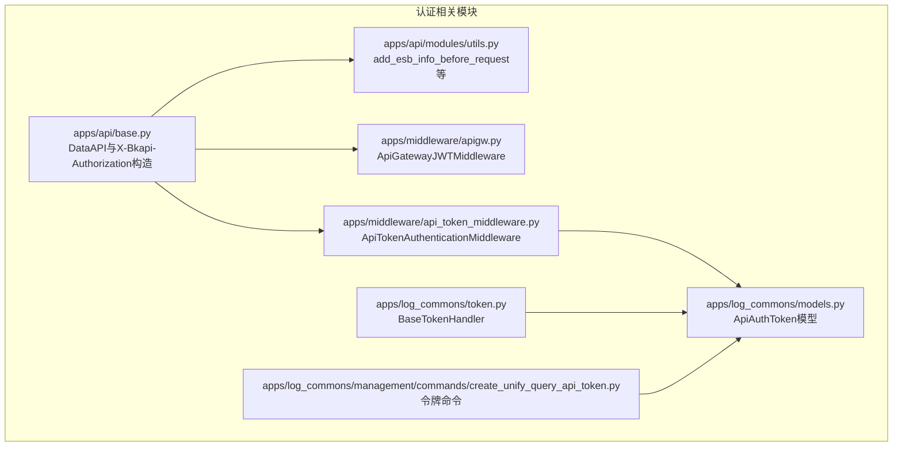
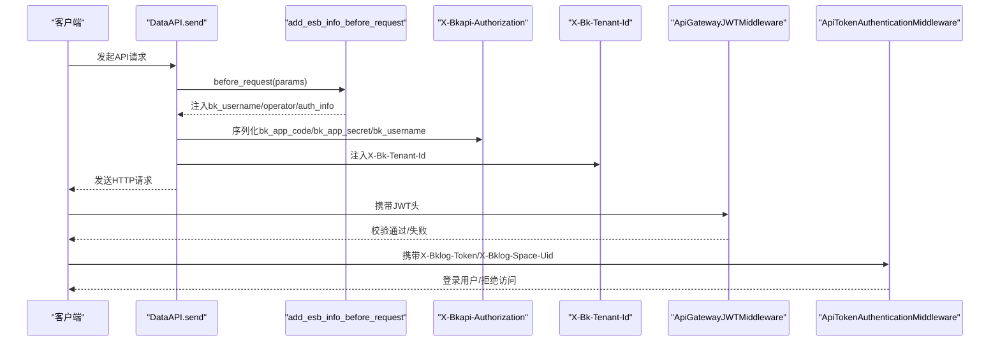
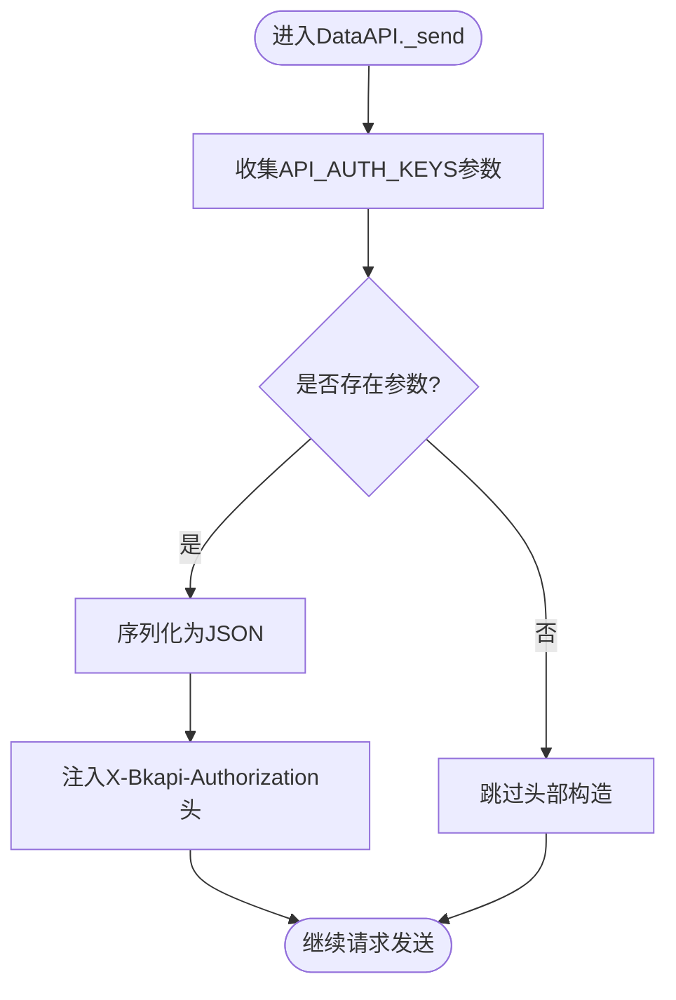
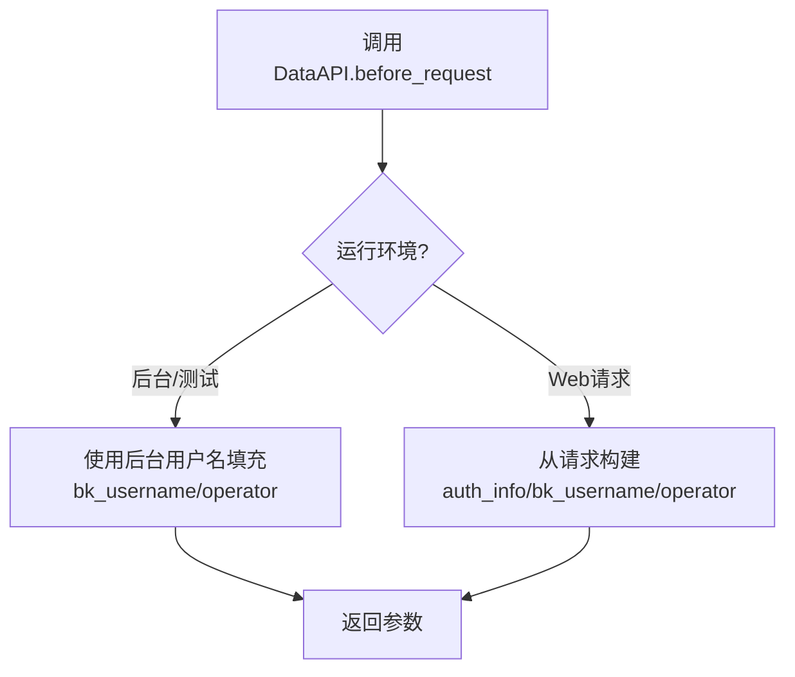
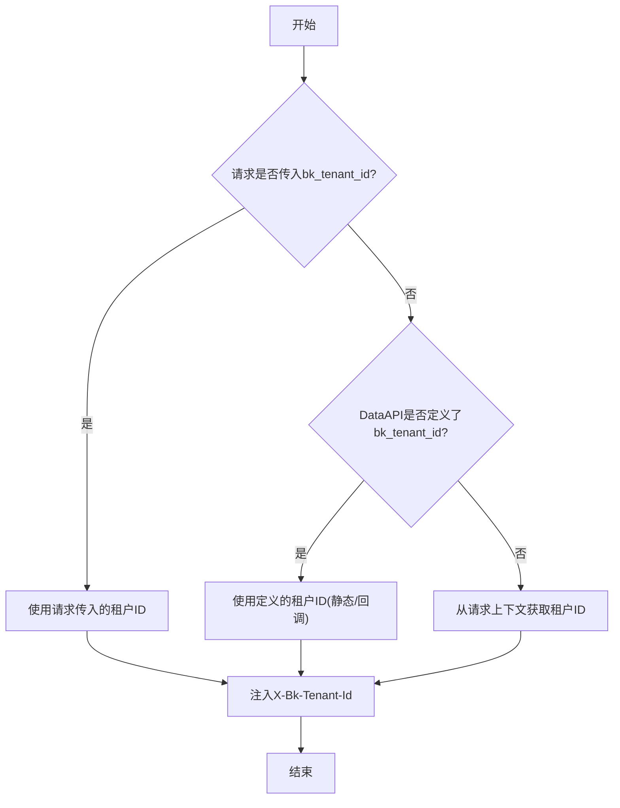
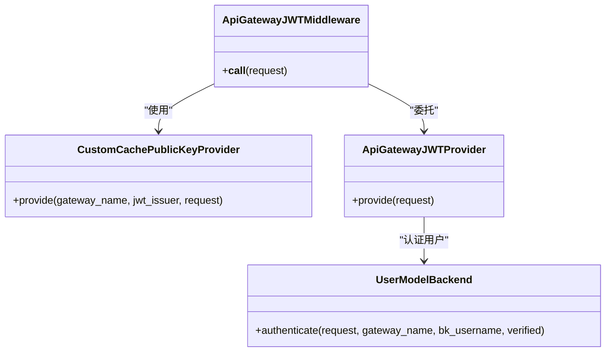
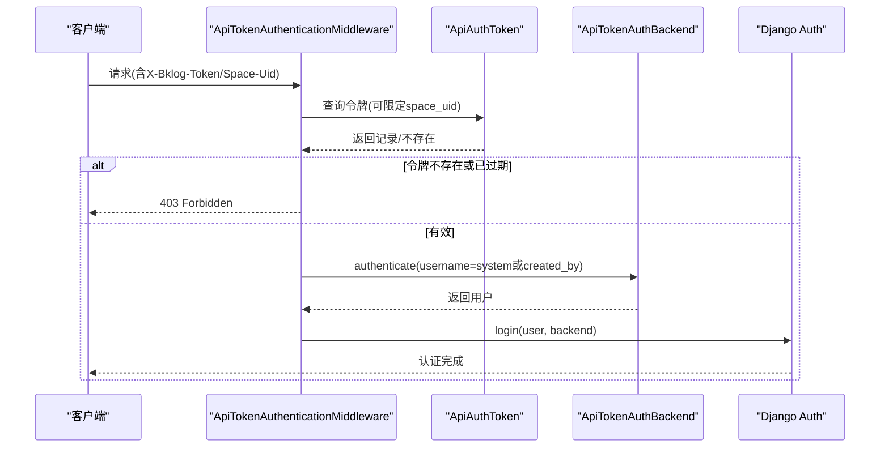
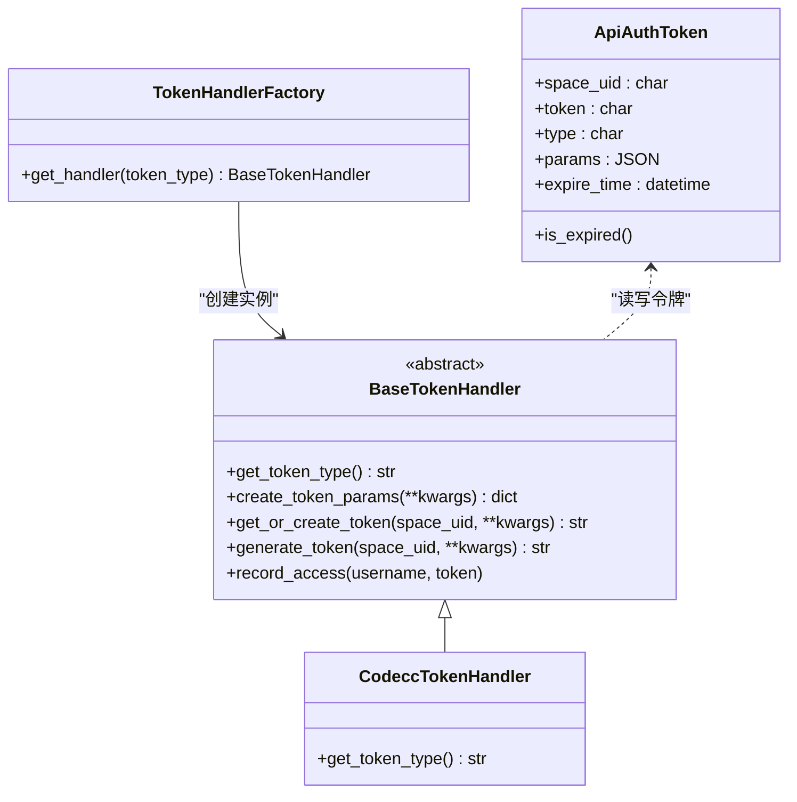
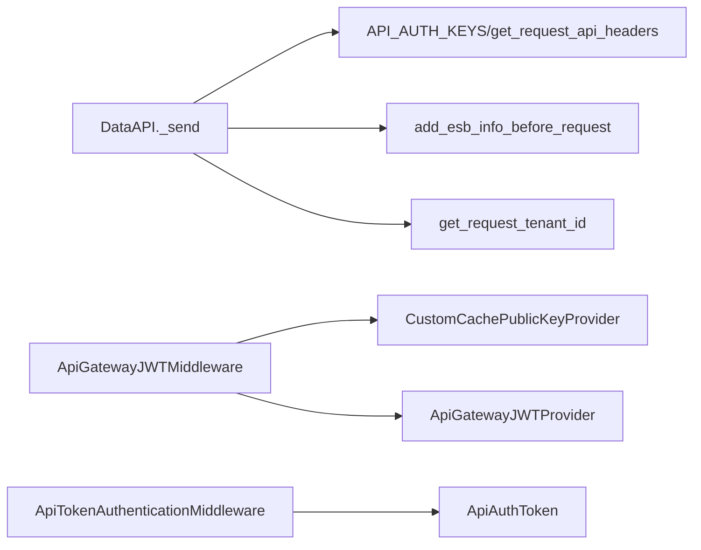

# API认证授权机制

<cite>
**本文引用的文件**
- [apps/api/base.py](file://apps/api/base.py)
- [apps/api/modules/utils.py](file://apps/api/modules/utils.py)
- [apps/middleware/api_token_middleware.py](file://apps/middleware/api_token_middleware.py)
- [apps/middleware/apigw.py](file://apps/middleware/apigw.py)
- [apps/log_commons/models.py](file://apps/log_commons/models.py)
- [apps/log_commons/token.py](file://apps/log_commons/token.py)
- [apps/log_commons/management/commands/create_unify_query_api_token.py](file://apps/log_commons/management/commands/create_unify_query_api_token.py)
- [apps/api/exception.py](file://apps/api/exception.py)
- [apps/exceptions.py](file://apps/exceptions.py)
- [settings.py](file://settings.py)
</cite>

## 目录
1. [简介](#简介)
2. [项目结构](#项目结构)
3. [核心组件](#核心组件)
4. [架构总览](#架构总览)
5. [详细组件分析](#详细组件分析)
6. [依赖分析](#依赖分析)
7. [性能考虑](#性能考虑)
8. [故障排查指南](#故障排查指南)
9. [结论](#结论)

## 简介
本文件面向API认证授权机制，围绕以下目标展开：
- 解释X-Bkapi-Authorization头部的构造原理与实现细节，覆盖bk_app_code、bk_app_secret、bk_username等参数的来源与处理流程
- 说明API密钥管理机制，包括应用密钥的生成、验证与轮换策略
- 阐述权限验证流程，包括用户身份认证、权限校验与访问控制
- 解释多租户模式下的租户ID处理机制，包括租户ID的获取、传递与验证
- 提供认证失败的错误处理与调试指南，包含常见问题排查方法

## 项目结构
围绕认证授权的关键模块分布如下：
- API调用与认证封装：apps/api/base.py
- 认证参数预处理与多租户工具：apps/api/modules/utils.py
- API网关JWT中间件：apps/middleware/apigw.py
- API令牌中间件与认证后端：apps/middleware/api_token_middleware.py
- 令牌模型与令牌处理器：apps/log_commons/models.py、apps/log_commons/token.py
- 令牌命令行工具：apps/log_commons/management/commands/create_unify_query_api_token.py
- 异常体系：apps/api/exception.py、apps/exceptions.py
- 配置入口：settings.py

**图表来源**
- [apps/api/base.py:520-560](file://apps/api/base.py#L520-L560)
- [apps/api/modules/utils.py:174-248](file://apps/api/modules/utils.py#L174-L248)
- [apps/middleware/apigw.py:123-125](file://apps/middleware/apigw.py#L123-L125)
- [apps/middleware/api_token_middleware.py:22-76](file://apps/middleware/api_token_middleware.py#L22-L76)
- [apps/log_commons/models.py:47-68](file://apps/log_commons/models.py#L47-L68)
- [apps/log_commons/token.py:11-64](file://apps/log_commons/token.py#L11-L64)
- [apps/log_commons/management/commands/create_unify_query_api_token.py:32-53](file://apps/log_commons/management/commands/create_unify_query_api_token.py#L32-L53)

**章节来源**
- [apps/api/base.py:520-560](file://apps/api/base.py#L520-L560)
- [apps/api/modules/utils.py:174-248](file://apps/api/modules/utils.py#L174-L248)
- [apps/middleware/apigw.py:123-125](file://apps/middleware/apigw.py#L123-L125)
- [apps/middleware/api_token_middleware.py:22-76](file://apps/middleware/api_token_middleware.py#L22-L76)
- [apps/log_commons/models.py:47-68](file://apps/log_commons/models.py#L47-L68)
- [apps/log_commons/token.py:11-64](file://apps/log_commons/token.py#L11-L64)
- [apps/log_commons/management/commands/create_unify_query_api_token.py:32-53](file://apps/log_commons/management/commands/create_unify_query_api_token.py#L32-L53)

## 核心组件
- X-Bkapi-Authorization头部构造器：负责将bk_app_code、bk_app_secret、bk_username等参数序列化为JSON并放入X-Bkapi-Authorization头
- DataAPI请求发送器：统一处理请求前参数清洗、租户ID注入、请求发送、响应解析与缓存
- 认证参数预处理工具：add_esb_info_before_request等，负责填充bk_username、operator、auth_info等
- API网关JWT中间件：对接网关JWT，解析公钥并校验
- API令牌中间件与后端：基于Header中的令牌进行认证与登录
- 令牌模型与处理器：存储令牌、参数、过期时间，并提供生成与查询能力
- 令牌命令：为特定业务空间生成统一查询令牌

**章节来源**
- [apps/api/base.py:64-74](file://apps/api/base.py#L64-L74)
- [apps/api/base.py:528-553](file://apps/api/base.py#L528-L553)
- [apps/api/modules/utils.py:177-216](file://apps/api/modules/utils.py#L177-L216)
- [apps/middleware/apigw.py:123-125](file://apps/middleware/apigw.py#L123-L125)
- [apps/middleware/api_token_middleware.py:22-76](file://apps/middleware/api_token_middleware.py#L22-L76)
- [apps/log_commons/models.py:47-68](file://apps/log_commons/models.py#L47-L68)
- [apps/log_commons/token.py:11-64](file://apps/log_commons/token.py#L11-L64)

## 架构总览
下图展示了从客户端到后端服务的认证授权路径，涵盖X-Bkapi-Authorization头部构造、多租户ID注入、API网关JWT校验与令牌认证。

**图表来源**
- [apps/api/base.py:528-553](file://apps/api/base.py#L528-L553)
- [apps/api/modules/utils.py:177-216](file://apps/api/modules/utils.py#L177-L216)
- [apps/middleware/apigw.py:123-125](file://apps/middleware/apigw.py#L123-L125)
- [apps/middleware/api_token_middleware.py:22-76](file://apps/middleware/api_token_middleware.py#L22-L76)

## 详细组件分析

### X-Bkapi-Authorization头部构造与实现
- 构造时机：在DataAPI._send阶段，遍历API_AUTH_KEYS并在params中提取对应键值，随后调用get_request_api_headers序列化为JSON字符串
- 关键参数来源：
  - bk_app_code：来自settings.APP_CODE
  - bk_app_secret：来自settings.SECRET_KEY
  - bk_username：来自get_request_username，通常由add_esb_info_before_request填充
- 头部注入：最终以X-Bkapi-Authorization头发送

**图表来源**
- [apps/api/base.py:528-533](file://apps/api/base.py#L528-L533)
- [apps/api/base.py:64-74](file://apps/api/base.py#L64-L74)
- [apps/api/base.py:61](file://apps/api/base.py#L61)

**章节来源**
- [apps/api/base.py:61-74](file://apps/api/base.py#L61-L74)
- [apps/api/base.py:528-533](file://apps/api/base.py#L528-L533)

### 认证参数预处理与用户态注入
- add_esb_info_before_request在不同运行环境下行为不同：
  - 后台任务/测试：使用后台用户名，不依赖HTTP请求
  - Web请求：从当前请求构建auth_info、bk_username、operator，并兼容uin字段
- 该函数在DataAPI调用前执行，确保bk_username、operator、auth_info等参数被注入到请求参数中

**图表来源**
- [apps/api/modules/utils.py:139-171](file://apps/api/modules/utils.py#L139-L171)
- [apps/api/modules/utils.py:174-248](file://apps/api/modules/utils.py#L174-L248)

**章节来源**
- [apps/api/modules/utils.py:139-171](file://apps/api/modules/utils.py#L139-L171)
- [apps/api/modules/utils.py:174-248](file://apps/api/modules/utils.py#L174-L248)

### 多租户ID处理机制
- 注入时机：在DataAPI._send阶段，若未显式传入bk_tenant_id，则按以下顺序确定：
  - 请求时传入的bk_tenant_id
  - DataAPI定义时的bk_tenant_id（静态值或回调函数）
  - 从当前请求上下文中获取租户ID
- 头部注入：最终以X-Bk-Tenant-Id头发送至下游

**图表来源**
- [apps/api/base.py:332-353](file://apps/api/base.py#L332-L353)
- [apps/api/base.py:541-553](file://apps/api/base.py#L541-L553)

**章节来源**
- [apps/api/base.py:332-353](file://apps/api/base.py#L332-L353)
- [apps/api/base.py:541-553](file://apps/api/base.py#L541-L553)

### API网关JWT中间件
- 功能：解析JWT并校验签名，支持内部网关与外部网关公钥切换
- 公钥提供：CustomCachePublicKeyProvider根据请求头Is-External选择不同公钥
- 认证后端：UserModelBackend按用户名获取或构造用户对象

**图表来源**
- [apps/middleware/apigw.py:123-125](file://apps/middleware/apigw.py#L123-L125)
- [apps/middleware/apigw.py:60-92](file://apps/middleware/apigw.py#L60-L92)
- [apps/middleware/apigw.py:95-120](file://apps/middleware/apigw.py#L95-L120)
- [apps/middleware/apigw.py:41-58](file://apps/middleware/apigw.py#L41-L58)

**章节来源**
- [apps/middleware/apigw.py:123-125](file://apps/middleware/apigw.py#L123-L125)
- [apps/middleware/apigw.py:60-92](file://apps/middleware/apigw.py#L60-L92)
- [apps/middleware/apigw.py:95-120](file://apps/middleware/apigw.py#L95-L120)
- [apps/middleware/apigw.py:41-58](file://apps/middleware/apigw.py#L41-L58)

### API令牌中间件与认证后端
- 认证方式：支持两种：
  - 仅携带X-Bklog-Token
  - 同时携带X-Bklog-Token与X-Bklog-Space-Uid
- 查询与校验：根据令牌查询ApiAuthToken，若设置过期时间则校验是否过期
- 认证处理：
  - Grafana类型：替换请求用户为system并跳过权限检查
  - CodeCC类型：使用令牌创建者作为用户
  - 默认类型：仅设置request.token

**图表来源**
- [apps/middleware/api_token_middleware.py:22-76](file://apps/middleware/api_token_middleware.py#L22-L76)
- [apps/log_commons/models.py:47-68](file://apps/log_commons/models.py#L47-L68)

**章节来源**
- [apps/middleware/api_token_middleware.py:22-76](file://apps/middleware/api_token_middleware.py#L22-L76)
- [apps/log_commons/models.py:47-68](file://apps/log_commons/models.py#L47-L68)

### 令牌模型与处理器
- ApiAuthToken模型：
  - 存储space_uid、token、type、params、expire_time
  - 提供is_expired判断过期
- BaseTokenHandler：
  - 抽象基类，提供get_or_create_token、generate_token、record_access等
  - CodeccTokenHandler为具体实现
- TokenHandlerFactory：
  - 根据类型获取对应处理器实例

**图表来源**
- [apps/log_commons/models.py:47-68](file://apps/log_commons/models.py#L47-L68)
- [apps/log_commons/token.py:11-64](file://apps/log_commons/token.py#L11-L64)
- [apps/log_commons/token.py:74-90](file://apps/log_commons/token.py#L74-L90)

**章节来源**
- [apps/log_commons/models.py:47-68](file://apps/log_commons/models.py#L47-L68)
- [apps/log_commons/token.py:11-64](file://apps/log_commons/token.py#L11-L64)
- [apps/log_commons/token.py:74-90](file://apps/log_commons/token.py#L74-L90)

### 令牌命令行工具
- 功能：为UnifyQuery类型令牌生成或获取，支持通过bk_biz_id或space_uid定位空间
- 参数：--bk_biz_id/--space_uid/--app_code/--expire_time
- 行为：根据space_uid与type查找或创建ApiAuthToken

**章节来源**
- [apps/log_commons/management/commands/create_unify_query_api_token.py:32-53](file://apps/log_commons/management/commands/create_unify_query_api_token.py#L32-L53)

## 依赖分析
- DataAPI依赖：
  - API_AUTH_KEYS：决定哪些参数会被纳入X-Bkapi-Authorization
  - get_request_api_headers：构造头部
  - add_esb_info_before_request：注入用户态参数
  - get_request_tenant_id：获取租户ID
- 中间件依赖：
  - ApiGatewayJWTMiddleware依赖CustomCachePublicKeyProvider与ApiGatewayJWTProvider
  - ApiTokenAuthenticationMiddleware依赖ApiAuthToken模型与自定义后端
- 配置入口：
  - settings.py加载环境配置，影响APP_CODE、SECRET_KEY等关键认证参数

**图表来源**
- [apps/api/base.py:61-74](file://apps/api/base.py#L61-L74)
- [apps/api/base.py:528-553](file://apps/api/base.py#L528-L553)
- [apps/api/modules/utils.py:174-248](file://apps/api/modules/utils.py#L174-L248)
- [apps/middleware/apigw.py:60-92](file://apps/middleware/apigw.py#L60-L92)
- [apps/middleware/apigw.py:95-120](file://apps/middleware/apigw.py#L95-L120)
- [apps/middleware/api_token_middleware.py:22-76](file://apps/middleware/api_token_middleware.py#L22-L76)
- [apps/log_commons/models.py:47-68](file://apps/log_commons/models.py#L47-L68)

**章节来源**
- [apps/api/base.py:61-74](file://apps/api/base.py#L61-L74)
- [apps/api/base.py:528-553](file://apps/api/base.py#L528-L553)
- [apps/api/modules/utils.py:174-248](file://apps/api/modules/utils.py#L174-L248)
- [apps/middleware/apigw.py:60-92](file://apps/middleware/apigw.py#L60-L92)
- [apps/middleware/apigw.py:95-120](file://apps/middleware/apigw.py#L95-L120)
- [apps/middleware/api_token_middleware.py:22-76](file://apps/middleware/api_token_middleware.py#L22-L76)
- [apps/log_commons/models.py:47-68](file://apps/log_commons/models.py#L47-L68)

## 性能考虑
- 缓存：DataAPI支持缓存时间配置，命中缓存可显著降低下游压力
- 批量与并发：DataAPI提供batch_request与bulk_request，支持分片与并发请求，减少单次请求负载
- 超时与重试：可通过DataApiRetryClass配置重试策略与等待区间，提升稳定性

**章节来源**
- [apps/api/base.py:482-507](file://apps/api/base.py#L482-L507)
- [apps/api/base.py:632-741](file://apps/api/base.py#L632-L741)
- [apps/api/base.py:108-174](file://apps/api/base.py#L108-L174)

## 故障排查指南
- 常见错误类型：
  - DataAPI异常：DataAPIException封装底层错误消息与响应体
  - 权限不足：PermissionError
  - 结果异常：ApiResultError
- X-Bkapi-Authorization缺失或格式错误：
  - 检查API_AUTH_KEYS是否正确传入
  - 确认get_request_api_headers序列化逻辑
- 租户ID错误：
  - 确认请求是否传入bk_tenant_id或DataAPI定义的租户ID
  - 核对get_request_tenant_id返回值
- JWT校验失败：
  - 检查Is-External头与公钥配置
  - 确认ApiGatewayJWTMiddleware是否正确加载
- 令牌认证失败：
  - 检查X-Bklog-Token与X-Bklog-Space-Uid是否同时提供
  - 核对ApiAuthToken是否存在且未过期
  - 确认令牌类型与处理分支匹配

**章节来源**
- [apps/api/exception.py:29-40](file://apps/api/exception.py#L29-L40)
- [apps/exceptions.py:115-116](file://apps/exceptions.py#L115-L116)
- [apps/api/base.py:378-395](file://apps/api/base.py#L378-L395)
- [apps/middleware/apigw.py:101-120](file://apps/middleware/apigw.py#L101-L120)
- [apps/middleware/api_token_middleware.py:36-46](file://apps/middleware/api_token_middleware.py#L36-L46)
- [apps/log_commons/models.py:60-67](file://apps/log_commons/models.py#L60-L67)

## 结论
本文档系统梳理了X-Bkapi-Authorization头部构造、认证参数预处理、多租户ID注入、API网关JWT校验与令牌认证的全链路实现。通过明确各组件职责与交互关系，有助于在实际部署与运维中快速定位问题、优化性能并保障安全。建议在生产环境中：
- 明确令牌生命周期与轮换策略，结合expire_time与命令行工具进行治理
- 在多租户场景下严格校验X-Bk-Tenant-Id来源与合法性
- 完善JWT公钥配置与中间件加载，确保网关侧与应用侧一致
- 建立完善的日志与监控，及时发现并处置认证异常