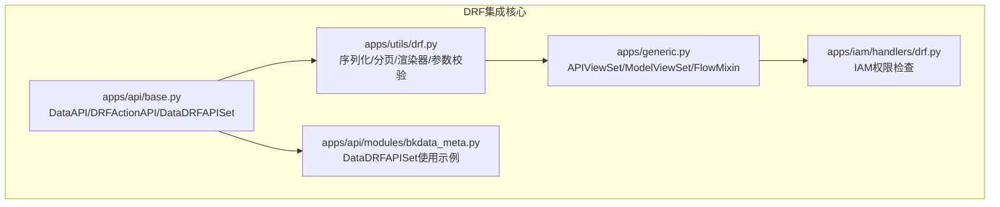
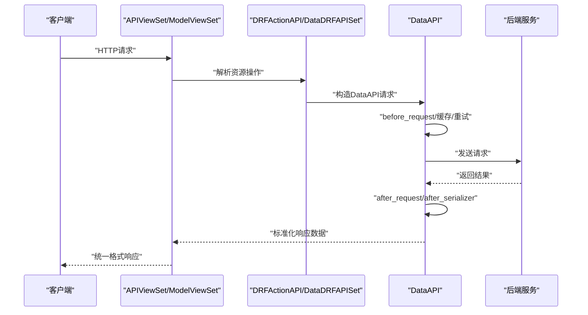
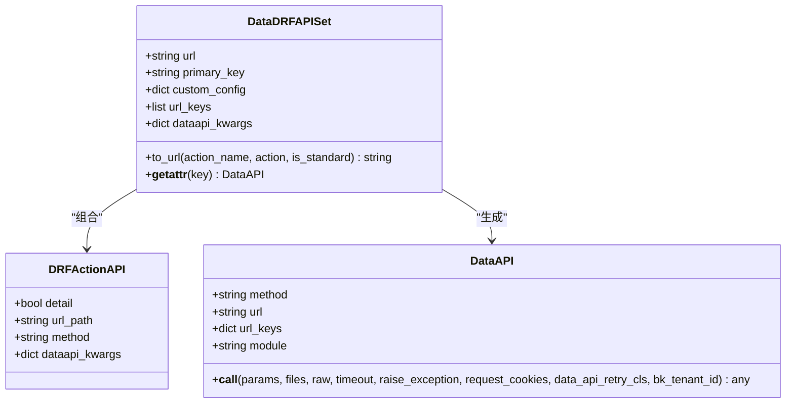
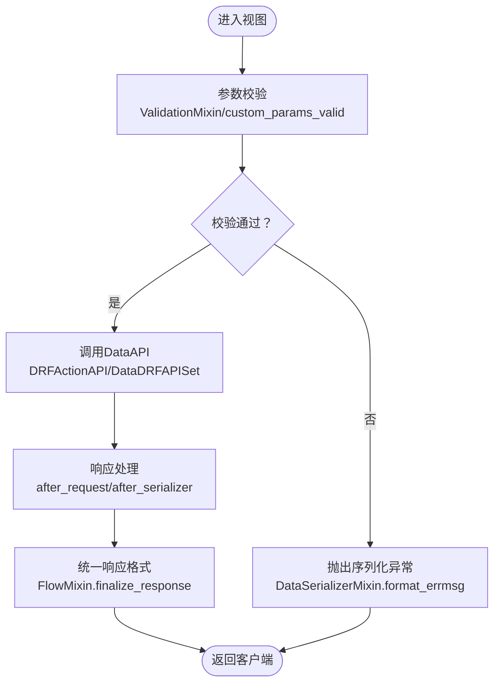
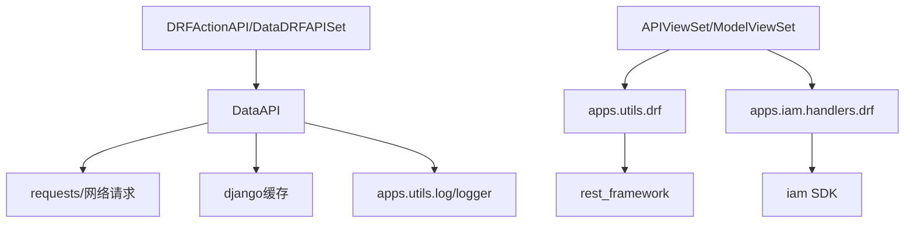

# DRF集成适配

<cite>
**本文档引用的文件**
- [apps/api/base.py](file://apps/api/base.py)
- [apps/utils/drf.py](file://apps/utils/drf.py)
- [apps/generic.py](file://apps/generic.py)
- [apps/iam/handlers/drf.py](file://apps/iam/handlers/drf.py)
- [apps/api/modules/bkdata_meta.py](file://apps/api/modules/bkdata_meta.py)
</cite>

## 目录
1. [简介](#简介)
2. [项目结构](#项目结构)
3. [核心组件](#核心组件)
4. [架构总览](#架构总览)
5. [详细组件分析](#详细组件分析)
6. [依赖分析](#依赖分析)
7. [性能考虑](#性能考虑)
8. [故障排查指南](#故障排查指南)
9. [结论](#结论)
10. [附录](#附录)

## 简介
本文件面向DRF（Django REST Framework）与DataAPI的集成适配，重点围绕DRFActionAPI类的设计理念与实现机制展开，解释如何在DRF视图集中声明资源操作，如何将这些操作映射为DataAPI请求，以及如何在DRF生态中实现统一的响应格式、序列化与错误处理。同时，文档覆盖资源操作声明的配置选项（detail路由、list路由、自定义URL路径），DRF数据API配置项（如description、before_request、after_request等）的作用边界，以及序列化器与数据验证机制、响应标准化与错误处理策略。

## 项目结构
本项目的DRF集成适配主要分布在以下模块：
- apps/api/base.py：定义DataAPI、DRFActionAPI、DataDRFAPISet等核心类，负责将DRF资源操作声明转换为DataAPI请求。
- apps/utils/drf.py：提供DRF工具函数、序列化器扩展、分页与渲染器等，支撑统一的序列化与参数校验。
- apps/generic.py：提供APIViewSet、ModelViewSet、FlowMixin、ValidationMixin、IAMPermissionMixin等混入类，统一响应格式、参数校验与权限控制。
- apps/iam/handlers/drf.py：提供IAM权限检查与装饰器，支持业务空间、实例级、批量实例的权限校验。
- apps/api/modules/bkdata_meta.py：展示DataDRFAPISet的实际使用示例，包含自定义动作与多租户租户ID注入。

**图表来源**
- [apps/api/base.py:772-904](file://apps/api/base.py#L772-L904)
- [apps/utils/drf.py:102-257](file://apps/utils/drf.py#L102-L257)
- [apps/generic.py:59-227](file://apps/generic.py#L59-L227)
- [apps/iam/handlers/drf.py:41-269](file://apps/iam/handlers/drf.py#L41-L269)
- [apps/api/modules/bkdata_meta.py:47-67](file://apps/api/modules/bkdata_meta.py#L47-L67)

**章节来源**
- [apps/api/base.py:772-904](file://apps/api/base.py#L772-L904)
- [apps/utils/drf.py:102-257](file://apps/utils/drf.py#L102-L257)
- [apps/generic.py:59-227](file://apps/generic.py#L59-L227)
- [apps/iam/handlers/drf.py:41-269](file://apps/iam/handlers/drf.py#L41-L269)
- [apps/api/modules/bkdata_meta.py:47-67](file://apps/api/modules/bkdata_meta.py#L47-L67)

## 核心组件
- DRFActionAPI：用于声明资源操作，支持detail（详情路由）与list（列表路由），并可自定义URL子路径与HTTP方法，同时透传DataAPI配置项。
- DataDRFAPISet：用于声明某一资源的RESTful API集合，内置常用动作为list/create/retrieve/update/partial_update/delete；支持自定义动作与URL键替换。
- DataAPI：底层请求执行器，负责请求发送、重试、缓存、前后置钩子、序列化清洗、响应标准化与日志记录。
- APIViewSet/ModelViewSet：基于DRF GenericViewSet/_ModelViewSet的混入类，统一响应格式、参数校验、分页与权限控制。
- IAMPermission/IAMPermissionMixin：提供业务空间、实例级、批量实例的权限校验能力。

**章节来源**
- [apps/api/base.py:788-904](file://apps/api/base.py#L788-L904)
- [apps/generic.py:180-227](file://apps/generic.py#L180-L227)
- [apps/iam/handlers/drf.py:41-196](file://apps/iam/handlers/drf.py#L41-L196)

## 架构总览
DRFActionAPI与DataDRFAPISet将DRF资源操作声明转换为DataAPI请求，DataAPI负责实际网络请求与结果处理，APIViewSet/ModelViewSet负责统一响应格式与权限控制，IAMPermission提供权限校验。

**图表来源**
- [apps/api/base.py:788-904](file://apps/api/base.py#L788-L904)
- [apps/api/base.py:191-481](file://apps/api/base.py#L191-L481)
- [apps/generic.py:67-76](file://apps/generic.py#L67-L76)

## 详细组件分析

### DRFActionAPI与DataDRFAPISet设计与实现
- 设计理念
  - DRFActionAPI用于声明资源操作，支持detail（详情路由）与list（列表路由），并可自定义URL子路径与HTTP方法。
  - DataDRFAPISet用于声明某一资源的RESTful API集合，内置常用动作为list/create/retrieve/update/partial_update/delete；支持自定义动作与URL键替换。
  - 两者均透传DataAPI配置项，确保DRF层与DataAPI层配置一致。

- 实现机制
  - to_url：根据action.detail决定是否拼接主键占位符，支持自定义url_path或使用action_name作为子路径。
  - __getattr__：将ins.create等调用分发到对应action，构造DataAPI参数并返回DataAPI实例。
  - 配置校验：对不在DRF_DATAAPI_CONFIG中的配置项抛出异常，确保配置合法。

- 资源操作声明配置选项
  - detail：是否为详情路由（包含主键），影响URL拼接与url_keys。
  - url_path：自定义URL子路径，默认使用action_name。
  - method：HTTP方法（GET/POST/PUT/PATCH/DELETE）。
  - DataAPI配置项透传：description、default_return_value、before_request、after_request、max_response_record、max_query_params_record、default_timeout、custom_headers、output_standard、request_auth、cache_time、bk_tenant_id等。

- 自定义URL路径处理
  - 详情路由：在基础URL后追加“{主键}/”，并将主键加入url_keys。
  - 自定义子路径：若非标准动作，使用action.url_path或action_name作为子路径追加到URL末尾。

- 使用示例
  - apps/api/modules/bkdata_meta.py展示了如何使用DataDRFAPISet声明自定义动作（如storages/mine/fields），并通过bk_tenant_id注入多租户信息。

**图表来源**
- [apps/api/base.py:788-904](file://apps/api/base.py#L788-L904)
- [apps/api/base.py:191-276](file://apps/api/base.py#L191-L276)

**章节来源**
- [apps/api/base.py:788-904](file://apps/api/base.py#L788-L904)
- [apps/api/modules/bkdata_meta.py:47-67](file://apps/api/modules/bkdata_meta.py#L47-L67)

### DRF数据API配置支持范围
- 支持的配置项（DRF_DATAAPI_CONFIG）
  - description：接口描述，便于日志与监控识别。
  - default_return_value：默认返回值，用于调试或降级。
  - before_request：请求前钩子，可用于注入认证信息、参数清洗等。
  - after_request：请求后钩子，可用于结果清洗与二次处理。
  - max_response_record/max_query_params_record：限制日志记录长度，避免敏感信息泄露。
  - default_timeout：默认超时时间。
  - custom_headers：自定义请求头。
  - output_standard：输出标准化（与DataAPI内部处理配合）。
  - request_auth：请求认证（与DataAPI认证流程配合）。
  - cache_time：缓存时间。
  - bk_tenant_id：多租户租户ID，支持静态值或动态函数。

- 配置作用边界
  - DRFActionAPI与DataDRFAPISet在构造DataAPI时透传上述配置，确保请求行为一致。
  - DataAPI在发送请求前后分别调用before_request/after_request，并支持缓存与重试。

**章节来源**
- [apps/api/base.py:772-785](file://apps/api/base.py#L772-L785)
- [apps/api/base.py:788-801](file://apps/api/base.py#L788-L801)
- [apps/api/base.py:818-857](file://apps/api/base.py#L818-L857)
- [apps/api/base.py:248-273](file://apps/api/base.py#L248-L273)

### 序列化器集成与数据验证机制
- 序列化器扩展
  - apps/utils/drf.py提供CustomDateTimeField、CustomSerializer、DateTimeFieldWithEpoch、GeneralSerializer、DataPageNumberPagination、GeneralJSONRenderer等，统一时间格式、分页与渲染。
  - apps/generic.py提供DataSerializer/DataModelSerializer与DataSerializerMixin，增强序列化器的错误格式化能力，将复杂嵌套错误简化为可读字符串。

- 数据验证机制
  - APIViewSet/ModelViewSet通过ValidationMixin与DataSerializerMixin实现参数校验与错误格式化，确保统一的错误响应风格。
  - 自定义异常处理器custom_exception_handler统一处理Http404、权限异常、序列化异常、API异常与自定义异常，返回标准格式的JSON响应。

**图表来源**
- [apps/utils/drf.py:102-116](file://apps/utils/drf.py#L102-L116)
- [apps/generic.py:137-153](file://apps/generic.py#L137-L153)
- [apps/generic.py:230-288](file://apps/generic.py#L230-L288)
- [apps/generic.py:67-76](file://apps/generic.py#L67-L76)

**章节来源**
- [apps/utils/drf.py:102-257](file://apps/utils/drf.py#L102-L257)
- [apps/generic.py:137-288](file://apps/generic.py#L137-L288)

### 响应数据的标准格式化与错误处理
- 统一响应格式
  - FlowMixin将DRF原生响应包装为{"result": True, "data": ..., "code": 0, "message": ""}，并设置状态码为200。
  - 设置响应头"x-content-type-options: nosniff"，提升安全性。

- 错误处理
  - custom_exception_handler针对不同异常类型返回标准JSON响应，包括404、权限异常、序列化异常、API异常与自定义异常。
  - DataSerializerMixin.format_errmsg将复杂嵌套错误扁平化为可读字符串，便于前端展示。

**章节来源**
- [apps/generic.py:67-76](file://apps/generic.py#L67-L76)
- [apps/generic.py:299-379](file://apps/generic.py#L299-L379)
- [apps/generic.py:248-288](file://apps/generic.py#L248-L288)

### 权限控制与IAM集成
- 权限模型
  - IAMPermission：基础权限检查，支持业务空间与实例级权限。
  - BusinessActionPermission：关联业务的动作权限检查，自动从请求或对象中提取业务ID。
  - InstanceActionPermission/InstanceActionForDataPermission：实例级权限检查，支持从请求参数或URL参数获取实例ID。
  - BatchIAMPermission：批量实例权限检查，支持从请求参数或URL参数获取实例ID列表。
  - insert_permission_field：在数据返回后插入权限字段，支持批量鉴权结果回填。

- 与视图的结合
  - APIViewSet/ModelViewSet通过IAMPermissionMixin提供assert_allowed/assert_business_action_allowed等便捷方法，简化权限校验。

**章节来源**
- [apps/iam/handlers/drf.py:41-269](file://apps/iam/handlers/drf.py#L41-L269)
- [apps/generic.py:155-178](file://apps/generic.py#L155-L178)

## 依赖分析
- 组件耦合与内聚
  - DRFActionAPI与DataDRFAPISet高内聚，专注于资源操作声明与URL构建。
  - DataAPI低耦合，通过配置项与钩子函数与上层解耦。
  - APIViewSet/ModelViewSet通过混入类聚合功能，保持视图层简洁。

- 外部依赖与集成点
  - DataAPI依赖requests、retrying、django缓存与日志系统。
  - IAMPermission依赖iam SDK与蓝鲸权限中心。
  - DRF工具链（序列化器、分页器、渲染器）来自rest_framework。

**图表来源**
- [apps/api/base.py:191-481](file://apps/api/base.py#L191-L481)
- [apps/utils/drf.py:102-257](file://apps/utils/drf.py#L102-L257)
- [apps/generic.py:180-227](file://apps/generic.py#L180-L227)
- [apps/iam/handlers/drf.py:41-196](file://apps/iam/handlers/drf.py#L41-L196)

**章节来源**
- [apps/api/base.py:191-481](file://apps/api/base.py#L191-L481)
- [apps/utils/drf.py:102-257](file://apps/utils/drf.py#L102-L257)
- [apps/generic.py:180-227](file://apps/generic.py#L180-L227)
- [apps/iam/handlers/drf.py:41-196](file://apps/iam/handlers/drf.py#L41-L196)

## 性能考虑
- 缓存策略
  - DataAPI支持cache_time配置，通过缓存键构建与django缓存减少重复请求。
- 重试机制
  - DataApiRetryClass支持基于异常类型与结果判定的重试策略，降低瞬时故障影响。
- 并发请求
  - DataAPI支持batch_request与bulk_request，通过线程池并发请求，提高批量场景吞吐。
- 渲染与序列化
  - GeneralJSONRenderer与DjangoJSONEncoder确保序列化性能与一致性。

**章节来源**
- [apps/api/base.py:482-507](file://apps/api/base.py#L482-L507)
- [apps/api/base.py:108-174](file://apps/api/base.py#L108-L174)
- [apps/api/base.py:632-741](file://apps/api/base.py#L632-L741)
- [apps/utils/drf.py:227-247](file://apps/utils/drf.py#L227-L247)

## 故障排查指南
- 常见问题
  - 配置项不支持：当向DRFActionAPI/DataDRFAPISet传入不在DRF_DATAAPI_CONFIG中的配置项时会抛出异常，需检查配置名称。
  - 权限不足：IAMPermission在未满足权限时抛出异常，需确认业务ID、实例ID与动作权限。
  - 参数校验失败：DataSerializerMixin.format_errmsg将复杂错误扁平化，建议结合前端提示定位字段。
  - 超时与重试：DataAPI对ReadTimeout与RetryError进行捕获与包装，建议检查后端服务健康度与网络连通性。

- 排查步骤
  - 检查DataDRFAPISet构造参数与自定义动作配置。
  - 查看DataAPI日志记录（url、method、query_params、response_*等）。
  - 确认before_request/after_request钩子是否正确处理参数与响应。
  - 验证IAM权限配置与实例ID提取逻辑。

**章节来源**
- [apps/api/base.py:797-801](file://apps/api/base.py#L797-L801)
- [apps/iam/handlers/drf.py:159-170](file://apps/iam/handlers/drf.py#L159-L170)
- [apps/generic.py:248-288](file://apps/generic.py#L248-L288)
- [apps/api/base.py:377-385](file://apps/api/base.py#L377-L385)

## 结论
DRFActionAPI与DataDRFAPISet提供了将DRF资源操作声明与DataAPI配置无缝衔接的桥梁，配合APIViewSet/ModelViewSet的混入类与IAM权限体系，实现了统一的响应格式、参数校验与权限控制。通过透传DataAPI配置项与钩子函数，开发者可以在DRF层实现灵活的请求行为定制，同时借助缓存、重试与并发机制提升性能与稳定性。

## 附录
- 最佳实践
  - 明确区分detail与list动作，合理使用url_path与自定义动作。
  - 在DataDRFAPISet中统一配置before_request/after_request，确保跨模块一致性。
  - 使用IAMPermission系列类进行权限校验，优先从请求或对象中提取业务ID与实例ID。
  - 启用cache_time与合理的default_timeout，结合重试策略提升可靠性。
  - 使用FlowMixin与custom_exception_handler统一响应与错误处理，提升用户体验。

- 路由配置与权限控制配合
  - 在视图中组合IAMPermissionMixin与APIViewSet/ModelViewSet，确保权限校验在序列化与业务逻辑之前执行。
  - 对于批量操作，使用BatchIAMPermission与insert_permission_field进行批量鉴权与权限字段回填。

**章节来源**
- [apps/api/base.py:809-816](file://apps/api/base.py#L809-L816)
- [apps/iam/handlers/drf.py:172-269](file://apps/iam/handlers/drf.py#L172-L269)
- [apps/generic.py:180-227](file://apps/generic.py#L180-L227)