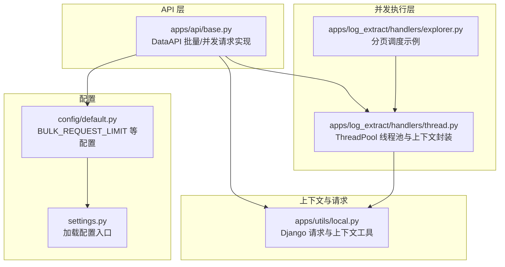
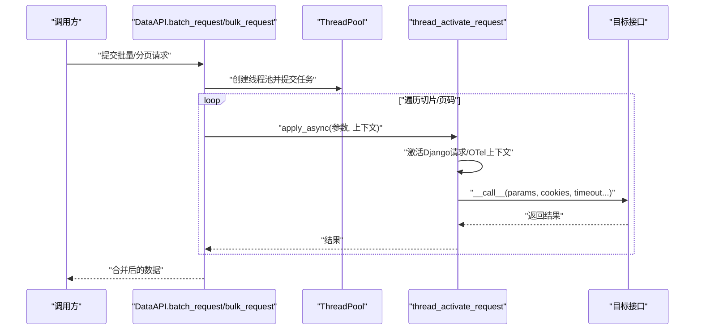
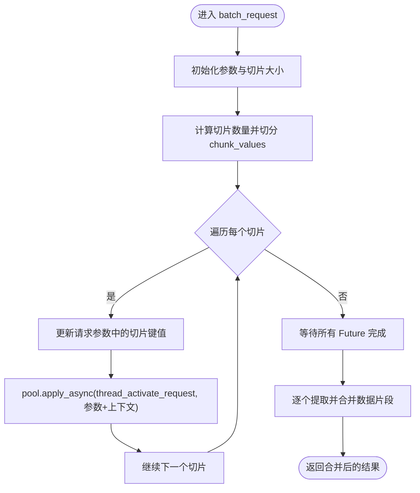
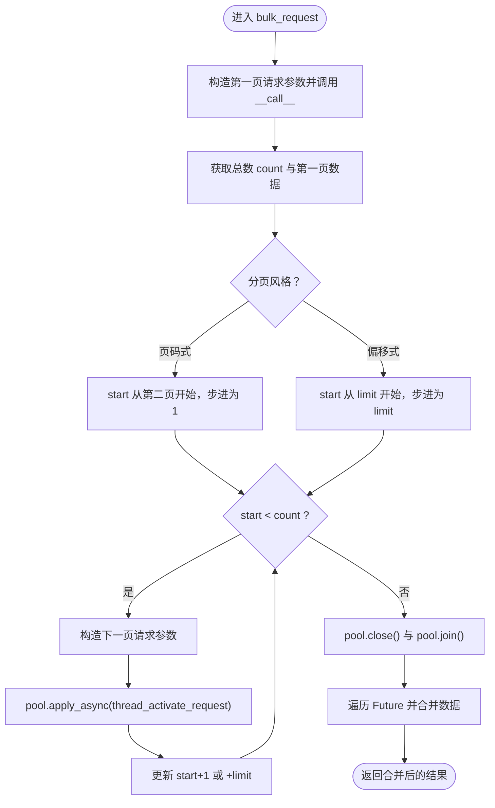
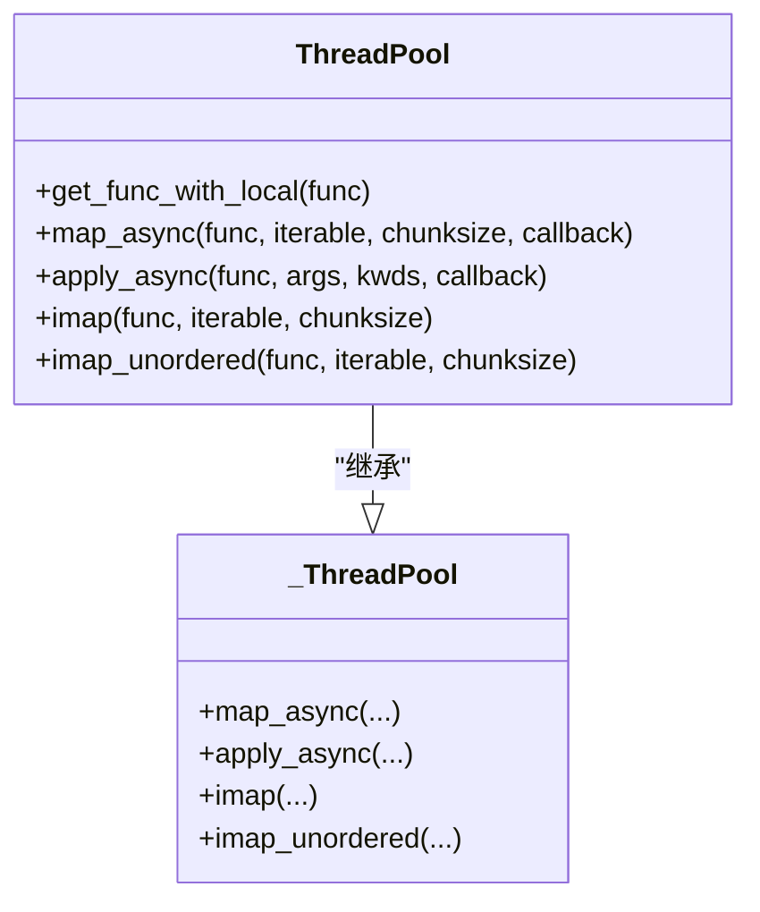
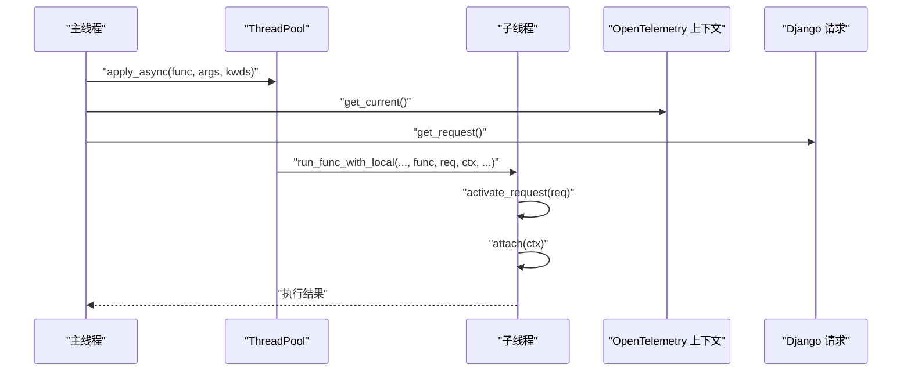
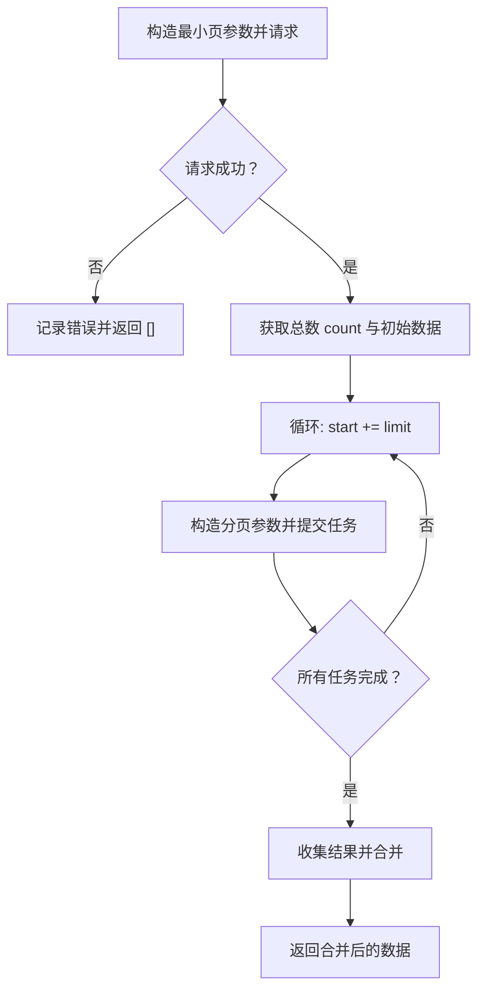
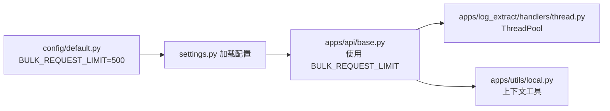

# 批量和并发请求

<cite>
**本文引用的文件**
- [apps/api/base.py](file://apps/api/base.py)
- [apps/log_extract/handlers/thread.py](file://apps/log_extract/handlers/thread.py)
- [apps/log_extract/handlers/explorer.py](file://apps/log_extract/handlers/explorer.py)
- [apps/utils/local.py](file://apps/utils/local.py)
- [config/default.py](file://config/default.py)
- [settings.py](file://settings.py)
</cite>

## 目录
1. [简介](#简介)
2. [项目结构](#项目结构)
3. [核心组件](#核心组件)
4. [架构总览](#架构总览)
5. [详细组件分析](#详细组件分析)
6. [依赖分析](#依赖分析)
7. [性能考量](#性能考量)
8. [故障排查指南](#故障排查指南)
9. [结论](#结论)
10. [附录](#附录)

## 简介
本技术文档聚焦于批量与并发请求的实现与优化，围绕以下目标展开：
- 深入解析 batch_request 方法的参数切片、并发执行与结果合并机制
- 详解 bulk_request 的分页处理逻辑，包括总数获取、分页计算与并发调度
- 阐述 ThreadPool 线程池的使用与管理，包括线程数量控制与资源分配策略
- 解释并发请求中的上下文传递与请求激活机制，涵盖 Django request 对象复制与 OpenTelemetry 上下文传递
- 提供批量请求的性能优化建议与最佳实践，包括合理的切片大小与并发度控制

## 项目结构
与批量与并发请求直接相关的核心文件分布如下：
- 批量与并发请求主实现：apps/api/base.py
- 线程池与上下文封装：apps/log_extract/handlers/thread.py
- 并发请求示例与分页调度：apps/log_extract/handlers/explorer.py
- Django 请求与上下文工具：apps/utils/local.py
- 全局配置与默认设置：config/default.py、settings.py

图表来源
- [apps/api/base.py:632-769](file://apps/api/base.py#L632-L769)
- [apps/log_extract/handlers/thread.py:82-129](file://apps/log_extract/handlers/thread.py#L82-L129)
- [apps/log_extract/handlers/explorer.py:980-1035](file://apps/log_extract/handlers/explorer.py#L980-L1035)
- [apps/utils/local.py:39-243](file://apps/utils/local.py#L39-L243)
- [config/default.py:438-440](file://config/default.py#L438-L440)
- [settings.py:1-47](file://settings.py#L1-L47)

章节来源
- [apps/api/base.py:632-769](file://apps/api/base.py#L632-L769)
- [apps/log_extract/handlers/thread.py:82-129](file://apps/log_extract/handlers/thread.py#L82-L129)
- [apps/log_extract/handlers/explorer.py:980-1035](file://apps/log_extract/handlers/explorer.py#L980-L1035)
- [apps/utils/local.py:39-243](file://apps/utils/local.py#L39-L243)
- [config/default.py:438-440](file://config/default.py#L438-L440)
- [settings.py:1-47](file://settings.py#L1-L47)

## 核心组件
- DataAPI 批量与并发请求能力
  - batch_request：基于参数切片的并发请求，支持按切片大小分批发送并合并结果
  - bulk_request：基于分页的并发请求，先获取总数，再并发拉取各页
  - thread_activate_request：在子线程中激活原请求上下文与 OpenTelemetry 上下文
- ThreadPool 线程池
  - 封装多进程线程池，自动注入时区、语言、Django 请求与本地变量，确保线程内上下文一致
  - 提供 map_async、apply_async、imap、imap_unordered 等便捷方法
- 上下文与请求工具
  - activate_request/get_request/get_request_id 等，负责线程内请求状态的复制与传递
  - OpenTelemetry 上下文 attach/get_current，保障分布式追踪在并发场景下的延续

章节来源
- [apps/api/base.py:632-769](file://apps/api/base.py#L632-L769)
- [apps/log_extract/handlers/thread.py:82-129](file://apps/log_extract/handlers/thread.py#L82-L129)
- [apps/utils/local.py:39-243](file://apps/utils/local.py#L39-L243)

## 架构总览
下面的序列图展示了从调用方到并发执行再到结果合并的整体流程。

图表来源
- [apps/api/base.py:632-769](file://apps/api/base.py#L632-L769)
- [apps/log_extract/handlers/thread.py:82-129](file://apps/log_extract/handlers/thread.py#L82-L129)

## 详细组件分析

### batch_request：参数切片与并发执行
- 参数切片
  - 依据 chunk_key 与 chunk_values，按 chunk_size 计算切片数量，生成多个请求参数
  - 每次仅携带当前切片的数据，避免单次请求过大
- 并发执行
  - 使用 ThreadPool 提交任务，每个任务调用 thread_activate_request
  - 在子线程中复制并激活原始 Django 请求，同时附加 OpenTelemetry 上下文
- 结果合并
  - 逐个获取 Future 的结果，并通过 get_data 提取数据片段，最终合并为完整列表

图表来源
- [apps/api/base.py:632-674](file://apps/api/base.py#L632-L674)
- [apps/api/base.py:743-769](file://apps/api/base.py#L743-L769)

章节来源
- [apps/api/base.py:632-674](file://apps/api/base.py#L632-L674)
- [apps/api/base.py:743-769](file://apps/api/base.py#L743-L769)

### bulk_request：分页处理与并发调度
- 总数获取
  - 根据分页风格选择 page/page.start+page.limit 的初始参数，先请求第一页以获取总数
- 分页计算
  - 根据分页风格决定起始页与步进：页码式按页递增；偏移式按 limit 递增
  - 计算总页数或总次数，准备并发任务队列
- 并发调度
  - 使用 ThreadPool 提交各页请求，同样通过 thread_activate_request 保持上下文
- 结果合并
  - 收集各页结果并通过 get_data 提取数据片段，最终合并

图表来源
- [apps/api/base.py:676-741](file://apps/api/base.py#L676-L741)

章节来源
- [apps/api/base.py:676-741](file://apps/api/base.py#L676-L741)

### ThreadPool：线程池管理与上下文注入
- 上下文注入
  - 在线程启动前，自动捕获当前时区、语言、Django 请求与本地变量，确保子线程具备一致的运行环境
  - 通过 partial 包装函数，将上下文注入到每个任务执行路径
- 资源清理
  - 子线程执行完成后关闭数据库连接，清理本地变量，避免资源泄漏
- 并发方法
  - 提供 map_async、apply_async、imap、imap_unordered 等方法，统一注入上下文后再交给父类执行

图表来源
- [apps/log_extract/handlers/thread.py:82-129](file://apps/log_extract/handlers/thread.py#L82-L129)

章节来源
- [apps/log_extract/handlers/thread.py:82-129](file://apps/log_extract/handlers/thread.py#L82-L129)

### 上下文传递与请求激活机制
- Django 请求复制
  - 在主线程中获取当前请求对象，将其副本与上下文一并传递至子线程
  - 子线程通过 activate_request 激活请求，使视图/中间件能正确读取用户、语言、Cookie 等信息
- OpenTelemetry 上下文传递
  - 在主线程中获取当前上下文，子线程中通过 attach 恢复，保证链路追踪在并发场景下连续
- 租户 ID 透传
  - 通过 thread_activate_request 的参数将 bk_tenant_id 传递到子线程，确保多租户场景下的鉴权与路由正确

图表来源
- [apps/api/base.py:743-769](file://apps/api/base.py#L743-L769)
- [apps/log_extract/handlers/thread.py:47-79](file://apps/log_extract/handlers/thread.py#L47-L79)
- [apps/utils/local.py:39-86](file://apps/utils/local.py#L39-L86)

章节来源
- [apps/api/base.py:743-769](file://apps/api/base.py#L743-L769)
- [apps/log_extract/handlers/thread.py:47-79](file://apps/log_extract/handlers/thread.py#L47-L79)
- [apps/utils/local.py:39-86](file://apps/utils/local.py#L39-L86)

### 分页调度示例：explorer.py
- 示例流程
  - 先以最小页大小请求一次以获取总数
  - 根据 limit 与总数循环构造分页参数，使用 ThreadPool 并发提交
  - 收集结果并合并
- 错误处理
  - 若任一请求返回为空或失败，记录错误并提前返回空结果，避免污染整体结果

图表来源
- [apps/log_extract/handlers/explorer.py:980-1035](file://apps/log_extract/handlers/explorer.py#L980-L1035)

章节来源
- [apps/log_extract/handlers/explorer.py:980-1035](file://apps/log_extract/handlers/explorer.py#L980-L1035)

## 依赖分析
- 配置项 BULK_REQUEST_LIMIT
  - 由环境变量 BKAPP_BULK_REQUEST_LIMIT 控制，默认 500
  - 作为 batch_request 与 bulk_request 的切片/页大小基准
- 线程池依赖
  - ThreadPool 基于 Python 多进程线程池，封装上下文注入与资源清理
- 上下文依赖
  - Django 线程局部存储与 OpenTelemetry 上下文共同保障并发一致性

图表来源
- [config/default.py:438-440](file://config/default.py#L438-L440)
- [settings.py:1-47](file://settings.py#L1-L47)
- [apps/api/base.py:632-769](file://apps/api/base.py#L632-L769)
- [apps/log_extract/handlers/thread.py:82-129](file://apps/log_extract/handlers/thread.py#L82-L129)
- [apps/utils/local.py:39-243](file://apps/utils/local.py#L39-L243)

章节来源
- [config/default.py:438-440](file://config/default.py#L438-L440)
- [settings.py:1-47](file://settings.py#L1-L47)
- [apps/api/base.py:632-769](file://apps/api/base.py#L632-L769)
- [apps/log_extract/handlers/thread.py:82-129](file://apps/log_extract/handlers/thread.py#L82-L129)
- [apps/utils/local.py:39-243](file://apps/utils/local.py#L39-L243)

## 性能考量
- 切片大小与并发度
  - 切片大小受 BULK_REQUEST_LIMIT 控制，建议结合下游接口的吞吐与稳定性进行调优
  - 并发度与 CPU/IO 密集程度相关，建议通过压测确定最优并发线程数
- 资源与连接
  - ThreadPool 在子线程结束后会关闭数据库连接，避免连接泄漏
  - 建议控制单次请求的数据量，避免内存峰值过高
- 超时与重试
  - __call__ 支持超时与重试配置，合理设置可提升整体成功率
- 分页策略
  - 优先使用偏移式分页（LIMIT/OFFSET），减少页码式重复扫描带来的开销
- 上下文开销
  - 上下文复制与 OTel 上下文传递有一定成本，建议仅在必要时传递，避免过度复制

## 故障排查指南
- 常见问题
  - 子线程无法获取请求上下文：确认主线程已正确获取并传递 request 与 OTel 上下文
  - 多租户鉴权异常：检查 thread_activate_request 是否正确透传 bk_tenant_id
  - 并发请求超时或失败：调整超时时间与重试策略，或降低并发度与切片大小
  - 结果为空：在 explorer.py 示例中，若任一请求失败会直接返回空，需检查具体请求参数与下游接口
- 排查步骤
  - 打印请求参数与切片数量，核对总数与页数计算
  - 检查线程池关闭与 join 是否执行，避免任务未完成导致的异常
  - 查看日志输出，定位失败请求与错误码

章节来源
- [apps/api/base.py:632-769](file://apps/api/base.py#L632-L769)
- [apps/log_extract/handlers/explorer.py:980-1035](file://apps/log_extract/handlers/explorer.py#L980-L1035)

## 结论
本文系统梳理了批量与并发请求在本项目中的实现路径，重点覆盖了：
- batch_request 的参数切片、并发执行与结果合并
- bulk_request 的分页获取、计算与并发调度
- ThreadPool 的上下文注入与资源管理
- Django 请求与 OTel 上下文在并发中的传递机制
- 面向性能的优化建议与最佳实践

通过合理设置切片大小与并发度、严格管理上下文与资源，可在保证稳定性的同时显著提升批量请求的吞吐与延迟表现。

## 附录
- 关键配置
  - BULK_REQUEST_LIMIT：默认 500，可通过环境变量 BKAPP_BULK_REQUEST_LIMIT 调整
- 相关实现参考
  - 批量请求与分页请求：apps/api/base.py
  - 线程池与上下文封装：apps/log_extract/handlers/thread.py
  - 分页调度示例：apps/log_extract/handlers/explorer.py
  - 上下文工具：apps/utils/local.py