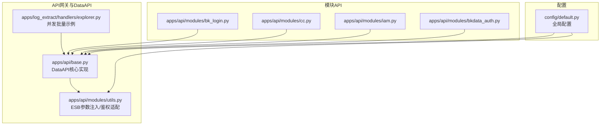
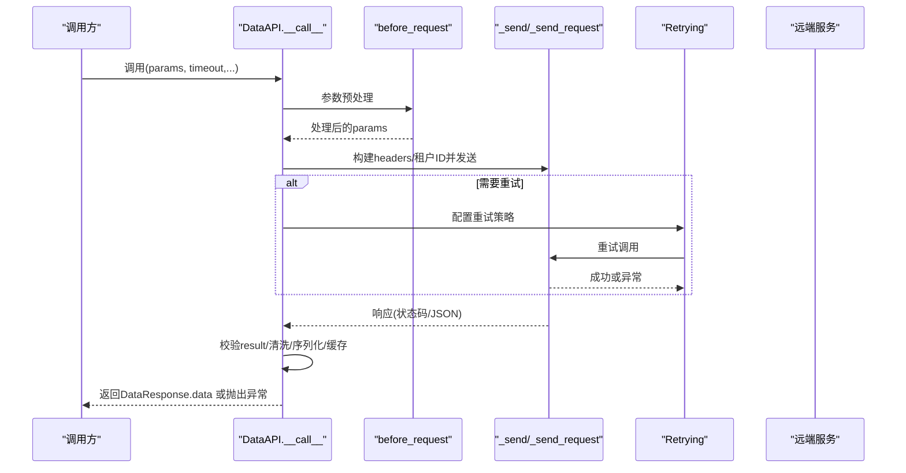
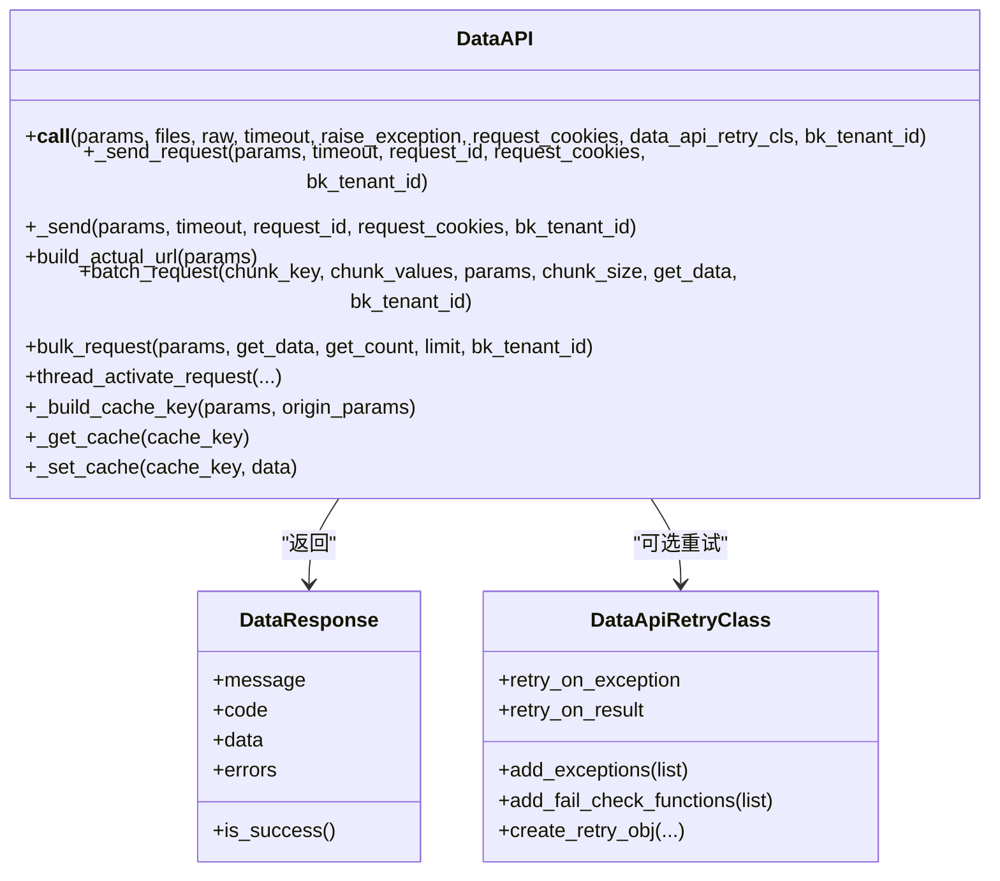
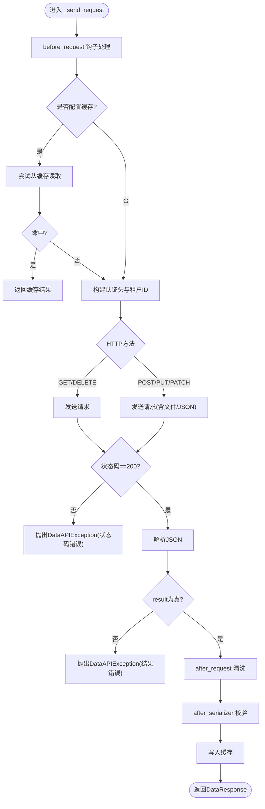
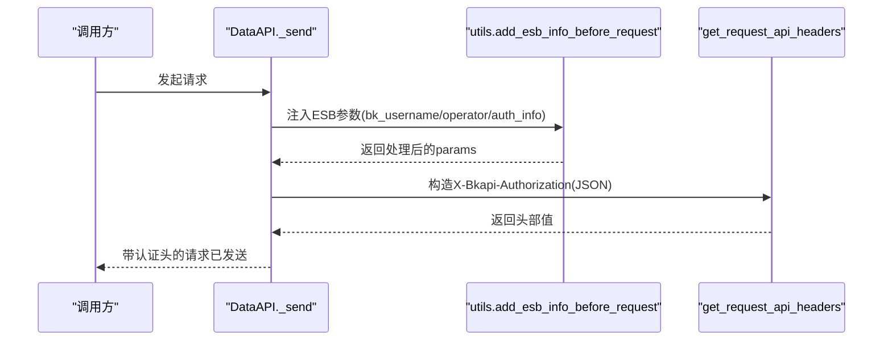
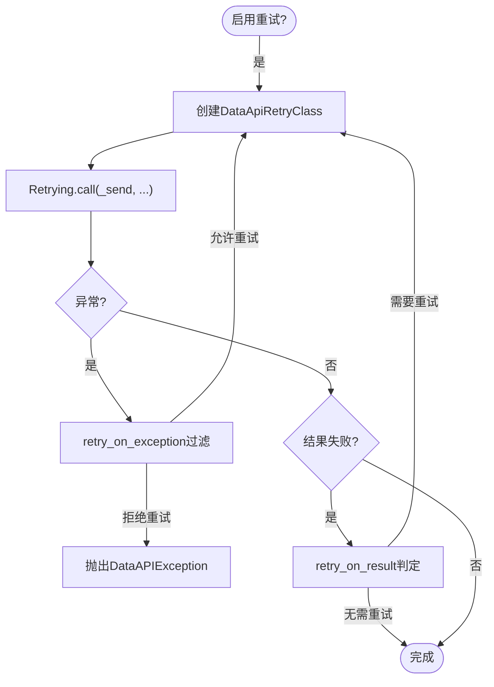
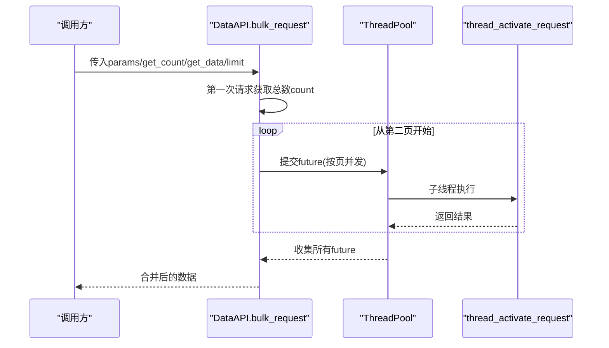
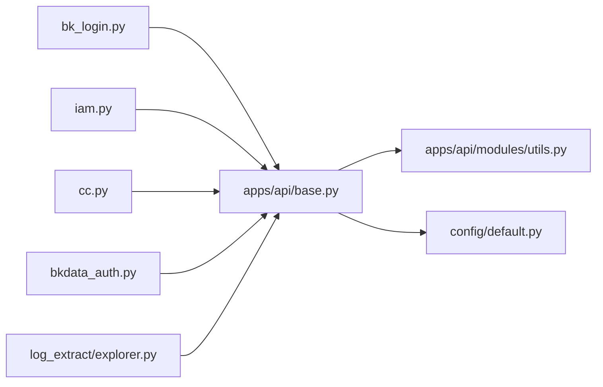

# 蓝鲸API网关

<cite>
**本文引用的文件**
- [apps/api/base.py](file://apps/api/base.py)
- [apps/api/modules/utils.py](file://apps/api/modules/utils.py)
- [apps/api/exception.py](file://apps/api/exception.py)
- [apps/api/modules/bk_login.py](file://apps/api/modules/bk_login.py)
- [apps/api/modules/bkdata_auth.py](file://apps/api/modules/bkdata_auth.py)
- [apps/api/modules/cc.py](file://apps/api/modules/cc.py)
- [apps/api/modules/iam.py](file://apps/api/modules/iam.py)
- [apps/log_extract/handlers/explorer.py](file://apps/log_extract/handlers/explorer.py)
- [config/default.py](file://config/default.py)
</cite>

## 目录
1. [简介](#简介)
2. [项目结构](#项目结构)
3. [核心组件](#核心组件)
4. [架构总览](#架构总览)
5. [详细组件分析](#详细组件分析)
6. [依赖分析](#依赖分析)
7. [性能考量](#性能考量)
8. [故障排查指南](#故障排查指南)
9. [结论](#结论)
10. [附录](#附录)

## 简介
本文件面向蓝鲸日志平台的API网关与DataAPI体系，系统性梳理DataAPI类的设计理念、请求发送流程、响应处理机制、认证授权（X-Bkapi-Authorization）、重试机制、批量与并发请求处理、配置项与最佳实践，并提供集成开发指南与示例路径。

## 项目结构
围绕API网关与DataAPI的关键模块分布如下：
- apps/api/base.py：DataAPI核心实现、请求发送、重试、缓存、并发与分页、响应封装
- apps/api/modules/utils.py：ESB前置参数注入、多租户与鉴权适配、后台/前台分支逻辑
- apps/api/modules/*.py：各平台模块API声明（如登录、权限中心、配置平台、数据平台鉴权等）
- config/default.py：全局配置（超时、批量限制、敏感参数、API网关开关、多租户开关等）
- apps/log_extract/handlers/explorer.py：并发批量请求的典型使用示例

**图表来源**
- [apps/api/base.py](file://apps/api/base.py)
- [apps/api/modules/utils.py](file://apps/api/modules/utils.py)
- [apps/api/modules/bk_login.py](file://apps/api/modules/bk_login.py)
- [apps/api/modules/cc.py](file://apps/api/modules/cc.py)
- [apps/api/modules/iam.py](file://apps/api/modules/iam.py)
- [apps/api/modules/bkdata_auth.py](file://apps/api/modules/bkdata_auth.py)
- [apps/log_extract/handlers/explorer.py](file://apps/log_extract/handlers/explorer.py)
- [config/default.py](file://config/default.py)

**章节来源**
- [apps/api/base.py](file://apps/api/base.py)
- [apps/api/modules/utils.py](file://apps/api/modules/utils.py)
- [apps/api/modules/bk_login.py](file://apps/api/modules/bk_login.py)
- [apps/api/modules/cc.py](file://apps/api/modules/cc.py)
- [apps/api/modules/iam.py](file://apps/api/modules/iam.py)
- [apps/api/modules/bkdata_auth.py](file://apps/api/modules/bkdata_auth.py)
- [apps/log_extract/handlers/explorer.py](file://apps/log_extract/handlers/explorer.py)
- [config/default.py](file://config/default.py)

## 核心组件
- DataAPI：统一的API调用封装，负责请求构建、认证头注入、重试、缓存、分页/批量并发、响应清洗与序列化、日志记录与异常抛出
- DataResponse：对后端返回进行标准化封装，提供result/code/message/data/errors等访问器
- DataApiRetryClass：基于retrying库的重试策略封装，支持异常类型与结果判定函数
- 批量/并发：batch_request（按参数切片）、bulk_request（按分页并发）、thread_activate_request（并发线程激活请求上下文）

**章节来源**
- [apps/api/base.py](file://apps/api/base.py)

## 架构总览
DataAPI在调用链路上的关键步骤：
- 参数预处理：before_request钩子、多租户ID注入、敏感参数清理
- 认证头注入：X-Bkapi-Authorization（包含应用标识、用户名等）
- 发送请求：支持GET/POST/PUT/PATCH/DELETE，自动区分文件上传
- 结果处理：状态码校验、JSON解析、after_request清洗、序列化器校验、缓存写入
- 重试与异常：ReadTimeout、RetryError、通用异常捕获与DataAPIException包装
- 日志记录：请求耗时、参数、响应、错误信息

**图表来源**
- [apps/api/base.py](file://apps/api/base.py)

**章节来源**
- [apps/api/base.py](file://apps/api/base.py)

## 详细组件分析

### DataAPI类设计与职责
- 请求生命周期：参数预处理 → 构建认证头 → 发送请求 → 结果清洗/序列化/缓存 → 记录日志
- 认证头：X-Bkapi-Authorization由get_request_api_headers生成，包含应用代码、密钥、用户名等
- 多租户：X-Bk-Tenant-Id通过biz/space到tenant映射或显式传入
- 重试：DataApiRetryClass结合retrying库，支持异常类型过滤与结果判定函数
- 缓存：基于URL+参数生成MD5键，支持cache_time
- 并发与分页：batch_request按参数切片并发；bulk_request先取总数，再按页并发拉取
- 异常：统一包装为DataAPIException，最终转为ApiRequestError/ApiResultError

**图表来源**
- [apps/api/base.py](file://apps/api/base.py)

**章节来源**
- [apps/api/base.py](file://apps/api/base.py)

### 请求发送流程与响应处理
- 请求头：X-DATA-REQUEST-ID、X-Request-Id、X-METHOD-OVERRIDE（method_override）、X-Bkapi-Authorization、X-Bk-Tenant-Id、Content-Type（JSON/表单/文件）
- 方法支持：GET/POST/PUT/PATCH/DELETE，自动区分文件上传
- 响应处理：状态码==200校验，JSON解析，result缺失时补位为True，after_request清洗，after_serializer校验，缓存写入
- 错误处理：ReadTimeout、RetryError、通用异常均包装为DataAPIException，最终抛出ApiRequestError或ApiResultError

**图表来源**
- [apps/api/base.py](file://apps/api/base.py)

**章节来源**
- [apps/api/base.py](file://apps/api/base.py)

### 认证授权机制（X-Bkapi-Authorization）
- X-Bkapi-Authorization构造：get_request_api_headers将应用代码、密钥、用户名等打包为JSON字符串
- 用户态注入：utils.add_esb_info_before_request根据运行环境选择前台/后台分支，注入bk_username/operator/auth_info等
- 多租户：X-Bk-Tenant-Id优先使用调用时传入，其次使用DataAPI定义时的函数/静态值，最后回退到请求上下文
- 数据平台鉴权：当启用bkdata_token_auth特性开关时，走token鉴权；否则走用户鉴权并设置admin/operator

**图表来源**
- [apps/api/base.py](file://apps/api/base.py)
- [apps/api/modules/utils.py](file://apps/api/modules/utils.py)

**章节来源**
- [apps/api/base.py](file://apps/api/base.py)
- [apps/api/modules/utils.py](file://apps/api/modules/utils.py)

### API重试机制
- DataApiRetryClass：支持停止次数、随机等待区间、异常类型排除、结果判定函数
- retry_on_exception/retry_on_result：默认行为可覆盖，fail_check_functions可传入lambda函数判断result是否需要重试
- Retrying.call：在_data_api_retry_cls存在时启用，捕获ReadTimeout/RetryError并包装为DataAPIException

**图表来源**
- [apps/api/base.py](file://apps/api/base.py)

**章节来源**
- [apps/api/base.py](file://apps/api/base.py)

### 批量请求与并发请求
- batch_request：将一个大列表按chunk_key切片，每个切片并发请求，合并结果
- bulk_request：先请求第一页获取总数，再按页并发拉取，合并数据
- 线程池：ThreadPool，每个子请求通过thread_activate_request激活请求上下文与OpenTelemetry上下文
- 示例：apps/log_extract/handlers/explorer.py展示分页并发的典型用法

**图表来源**
- [apps/api/base.py](file://apps/api/base.py)
- [apps/log_extract/handlers/explorer.py](file://apps/log_extract/handlers/explorer.py)

**章节来源**
- [apps/api/base.py](file://apps/api/base.py)
- [apps/log_extract/handlers/explorer.py](file://apps/log_extract/handlers/explorer.py)

### 模块API示例与集成
- 登录模块：apps/api/modules/bk_login.py根据USE_APIGW动态选择新/旧网关路径
- 权限中心：apps/api/modules/iam.py提供批量授权/拓扑授权等接口
- 配置平台：apps/api/modules/cc.py使用use_superuser=True绕过权限透传
- 数据平台鉴权：apps/api/modules/bkdata_auth.py根据USE_APIGW与特性开关选择URL与鉴权方式

**章节来源**
- [apps/api/modules/bk_login.py](file://apps/api/modules/bk_login.py)
- [apps/api/modules/iam.py](file://apps/api/modules/iam.py)
- [apps/api/modules/cc.py](file://apps/api/modules/cc.py)
- [apps/api/modules/bkdata_auth.py](file://apps/api/modules/bkdata_auth.py)

## 依赖分析
- 外部依赖：requests、retrying、Django缓存、OpenTelemetry上下文
- 内部依赖：apps.api.modules.utils（ESB参数注入、多租户）、config.default（全局配置）
- 模块间耦合：各模块API通过DataAPI统一入口，低耦合高内聚

**图表来源**
- [apps/api/base.py](file://apps/api/base.py)
- [apps/api/modules/utils.py](file://apps/api/modules/utils.py)
- [apps/api/modules/bk_login.py](file://apps/api/modules/bk_login.py)
- [apps/api/modules/iam.py](file://apps/api/modules/iam.py)
- [apps/api/modules/cc.py](file://apps/api/modules/cc.py)
- [apps/api/modules/bkdata_auth.py](file://apps/api/modules/bkdata_auth.py)
- [apps/log_extract/handlers/explorer.py](file://apps/log_extract/handlers/explorer.py)
- [config/default.py](file://config/default.py)

**章节来源**
- [apps/api/base.py](file://apps/api/base.py)
- [apps/api/modules/utils.py](file://apps/api/modules/utils.py)
- [apps/api/modules/bk_login.py](file://apps/api/modules/bk_login.py)
- [apps/api/modules/iam.py](file://apps/api/modules/iam.py)
- [apps/api/modules/cc.py](file://apps/api/modules/cc.py)
- [apps/api/modules/bkdata_auth.py](file://apps/api/modules/bkdata_auth.py)
- [apps/log_extract/handlers/explorer.py](file://apps/log_extract/handlers/explorer.py)
- [config/default.py](file://config/default.py)

## 性能考量
- 并发策略：批量/分页并发建议结合BULK_REQUEST_LIMIT与线程池大小，避免过度并发导致下游压力
- 缓存策略：合理设置cache_time，避免热点接口频繁抖动；对易变数据谨慎缓存
- 超时配置：default_timeout与具体调用timeout共同决定请求时限，建议按接口特性差异化配置
- 敏感参数：通过SENSITIVE_PARAMS在日志中剔除，避免泄露
- 多租户：按业务/空间计算租户ID，减少跨租户请求带来的额外开销

[本节为通用指导，无需特定文件引用]

## 故障排查指南
- 异常类型
  - DataAPIException：统一包装底层异常，包含响应体便于定位
  - ApiRequestError：请求阶段异常（如超时、网络错误）
  - ApiResultError：响应阶段异常（result为假或非JSON）
- 常见问题
  - 认证失败：检查X-Bkapi-Authorization构造、APP_CODE/SECRET_KEY、用户名注入
  - 超时：增大default_timeout或调用时timeout，确认下游健康
  - 结果非JSON：检查after_request/after_serializer是否正确
  - 权限不足：确认use_superuser与before_request中bk_username/operator设置
- 日志定位：BKLOGAPI日志包含请求/响应、耗时、错误信息，结合request_id快速定位

**章节来源**
- [apps/api/exception.py](file://apps/api/exception.py)
- [apps/api/base.py](file://apps/api/base.py)

## 结论
DataAPI提供了统一、健壮、可扩展的API调用抽象，覆盖认证、重试、缓存、并发与分页等关键能力。通过模块化的API声明与灵活的配置，能够高效对接蓝鲸生态各平台，满足日志平台复杂场景下的高可用与高性能需求。

[本节为总结，无需特定文件引用]

## 附录

### 配置选项与最佳实践
- 全局配置（config/default.py）
  - BULK_REQUEST_LIMIT：批量/分页并发的单次请求上限
  - SENSITIVE_PARAMS：日志中剔除的敏感参数
  - USE_APIGW/APIGW_ENABLED：API网关开关
  - ENABLE_MULTI_TENANT_MODE/BK_APP_TENANT_ID：多租户模式与默认租户
  - FEATURE_TOGGLE.bkdata_token_auth：数据平台鉴权方式
- 最佳实践
  - 明确设置default_timeout与具体调用timeout
  - 对易变接口谨慎使用缓存，必要时缩短cache_time
  - 批量/分页并发时，结合下游限流与幂等设计
  - 使用after_request/after_serializer确保数据一致性
  - 在需要绕过用户态权限时，谨慎使用use_superuser

**章节来源**
- [config/default.py](file://config/default.py)

### 实际调用示例与集成指南
- 单接口调用
  - 参考：apps/api/modules/bk_login.py中的用户信息接口声明与调用
  - 关键点：根据USE_APIGW选择新/旧网关路径，before_request注入ESB参数
- 批量/分页并发
  - 参考：apps/log_extract/handlers/explorer.py的分页并发实现
  - 关键点：get_count/get_data配合bulk_request，或使用batch_request按参数切片
- 多租户与鉴权
  - 参考：apps/api/modules/utils.py的多租户与鉴权适配函数
  - 关键点：biz_to_tenant_getter/space_to_tenant_getter动态计算租户ID；根据特性开关切换数据平台鉴权方式

**章节来源**
- [apps/api/modules/bk_login.py](file://apps/api/modules/bk_login.py)
- [apps/log_extract/handlers/explorer.py](file://apps/log_extract/handlers/explorer.py)
- [apps/api/modules/utils.py](file://apps/api/modules/utils.py)