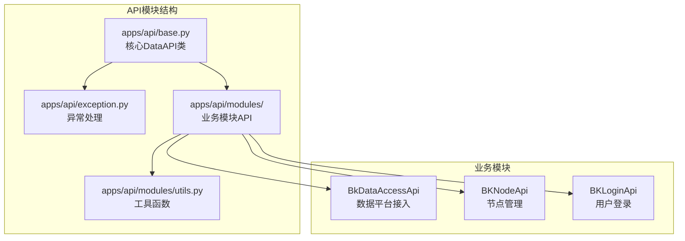
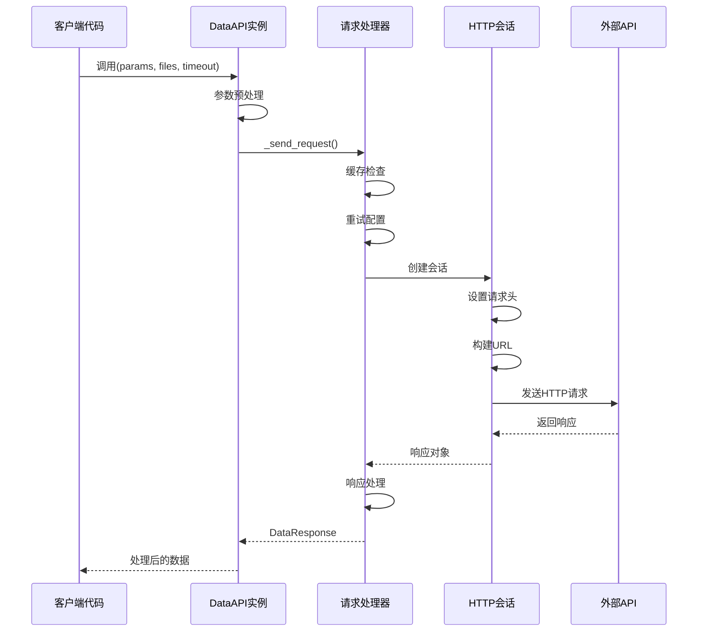
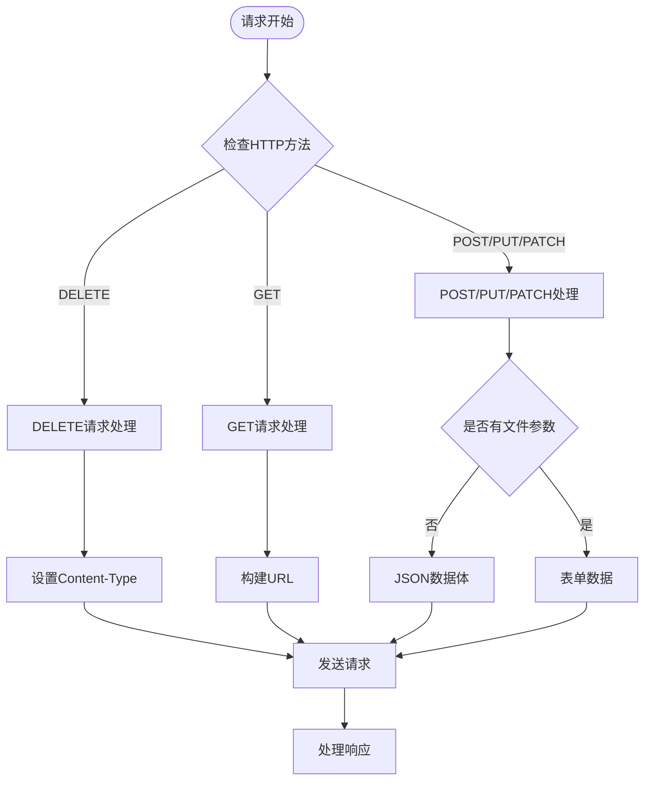
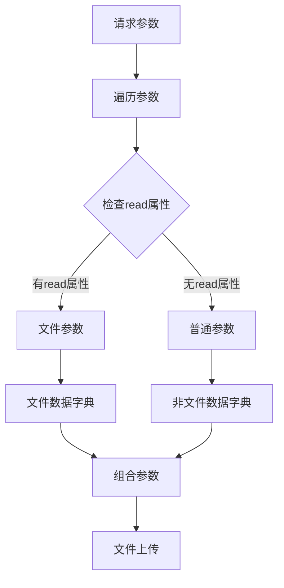
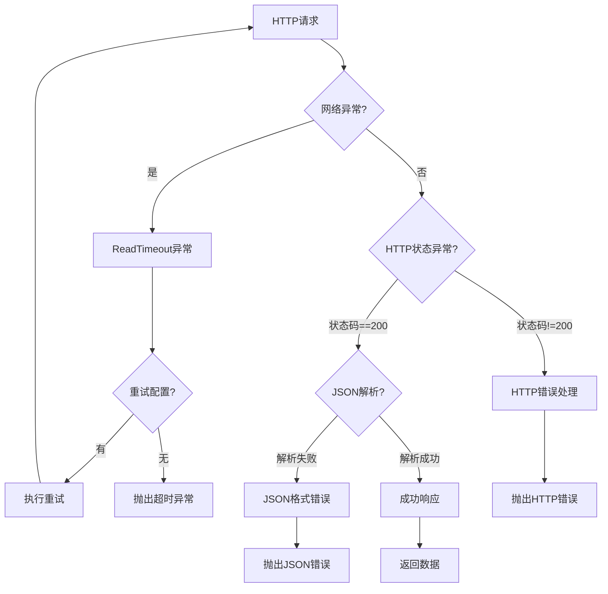
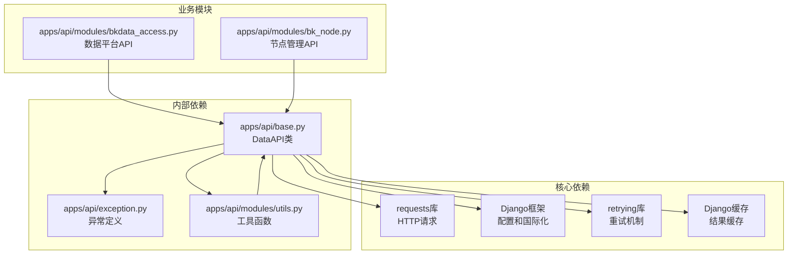

# 请求处理流程

<cite>
**本文档引用的文件**
- [apps/api/base.py](file://apps/api/base.py)
- [apps/api/exception.py](file://apps/api/exception.py)
- [apps/api/modules/bkdata_access.py](file://apps/api/modules/bkdata_access.py)
- [apps/api/modules/bk_node.py](file://apps/api/modules/bk_node.py)
- [apps/api/modules/utils.py](file://apps/api/modules/utils.py)
</cite>

## 目录
1. [简介](#简介)
2. [项目结构](#项目结构)
3. [核心组件](#核心组件)
4. [架构概览](#架构概览)
5. [详细组件分析](#详细组件分析)
6. [依赖关系分析](#依赖关系分析)
7. [性能考虑](#性能考虑)
8. [故障排除指南](#故障排除指南)
9. [结论](#结论)

## 简介

本文档深入分析了蓝鲸日志平台中的DataAPI类请求处理机制。DataAPI是整个系统的核心HTTP客户端，负责统一处理各种外部API请求，包括HTTP方法支持、参数处理、URL构建、请求头管理、文件上传、超时配置和异常处理等。

该组件实现了完整的请求生命周期管理，从参数预处理到响应后处理，再到缓存和重试机制，为整个系统的API通信提供了标准化的解决方案。

## 项目结构

DataAPI相关的核心文件位于`apps/api/`目录下，主要包含：



**图表来源**
- [apps/api/base.py:1-1009](file://apps/api/base.py#L1-L1009)
- [apps/api/exception.py:1-41](file://apps/api/exception.py#L1-L41)

**章节来源**
- [apps/api/base.py:1-1009](file://apps/api/base.py#L1-L1009)
- [apps/api/exception.py:1-41](file://apps/api/exception.py#L1-L41)

## 核心组件

### DataAPI类概述

DataAPI是整个请求处理系统的核心类，提供了统一的HTTP请求接口。它支持多种HTTP方法，具备智能的参数处理能力，以及完善的错误处理机制。

#### 主要特性

1. **多HTTP方法支持**：GET、POST、PUT、DELETE、PATCH等
2. **智能参数处理**：自动区分文件参数和普通参数
3. **请求头管理**：统一的认证和元数据头设置
4. **文件上传支持**：完整的multipart/form-data处理
5. **缓存机制**：基于MD5的请求结果缓存
6. **重试机制**：可配置的异常重试策略
7. **多租户支持**：动态租户ID管理和切换

**章节来源**
- [apps/api/base.py:190-276](file://apps/api/base.py#L190-L276)
- [apps/api/base.py:509-600](file://apps/api/base.py#L509-L600)

## 架构概览

DataAPI的请求处理架构采用分层设计，确保了高内聚低耦合的代码组织：



**图表来源**
- [apps/api/base.py:277-320](file://apps/api/base.py#L277-L320)
- [apps/api/base.py:332-424](file://apps/api/base.py#L332-L424)

## 详细组件分析

### 请求发送机制

DataAPI的请求发送机制是整个系统的核心，负责处理所有HTTP请求的生命周期。

#### HTTP方法支持

DataAPI支持所有标准HTTP方法，每种方法都有特定的处理逻辑：



**图表来源**
- [apps/api/base.py:562-599](file://apps/api/base.py#L562-L599)

#### 参数处理和URL构建

DataAPI实现了智能的参数分离和URL构建机制：

1. **参数分离**：自动识别文件参数和普通参数
2. **URL模板**：支持动态URL参数替换
3. **查询参数**：自动附加请求ID等元数据

**章节来源**
- [apps/api/base.py:602-620](file://apps/api/base.py#L602-L620)
- [apps/api/base.py:611-620](file://apps/api/base.py#L611-L620)

### 请求头设置和管理

DataAPI在请求头管理方面实现了高度的标准化和安全性：

#### 关键请求头说明

| 请求头名称 | 作用 | 设置位置 | 示例值 |
|-----------|------|----------|--------|
| X-Bkapi-Authorization | API网关认证 | `_send()`方法 | JSON格式的认证信息 |
| X-Bk-Tenant-Id | 多租户标识 | `_send()`方法 | 租户ID字符串 |
| X-Request-Id | 请求追踪ID | `_send()`方法 | UUID格式的请求ID |
| Content-Type | 数据类型声明 | 根据请求类型设置 | application/json或multipart/form-data |

#### 认证头构建

DataAPI使用`get_request_api_headers()`函数构建API认证头：


**图表来源**
- [apps/api/base.py:64-74](file://apps/api/base.py#L64-L74)
- [apps/api/base.py:527-533](file://apps/api/base.py#L527-L533)

**章节来源**
- [apps/api/base.py:64-74](file://apps/api/base.py#L64-L74)
- [apps/api/base.py:525-553](file://apps/api/base.py#L525-L553)

### 文件上传和二进制数据处理

DataAPI提供了完整的文件上传支持，能够处理各种类型的文件参数：

#### 文件参数识别

DataAPI通过检查参数对象的`read`属性来识别文件类型参数：



**图表来源**
- [apps/api/base.py:611-620](file://apps/api/base.py#L611-L620)

#### multipart/form-data构建

当存在文件参数时，DataAPI自动构建multipart/form-data请求：

1. **Content-Type设置**：`multipart/form-data; boundary=----WebKitFormBoundary...`
2. **边界符生成**：自动生成唯一的边界标识符
3. **参数编码**：文件参数和普通参数分别编码
4. **数据流传输**：支持大文件的流式传输

**章节来源**
- [apps/api/base.py:575-599](file://apps/api/base.py#L575-L599)
- [apps/api/base.py:611-620](file://apps/api/base.py#L611-L620)

### 超时配置和网络异常处理

DataAPI实现了多层次的超时控制和异常处理机制：

#### 超时配置

DataAPI支持三种级别的超时配置：

1. **默认超时**：DataAPI实例级配置
2. **调用超时**：单次调用级覆盖
3. **重试超时**：重试机制中的超时控制

#### 异常处理层次



**图表来源**
- [apps/api/base.py:378-385](file://apps/api/base.py#L378-L385)
- [apps/api/base.py:387-404](file://apps/api/base.py#L387-L404)

**章节来源**
- [apps/api/base.py:378-404](file://apps/api/base.py#L378-L404)

### 错误分类和处理策略

DataAPI实现了详细的错误分类和相应的处理策略：

#### 错误类型分类

| 错误类型 | 触发条件 | 处理策略 | 异常类型 |
|----------|----------|----------|----------|
| 网络超时 | ReadTimeout异常 | 重试机制或直接抛出 | DataAPIException |
| HTTP状态错误 | 非200状态码 | 构造标准错误响应 | DataAPIException |
| JSON解析错误 | 响应非JSON格式 | 标准化错误消息 | DataAPIException |
| 业务逻辑错误 | result字段为false | 抛出ApiResultError | ApiResultError |

#### 错误处理流程

```mermaid
stateDiagram-v2
[*] --> RequestProcessing
RequestProcessing --> Preprocessing : 参数预处理
Preprocessing --> Sending : 发送请求
Sending --> ResponseHandling : 接收响应
ResponseHandling --> Success : HTTP 200 + JSON
ResponseHandling --> NetworkError : 网络异常
ResponseHandling --> HttpError : HTTP状态异常
ResponseHandling --> JsonError : JSON解析异常
Success --> BusinessSuccess : result=true
Success --> BusinessError : result=false
BusinessSuccess --> [*]
BusinessError --> ApiResultError --> [*]
NetworkError --> DataAPIException --> [*]
HttpError --> DataAPIException --> [*]
JsonError --> DataAPIException --> [*]
```

**图表来源**
- [apps/api/base.py:318-320](file://apps/api/base.py#L318-L320)
- [apps/api/base.py:387-404](file://apps/api/base.py#L387-L404)

**章节来源**
- [apps/api/base.py:318-320](file://apps/api/base.py#L318-L320)
- [apps/api/base.py:387-404](file://apps/api/base.py#L387-L404)

## 依赖关系分析

DataAPI类的依赖关系体现了良好的模块化设计：



**图表来源**
- [apps/api/base.py:22-59](file://apps/api/base.py#L22-L59)
- [apps/api/exception.py:22-40](file://apps/api/exception.py#L22-L40)

**章节来源**
- [apps/api/base.py:22-59](file://apps/api/base.py#L22-L59)
- [apps/api/exception.py:22-40](file://apps/api/exception.py#L22-L40)

## 性能考虑

DataAPI在设计时充分考虑了性能优化：

### 缓存机制

DataAPI实现了基于MD5的智能缓存系统：

1. **缓存键生成**：URL和参数的MD5哈希
2. **缓存存储**：使用Django内置缓存系统
3. **缓存失效**：支持配置化的过期时间
4. **缓存命中**：避免重复的网络请求

### 并发处理

DataAPI支持多种并发请求模式：

1. **批量请求**：`batch_request()`方法支持参数切片
2. **分页请求**：`bulk_request()`方法支持结果分页
3. **线程池**：使用ThreadPool实现并发执行
4. **上下文传递**：保持请求上下文的一致性

### 重试机制

DataAPI提供了灵活的重试配置：

1. **异常重试**：可配置重试的异常类型
2. **结果重试**：基于业务逻辑的重试判断
3. **指数退避**：随机等待时间的退避算法
4. **最大尝试次数**：防止无限重试

## 故障排除指南

### 常见问题诊断

#### 请求超时问题

**症状**：`ReadTimeout`异常频繁出现

**诊断步骤**：
1. 检查网络连接稳定性
2. 查看外部API的响应时间
3. 调整超时配置参数
4. 启用重试机制

**解决方法**：
```python
# 增加重试配置
retry_config = DataApiRetryClass(
    stop_max_attempt_number=3,
    wait_random_min=1000,
    wait_random_max=5000
)
api_instance.__call__(params, data_api_retry_cls=retry_config)
```

#### 认证失败问题

**症状**：`X-Bkapi-Authorization`头导致的认证错误

**诊断步骤**：
1. 验证`bk_app_code`和`bk_app_secret`配置
2. 检查`bk_username`参数传递
3. 确认系统设置中的认证信息
4. 查看认证头的JSON序列化结果

**解决方法**：
```python
# 确保必要的认证参数
params = {
    'bk_app_code': settings.APP_CODE,
    'bk_app_secret': settings.SECRET_KEY,
    'bk_username': request.user.username,
    # 其他业务参数...
}
```

#### 文件上传问题

**症状**：multipart/form-data请求失败

**诊断步骤**：
1. 检查文件参数的`read`属性
2. 验证文件对象的有效性
3. 确认Content-Type设置
4. 查看文件大小限制

**解决方法**：
```python
# 正确的文件参数格式
files = {
    'file': open('/path/to/file', 'rb'),
    'description': '文件描述'
}
api_instance(params, files=files)
```

**章节来源**
- [apps/api/base.py:378-385](file://apps/api/base.py#L378-L385)
- [apps/api/base.py:527-533](file://apps/api/base.py#L527-L533)
- [apps/api/base.py:611-620](file://apps/api/base.py#L611-L620)

## 结论

DataAPI类作为蓝鲸日志平台的核心请求处理组件，展现了优秀的软件工程实践：

### 设计优势

1. **统一抽象**：提供一致的API调用接口
2. **完整功能**：涵盖从参数处理到错误处理的所有环节
3. **灵活配置**：支持多种配置选项和扩展点
4. **性能优化**：内置缓存、重试和并发机制
5. **错误处理**：完善的异常分类和处理策略

### 技术特点

- **模块化设计**：清晰的职责分离和依赖关系
- **可扩展性**：支持自定义请求头、重试策略等
- **安全性**：统一的认证机制和敏感信息处理
- **可观测性**：完整的请求日志和追踪信息

### 最佳实践建议

1. **合理配置超时**：根据API特性设置合适的超时时间
2. **启用缓存**：对频繁访问的API启用缓存机制
3. **监控异常**：建立完善的异常监控和告警机制
4. **参数验证**：在调用前进行参数的必要验证
5. **错误处理**：根据业务需求选择合适的错误处理策略

DataAPI的设计为整个系统的API通信提供了坚实的基础，其标准化的处理流程和完善的错误处理机制确保了系统的稳定性和可靠性。