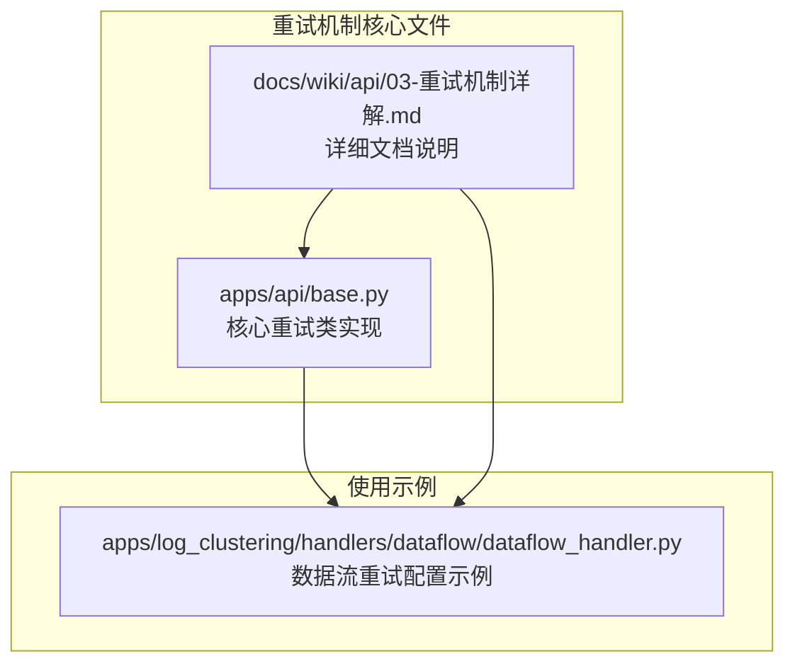
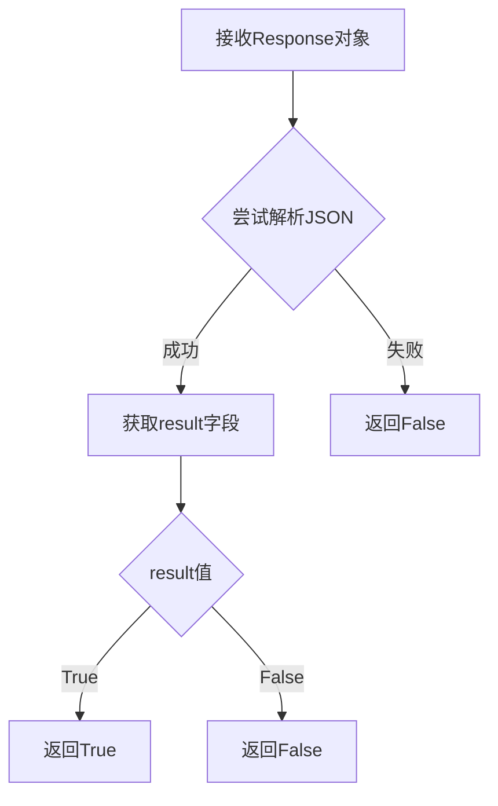
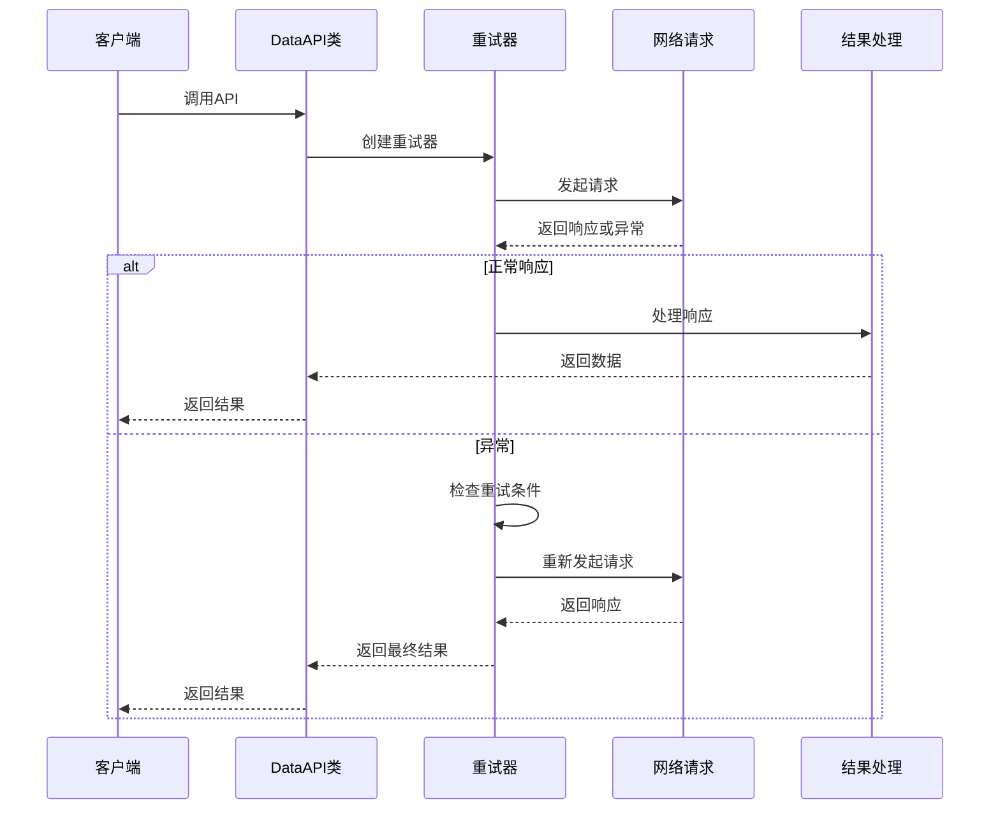
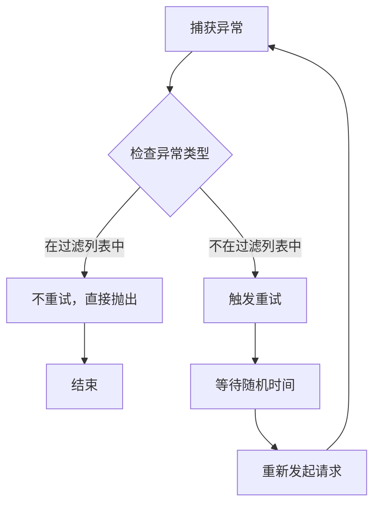
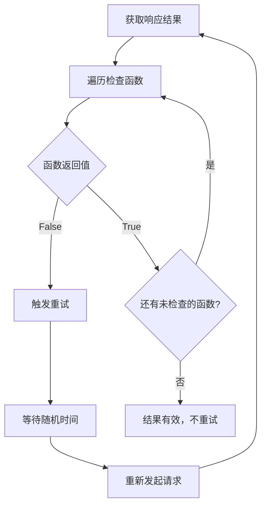
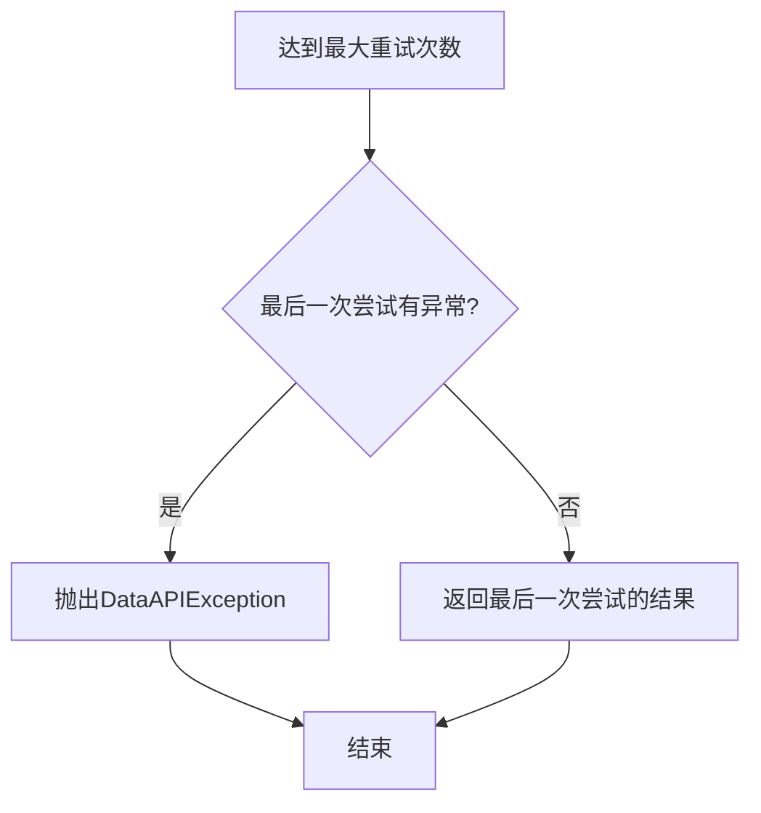
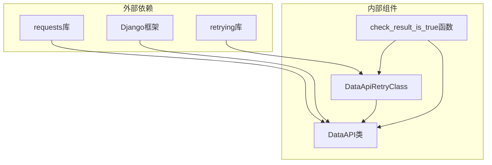

# 重试机制实现

<cite>
**本文档引用的文件**
- [apps/api/base.py](file://apps/api/base.py)
- [docs/wiki/api/03-重试机制详解.md](file://docs/wiki/api/03-重试机制详解.md)
- [apps/log_clustering/handlers/dataflow/dataflow_handler.py](file://apps/log_clustering/handlers/dataflow/dataflow_handler.py)
</cite>

## 目录
1. [简介](#简介)
2. [项目结构](#项目结构)
3. [核心组件](#核心组件)
4. [架构概览](#架构概览)
5. [详细组件分析](#详细组件分析)
6. [依赖分析](#依赖分析)
7. [性能考虑](#性能考虑)
8. [故障排除指南](#故障排除指南)
9. [结论](#结论)

## 简介

本文档深入解析了蓝鲸日志平台中DataApiRetryClass类的重试机制实现。该机制基于retrying库构建，提供了灵活的重试策略配置，包括异常类型过滤、结果检查函数、网络异常重试、业务逻辑重试和超时重试等多种处理方式。

重试机制的核心设计目标是：
- 差异化策略：根据不同接口的可靠性要求制定相应重试策略
- 避免雪崩：通过随机等待时间（jitter）避免多个请求同时重试
- 双触发机制：支持异常触发和结果校验两种重试方式
- 可扩展性：允许业务层自定义重试判定逻辑

## 项目结构

重试机制主要分布在以下文件中：



**图表来源**
- [apps/api/base.py:108-182](file://apps/api/base.py#L108-L182)
- [docs/wiki/api/03-重试机制详解.md:1-279](file://docs/wiki/api/03-重试机制详解.md#L1-L279)

**章节来源**
- [apps/api/base.py:108-182](file://apps/api/base.py#L108-L182)
- [docs/wiki/api/03-重试机制详解.md:1-279](file://docs/wiki/api/03-重试机制详解.md#L1-L279)

## 核心组件

### DataApiRetryClass类

DataApiRetryClass是重试机制的核心类，提供了完整的重试策略配置能力：

#### 主要属性
- `stop_max_attempt_number`: 最大尝试次数（含首次请求）
- `wait_random_min`: 最小等待时间（毫秒）
- `wait_random_max`: 最大等待时间（毫秒）
- `fail_exceptions`: 不触发重试的异常类型列表
- `fail_check_functions`: 结果检查函数列表

#### 关键方法
- `add_exceptions()`: 添加不需要重试的异常类型
- `add_fail_check_functions()`: 添加结果检查函数
- `retry_on_exception`: 异常触发重试的判断逻辑
- `retry_on_result`: 结果校验重试的判断逻辑
- `create_retry_obj()`: 创建重试对象的工厂方法

**章节来源**
- [apps/api/base.py:108-174](file://apps/api/base.py#L108-L174)

### check_result_is_true函数

这是一个通用的结果检查函数，用于判断业务逻辑的成功状态：



**图表来源**
- [apps/api/base.py:176-182](file://apps/api/base.py#L176-L182)

**章节来源**
- [apps/api/base.py:176-182](file://apps/api/base.py#L176-L182)

## 架构概览

重试机制在整个DataAPI调用流程中的位置如下：



**图表来源**
- [apps/api/base.py:367-385](file://apps/api/base.py#L367-L385)

## 详细组件分析

### 重试策略配置

#### 异常类型过滤
重试机制支持对特定异常类型的过滤，避免对某些异常进行重试：



**图表来源**
- [apps/api/base.py:131-140](file://apps/api/base.py#L131-L140)

#### 结果检查函数
业务层可以自定义结果检查逻辑，确保业务逻辑的成功状态：



**图表来源**
- [apps/api/base.py:142-154](file://apps/api/base.py#L142-L154)

**章节来源**
- [apps/api/base.py:131-154](file://apps/api/base.py#L131-L154)

### 重试条件判断逻辑

#### 网络异常重试
网络异常重试主要通过异常类型过滤实现，支持ReadTimeout等网络相关异常的自动重试。

#### 业务逻辑重试
业务逻辑重试通过结果检查函数实现，确保业务层面的成功状态得到验证。

#### 超时重试
超时重试通过Retrying库的内置机制实现，结合随机等待时间避免雪崩效应。

**章节来源**
- [apps/api/base.py:367-385](file://apps/api/base.py#L367-L385)

### 重试参数配置选项

#### 最大重试次数
- 默认值：1（含首次请求）
- 配置方式：通过`stop_max_attempt_number`参数设置
- 影响：决定重试的最大次数

#### 等待时间
- `wait_random_min`：最小等待时间（毫秒）
- `wait_random_max`：最大等待时间（毫秒）
- 作用：通过随机抖动避免重试风暴

#### 随机抖动机制
重试等待时间采用随机抖动策略，范围为`[wait_random_min, wait_random_max]`毫秒。

**章节来源**
- [apps/api/base.py:108-114](file://apps/api/base.py#L108-L114)

### 错误传播和异常处理

#### RetryError处理
当达到最大重试次数时，Retrying库会抛出RetryError异常，框架会根据最后一次尝试的结果进行处理：



**图表来源**
- [apps/api/base.py:378-385](file://apps/api/base.py#L378-L385)

#### 最后一次重试失败的错误信息保留
框架会保留最后一次重试的错误信息，确保错误诊断的完整性。

**章节来源**
- [apps/api/base.py:378-385](file://apps/api/base.py#L378-L385)

### 实际使用示例

在数据流处理模块中，重试机制被广泛应用于各种场景：

#### 数据平台查询重试
```python
data_api_retry_cls=DataApiRetryClass.create_retry_obj(
    fail_check_functions=[check_result_is_true],
    stop_max_attempt_number=3
)
```

#### 推荐配置方案
- **快速查询**：1-2次重试，单次超时30秒，等待时间100-500ms
- **数据处理**：3-5次重试，单次超时60-120秒，等待时间1-5秒
- **关键操作**：5次以上重试，单次超时120秒以上，等待时间3-10秒

**章节来源**
- [apps/log_clustering/handlers/dataflow/dataflow_handler.py:643-645](file://apps/log_clustering/handlers/dataflow/dataflow_handler.py#L643-L645)
- [docs/wiki/api/03-重试机制详解.md:234-256](file://docs/wiki/api/03-重试机制详解.md#L234-L256)

## 依赖分析

重试机制的依赖关系如下：



**图表来源**
- [apps/api/base.py:44-45](file://apps/api/base.py#L44-L45)

### 核心依赖说明

- **retrying库**：提供重试功能的核心库，包含Retrying类和RetryError异常
- **requests库**：HTTP请求库，DataAPI基于requests实现网络通信
- **Django框架**：提供配置管理、日志记录等功能支持

**章节来源**
- [apps/api/base.py:44-59](file://apps/api/base.py#L44-L59)

## 性能考虑

### 重试间隔策略
1. **指数退避策略**：建议采用1秒、2秒、4秒、8秒等指数增长
2. **线性增长策略**：适用于对实时性要求较高的场景
3. **随机抖动**：始终启用随机抖动（0-1000ms）避免重试风暴

### 资源消耗控制
1. **最大重试次数限制**：避免无限重试导致资源耗尽
2. **超时时间设置**：合理设置单次请求超时时间
3. **并发控制**：避免大量并发请求同时重试

### 最佳实践建议
1. **区分重试场景**：网络异常和业务异常采用不同的重试策略
2. **监控重试效果**：记录重试次数和成功率，持续优化重试参数
3. **渐进式重试**：从较少次数开始，根据实际情况逐步增加

## 故障排除指南

### 常见问题及解决方案

#### 重试次数过多
**现象**：系统负载过高，响应时间过长
**解决方案**：
- 减少最大重试次数
- 增加等待时间范围
- 检查上游系统的稳定性

#### 重试无效
**现象**：即使重试也无法获得成功响应
**解决方案**：
- 检查异常过滤配置
- 验证结果检查函数逻辑
- 确认网络连接状态

#### 内存泄漏
**现象**：长时间运行后内存占用持续增长
**解决方案**：
- 检查重试循环中的资源释放
- 确保异常处理中的清理逻辑
- 监控重试队列长度

**章节来源**
- [apps/api/base.py:378-385](file://apps/api/base.py#L378-L385)

## 结论

DataApiRetryClass类为蓝鲸日志平台提供了强大而灵活的重试机制。通过异常类型过滤、结果检查函数、随机抖动等特性，实现了对网络异常、业务逻辑异常和超时异常的差异化处理。

该重试机制的关键优势包括：
- **可配置性强**：支持多种重试策略和参数配置
- **可扩展性好**：允许业务层自定义重试逻辑
- **性能友好**：通过随机抖动避免重试风暴
- **易于监控**：完整的错误信息保留和日志记录

在实际应用中，建议根据具体的业务场景选择合适的重试策略，并持续监控重试效果，不断优化重试参数以达到最佳的系统稳定性和性能平衡。