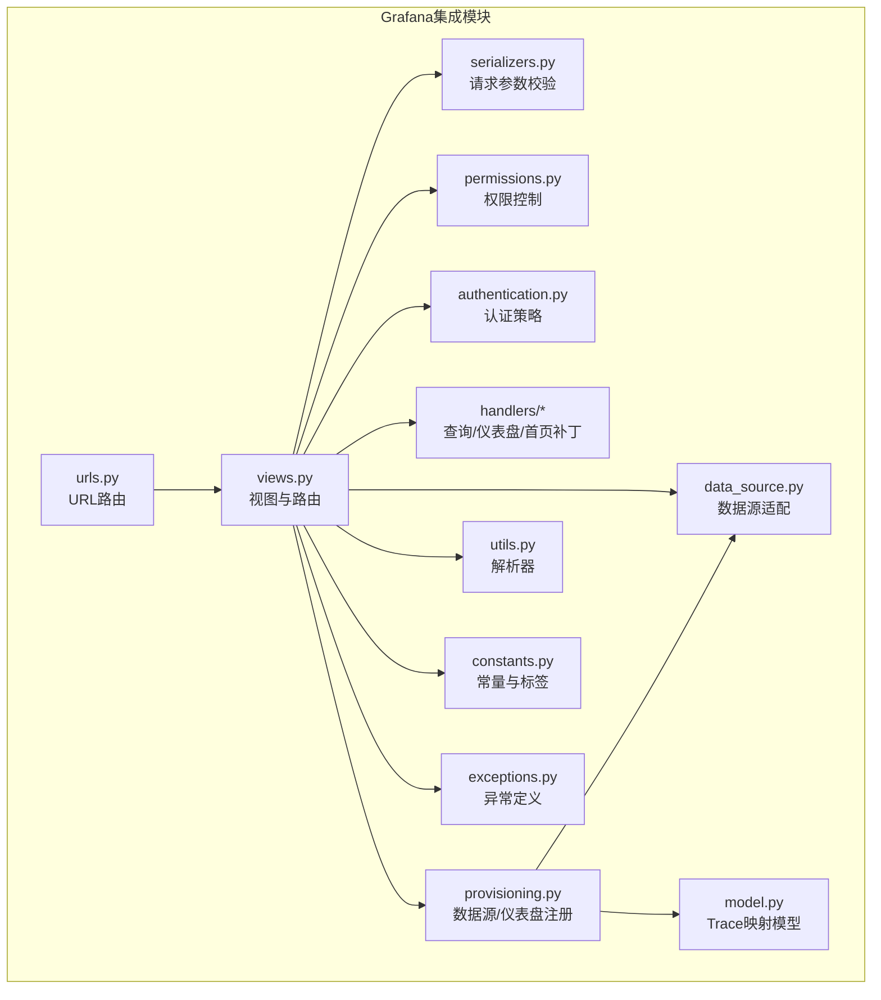
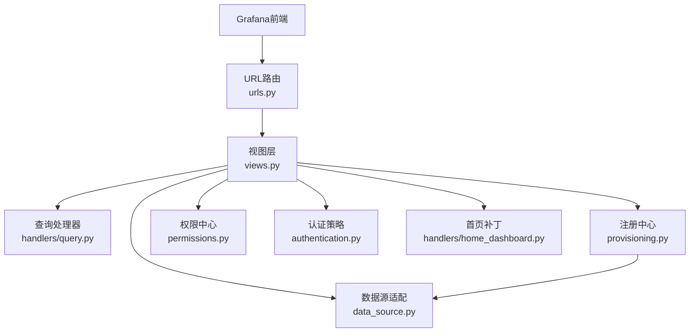
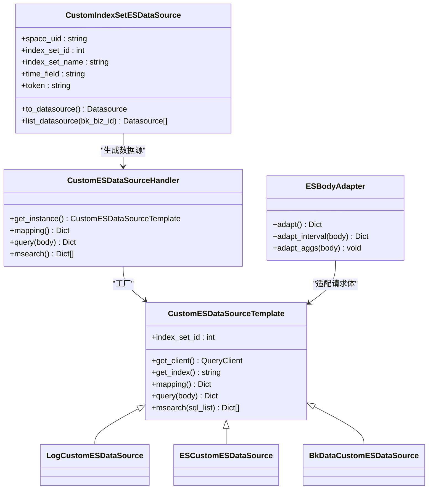
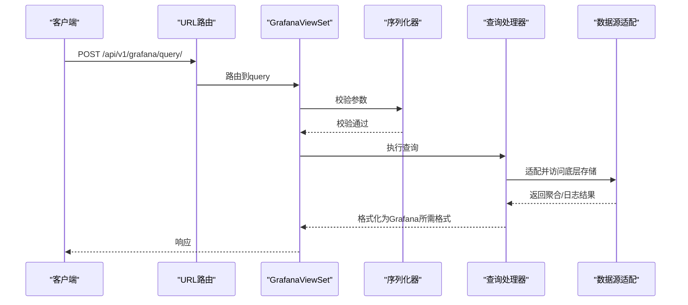
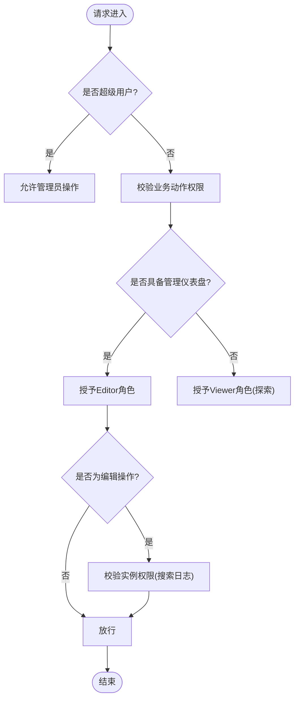
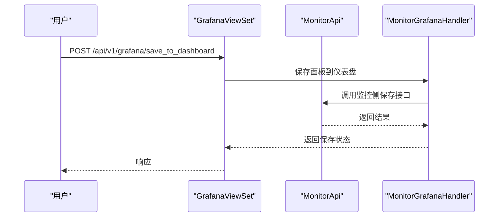
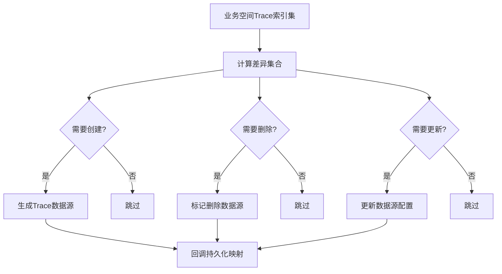
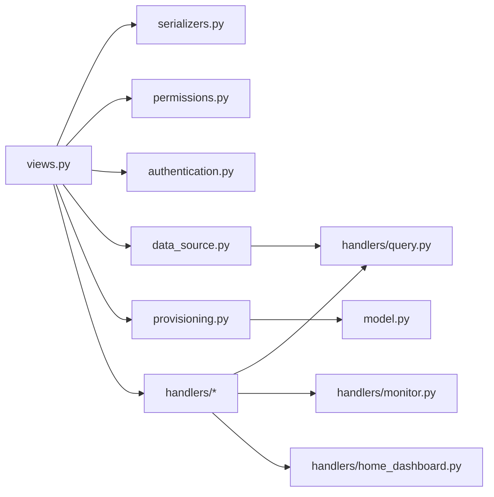

# Grafana集成

<cite>
**本文引用的文件**
- [apps/grafana/__init__.py](file://apps/grafana/__init__.py)
- [apps/grafana/authentication.py](file://apps/grafana/authentication.py)
- [apps/grafana/constants.py](file://apps/grafana/constants.py)
- [apps/grafana/data_source.py](file://apps/grafana/data_source.py)
- [apps/grafana/exceptions.py](file://apps/grafana/exceptions.py)
- [apps/grafana/model.py](file://apps/grafana/model.py)
- [apps/grafana/permissions.py](file://apps/grafana/permissions.py)
- [apps/grafana/provisioning.py](file://apps/grafana/provisioning.py)
- [apps/grafana/serializers.py](file://apps/grafana/serializers.py)
- [apps/grafana/urls.py](file://apps/grafana/urls.py)
- [apps/grafana/utils.py](file://apps/grafana/utils.py)
- [apps/grafana/views.py](file://apps/grafana/views.py)
- [apps/grafana/handlers/home_dashboard.py](file://apps/grafana/handlers/home_dashboard.py)
- [apps/grafana/handlers/monitor.py](file://apps/grafana/handlers/monitor.py)
- [apps/grafana/handlers/query.py](file://apps/grafana/handlers/query.py)
</cite>

## 目录
1. [简介](#简介)
2. [项目结构](#项目结构)
3. [核心组件](#核心组件)
4. [架构总览](#架构总览)
5. [详细组件分析](#详细组件分析)
6. [依赖分析](#依赖分析)
7. [性能考虑](#性能考虑)
8. [故障排查指南](#故障排查指南)
9. [结论](#结论)
10. [附录：Grafana配置与集成示例](#附录grafana配置与集成示例)

## 简介
本文件面向Grafana与BK Log平台的集成场景，系统性阐述后端适配器的设计与实现，覆盖数据源配置、认证授权与权限控制、API路由与数据访问、仪表盘与模板管理、以及配置文件要点与最佳实践。读者可据此完成Grafana在蓝鲸体系内的数据接入、权限治理与可视化落地。

## 项目结构
Grafana集成位于apps/grafana子模块，围绕“视图-序列化-处理器-数据源-权限-注册”六大层面组织代码，同时通过bk_dataview提供的grafana适配层实现与Grafana前端的对接。

图表来源
- [apps/grafana/urls.py:32-58](file://apps/grafana/urls.py#L32-L58)
- [apps/grafana/views.py:149-593](file://apps/grafana/views.py#L149-L593)
- [apps/grafana/data_source.py:1-354](file://apps/grafana/data_source.py#L1-L354)
- [apps/grafana/provisioning.py:36-127](file://apps/grafana/provisioning.py#L36-L127)
- [apps/grafana/permissions.py:28-53](file://apps/grafana/permissions.py#L28-L53)
- [apps/grafana/authentication.py:27-30](file://apps/grafana/authentication.py#L27-L30)
- [apps/grafana/handlers/home_dashboard.py:27-131](file://apps/grafana/handlers/home_dashboard.py#L27-L131)
- [apps/grafana/handlers/monitor.py:7-39](file://apps/grafana/handlers/monitor.py#L7-L39)
- [apps/grafana/handlers/query.py:59-825](file://apps/grafana/handlers/query.py#L59-L825)
- [apps/grafana/model.py:25-29](file://apps/grafana/model.py#L25-L29)
- [apps/grafana/constants.py:24-48](file://apps/grafana/constants.py#L24-L48)
- [apps/grafana/exceptions.py:27-60](file://apps/grafana/exceptions.py#L27-L60)
- [apps/grafana/utils.py:7-22](file://apps/grafana/utils.py#L7-L22)

章节来源
- [apps/grafana/urls.py:32-58](file://apps/grafana/urls.py#L32-L58)
- [apps/grafana/views.py:149-593](file://apps/grafana/views.py#L149-L593)

## 核心组件
- 视图与路由：提供Grafana API入口（指标/日志查询、变量、拓扑、仪表盘目录、保存到仪表盘等），并封装代理访问Grafana前端。
- 序列化器：统一校验请求参数，确保调用侧参数规范。
- 权限控制：基于业务/实例权限与角色映射，限定仪表盘编辑与查看范围。
- 认证策略：绕过CSRF的会话认证，适配Grafana跨域与iframe场景。
- 数据源适配：将索引集转换为Grafana ES数据源，提供mapping与msearch能力；兼容不同存储场景（日志、第三方ES、BK-Data）。
- 注册与发现：按业务自动注入日志平台数据源、Trace数据源与自定义ES数据源。
- 处理器：封装查询逻辑（含脱敏、聚合、时间序列格式化）、仪表盘保存、首页面板补丁。
- 工具与常量：NDJSON解析器、Trace类型、CMDB扩展字段、时序字段类型、内置维度等。

章节来源
- [apps/grafana/views.py:149-593](file://apps/grafana/views.py#L149-L593)
- [apps/grafana/serializers.py:28-137](file://apps/grafana/serializers.py#L28-L137)
- [apps/grafana/permissions.py:28-53](file://apps/grafana/permissions.py#L28-L53)
- [apps/grafana/authentication.py:27-30](file://apps/grafana/authentication.py#L27-L30)
- [apps/grafana/data_source.py:46-354](file://apps/grafana/data_source.py#L46-L354)
- [apps/grafana/provisioning.py:36-127](file://apps/grafana/provisioning.py#L36-L127)
- [apps/grafana/handlers/query.py:59-825](file://apps/grafana/handlers/query.py#L59-L825)
- [apps/grafana/handlers/monitor.py:7-39](file://apps/grafana/handlers/monitor.py#L7-L39)
- [apps/grafana/handlers/home_dashboard.py:27-131](file://apps/grafana/handlers/home_dashboard.py#L27-L131)
- [apps/grafana/utils.py:7-22](file://apps/grafana/utils.py#L7-L22)
- [apps/grafana/constants.py:24-48](file://apps/grafana/constants.py#L24-L48)

## 架构总览
下图展示Grafana前端与后端适配器之间的交互路径，包括数据源注册、查询链路与代理访问。

图表来源
- [apps/grafana/urls.py:32-58](file://apps/grafana/urls.py#L32-L58)
- [apps/grafana/views.py:149-593](file://apps/grafana/views.py#L149-L593)
- [apps/grafana/provisioning.py:36-127](file://apps/grafana/provisioning.py#L36-L127)
- [apps/grafana/data_source.py:46-354](file://apps/grafana/data_source.py#L46-L354)
- [apps/grafana/handlers/query.py:59-825](file://apps/grafana/handlers/query.py#L59-L825)
- [apps/grafana/handlers/home_dashboard.py:27-131](file://apps/grafana/handlers/home_dashboard.py#L27-L131)
- [apps/grafana/permissions.py:28-53](file://apps/grafana/permissions.py#L28-L53)
- [apps/grafana/authentication.py:27-30](file://apps/grafana/authentication.py#L27-L30)

## 详细组件分析

### 数据源适配与自定义ES数据源
- 索引集到Grafana ES数据源的转换：根据业务空间生成带前缀的数据源名称，注入时间字段、HTTP头（空间UID与令牌），并指向后端代理接口。
- ES请求体适配：将Grafana ES7语法差异（如date_histogram的interval命名、terms聚合的order键）转换为日志检索接口期望格式。
- 映射与批量查询：提供_mapping与_msearch接口，支持多SQL批量执行与顺序返回。
- 场景适配：针对日志、第三方ES、BK-Data三种场景分别封装客户端与查询逻辑。

图表来源
- [apps/grafana/data_source.py:46-354](file://apps/grafana/data_source.py#L46-L354)

章节来源
- [apps/grafana/data_source.py:46-354](file://apps/grafana/data_source.py#L46-L354)

### API路由与视图流程
- 路由：统一在/api/v1/下暴露Grafana相关接口；提供自定义ES数据源的_mapping与_msearch；代理Trace与静态资源。
- 视图：GrafanaViewSet负责指标/日志查询、变量、拓扑、仪表盘目录、保存到仪表盘；GrafanaTraceViewSet负责Trace查询；GrafanaProxyView代理Grafana前端并注入编辑权限头；CustomESDatasourceViewSet提供自定义ES数据源的mapping与msearch。
- 参数校验：通过序列化器统一校验请求参数，避免脏数据进入业务逻辑。
- 权限与认证：业务权限与角色映射、绕过CSRF的会话认证，保障跨域与iframe场景下的安全访问。

图表来源
- [apps/grafana/urls.py:32-58](file://apps/grafana/urls.py#L32-L58)
- [apps/grafana/views.py:196-234](file://apps/grafana/views.py#L196-L234)
- [apps/grafana/serializers.py:54-68](file://apps/grafana/serializers.py#L54-L68)
- [apps/grafana/handlers/query.py:278-350](file://apps/grafana/handlers/query.py#L278-L350)
- [apps/grafana/data_source.py:260-281](file://apps/grafana/data_source.py#L260-L281)

章节来源
- [apps/grafana/urls.py:32-58](file://apps/grafana/urls.py#L32-L58)
- [apps/grafana/views.py:149-593](file://apps/grafana/views.py#L149-L593)
- [apps/grafana/serializers.py:28-137](file://apps/grafana/serializers.py#L28-L137)

### 权限控制与认证机制
- 业务权限：超级用户拥有管理员权限；普通用户依据业务动作（管理仪表盘）授予Editor或Viewer角色；探索页面默认Viewer。
- 实例权限：仪表盘编辑需具备“搜索日志”实例权限；否则在查询阶段进行权限校验。
- 认证策略：NoCsrfSessionAuthentication绕过CSRF校验，适配Grafana iframe与跨域场景。

图表来源
- [apps/grafana/permissions.py:28-53](file://apps/grafana/permissions.py#L28-L53)
- [apps/grafana/views.py:149-166](file://apps/grafana/views.py#L149-L166)
- [apps/grafana/handlers/query.py:236-250](file://apps/grafana/handlers/query.py#L236-L250)

章节来源
- [apps/grafana/permissions.py:28-53](file://apps/grafana/permissions.py#L28-L53)
- [apps/grafana/authentication.py:27-30](file://apps/grafana/authentication.py#L27-L30)
- [apps/grafana/views.py:149-166](file://apps/grafana/views.py#L149-L166)
- [apps/grafana/handlers/query.py:236-250](file://apps/grafana/handlers/query.py#L236-L250)

### 仪表盘配置与模板管理
- 仪表盘目录树与创建：提供目录树查询与创建仪表盘/目录的接口，便于在监控侧统一管理。
- 保存到仪表盘：将查询面板保存至指定仪表盘，携带数据源标签与索引集信息。
- 首页面板补丁：对Grafana首页进行替换，提供导航与使用指引，提升新用户上手体验。

图表来源
- [apps/grafana/views.py:545-566](file://apps/grafana/views.py#L545-L566)
- [apps/grafana/handlers/monitor.py:7-39](file://apps/grafana/handlers/monitor.py#L7-L39)

章节来源
- [apps/grafana/views.py:476-566](file://apps/grafana/views.py#L476-L566)
- [apps/grafana/handlers/monitor.py:7-39](file://apps/grafana/handlers/monitor.py#L7-L39)
- [apps/grafana/handlers/home_dashboard.py:27-131](file://apps/grafana/handlers/home_dashboard.py#L27-L131)

### Trace数据源与注册
- Trace数据源注册：根据业务空间内Trace索引集动态增删改Trace数据源；记录数据源ID与索引集映射，便于后续管理。
- Trace查询：提供服务/操作、追踪详情等查询接口，结合权限控制保障数据安全。

图表来源
- [apps/grafana/provisioning.py:55-98](file://apps/grafana/provisioning.py#L55-L98)
- [apps/grafana/model.py:25-29](file://apps/grafana/model.py#L25-L29)

章节来源
- [apps/grafana/provisioning.py:55-112](file://apps/grafana/provisioning.py#L55-L112)
- [apps/grafana/model.py:25-29](file://apps/grafana/model.py#L25-L29)

## 依赖分析
- 内部依赖：视图依赖序列化器、权限、认证、数据源适配与处理器；处理器依赖日志检索、统一查询、脱敏、IP选择器等模块；注册模块依赖索引集与空间工具。
- 外部依赖：通过bk_dataview的grafana适配层实现与Grafana前端的对接（组织切换、代理、静态资源）。

图表来源
- [apps/grafana/views.py:149-593](file://apps/grafana/views.py#L149-L593)
- [apps/grafana/serializers.py:28-137](file://apps/grafana/serializers.py#L28-L137)
- [apps/grafana/permissions.py:28-53](file://apps/grafana/permissions.py#L28-L53)
- [apps/grafana/authentication.py:27-30](file://apps/grafana/authentication.py#L27-L30)
- [apps/grafana/data_source.py:46-354](file://apps/grafana/data_source.py#L46-L354)
- [apps/grafana/provisioning.py:36-127](file://apps/grafana/provisioning.py#L36-L127)
- [apps/grafana/handlers/query.py:59-825](file://apps/grafana/handlers/query.py#L59-L825)
- [apps/grafana/handlers/monitor.py:7-39](file://apps/grafana/handlers/monitor.py#L7-L39)
- [apps/grafana/handlers/home_dashboard.py:27-131](file://apps/grafana/handlers/home_dashboard.py#L27-L131)
- [apps/grafana/model.py:25-29](file://apps/grafana/model.py#L25-L29)

章节来源
- [apps/grafana/views.py:149-593](file://apps/grafana/views.py#L149-L593)
- [apps/grafana/data_source.py:46-354](file://apps/grafana/data_source.py#L46-L354)
- [apps/grafana/provisioning.py:36-127](file://apps/grafana/provisioning.py#L36-L127)

## 性能考虑
- 批量查询：自定义ES数据源支持_msearch批量执行，减少网络往返与并发开销。
- 聚合优化：按时间字段与维度逐层聚合，避免全表扫描；合理设置聚合大小与区间。
- 缓存与白名单：在后台部署时对特定应用免鉴权，降低鉴权成本；统一查询开关按业务粒度控制。
- 脱敏与格式化：在返回前进行字段脱敏与时间序列格式化，避免前端重复处理。

[本节为通用指导，不直接分析具体文件]

## 故障排查指南
- 认证与权限
  - 现象：无法编辑仪表盘或访问受限。
  - 排查：确认业务权限与实例权限；检查是否为超级用户；核对编辑请求头注入逻辑。
- 数据源不可见
  - 现象：业务下无可用数据源。
  - 排查：确认特性开关已启用；核对业务白名单；检查索引集是否存在且可用。
- Trace数据源异常
  - 现象：Trace查询失败或数据源缺失。
  - 排查：检查Trace索引集与映射表；确认注册差异计算正确；验证代理路径。
- 查询结果异常
  - 现象：指标/日志查询为空或格式不符。
  - 排查：核对请求体适配逻辑；确认聚合字段与区间；检查脱敏规则与字段映射。

章节来源
- [apps/grafana/exceptions.py:27-60](file://apps/grafana/exceptions.py#L27-L60)
- [apps/grafana/views.py:67-101](file://apps/grafana/views.py#L67-L101)
- [apps/grafana/provisioning.py:55-98](file://apps/grafana/provisioning.py#L55-L98)
- [apps/grafana/data_source.py:154-198](file://apps/grafana/data_source.py#L154-L198)

## 结论
本集成方案通过清晰的模块划分与职责边界，实现了Grafana与BK Log平台的深度对接：在数据源层面提供统一适配与批量查询能力，在权限层面实现业务与实例双维度控制，在视图与注册层面提供开箱即用的仪表盘与Trace支持。配合NDJSON解析器与首页补丁，整体提升了可观测性平台的易用性与安全性。

[本节为总结性内容，不直接分析具体文件]

## 附录：Grafana配置与集成示例

### 配置要点
- 数据源设置
  - 日志平台时序数据源：类型为bk_log_datasource，基础URL指向后端API前缀。
  - 自定义ES数据源：按业务注入，携带空间UID与令牌头，指向后端代理接口。
  - Trace数据源：按Trace索引集动态注册，支持增删改与持久化映射。
- 认证配置
  - 使用NoCsrfSessionAuthentication绕过CSRF，确保iframe与跨域访问。
  - 仪表盘编辑时注入X-WEBAUTH-USER头以授权。
- 安全策略
  - 业务权限与实例权限双重校验；探索页面默认Viewer角色。
  - 特性开关控制自定义ES数据源启用范围。

章节来源
- [apps/grafana/provisioning.py:36-98](file://apps/grafana/provisioning.py#L36-L98)
- [apps/grafana/data_source.py:98-128](file://apps/grafana/data_source.py#L98-L128)
- [apps/grafana/views.py:67-101](file://apps/grafana/views.py#L67-L101)
- [apps/grafana/permissions.py:28-53](file://apps/grafana/permissions.py#L28-L53)

### API清单与用途
- 指标查询：POST /api/v1/grafana/query/，支持聚合方法、维度、时间区间与过滤条件。
- 日志查询：POST /api/v1/grafana/query_log/，支持关键字、过滤条件与排序。
- 变量与拓扑：GET/POST /api/v1/grafana/get_variable_*、/api/v1/grafana/target_tree/。
- 仪表盘目录与创建：GET/POST /api/v1/grafana/get_dashboard_directory_tree/、/api/v1/grafana/create_dashboard_or_folder/。
- 保存到仪表盘：POST /api/v1/grafana/save_to_dashboard/。
- 自定义ES数据源：GET /grafana/custom_es_datasource/{index_set_id}/_mapping、POST /grafana/custom_es_datasource/_msearch。
- Trace查询：GET/POST /grafana/proxy/trace/{index_set_id}/api/*。

章节来源
- [apps/grafana/views.py:196-566](file://apps/grafana/views.py#L196-L566)
- [apps/grafana/urls.py:39-58](file://apps/grafana/urls.py#L39-L58)

### 最佳实践
- 使用统一查询开关按业务启用，逐步灰度新功能。
- 通过仪表盘保存接口将常用查询固化为面板，提升复用性。
- 对敏感字段配置脱敏规则，避免在面板中泄露。
- 在Trace场景下，优先使用动态注册的数据源，确保索引集变更及时生效。
- 首页补丁仅在必要时启用，避免影响现有工作流。

[本节为通用指导，不直接分析具体文件]