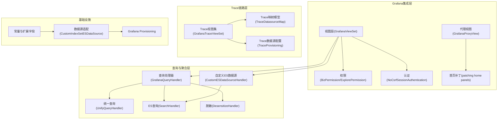
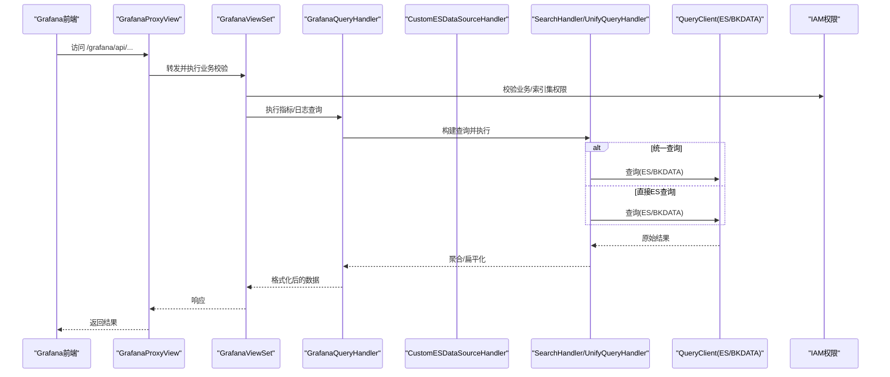
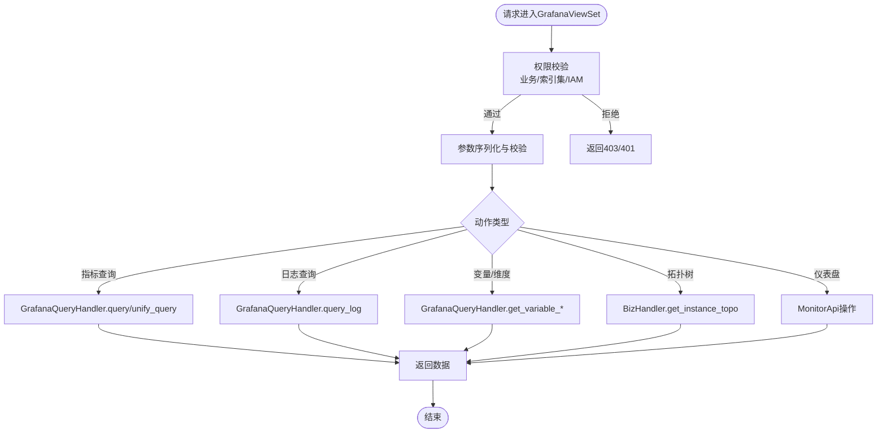
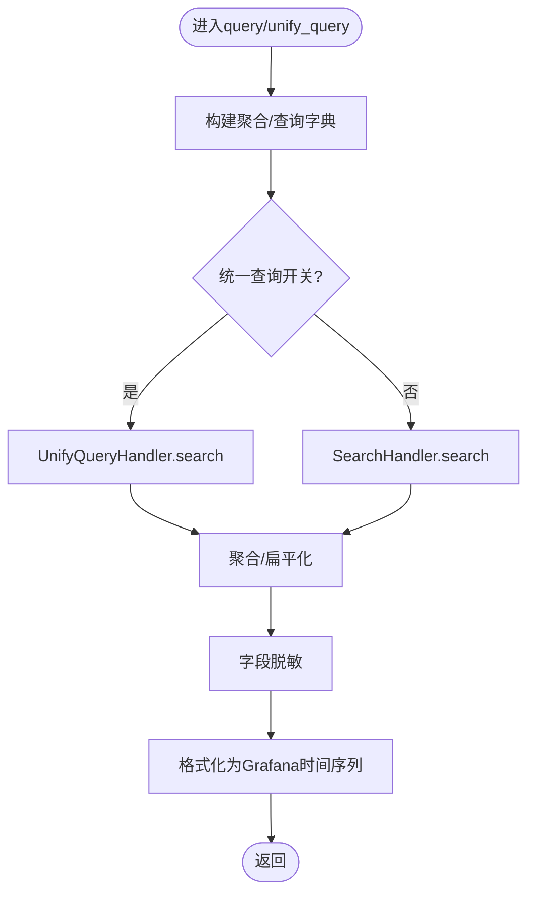
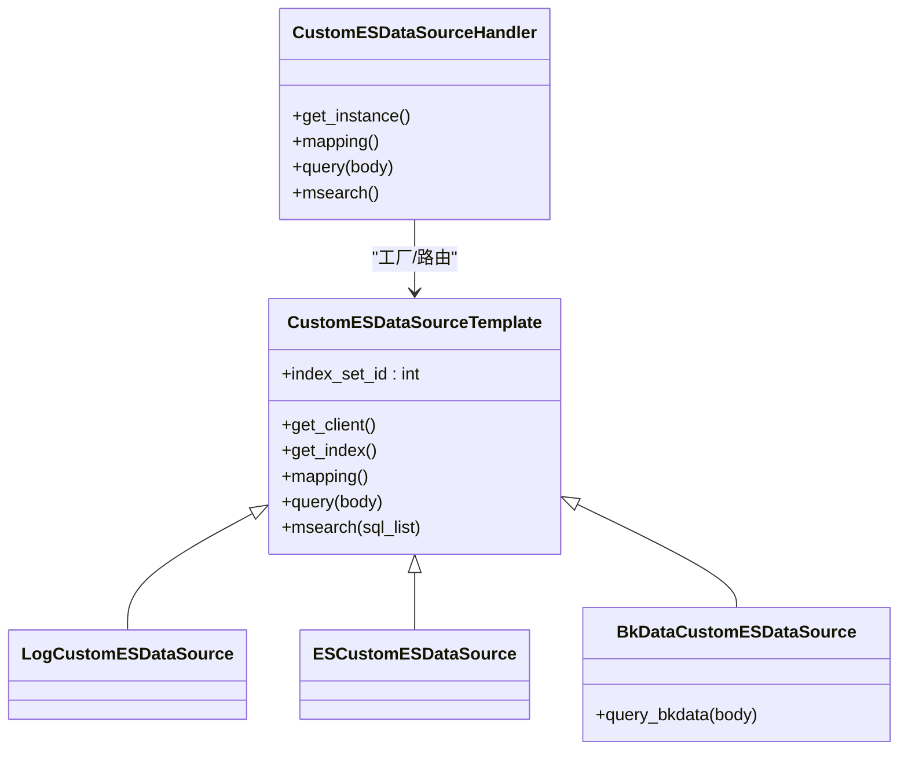
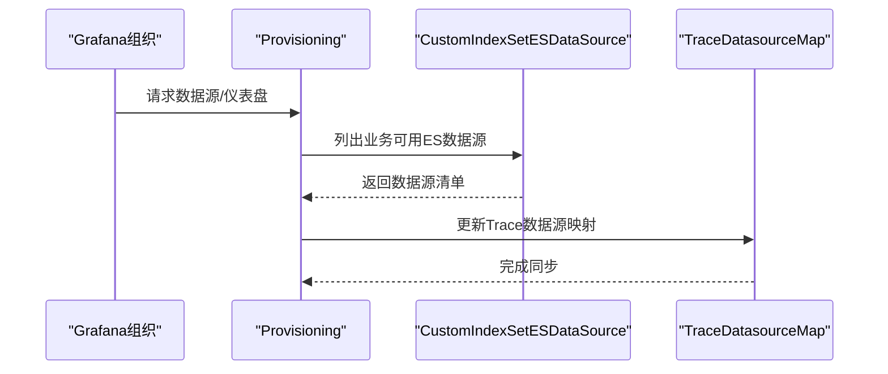
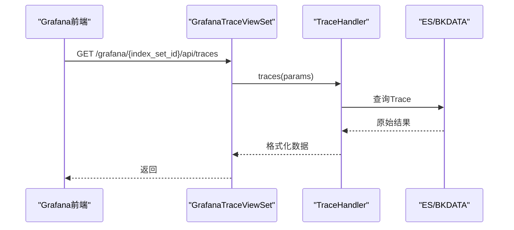
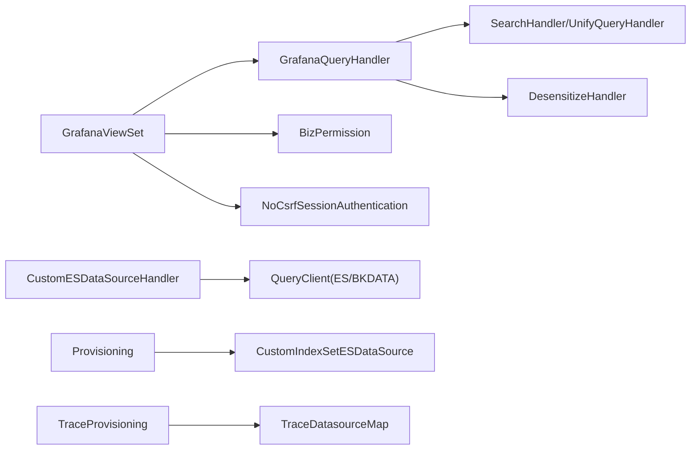

# 可视化监控系统

<cite>
**本文档引用的文件**
- [apps/grafana/data_source.py](file://apps/grafana/data_source.py)
- [apps/grafana/views.py](file://apps/grafana/views.py)
- [apps/grafana/handlers/query.py](file://apps/grafana/handlers/query.py)
- [apps/grafana/handlers/monitor.py](file://apps/grafana/handlers/monitor.py)
- [apps/grafana/handlers/home_dashboard.py](file://apps/grafana/handlers/home_dashboard.py)
- [apps/grafana/provisioning.py](file://apps/grafana/provisioning.py)
- [apps/grafana/authentication.py](file://apps/grafana/authentication.py)
- [apps/grafana/permissions.py](file://apps/grafana/permissions.py)
- [apps/grafana/serializers.py](file://apps/grafana/serializers.py)
- [apps/grafana/constants.py](file://apps/grafana/constants.py)
- [apps/grafana/utils.py](file://apps/grafana/utils.py)
- [apps/grafana/model.py](file://apps/grafana/model.py)
- [apps/log_search/handlers/search/search_handlers_esquery.py](file://apps/log_search/handlers/search/search_handlers_esquery.py)
- [apps/log_unifyquery/handler/base.py](file://apps/log_unifyquery/handler/base.py)
- [apps/log_unifyquery/handler/agg.py](file://apps/log_unifyquery/handler/agg.py)
- [apps/log_unifyquery/handler/terms_aggs.py](file://apps/log_unifyquery/handler/terms_aggs.py)
- [apps/log_desensitize/handlers/desensitize.py](file://apps/log_desensitize/handlers/desensitize.py)
- [apps/log_desensitize/models.py](file://apps/log_desensitize/models.py)
- [apps/log_esquery/esquery/client/QueryClient.py](file://apps/log_esquery/esquery/client/QueryClient.py)
- [apps/log_esquery/esquery/client/QueryClientBkData.py](file://apps/log_esquery/esquery/client/QueryClientBkData.py)
- [apps/log_esquery/esquery/client/QueryClientEs.py](file://apps/log_esquery/esquery/client/QueryClientEs.py)
- [apps/log_esquery/esquery/client/QueryClientLog.py](file://apps/log_esquery/esquery/client/QueryClientLog.py)
- [apps/log_search/handlers/index_set.py](file://apps/log_search/handlers/index_set.py)
- [apps/log_search/models.py](file://apps/log_search/models.py)
- [apps/log_search/constants.py](file://apps/log_search/constants.py)
- [apps/api.py](file://apps/api.py)
- [apps/feature_toggle/plugins/constants.py](file://apps/feature_toggle/plugins/constants.py)
- [apps/feature_toggle/handlers/toggle.py](file://apps/feature_toggle/handlers/toggle.py)
- [apps/iam/handlers/drf.py](file://apps/iam/handlers/drf.py)
- [apps/iam/permissions.py](file://apps/iam/permissions.py)
- [apps/iam/constants.py](file://apps/iam/constants.py)
- [bk_dataview/grafana/views.py](file://bk_dataview/grafana/views.py)
- [bk_dataview/grafana/provisioning.py](file://bk_dataview/grafana/provisioning.py)
- [bk_dataview/grafana/client.py](file://bk_dataview/grafana/client.py)
- [bkm_space/utils.py](file://bkm_space/utils.py)
- [apps/utils/thread.py](file://apps/utils/thread.py)
- [apps/utils/drf.py](file://apps/utils/drf.py)
- [apps/log_trace/handlers/trace_handlers.py](file://apps/log_trace/handlers/trace_handlers.py)
- [apps/log_trace/views.py](file://apps/log_trace/views.py)
- [apps/log_trace/urls.py](file://apps/log_trace/urls.py)
- [apps/log_trace/serializers.py](file://apps/log_trace/serializers.py)
- [apps/log_trace/constants.py](file://apps/log_trace/constants.py)
- [apps/log_trace/models.py](file://apps/log_trace/models.py)
- [apps/log_trace/admin.py](file://apps/log_trace/admin.py)
- [apps/log_trace/apps.py](file://apps/log_trace/apps.py)
- [apps/log_trace/tests.py](file://apps/log_trace/tests.py)
- [apps/log_trace/exceptions.py](file://apps/log_trace/exceptions.py)
- [apps/log_trace/permissions.py](file://apps/log_trace/permissions.py)
- [apps/log_trace/urls.py](file://apps/log_trace/urls.py)
- [apps/log_trace/views.py](file://apps/log_trace/views.py)
- [apps/log_trace/serializers.py](file://apps/log_trace/serializers.py)
- [apps/log_trace/handlers/trace_handlers.py](file://apps/log_trace/handlers/trace_handlers.py)
- [apps/log_trace/constants.py](file://apps/log_trace/constants.py)
- [apps/log_trace/models.py](file://apps/log_trace/models.py)
- [apps/log_trace/admin.py](file://apps/log_trace/admin.py)
- [apps/log_trace/apps.py](file://apps/log_trace/apps.py)
- [apps/log_trace/tests.py](file://apps/log_trace/tests.py)
- [apps/log_trace/exceptions.py](file://apps/log_trace/exceptions.py)
- [apps/log_trace/permissions.py](file://apps/log_trace/permissions.py)
- [apps/log_trace/urls.py](file://apps/log_trace/urls.py)
- [apps/log_trace/views.py](file://apps/log_trace/views.py)
- [apps/log_trace/serializers.py](file://apps/log_trace/serializers.py)
- [apps/log_trace/handlers/trace_handlers.py](file://apps/log_trace/handlers/trace_handlers.py)
- [apps/log_trace/constants.py](file://apps/log_trace/constants.py)
- [apps/log_trace/models.py](file://apps/log_trace/models.py)
- [apps/log_trace/admin.py](file://apps/log_trace/admin.py)
- [apps/log_trace/apps.py](file://apps/log_trace/apps.py)
- [apps/log_trace/tests.py](file://apps/log_trace/tests.py)
- [apps/log_trace/exceptions.py](file://apps/log_trace/exceptions.py)
- [apps/log_trace/permissions.py](file://apps/log_trace/permissions.py)
- [apps/log_trace/urls.py](file://apps/log_trace/urls.py)
- [apps/log_trace/views.py](file://apps/log_trace/views.py)
- [apps/log_trace/serializers.py](file://apps/log_trace/serializers.py)
- [apps/log_trace/handlers/trace_handlers.py](file://apps/log_trace/handlers/trace_handlers.py)
- [apps/log_trace/constants.py](file://apps/log_trace/constants.py)
- [apps/log_trace/models.py](file://apps/log_trace/models.py)
- [apps/log_trace/admin.py](file://apps/log_trace/admin.py)
- [apps/log_trace/apps.py](file://apps/log_trace/apps.py)
- [apps/log_trace/tests.py](file://apps/log_trace/tests.py)
- [apps/log_trace/exceptions.py](file://apps/log_trace/exceptions.py)
- [apps/log_trace/permissions.py](file://apps/log_trace/permissions.py)
- [apps/log_trace/urls.py](file://apps/log_trace/urls.py)
- [apps/log_trace/views.py](file://apps/log_trace/views.py)
- [apps/log_trace/serializers.py](file://apps/log_trace/serializers.py)
- [apps/log_trace/handlers/trace_handlers.py](file://apps/log_trace/handlers/trace_handlers.py)
- [apps/log_trace/constants.py](file://apps/log_trace/constants.py)
- [apps/log_trace/models.py](file://apps/log_trace/models.py)
- [apps/log_trace/admin.py](file://apps/log_trace/admin.py)
- [apps/log_trace/apps.py](file://apps/log_trace/apps.py)
- [apps/log_trace/tests.py](file://apps/log_trace/tests.py)
- [apps/log_trace/exceptions.py](file://apps/log_trace/exceptions.py)
- [apps/log_trace/permissions.py](file://apps/log_trace/permissions.py)
- [apps/log_trace/urls.py](file://apps/log_trace/urls.py)
- [apps/log_trace/views.py](file://apps/log_trace/views.py)
- [apps/log_trace/serializers.py](file://apps/log_trace/serializers.py)
- [apps/log_trace/handlers/trace_handlers.py](file://apps/log_trace/handlers/trace_handlers.py)
- [apps/log_trace/constants.py](file://apps/log_trace/constants.py)
- [apps/log_trace/models.py](file://apps/log_trace/models.py)
- [apps/log_trace/admin.py](file://apps/log_trace/admin.py)
- [apps/log_trace/apps.py](file://apps/log_trace/apps.py)
- [apps/log_trace/tests.py](file://apps/log_trace/tests.py)
- [apps/log_trace/exceptions.py](file://apps/log_trace/exceptions.py)
- [apps/log_trace/permissions.py](file://apps/log_trace/permissions.py)
- [apps/log_trace/urls.py](file://apps/log_trace/urls.py)
- [apps/log_trace/views.py](file://apps/log_trace/views.py)
- [apps/log_trace/serializers.py](file://apps/log_trace/serializers.py)
- [apps/log_trace/handlers/trace_handlers.py](file://apps/log_trace/handlers/trace_handlers.py)
- [apps/log_trace/constants.py](file......)
</cite>

## 目录
1. [简介](#简介)
2. [项目结构](#项目结构)
3. [核心组件](#核心组件)
4. [架构总览](#架构总览)
5. [详细组件分析](#详细组件分析)
6. [依赖关系分析](#依赖关系分析)
7. [性能考虑](#性能考虑)
8. [故障排查指南](#故障排查指南)
9. [结论](#结论)
10. [附录](#附录)

## 简介
本技术文档面向可视化监控系统，聚焦于Grafana集成方案与实现细节，涵盖数据源配置、仪表盘创建、指标与日志查询、自定义图表组件的渲染与交互、Trace链路可视化、以及性能优化策略。文档基于仓库中的实际代码进行分析，提供架构图、流程图与序列图，帮助开发者与运维人员快速理解与落地。

## 项目结构
可视化监控系统围绕Grafana展开，主要由以下模块构成：
- Grafana集成层：数据源、代理、权限、仪表盘初始化与托管
- 查询与聚合层：指标查询、日志查询、统一查询、脱敏处理
- Trace链路层：Jaeger数据源与链路查询
- 索引集与场景适配：ES/BK-DATA/第三方ES等多场景适配
- 权限与特征开关：IAM鉴权、业务权限、特性开关控制

**图表来源**
- [apps/grafana/views.py:149-593](file://apps/grafana/views.py#L149-L593)
- [apps/grafana/handlers/query.py:59-825](file://apps/grafana/handlers/query.py#L59-L825)
- [apps/grafana/data_source.py:325-354](file://apps/grafana/data_source.py#L325-L354)
- [apps/grafana/provisioning.py:36-127](file://apps/grafana/provisioning.py#L36-L127)
- [apps/grafana/handlers/home_dashboard.py:27-131](file://apps/grafana/handlers/home_dashboard.py#L27-L131)
- [apps/grafana/permissions.py:28-53](file://apps/grafana/permissions.py#L28-L53)
- [apps/grafana/authentication.py:27-30](file://apps/grafana/authentication.py#L27-L30)
- [apps/grafana/constants.py:24-48](file://apps/grafana/constants.py#L24-L48)
- [apps/log_trace/handlers/trace_handlers.py](file://apps/log_trace/handlers/trace_handlers.py)

**章节来源**
- [apps/grafana/views.py:149-593](file://apps/grafana/views.py#L149-L593)
- [apps/grafana/provisioning.py:36-127](file://apps/grafana/provisioning.py#L36-L127)

## 核心组件
- GrafanaViewSet：提供指标查询、日志查询、变量与维度、拓扑树、仪表盘目录树、创建仪表盘/目录、保存到仪表盘等接口，统一参数校验与权限控制。
- GrafanaProxyView：代理Grafana请求，处理Home仪表盘补丁与写权限校验。
- GrafanaQueryHandler：封装指标与日志查询，构建聚合、解析桶、格式化时间序列、统一查询适配、脱敏处理、权限校验。
- CustomESDataSourceHandler：按索引集场景（日志、第三方ES、BK-DATA）选择对应客户端，提供mapping与msearch能力。
- Provisioning/TraceProvisioning：自动注册日志平台时序数据源、Trace数据源，维护索引集与数据源映射。
- GrafanaTraceViewSet：Trace链路查询与服务/操作列表接口。
- 权限与认证：IAM权限、业务权限、无CSRF会话认证。

**章节来源**
- [apps/grafana/views.py:149-593](file://apps/grafana/views.py#L149-L593)
- [apps/grafana/handlers/query.py:59-825](file://apps/grafana/handlers/query.py#L59-L825)
- [apps/grafana/data_source.py:325-354](file://apps/grafana/data_source.py#L325-L354)
- [apps/grafana/provisioning.py:36-127](file://apps/grafana/provisioning.py#L36-L127)
- [apps/grafana/permissions.py:28-53](file://apps/grafana/permissions.py#L28-L53)
- [apps/grafana/authentication.py:27-30](file://apps/grafana/authentication.py#L27-L30)

## 架构总览
下图展示了Grafana调用链路与内部组件协作关系：

**图表来源**
- [apps/grafana/views.py:149-593](file://apps/grafana/views.py#L149-L593)
- [apps/grafana/handlers/query.py:278-462](file://apps/grafana/handlers/query.py#L278-L462)
- [apps/log_search/handlers/search/search_handlers_esquery.py](file://apps/log_search/handlers/search/search_handlers_esquery.py)
- [apps/log_unifyquery/handler/base.py](file://apps/log_unifyquery/handler/base.py)
- [apps/log_esquery/esquery/client/QueryClient.py](file://apps/log_esquery/esquery/client/QueryClient.py)

## 详细组件分析

### GrafanaViewSet 接口与权限
- 指标查询：接收聚合方法、时间间隔、过滤条件、分组维度等参数，返回Grafana时间序列格式。
- 日志查询：支持关键字、过滤条件、排序、大小限制，返回表格列与行。
- 变量与维度：支持主机/模块/集群、索引集、维度取值等变量。
- 拓扑树：基于业务拓扑生成树形结构。
- 仪表盘目录树、创建仪表盘/目录、保存到仪表盘：对接监控侧API完成仪表盘管理。
- 权限：业务权限与索引集权限双重校验；支持超级用户豁免；无CSRF会话认证。

**图表来源**
- [apps/grafana/views.py:149-593](file://apps/grafana/views.py#L149-L593)
- [apps/grafana/permissions.py:28-53](file://apps/grafana/permissions.py#L28-L53)
- [apps/grafana/authentication.py:27-30](file://apps/grafana/authentication.py#L27-L30)

**章节来源**
- [apps/grafana/views.py:149-593](file://apps/grafana/views.py#L149-L593)
- [apps/grafana/permissions.py:28-53](file://apps/grafana/permissions.py#L28-L53)
- [apps/grafana/authentication.py:27-30](file://apps/grafana/authentication.py#L27-L30)

### GrafanaQueryHandler 查询与聚合
- 聚合组装：根据时间字段、聚合方法、分组维度生成桶结构。
- 桶解析：递归遍历聚合结果，提取记录并格式化为时间序列。
- 统一查询：在特性开关开启时走统一查询路径，否则走传统ES查询。
- 脱敏处理：按索引集字段配置进行脱敏。
- 权限校验：先校验面板配置索引集一致性，再回退到索引集检索权限。

**图表来源**
- [apps/grafana/handlers/query.py:278-462](file://apps/grafana/handlers/query.py#L278-L462)
- [apps/log_unifyquery/handler/agg.py](file://apps/log_unifyquery/handler/agg.py)
- [apps/log_unifyquery/handler/terms_aggs.py](file://apps/log_unifyquery/handler/terms_aggs.py)
- [apps/log_search/handlers/search/search_handlers_esquery.py](file://apps/log_search/handlers/search/search_handlers_esquery.py)

**章节来源**
- [apps/grafana/handlers/query.py:59-825](file://apps/grafana/handlers/query.py#L59-L825)

### 自定义ES数据源适配
- 场景适配：日志、第三方ES、BK-DATA三类场景，分别选择不同客户端。
- 映射与查询：兼容Grafana ES7语法差异，适配interval与order字段，支持批量查询。
- 特性开关：按业务白名单启用自定义ES数据源。

**图表来源**
- [apps/grafana/data_source.py:200-354](file://apps/grafana/data_source.py#L200-L354)
- [apps/log_esquery/esquery/client/QueryClient.py](file://apps/log_esquery/esquery/client/QueryClient.py)
- [apps/log_esquery/esquery/client/QueryClientBkData.py](file://apps/log_esquery/esquery/client/QueryClientBkData.py)
- [apps/log_esquery/esquery/client/QueryClientEs.py](file://apps/log_esquery/esquery/client/QueryClientEs.py)
- [apps/log_esquery/esquery/client/QueryClientLog.py](file://apps/log_esquery/esquery/client/QueryClientLog.py)

**章节来源**
- [apps/grafana/data_source.py:200-354](file://apps/grafana/data_source.py#L200-L354)

### Provisioning 与数据源管理
- 日志平台时序数据源：默认数据源，指向后端API。
- Trace数据源：按业务空间与索引集动态增删改查，维护索引集到数据源ID映射。
- 自定义ES数据源：按业务白名单注入索引集ES数据源。

**图表来源**
- [apps/grafana/provisioning.py:36-127](file://apps/grafana/provisioning.py#L36-L127)
- [apps/grafana/data_source.py:121-152](file://apps/grafana/data_source.py#L121-L152)
- [apps/grafana/model.py:25-29](file://apps/grafana/model.py#L25-L29)

**章节来源**
- [apps/grafana/provisioning.py:36-127](file://apps/grafana/provisioning.py#L36-L127)
- [apps/grafana/model.py:25-29](file://apps/grafana/model.py#L25-L29)

### Trace链路可视化
- Trace视图集：提供服务/操作列表、Trace详情、Trace列表查询。
- 数据源类型：使用Jaeger类型数据源，按索引集动态配置。
- 权限：基于索引集实例权限校验。

**图表来源**
- [apps/grafana/views.py:105-147](file://apps/grafana/views.py#L105-L147)
- [apps/log_trace/handlers/trace_handlers.py](file://apps/log_trace/handlers/trace_handlers.py)

**章节来源**
- [apps/grafana/views.py:105-147](file://apps/grafana/views.py#L105-L147)

### 图表组件与交互（概念性说明）
- 渲染与绑定：Grafana前端负责图表渲染与数据绑定，后端提供符合Grafana数据格式的指标与日志数据。
- 交互功能：支持变量联动、维度筛选、时间范围切换、面板权限控制。
- 最佳实践：合理设置聚合粒度与分组维度，避免超大数据集导致渲染卡顿。

[本节为概念性说明，不直接分析具体文件，故无“章节来源”]

## 依赖关系分析
- 组件耦合：GrafanaViewSet依赖查询处理器与权限模块；查询处理器依赖搜索/统一查询与脱敏模块；数据源适配依赖ES/BK-DATA客户端。
- 外部依赖：IAM鉴权、Grafana Provisioning、BK-DATA查询API、ES查询客户端。
- 特性开关：通过FeatureToggle控制统一查询与自定义ES数据源启用范围。

**图表来源**
- [apps/grafana/views.py:149-593](file://apps/grafana/views.py#L149-L593)
- [apps/grafana/handlers/query.py:59-825](file://apps/grafana/handlers/query.py#L59-L825)
- [apps/grafana/data_source.py:325-354](file://apps/grafana/data_source.py#L325-L354)
- [apps/grafana/provisioning.py:36-127](file://apps/grafana/provisioning.py#L36-L127)
- [apps/grafana/model.py:25-29](file://apps/grafana/model.py#L25-L29)

**章节来源**
- [apps/grafana/views.py:149-593](file://apps/grafana/views.py#L149-L593)
- [apps/grafana/handlers/query.py:59-825](file://apps/grafana/handlers/query.py#L59-L825)
- [apps/grafana/data_source.py:325-354](file://apps/grafana/data_source.py#L325-L354)
- [apps/grafana/provisioning.py:36-127](file://apps/grafana/provisioning.py#L36-L127)

## 性能考虑
- 查询优化
  - 合理设置聚合间隔与分组维度，避免过细粒度过大导致数据量爆炸。
  - 使用统一查询路径时，确保过滤条件与关键字命中高效。
- 渲染优化
  - 控制面板数量与复杂度，避免一次性渲染过多系列。
  - 对时间序列数据进行采样或降采样，减少前端渲染压力。
- 缓存策略
  - 对常用变量取值与维度值进行短期缓存，降低重复查询成本。
  - 对热点索引集的mapping与字段信息进行缓存。
- 并发与批处理
  - 批量查询使用并发执行，保证顺序一致性的同时提升吞吐。

[本节提供通用建议，不直接分析具体文件，故无“章节来源”]

## 故障排查指南
- 权限问题
  - 确认业务权限与索引集检索权限是否满足；超级用户可豁免部分校验。
- 面板配置不一致
  - 校验面板配置的索引集与查询使用的索引集是否一致；不一致将触发权限回退。
- 统一查询开关
  - 检查特性开关状态，确认是否走统一查询路径。
- Trace数据源
  - 检查Trace索引集与数据源映射是否正确，必要时重新同步。

**章节来源**
- [apps/grafana/handlers/query.py:196-250](file://apps/grafana/handlers/query.py#L196-L250)
- [apps/feature_toggle/plugins/constants.py](file://apps/feature_toggle/plugins/constants.py)
- [apps/feature_toggle/handlers/toggle.py](file://apps/feature_toggle/handlers/toggle.py)
- [apps/grafana/provisioning.py:100-109](file://apps/grafana/provisioning.py#L100-L109)

## 结论
本系统通过Grafana集成层、查询与聚合层、Trace链路层与基础设施的协同，实现了从数据源配置、指标与日志查询、到仪表盘管理与权限控制的完整闭环。通过特性开关与权限体系，系统具备良好的可扩展性与安全性；通过统一查询与批处理机制，兼顾了性能与易用性。建议在生产环境中结合业务规模与数据特点，制定合理的聚合策略与缓存策略，持续优化查询与渲染性能。

## 附录

### 实际仪表盘配置示例（步骤说明）
- 注册数据源
  - 通过Provisioning自动注入日志平台时序数据源与Trace数据源。
  - 自定义ES数据源按业务白名单注入。
- 创建仪表盘
  - 使用“保存到仪表盘”接口将查询结果面板保存至指定仪表盘。
- 配置变量与维度
  - 通过变量接口获取主机/模块/集群、索引集、维度取值，用于面板联动。
- 首页引导
  - 通过Home面板补丁提供仪表盘创建与导入指引。

**章节来源**
- [apps/grafana/provisioning.py:36-127](file://apps/grafana/provisioning.py#L36-L127)
- [apps/grafana/handlers/monitor.py:7-39](file://apps/grafana/handlers/monitor.py#L7-L39)
- [apps/grafana/handlers/home_dashboard.py:27-131](file://apps/grafana/handlers/home_dashboard.py#L27-L131)
- [apps/grafana/views.py:476-565](file://apps/grafana/views.py#L476-L565)

### 监控最佳实践
- 指标设计
  - 优先选择数值型字段作为指标，避免在聚合中使用非数值维度。
- 查询设计
  - 明确时间范围与聚合间隔，尽量使用过滤条件缩小数据集。
- 仪表盘设计
  - 合理划分面板，避免单一面板承载过多系列；使用变量实现跨业务复用。
- 权限与安全
  - 严格控制业务与索引集权限，避免越权访问；对敏感字段进行脱敏处理。

[本节为通用建议，不直接分析具体文件，故无“章节来源”]