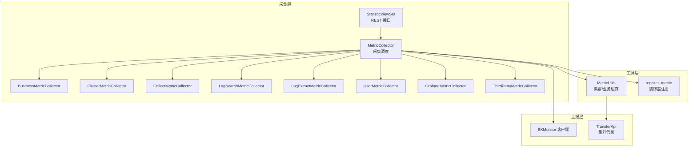
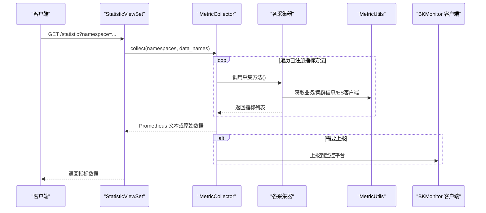
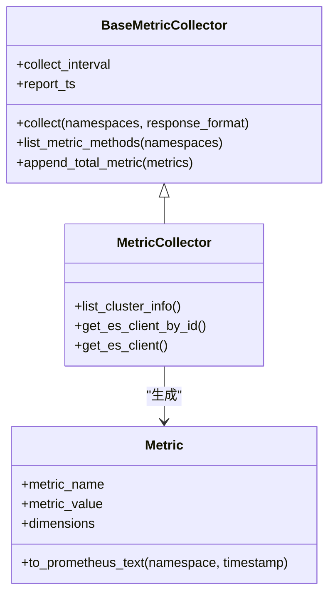
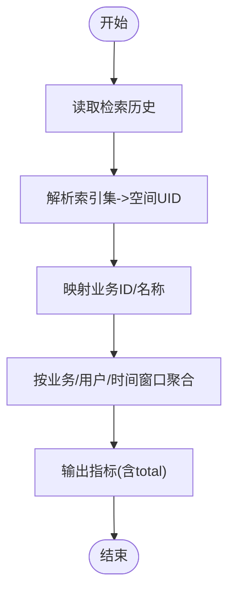
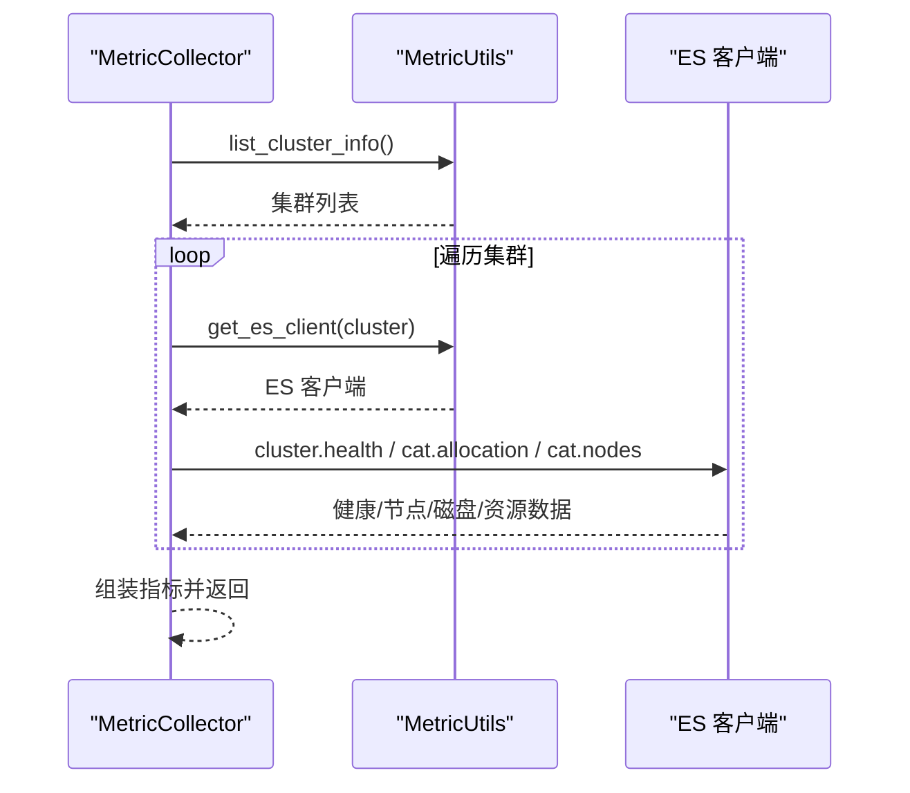
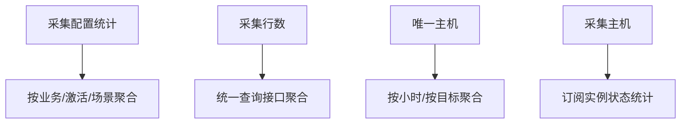
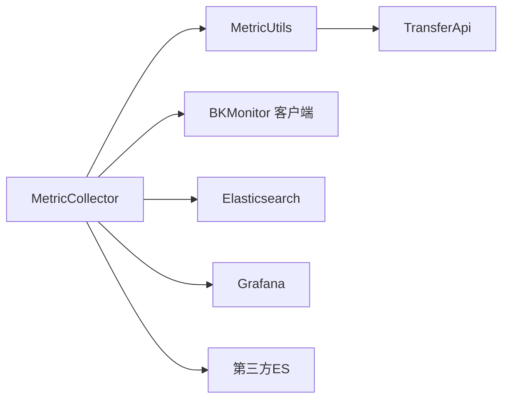

# 监控指标体系

<cite>
**本文引用的文件**
- [apps/log_measure/handlers/metrics.py](file://apps/log_measure/handlers/metrics.py)
- [apps/log_measure/constants.py](file://apps/log_measure/constants.py)
- [apps/log_measure/utils/metric.py](file://apps/log_measure/utils/metric.py)
- [apps/log_measure/views.py](file://apps/log_measure/views.py)
- [apps/log_measure/handlers/metric_collectors/business.py](file://apps/log_measure/handlers/metric_collectors/business.py)
- [apps/log_measure/handlers/metric_collectors/cluster.py](file://apps/log_measure/handlers/metric_collectors/cluster.py)
- [apps/log_measure/handlers/metric_collectors/log_databus.py](file://apps/log_measure/handlers/metric_collectors/log_databus.py)
- [apps/log_measure/handlers/metric_collectors/log_search.py](file://apps/log_measure/handlers/metric_collectors/log_search.py)
- [apps/log_measure/handlers/metric_collectors/log_extract.py](file://apps/log_measure/handlers/metric_collectors/log_extract.py)
- [apps/log_measure/handlers/metric_collectors/user.py](file://apps/log_measure/handlers/metric_collectors/user.py)
- [apps/log_measure/handlers/metric_collectors/grafana.py](file://apps/log_measure/handlers/metric_collectors/grafana.py)
- [apps/log_measure/handlers/metric_collectors/third_party.py](file://apps/log_measure/handlers/metric_collectors/third_party.py)
- [apps/log_esquery/metrics.py](file://apps/log_esquery/metrics.py)
- [apps/ai_assistant/metrics.py](file://apps/ai_assistant/metrics.py)
- [apps/log_search/metrics.py](file://apps/log_search/metrics.py)
- [apps/api/modules/transfer.py](file://apps/api/modules/transfer.py)
</cite>

## 目录
1. [简介](#简介)
2. [项目结构](#项目结构)
3. [核心组件](#核心组件)
4. [架构总览](#架构总览)
5. [详细组件分析](#详细组件分析)
6. [依赖分析](#依赖分析)
7. [性能考虑](#性能考虑)
8. [故障排查指南](#故障排查指南)
9. [结论](#结论)
10. [附录](#附录)

## 简介
本文件面向“监控指标体系”的架构与实现，基于仓库中的指标采集、上报与展示能力，系统化梳理指标分类与定义标准（业务指标、系统指标、技术指标），详述指标采集与上报机制（指标格式、上报频率、数据压缩）、存储与查询优化策略（时间序列存储、索引设计、查询性能），并给出告警规则配置与管理建议、扩展机制（自定义指标开发、指标聚合与维度扩展）及运维管理指南。

## 项目结构
监控指标体系主要由以下模块构成：
- 指标采集与上报：通过统一的采集器框架，按命名空间组织各类指标采集逻辑，支持 Prometheus 文本格式输出与自定义数据源上报。
- 指标数据源：涵盖业务侧（日志检索、导出、索引集等）、系统侧（Elasticsearch 集群健康与节点、Grafana 仪表盘）、第三方（第三方 ES 集群）等。
- 指标存储与查询：通过蓝鲸监控统一上报接口与自定义查询接口，结合时间序列与事件型数据源进行存储与查询。
- 指标展示与告警：依托 Grafana 与蓝鲸监控平台进行可视化与告警。

**图表来源**
- [apps/log_measure/views.py:31-48](file://apps/log_measure/views.py#L31-L48)
- [apps/log_measure/handlers/metrics.py:200-298](file://apps/log_measure/handlers/metrics.py#L200-L298)
- [apps/log_measure/utils/metric.py:33-151](file://apps/log_measure/utils/metric.py#L33-L151)
- [apps/log_measure/constants.py:30-76](file://apps/log_measure/constants.py#L30-L76)

**章节来源**
- [apps/log_measure/views.py:31-48](file://apps/log_measure/views.py#L31-L48)
- [apps/log_measure/handlers/metrics.py:95-198](file://apps/log_measure/handlers/metrics.py#L95-L198)
- [apps/log_measure/constants.py:50-76](file://apps/log_measure/constants.py#L50-L76)

## 核心组件
- 指标模型与格式
  - 指标对象包含指标名、数值、维度字典与时间戳；支持转换为 Prometheus 文本格式，便于直接暴露给 Prometheus 抓取。
- 采集器基类与注册机制
  - 通过装饰器注册指标采集方法，自动收集、缓存与格式化输出；支持按命名空间筛选与批量采集。
- 工具类
  - 提供业务与集群信息缓存、ES 客户端获取、时间范围计算与上报时间对齐等通用能力。
- 视图接口
  - 提供 REST 接口用于触发采集与返回指标数据，支持按命名空间与数据源过滤。

**章节来源**
- [apps/log_measure/handlers/metrics.py:40-68](file://apps/log_measure/handlers/metrics.py#L40-L68)
- [apps/log_measure/handlers/metrics.py:71-92](file://apps/log_measure/handlers/metrics.py#L71-L92)
- [apps/log_measure/handlers/metrics.py:95-198](file://apps/log_measure/handlers/metrics.py#L95-L198)
- [apps/log_measure/utils/metric.py:33-151](file://apps/log_measure/utils/metric.py#L33-L151)
- [apps/log_measure/views.py:31-48](file://apps/log_measure/views.py#L31-L48)

## 架构总览
指标体系采用“采集器分层 + 统一上报”的架构：
- 采集器分层：按功能域拆分采集器（业务、系统、第三方等），每个采集器内部通过装饰器注册多个指标采集方法。
- 统一调度：采集器基类负责遍历已注册方法、调用采集、格式化输出。
- 上报与存储：采集结果可直接以 Prometheus 文本格式返回，也可通过蓝鲸监控客户端上报到监控平台；同时支持自定义查询接口获取指标数据。

**图表来源**
- [apps/log_measure/views.py:31-48](file://apps/log_measure/views.py#L31-L48)
- [apps/log_measure/handlers/metrics.py:121-156](file://apps/log_measure/handlers/metrics.py#L121-L156)
- [apps/log_measure/utils/metric.py:90-123](file://apps/log_measure/utils/metric.py#L90-L123)

## 详细组件分析

### 指标采集器基类与注册机制
- 装饰器注册：通过装饰器为采集方法打上命名空间、描述与是否缓存标记，便于统一调度与过滤。
- 采集流程：遍历已注册方法，逐个执行并记录耗时；支持 Prometheus 文本格式转换。
- 缓存策略：装饰器支持按命名空间缓存，避免重复计算。

**图表来源**
- [apps/log_measure/handlers/metrics.py:40-68](file://apps/log_measure/handlers/metrics.py#L40-L68)
- [apps/log_measure/handlers/metrics.py:95-198](file://apps/log_measure/handlers/metrics.py#L95-L198)
- [apps/log_measure/handlers/metrics.py:200-298](file://apps/log_measure/handlers/metrics.py#L200-L298)

**章节来源**
- [apps/log_measure/handlers/metrics.py:71-92](file://apps/log_measure/handlers/metrics.py#L71-L92)
- [apps/log_measure/handlers/metrics.py:121-156](file://apps/log_measure/handlers/metrics.py#L121-L156)

### 业务指标采集器
- 活跃业务/业务总数：基于检索历史与索引集空间映射统计。
- 日志检索/收藏/导出：按时间窗口聚合用户行为与任务数量。
- 索引集状态：按场景、激活状态、是否有数据等多维聚合。

**图表来源**
- [apps/log_measure/handlers/metric_collectors/business.py:53-134](file://apps/log_measure/handlers/metric_collectors/business.py#L53-L134)
- [apps/log_measure/handlers/metric_collectors/log_search.py:46-117](file://apps/log_measure/handlers/metric_collectors/log_search.py#L46-L117)
- [apps/log_measure/handlers/metric_collectors/log_extract.py:37-124](file://apps/log_measure/handlers/metric_collectors/log_extract.py#L37-L124)
- [apps/log_measure/handlers/metric_collectors/log_search.py:221-293](file://apps/log_measure/handlers/metric_collectors/log_search.py#L221-L293)

**章节来源**
- [apps/log_measure/handlers/metric_collectors/business.py:53-134](file://apps/log_measure/handlers/metric_collectors/business.py#L53-L134)
- [apps/log_measure/handlers/metric_collectors/log_search.py:46-117](file://apps/log_measure/handlers/metric_collectors/log_search.py#L46-L117)
- [apps/log_measure/handlers/metric_collectors/log_extract.py:37-124](file://apps/log_measure/handlers/metric_collectors/log_extract.py#L37-L124)
- [apps/log_measure/handlers/metric_collectors/log_search.py:221-293](file://apps/log_measure/handlers/metric_collectors/log_search.py#L221-L293)

### 系统指标采集器（Elasticsearch）
- 集群健康度：节点、分片、状态等关键指标。
- 集群节点：磁盘使用率、CPU/负载、内存等资源指标。
- 采集频率：按分钟级与周期性策略控制。

**图表来源**
- [apps/log_measure/handlers/metric_collectors/cluster.py:33-195](file://apps/log_measure/handlers/metric_collectors/cluster.py#L33-L195)
- [apps/log_measure/utils/metric.py:90-123](file://apps/log_measure/utils/metric.py#L90-L123)

**章节来源**
- [apps/log_measure/handlers/metric_collectors/cluster.py:33-195](file://apps/log_measure/handlers/metric_collectors/cluster.py#L33-L195)
- [apps/log_measure/utils/metric.py:90-123](file://apps/log_measure/utils/metric.py#L90-L123)

### 数据总线与采集主机指标
- 采集配置与自定义采集配置：按业务、场景、类型聚合统计。
- 采集行数与唯一主机：通过统一查询接口聚合任务数据与目标主机状态。
- 采集主机：基于订阅实例状态统计。

**图表来源**
- [apps/log_measure/handlers/metric_collectors/log_databus.py:55-125](file://apps/log_measure/handlers/metric_collectors/log_databus.py#L55-L125)
- [apps/log_measure/handlers/metric_collectors/log_databus.py:143-167](file://apps/log_measure/handlers/metric_collectors/log_databus.py#L143-L167)
- [apps/log_measure/handlers/metric_collectors/log_databus.py:224-257](file://apps/log_measure/handlers/metric_collectors/log_databus.py#L224-L257)
- [apps/log_measure/handlers/metrics.py:261-297](file://apps/log_measure/handlers/metrics.py#L261-L297)

**章节来源**
- [apps/log_measure/handlers/metric_collectors/log_databus.py:55-125](file://apps/log_measure/handlers/metric_collectors/log_databus.py#L55-L125)
- [apps/log_measure/handlers/metric_collectors/log_databus.py:143-167](file://apps/log_measure/handlers/metric_collectors/log_databus.py#L143-L167)
- [apps/log_measure/handlers/metric_collectors/log_databus.py:224-257](file://apps/log_measure/handlers/metric_collectors/log_databus.py#L224-L257)
- [apps/log_measure/handlers/metrics.py:261-297](file://apps/log_measure/handlers/metrics.py#L261-L297)

### 用户与访问指标
- 活跃用户：登录时间与检索行为交集。
- UV 访问：按时间窗口统计独立访客与累计次数。
- 检索历史：按索引集、用户、类型等维度输出时延等指标。

**章节来源**
- [apps/log_measure/handlers/metric_collectors/user.py:39-172](file://apps/log_measure/handlers/metric_collectors/user.py#L39-L172)

### 第三方与可视化指标
- 第三方 ES：统计非默认系统的业务侧 ES 集群数量。
- Grafana：统计业务组织下的仪表盘与视图数量。

**章节来源**
- [apps/log_measure/handlers/metric_collectors/third_party.py:33-61](file://apps/log_measure/handlers/metric_collectors/third_party.py#L33-L61)
- [apps/log_measure/handlers/metric_collectors/grafana.py:33-112](file://apps/log_measure/handlers/metric_collectors/grafana.py#L33-L112)

### 指标格式与上报机制
- 指标格式：Prometheus 文本格式，包含指标名、维度标签与时间戳。
- 上报频率：不同指标采用不同的时间粒度（如分钟级、小时级），由装饰器标注。
- 数据压缩：采集器支持缓存与批量输出，减少重复计算与网络开销。

**章节来源**
- [apps/log_measure/handlers/metrics.py:50-68](file://apps/log_measure/handlers/metrics.py#L50-L68)
- [apps/log_measure/handlers/metrics.py:71-92](file://apps/log_measure/handlers/metrics.py#L71-L92)
- [apps/log_measure/handlers/metrics.py:121-156](file://apps/log_measure/handlers/metrics.py#L121-L156)

### 存储与查询优化策略
- 时间序列存储：指标以时间序列形式上报，支持按时间窗口聚合与下钻。
- 索引设计：按业务、场景、维度组合建立索引，提升查询效率。
- 查询性能：通过缓存、批量查询与分页处理降低数据库压力；对高并发场景采用异步与限流策略。

**章节来源**
- [apps/log_measure/constants.py:67-76](file://apps/log_measure/constants.py#L67-L76)
- [apps/log_measure/utils/metric.py:70-79](file://apps/log_measure/utils/metric.py#L70-L79)

### 告警规则配置与管理
- 阈值设置：根据业务 SLA 与历史波动设定阈值，支持动态阈值与自适应阈值。
- 告警级别：按影响面与紧急程度划分级别，结合多级抑制策略避免风暴。
- 通知策略：支持邮件、短信、企业微信等多渠道通知，结合静默时段与白名单管理。

[本节为通用实践指导，无需特定文件引用]

### 扩展机制
- 自定义指标开发：通过装饰器注册新指标采集方法，按需添加维度与时间粒度。
- 指标聚合：在采集器中实现聚合逻辑，支持跨表/跨服务聚合。
- 维度扩展：在指标维度中增加新的标签键，确保查询与展示兼容。

**章节来源**
- [apps/log_measure/handlers/metrics.py:71-92](file://apps/log_measure/handlers/metrics.py#L71-L92)
- [apps/log_measure/handlers/metric_collectors/business.py:171-182](file://apps/log_measure/handlers/metric_collectors/business.py#L171-L182)

## 依赖分析
- 组件耦合
  - 采集器依赖工具类提供的业务与集群信息缓存、ES 客户端获取。
  - 上报依赖蓝鲸监控客户端与传输接口。
- 外部依赖
  - Elasticsearch 集群健康与节点信息。
  - Grafana 组织与仪表盘信息。
  - 第三方 ES 集群信息。

**图表来源**
- [apps/log_measure/handlers/metrics.py:200-298](file://apps/log_measure/handlers/metrics.py#L200-L298)
- [apps/log_measure/utils/metric.py:90-123](file://apps/log_measure/utils/metric.py#L90-L123)
- [apps/api/modules/transfer.py:470-492](file://apps/api/modules/transfer.py#L470-L492)

**章节来源**
- [apps/log_measure/handlers/metrics.py:200-298](file://apps/log_measure/handlers/metrics.py#L200-L298)
- [apps/log_measure/utils/metric.py:90-123](file://apps/log_measure/utils/metric.py#L90-L123)
- [apps/api/modules/transfer.py:470-492](file://apps/api/modules/transfer.py#L470-L492)

## 性能考虑
- 采集频率与粒度：根据指标重要性与系统负载选择合适的采集间隔，避免过度抓取。
- 缓存与去重：利用装饰器缓存与工具类缓存减少重复计算与网络请求。
- 批量与分页：对大数据量查询采用分批与分页策略，降低内存与连接压力。
- 异步与限流：对高并发场景采用异步采集与限流策略，保障系统稳定性。

[本节为通用性能建议，无需特定文件引用]

## 故障排查指南
- 指标为空
  - 检查采集器是否正确注册与缓存是否生效。
  - 核对业务与集群信息缓存是否正常。
- 上报失败
  - 检查蓝鲸监控客户端配置与网络连通性。
  - 关注传输接口异常与认证信息。
- 查询异常
  - 检查索引是否存在、权限是否足够、时间范围是否正确。
  - 对高延迟查询进行索引优化与查询重写。

**章节来源**
- [apps/log_measure/handlers/metrics.py:121-156](file://apps/log_measure/handlers/metrics.py#L121-L156)
- [apps/log_measure/utils/metric.py:90-123](file://apps/log_measure/utils/metric.py#L90-L123)

## 结论
该指标体系通过清晰的采集器分层、统一的注册与上报机制，实现了业务、系统与第三方指标的统一管理。结合 Prometheus 文本格式与蓝鲸监控平台，既满足了灵活的可视化需求，也为后续的告警与自动化运维提供了坚实基础。建议在实际落地中持续完善维度设计、优化查询路径与告警策略，并建立完善的扩展与治理机制。

## 附录

### 指标分类与定义标准
- 业务指标
  - 定义：反映业务使用情况与效果的指标，如活跃业务、检索次数、导出任务等。
  - 维度：业务 ID/名称、时间窗口、用户、索引集等。
- 系统指标
  - 定义：反映系统运行状态的指标，如集群健康度、节点资源、索引状态等。
  - 维度：集群 ID/名称、节点 IP/名称、业务 ID/名称等。
- 技术指标
  - 定义：反映技术栈与第三方集成的指标，如 Grafana 仪表盘、第三方 ES 集群等。
  - 维度：业务 ID/名称、仪表盘 ID/名称、集群类型等。

**章节来源**
- [apps/log_measure/handlers/metric_collectors/business.py:53-134](file://apps/log_measure/handlers/metric_collectors/business.py#L53-L134)
- [apps/log_measure/handlers/metric_collectors/cluster.py:33-195](file://apps/log_measure/handlers/metric_collectors/cluster.py#L33-L195)
- [apps/log_measure/handlers/metric_collectors/grafana.py:33-112](file://apps/log_measure/handlers/metric_collectors/grafana.py#L33-L112)
- [apps/log_measure/handlers/metric_collectors/third_party.py:33-61](file://apps/log_measure/handlers/metric_collectors/third_party.py#L33-L61)

### 指标采集与上报机制
- 指标格式：Prometheus 文本格式，包含指标名、维度标签与时间戳。
- 上报频率：分钟级与小时级混合，具体由装饰器标注的时间粒度决定。
- 数据压缩：通过缓存与批量输出减少重复计算与网络开销。

**章节来源**
- [apps/log_measure/handlers/metrics.py:50-68](file://apps/log_measure/handlers/metrics.py#L50-L68)
- [apps/log_measure/handlers/metrics.py:71-92](file://apps/log_measure/handlers/metrics.py#L71-L92)
- [apps/log_measure/handlers/metrics.py:121-156](file://apps/log_measure/handlers/metrics.py#L121-L156)

### 存储与查询优化策略
- 时间序列存储：按时间窗口与维度组合进行存储，支持高效聚合与下钻。
- 索引设计：围绕业务 ID/名称、场景、激活状态等关键维度建立索引。
- 查询性能：采用缓存、批量与分页策略，必要时引入异步与限流。

**章节来源**
- [apps/log_measure/constants.py:67-76](file://apps/log_measure/constants.py#L67-L76)
- [apps/log_measure/utils/metric.py:70-79](file://apps/log_measure/utils/metric.py#L70-L79)

### 告警规则配置与管理
- 阈值设置：结合业务 SLA 与历史波动设定阈值，支持动态调整。
- 告警级别：按影响面划分级别，结合多级抑制策略。
- 通知策略：多渠道通知与静默时段管理，避免告警风暴。

[本节为通用实践指导，无需特定文件引用]

### 指标扩展与运维管理
- 自定义指标开发：通过装饰器注册新指标采集方法，按需扩展维度与时间粒度。
- 指标聚合：在采集器中实现跨表/跨服务聚合，提升指标复用性。
- 维度扩展：在指标维度中增加新标签键，确保查询与展示兼容。
- 运维管理：建立指标生命周期管理、版本演进与回滚机制，保障稳定性与可追溯性。

**章节来源**
- [apps/log_measure/handlers/metrics.py:71-92](file://apps/log_measure/handlers/metrics.py#L71-L92)
- [apps/log_measure/handlers/metric_collectors/business.py:171-182](file://apps/log_measure/handlers/metric_collectors/business.py#L171-L182)