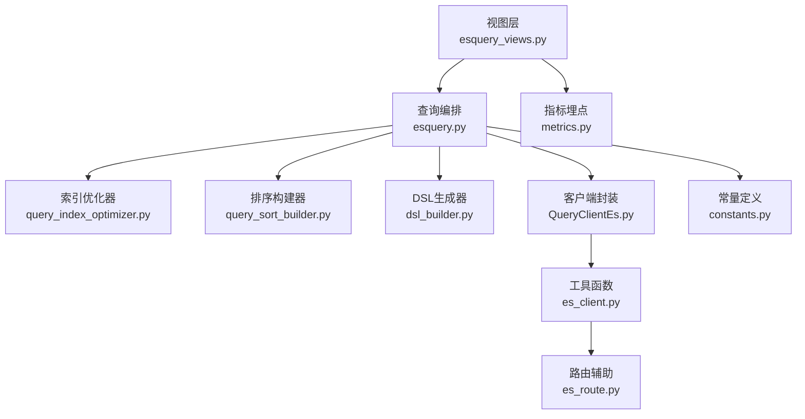
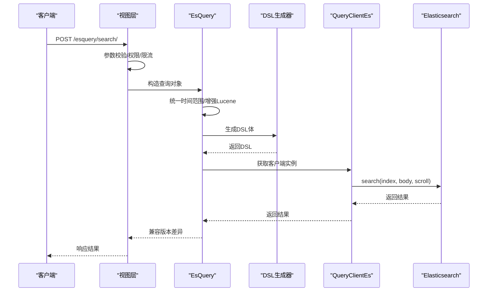
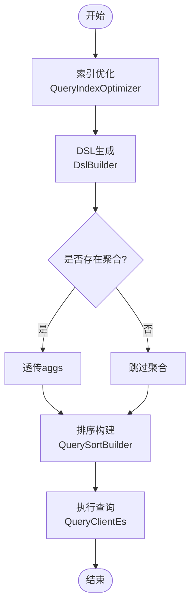
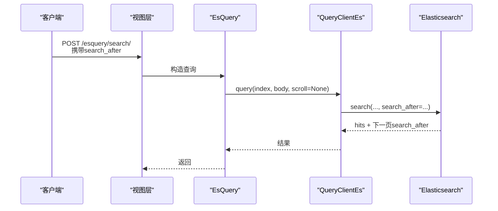
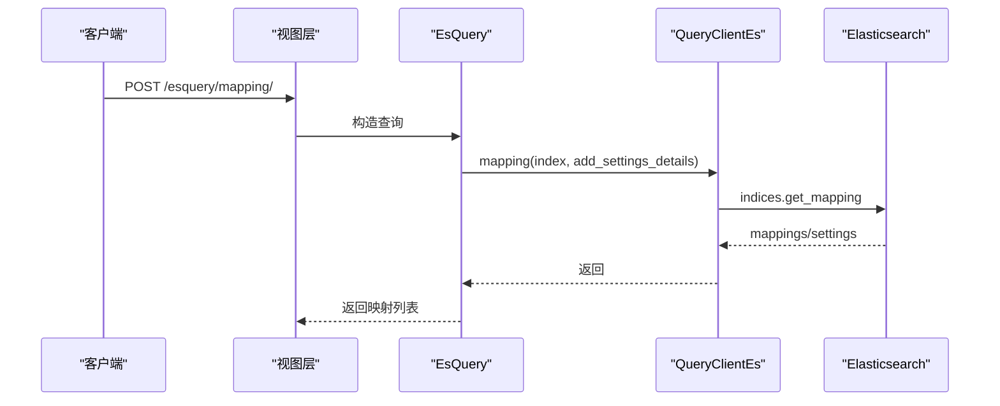
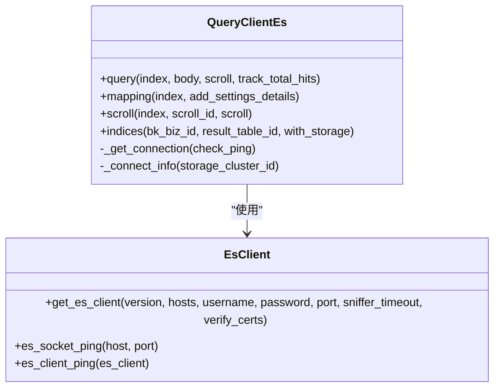
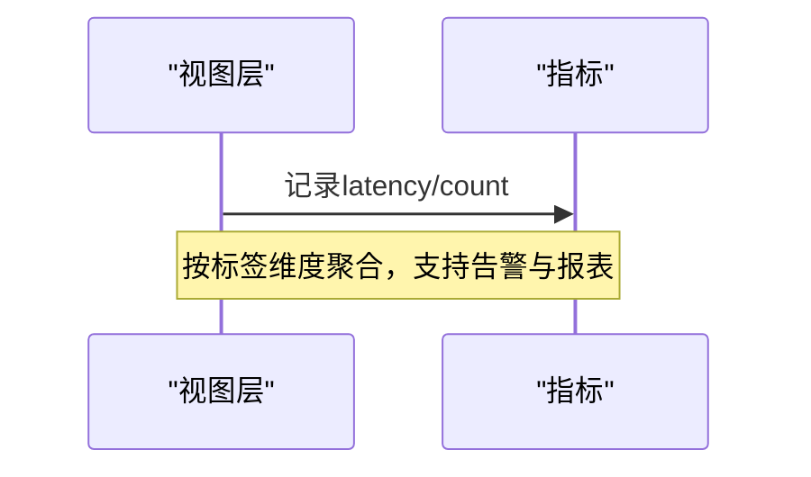
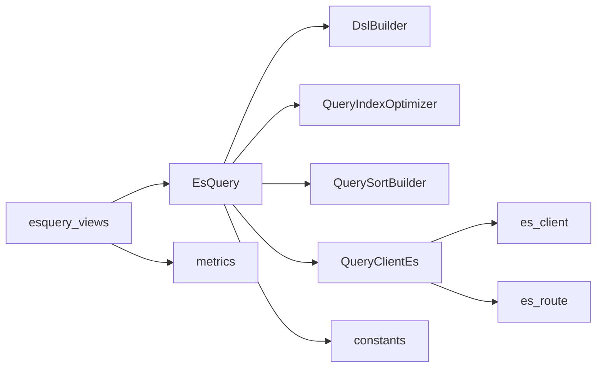

# Elasticsearch集成

<cite>
**本文引用的文件**
- [apps/log_esquery/esquery/esquery.py](file://apps/log_esquery/esquery/esquery.py)
- [apps/log_esquery/esquery/client/QueryClientEs.py](file://apps/log_esquery/esquery/client/QueryClientEs.py)
- [apps/log_esquery/utils/es_client.py](file://apps/log_esquery/utils/es_client.py)
- [apps/log_esquery/utils/es_route.py](file://apps/log_esquery/utils/es_route.py)
- [apps/log_esquery/esquery/dsl_builder/dsl_builder.py](file://apps/log_esquery/esquery/dsl_builder/dsl_builder.py)
- [apps/log_esquery/esquery/builder/query_index_optimizer.py](file://apps/log_esquery/esquery/builder/query_index_optimizer.py)
- [apps/log_esquery/esquery/builder/query_sort_builder.py](file://apps/log_esquery/esquery/builder/query_sort_builder.py)
- [apps/log_esquery/views/esquery_views.py](file://apps/log_esquery/views/esquery_views.py)
- [apps/log_esquery/constants.py](file://apps/log_esquery/constants.py)
- [apps/log_esquery/metrics.py](file://apps/log_esquery/metrics.py)
</cite>

## 目录
1. [简介](#简介)
2. [项目结构](#项目结构)
3. [核心组件](#核心组件)
4. [架构总览](#架构总览)
5. [详细组件分析](#详细组件分析)
6. [依赖分析](#依赖分析)
7. [性能考量](#性能考量)
8. [故障排查指南](#故障排查指南)
9. [结论](#结论)
10. [附录](#附录)

## 简介
本技术文档面向Elasticsearch集成模块，系统性阐述查询优化策略（索引选择、查询条件优化、聚合计算）、数据分页机制（scroll、search_after、point-in-time）、监控数据存储结构与索引映射设计、连接池与负载均衡策略、查询性能监控与慢查询分析方法，以及高可用配置与故障转移机制。文档同时提供查询示例与性能调优建议，帮助开发者在实际工程中高效、稳定地使用Elasticsearch。

## 项目结构
Elasticsearch集成模块位于 apps/log_esquery 目录下，围绕查询入口类 EsQuery 构建，通过 DSL 生成器、索引优化器、排序构建器等子模块完成查询体构造，并通过 QueryClientEs 客户端与ES集群交互。视图层提供统一的REST接口，封装认证、权限与指标埋点。

**图表来源**
- [apps/log_esquery/views/esquery_views.py:86-253](file://apps/log_esquery/views/esquery_views.py#L86-L253)
- [apps/log_esquery/esquery/esquery.py:149-224](file://apps/log_esquery/esquery/esquery.py#L149-L224)
- [apps/log_esquery/esquery/builder/query_index_optimizer.py:33-74](file://apps/log_esquery/esquery/builder/query_index_optimizer.py#L33-L74)
- [apps/log_esquery/esquery/builder/query_sort_builder.py:26-44](file://apps/log_esquery/esquery/builder/query_sort_builder.py#L26-L44)
- [apps/log_esquery/esquery/dsl_builder/dsl_builder.py:34-152](file://apps/log_esquery/esquery/dsl_builder/dsl_builder.py#L34-L152)
- [apps/log_esquery/esquery/client/QueryClientEs.py:48-127](file://apps/log_esquery/esquery/client/QueryClientEs.py#L48-L127)
- [apps/log_esquery/utils/es_client.py:40-122](file://apps/log_esquery/utils/es_client.py#L40-L122)
- [apps/log_esquery/utils/es_route.py:28-98](file://apps/log_esquery/utils/es_route.py#L28-L98)
- [apps/log_esquery/metrics.py:7-21](file://apps/log_esquery/metrics.py#L7-L21)
- [apps/log_esquery/constants.py:22-32](file://apps/log_esquery/constants.py#L22-L32)

**章节来源**
- [apps/log_esquery/views/esquery_views.py:86-253](file://apps/log_esquery/views/esquery_views.py#L86-L253)
- [apps/log_esquery/esquery/esquery.py:149-224](file://apps/log_esquery/esquery/esquery.py#L149-L224)

## 核心组件
- 查询编排器 EsQuery：负责参数增强、时间范围统一、索引优化、DSL组装、调用客户端并兼容不同版本ES的返回结构。
- DSL生成器 DslBuilder：基于 elasticsearch-dsl 构建查询体，支持高亮、聚合、collapse、search_after、slice分片等。
- 索引优化器 QueryIndexOptimizer：根据场景与时间范围动态裁剪索引集合，减少扫描面。
- 排序构建器 QuerySortBuilder：标准化排序字段与方向。
- 客户端封装 QueryClientEs：建立连接、执行查询、scroll、mapping、集群信息等操作，内置连接缓存与健康检查。
- 工具函数 es_client：ES客户端工厂、socket连通性探测、ping校验。
- 视图层 esquery_views：统一REST接口，权限校验、限流、指标埋点。
- 指标与常量：Prometheus指标、默认schema、常量阈值等。

**章节来源**
- [apps/log_esquery/esquery/esquery.py:51-224](file://apps/log_esquery/esquery/esquery.py#L51-L224)
- [apps/log_esquery/esquery/dsl_builder/dsl_builder.py:34-152](file://apps/log_esquery/esquery/dsl_builder/dsl_builder.py#L34-L152)
- [apps/log_esquery/esquery/builder/query_index_optimizer.py:33-74](file://apps/log_esquery/esquery/builder/query_index_optimizer.py#L33-L74)
- [apps/log_esquery/esquery/builder/query_sort_builder.py:26-44](file://apps/log_esquery/esquery/builder/query_sort_builder.py#L26-L44)
- [apps/log_esquery/esquery/client/QueryClientEs.py:48-127](file://apps/log_esquery/esquery/client/QueryClientEs.py#L48-L127)
- [apps/log_esquery/utils/es_client.py:40-122](file://apps/log_esquery/utils/es_client.py#L40-L122)
- [apps/log_esquery/views/esquery_views.py:86-253](file://apps/log_esquery/views/esquery_views.py#L86-L253)
- [apps/log_esquery/metrics.py:7-21](file://apps/log_esquery/metrics.py#L7-L21)
- [apps/log_esquery/constants.py:22-32](file://apps/log_esquery/constants.py#L22-L32)

## 架构总览
Elasticsearch集成采用“视图层-查询编排-DSL生成-客户端封装”的分层架构。查询请求经视图层参数校验与权限校验后，进入 EsQuery 编排器，通过索引优化与DSL生成器构造查询体，最终由 QueryClientEs 客户端发起请求。客户端内部通过缓存连接信息与ES客户端实例，降低重复初始化成本。

**图表来源**
- [apps/log_esquery/views/esquery_views.py:86-253](file://apps/log_esquery/views/esquery_views.py#L86-L253)
- [apps/log_esquery/esquery/esquery.py:149-224](file://apps/log_esquery/esquery/esquery.py#L149-L224)
- [apps/log_esquery/esquery/dsl_builder/dsl_builder.py:93-152](file://apps/log_esquery/esquery/dsl_builder/dsl_builder.py#L93-L152)
- [apps/log_esquery/esquery/client/QueryClientEs.py:55-67](file://apps/log_esquery/esquery/client/QueryClientEs.py#L55-L67)

## 详细组件分析

### 查询优化策略
- 索引选择
  - 使用 QueryIndexOptimizer 根据场景与时间范围裁剪索引集合，避免全量扫描。
  - 对于 LOG 场景，将点号替换为下划线以适配命名规范。
  - 对于 BKDATA/ES 场景，保留原样或追加通配符，确保索引集匹配。
- 查询条件优化
  - QueryStringBuilder 对 query_string 进行增强与归一化，便于后续一致性处理。
  - QueryFilterBuilder 将过滤条件转为标准结构，供DSL生成器拼装。
- 聚合计算
  - DslBuilder 直接透传 aggs 字段，支持 terms/date_histogram/top_hits 等常见聚合。
  - 支持 collapse 去重，提升结果可读性。

**图表来源**
- [apps/log_esquery/esquery/builder/query_index_optimizer.py:33-74](file://apps/log_esquery/esquery/builder/query_index_optimizer.py#L33-L74)
- [apps/log_esquery/esquery/dsl_builder/dsl_builder.py:113-118](file://apps/log_esquery/esquery/dsl_builder/dsl_builder.py#L113-L118)
- [apps/log_esquery/esquery/builder/query_sort_builder.py:26-44](file://apps/log_esquery/esquery/builder/query_sort_builder.py#L26-L44)
- [apps/log_esquery/esquery/client/QueryClientEs.py:55-67](file://apps/log_esquery/esquery/client/QueryClientEs.py#L55-L67)

**章节来源**
- [apps/log_esquery/esquery/esquery.py:99-121](file://apps/log_esquery/esquery/esquery.py#L99-L121)
- [apps/log_esquery/esquery/builder/query_index_optimizer.py:33-74](file://apps/log_esquery/esquery/builder/query_index_optimizer.py#L33-L74)
- [apps/log_esquery/esquery/dsl_builder/dsl_builder.py:113-118](file://apps/log_esquery/esquery/dsl_builder/dsl_builder.py#L113-L118)

### 数据分页机制
- scroll API
  - 视图层提供 /esquery/scroll/ 接口，支持传入 scroll_id 与 scroll 参数，调用 QueryClientEs.scroll 获取下一批数据。
  - 适用于超大数据量导出场景，注意 scroll 生命周期与资源释放。
- search_after
  - DslBuilder 支持 search_after 参数，自动替换 from/size，避免深度分页的性能问题。
  - 适合稳定排序下的连续翻页，推荐与 track_total_hits 配合使用。
- point in time（PIT）
  - 代码未直接实现PIT功能。若需强一致快照读取，可在上层业务中结合PIT API进行扩展，先创建PIT再基于PIT执行多次search_after翻页，保证数据快照期间的一致性。

**图表来源**
- [apps/log_esquery/views/esquery_views.py:86-253](file://apps/log_esquery/views/esquery_views.py#L86-L253)
- [apps/log_esquery/esquery/dsl_builder/dsl_builder.py:128-132](file://apps/log_esquery/esquery/dsl_builder/dsl_builder.py#L128-L132)
- [apps/log_esquery/esquery/client/QueryClientEs.py:55-67](file://apps/log_esquery/esquery/client/QueryClientEs.py#L55-L67)

**章节来源**
- [apps/log_esquery/views/esquery_views.py:465-547](file://apps/log_esquery/views/esquery_views.py#L465-L547)
- [apps/log_esquery/esquery/dsl_builder/dsl_builder.py:128-132](file://apps/log_esquery/esquery/dsl_builder/dsl_builder.py#L128-L132)

### 监控数据存储结构与索引映射设计
- 映射查询
  - 提供 /esquery/mapping/ 接口，支持按索引集查询映射，可选附加索引设置详情（分词器等）。
  - EsQuery.mapping 会根据时间范围优化索引集后再查询映射。
- 存储结构建议
  - 时间序列日志：建议按日期分索引（如 logstash 风格），便于 QueryIndexOptimizer 快速裁剪。
  - 字段类型：文本字段使用 keyword+text 的双映射策略，聚合与精确匹配兼顾。
  - 动态模板：使用 dynamic_templates 将字符串统一映射为 keyword，降低映射爆炸风险。

**图表来源**
- [apps/log_esquery/views/esquery_views.py:335-463](file://apps/log_esquery/views/esquery_views.py#L335-L463)
- [apps/log_esquery/esquery/esquery.py:282-305](file://apps/log_esquery/esquery/esquery.py#L282-L305)
- [apps/log_esquery/esquery/client/QueryClientEs.py:69-86](file://apps/log_esquery/esquery/client/QueryClientEs.py#L69-L86)

**章节来源**
- [apps/log_esquery/views/esquery_views.py:335-463](file://apps/log_esquery/views/esquery_views.py#L335-L463)
- [apps/log_esquery/esquery/esquery.py:282-305](file://apps/log_esquery/esquery/esquery.py#L282-L305)

### 连接池管理与负载均衡策略
- 连接建立
  - QueryClientEs._get_connection 通过缓存的连接信息（域名、端口、用户名、密码、版本、schema）创建 ES 客户端。
  - es_client.get_es_client 根据版本选择对应客户端类，并对IPv6地址进行方括号处理。
- 连接缓存
  - _connect_info 使用缓存装饰器，避免频繁调用元数据接口。
- 负载均衡
  - 当前实现未显式配置多个主机的负载均衡策略。建议在上游网关或代理层实现轮询/权重策略，或在ES侧通过集群路由与副本分布实现天然均衡。
- 健康检查
  - es_client.es_socket_ping 与 es_client_ping 提供socket与HTTP HEAD两种连通性探测，保障连接可用性。

**图表来源**
- [apps/log_esquery/esquery/client/QueryClientEs.py:48-127](file://apps/log_esquery/esquery/client/QueryClientEs.py#L48-L127)
- [apps/log_esquery/utils/es_client.py:40-122](file://apps/log_esquery/utils/es_client.py#L40-L122)

**章节来源**
- [apps/log_esquery/esquery/client/QueryClientEs.py:128-186](file://apps/log_esquery/esquery/client/QueryClientEs.py#L128-L186)
- [apps/log_esquery/utils/es_client.py:40-122](file://apps/log_esquery/utils/es_client.py#L40-L122)

### 查询性能监控与慢查询分析
- 指标埋点
  - Prometheus直方图 esquery_search_latency 与计数器 esquery_search_count，按 index_set_id、indices、scenario_id、storage_cluster_id、status、source_app_code 等维度打点。
  - 视图层在请求结束后记录耗时与次数，便于观测与告警。
- 慢查询分析
  - 建议结合 ES 内置慢查询日志（slowlog）与 APM 工具定位热点查询。
  - 优化要点：减少 wildcard、优先使用精确字段过滤、合理使用索引别名与时间字段、避免深度分页。

**图表来源**
- [apps/log_esquery/views/esquery_views.py:224-253](file://apps/log_esquery/views/esquery_views.py#L224-L253)
- [apps/log_esquery/metrics.py:7-21](file://apps/log_esquery/metrics.py#L7-L21)

**章节来源**
- [apps/log_esquery/views/esquery_views.py:224-253](file://apps/log_esquery/views/esquery_views.py#L224-L253)
- [apps/log_esquery/metrics.py:7-21](file://apps/log_esquery/metrics.py#L7-L21)

### 高可用配置与故障转移
- 集群信息与路由
  - QueryClientEs.get_cluster_info 从元数据接口获取集群配置，用于索引列表与统计信息展示。
  - EsRoute 提供 _cat/_cluster/_nodes 等路由能力，便于跨场景查询。
- 故障转移
  - 客户端层未显式实现多节点重试与故障切换。建议在网关层启用健康检查与重试策略，或在ES侧通过主从/副本机制实现自动恢复。
- 配置要点
  - 设置合理的 sniffer_timeout 与 request_timeout，避免长连接阻塞。
  - 在上游接入负载均衡器，实现多ES节点的轮询与故障剔除。

**章节来源**
- [apps/log_esquery/esquery/client/QueryClientEs.py:216-228](file://apps/log_esquery/esquery/client/QueryClientEs.py#L216-L228)
- [apps/log_esquery/utils/es_route.py:28-98](file://apps/log_esquery/utils/es_route.py#L28-L98)
- [apps/log_esquery/constants.py:22-32](file://apps/log_esquery/constants.py#L22-L32)

## 依赖分析
- 组件耦合
  - EsQuery 依赖多个构建器与客户端，职责清晰，耦合度适中。
  - DslBuilder 依赖 elasticsearch-dsl，保持查询体生成的灵活性。
- 外部依赖
  - ES 客户端版本：支持 5.x/6.x/7.x 及以上，通过版本前缀选择具体类。
  - Django/DRF：视图层与权限、限流、序列化。
  - Prometheus：指标采集与暴露。

**图表来源**
- [apps/log_esquery/esquery/esquery.py:27-48](file://apps/log_esquery/esquery/esquery.py#L27-L48)
- [apps/log_esquery/esquery/client/QueryClientEs.py:30-45](file://apps/log_esquery/esquery/client/QueryClientEs.py#L30-L45)
- [apps/log_esquery/views/esquery_views.py:30-49](file://apps/log_esquery/views/esquery_views.py#L30-L49)
- [apps/log_esquery/metrics.py:2-5](file://apps/log_esquery/metrics.py#L2-L5)
- [apps/log_esquery/constants.py:22-32](file://apps/log_esquery/constants.py#L22-L32)

**章节来源**
- [apps/log_esquery/esquery/esquery.py:27-48](file://apps/log_esquery/esquery/esquery.py#L27-L48)
- [apps/log_esquery/esquery/client/QueryClientEs.py:30-45](file://apps/log_esquery/esquery/client/QueryClientEs.py#L30-L45)

## 性能考量
- 索引裁剪
  - 使用 QueryIndexOptimizer 仅扫描必要索引，显著降低查询开销。
- 查询体优化
  - 优先使用精确过滤条件，避免 wildcard 与通配符。
  - 合理设置 size 与 from，深度分页使用 search_after。
- 聚合与高亮
  - 聚合尽量限定 size，避免大基数字段直接聚合。
  - 高亮仅在必要时开启，避免对大字段进行全文高亮。
- 连接与超时
  - 合理设置 request_timeout 与 sniffer_timeout，避免长时间阻塞。
- 监控与告警
  - 基于 esquery_search_latency 与 esquery_search_count 设定阈值告警，及时发现异常。

[本节为通用指导，无需特定文件引用]

## 故障排查指南
- 连接失败
  - 检查 es_socket_ping 与 es_client_ping 抛出的异常类型，确认网络可达与认证信息正确。
- 查询异常
  - QueryClientEs.query 捕获异常并转换为 EsClientSearchException，结合日志定位具体错误。
- scroll 异常
  - scroll 接口捕获异常并转换为 EsClientScrollException，确认 scroll_id 与 scroll 参数。
- 权限与白名单
  - 视图层对非白名单应用进行权限校验，确保 index_set_id 与场景匹配。

**章节来源**
- [apps/log_esquery/utils/es_client.py:80-122](file://apps/log_esquery/utils/es_client.py#L80-L122)
- [apps/log_esquery/esquery/client/QueryClientEs.py:55-94](file://apps/log_esquery/esquery/client/QueryClientEs.py#L55-L94)
- [apps/log_esquery/views/esquery_views.py:62-84](file://apps/log_esquery/views/esquery_views.py#L62-L84)

## 结论
本模块通过清晰的分层设计与完善的查询优化策略，实现了对Elasticsearch的高效访问。索引裁剪、DSL生成、分页机制与指标监控共同构成稳定的查询体系。建议在生产环境中配合网关层的负载均衡与故障转移、ES慢查询日志与APM工具，持续优化查询性能与稳定性。

[本节为总结，无需特定文件引用]

## 附录
- 查询示例（路径参考）
  - 搜索接口：POST /esquery/search/，请求参数包含 indices、scenario_id、time_field、query_string、filter、sort_list、size、aggs、highlight 等。
  - DSL接口：POST /esquery/dsl/，请求参数包含 indices 与 body。
  - 映射接口：POST /esquery/mapping/，请求参数包含 indices 与可选的时间范围。
  - Scroll接口：POST /esquery/scroll/，请求参数包含 indices、scenario_id、storage_cluster_id、scroll、scroll_id。
- 性能调优建议
  - 使用 search_after 替代深度分页。
  - 限制聚合字段基数，必要时使用采样或预聚合。
  - 合理设置索引生命周期（ILM），避免单索引过大。
  - 在网关层启用重试与熔断，提升整体可用性。

**章节来源**
- [apps/log_esquery/views/esquery_views.py:86-547](file://apps/log_esquery/views/esquery_views.py#L86-L547)