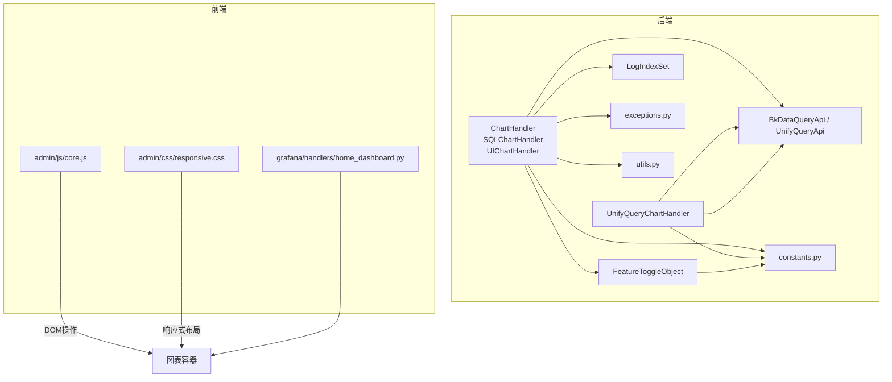
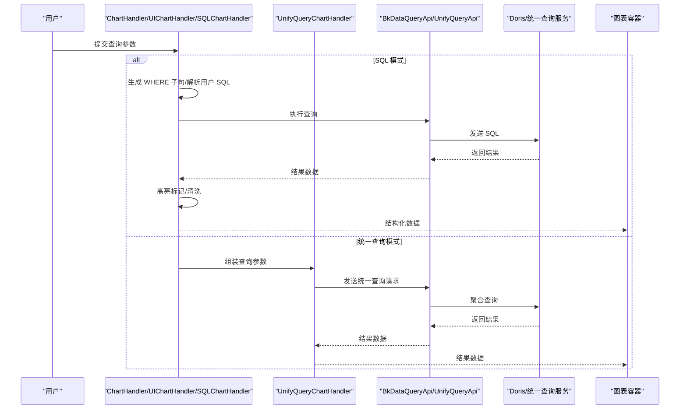
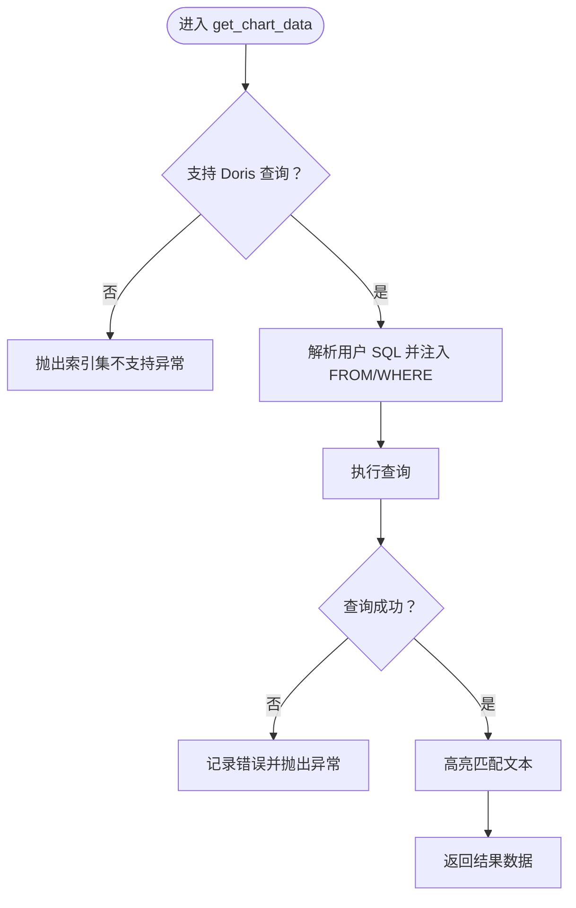
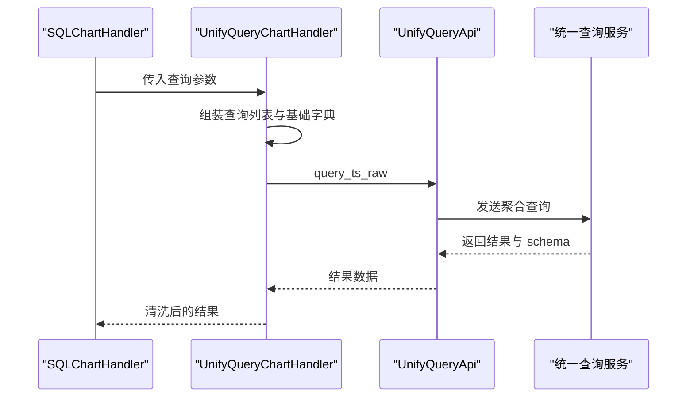
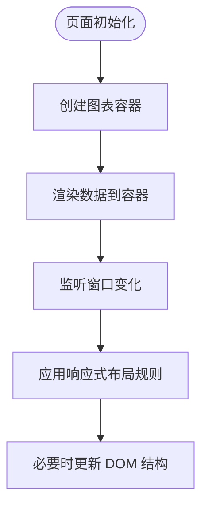
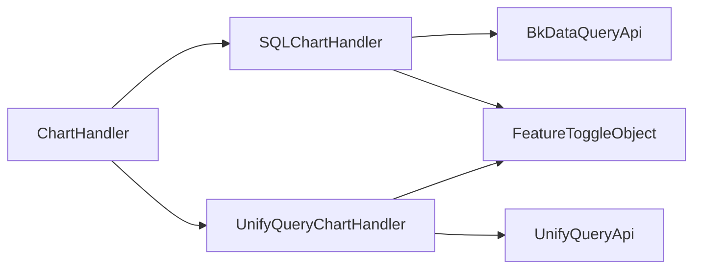

# 图表渲染引擎

<cite>
**本文引用的文件**
- [apps/log_search/handlers/search/chart_handlers.py](file://apps/log_search/handlers/search/chart_handlers.py)
- [apps/log_unifyquery/handler/chart.py](file://apps/log_unifyquery/handler/chart.py)
- [apps/tests/log_search/test_chart.py](file://apps/tests/log_search/test_chart.py)
- [apps/log_search/constants.py](file://apps/log_search/constants.py)
- [apps/api.py](file://apps/api.py)
- [apps/utils/local.py](file://apps/utils/local.py)
- [apps/utils/log.py](file://apps/utils/log.py)
- [apps/feature_toggle/handlers/toggle.py](file://apps/feature_toggle/handlers/toggle.py)
- [apps/feature_toggle/plugins/constants.py](file://apps/feature_toggle/plugins/constants.py)
- [apps/log_search/handlers/search/search_handlers_esquery.py](file://apps/log_search/handlers/search/search_handlers_esquery.py)
- [apps/log_search/models.py](file://apps/log_search/models.py)
- [apps/log_search/exceptions.py](file://apps/log_search/exceptions.py)
- [apps/log_search/utils.py](file://apps/log_search/utils.py)
- [apps/log_unifyquery/handler/base.py](file://apps/log_unifyquery/handler/base.py)
- [apps/grafana/handlers/home_dashboard.py](file://apps/grafana/handlers/home_dashboard.py)
- [static/admin/js/core.js](file://static/admin/js/core.js)
- [static/admin/css/responsive.css](file://static/admin/css/responsive.css)
</cite>

## 目录
1. [简介](#简介)
2. [项目结构](#项目结构)
3. [核心组件](#核心组件)
4. [架构总览](#架构总览)
5. [详细组件分析](#详细组件分析)
6. [依赖分析](#依赖分析)
7. [性能考虑](#性能考虑)
8. [故障排查指南](#故障排查指南)
9. [结论](#结论)
10. [附录](#附录)

## 简介
本技术文档围绕“图表渲染引擎”的实现与使用展开，重点解释图表组件的架构设计、数据绑定机制、DOM 操作策略，以及图表类型在该系统中的落地方式。文档涵盖以下关键主题：
- 渲染器设计：基于 SQLChartHandler 与 UnifyQueryChartHandler 的双通道查询与渲染路径
- 数据绑定机制：从查询参数到 SQL 生成、执行、结果映射的完整链路
- DOM 操作策略：前端辅助工具与响应式布局对图表容器的适配
- 图表类型分类与实现：折线图、柱状图、饼图等在本系统中的通用渲染思路
- 配置系统：主题、样式与响应式布局的集成方式
- 生命周期管理：初始化、更新、销毁流程
- 性能优化：虚拟滚动、懒加载、内存管理与查询优化
- 最佳实践：错误处理、监控埋点、导出与异步任务

## 项目结构
图表渲染引擎主要由后端查询与聚合层、统一查询适配层、以及前端辅助工具三部分组成：
- 后端查询与聚合层：负责将用户输入的查询条件转换为 SQL，并执行查询，返回结构化结果
- 统一查询适配层：在特性开关开启时，将查询路由至统一查询服务，以获得跨索引集的聚合能力
- 前端辅助工具：提供基础 DOM 操作与响应式样式，保障图表容器在不同设备上的显示一致性

**图表来源**
- [apps/log_search/handlers/search/chart_handlers.py:72-104](file://apps/log_search/handlers/search/chart_handlers.py#L72-L104)
- [apps/log_unifyquery/handler/chart.py:23-71](file://apps/log_unifyquery/handler/chart.py#L23-L71)
- [apps/api.py](file://apps/api.py)
- [apps/feature_toggle/handlers/toggle.py](file://apps/feature_toggle/handlers/toggle.py)
- [apps/log_search/constants.py](file://apps/log_search/constants.py)
- [apps/log_search/models.py](file://apps/log_search/models.py)
- [apps/log_search/exceptions.py](file://apps/log_search/exceptions.py)
- [apps/log_search/utils.py](file://apps/log_search/utils.py)
- [static/admin/js/core.js:1-46](file://static/admin/js/core.js#L1-L46)
- [static/admin/css/responsive.css:462-513](file://static/admin/css/responsive.css#L462-L513)
- [apps/grafana/handlers/home_dashboard.py:27-57](file://apps/grafana/handlers/home_dashboard.py#L27-L57)

**章节来源**
- [apps/log_search/handlers/search/chart_handlers.py:72-104](file://apps/log_search/handlers/search/chart_handlers.py#L72-L104)
- [apps/log_unifyquery/handler/chart.py:23-71](file://apps/log_unifyquery/handler/chart.py#L23-L71)
- [apps/log_search/constants.py](file://apps/log_search/constants.py)
- [apps/log_search/models.py](file://apps/log_search/models.py)
- [apps/log_search/exceptions.py](file://apps/log_search/exceptions.py)
- [apps/log_search/utils.py](file://apps/log_search/utils.py)
- [apps/api.py](file://apps/api.py)
- [apps/feature_toggle/handlers/toggle.py](file://apps/feature_toggle/handlers/toggle.py)
- [apps/feature_toggle/plugins/constants.py](file://apps/feature_toggle/plugins/constants.py)
- [apps/grafana/handlers/home_dashboard.py:27-57](file://apps/grafana/handlers/home_dashboard.py#L27-L57)
- [static/admin/js/core.js:1-46](file://static/admin/js/core.js#L1-L46)
- [static/admin/css/responsive.css:462-513](file://static/admin/css/responsive.css#L462-L513)

## 核心组件
- ChartHandler：抽象基类，定义图表数据获取接口与通用 SQL 生成、Lucene 转 SQL、对象字段 JSON_EXTRACT 转换、排序条件生成等工具方法
- SQLChartHandler：基于 Doris 的 SQL 查询实现，支持解析用户 SQL、拼接 WHERE 条件、执行查询、高亮标记与导出
- UnifyQueryChartHandler：统一查询适配器，将查询参数转换为统一查询服务所需的结构，支持生成最终 SQL、流式导出、结果清洗
- UIChartHandler：预留 UI 模式实现入口（当前占位）
- 前端工具：core.js 提供快速 DOM 元素创建与清理；responsive.css 提供移动端与小屏适配

**章节来源**
- [apps/log_search/handlers/search/chart_handlers.py:72-104](file://apps/log_search/handlers/search/chart_handlers.py#L72-L104)
- [apps/log_search/handlers/search/chart_handlers.py:473-482](file://apps/log_search/handlers/search/chart_handlers.py#L473-L482)
- [apps/log_search/handlers/search/chart_handlers.py:484-736](file://apps/log_search/handlers/search/chart_handlers.py#L484-L736)
- [apps/log_unifyquery/handler/chart.py:23-120](file://apps/log_unifyquery/handler/chart.py#L23-L120)
- [static/admin/js/core.js:1-46](file://static/admin/js/core.js#L1-L46)
- [static/admin/css/responsive.css:462-513](file://static/admin/css/responsive.css#L462-L513)

## 架构总览
图表渲染引擎采用“查询生成—执行—结果映射—展示”的分层架构。查询生成阶段将用户输入转换为 SQL 或统一查询参数；执行阶段通过 API 客户端访问数据源；结果映射阶段进行高亮、字段清洗与统计；展示阶段由前端容器承载。

**图表来源**
- [apps/log_search/handlers/search/chart_handlers.py:484-736](file://apps/log_search/handlers/search/chart_handlers.py#L484-L736)
- [apps/log_unifyquery/handler/chart.py:54-71](file://apps/log_unifyquery/handler/chart.py#L54-L71)
- [apps/api.py](file://apps/api.py)

**章节来源**
- [apps/log_search/handlers/search/chart_handlers.py:484-736](file://apps/log_search/handlers/search/chart_handlers.py#L484-L736)
- [apps/log_unifyquery/handler/chart.py:54-71](file://apps/log_unifyquery/handler/chart.py#L54-L71)
- [apps/api.py](file://apps/api.py)

## 详细组件分析

### ChartHandler 与 SQLChartHandler
- 职责划分
  - ChartHandler：提供通用工具方法（SQL 生成、Lucene 转 SQL、对象字段转换、排序条件、高亮标记等），并定义 get_chart_data 接口
  - SQLChartHandler：基于 Doris 的具体实现，负责解析用户 SQL、拼接 WHERE 条件、执行查询、记录 trace 与指标、高亮匹配文本
- 关键流程
  - 生成 WHERE 子句：根据过滤条件、关键词、别名映射与对象字段转换规则，构建 SQL WHERE 条件
  - 解析用户 SQL：在用户自定义 SQL 中注入 FROM 与 WHERE，确保时间范围与索引集约束生效
  - 执行查询：调用 BkDataQueryApi 执行 SQL，捕获异常并记录 trace 与指标
  - 高亮标记：对匹配字段应用高亮标记，便于前端渲染
- 错误处理
  - 索引集不支持 Doris 查询时抛出异常
  - SQL 执行失败时记录错误信息并抛出异常

**图表来源**
- [apps/log_search/handlers/search/chart_handlers.py:484-736](file://apps/log_search/handlers/search/chart_handlers.py#L484-L736)
- [apps/log_search/exceptions.py](file://apps/log_search/exceptions.py)
- [apps/log_search/utils.py](file://apps/log_search/utils.py)

**章节来源**
- [apps/log_search/handlers/search/chart_handlers.py:72-104](file://apps/log_search/handlers/search/chart_handlers.py#L72-L104)
- [apps/log_search/handlers/search/chart_handlers.py:484-736](file://apps/log_search/handlers/search/chart_handlers.py#L484-L736)
- [apps/log_search/exceptions.py](file://apps/log_search/exceptions.py)
- [apps/log_search/utils.py](file://apps/log_search/utils.py)

### UnifyQueryChartHandler
- 职责划分
  - 将查询参数转换为统一查询服务所需的结构，支持多索引集合并查询
  - 生成最终 SQL（dry-run）与结果清洗，提供流式导出能力
- 关键流程
  - 组装查询列表：为每个索引集生成查询字典，包含数据源、条件、SQL 片段等
  - 执行查询：调用统一查询 API，获取聚合结果与 schema
  - 导出数据：分批拉取结果，输出 CSV 流，控制最大导出数量
- 与特性开关集成
  - 通过 FeatureToggleObject 判断是否启用统一查询 SQL 能力，决定查询路径

**图表来源**
- [apps/log_unifyquery/handler/chart.py:23-120](file://apps/log_unifyquery/handler/chart.py#L23-L120)
- [apps/log_unifyquery/handler/base.py](file://apps/log_unifyquery/handler/base.py)

**章节来源**
- [apps/log_unifyquery/handler/chart.py:23-120](file://apps/log_unifyquery/handler/chart.py#L23-L120)
- [apps/feature_toggle/handlers/toggle.py](file://apps/feature_toggle/handlers/toggle.py)
- [apps/feature_toggle/plugins/constants.py](file://apps/feature_toggle/plugins/constants.py)

### 前端 DOM 操作与响应式布局
- DOM 操作
  - core.js 提供快速创建元素、移除子节点、定位计算等工具函数，便于在图表容器中动态插入/更新节点
- 响应式布局
  - responsive.css 在移动端与小屏设备上提供容器尺寸限制与布局适配，保证图表在不同终端的一致性

**图表来源**
- [static/admin/js/core.js:1-46](file://static/admin/js/core.js#L1-L46)
- [static/admin/css/responsive.css:462-513](file://static/admin/css/responsive.css#L462-L513)

**章节来源**
- [static/admin/js/core.js:1-46](file://static/admin/js/core.js#L1-L46)
- [static/admin/css/responsive.css:462-513](file://static/admin/css/responsive.css#L462-L513)

### 图表类型分类与实现
- 折线图：适用于时间序列趋势展示，通常以时间字段为横轴，数值字段为纵轴
- 柱状图：适用于分类统计，类别字段为横轴，计数或聚合值为纵轴
- 饼图：适用于占比分析，单一分组下的构成比例展示
- 实现要点
  - 数据准备：由 SQLChartHandler 或 UnifyQueryChartHandler 提供标准化结果（含 schema、字段顺序、聚合值）
  - 渲染策略：前端根据数据结构选择合适的图表库（如 ECharts、AntV 等），按字段映射渲染
  - 主题与样式：通过统一的主题配置与 CSS 类名控制颜色、字体、边距等
  - 响应式布局：结合 responsive.css 与容器尺寸，自动调整图表大小与密度

[本节为概念性说明，不直接分析具体文件，故无“章节来源”]

## 依赖分析
- 组件耦合
  - ChartHandler 与 SQLChartHandler 之间为继承关系，SQLChartHandler 复用 ChartHandler 的工具方法
  - UnifyQueryChartHandler 依赖统一查询服务，通过统一查询适配层与后端 API 解耦
- 外部依赖
  - BkDataQueryApi：执行 Doris 查询
  - UnifyQueryApi：执行统一查询聚合
  - FeatureToggleObject：控制统一查询开关
- 可能的循环依赖
  - 当前文件间未见直接循环导入；若后续扩展，需避免 handler 与 api 层互相引用

**图表来源**
- [apps/log_search/handlers/search/chart_handlers.py:72-104](file://apps/log_search/handlers/search/chart_handlers.py#L72-L104)
- [apps/log_unifyquery/handler/chart.py:23-71](file://apps/log_unifyquery/handler/chart.py#L23-L71)
- [apps/api.py](file://apps/api.py)
- [apps/feature_toggle/handlers/toggle.py](file://apps/feature_toggle/handlers/toggle.py)

**章节来源**
- [apps/log_search/handlers/search/chart_handlers.py:72-104](file://apps/log_search/handlers/search/chart_handlers.py#L72-L104)
- [apps/log_unifyquery/handler/chart.py:23-71](file://apps/log_unifyquery/handler/chart.py#L23-L71)
- [apps/api.py](file://apps/api.py)
- [apps/feature_toggle/handlers/toggle.py](file://apps/feature_toggle/handlers/toggle.py)

## 性能考虑
- 查询层面
  - 时间范围与索引集约束：在 WHERE 子句中强制加入时间与索引集条件，减少扫描范围
  - 对象字段 JSON_EXTRACT：将嵌套字段转换为 JSON_EXTRACT，避免全表扫描
  - 排序与分页：通过 ORDER BY 与 LIMIT 控制结果规模
- 执行层面
  - Trace 与指标：记录查询耗时、总记录数与状态，便于定位慢查询
  - 异步导出：通过流式分页与 CSV 输出，避免一次性拉取大量数据
- 前端层面
  - DOM 操作最小化：使用 core.js 工具批量更新，减少重排重绘
  - 响应式布局：在小屏设备上降低图表密度，提升交互流畅度

[本节提供通用指导，不直接分析具体文件，故无“章节来源”]

## 故障排查指南
- 常见问题
  - 索引集不支持 Doris 查询：检查索引集配置与权限
  - SQL 语法错误：确认用户 SQL 关键字与 WHERE 注入是否正确
  - 统一查询开关未开启：核对特性开关与业务空间配置
- 排查步骤
  - 查看 trace 与指标：定位慢查询与异常
  - 校验 WHERE 子句生成：参考测试用例验证关键字、通配符、对象字段转换
  - 验证高亮标记：确认匹配字段与正则/模糊条件
- 相关文件
  - ChartHandler 的 SQL 生成与 Lucene 转换逻辑
  - UnifyQueryChartHandler 的 dry-run 与导出流程
  - 前端 core.js 与 responsive.css 的 DOM 与布局问题

**章节来源**
- [apps/log_search/handlers/search/chart_handlers.py:484-736](file://apps/log_search/handlers/search/chart_handlers.py#L484-L736)
- [apps/log_unifyquery/handler/chart.py:54-120](file://apps/log_unifyquery/handler/chart.py#L54-L120)
- [apps/tests/log_search/test_chart.py:227-250](file://apps/tests/log_search/test_chart.py#L227-L250)
- [static/admin/js/core.js:1-46](file://static/admin/js/core.js#L1-L46)
- [static/admin/css/responsive.css:462-513](file://static/admin/css/responsive.css#L462-L513)

## 结论
本图表渲染引擎以“查询生成—执行—结果映射—展示”为主线，通过 ChartHandler 与 SQLChartHandler 提供稳定的 SQL 查询能力，通过 UnifyQueryChartHandler 实现跨索引集聚合与导出。前端工具与响应式布局确保了在多终端环境下的可用性。建议在实际业务中结合特性开关、监控埋点与导出策略，持续优化查询性能与用户体验。

[本节为总结性内容，不直接分析具体文件，故无“章节来源”]

## 附录

### 图表生命周期管理
- 初始化：解析查询参数，生成 WHERE 子句与 SQL 片段
- 更新：根据时间范围与过滤条件重新生成查询并执行
- 销毁：释放查询资源，清理高亮标记与 DOM 节点

**章节来源**
- [apps/log_search/handlers/search/chart_handlers.py:484-736](file://apps/log_search/handlers/search/chart_handlers.py#L484-L736)
- [apps/log_unifyquery/handler/chart.py:54-120](file://apps/log_unifyquery/handler/chart.py#L54-L120)
- [static/admin/js/core.js:1-46](file://static/admin/js/core.js#L1-L46)

### 配置系统与样式定制
- 主题与样式：通过统一主题与 CSS 类名控制图表外观
- 响应式布局：利用 responsive.css 在移动端与小屏设备上自动适配
- Grafana 面板：通过 home_dashboard 的面板配置，实现仪表盘级的布局与内容

**章节来源**
- [static/admin/css/responsive.css:462-513](file://static/admin/css/responsive.css#L462-L513)
- [apps/grafana/handlers/home_dashboard.py:27-57](file://apps/grafana/handlers/home_dashboard.py#L27-L57)

### 代码示例与最佳实践
- 示例路径
  - SQL 生成与 WHERE 子句校验：参考测试用例中的参数与期望结果
  - Lucene 到 SQL 的转换：参考 ChartHandler 的 lucene_to_where_clause 方法
  - 高亮标记：参考 SQLChartHandler 的高亮处理流程
- 最佳实践
  - 明确查询边界：严格限定时间范围与索引集
  - 使用特性开关：在统一查询与传统查询之间灵活切换
  - 监控与告警：基于 trace 与指标识别慢查询
  - 导出策略：分批导出，控制最大导出量，避免内存峰值

**章节来源**
- [apps/tests/log_search/test_chart.py:227-250](file://apps/tests/log_search/test_chart.py#L227-L250)
- [apps/log_search/handlers/search/chart_handlers.py:118-235](file://apps/log_search/handlers/search/chart_handlers.py#L118-L235)
- [apps/log_search/handlers/search/chart_handlers.py:690-696](file://apps/log_search/handlers/search/chart_handlers.py#L690-L696)