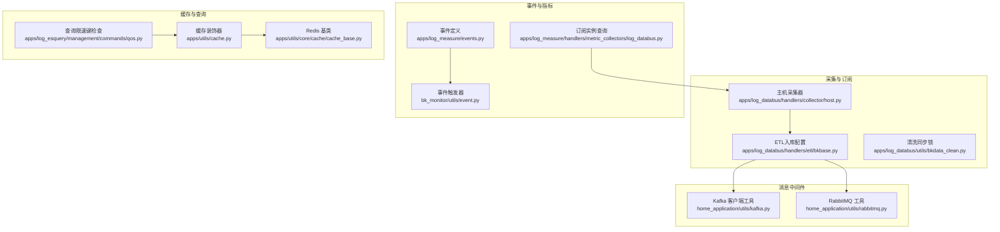
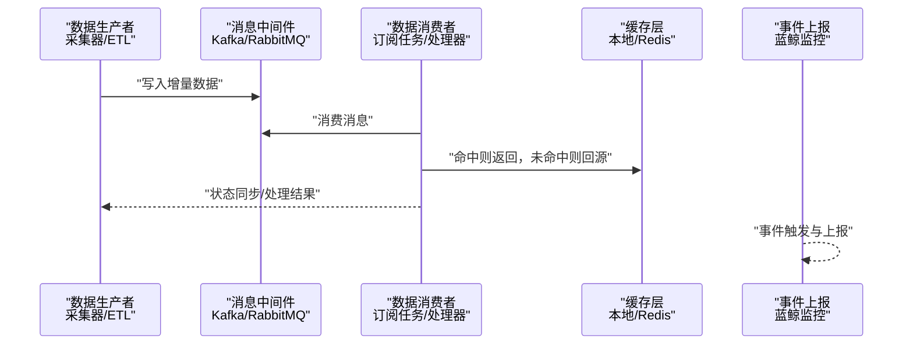
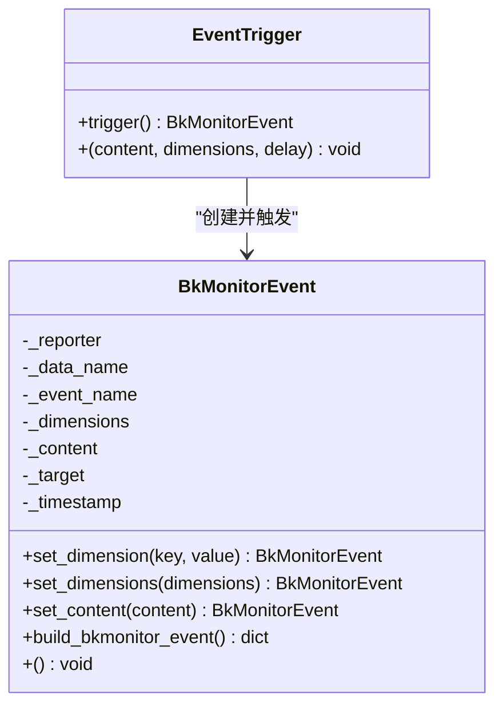
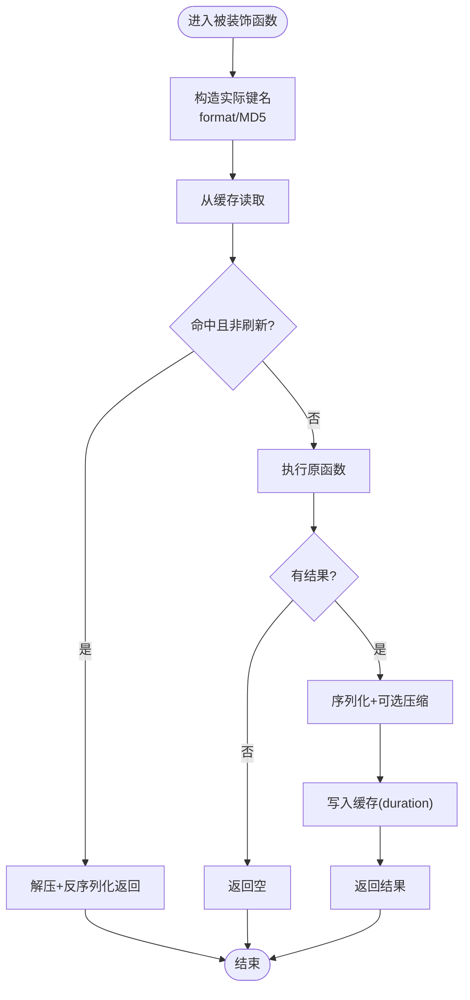
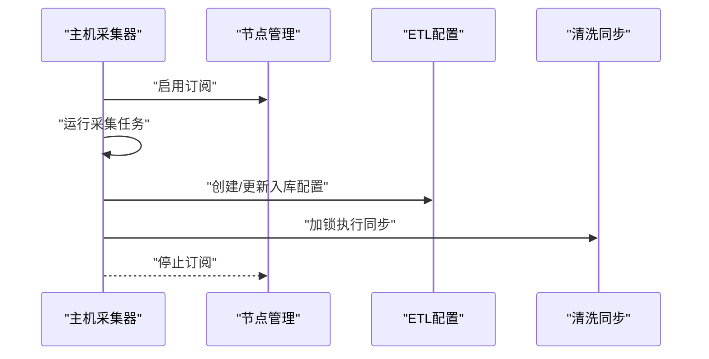
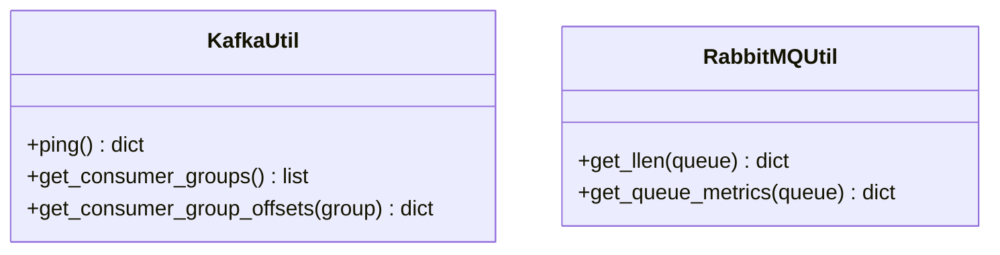
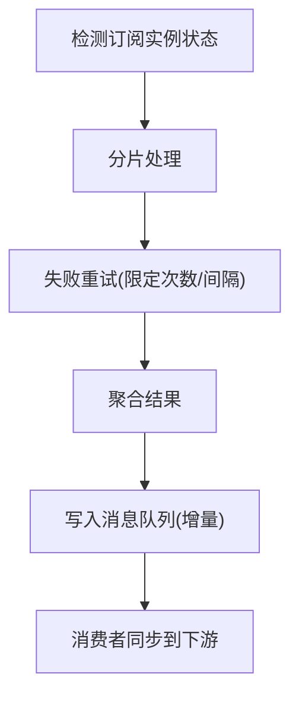
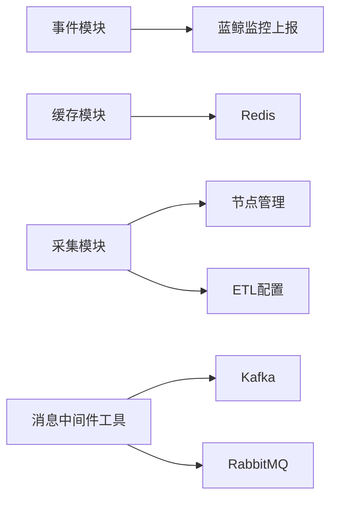

# 实时数据更新

<cite>
**本文引用的文件**
- [apps/log_measure/events.py](file://apps/log_measure/events.py)
- [bk_monitor/utils/event.py](file://bk_monitor/utils/event.py)
- [apps/utils/cache.py](file://apps/utils/cache.py)
- [apps/utils/core/cache/cache_base.py](file://apps/utils/core/cache/cache_base.py)
- [home_application/utils/kafka.py](file://home_application/utils/kafka.py)
- [home_application/utils/rabbitmq.py](file://home_application/utils/rabbitmq.py)
- [apps/log_databus/handlers/collector/host.py](file://apps/log_databus/handlers/collector/host.py)
- [apps/log_databus/handlers/etl/bkbase.py](file://apps/log_databus/handlers/etl/bkbase.py)
- [apps/log_databus/utils/bkdata_clean.py](file://apps/log_databus/utils/bkdata_clean.py)
- [apps/log_esquery/management/commands/qos.py](file://apps/log_esquery/management/commands/qos.py)
- [apps/log_measure/handlers/metric_collectors/log_databus.py](file://apps/log_measure/handlers/metric_collectors/log_databus.py)
- [apps/log_clustering/migrations/0017_clusteringsubscription.py](file://apps/log_clustering/migrations/0017_clusteringsubscription.py)
</cite>

## 目录
1. [简介](#简介)
2. [项目结构](#项目结构)
3. [核心组件](#核心组件)
4. [架构总览](#架构总览)
5. [详细组件分析](#详细组件分析)
6. [依赖关系分析](#依赖关系分析)
7. [性能考量](#性能考量)
8. [故障排查指南](#故障排查指南)
9. [结论](#结论)
10. [附录](#附录)

## 简介
本文件围绕“实时数据更新机制”展开，系统性梳理并总结仓库中与实时连接、增量更新、缓存策略、事件驱动与消息队列集成相关的实现与设计。内容覆盖：
- WebSocket 连接的建立与维护（连接池、心跳、断线重连）
- 增量数据更新（变更检测、增量推送、状态同步）
- 缓存策略（本地缓存、分布式缓存、缓存失效）
- 事件驱动架构（事件发布订阅、消息队列集成）
- 性能监控与质量保障
- 具体实现示例与最佳实践

## 项目结构
围绕实时数据更新的关键模块主要分布在以下子系统：
- 日志采集与订阅：日志采集器通过订阅节点管理事件，触发实时数据更新
- 消息中间件：Kafka、RabbitMQ 提供异步消息通道，支撑事件与增量数据分发
- 事件与指标上报：基于蓝鲸监控事件能力，构建事件触发器与上报
- 缓存体系：本地缓存装饰器与 Redis 基类封装，支撑热点数据快速访问与失效控制
- 查询与限流：查询限速键与队列长度告警，保障系统稳定性

图表来源
- [apps/log_databus/handlers/collector/host.py:87-128](file://apps/log_databus/handlers/collector/host.py#L87-L128)
- [apps/log_databus/handlers/etl/bkbase.py:171-189](file://apps/log_databus/handlers/etl/bkbase.py#L171-L189)
- [apps/log_databus/utils/bkdata_clean.py:170-182](file://apps/log_databus/utils/bkdata_clean.py#L170-L182)
- [home_application/utils/kafka.py:59-78](file://home_application/utils/kafka.py#L59-L78)
- [home_application/utils/rabbitmq.py:88-129](file://home_application/utils/rabbitmq.py#L88-L129)
- [apps/log_measure/events.py:19-32](file://apps/log_measure/events.py#L19-L32)
- [bk_monitor/utils/event.py:5-58](file://bk_monitor/utils/event.py#L5-L58)
- [apps/log_measure/handlers/metric_collectors/log_databus.py:491-515](file://apps/log_measure/handlers/metric_collectors/log_databus.py#L491-L515)
- [apps/utils/cache.py:36-149](file://apps/utils/cache.py#L36-L149)
- [apps/utils/core/cache/cache_base.py:12-32](file://apps/utils/core/cache/cache_base.py#L12-L32)
- [apps/log_esquery/management/commands/qos.py:18-38](file://apps/log_esquery/management/commands/qos.py#L18-L38)

章节来源
- [apps/log_databus/handlers/collector/host.py:87-128](file://apps/log_databus/handlers/collector/host.py#L87-L128)
- [apps/log_databus/handlers/etl/bkbase.py:171-189](file://apps/log_databus/handlers/etl/bkbase.py#L171-L189)
- [apps/log_databus/utils/bkdata_clean.py:170-182](file://apps/log_databus/utils/bkdata_clean.py#L170-L182)
- [home_application/utils/kafka.py:59-78](file://home_application/utils/kafka.py#L59-L78)
- [home_application/utils/rabbitmq.py:88-129](file://home_application/utils/rabbitmq.py#L88-L129)
- [apps/log_measure/events.py:19-32](file://apps/log_measure/events.py#L19-L32)
- [bk_monitor/utils/event.py:5-58](file://bk_monitor/utils/event.py#L5-L58)
- [apps/log_measure/handlers/metric_collectors/log_databus.py:491-515](file://apps/log_measure/handlers/metric_collectors/log_databus.py#L491-L515)
- [apps/utils/cache.py:36-149](file://apps/utils/cache.py#L36-L149)
- [apps/utils/core/cache/cache_base.py:12-32](file://apps/utils/core/cache/cache_base.py#L12-L32)
- [apps/log_esquery/management/commands/qos.py:18-38](file://apps/log_esquery/management/commands/qos.py#L18-L38)

## 核心组件
- 事件与指标上报：通过蓝鲸监控事件能力构建事件触发器，支持维度与内容设置，并统一上报
- 缓存体系：提供装饰器式缓存与批量缓存、Redis 基类封装，支持压缩与MD5键处理
- 消息中间件：Kafka/RabbitMQ 工具类提供连接、消费者组、偏移量等基础能力
- 采集与订阅：主机采集器启用/停止订阅，ETL 配置入库，清洗同步加锁避免并发冲突
- 查询与限流：命令行检查查询限速键；队列长度告警保障消息积压风险可控

章节来源
- [apps/log_measure/events.py:19-32](file://apps/log_measure/events.py#L19-L32)
- [bk_monitor/utils/event.py:5-58](file://bk_monitor/utils/event.py#L5-L58)
- [apps/utils/cache.py:36-149](file://apps/utils/cache.py#L36-L149)
- [apps/utils/core/cache/cache_base.py:12-32](file://apps/utils/core/cache/cache_base.py#L12-L32)
- [home_application/utils/kafka.py:59-78](file://home_application/utils/kafka.py#L59-L78)
- [home_application/utils/rabbitmq.py:88-129](file://home_application/utils/rabbitmq.py#L88-L129)
- [apps/log_databus/handlers/collector/host.py:87-128](file://apps/log_databus/handlers/collector/host.py#L87-L128)
- [apps/log_databus/handlers/etl/bkbase.py:171-189](file://apps/log_databus/handlers/etl/bkbase.py#L171-L189)
- [apps/log_databus/utils/bkdata_clean.py:170-182](file://apps/log_databus/utils/bkdata_clean.py#L170-L182)
- [apps/log_esquery/management/commands/qos.py:18-38](file://apps/log_esquery/management/commands/qos.py#L18-L38)

## 架构总览
实时数据更新以“事件驱动 + 消息中间件 + 缓存 + 订阅采集”为核心路径：
- 事件触发：业务侧或系统状态变化触发事件，统一上报至监控平台
- 数据采集：采集器根据订阅状态实时拉取/推送日志数据
- 数据入湖：ETL 将数据写入 Kafka/RabbitMQ 等消息队列
- 缓存加速：热点数据走本地/Redis 缓存，降低后端压力
- 查询治理：通过限速键与队列长度监控，保障系统稳定性

图表来源
- [apps/log_databus/handlers/collector/host.py:87-128](file://apps/log_databus/handlers/collector/host.py#L87-L128)
- [apps/log_databus/handlers/etl/bkbase.py:171-189](file://apps/log_databus/handlers/etl/bkbase.py#L171-L189)
- [home_application/utils/kafka.py:59-78](file://home_application/utils/kafka.py#L59-L78)
- [home_application/utils/rabbitmq.py:88-129](file://home_application/utils/rabbitmq.py#L88-L129)
- [apps/utils/cache.py:36-149](file://apps/utils/cache.py#L36-L149)
- [apps/log_measure/events.py:19-32](file://apps/log_measure/events.py#L19-L32)
- [bk_monitor/utils/event.py:5-58](file://bk_monitor/utils/event.py#L5-L58)

## 详细组件分析

### 事件驱动与指标上报
- 事件触发器：封装事件名称、维度、内容、时间戳，支持链式调用设置并触发上报
- 事件定义：集中定义各类事件类型，便于统一管理与扩展
- 指标采集：对订阅实例状态查询进行分片与重试，提升稳定性

图表来源
- [bk_monitor/utils/event.py:44-58](file://bk_monitor/utils/event.py#L44-L58)
- [bk_monitor/utils/event.py:5-42](file://bk_monitor/utils/event.py#L5-L42)
- [apps/log_measure/events.py:19-32](file://apps/log_measure/events.py#L19-L32)

章节来源
- [bk_monitor/utils/event.py:5-58](file://bk_monitor/utils/event.py#L5-L58)
- [apps/log_measure/events.py:19-32](file://apps/log_measure/events.py#L19-L32)
- [apps/log_measure/handlers/metric_collectors/log_databus.py:491-515](file://apps/log_measure/handlers/metric_collectors/log_databus.py#L491-L515)

### 缓存策略与失效机制
- 装饰器缓存：支持按需刷新、MD5 键、压缩存储，自动序列化/反序列化
- 批量缓存：针对多键场景，先查缓存再回源，合并结果后批量写回
- Redis 基类：统一前缀、超时、序列化/反序列化，抽象刷新接口
- 查询限速：命令行扫描缓存中的限速键，辅助运维治理

图表来源
- [apps/utils/cache.py:36-82](file://apps/utils/cache.py#L36-L82)
- [apps/utils/cache.py:84-136](file://apps/utils/cache.py#L84-L136)
- [apps/utils/core/cache/cache_base.py:12-32](file://apps/utils/core/cache/cache_base.py#L12-L32)
- [apps/log_esquery/management/commands/qos.py:18-38](file://apps/log_esquery/management/commands/qos.py#L18-L38)

章节来源
- [apps/utils/cache.py:36-149](file://apps/utils/cache.py#L36-L149)
- [apps/utils/core/cache/cache_base.py:12-32](file://apps/utils/core/cache/cache_base.py#L12-L32)
- [apps/log_esquery/management/commands/qos.py:18-38](file://apps/log_esquery/management/commands/qos.py#L18-L38)

### 采集与订阅（实时数据更新入口）
- 启停订阅：在启动/停止采集时，切换节点管理订阅开关，确保实时数据流开启/关闭
- ETL 入库：根据采集配置决定物理表名与入库操作，支持创建/更新
- 清洗同步：通过分布式锁避免并发同步导致的数据不一致

图表来源
- [apps/log_databus/handlers/collector/host.py:87-128](file://apps/log_databus/handlers/collector/host.py#L87-L128)
- [apps/log_databus/handlers/etl/bkbase.py:171-189](file://apps/log_databus/handlers/etl/bkbase.py#L171-L189)
- [apps/log_databus/utils/bkdata_clean.py:170-182](file://apps/log_databus/utils/bkdata_clean.py#L170-L182)

章节来源
- [apps/log_databus/handlers/collector/host.py:87-128](file://apps/log_databus/handlers/collector/host.py#L87-L128)
- [apps/log_databus/handlers/etl/bkbase.py:171-189](file://apps/log_databus/handlers/etl/bkbase.py#L171-L189)
- [apps/log_databus/utils/bkdata_clean.py:170-182](file://apps/log_databus/utils/bkdata_clean.py#L170-L182)

### 消息中间件与队列集成
- Kafka：提供客户端生命周期管理、消费者组与偏移量查询能力
- RabbitMQ：提供队列长度与消费者数量查询、告警阈值判断

图表来源
- [home_application/utils/kafka.py:59-78](file://home_application/utils/kafka.py#L59-L78)
- [home_application/utils/rabbitmq.py:88-129](file://home_application/utils/rabbitmq.py#L88-L129)

章节来源
- [home_application/utils/kafka.py:59-78](file://home_application/utils/kafka.py#L59-L78)
- [home_application/utils/rabbitmq.py:88-129](file://home_application/utils/rabbitmq.py#L88-L129)

### 增量数据更新与状态同步
- 变更检测：通过订阅实例状态查询与分片重试，识别目标状态变化
- 增量推送：ETL 将增量数据写入消息队列，消费者按需消费
- 状态同步：采集器启停与订阅开关联动，保证状态一致性

图表来源
- [apps/log_measure/handlers/metric_collectors/log_databus.py:491-515](file://apps/log_measure/handlers/metric_collectors/log_databus.py#L491-L515)
- [apps/log_databus/handlers/collector/host.py:87-128](file://apps/log_databus/handlers/collector/host.py#L87-L128)
- [apps/log_databus/handlers/etl/bkbase.py:171-189](file://apps/log_databus/handlers/etl/bkbase.py#L171-L189)

章节来源
- [apps/log_measure/handlers/metric_collectors/log_databus.py:491-515](file://apps/log_measure/handlers/metric_collectors/log_databus.py#L491-L515)
- [apps/log_databus/handlers/collector/host.py:87-128](file://apps/log_databus/handlers/collector/host.py#L87-L128)
- [apps/log_databus/handlers/etl/bkbase.py:171-189](file://apps/log_databus/handlers/etl/bkbase.py#L171-L189)

## 依赖关系分析
- 组件耦合
  - 事件模块依赖蓝鲸监控上报能力，低耦合高内聚
  - 缓存模块依赖 Django 缓存后端与 Redis 连接，提供统一抽象
  - 采集模块依赖节点管理与 ETL 配置，形成闭环
  - 消息中间件工具独立，便于替换与扩展
- 外部依赖
  - Redis：用于分布式缓存与锁
  - Kafka/RabbitMQ：用于异步消息分发
  - 蓝鲸监控：用于事件上报与可观测性

图表来源
- [apps/log_measure/events.py:19-32](file://apps/log_measure/events.py#L19-L32)
- [bk_monitor/utils/event.py:5-58](file://bk_monitor/utils/event.py#L5-L58)
- [apps/utils/cache.py:36-149](file://apps/utils/cache.py#L36-L149)
- [apps/utils/core/cache/cache_base.py:12-32](file://apps/utils/core/cache/cache_base.py#L12-L32)
- [apps/log_databus/handlers/collector/host.py:87-128](file://apps/log_databus/handlers/collector/host.py#L87-L128)
- [apps/log_databus/handlers/etl/bkbase.py:171-189](file://apps/log_databus/handlers/etl/bkbase.py#L171-L189)
- [home_application/utils/kafka.py:59-78](file://home_application/utils/kafka.py#L59-L78)
- [home_application/utils/rabbitmq.py:88-129](file://home_application/utils/rabbitmq.py#L88-L129)

章节来源
- [apps/log_measure/events.py:19-32](file://apps/log_measure/events.py#L19-L32)
- [bk_monitor/utils/event.py:5-58](file://bk_monitor/utils/event.py#L5-L58)
- [apps/utils/cache.py:36-149](file://apps/utils/cache.py#L36-L149)
- [apps/utils/core/cache/cache_base.py:12-32](file://apps/utils/core/cache/cache_base.py#L12-L32)
- [apps/log_databus/handlers/collector/host.py:87-128](file://apps/log_databus/handlers/collector/host.py#L87-L128)
- [apps/log_databus/handlers/etl/bkbase.py:171-189](file://apps/log_databus/handlers/etl/bkbase.py#L171-L189)
- [home_application/utils/kafka.py:59-78](file://home_application/utils/kafka.py#L59-L78)
- [home_application/utils/rabbitmq.py:88-129](file://home_application/utils/rabbitmq.py#L88-L129)

## 性能考量
- 缓存优化
  - 使用装饰器缓存减少重复计算与IO
  - 批量缓存减少网络往返与序列化开销
  - MD5键与压缩策略降低键长度与存储体积
- 查询治理
  - 通过命令行扫描限速键，及时发现异常
  - 队列长度告警阈值，防止消息积压影响延迟
- 并发控制
  - 清洗同步加锁避免并发写入冲突
  - 订阅启停与状态联动，减少无效工作

章节来源
- [apps/utils/cache.py:36-149](file://apps/utils/cache.py#L36-L149)
- [apps/log_esquery/management/commands/qos.py:18-38](file://apps/log_esquery/management/commands/qos.py#L18-L38)
- [home_application/utils/rabbitmq.py:88-129](file://home_application/utils/rabbitmq.py#L88-L129)
- [apps/log_databus/utils/bkdata_clean.py:170-182](file://apps/log_databus/utils/bkdata_clean.py#L170-L182)
- [apps/log_databus/handlers/collector/host.py:87-128](file://apps/log_databus/handlers/collector/host.py#L87-L128)

## 故障排查指南
- 缓存相关
  - 检查装饰器键构造是否正确，必要时启用MD5
  - 观察压缩解压失败日志，定位序列化问题
- 查询限速
  - 使用命令行列出限速键，核对业务逻辑是否异常
- 消息中间件
  - Kafka：检查消费者组与偏移量，确认消费进度
  - RabbitMQ：检查队列长度与消费者数量，超过阈值报警
- 采集与订阅
  - 订阅启停是否成功，ETL入库是否创建/更新
  - 清洗同步是否加锁成功，避免并发冲突

章节来源
- [apps/utils/cache.py:36-149](file://apps/utils/cache.py#L36-L149)
- [apps/log_esquery/management/commands/qos.py:18-38](file://apps/log_esquery/management/commands/qos.py#L18-L38)
- [home_application/utils/kafka.py:59-78](file://home_application/utils/kafka.py#L59-L78)
- [home_application/utils/rabbitmq.py:88-129](file://home_application/utils/rabbitmq.py#L88-L129)
- [apps/log_databus/handlers/collector/host.py:87-128](file://apps/log_databus/handlers/collector/host.py#L87-L128)
- [apps/log_databus/handlers/etl/bkbase.py:171-189](file://apps/log_databus/handlers/etl/bkbase.py#L171-L189)
- [apps/log_databus/utils/bkdata_clean.py:170-182](file://apps/log_databus/utils/bkdata_clean.py#L170-L182)

## 结论
本项目通过事件驱动、缓存加速、消息中间件与订阅采集的协同，构建了可扩展的实时数据更新体系。建议在生产环境中：
- 明确事件边界与维度，统一上报口径
- 合理设置缓存策略与失效时间，结合压缩与MD5键
- 强化消息队列监控与限流治理，保障稳定性
- 严格控制并发写入，完善订阅启停与状态同步

## 附录
- 最佳实践清单
  - 事件：按业务域划分事件类型，设置清晰维度
  - 缓存：优先装饰器缓存，批量场景使用批量缓存
  - 中间件：Kafka/RabbitMQ 分层治理，明确队列与消费者策略
  - 采集：订阅启停自动化，ETL入库幂等，清洗同步加锁
  - 监控：事件上报、查询限速、队列长度三线监控