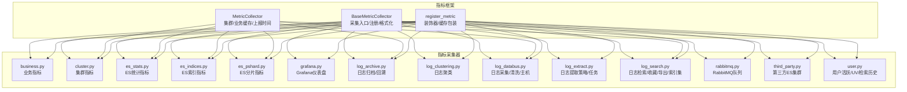
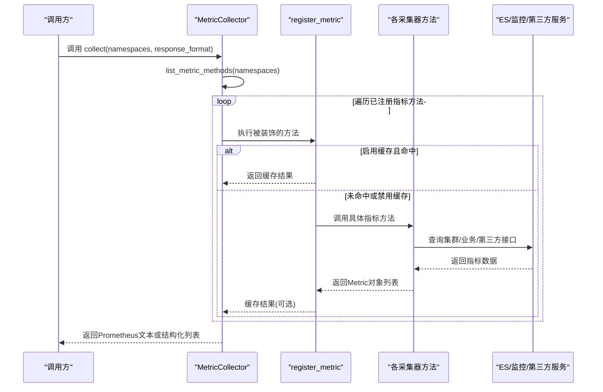
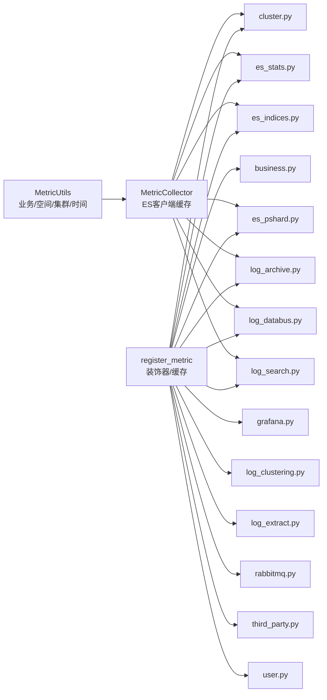

# 指标收集器

<cite>
**本文引用的文件**
- [apps/log_measure/handlers/metrics.py](file://apps/log_measure/handlers/metrics.py)
- [apps/log_measure/constants.py](file://apps/log_measure/constants.py)
- [apps/log_measure/handlers/metric_collectors/business.py](file://apps/log_measure/handlers/metric_collectors/business.py)
- [apps/log_measure/handlers/metric_collectors/cluster.py](file://apps/log_measure/handlers/metric_collectors/cluster.py)
- [apps/log_measure/handlers/metric_collectors/es_stats.py](file://apps/log_measure/handlers/metric_collectors/es_stats.py)
- [apps/log_measure/handlers/metric_collectors/es_indices.py](file://apps/log_measure/handlers/metric_collectors/es_indices.py)
- [apps/log_measure/handlers/metric_collectors/es_pshard.py](file://apps/log_measure/handlers/metric_collectors/es_pshard.py)
- [apps/log_measure/handlers/metric_collectors/grafana.py](file://apps/log_measure/handlers/metric_collectors/grafana.py)
- [apps/log_measure/handlers/metric_collectors/log_archive.py](file://apps/log_measure/handlers/metric_collectors/log_archive.py)
- [apps/log_measure/handlers/metric_collectors/log_clustering.py](file://apps/log_measure/handlers/metric_collectors/log_clustering.py)
- [apps/log_measure/handlers/metric_collectors/log_databus.py](file://apps/log_measure/handlers/metric_collectors/log_databus.py)
- [apps/log_measure/handlers/metric_collectors/log_extract.py](file://apps/log_measure/handlers/metric_collectors/log_extract.py)
- [apps/log_measure/handlers/metric_collectors/log_search.py](file://apps/log_measure/handlers/metric_collectors/log_search.py)
- [apps/log_measure/handlers/metric_collectors/rabbitmq.py](file://apps/log_measure/handlers/metric_collectors/rabbitmq.py)
- [apps/log_measure/handlers/metric_collectors/third_party.py](file://apps/log_measure/handlers/metric_collectors/third_party.py)
- [apps/log_measure/handlers/metric_collectors/user.py](file://apps/log_measure/handlers/metric_collectors/user.py)
</cite>

## 目录
1. [简介](#简介)
2. [项目结构](#项目结构)
3. [核心组件](#核心组件)
4. [架构总览](#架构总览)
5. [详细组件分析](#详细组件分析)
6. [依赖分析](#依赖分析)
7. [性能考虑](#性能考虑)
8. [故障排查指南](#故障排查指南)
9. [结论](#结论)
10. [附录](#附录)

## 简介
本技术文档面向“指标收集器”模块，系统性阐述各类指标采集器的实现原理、采集频率、存储与计算方法、扩展机制、实时更新与缓存策略，以及性能优化与错误处理方案。覆盖范围包括：业务指标、集群指标、ES索引指标、ES统计指标、Grafana指标、日志聚类指标、日志采集指标、日志提取指标、日志搜索指标、RabbitMQ指标、第三方指标、用户行为指标等。

## 项目结构
指标收集器位于 apps/log_measure/handlers/metric_collectors 下，采用按功能域分文件组织的方式，每个文件对应一类指标采集器；同时在 apps/log_measure/handlers/metrics.py 中提供统一的采集框架（注册装饰器、采集入口、Prometheus格式输出、缓存封装）。

图表来源
- [apps/log_measure/handlers/metrics.py:71-92](file://apps/log_measure/handlers/metrics.py#L71-L92)
- [apps/log_measure/handlers/metric_collectors/business.py:53-134](file://apps/log_measure/handlers/metric_collectors/business.py#L53-L134)
- [apps/log_measure/handlers/metric_collectors/cluster.py:33-194](file://apps/log_measure/handlers/metric_collectors/cluster.py#L33-L194)
- [apps/log_measure/handlers/metric_collectors/es_stats.py:28-43](file://apps/log_measure/handlers/metric_collectors/es_stats.py#L28-L43)
- [apps/log_measure/handlers/metric_collectors/es_indices.py:28-42](file://apps/log_measure/handlers/metric_collectors/es_indices.py#L28-L42)
- [apps/log_measure/handlers/metric_collectors/es_pshard.py:28-42](file://apps/log_measure/handlers/metric_collectors/es_pshard.py#L28-L42)
- [apps/log_measure/handlers/metric_collectors/grafana.py:33-111](file://apps/log_measure/handlers/metric_collectors/grafana.py#L33-L111)
- [apps/log_measure/handlers/metric_collectors/log_archive.py:36-113](file://apps/log_measure/handlers/metric_collectors/log_archive.py#L36-L113)
- [apps/log_measure/handlers/metric_collectors/log_clustering.py:31-64](file://apps/log_measure/handlers/metric_collectors/log_clustering.py#L31-L64)
- [apps/log_measure/handlers/metric_collectors/log_databus.py:55-515](file://apps/log_measure/handlers/metric_collectors/log_databus.py#L55-L515)
- [apps/log_measure/handlers/metric_collectors/log_extract.py:37-123](file://apps/log_measure/handlers/metric_collectors/log_extract.py#L37-L123)
- [apps/log_measure/handlers/metric_collectors/log_search.py:46-292](file://apps/log_measure/handlers/metric_collectors/log_search.py#L46-L292)
- [apps/log_measure/handlers/metric_collectors/rabbitmq.py:9-40](file://apps/log_measure/handlers/metric_collectors/rabbitmq.py#L9-L40)
- [apps/log_measure/handlers/metric_collectors/third_party.py:33-60](file://apps/log_measure/handlers/metric_collectors/third_party.py#L33-L60)
- [apps/log_measure/handlers/metric_collectors/user.py:39-171](file://apps/log_measure/handlers/metric_collectors/user.py#L39-L171)

章节来源
- [apps/log_measure/handlers/metrics.py:40-197](file://apps/log_measure/handlers/metrics.py#L40-L197)
- [apps/log_measure/constants.py:51-76](file://apps/log_measure/constants.py#L51-L76)

## 核心组件
- 采集框架
  - 注册装饰器 register_metric：为指标方法提供命名空间、描述、缓存时间、标记为指标方法的能力。
  - 基类 BaseMetricCollector：提供采集入口 collect、指标方法枚举 list_metric_methods、Prometheus 文本格式化、时间窗口对齐等。
  - 派生类 MetricCollector：扩展集群信息缓存、ES 客户端获取、业务/空间映射、上报时间戳取整等。
- 指标模型 Metric：定义指标名称、值、维度，支持 Prometheus 文本序列化。
- 数据源与命名空间
  - DATA_NAMES 定义了多种数据源名称及自定义上报类型（时序/事件），用于区分不同指标流。
  - 指标命名空间由 register_metric 的 namespace 参数决定，便于按域聚合与查询。

章节来源
- [apps/log_measure/handlers/metrics.py:40-197](file://apps/log_measure/handlers/metrics.py#L40-L197)
- [apps/log_measure/constants.py:67-76](file://apps/log_measure/constants.py#L67-L76)

## 架构总览
指标采集器通过统一的装饰器注册与采集入口，将各功能域指标方法纳入采集流程。采集周期内，框架按命名空间过滤目标方法，逐个调用并汇总为 Prometheus 文本或结构化列表。部分指标方法内置缓存，减少重复计算与外部调用开销。

图表来源
- [apps/log_measure/handlers/metrics.py:121-156](file://apps/log_measure/handlers/metrics.py#L121-L156)
- [apps/log_measure/handlers/metrics.py:168-186](file://apps/log_measure/handlers/metrics.py#L168-L186)
- [apps/log_measure/handlers/metrics.py:71-92](file://apps/log_measure/handlers/metrics.py#L71-L92)

## 详细组件分析

### 业务指标（business）
- 指标类别
  - 活跃业务：基于检索历史时间窗统计活跃业务数与总计。
  - 业务总量：统计全平台业务总数与明细。
  - 采集相关业务：统计配置采集的业务数。
  - 功能使用业务数：统计使用日志采集、归档、提取、聚类、链路追踪、清洗等功能的业务数。
- 采集频率
  - 默认分钟级（由装饰器 time_filter 指定）。
- 计算方法
  - 使用 Django ORM 分组聚合，结合 MetricUtils 提供的空间/业务映射生成维度。
- 实时性
  - 依赖检索历史表与索引集映射，实时性取决于历史表写入频率。

章节来源
- [apps/log_measure/handlers/metric_collectors/business.py:53-134](file://apps/log_measure/handlers/metric_collectors/business.py#L53-L134)
- [apps/log_measure/handlers/metric_collectors/business.py:136-284](file://apps/log_measure/handlers/metric_collectors/business.py#L136-L284)

### 集群指标（cluster）
- 指标类别
  - 集群健康度：集群状态（绿/黄/红）、活动分片、未分配分片等。
  - 集群节点：节点磁盘使用、内存/CPU负载、节点数统计等。
- 采集频率
  - 健康度：10 分钟；节点：5 分钟。
- 计算方法
  - 通过 MetricUtils 获取 ES 客户端，调用 cat.health/cat.allocation/cat.nodes 接口，构造维度（业务、集群、节点）并上报。
- 实时性
  - 通过 ES 接口直接查询，近实时。

章节来源
- [apps/log_measure/handlers/metric_collectors/cluster.py:33-194](file://apps/log_measure/handlers/metric_collectors/cluster.py#L33-L194)

### ES统计/索引/分片指标（es_stats/es_indices/es_pshard）
- 指标类别
  - ES 统计：通过 get_es_metrics 抽取通用 ES 指标。
  - ES 索引：索引维度指标。
  - ES 分片：分片维度指标。
- 采集频率
  - 默认分钟级。
- 计算方法
  - 委托 utils.es.get_es_metrics 实现，内部按子类型拉取相应指标。
- 实时性
  - 通过 ES 接口查询，近实时。

章节来源
- [apps/log_measure/handlers/metric_collectors/es_stats.py:28-43](file://apps/log_measure/handlers/metric_collectors/es_stats.py#L28-L43)
- [apps/log_measure/handlers/metric_collectors/es_indices.py:28-42](file://apps/log_measure/handlers/metric_collectors/es_indices.py#L28-L42)
- [apps/log_measure/handlers/metric_collectors/es_pshard.py:28-42](file://apps/log_measure/handlers/metric_collectors/es_pshard.py#L28-L42)

### Grafana指标（grafana）
- 指标类别
  - 仪表盘数量、面板数量、业务维度聚合。
- 采集频率
  - 小时级。
- 计算方法
  - 通过 grafana_client 列举组织、仪表盘、面板，按业务维度统计。
- 实时性
  - 依赖 Grafana API，近实时。

章节来源
- [apps/log_measure/handlers/metric_collectors/grafana.py:33-111](file://apps/log_measure/handlers/metric_collectors/grafana.py#L33-L111)

### 日志聚类指标（log_clustering）
- 指标类别
  - 已启用签名聚类的业务数与总计。
- 采集频率
  - 分钟级。
- 计算方法
  - 基于 ClusteringConfig 表按业务分组统计。

章节来源
- [apps/log_measure/handlers/metric_collectors/log_clustering.py:31-64](file://apps/log_measure/handlers/metric_collectors/log_clustering.py#L31-L64)

### 日志采集指标（log_databus）
- 指标类别
  - 采集配置：按业务、是否启用、采集场景分组统计。
  - 自定义采集配置：按业务、自定义类型分组统计。
  - 采集行数：基于监控自定义指标差值计算。
  - 业务主机：按是否活跃统计唯一主机数。
  - 清洗配置：按业务、索引集、清洗类型统计。
  - 采集主机：按采集项统计实例数。
- 采集频率
  - 配置/行数/主机：分钟级；清洗/主机：小时级。
- 计算方法
  - 采集配置/清洗：ORM 分组聚合。
  - 采集行数：调用监控统一查询接口，按 task_data_id 聚合差值。
  - 业务主机：调用监控统一查询接口，按 target 聚合后对比状态字段。
  - 采集主机：调用节点订阅接口，按 subscription_id 聚合实例数。
- 实时性
  - 依赖监控统一查询与节点订阅接口，近实时。

章节来源
- [apps/log_measure/handlers/metric_collectors/log_databus.py:55-515](file://apps/log_measure/handlers/metric_collectors/log_databus.py#L55-L515)

### 日志提取指标（log_extract）
- 指标类别
  - 提取策略：按业务统计。
  - 提取任务：按业务、用户、时间窗统计任务数与小计。
- 采集频率
  - 分钟级。
- 计算方法
  - ORM 分组聚合，结合 MetricUtils 的业务映射生成维度。

章节来源
- [apps/log_measure/handlers/metric_collectors/log_extract.py:37-123](file://apps/log_measure/handlers/metric_collectors/log_extract.py#L37-L123)

### 日志搜索指标（log_search）
- 指标类别
  - 检索次数：按业务、用户、时间窗统计检索次数与总计。
  - 收藏：按空间、索引集统计收藏数与总计。
  - 导出：按业务、索引集、导出类型、用户统计导出任务与总计。
  - 索引集：按业务、场景、激活状态、是否有数据标签统计索引集总数与有效数。
- 采集频率
  - 检索/收藏/索引集：分钟级；导出：小时级。
- 计算方法
  - ORM 分组聚合，索引集维度通过标签与激活状态组合聚合。

章节来源
- [apps/log_measure/handlers/metric_collectors/log_search.py:46-292](file://apps/log_measure/handlers/metric_collectors/log_search.py#L46-L292)

### RabbitMQ指标（rabbitmq）
- 指标类别
  - 连接状态 up：0/1。
  - 队列维度指标：根据队列名返回各项指标值。
- 采集频率
  - 分钟级。
- 计算方法
  - 通过 RabbitMQClient 获取连接与队列指标，按队列名维度上报。

章节来源
- [apps/log_measure/handlers/metric_collectors/rabbitmq.py:9-40](file://apps/log_measure/handlers/metric_collectors/rabbitmq.py#L9-L40)

### 第三方ES指标（third_party）
- 指标类别
  - 第三方ES集群：按业务统计第三方注册的存储集群数。
- 采集频率
  - 分钟级。
- 计算方法
  - 通过 TransferApi 获取集群信息，过滤非默认系统并按业务计数。

章节来源
- [apps/log_measure/handlers/metric_collectors/third_party.py:33-60](file://apps/log_measure/handlers/metric_collectors/third_party.py#L33-L60)

### 用户行为指标（user）
- 指标类别
  - 活跃用户：登录最近时间与检索活跃用户交集。
  - UV：按时间窗统计独立用户检索次数与总计。
  - 检索历史：按历史记录维度上报耗时等指标。
- 采集频率
  - 活跃用户/UV：分钟级；检索历史：秒级窗口。
- 计算方法
  - 用户活跃：ORM 查询与集合合并。
  - UV：按用户分组统计。
  - 检索历史：按记录维度构造指标。

章节来源
- [apps/log_measure/handlers/metric_collectors/user.py:39-171](file://apps/log_measure/handlers/metric_collectors/user.py#L39-L171)

### 日志归档/回溯指标（log_archive）
- 指标类别
  - 归档配置：按业务统计归档配置数与总计。
  - 回溯配置：按业务统计回溯配置数与总计。
  - 归档仓库：按业务统计快照仓库数与总计。
- 采集频率
  - 小时级。
- 计算方法
  - ORM 分组统计；仓库统计依赖 TransferApi 获取集群与仓库列表。

章节来源
- [apps/log_measure/handlers/metric_collectors/log_archive.py:36-113](file://apps/log_measure/handlers/metric_collectors/log_archive.py#L36-L113)
- [apps/log_measure/handlers/metric_collectors/log_archive.py:115-147](file://apps/log_measure/handlers/metric_collectors/log_archive.py#L115-L147)

## 依赖分析
- 组件耦合
  - 各采集器均依赖 MetricUtils（业务/空间/集群信息、上报时间戳）与 register_metric 装饰器。
  - 集群类采集器依赖 MetricCollector 的 ES 客户端缓存与工厂方法。
  - 日志采集类采集器依赖监控统一查询接口与节点订阅接口。
- 外部依赖
  - ES 集群：cat.health/cat.allocation/cat.nodes、indices/pshard 等接口。
  - 监控：统一查询接口（自定义指标）。
  - 第三方：TransferApi、Grafana API、RabbitMQ API。
- 数据源
  - DATA_NAMES 定义了 metric/search_history/es_monitor/django_monitor/bk_log_event 等数据源名称与类型。

图表来源
- [apps/log_measure/handlers/metrics.py:200-259](file://apps/log_measure/handlers/metrics.py#L200-L259)
- [apps/log_measure/handlers/metric_collectors/cluster.py:33-194](file://apps/log_measure/handlers/metric_collectors/cluster.py#L33-L194)
- [apps/log_measure/handlers/metric_collectors/log_databus.py:55-515](file://apps/log_measure/handlers/metric_collectors/log_databus.py#L55-L515)
- [apps/log_measure/handlers/metric_collectors/log_search.py:46-292](file://apps/log_measure/handlers/metric_collectors/log_search.py#L46-L292)
- [apps/log_measure/constants.py:67-76](file://apps/log_measure/constants.py#L67-L76)

章节来源
- [apps/log_measure/handlers/metrics.py:200-259](file://apps/log_measure/handlers/metrics.py#L200-L259)
- [apps/log_measure/constants.py:67-76](file://apps/log_measure/constants.py#L67-L76)

## 性能考虑
- 采集周期与时间对齐
  - 上报时间戳按采集间隔取整，避免时间漂移导致的重复或遗漏。
- 缓存策略
  - register_metric 支持 cache_time 参数，对热点指标进行缓存，降低重复计算与外部调用压力。
  - MetricCollector 对 ES 客户端按集群 ID 缓存，避免重复初始化。
- 并发与批量
  - 日志采集类中使用多线程并发拉取多个集群的索引列表，提升吞吐。
  - 节点订阅查询采用分片批量与重试机制，提升稳定性。
- I/O 与网络
  - ES 接口请求设置超时参数；监控统一查询按分钟级窗口聚合，避免大查询。
- 存储与格式
  - Prometheus 文本格式便于下游 PromQL 查询与告警；结构化列表便于灵活消费。

章节来源
- [apps/log_measure/handlers/metrics.py:96-108](file://apps/log_measure/handlers/metrics.py#L96-L108)
- [apps/log_measure/handlers/metrics.py:71-92](file://apps/log_measure/handlers/metrics.py#L71-L92)
- [apps/log_measure/handlers/metrics.py:218-259](file://apps/log_measure/handlers/metrics.py#L218-L259)
- [apps/log_measure/handlers/metric_collectors/log_databus.py:128-141](file://apps/log_measure/handlers/metric_collectors/log_databus.py#L128-L141)
- [apps/log_measure/handlers/metric_collectors/log_databus.py:489-515](file://apps/log_measure/handlers/metric_collectors/log_databus.py#L489-L515)

## 故障排查指南
- ES 连接失败
  - 现象：集群健康/节点指标为空或异常。
  - 排查：检查 MetricCollector.get_es_client 初始化与 ping 结果；确认认证信息与网络连通性。
- 监控统一查询异常
  - 现象：采集行数/主机等指标缺失。
  - 排查：检查监控接口返回与 datapoints 解析；关注异常日志与重试逻辑。
- 节点订阅查询失败
  - 现象：采集主机指标异常。
  - 排查：确认分片批量大小与最大重试次数配置；检查接口可用性。
- Grafana API 异常
  - 现象：仪表盘/面板指标缺失。
  - 排查：确认组织过滤与 JSON 解析；检查鉴权与网络。
- RabbitMQ 连接失败
  - 现象：队列指标缺失。
  - 排查：确认连接状态与队列名配置。

章节来源
- [apps/log_measure/handlers/metrics.py:255-256](file://apps/log_measure/handlers/metrics.py#L255-L256)
- [apps/log_measure/handlers/metric_collectors/log_databus.py:211-222](file://apps/log_measure/handlers/metric_collectors/log_databus.py#L211-L222)
- [apps/log_measure/handlers/metric_collectors/log_databus.py:296-310](file://apps/log_measure/handlers/metric_collectors/log_databus.py#L296-L310)
- [apps/log_measure/handlers/metric_collectors/grafana.py:48-51](file://apps/log_measure/handlers/metric_collectors/grafana.py#L48-L51)
- [apps/log_measure/handlers/metric_collectors/rabbitmq.py:14-27](file://apps/log_measure/handlers/metric_collectors/rabbitmq.py#L14-L27)

## 结论
该指标收集器模块通过统一的装饰器与采集框架，实现了对业务、集群、ES、Grafana、日志采集/提取/搜索、RabbitMQ、第三方ES与用户行为等多维度指标的标准化采集。其具备明确的采集频率、缓存与并发优化策略，并提供了清晰的扩展路径，便于新增自定义指标与数据源。

## 附录

### 指标采集频率与数据源对照
- 采集频率
  - 分钟级：business、cluster、es_stats、es_indices、es_pshard、grafana、log_clustering、log_databus（配置/行数/主机）、log_extract、log_search（检索/收藏/索引集）、user（活跃用户/UV）、third_party、rabbitmq。
  - 小时级：log_databus（清洗/主机）、log_search（导出）、log_archive。
- 数据源
  - metric、search_history、es_monitor、django_monitor、bk_log_event。

章节来源
- [apps/log_measure/constants.py:67-76](file://apps/log_measure/constants.py#L67-L76)
- [apps/log_measure/handlers/metric_collectors/cluster.py:92-93](file://apps/log_measure/handlers/metric_collectors/cluster.py#L92-L93)
- [apps/log_measure/handlers/metric_collectors/es_stats.py:30-36](file://apps/log_measure/handlers/metric_collectors/es_stats.py#L30-L36)
- [apps/log_measure/handlers/metric_collectors/es_indices.py:30-36](file://apps/log_measure/handlers/metric_collectors/es_indices.py#L30-L36)
- [apps/log_measure/handlers/metric_collectors/es_pshard.py:30-36](file://apps/log_measure/handlers/metric_collectors/es_pshard.py#L30-L36)
- [apps/log_measure/handlers/metric_collectors/grafana.py:35-36](file://apps/log_measure/handlers/metric_collectors/grafana.py#L35-L36)
- [apps/log_measure/handlers/metric_collectors/log_clustering.py](file://apps/log_measure/handlers/metric_collectors/log_clustering.py#L33)
- [apps/log_measure/handlers/metric_collectors/log_databus.py](file://apps/log_measure/handlers/metric_collectors/log_databus.py#L57)
- [apps/log_measure/handlers/metric_collectors/log_databus.py:144-146](file://apps/log_measure/handlers/metric_collectors/log_databus.py#L144-L146)
- [apps/log_measure/handlers/metric_collectors/log_databus.py](file://apps/log_measure/handlers/metric_collectors/log_databus.py#L225)
- [apps/log_measure/handlers/metric_collectors/log_databus.py:430-432](file://apps/log_measure/handlers/metric_collectors/log_databus.py#L430-L432)
- [apps/log_measure/handlers/metric_collectors/log_extract.py:39-41](file://apps/log_measure/handlers/metric_collectors/log_extract.py#L39-L41)
- [apps/log_measure/handlers/metric_collectors/log_search.py](file://apps/log_measure/handlers/metric_collectors/log_search.py#L48)
- [apps/log_measure/handlers/metric_collectors/log_search.py:120-122](file://apps/log_measure/handlers/metric_collectors/log_search.py#L120-L122)
- [apps/log_measure/handlers/metric_collectors/log_search.py](file://apps/log_measure/handlers/metric_collectors/log_search.py#L171)
- [apps/log_measure/handlers/metric_collectors/log_search.py](file://apps/log_measure/handlers/metric_collectors/log_search.py#L223)
- [apps/log_measure/handlers/metric_collectors/user.py](file://apps/log_measure/handlers/metric_collectors/user.py#L41)
- [apps/log_measure/handlers/metric_collectors/user.py:75-77](file://apps/log_measure/handlers/metric_collectors/user.py#L75-L77)
- [apps/log_measure/handlers/metric_collectors/third_party.py](file://apps/log_measure/handlers/metric_collectors/third_party.py#L35)
- [apps/log_measure/handlers/metric_collectors/rabbitmq.py](file://apps/log_measure/handlers/metric_collectors/rabbitmq.py#L11)

### 扩展机制与自定义指标添加步骤
- 新增采集器文件
  - 在 apps/log_measure/handlers/metric_collectors 下新建文件，定义采集器类与静态方法。
- 使用装饰器注册
  - 在方法上使用 @register_metric(namespace, description, data_name, time_filter, cache_time)，其中 cache_time 可选。
- 指标方法规范
  - 方法返回 Metric 对象列表；维度字典建议包含业务/空间/集群等关键标签。
- 加载与发现
  - 在 apps/log_measure/constants.py 的 METRIC_COLLECTORS 列表中加入新模块路径，确保被自动发现。
- 采集入口
  - 通过 MetricCollector.collect(namespaces, response_format) 触发采集；response_format 支持 "prometheus" 或结构化列表。

章节来源
- [apps/log_measure/handlers/metrics.py:71-92](file://apps/log_measure/handlers/metrics.py#L71-L92)
- [apps/log_measure/handlers/metrics.py:121-156](file://apps/log_measure/handlers/metrics.py#L121-L156)
- [apps/log_measure/constants.py:51-65](file://apps/log_measure/constants.py#L51-L65)