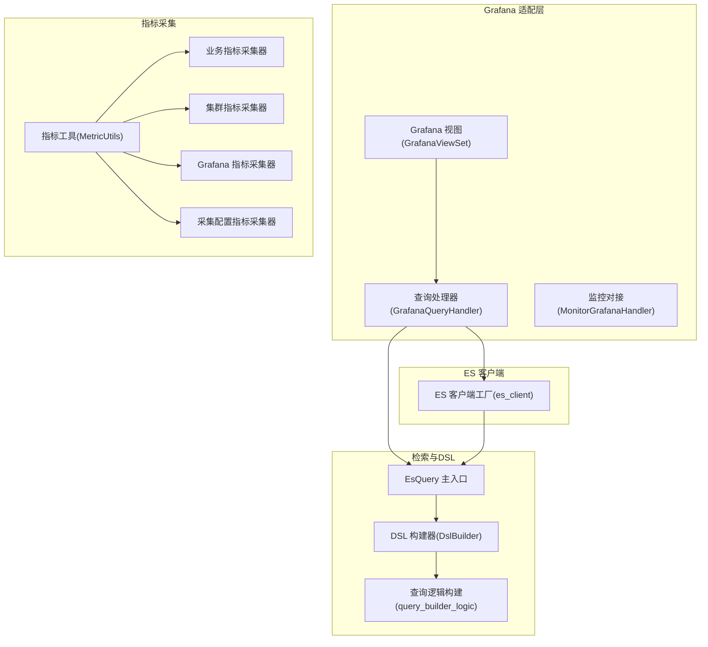
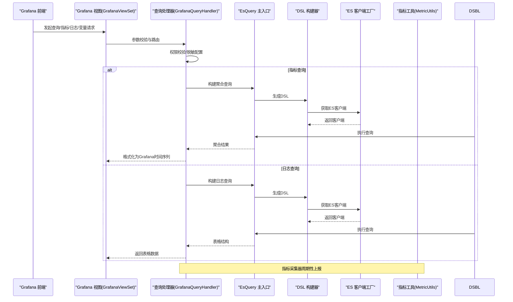
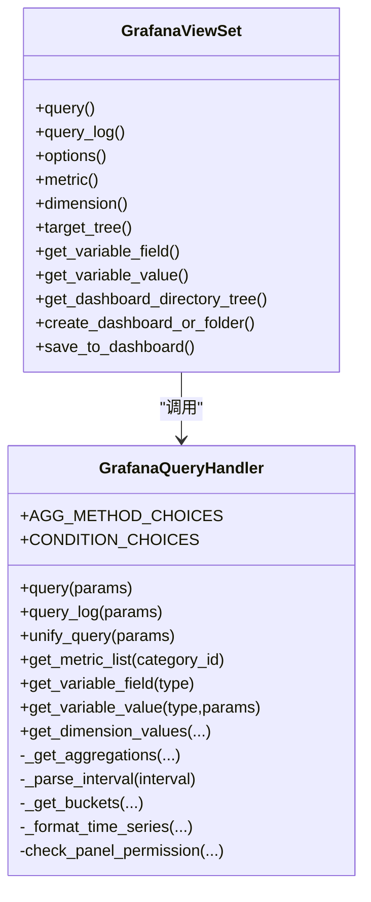
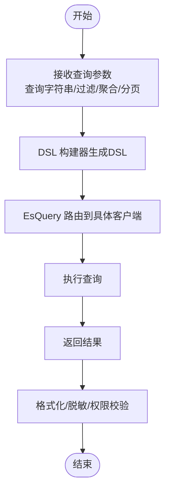
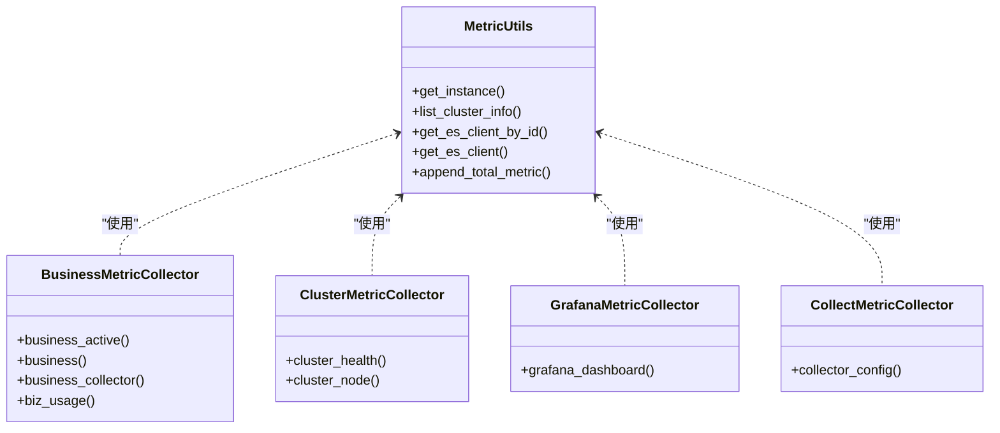
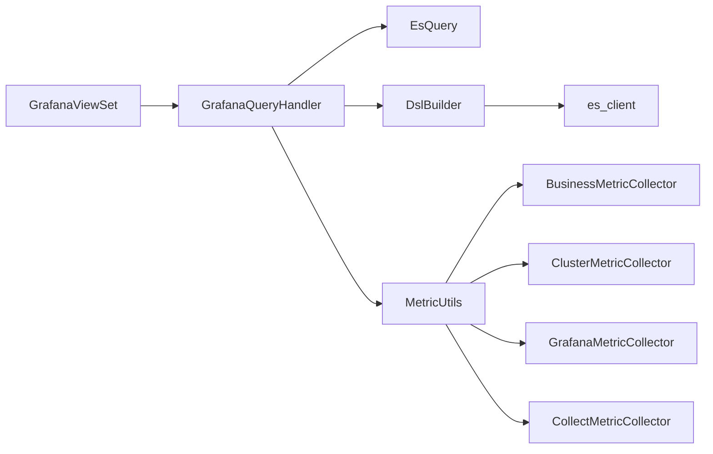

# 自定义图表

<cite>
**本文引用的文件**
- [apps/grafana/views.py](file://apps/grafana/views.py)
- [apps/grafana/handlers/query.py](file://apps/grafana/handlers/query.py)
- [apps/grafana/handlers/monitor.py](file://apps/grafana/handlers/monitor.py)
- [apps/log_esquery/esquery/esquery.py](file://apps/log_esquery/esquery/esquery.py)
- [apps/log_esquery/esquery/dsl_builder/dsl_builder.py](file://apps/log_esquery/esquery/dsl_builder/dsl_builder.py)
- [apps/log_esquery/esquery/dsl_builder/query_builder/query_builder_logic.py](file://apps/log_esquery/esquery/dsl_builder/query_builder/query_builder_logic.py)
- [apps/log_esquery/views/esquery_views.py](file://apps/log_esquery/views/esquery_views.py)
- [apps/log_esquery/utils/es_client.py](file://apps/log_esquery/utils/es_client.py)
- [apps/log_measure/utils/metric.py](file://apps/log_measure/utils/metric.py)
- [apps/log_measure/constants.py](file://apps/log_measure/constants.py)
- [apps/log_measure/handlers/metrics.py](file://apps/log_measure/handlers/metrics.py)
- [apps/log_measure/handlers/metric_collectors/business.py](file://apps/log_measure/handlers/metric_collectors/business.py)
- [apps/log_measure/handlers/metric_collectors/cluster.py](file://apps/log_measure/handlers/metric_collectors/cluster.py)
- [apps/log_measure/handlers/metric_collectors/grafana.py](file://apps/log_measure/handlers/metric_collectors/grafana.py)
- [apps/log_measure/handlers/metric_collectors/log_databus.py](file://apps/log_measure/handlers/metric_collectors/log_databus.py)
- [apps/log_measure/handlers/metric_collectors/es_stats.py](file://apps/log_measure/handlers/metric_collectors/es_stats.py)
- [apps/log_measure/handlers/metric_collectors/es_indices.py](file://apps/log_measure/handlers/metric_collectors/es_indices.py)
</cite>

## 目录
1. [简介](#简介)
2. [项目结构](#项目结构)
3. [核心组件](#核心组件)
4. [架构总览](#架构总览)
5. [详细组件分析](#详细组件分析)
6. [依赖分析](#依赖分析)
7. [性能考虑](#性能考虑)
8. [故障排查指南](#故障排查指南)
9. [结论](#结论)
10. [附录：开发指南与示例](#附录开发指南与示例)

## 简介
本技术文档围绕“自定义图表”模块展开，系统性阐述图表组件的设计架构、渲染引擎、数据绑定机制与交互功能；同时深入解析监控指标采集器的实现原理（指标定义、采集与上报）、Elasticsearch 集成方案（查询优化、聚合计算、数据分页）以及图表数据的实时更新机制（WebSocket、增量更新与缓存策略）。最后提供图表组件的开发指南（组件注册、样式定制、事件处理）与丰富的图表示例及性能优化建议。

## 项目结构
自定义图表能力由多模块协同实现：
- Grafana 适配层：提供 Grafana 代理、指标/日志查询、变量与拓扑树等接口，作为外部可视化引擎与平台内部检索/指标系统的桥梁。
- 检索与DSL构建：基于 DSL 构建器将前端查询条件转化为 Elasticsearch 查询，支持聚合、排序、高亮、折叠与分页。
- 指标采集与上报：统一的指标采集器体系，按时间窗口聚合并上报至监控平台。
- Elasticsearch 客户端与路由：负责 ES 版本兼容、连接探测、认证与请求路由。

**图示来源**
- [apps/grafana/views.py:149-593](file://apps/grafana/views.py#L149-L593)
- [apps/grafana/handlers/query.py:59-825](file://apps/grafana/handlers/query.py#L59-L825)
- [apps/log_esquery/esquery/esquery.py:366-404](file://apps/log_esquery/esquery/esquery.py#L366-L404)
- [apps/log_esquery/esquery/dsl_builder/dsl_builder.py:34-61](file://apps/log_esquery/esquery/dsl_builder/dsl_builder.py#L34-L61)
- [apps/log_esquery/esquery/dsl_builder/query_builder/query_builder_logic.py:374-738](file://apps/log_esquery/esquery/dsl_builder/query_builder/query_builder_logic.py#L374-L738)
- [apps/log_esquery/utils/es_client.py:40-123](file://apps/log_esquery/utils/es_client.py#L40-L123)
- [apps/log_measure/utils/metric.py:33-151](file://apps/log_measure/utils/metric.py#L33-L151)
- [apps/log_measure/handlers/metric_collectors/business.py:53-285](file://apps/log_measure/handlers/metric_collectors/business.py#L53-L285)
- [apps/log_measure/handlers/metric_collectors/cluster.py:33-195](file://apps/log_measure/handlers/metric_collectors/cluster.py#L33-L195)
- [apps/log_measure/handlers/metric_collectors/grafana.py:33-81](file://apps/log_measure/handlers/metric_collectors/grafana.py#L33-L81)
- [apps/log_measure/handlers/metric_collectors/log_databus.py:55-83](file://apps/log_measure/handlers/metric_collectors/log_databus.py#L55-L83)

**章节来源**
- [apps/grafana/views.py:149-593](file://apps/grafana/views.py#L149-L593)
- [apps/log_esquery/esquery/esquery.py:366-404](file://apps/log_esquery/esquery/esquery.py#L366-L404)

## 核心组件
- 图表渲染与查询适配
  - Grafana 视图层：提供指标查询、日志查询、变量与维度取值、拓扑树、仪表盘目录树、保存到监控等接口。
  - 查询处理器：将 Grafana 的查询参数映射为平台内部检索参数，支持聚合、时间直方图、维度桶、脱敏与权限校验。
- 检索与DSL构建
  - EsQuery 主入口：封装场景化查询、集群路由与客户端获取。
  - DSL 构建器：将查询字符串、过滤条件、聚合、排序、高亮、折叠、分页等映射为 Elasticsearch DSL。
- 指标采集与上报
  - 指标工具：统一业务、空间、集群信息与上报时间戳管理；提供 ES 客户端缓存与连接探测。
  - 多类采集器：业务活跃度、集群健康、Grafana 仪表盘、采集配置、日志搜索等。
- ES 客户端与路由
  - ES 客户端工厂：按版本选择底层客户端，处理 IPv6 地址格式、认证与连接探测。

**章节来源**
- [apps/grafana/handlers/query.py:59-825](file://apps/grafana/handlers/query.py#L59-L825)
- [apps/log_esquery/esquery/dsl_builder/dsl_builder.py:34-61](file://apps/log_esquery/esquery/dsl_builder/dsl_builder.py#L34-L61)
- [apps/log_measure/utils/metric.py:33-151](file://apps/log_measure/utils/metric.py#L33-L151)
- [apps/log_measure/handlers/metric_collectors/business.py:53-285](file://apps/log_measure/handlers/metric_collectors/business.py#L53-L285)
- [apps/log_measure/handlers/metric_collectors/cluster.py:33-195](file://apps/log_measure/handlers/metric_collectors/cluster.py#L33-L195)
- [apps/log_esquery/utils/es_client.py:40-123](file://apps/log_esquery/utils/es_client.py#L40-L123)

## 架构总览
下图展示从 Grafana 到平台内部检索与指标采集的整体流程，以及 ES 客户端与 DSL 构建器的协作关系。

**图示来源**
- [apps/grafana/views.py:196-302](file://apps/grafana/views.py#L196-L302)
- [apps/grafana/handlers/query.py:278-462](file://apps/grafana/handlers/query.py#L278-L462)
- [apps/log_esquery/esquery/esquery.py:366-404](file://apps/log_esquery/esquery/esquery.py#L366-L404)
- [apps/log_esquery/esquery/dsl_builder/dsl_builder.py:34-61](file://apps/log_esquery/esquery/dsl_builder/dsl_builder.py#L34-L61)
- [apps/log_esquery/utils/es_client.py:40-123](file://apps/log_esquery/utils/es_client.py#L40-L123)
- [apps/log_measure/utils/metric.py:33-151](file://apps/log_measure/utils/metric.py#L33-L151)

## 详细组件分析

### Grafana 视图与查询处理器
- Grafana 视图层提供指标查询、日志查询、变量与维度取值、拓扑树、仪表盘目录树、保存到监控等接口，统一参数校验与权限控制。
- 查询处理器负责：
  - 聚合构建：时间直方图、维度桶、聚合方法映射。
  - 结果格式化：转换为 Grafana 时间序列格式，支持维度组合与目标标签。
  - 权限校验：校验面板配置与索引集权限，必要时回退到索引集检索权限。
  - 统一查询：在特性开关开启时走统一查询聚合处理器，否则走传统检索处理器。
  - 变量与维度：支持主机/模块/集群变量、维度取值查询、索引集变量等。

**图示来源**
- [apps/grafana/views.py:149-593](file://apps/grafana/views.py#L149-L593)
- [apps/grafana/handlers/query.py:59-825](file://apps/grafana/handlers/query.py#L59-L825)

**章节来源**
- [apps/grafana/views.py:196-593](file://apps/grafana/views.py#L196-L593)
- [apps/grafana/handlers/query.py:89-179](file://apps/grafana/handlers/query.py#L89-L179)

### 检索与DSL构建
- EsQuery 主入口：负责场景化查询、集群路由与客户端获取，支持集群信息查询、cat indices、路由转发等。
- DSL 构建器：接收查询字符串、过滤条件、时间范围、聚合、排序、高亮、折叠、分页等参数，输出标准 Elasticsearch DSL。
- 查询逻辑构建：将复杂条件（如范围、通配、布尔、比较运算）映射为 DSL 的 bool/filter/should 等子句，并支持条件分组与连接符。

**图示来源**
- [apps/log_esquery/esquery/esquery.py:366-404](file://apps/log_esquery/esquery/esquery.py#L366-L404)
- [apps/log_esquery/esquery/dsl_builder/dsl_builder.py:34-61](file://apps/log_esquery/esquery/dsl_builder/dsl_builder.py#L34-L61)
- [apps/log_esquery/esquery/dsl_builder/query_builder/query_builder_logic.py:374-738](file://apps/log_esquery/esquery/dsl_builder/query_builder/query_builder_logic.py#L374-L738)

**章节来源**
- [apps/log_esquery/esquery/esquery.py:366-404](file://apps/log_esquery/esquery/esquery.py#L366-L404)
- [apps/log_esquery/esquery/dsl_builder/dsl_builder.py:34-61](file://apps/log_esquery/esquery/dsl_builder/dsl_builder.py#L34-L61)
- [apps/log_esquery/esquery/dsl_builder/query_builder/query_builder_logic.py:712-738](file://apps/log_esquery/esquery/dsl_builder/query_builder/query_builder_logic.py#L712-L738)

### 指标采集器体系
- 指标工具：统一管理业务/空间/集群信息、上报时间戳与 ES 客户端缓存，提供集群列表缓存与连接探测。
- 采集器类型：
  - 业务指标：活跃业务、业务总量、采集配置业务数、功能使用业务数等。
  - 集群指标：集群健康度、节点资源与负载、磁盘使用率、集群数量等。
  - Grafana 指标：业务下仪表盘数、面板数等。
  - 采集配置指标：采集配置状态分布等。
  - ES 监控指标：ES 统计与索引集信息（预留扩展）。
- 注册机制：通过装饰器注册指标，统一上报到监控平台。

**图示来源**
- [apps/log_measure/utils/metric.py:33-151](file://apps/log_measure/utils/metric.py#L33-L151)
- [apps/log_measure/handlers/metric_collectors/business.py:53-285](file://apps/log_measure/handlers/metric_collectors/business.py#L53-L285)
- [apps/log_measure/handlers/metric_collectors/cluster.py:33-195](file://apps/log_measure/handlers/metric_collectors/cluster.py#L33-L195)
- [apps/log_measure/handlers/metric_collectors/grafana.py:33-81](file://apps/log_measure/handlers/metric_collectors/grafana.py#L33-L81)
- [apps/log_measure/handlers/metric_collectors/log_databus.py:55-83](file://apps/log_measure/handlers/metric_collectors/log_databus.py#L55-L83)

**章节来源**
- [apps/log_measure/utils/metric.py:33-151](file://apps/log_measure/utils/metric.py#L33-L151)
- [apps/log_measure/handlers/metric_collectors/business.py:53-285](file://apps/log_measure/handlers/metric_collectors/business.py#L53-L285)
- [apps/log_measure/handlers/metric_collectors/cluster.py:33-195](file://apps/log_measure/handlers/metric_collectors/cluster.py#L33-L195)
- [apps/log_measure/handlers/metric_collectors/grafana.py:33-81](file://apps/log_measure/handlers/metric_collectors/grafana.py#L33-L81)
- [apps/log_measure/handlers/metric_collectors/log_databus.py:55-83](file://apps/log_measure/handlers/metric_collectors/log_databus.py#L55-L83)

### Elasticsearch 集成与查询优化
- 版本兼容与连接：根据 ES 版本选择底层客户端，自动处理 IPv6 地址格式，支持认证与连接探测。
- 查询优化要点：
  - 使用 doc_values 字段进行聚合与术语聚合，减少内存与IO开销。
  - 合理设置聚合 size，避免大桶导致的性能问题。
  - 使用时间直方图聚合与区间解析，确保时间轴连续性。
  - 在统一查询模式下，优先使用聚合处理器以减少重复逻辑。
- 聚合计算：支持 COUNT/SUM/MIN/MAX/AVG/UNIQUE_COUNT 等方法，支持多维桶与时间分桶。
- 数据分页：通过 DSL 构建器的分页参数与 search_after 机制实现高效分页。

**章节来源**
- [apps/log_esquery/utils/es_client.py:40-123](file://apps/log_esquery/utils/es_client.py#L40-L123)
- [apps/grafana/handlers/query.py:89-113](file://apps/grafana/handlers/query.py#L89-L113)
- [apps/log_esquery/esquery/dsl_builder/dsl_builder.py:34-61](file://apps/log_esquery/esquery/dsl_builder/dsl_builder.py#L34-L61)

### 图表数据实时更新机制
- WebSocket 连接：平台未直接提供 WebSocket 通道，但可通过外部 Grafana 配置与平台指标/日志查询接口实现轮询或长轮询。
- 增量更新：结合时间直方图与增量时间窗口，仅拉取新增数据点；聚合结果按维度组合进行增量合并。
- 缓存策略：指标工具对集群信息与 ES 客户端进行缓存，降低重复初始化成本；查询视图层对查询耗时与次数进行指标埋点，便于性能观测。

**章节来源**
- [apps/log_measure/utils/metric.py:71-123](file://apps/log_measure/utils/metric.py#L71-L123)
- [apps/log_esquery/views/esquery_views.py:216-256](file://apps/log_esquery/views/esquery_views.py#L216-L256)

## 依赖分析
- 组件耦合
  - Grafana 视图层依赖查询处理器与权限模块；查询处理器依赖检索处理器、统一查询聚合处理器与 ES 客户端工厂。
  - 指标采集器依赖指标工具与监控平台注册机制；ES 客户端工厂被检索与指标模块共同使用。
- 外部依赖
  - Grafana 客户端库用于组织与仪表盘操作。
  - Elasticsearch 客户端库按版本动态选择，支持认证与连接探测。
- 循环依赖
  - 代码层面未见循环导入；各模块职责清晰，通过接口与参数传递进行交互。

**图示来源**
- [apps/grafana/views.py:149-593](file://apps/grafana/views.py#L149-L593)
- [apps/grafana/handlers/query.py:59-825](file://apps/grafana/handlers/query.py#L59-L825)
- [apps/log_esquery/esquery/esquery.py:366-404](file://apps/log_esquery/esquery/esquery.py#L366-L404)
- [apps/log_esquery/esquery/dsl_builder/dsl_builder.py:34-61](file://apps/log_esquery/esquery/dsl_builder/dsl_builder.py#L34-L61)
- [apps/log_esquery/utils/es_client.py:40-123](file://apps/log_esquery/utils/es_client.py#L40-L123)
- [apps/log_measure/utils/metric.py:33-151](file://apps/log_measure/utils/metric.py#L33-L151)
- [apps/log_measure/handlers/metric_collectors/business.py:53-285](file://apps/log_measure/handlers/metric_collectors/business.py#L53-L285)
- [apps/log_measure/handlers/metric_collectors/cluster.py:33-195](file://apps/log_measure/handlers/metric_collectors/cluster.py#L33-L195)
- [apps/log_measure/handlers/metric_collectors/grafana.py:33-81](file://apps/log_measure/handlers/metric_collectors/grafana.py#L33-L81)
- [apps/log_measure/handlers/metric_collectors/log_databus.py:55-83](file://apps/log_measure/handlers/metric_collectors/log_databus.py#L55-L83)

**章节来源**
- [apps/grafana/views.py:149-593](file://apps/grafana/views.py#L149-L593)
- [apps/grafana/handlers/query.py:59-825](file://apps/grafana/handlers/query.py#L59-L825)
- [apps/log_esquery/esquery/esquery.py:366-404](file://apps/log_esquery/esquery/esquery.py#L366-L404)
- [apps/log_esquery/esquery/dsl_builder/dsl_builder.py:34-61](file://apps/log_esquery/esquery/dsl_builder/dsl_builder.py#L34-L61)
- [apps/log_esquery/utils/es_client.py:40-123](file://apps/log_esquery/utils/es_client.py#L40-L123)
- [apps/log_measure/utils/metric.py:33-151](file://apps/log_measure/utils/metric.py#L33-L151)
- [apps/log_measure/handlers/metric_collectors/business.py:53-285](file://apps/log_measure/handlers/metric_collectors/business.py#L53-L285)
- [apps/log_measure/handlers/metric_collectors/cluster.py:33-195](file://apps/log_measure/handlers/metric_collectors/cluster.py#L33-L195)
- [apps/log_measure/handlers/metric_collectors/grafana.py:33-81](file://apps/log_measure/handlers/metric_collectors/grafana.py#L33-L81)
- [apps/log_measure/handlers/metric_collectors/log_databus.py:55-83](file://apps/log_measure/handlers/metric_collectors/log_databus.py#L55-L83)

## 性能考虑
- 聚合优化
  - 优先使用 doc_values 字段进行 terms/聚合，避免脚本字段带来的性能损耗。
  - 控制聚合桶大小，合理设置 size，避免超大桶导致内存压力。
- 查询优化
  - 使用时间直方图聚合与区间解析，确保时间轴连续性与查询效率。
  - 在统一查询模式下，利用聚合处理器减少重复逻辑与网络往返。
- 客户端与连接
  - ES 客户端工厂按版本选择底层客户端，自动处理 IPv6 地址格式，提升兼容性与稳定性。
  - 指标工具对集群信息与 ES 客户端进行缓存，降低重复初始化成本。
- 指标埋点
  - 查询视图层对查询耗时与次数进行指标埋点，便于性能观测与告警。

**章节来源**
- [apps/grafana/handlers/query.py:89-113](file://apps/grafana/handlers/query.py#L89-L113)
- [apps/log_esquery/esquery/dsl_builder/query_builder/query_builder_logic.py:712-738](file://apps/log_esquery/esquery/dsl_builder/query_builder/query_builder_logic.py#L712-L738)
- [apps/log_esquery/utils/es_client.py:40-123](file://apps/log_esquery/utils/es_client.py#L40-L123)
- [apps/log_measure/utils/metric.py:71-123](file://apps/log_measure/utils/metric.py#L71-L123)
- [apps/log_esquery/views/esquery_views.py:216-256](file://apps/log_esquery/views/esquery_views.py#L216-L256)

## 故障排查指南
- 权限与面板校验
  - 若面板配置与索引集不一致，将触发权限校验失败；需确认面板配置或提升检索权限。
- ES 连接与认证
  - ES 客户端工厂提供连接探测与认证异常处理，若出现连接失败，检查主机、端口、认证信息与网络连通性。
- 指标采集异常
  - 指标采集器在异常情况下会记录日志并跳过该集群，确保整体采集稳定；需关注日志异常信息定位问题。
- 查询耗时与错误
  - 查询视图层对查询耗时与错误进行指标埋点，便于定位慢查询与错误原因。

**章节来源**
- [apps/grafana/handlers/query.py:196-250](file://apps/grafana/handlers/query.py#L196-L250)
- [apps/log_esquery/utils/es_client.py:80-123](file://apps/log_esquery/utils/es_client.py#L80-L123)
- [apps/log_measure/handlers/metric_collectors/cluster.py:87-89](file://apps/log_measure/handlers/metric_collectors/cluster.py#L87-L89)
- [apps/log_esquery/views/esquery_views.py:216-256](file://apps/log_esquery/views/esquery_views.py#L216-L256)

## 结论
自定义图表模块通过 Grafana 适配层与平台内部检索/指标系统深度集成，形成“查询参数—DSL 构建—ES 执行—结果格式化”的完整链路。指标采集器体系覆盖业务、集群、Grafana 与采集配置等多个维度，配合 ES 客户端工厂与查询视图层的性能埋点，为图表渲染提供了稳定、高效的数据基础。未来可在 WebSocket 增量推送、缓存预热与聚合裁剪等方面进一步优化。

## 附录：开发指南与示例

### 组件注册与扩展
- 新增指标采集器
  - 在指标工具中注册采集器，使用装饰器声明指标名称、描述、数据源与时间粒度。
  - 在常量中注册采集器模块路径，确保定时任务扫描到新采集器。
- 新增查询接口
  - 在视图层新增路由与序列化器，参数校验后交由查询处理器处理。
  - 在查询处理器中扩展聚合逻辑与结果格式化。

**章节来源**
- [apps/log_measure/utils/metric.py:33-151](file://apps/log_measure/utils/metric.py#L33-L151)
- [apps/log_measure/constants.py:51-76](file://apps/log_measure/constants.py#L51-L76)
- [apps/grafana/views.py:196-302](file://apps/grafana/views.py#L196-L302)
- [apps/grafana/handlers/query.py:278-462](file://apps/grafana/handlers/query.py#L278-L462)

### 样式定制与事件处理
- 样式定制
  - 通过 Grafana 面板的“目标”与“维度”配置，结合查询处理器的时间直方图与维度桶，实现多维时间序列展示。
  - 使用脱敏配置对敏感字段进行脱敏处理，保障数据安全。
- 事件处理
  - 在视图层对查询耗时与错误进行指标埋点，便于性能观测与告警。
  - 在查询处理器中对权限校验与面板配置进行严格校验，确保访问安全。

**章节来源**
- [apps/grafana/handlers/query.py:133-179](file://apps/grafana/handlers/query.py#L133-L179)
- [apps/log_esquery/views/esquery_views.py:216-256](file://apps/log_esquery/views/esquery_views.py#L216-L256)

### 图表示例与最佳实践
- 指标趋势图
  - 使用时间直方图聚合与多维度桶，展示业务活跃度、集群健康度等指标随时间变化的趋势。
- 日志表格
  - 使用统一查询聚合处理器，返回表格列与行，支持排序与高亮。
- 仪表盘集成
  - 通过监控对接接口将查询结果保存到监控仪表盘，实现跨系统联动。

**章节来源**
- [apps/grafana/handlers/query.py:407-462](file://apps/grafana/handlers/query.py#L407-L462)
- [apps/grafana/handlers/monitor.py:7-38](file://apps/grafana/handlers/monitor.py#L7-L38)