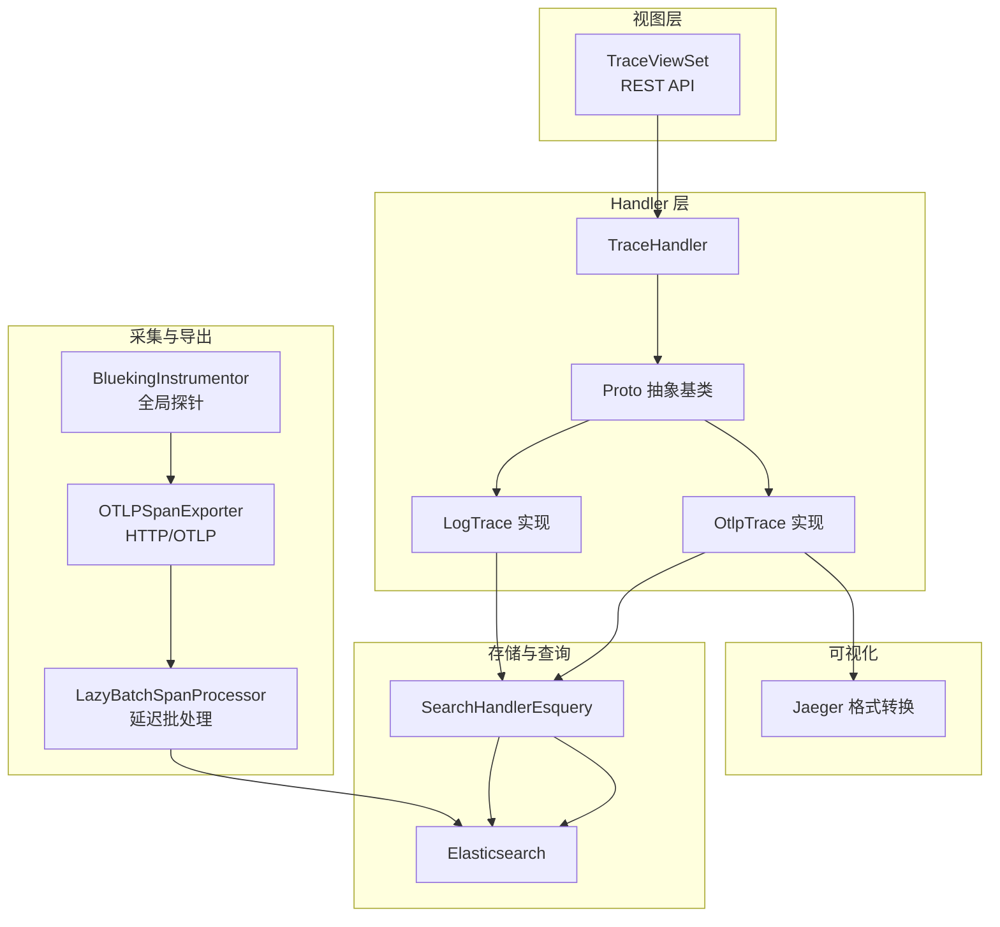
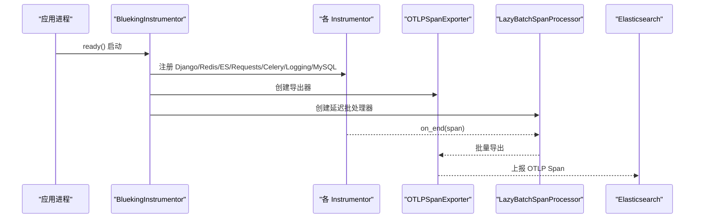
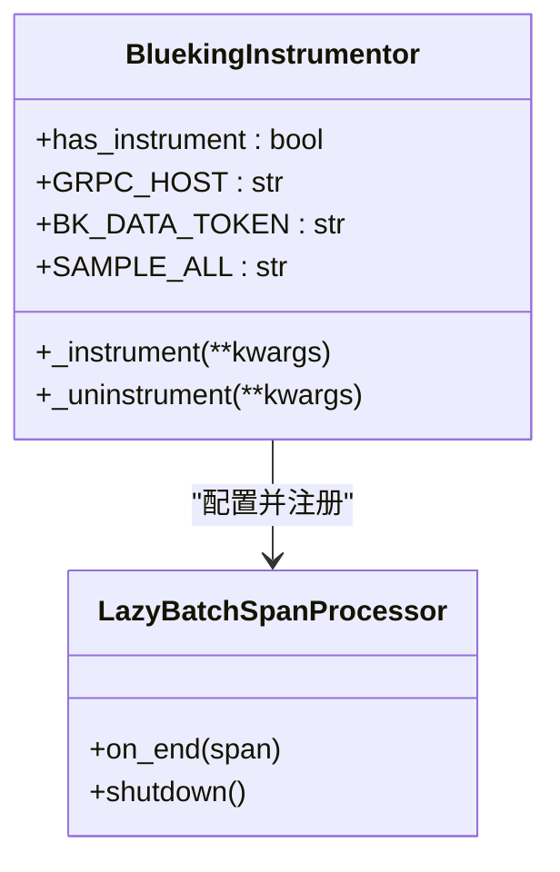
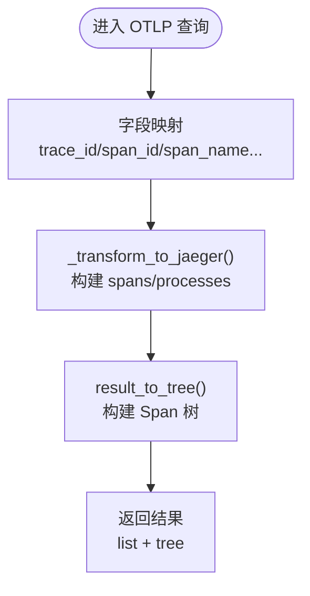
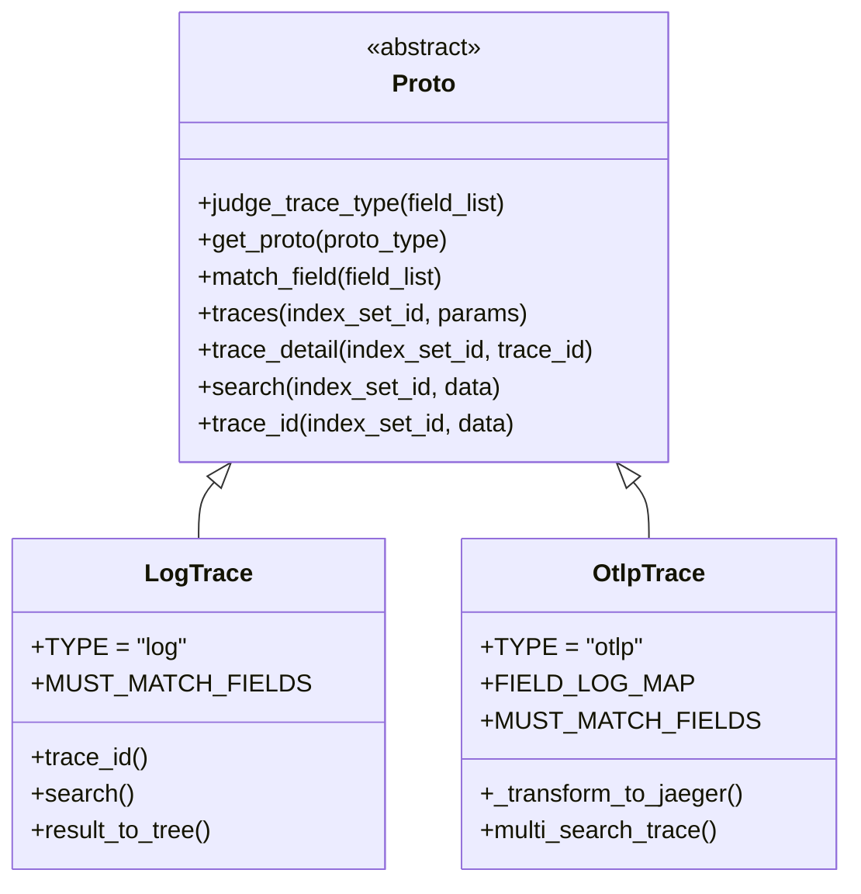
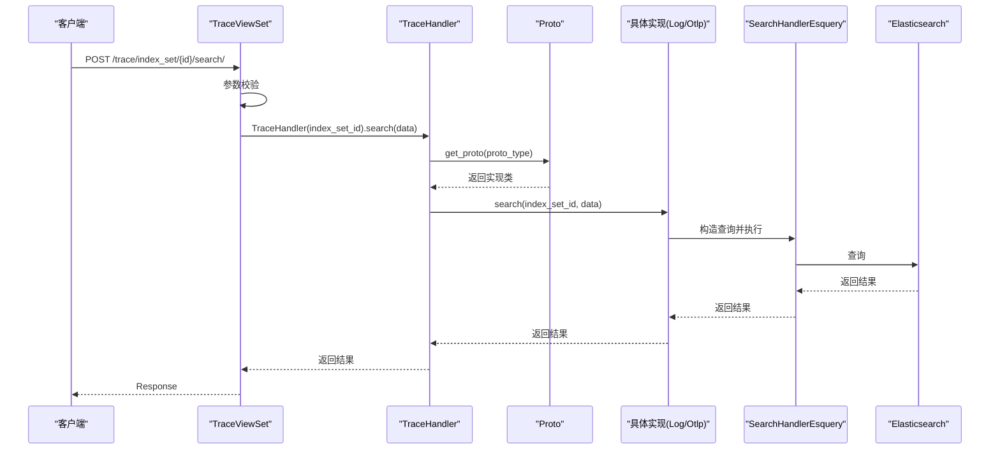
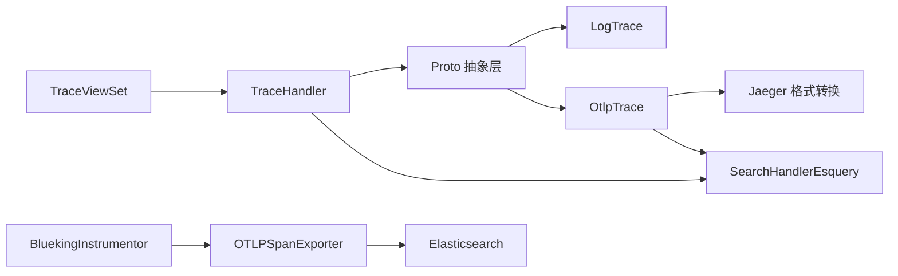

# 链路追踪监控

<cite>
**本文引用的文件**
- [apps/log_trace/trace/__init__.py](file://apps/log_trace/trace/__init__.py)
- [apps/log_trace/trace/elastic.py](file://apps/log_trace/trace/elastic.py)
- [apps/log_trace/apps.py](file://apps/log_trace/apps.py)
- [apps/log_trace/handlers/proto/otlp.py](file://apps/log_trace/handlers/proto/otlp.py)
- [apps/log_trace/handlers/proto/proto.py](file://apps/log_trace/handlers/proto/proto.py)
- [apps/log_trace/handlers/trace_handlers.py](file://apps/log_trace/handlers/trace_handlers.py)
- [apps/log_trace/views/trace_views.py](file://apps/log_trace/views/trace_views.py)
- [apps/log_trace/urls.py](file://apps/log_trace/urls.py)
- [apps/log_trace/constants.py](file://apps/log_trace/constants.py)
- [apps/log_trace/exceptions.py](file://apps/log_trace/exceptions.py)
- [apps/log_trace/serializers.py](file://apps/log_trace/serializers.py)
- [docs/wiki/log_trace/01-OpenTelemetry集成.md](file://docs/wiki/log_trace/01-OpenTelemetry集成.md)
- [docs/wiki/log_trace/02-Trace查询实现.md](file://docs/wiki/log_trace/02-Trace查询实现.md)
- [locale/zh_CN/LC_MESSAGES/django.po](file://locale/zh_CN/LC_MESSAGES/django.po)
- [locale/en/LC_MESSAGES/django.po](file://locale/en/LC_MESSAGES/django.po)
</cite>

## 目录
1. [简介](#简介)
2. [项目结构](#项目结构)
3. [核心组件](#核心组件)
4. [架构总览](#架构总览)
5. [详细组件分析](#详细组件分析)
6. [依赖分析](#依赖分析)
7. [性能考量](#性能考量)
8. [故障排查指南](#故障排查指南)
9. [结论](#结论)
10. [附录](#附录)

## 简介
本技术文档面向“链路追踪监控”模块，系统性阐述 OpenTelemetry 协议集成、数据格式转换与传输优化、链路数据处理流程、分布式追踪实现原理（Trace ID 生成、Span 关系构建、上下文传递）、链路拓扑可视化（节点布局、边连接、交互）、最佳实践（采样策略、性能优化、故障排查），并提供可落地的配置示例与监控场景应用。

## 项目结构
- 模块定位：apps/log_trace
- 关键层次：
  - 视图层：REST API，提供索引集、查询、字段配置、TraceID 搜索、散点图等接口
  - Handler 层：TraceHandler 协调协议实现；Proto 抽象协议基类
  - 协议实现：LogTrace（日志平台协议）、OtlpTrace（OTLP 协议）
  - 采集与导出：BluekingInstrumentor 全局探针，自动埋点与 OTLP 导出
  - 存储与查询：基于 Elasticsearch 的搜索与聚合
  - 可视化：前端组件消费统一的 Jaeger 格式数据

**图表来源**
- [apps/log_trace/views/trace_views.py:45-543](file://apps/log_trace/views/trace_views.py#L45-L543)
- [apps/log_trace/handlers/trace_handlers.py:27-57](file://apps/log_trace/handlers/trace_handlers.py#L27-L57)
- [apps/log_trace/handlers/proto/proto.py:35-278](file://apps/log_trace/handlers/proto/proto.py#L35-L278)
- [apps/log_trace/handlers/proto/otlp.py:45-453](file://apps/log_trace/handlers/proto/otlp.py#L45-L453)
- [apps/log_trace/trace/__init__.py:211-302](file://apps/log_trace/trace/__init__.py#L211-L302)

**章节来源**
- [apps/log_trace/urls.py:22-35](file://apps/log_trace/urls.py#L22-L35)
- [apps/log_trace/views/trace_views.py:45-543](file://apps/log_trace/views/trace_views.py#L45-L543)

## 核心组件
- BluekingInstrumentor：全局 OpenTelemetry 探针，统一注册 Django、Redis、Elasticsearch、Requests、Celery、Logging、MySQL 等 Instrumentor，并配置 OTLP 导出器与采样策略
- OtlpTrace：OTLP 协议适配器，负责字段映射、Jaeger 格式转换、Span 树构建、TraceID 搜索与批量查询
- Proto 抽象基类：定义协议接口、字段匹配、聚合查询、Trace 列表查询等通用能力
- TraceHandler：根据索引集字段自动识别协议类型，委托具体实现执行查询
- TraceViewSet：REST API 入口，提供索引集列表、字段配置、通用搜索、TraceID 搜索、散点图等接口

**章节来源**
- [apps/log_trace/trace/__init__.py:211-302](file://apps/log_trace/trace/__init__.py#L211-L302)
- [apps/log_trace/handlers/proto/otlp.py:45-453](file://apps/log_trace/handlers/proto/otlp.py#L45-L453)
- [apps/log_trace/handlers/proto/proto.py:35-278](file://apps/log_trace/handlers/proto/proto.py#L35-L278)
- [apps/log_trace/handlers/trace_handlers.py:27-57](file://apps/log_trace/handlers/trace_handlers.py#L27-L57)
- [apps/log_trace/views/trace_views.py:45-543](file://apps/log_trace/views/trace_views.py#L45-L543)

## 架构总览
OpenTelemetry 集成采用“自动埋点 + OTLP 导出”的方式，BluekingInstrumentor 在应用启动时按特性开关启用，注册各类 Instrumentor 并配置 OTLPSpanExporter。OTLP 数据写入 Elasticsearch，Trace 查询通过 TraceHandler 与 Proto 抽象层完成协议识别与功能分发，最终以 Jaeger 格式输出供前端可视化。

**图表来源**
- [apps/log_trace/apps.py:32-38](file://apps/log_trace/apps.py#L32-L38)
- [apps/log_trace/trace/__init__.py:226-290](file://apps/log_trace/trace/__init__.py#L226-L290)

**章节来源**
- [apps/log_trace/apps.py:28-38](file://apps/log_trace/apps.py#L28-L38)
- [docs/wiki/log_trace/01-OpenTelemetry集成.md:1-411](file://docs/wiki/log_trace/01-OpenTelemetry集成.md#L1-L411)

## 详细组件分析

### OpenTelemetry 集成与 OTLP 导出
- 全局探针 BluekingInstrumentor：按特性开关启用，构造 Resource（含服务名、版本、环境、蓝鲸数据令牌、主机信息等），配置采样器（定时任务默认关闭，普通请求默认关闭，可通过配置开启全量采样），注册各组件 Instrumentor，并注入自定义 Hook（Django 请求/响应、Requests 回调）
- OTLPSpanExporter：通过 HTTP/OTLP 协议上报至指定 endpoint
- LazyBatchSpanProcessor：延迟批处理，首个 Span 到达时启动工作线程，避免启动时创建无关线程

**图表来源**
- [apps/log_trace/trace/__init__.py:211-302](file://apps/log_trace/trace/__init__.py#L211-L302)

**章节来源**
- [apps/log_trace/trace/__init__.py:226-290](file://apps/log_trace/trace/__init__.py#L226-L290)
- [docs/wiki/log_trace/01-OpenTelemetry集成.md:311-348](file://docs/wiki/log_trace/01-OpenTelemetry集成.md#L311-L348)

### OTLP 协议适配与数据格式转换
- 字段映射：OTLP 字段到日志平台字段的映射（如 trace_id→traceID、span_name→operationName 等）
- Jaeger 格式转换：将 OTLP 数据转换为 Jaeger 格式，便于前端组件渲染（包含 spans、processes、references、logs、tags 等）
- Span 树构建：基于 parent_span_id 与 span_id 建立父子关系，支持甘特图与树形图展示
- TraceID 搜索：围绕给定 traceID 扩展时间窗口进行查询，构建树结构并返回

**图表来源**
- [apps/log_trace/handlers/proto/otlp.py:369-453](file://apps/log_trace/handlers/proto/otlp.py#L369-L453)

**章节来源**
- [apps/log_trace/handlers/proto/otlp.py:45-453](file://apps/log_trace/handlers/proto/otlp.py#L45-L453)

### 协议识别与多态实现
- Proto 抽象基类：定义协议接口、字段匹配（MUST_MATCH_FIELDS）、聚合查询、Trace 列表查询等
- 协议识别：通过 judge_trace_type 遍历协议，依据字段类型匹配确定协议类型（log/otlp）
- 动态加载：get_proto 使用 import_string 动态导入具体实现类

**图表来源**
- [apps/log_trace/handlers/proto/proto.py:35-278](file://apps/log_trace/handlers/proto/proto.py#L35-L278)
- [apps/log_trace/handlers/proto/otlp.py:45-122](file://apps/log_trace/handlers/proto/otlp.py#L45-L122)

**章节来源**
- [apps/log_trace/handlers/proto/proto.py:114-192](file://apps/log_trace/handlers/proto/proto.py#L114-L192)
- [apps/log_trace/handlers/proto/otlp.py:45-122](file://apps/log_trace/handlers/proto/otlp.py#L45-L122)

### Trace 查询流程与 API
- TraceViewSet：提供索引集列表、字段配置、通用搜索、TraceID 搜索、散点图等接口
- TraceHandler：根据索引集字段自动识别协议类型，委托具体实现执行查询
- 查询流程：视图层接收参数 → 序列化器校验 → TraceHandler → Proto 实现 → SearchHandlerEsquery → Elasticsearch

**图表来源**
- [apps/log_trace/views/trace_views.py:212-345](file://apps/log_trace/views/trace_views.py#L212-L345)
- [apps/log_trace/handlers/trace_handlers.py:27-57](file://apps/log_trace/handlers/trace_handlers.py#L27-L57)
- [apps/log_trace/handlers/proto/proto.py:222-274](file://apps/log_trace/handlers/proto/proto.py#L222-L274)

**章节来源**
- [apps/log_trace/views/trace_views.py:45-543](file://apps/log_trace/views/trace_views.py#L45-L543)
- [apps/log_trace/handlers/trace_handlers.py:27-57](file://apps/log_trace/handlers/trace_handlers.py#L27-L57)

### Elasticsearch 自定义 Instrumentor
- BkElasticsearchInstrumentor：基于 opentelemetry.instrumentation.elasticsearch 扩展，对 perform_request 进行包装，记录 DB_SYSTEM、URL、Method、Body、Params、DocID、Target 等属性，并设置 span 名称与类型

**章节来源**
- [apps/log_trace/trace/elastic.py:34-136](file://apps/log_trace/trace/elastic.py#L34-L136)

### 链路拓扑可视化与交互
- Jaeger 格式：OTLP 数据转换为 Jaeger 格式，包含 spans、processes、references、logs、tags 等字段，便于前端组件渲染
- 甘特图/树形图：基于 Span 树构建，提供时间轴与父子关系展示
- 交互操作：前端可基于返回的 tree 结构进行展开/折叠、筛选、高亮等操作

**章节来源**
- [apps/log_trace/handlers/proto/otlp.py:369-453](file://apps/log_trace/handlers/proto/otlp.py#L369-L453)

## 依赖分析
- 外部依赖：OpenTelemetry SDK、Instrumentors、Elasticsearch Python 客户端
- 内部依赖：log_search 模块的 SearchHandlerEsquery、AggsHandlers；feature_toggle 特性开关；drf 序列化器与权限控制
- 组件耦合：TraceViewSet 依赖 TraceHandler；TraceHandler 依赖 Proto 抽象层；Proto 依赖具体协议实现；OTLP 协议实现依赖 Jaeger 格式转换

**图表来源**
- [apps/log_trace/views/trace_views.py:45-543](file://apps/log_trace/views/trace_views.py#L45-L543)
- [apps/log_trace/handlers/trace_handlers.py:27-57](file://apps/log_trace/handlers/trace_handlers.py#L27-L57)
- [apps/log_trace/handlers/proto/proto.py:35-278](file://apps/log_trace/handlers/proto/proto.py#L35-L278)
- [apps/log_trace/handlers/proto/otlp.py:369-453](file://apps/log_trace/handlers/proto/otlp.py#L369-L453)
- [apps/log_trace/trace/__init__.py:226-290](file://apps/log_trace/trace/__init__.py#L226-L290)

**章节来源**
- [apps/log_trace/trace/__init__.py:226-290](file://apps/log_trace/trace/__init__.py#L226-L290)
- [apps/log_trace/handlers/proto/otlp.py:369-453](file://apps/log_trace/handlers/proto/otlp.py#L369-L453)

## 性能考量
- 延迟批处理：LazyBatchSpanProcessor 首个 Span 到达时启动工作线程，避免启动时线程开销
- 多线程查询：OtlpTrace.multi_search_trace 使用并发执行多个 TraceID 的查询，提升批量查询性能
- 字段匹配与聚合：Proto.match_field 与 AggsHandlers 用于快速过滤与聚合，减少无效查询
- 采样策略：默认关闭，定时任务强制关闭，可通过特性开关开启全量采样，平衡性能与可观测性

**章节来源**
- [apps/log_trace/trace/__init__.py:184-209](file://apps/log_trace/trace/__init__.py#L184-L209)
- [apps/log_trace/handlers/proto/otlp.py:254-284](file://apps/log_trace/handlers/proto/otlp.py#L254-L284)
- [apps/log_trace/handlers/proto/proto.py:174-192](file://apps/log_trace/handlers/proto/proto.py#L174-L192)

## 故障排查指南
- TraceID 不存在：当 trace_id 搜索无结果时抛出 TraceIDNotExistsException
- 协议不支持：当无法识别协议类型时抛出 ProtoNotSupport
- 请求 Hook 异常：django_request_hook/django_response_hook 对异常进行容错处理，避免影响业务请求
- OTLP 导出问题：检查 OTLP_GRPC_HOST、bk_data_token、采样器配置与特性开关状态

**章节来源**
- [apps/log_trace/exceptions.py:35-47](file://apps/log_trace/exceptions.py#L35-L47)
- [apps/log_trace/trace/__init__.py:139-181](file://apps/log_trace/trace/__init__.py#L139-L181)
- [apps/log_trace/apps.py:32-38](file://apps/log_trace/apps.py#L32-L38)

## 结论
该模块通过 BluekingInstrumentor 实现 OpenTelemetry 的自动埋点与 OTLP 导出，结合 Proto 抽象层与协议实现，实现了对日志平台协议与 OTLP 协议的统一查询与可视化。其设计具备良好的可扩展性与性能优化策略，适用于大规模分布式系统的链路追踪与监控场景。

## 附录

### OpenTelemetry 集成与配置示例
- OTLP 导出器与延迟批处理器配置参见：[apps/log_trace/trace/__init__.py:239-240](file://apps/log_trace/trace/__init__.py#L239-L240)、[apps/log_trace/trace/__init__.py:184-209](file://apps/log_trace/trace/__init__.py#L184-L209)
- 特性开关与采样策略：参见 [apps/log_trace/apps.py:32-38](file://apps/log_trace/apps.py#L32-L38)、[docs/wiki/log_trace/01-OpenTelemetry集成.md:351-385](file://docs/wiki/log_trace/01-OpenTelemetry集成.md#L351-L385)
- OTLP 协议文档与依赖版本参考：[locale/zh_CN/LC_MESSAGES/django.po:7323-7370](file://locale/zh_CN/LC_MESSAGES/django.po#L7323-L7370)、[locale/en/LC_MESSAGES/django.po:7530-7687](file://locale/en/LC_MESSAGES/django.po#L7530-L7687)

### 链路追踪数据处理流程
- 协议识别与字段匹配：参见 [apps/log_trace/handlers/proto/proto.py:114-192](file://apps/log_trace/handlers/proto/proto.py#L114-L192)
- OTLP 到 Jaeger 转换与树构建：参见 [apps/log_trace/handlers/proto/otlp.py:369-453](file://apps/log_trace/handlers/proto/otlp.py#L369-L453)

### 分布式追踪实现原理
- Trace ID 生成：由上游系统或 OTel SDK 生成，模块侧不负责生成
- Span 关系构建：基于 parent_span_id 与 span_id 建立父子关系，参见 [apps/log_trace/handlers/proto/otlp.py:159-207](file://apps/log_trace/handlers/proto/otlp.py#L159-L207)
- 上下文传递：通过 OpenTelemetry 上下文传播机制，结合蓝鲸网关/ESB 的 Header（如 x-bkapi-request-id、x-request-id）进行关联

### 链路拓扑图可视化
- 数据格式：Jaeger 格式（spans、processes、references、logs、tags）
- 前端交互：基于 tree 结构进行展开/折叠、筛选、高亮等

**章节来源**
- [apps/log_trace/handlers/proto/otlp.py:369-453](file://apps/log_trace/handlers/proto/otlp.py#L369-L453)

### 最佳实践
- 采样策略：默认关闭，生产环境建议按需开启；定时任务默认关闭
- 性能优化：使用延迟批处理与并发查询；合理设置字段匹配与聚合
- 故障排查：关注特性开关、导出器 endpoint、采样器状态与异常捕获

**章节来源**
- [apps/log_trace/trace/__init__.py:242-248](file://apps/log_trace/trace/__init__.py#L242-L248)
- [apps/log_trace/handlers/proto/otlp.py:254-284](file://apps/log_trace/handlers/proto/otlp.py#L254-L284)