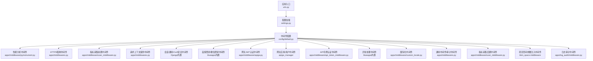
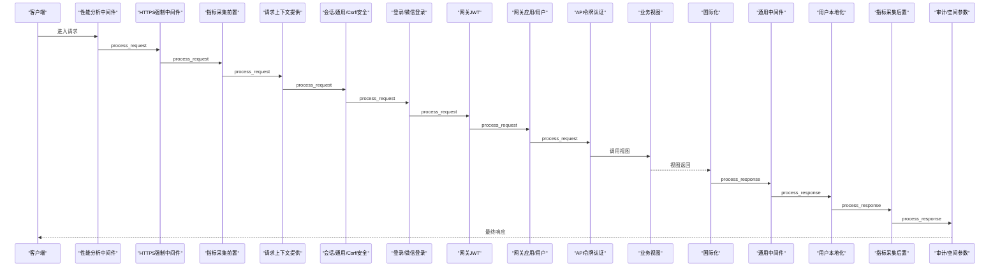
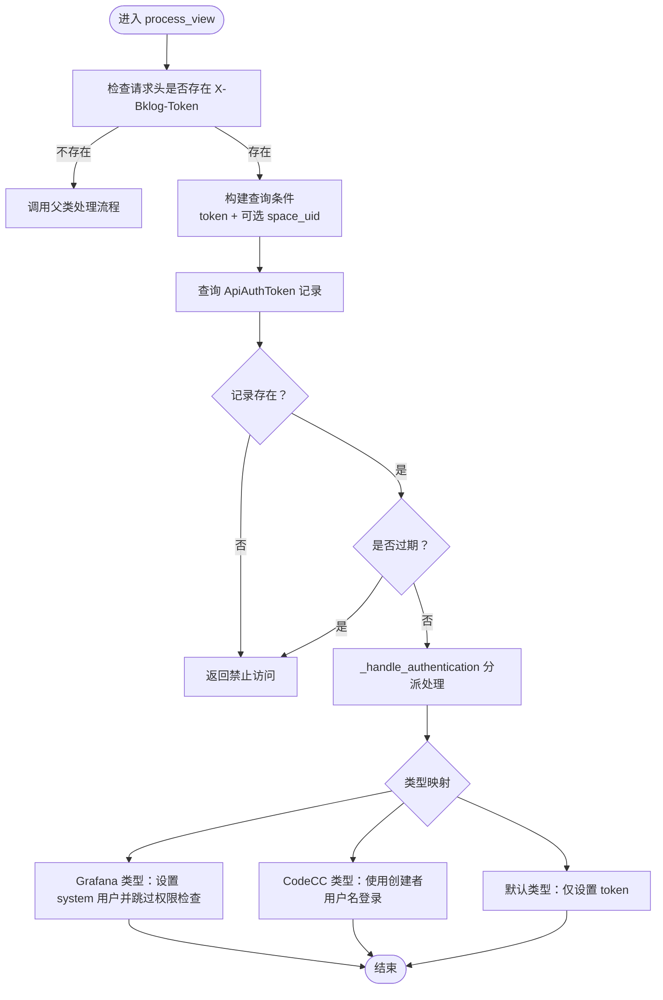
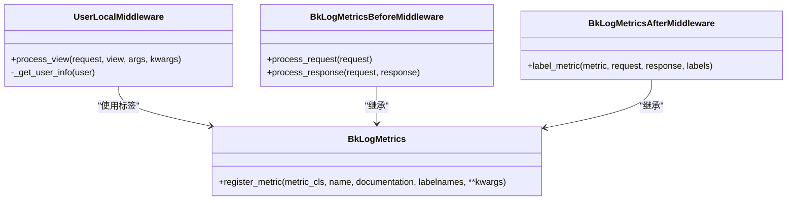
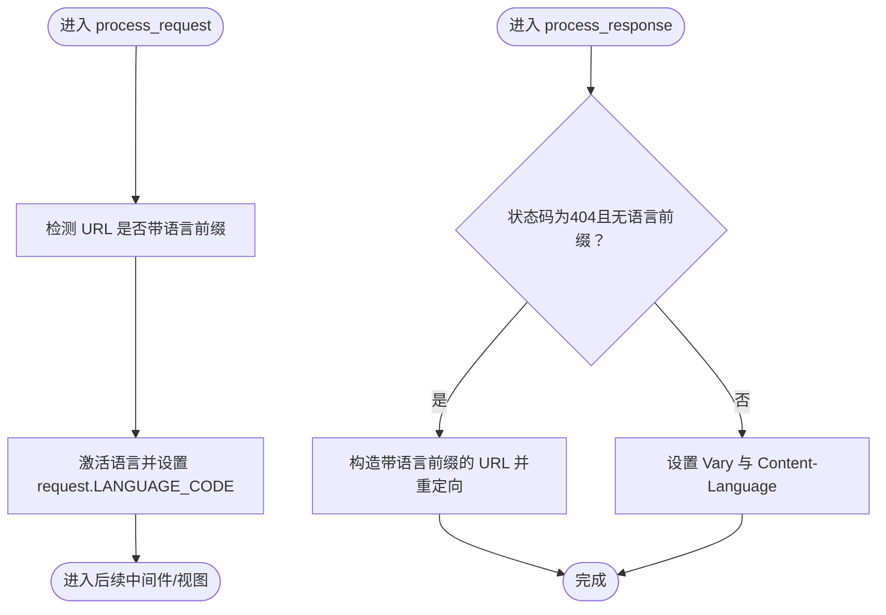
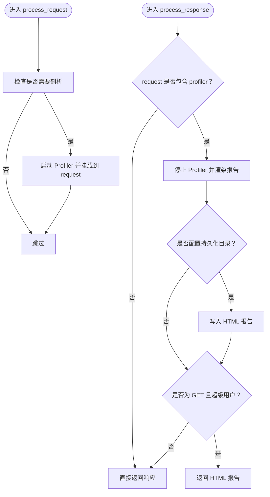
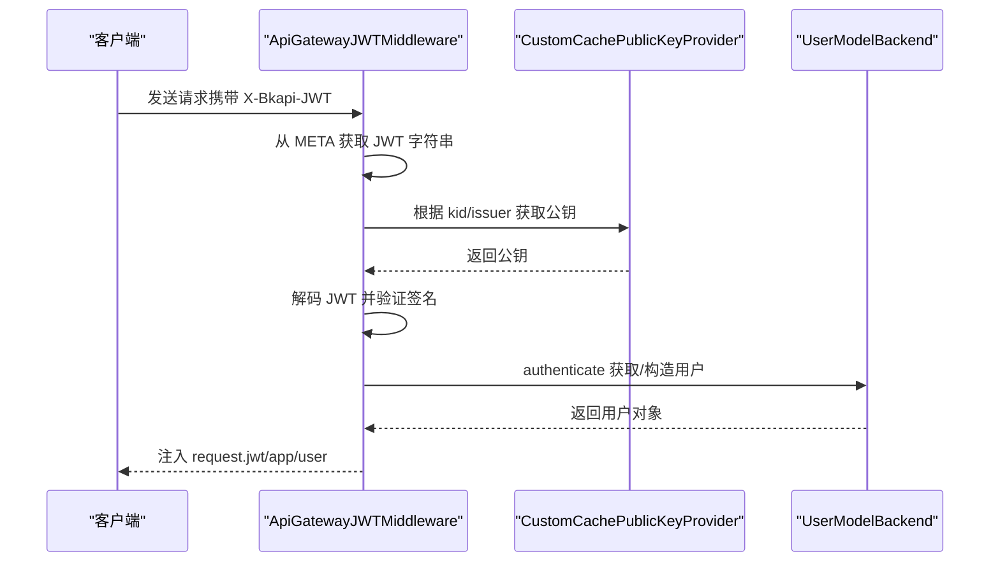
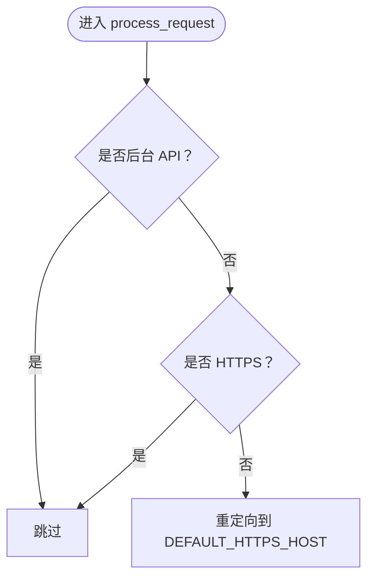
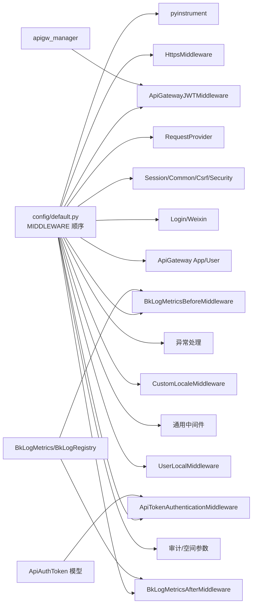

# 中间件系统

<cite>
**本文档引用的文件**
- [apps/middleware/__init__.py](file://apps/middleware/__init__.py)
- [apps/middleware/api_token_middleware.py](file://apps/middleware/api_token_middleware.py)
- [apps/middleware/apigw.py](file://apps/middleware/apigw.py)
- [apps/middleware/custom_locale.py](file://apps/middleware/custom_locale.py)
- [apps/middleware/pyinstrument.py](file://apps/middleware/pyinstrument.py)
- [apps/middleware/user_middleware.py](file://apps/middleware/user_middleware.py)
- [apps/log_commons/models.py](file://apps/log_commons/models.py)
- [apps/utils/prometheus.py](file://apps/utils/prometheus.py)
- [apps/middlewares.py](file://apps/middlewares.py)
- [apps/tests/middlewares.py](file://apps/tests/middlewares.py)
- [settings.py](file://settings.py)
- [config/default.py](file://config/default.py)
- [urls.py](file://urls.py)
</cite>

## 目录
1. [简介](#简介)
2. [项目结构](#项目结构)
3. [核心组件](#核心组件)
4. [架构总览](#架构总览)
5. [详细组件分析](#详细组件分析)
6. [依赖分析](#依赖分析)
7. [性能考虑](#性能考虑)
8. [故障排查指南](#故障排查指南)
9. [结论](#结论)
10. [附录](#附录)

## 简介
本文件面向中间件系统的使用者与维护者，系统性梳理中间件的架构设计、请求处理流程、执行顺序与生命周期管理，深入解析各中间件的功能与实现要点（API令牌中间件、用户认证中间件、国际化中间件、性能监控中间件等），并提供配置方法、自定义扩展思路、调试技巧、最佳实践与性能优化建议，辅以实际使用示例与故障排查指南。

## 项目结构
中间件相关代码主要位于 apps/middleware 与 apps/middlewares（通用中间件）两个模块中，配合配置文件 config/default.py 定义中间件顺序与启用项，settings.py 动态加载环境配置，urls.py 提供路由入口。

图表来源
- [urls.py:1-85](file://urls.py#L1-L85)
- [settings.py:1-47](file://settings.py#L1-L47)
- [config/default.py:113-154](file://config/default.py#L113-L154)

章节来源
- [urls.py:1-85](file://urls.py#L1-L85)
- [settings.py:1-47](file://settings.py#L1-L47)
- [config/default.py:113-154](file://config/default.py#L113-L154)

## 核心组件
- 性能分析中间件：基于 pyinstrument 的请求级性能剖析，支持通过 URL 参数或自定义回调控制是否采样，可输出 HTML 或文本报告，并可持久化到指定目录。
- HTTPS 强制中间件：在非 API 场景下将 HTTP 请求重定向至 HTTPS 主机，保障传输安全。
- 指标采集中间件：基于 django_prometheus，分别在请求进入前与响应返回后记录请求数量、响应数、延迟等指标，标签包含主机名、阶段、应用编码、应用名、模块名等。
- 网关 JWT 认证中间件：对接蓝鲸 API 网关，支持内部网关、外部网关公钥切换，解析 JWT 并注入 request.jwt、request.app、request.user。
- API 令牌认证中间件：支持按 space_uid 与 token 的组合校验，支持 Grafana/CodeCC 等特定类型认证策略，统一处理认证与权限豁免。
- 国际化中间件：从请求头读取语言码，动态激活翻译对象，处理 404 时的语言路径补全与 Vary/Content-Language 响应头设置。
- 通用中间件与异常处理：提供请求上下文池、信号绑定、HTTPS 强制跳转、异常统一响应等能力。

章节来源
- [apps/middleware/pyinstrument.py:16-87](file://apps/middleware/pyinstrument.py#L16-L87)
- [apps/middlewares.py:205-232](file://apps/middlewares.py#L205-L232)
- [apps/middleware/user_middleware.py:96-172](file://apps/middleware/user_middleware.py#L96-L172)
- [apps/middleware/apigw.py:123-125](file://apps/middleware/apigw.py#L123-L125)
- [apps/middleware/api_token_middleware.py:22-76](file://apps/middleware/api_token_middleware.py#L22-L76)
- [apps/middleware/custom_locale.py:18-69](file://apps/middleware/custom_locale.py#L18-L69)
- [apps/middlewares.py:78-196](file://apps/middlewares.py#L78-L196)

## 架构总览
中间件在 Django 请求生命周期中按配置顺序依次执行，形成“进入前-视图-返回后”的三段式处理链。关键点如下：
- 进入前：性能分析、HTTPS 强制、指标采集前置、请求上下文提供、会话/通用/Csrf/安全、登录/微信登录、网关 JWT、网关应用/用户、API 令牌、异常处理。
- 视图阶段：业务视图处理。
- 返回后：国际化、通用中间件、用户本地化、指标采集后置、审计中间件、项目空间参数注入。

图表来源
- [config/default.py:113-154](file://config/default.py#L113-L154)
- [apps/middleware/pyinstrument.py:23-44](file://apps/middleware/pyinstrument.py#L23-L44)
- [apps/middlewares.py:205-211](file://apps/middlewares.py#L205-L211)
- [apps/middleware/user_middleware.py:99-133](file://apps/middleware/user_middleware.py#L99-L133)
- [apps/middlewares.py:78-91](file://apps/middlewares.py#L78-L91)
- [apps/middleware/apigw.py:123-125](file://apps/middleware/apigw.py#L123-L125)
- [apps/middleware/api_token_middleware.py:22-46](file://apps/middleware/api_token_middleware.py#L22-L46)
- [apps/middleware/custom_locale.py:39-68](file://apps/middleware/custom_locale.py#L39-L68)
- [apps/middleware/user_middleware.py:136-149](file://apps/middleware/user_middleware.py#L136-L149)
- [apps/log_audit/middleware.py](file://apps/log_audit/middleware.py)

## 详细组件分析

### API 令牌中间件
功能概述
- 支持两种校验方式：仅 token；或 space_uid+token 组合。
- 校验失败返回禁止访问响应。
- 支持多种认证类型（如 Grafana/CodeCC），不同类型采用不同的用户注入与权限豁免策略。
- 统一处理认证成功后的登录与请求对象增强（如设置 skip_check、token 等）。

图表来源
- [apps/middleware/api_token_middleware.py:22-76](file://apps/middleware/api_token_middleware.py#L22-L76)
- [apps/log_commons/models.py:47-68](file://apps/log_commons/models.py#L47-L68)

章节来源
- [apps/middleware/api_token_middleware.py:22-76](file://apps/middleware/api_token_middleware.py#L22-L76)
- [apps/log_commons/models.py:47-68](file://apps/log_commons/models.py#L47-L68)

### 用户认证中间件（含指标采集）
功能概述
- 在视图阶段激活请求上下文，处理后台 API 场景的时区与用户信息注入。
- 从请求头或用户配置获取时区，激活 timezone，并将用户信息挂载到 request。
- 基于 django_prometheus 的前后置中间件，分别统计请求数、响应数与延迟，标签包含主机名、阶段、应用编码、应用名、模块名。

图表来源
- [apps/middleware/user_middleware.py:59-172](file://apps/middleware/user_middleware.py#L59-L172)
- [apps/utils/prometheus.py:62-68](file://apps/utils/prometheus.py#L62-L68)

章节来源
- [apps/middleware/user_middleware.py:59-172](file://apps/middleware/user_middleware.py#L59-L172)
- [apps/utils/prometheus.py:16-68](file://apps/utils/prometheus.py#L16-L68)

### 国际化中间件
功能概述
- 从请求头读取语言码，动态激活翻译对象。
- 处理 404 时的语言路径补全与重定向。
- 设置 Vary 与 Content-Language 响应头。

图表来源
- [apps/middleware/custom_locale.py:18-69](file://apps/middleware/custom_locale.py#L18-L69)

章节来源
- [apps/middleware/custom_locale.py:18-69](file://apps/middleware/custom_locale.py#L18-L69)

### 性能监控中间件（pyinstrument）
功能概述
- 通过 URL 参数或自定义回调决定是否启动性能剖析器。
- 将 HTML 或文本报告返回给超级用户，或持久化到指定目录。

图表来源
- [apps/middleware/pyinstrument.py:16-87](file://apps/middleware/pyinstrument.py#L16-L87)

章节来源
- [apps/middleware/pyinstrument.py:16-87](file://apps/middleware/pyinstrument.py#L16-L87)

### 网关 JWT 认证中间件
功能概述
- 解析请求头中的 JWT，根据 kid/issuer 决定使用内部或外部公钥。
- 注入 request.jwt、request.app、request.user，并支持外部网关场景切换公钥提供器。

图表来源
- [apps/middleware/apigw.py:123-125](file://apps/middleware/apigw.py#L123-L125)
- [apps/middleware/apigw.py:60-93](file://apps/middleware/apigw.py#L60-L93)
- [apps/middleware/apigw.py:41-58](file://apps/middleware/apigw.py#L41-L58)

章节来源
- [apps/middleware/apigw.py:123-125](file://apps/middleware/apigw.py#L123-L125)
- [apps/middleware/apigw.py:60-93](file://apps/middleware/apigw.py#L60-L93)
- [apps/middleware/apigw.py:41-58](file://apps/middleware/apigw.py#L41-L58)

### HTTPS 强制中间件与通用中间件
功能概述
- 在非后台 API 场景下，将 HTTP 请求重定向至 HTTPS 主机。
- 提供请求上下文池、信号绑定、异常统一响应等通用能力。

图表来源
- [apps/middlewares.py:205-211](file://apps/middlewares.py#L205-L211)

章节来源
- [apps/middlewares.py:205-211](file://apps/middlewares.py#L205-L211)
- [apps/middlewares.py:78-196](file://apps/middlewares.py#L78-L196)

## 依赖分析
- 中间件顺序高度依赖配置文件 config/default.py 的 MIDDLEWARE 元组，顺序直接影响请求处理链路与行为。
- 指标采集依赖 django_prometheus 与自定义 BkLogMetrics/BkLogRegistry，确保标签一致与多实例指标清零。
- API 令牌中间件依赖 ApiAuthToken 模型，用于校验与过期判断。
- 网关 JWT 中间件依赖 apigw_manager 与蓝鲸 API 网关公钥配置。

图表来源
- [config/default.py:113-154](file://config/default.py#L113-L154)
- [apps/middleware/api_token_middleware.py:22-76](file://apps/middleware/api_token_middleware.py#L22-L76)
- [apps/log_commons/models.py:47-68](file://apps/log_commons/models.py#L47-L68)
- [apps/utils/prometheus.py:62-68](file://apps/utils/prometheus.py#L62-L68)
- [apps/middleware/apigw.py:123-125](file://apps/middleware/apigw.py#L123-L125)

章节来源
- [config/default.py:113-154](file://config/default.py#L113-L154)
- [apps/middleware/api_token_middleware.py:22-76](file://apps/middleware/api_token_middleware.py#L22-L76)
- [apps/log_commons/models.py:47-68](file://apps/log_commons/models.py#L47-L68)
- [apps/utils/prometheus.py:62-68](file://apps/utils/prometheus.py#L62-L68)
- [apps/middleware/apigw.py:123-125](file://apps/middleware/apigw.py#L123-L125)

## 性能考虑
- 中间件顺序优化：将高开销中间件（如性能分析、指标采集）置于靠前位置，便于尽早统计；同时避免重复计算与不必要的网络调用。
- 指标标签精简：合理使用标签维度，避免过多组合导致指标基数爆炸；结合 BkLogRegistry 的清零机制，避免多实例累加。
- 缓存与短路：用户信息获取使用缓存装饰器，减少对外部服务的频繁调用。
- 条件采样：性能分析中间件支持回调函数与目录持久化，生产环境建议仅在必要时开启采样。

## 故障排查指南
常见问题与定位步骤
- API 令牌无效或过期
  - 确认请求头是否包含 X-Bklog-Token；若需按空间校验，确认 X-Bklog-Space-Uid 是否正确。
  - 检查 ApiAuthToken 记录是否存在、是否过期。
  - 参考：[apps/middleware/api_token_middleware.py:22-46](file://apps/middleware/api_token_middleware.py#L22-L46)，[apps/log_commons/models.py:47-68](file://apps/log_commons/models.py#L47-L68)
- 网关 JWT 解析失败
  - 检查请求头 X-Bkapi-JWT 是否存在；确认 kid/issuer 对应的公钥配置是否正确。
  - 若为外部网关，确认 EXTERNAL_APIGW_PUBLIC_KEY 或 NEW_INTERNAL_APIGW_PUBLIC_KEY 已正确配置。
  - 参考：[apps/middleware/apigw.py:95-121](file://apps/middleware/apigw.py#L95-L121)，[apps/middleware/apigw.py:60-93](file://apps/middleware/apigw.py#L60-L93)
- 国际化路径 404
  - 确认 URL 是否缺少语言前缀；中间件会在 404 时尝试自动补全并重定向。
  - 参考：[apps/middleware/custom_locale.py:45-63](file://apps/middleware/custom_locale.py#L45-L63)
- HTTPS 强制跳转异常
  - 检查 DEFAULT_HTTPS_HOST 是否配置；后台 API 场景会被跳过。
  - 参考：[apps/middlewares.py:205-211](file://apps/middlewares.py#L205-L211)
- 指标缺失或重复
  - 确认 django_prometheus 已安装；检查 BkLogMetrics 标签维度与 BkLogRegistry 清零逻辑。
  - 参考：[apps/utils/prometheus.py:62-68](file://apps/utils/prometheus.py#L62-L68)
- 性能分析报告未生成
  - 确认 PYINSTRUMENT_URL_ARGUMENT 是否传递；检查 PYINSTRUMENT_PROFILE_DIR 是否可写；确认用户具备超级用户权限。
  - 参考：[apps/middleware/pyinstrument.py:18-87](file://apps/middleware/pyinstrument.py#L18-L87)，[config/default.py:108-110](file://config/default.py#L108-L110)

章节来源
- [apps/middleware/api_token_middleware.py:22-46](file://apps/middleware/api_token_middleware.py#L22-L46)
- [apps/log_commons/models.py:47-68](file://apps/log_commons/models.py#L47-L68)
- [apps/middleware/apigw.py:95-121](file://apps/middleware/apigw.py#L95-L121)
- [apps/middleware/apigw.py:60-93](file://apps/middleware/apigw.py#L60-L93)
- [apps/middleware/custom_locale.py:45-63](file://apps/middleware/custom_locale.py#L45-L63)
- [apps/middlewares.py:205-211](file://apps/middlewares.py#L205-L211)
- [apps/utils/prometheus.py:62-68](file://apps/utils/prometheus.py#L62-L68)
- [apps/middleware/pyinstrument.py:18-87](file://apps/middleware/pyinstrument.py#L18-L87)
- [config/default.py:108-110](file://config/default.py#L108-L110)

## 结论
本中间件体系通过明确的执行顺序与职责划分，实现了从安全认证、国际化、性能分析到指标采集的全链路支撑。遵循配置优先、标签一致、条件采样的原则，可在保证可观测性的同时兼顾性能与稳定性。建议在生产环境中严格控制性能分析与调试中间件的开启范围，并持续优化中间件顺序与标签维度。

## 附录

### 配置方法与示例
- 中间件顺序与启用
  - 修改 config/default.py 中的 MIDDLEWARE 元组，调整各中间件的先后顺序与启用项。
  - 参考：[config/default.py:113-154](file://config/default.py#L113-L154)
- 性能分析参数
  - PYINSTRUMENT_URL_ARGUMENT：触发剖析的 URL 参数名。
  - PYINSTRUMENT_PROFILE_DIR：持久化报告目录。
  - PYINSTRUMENT_SHOW_CALLBACK：自定义显示回调（字符串导入路径或可调用对象）。
  - 参考：[config/default.py:108-110](file://config/default.py#L108-L110)，[apps/middleware/pyinstrument.py:18-35](file://apps/middleware/pyinstrument.py#L18-L35)
- 网关公钥配置
  - EXTERNAL_APIGW_PUBLIC_KEY：外部网关公钥。
  - NEW_INTERNAL_APIGW_PUBLIC_KEY：新内部网关公钥。
  - NEW_INTERNAL_APIGW_NAME：新内部网关名称。
  - 参考：[apps/middleware/apigw.py:60-93](file://apps/middleware/apigw.py#L60-L93)
- HTTPS 强制
  - DEFAULT_HTTPS_HOST：HTTPS 主机地址；BKAPP_IS_BKLOG_API 控制是否后台 API。
  - 参考：[config/default.py:171](file://config/default.py#L171)，[config/default.py:101-106](file://config/default.py#L101-L106)，[apps/middlewares.py:205-211](file://apps/middlewares.py#L205-L211)
- 指标采集
  - 使用 BkLogMetrics 与 BkLogRegistry，标签包含 hostname、stage、bk_app_code、app_name、module_name。
  - 参考：[apps/utils/prometheus.py:62-68](file://apps/utils/prometheus.py#L62-L68)，[apps/middleware/user_middleware.py:96-149](file://apps/middleware/user_middleware.py#L96-L149)

### 自定义扩展与调试技巧
- 自定义中间件
  - 继承 MiddlewareMixin 或使用 Django 内置中间件基类，按需实现 process_request/process_view/process_response。
  - 将自定义中间件加入 config/default.py 的 MIDDLEWARE 元组，并评估其对性能的影响。
  - 参考：[apps/middlewares.py:78-91](file://apps/middlewares.py#L78-L91)
- 测试环境覆盖
  - 使用测试中间件在本地模拟用户、权限与请求上下文，便于调试。
  - 参考：[apps/tests/middlewares.py:29-45](file://apps/tests/middlewares.py#L29-L45)
- 调试技巧
  - 使用性能分析中间件定位热点路径；结合指标采集观察延迟分布。
  - 通过日志与异常中间件快速定位错误来源。
  - 参考：[apps/middleware/pyinstrument.py:18-87](file://apps/middleware/pyinstrument.py#L18-L87)，[apps/middlewares.py:186-196](file://apps/middlewares.py#L186-L196)