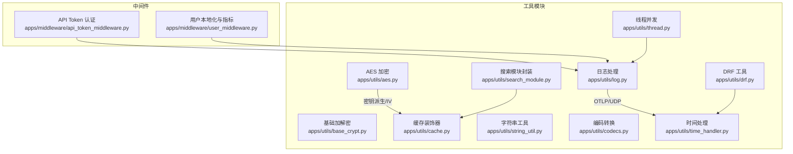
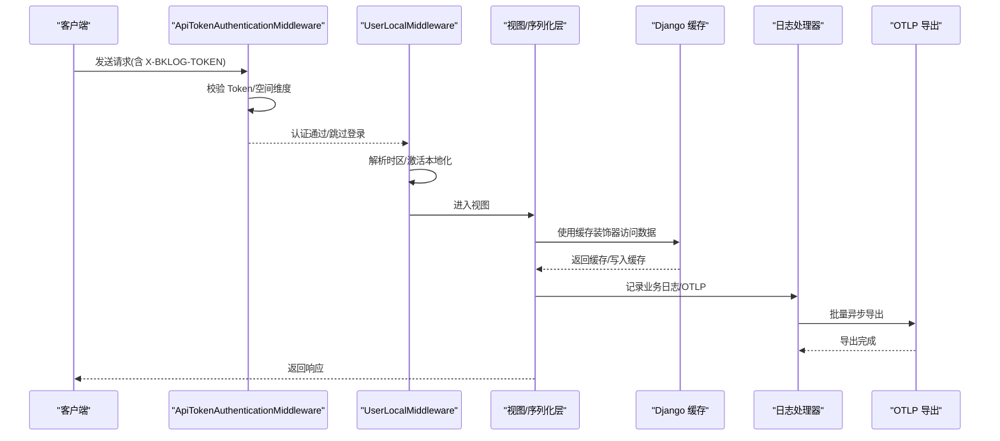
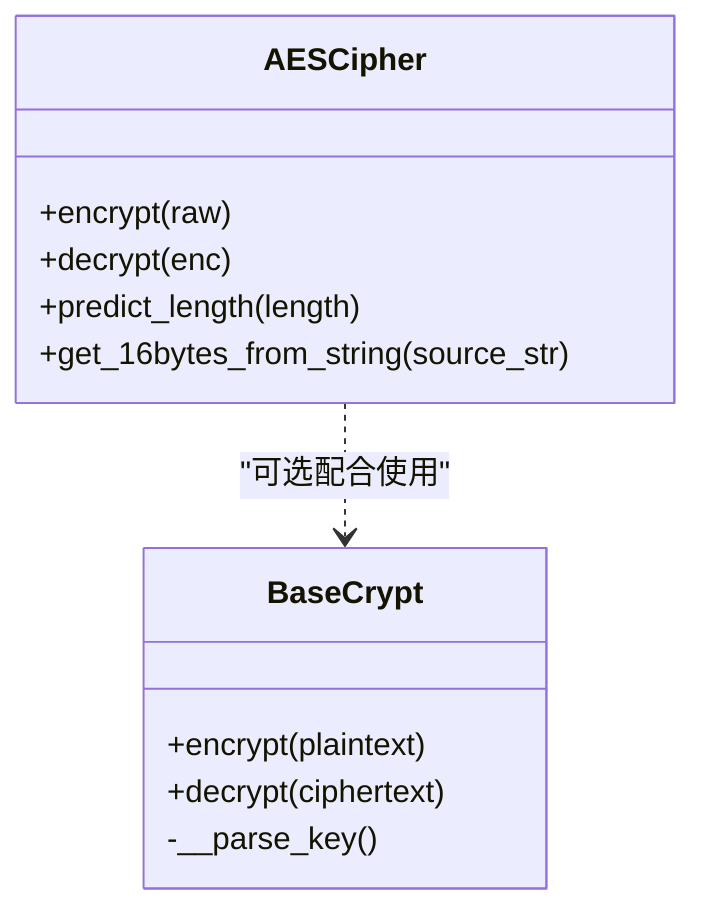
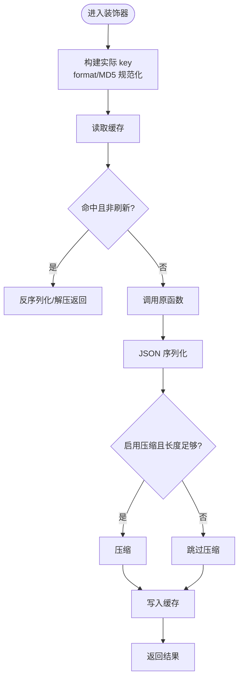
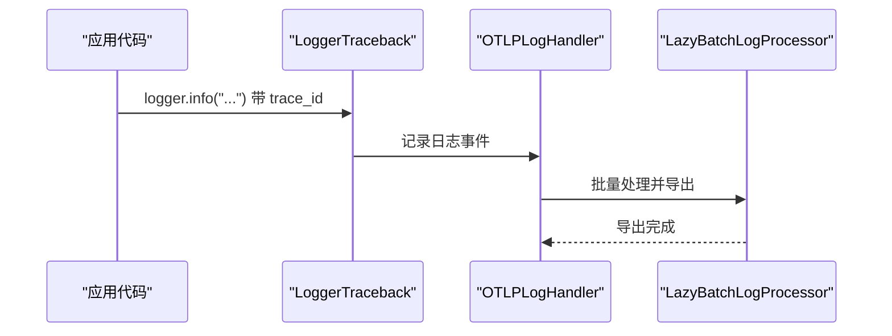
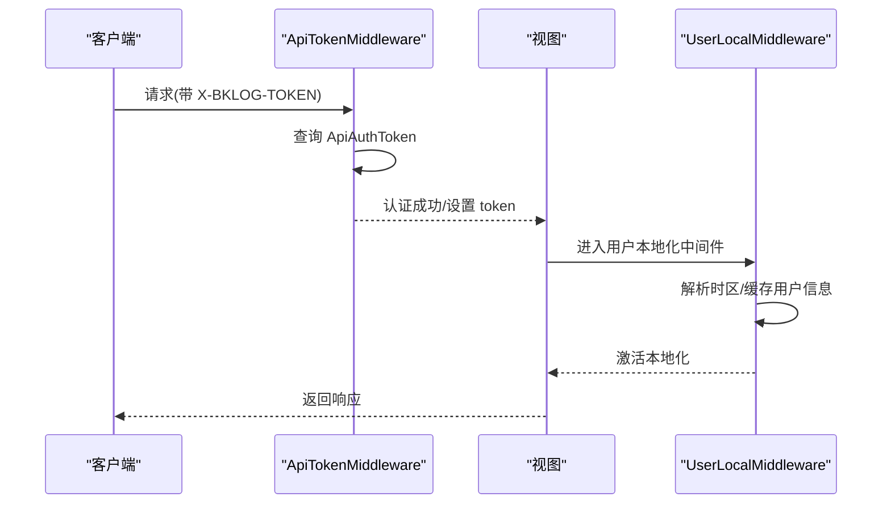
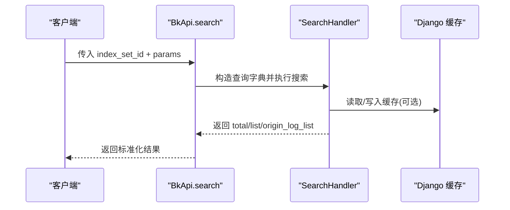
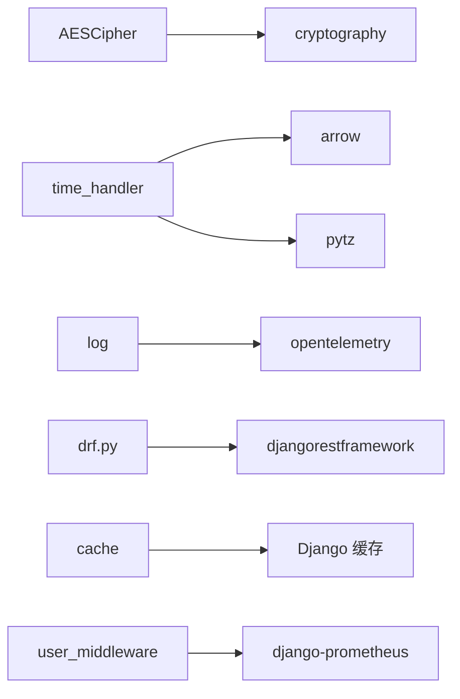

# 工具和实用程序

<cite>
**本文引用的文件**
- [apps/utils/aes.py](file://apps/utils/aes.py)
- [apps/utils/base_crypt.py](file://apps/utils/base_crypt.py)
- [apps/utils/cache.py](file://apps/utils/cache.py)
- [apps/utils/log.py](file://apps/utils/log.py)
- [apps/utils/string_util.py](file://apps/utils/string_util.py)
- [apps/utils/codecs.py](file://apps/utils/codecs.py)
- [apps/utils/time_handler.py](file://apps/utils/time_handler.py)
- [apps/middleware/api_token_middleware.py](file://apps/middleware/api_token_middleware.py)
- [apps/middleware/user_middleware.py](file://apps/middleware/user_middleware.py)
- [apps/utils/search_module.py](file://apps/utils/search_module.py)
- [apps/utils/drf.py](file://apps/utils/drf.py)
- [apps/utils/thread.py](file://apps/utils/thread.py)
</cite>

## 目录
1. [简介](#简介)
2. [项目结构](#项目结构)
3. [核心组件](#核心组件)
4. [架构总览](#架构总览)
5. [详细组件分析](#详细组件分析)
6. [依赖分析](#依赖分析)
7. [性能考虑](#性能考虑)
8. [故障排查指南](#故障排查指南)
9. [结论](#结论)
10. [附录](#附录)

## 简介
本文件面向“工具和实用程序”模块，系统性梳理通用工具库与中间件体系，覆盖以下主题：
- 加密解密：AES 对称加密与基础加解密封装
- 缓存管理：基于 Django 缓存框架的装饰器与批量缓存
- 日志处理：统一日志接口、OTLP 输出、curl 请求链路日志
- 字符串处理：基础字符串判定与编码转换
- 时间处理：时间戳与本地时区转换、DRF 时间序列化
- 中间件系统：API Token 认证、用户本地化与 Prometheus 性能指标
- 开发辅助：线程池并发执行、DRF 参数校验与渲染器
- 搜索模块：统一检索 API 封装与导出流程
- 最佳实践与性能优化建议

## 项目结构
工具与实用程序主要分布在 apps/utils 与 apps/middleware 目录下，配合 apps.log_search、apps.log_commons 等模块使用。

图表来源
- [apps/utils/aes.py:1-132](file://apps/utils/aes.py#L1-L132)
- [apps/utils/base_crypt.py:1-66](file://apps/utils/base_crypt.py#L1-L66)
- [apps/utils/cache.py:1-149](file://apps/utils/cache.py#L1-L149)
- [apps/utils/log.py:1-206](file://apps/utils/log.py#L1-L206)
- [apps/utils/string_util.py:1-7](file://apps/utils/string_util.py#L1-L7)
- [apps/utils/codecs.py:1-18](file://apps/utils/codecs.py#L1-L18)
- [apps/utils/time_handler.py:1-434](file://apps/utils/time_handler.py#L1-L434)
- [apps/middleware/api_token_middleware.py:1-76](file://apps/middleware/api_token_middleware.py#L1-L76)
- [apps/middleware/user_middleware.py:1-172](file://apps/middleware/user_middleware.py#L1-L172)
- [apps/utils/drf.py:1-257](file://apps/utils/drf.py#L1-L257)
- [apps/utils/thread.py:1-127](file://apps/utils/thread.py#L1-L127)
- [apps/utils/search_module.py:1-409](file://apps/utils/search_module.py#L1-L409)

章节来源
- [apps/utils/aes.py:1-132](file://apps/utils/aes.py#L1-L132)
- [apps/utils/cache.py:1-149](file://apps/utils/cache.py#L1-L149)
- [apps/utils/log.py:1-206](file://apps/utils/log.py#L1-L206)
- [apps/utils/time_handler.py:1-434](file://apps/utils/time_handler.py#L1-L434)
- [apps/middleware/api_token_middleware.py:1-76](file://apps/middleware/api_token_middleware.py#L1-L76)
- [apps/middleware/user_middleware.py:1-172](file://apps/middleware/user_middleware.py#L1-L172)
- [apps/utils/drf.py:1-257](file://apps/utils/drf.py#L1-L257)
- [apps/utils/thread.py:1-127](file://apps/utils/thread.py#L1-L127)
- [apps/utils/search_module.py:1-409](file://apps/utils/search_module.py#L1-L409)

## 核心组件
- 加密解密
  - AESCipher：基于 CBC 模式的 AES256 加解密，支持自动 IV 与长度预测
  - BaseCrypt：CFB 模式加解密，结合实例密钥派生
  - get_default_symmetric_key_config：优先使用平台注入密钥，回退到应用密钥
- 缓存管理
  - using_cache：单键缓存装饰器，支持 MD5 规范化 key、压缩存储、刷新策略
  - using_caches：批量缓存装饰器，按 key 列表分片命中与回填
  - 预置时长别名：半分钟至一天的常用缓存时长
- 日志处理
  - LoggerTraceback：统一输出带 trace_id 的日志
  - OTLPLogHandler/LazyBatchLogProcessor：OpenTelemetry 日志导出与批处理
  - UdpHandler：UDP 日志输出
  - requests_curl_log：记录 HTTP 请求 curl 形式与响应耗时
- 字符串与编码
  - is_positive_or_negative_integer：整数字符串判定
  - unicode_str_encode/unicode_str_decode：Unicode 转义编解码
- 时间处理
  - timeformat_to_timestamp/timestamp_to_timeformat：时间格式与时间戳互转
  - api_time_local/localtime_to_timezone：时区转换与本地化格式化
  - SelfDRFDateTimeField/CustomDateTimeField：DRF 时间序列化定制
- 中间件
  - ApiTokenAuthenticationMiddleware：Header X-BKLOG-TOKEN 认证，支持 Grafana/CodeCC 特殊处理
  - UserLocalMiddleware：从请求头或用户配置解析时区，激活本地化
  - PrometheusBefore/After 中间件：统计请求数、响应数与延迟
- 并发与开发辅助
  - MultiExecuteFunc/FuncThread：线程池并发执行，携带请求上下文与 trace 上下文
  - 自定义 DRF 渲染器与分页器、参数校验格式化
- 搜索模块封装
  - BkApi：统一检索 API（索引集列表、字段、历史、搜索、导出等）

章节来源
- [apps/utils/aes.py:35-132](file://apps/utils/aes.py#L35-L132)
- [apps/utils/base_crypt.py:31-66](file://apps/utils/base_crypt.py#L31-L66)
- [apps/utils/cache.py:36-149](file://apps/utils/cache.py#L36-L149)
- [apps/utils/log.py:51-206](file://apps/utils/log.py#L51-L206)
- [apps/utils/string_util.py:1-7](file://apps/utils/string_util.py#L1-L7)
- [apps/utils/codecs.py:1-18](file://apps/utils/codecs.py#L1-L18)
- [apps/utils/time_handler.py:50-434](file://apps/utils/time_handler.py#L50-L434)
- [apps/middleware/api_token_middleware.py:10-76](file://apps/middleware/api_token_middleware.py#L10-L76)
- [apps/middleware/user_middleware.py:59-172](file://apps/middleware/user_middleware.py#L59-L172)
- [apps/utils/drf.py:44-257](file://apps/utils/drf.py#L44-L257)
- [apps/utils/thread.py:41-127](file://apps/utils/thread.py#L41-L127)
- [apps/utils/search_module.py:44-409](file://apps/utils/search_module.py#L44-L409)

## 架构总览
工具与中间件在请求生命周期中的交互如下：

图表来源
- [apps/middleware/api_token_middleware.py:22-76](file://apps/middleware/api_token_middleware.py#L22-L76)
- [apps/middleware/user_middleware.py:59-94](file://apps/middleware/user_middleware.py#L59-L94)
- [apps/utils/cache.py:36-82](file://apps/utils/cache.py#L36-L82)
- [apps/utils/log.py:91-120](file://apps/utils/log.py#L91-L120)

## 详细组件分析

### 加密解密组件
- AESCipher
  - 特点：CBC 模式、自动 IV、填充/去填充、长度预测、URL 安全 Base64
  - 使用场景：敏感字段持久化、跨服务传输加密
- BaseCrypt
  - 特点：CFB 模式、根密钥与实例密钥组合、Base64 编码
  - 使用场景：轻量级对称加解密、配置项保护
- 对称密钥配置
  - 优先使用平台注入密钥，否则回退到应用密钥，确保一致性

图表来源
- [apps/utils/aes.py:35-118](file://apps/utils/aes.py#L35-L118)
- [apps/utils/base_crypt.py:31-66](file://apps/utils/base_crypt.py#L31-L66)

章节来源
- [apps/utils/aes.py:35-132](file://apps/utils/aes.py#L35-L132)
- [apps/utils/base_crypt.py:31-66](file://apps/utils/base_crypt.py#L31-L66)

### 缓存管理组件
- using_cache
  - 功能：装饰器包装函数，自动构建 key、MD5 规范化、JSON 序列化、压缩存储、刷新策略
  - 关键点：支持 need_md5（Redis key 限制）、compress（阈值 MIN_LEN）
- using_caches
  - 功能：批量装饰器，按 key 列表分片命中，未命中部分调用原函数并回填缓存
  - 关键点：返回 dict 类型，按 item 写入缓存
- 预置时长别名
  - 半分钟至一天的常用缓存时长，便于复用

图表来源
- [apps/utils/cache.py:36-82](file://apps/utils/cache.py#L36-L82)

章节来源
- [apps/utils/cache.py:36-149](file://apps/utils/cache.py#L36-L149)

### 日志处理组件
- LoggerTraceback
  - 功能：在日志前缀附加当前 span 的 trace_id，便于链路追踪
- OTLPLogHandler/LazyBatchLogProcessor
  - 功能：初始化 OpenTelemetry 日志提供者与导出器，支持懒加载与优雅关闭
- UdpHandler
  - 功能：将日志以 UDP 方式发送
- requests_curl_log
  - 功能：记录 HTTP 请求 curl 命令与响应状态、耗时、内容类型判断

图表来源
- [apps/utils/log.py:126-177](file://apps/utils/log.py#L126-L177)
- [apps/utils/log.py:91-120](file://apps/utils/log.py#L91-L120)
- [apps/utils/log.py:180-206](file://apps/utils/log.py#L180-L206)

章节来源
- [apps/utils/log.py:1-206](file://apps/utils/log.py#L1-L206)

### 字符串与编码处理
- is_positive_or_negative_integer
  - 功能：判断字符串是否为正整数或负整数
- unicode_str_encode/unicode_str_decode
  - 功能：字符串与 Unicode 转义之间的相互转换

章节来源
- [apps/utils/string_util.py:1-7](file://apps/utils/string_util.py#L1-L7)
- [apps/utils/codecs.py:1-18](file://apps/utils/codecs.py#L1-L18)

### 时间处理组件
- 时间戳与格式互转
  - timeformat_to_timestamp/timestamp_to_timeformat：支持多种倍数（默认/毫秒/纳秒）
- 时区转换
  - api_time_local/localtime_to_timezone：将字符串或 datetime 转换到目标时区
  - get_active_timezone_offset/get_dataapi_tz：获取当前用户与系统时区偏移
- DRF 时间序列化
  - SelfDRFDateTimeField/CustomDateTimeField：统一 DRF 输出格式
- 时间范围生成
  - generate_time_range/generate_time_range_shift：支持自定义与快捷区间

章节来源
- [apps/utils/time_handler.py:50-434](file://apps/utils/time_handler.py#L50-L434)

### 中间件系统
- ApiTokenAuthenticationMiddleware
  - 功能：支持 Header X-BKLOG-TOKEN 与可选 X-BKLOG-Space-Uid；按类型分派处理（grafana/codecc/default）
  - 安全：不存在或过期返回禁止访问
- UserLocalMiddleware
  - 功能：解析请求头时区或用户配置，激活本地化；缓存用户信息；注入 request.user_info
- Prometheus 指标中间件
  - BkLogMetricsBeforeMiddleware/BkLogMetricsAfterMiddleware：统计请求数、响应数与延迟

图表来源
- [apps/middleware/api_token_middleware.py:22-76](file://apps/middleware/api_token_middleware.py#L22-L76)
- [apps/middleware/user_middleware.py:59-94](file://apps/middleware/user_middleware.py#L59-L94)

章节来源
- [apps/middleware/api_token_middleware.py:1-76](file://apps/middleware/api_token_middleware.py#L1-L76)
- [apps/middleware/user_middleware.py:1-172](file://apps/middleware/user_middleware.py#L1-L172)

### 并发与开发辅助
- MultiExecuteFunc/FuncThread
  - 功能：线程池并发执行多个函数，支持携带请求上下文、时区与 trace 上下文
  - 场景：批量拉取、并行计算、异步任务
- DRF 工具
  - 自定义渲染器、分页器、参数校验格式化、时间字段处理
- generate_request
  - 功能：构造简单 APIRequest 用于测试或脚本

章节来源
- [apps/utils/thread.py:41-127](file://apps/utils/thread.py#L41-L127)
- [apps/utils/drf.py:44-257](file://apps/utils/drf.py#L44-L257)

### 搜索模块封装
- BkApi
  - 功能：统一检索 API 封装，包括索引集列表、字段、历史、语法检测、搜索、导出、上下文、实时日志、趋势柱状图、表格配置等
  - 关键点：支持特性开关下的统一查询与聚合；导出流程通过缓存 key 传递参数

图表来源
- [apps/utils/search_module.py:146-174](file://apps/utils/search_module.py#L146-L174)
- [apps/utils/cache.py:36-82](file://apps/utils/cache.py#L36-L82)

章节来源
- [apps/utils/search_module.py:1-409](file://apps/utils/search_module.py#L1-L409)
- [apps/utils/cache.py:1-149](file://apps/utils/cache.py#L1-L149)

## 依赖分析
- 组件内聚与耦合
  - 工具模块相对独立，通过 Django 缓存、日志、序列化等标准组件集成
  - 中间件与工具模块松耦合，通过请求上下文与配置注入协作
- 外部依赖
  - cryptography、arrow、pytz、opentelemetry、django-prometheus 等
- 循环依赖
  - 未发现直接循环导入；缓存装饰器依赖 Django 缓存后端

图表来源
- [apps/utils/aes.py:30-33](file://apps/utils/aes.py#L30-L33)
- [apps/utils/time_handler.py:29-33](file://apps/utils/time_handler.py#L29-L33)
- [apps/utils/log.py:25-28](file://apps/utils/log.py#L25-L28)
- [apps/utils/drf.py:30-36](file://apps/utils/drf.py#L30-L36)
- [apps/utils/cache.py:29-31](file://apps/utils/cache.py#L29-L31)
- [apps/middleware/user_middleware.py:29-33](file://apps/middleware/user_middleware.py#L29-L33)

章节来源
- [apps/utils/aes.py:1-132](file://apps/utils/aes.py#L1-L132)
- [apps/utils/time_handler.py:1-434](file://apps/utils/time_handler.py#L1-L434)
- [apps/utils/log.py:1-206](file://apps/utils/log.py#L1-L206)
- [apps/utils/drf.py:1-257](file://apps/utils/drf.py#L1-L257)
- [apps/utils/cache.py:1-149](file://apps/utils/cache.py#L1-L149)
- [apps/middleware/user_middleware.py:1-172](file://apps/middleware/user_middleware.py#L1-L172)

## 性能考虑
- 缓存策略
  - 使用 need_md5 规避 Redis key 不合规问题；对大对象启用压缩（MIN_LEN 阈值）
  - 合理选择预置时长别名，避免频繁重建缓存
- 日志性能
  - OTLP 批处理与懒加载线程减少主线程阻塞；UDP 日志适用于高吞吐场景
- 时间处理
  - arrow 与 pytz 提升时区转换效率；DRF 自定义字段避免重复格式化
- 并发执行
  - MultiExecuteFunc 控制 max_workers，避免线程风暴；FuncThread 传递 trace 上下文保证可观测性
- 搜索导出
  - 通过缓存 key 传递参数，避免重复构建查询；导出完成后记录操作审计

## 故障排查指南
- 认证失败
  - 检查 X-BKLOG-TOKEN 是否存在与有效；确认空间维度匹配
  - 参考路径：[apps/middleware/api_token_middleware.py:22-46](file://apps/middleware/api_token_middleware.py#L22-L46)
- 时区异常
  - 确认请求头 X-BKLOG-TIMEZONE 或用户配置时区有效；检查本地化激活
  - 参考路径：[apps/middleware/user_middleware.py:45-83](file://apps/middleware/user_middleware.py#L45-L83)
- 缓存异常
  - 检查 key 是否需要 MD5 规范化；确认 compress 配置与 MIN_LEN 阈值
  - 参考路径：[apps/utils/cache.py:36-82](file://apps/utils/cache.py#L36-L82)
- 日志导出
  - 确认 OTLP 导出器初始化与网络可达；检查 LazyBatchLogProcessor 状态
  - 参考路径：[apps/utils/log.py:91-120](file://apps/utils/log.py#L91-L120)
- DRF 参数校验
  - 使用 format_serializer_errors 获取详细错误信息；检查字段映射与输入格式
  - 参考路径：[apps/utils/drf.py:44-116](file://apps/utils/drf.py#L44-L116)

章节来源
- [apps/middleware/api_token_middleware.py:22-46](file://apps/middleware/api_token_middleware.py#L22-L46)
- [apps/middleware/user_middleware.py:45-83](file://apps/middleware/user_middleware.py#L45-L83)
- [apps/utils/cache.py:36-82](file://apps/utils/cache.py#L36-L82)
- [apps/utils/log.py:91-120](file://apps/utils/log.py#L91-L120)
- [apps/utils/drf.py:44-116](file://apps/utils/drf.py#L44-L116)

## 结论
本工具与实用程序库围绕“安全、稳定、可观测、易用”的设计目标，提供了完善的加密解密、缓存、日志、时间处理与中间件体系，并通过 DRF 工具与并发执行能力提升开发效率。建议在生产环境中：
- 统一使用平台注入密钥，确保密钥一致性
- 合理配置缓存与压缩策略，平衡内存与 CPU
- 通过中间件与日志链路实现端到端可观测性
- 在高并发场景下控制线程池大小，避免资源争用

## 附录
- 最佳实践清单
  - 加密：优先使用 AESCipher；对配置项使用 BaseCrypt；密钥来源于平台注入
  - 缓存：对热点数据使用 using_cache；批量场景使用 using_caches；必要时启用压缩
  - 日志：统一使用 LoggerTraceback；生产环境启用 OTLP 导出；避免在热路径打印大对象
  - 时间：使用 arrow 与 pytz；DRF 输出统一格式；注意时区偏移计算
  - 中间件：在网关层完成鉴权，应用层仅做本地化与指标采集
  - 并发：合理设置 max_workers；传递 trace 上下文；捕获异常并记录
- 实际使用示例（路径指引）
  - 使用 AES 加密：[apps/utils/aes.py:54-84](file://apps/utils/aes.py#L54-L84)
  - 使用缓存装饰器：[apps/utils/cache.py:36-82](file://apps/utils/cache.py#L36-L82)
  - 记录 OTLP 日志：[apps/utils/log.py:91-120](file://apps/utils/log.py#L91-L120)
  - 解析时间范围：[apps/utils/time_handler.py:334-366](file://apps/utils/time_handler.py#L334-L366)
  - API Token 认证中间件：[apps/middleware/api_token_middleware.py:22-76](file://apps/middleware/api_token_middleware.py#L22-L76)
  - 并发执行函数：[apps/utils/thread.py:86-113](file://apps/utils/thread.py#L86-L113)
  - 搜索导出流程：[apps/utils/search_module.py:320-377](file://apps/utils/search_module.py#L320-L377)