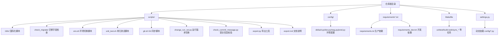
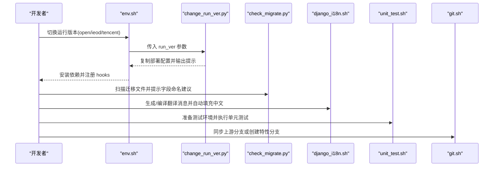
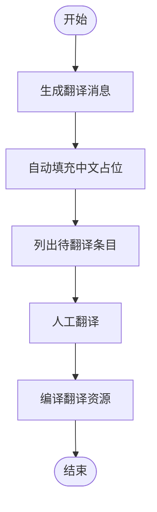
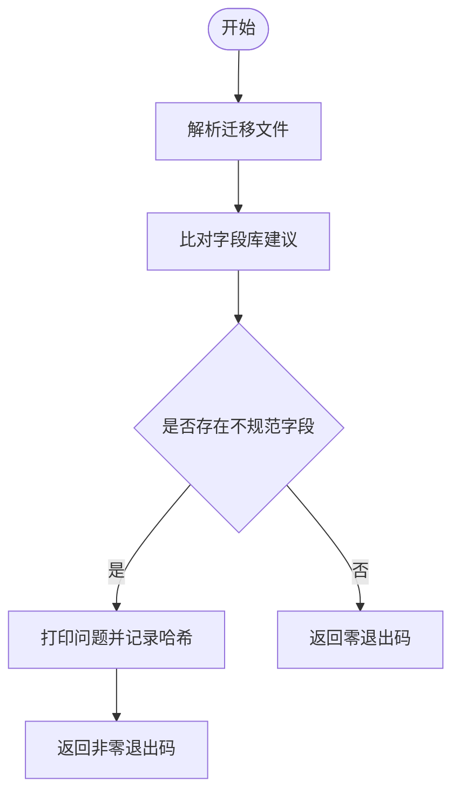
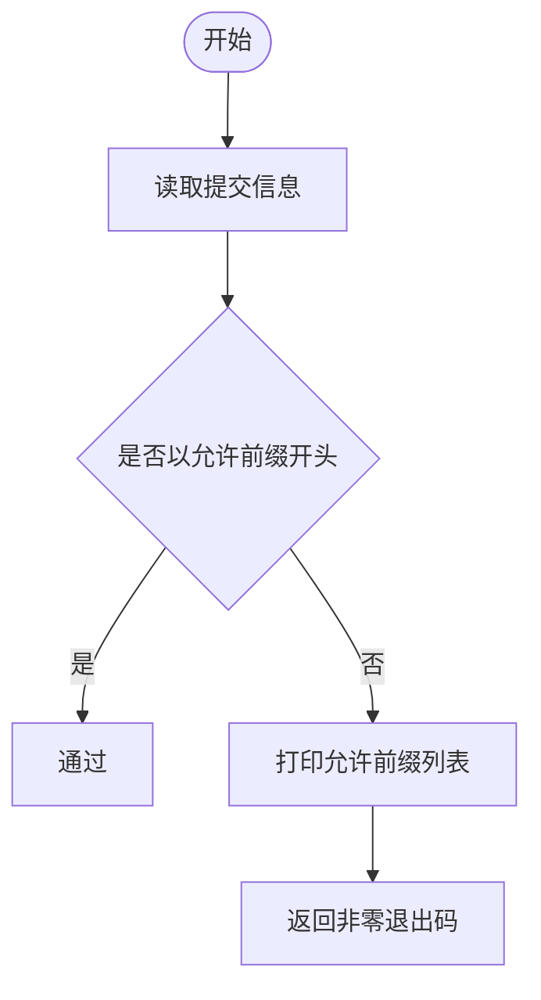
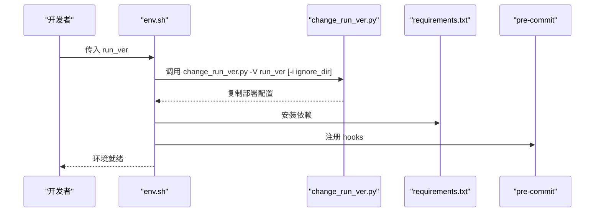
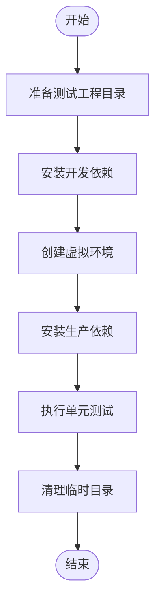
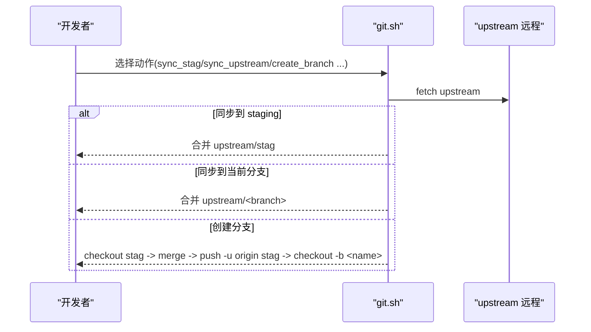
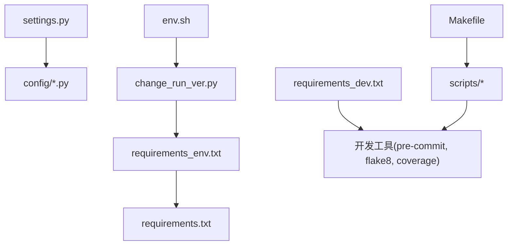

# 开发辅助工具

<cite>
**本文引用的文件**
- [scripts/i18n/django_i18n.sh](file://scripts/i18n/django_i18n.sh)
- [scripts/i18n/fill_po_with_po.py](file://scripts/i18n/fill_po_with_po.py)
- [scripts/check_migrate/check_migrate.py](file://scripts/check_migrate/check_migrate.py)
- [scripts/check_commit_message.py](file://scripts/check_commit_message.py)
- [scripts/env.sh](file://scripts/env.sh)
- [scripts/test_env.sh](file://scripts/test_env.sh)
- [scripts/unit_test.sh](file://scripts/unit_test.sh)
- [scripts/change_run_ver.py](file://scripts/change_run_ver.py)
- [scripts/git.sh](file://scripts/git.sh)
- [scripts/default_env.sh](file://scripts/default_env.sh)
- [scripts/export.py](file://scripts/export.py)
- [scripts/export.md](file://scripts/export.md)
- [Makefile](file://Makefile)
- [requirements.txt](file://requirements.txt)
- [requirements_dev.txt](file://requirements_dev.txt)
- [settings.py](file://settings.py)
</cite>

## 目录
1. [简介](#简介)
2. [项目结构](#项目结构)
3. [核心组件](#核心组件)
4. [架构总览](#架构总览)
5. [详细组件分析](#详细组件分析)
6. [依赖分析](#依赖分析)
7. [性能考虑](#性能考虑)
8. [故障排查指南](#故障排查指南)
9. [结论](#结论)
10. [附录](#附录)

## 简介
本指南面向开发团队，系统性介绍本仓库中的开发辅助工具，涵盖代码检查、国际化、环境配置、测试与部署相关脚本与命令。文档将逐一说明各工具的用途、命令行参数、配置项、使用场景与协作流程，并提供最佳实践与常见问题解决方案，帮助开发者快速搭建与维护开发环境，提升协作效率与质量。

## 项目结构
围绕“开发辅助工具”的主题，本仓库的关键位置如下：
- scripts 目录：集中存放各类开发辅助脚本，包括国际化、迁移检查、环境切换、Git 同步、单元测试等。
- config 目录：按环境划分的 Django 配置入口，settings.py 动态加载对应环境配置。
- requirements*.txt：生产与开发依赖清单，支持按运行版本选择性安装。
- Makefile：常用任务的统一入口，便于一键执行测试、构建与翻译等操作。

图表来源
- [settings.py:1-47](file://settings.py#L1-L47)
- [requirements.txt:1-146](file://requirements.txt#L1-L146)
- [requirements_dev.txt:1-13](file://requirements_dev.txt#L1-L13)
- [Makefile:1-19](file://Makefile#L1-L19)

章节来源
- [settings.py:1-47](file://settings.py#L1-L47)
- [requirements.txt:1-146](file://requirements.txt#L1-L146)
- [requirements_dev.txt:1-13](file://requirements_dev.txt#L1-L13)
- [Makefile:1-19](file://Makefile#L1-L19)

## 核心组件
本节概述各开发辅助工具的功能与职责：
- 国际化工具链：生成与编译翻译消息、自动填充中文占位、提示待翻译内容。
- 迁移字段检查：扫描迁移文件，提示字段命名建议，避免非标准命名。
- 提交信息校验：强制提交信息前缀规范化，提升可追溯性。
- 环境配置工具：切换运行版本、安装依赖、注册 Git hooks。
- 测试工具：一键准备测试环境、安装依赖、执行单元测试。
- Git 同步工具：统一从上游同步分支、创建特性分支、清理上游远程。
- 构建与导出：通过 Makefile 统一执行前端构建、翻译、测试与导出任务。

章节来源
- [scripts/i18n/django_i18n.sh:1-25](file://scripts/i18n/django_i18n.sh#L1-L25)
- [scripts/i18n/fill_po_with_po.py:1-54](file://scripts/i18n/fill_po_with_po.py#L1-L54)
- [scripts/check_migrate/check_migrate.py:1-230](file://scripts/check_migrate/check_migrate.py#L1-L230)
- [scripts/check_commit_message.py:1-56](file://scripts/check_commit_message.py#L1-L56)
- [scripts/env.sh:1-53](file://scripts/env.sh#L1-L53)
- [scripts/test_env.sh:1-5](file://scripts/test_env.sh#L1-L5)
- [scripts/unit_test.sh:1-19](file://scripts/unit_test.sh#L1-L19)
- [scripts/git.sh:1-71](file://scripts/git.sh#L1-L71)
- [scripts/change_run_ver.py:1-77](file://scripts/change_run_ver.py#L1-L77)
- [scripts/export.py](file://scripts/export.py)
- [scripts/export.md](file://scripts/export.md)
- [Makefile:1-19](file://Makefile#L1-L19)

## 架构总览
下图展示开发辅助工具在日常开发中的典型协作流程：从环境准备、代码检查、国际化到测试与同步，最终形成闭环的质量保障与交付流程。

图表来源
- [scripts/env.sh:1-53](file://scripts/env.sh#L1-L53)
- [scripts/change_run_ver.py:1-77](file://scripts/change_run_ver.py#L1-L77)
- [scripts/check_migrate/check_migrate.py:1-230](file://scripts/check_migrate/check_migrate.py#L1-L230)
- [scripts/i18n/django_i18n.sh:1-25](file://scripts/i18n/django_i18n.sh#L1-L25)
- [scripts/unit_test.sh:1-19](file://scripts/unit_test.sh#L1-L19)
- [scripts/git.sh:1-71](file://scripts/git.sh#L1-L71)

## 详细组件分析

### 国际化工具链
- 工具组成
  - django_i18n.sh：调用 Django 命令生成翻译消息、自动填充中文占位、输出待翻译条目、编译翻译。
  - fill_po_with_po.py：扫描 .po 文件，将 msgid 内容复制到空的 msgstr，便于后续人工翻译。
- 使用场景
  - 新增/修改多语言文案后，统一生成并编译翻译资源；批量填充中文占位减少人工录入成本。
- 关键参数与行为
  - django_i18n.sh：无显式参数，内部读取 locale 下的 .po 文件并进行处理。
  - fill_po_with_po.py：接收 -p/--pofile 指定目标 .po 文件路径。
- 协作关系
  - 通常先执行生成步骤，再执行自动填充，最后由人工审阅与完善。

图表来源
- [scripts/i18n/django_i18n.sh:1-25](file://scripts/i18n/django_i18n.sh#L1-L25)
- [scripts/i18n/fill_po_with_po.py:1-54](file://scripts/i18n/fill_po_with_po.py#L1-L54)

章节来源
- [scripts/i18n/django_i18n.sh:1-25](file://scripts/i18n/django_i18n.sh#L1-L25)
- [scripts/i18n/fill_po_with_po.py:1-54](file://scripts/i18n/fill_po_with_po.py#L1-L54)

### 迁移字段检查工具
- 功能概述
  - 解析迁移文件中的 CreateModel/AddField/AlterField/RenameField 调用，比对字段名是否符合“字段库”建议，输出潜在问题并去重记录。
- 使用场景
  - 在提交迁移前进行字段命名规范检查，降低历史遗留字段命名不一致带来的维护成本。
- 关键参数与行为
  - 接收文件路径列表作为参数；内部读取 CSV 字段库并缓存为 JSON；对每个迁移文件解析并汇总问题。
- 输出与交互
  - 若发现非标准字段，打印差异并返回非零退出码，阻止继续提交；同时将新问题以哈希方式记录，避免重复告警。

图表来源
- [scripts/check_migrate/check_migrate.py:1-230](file://scripts/check_migrate/check_migrate.py#L1-L230)

章节来源
- [scripts/check_migrate/check_migrate.py:1-230](file://scripts/check_migrate/check_migrate.py#L1-L230)

### 提交信息校验工具
- 功能概述
  - 校验 Git 提交信息是否以允许的前缀开头，确保提交历史可读与可追踪。
- 使用场景
  - 通过 Git hook 或 CI 步骤强制规范化提交信息，统一版本演进语义。
- 关键参数与行为
  - 读取 COMMIT_EDITMSG 文件内容，匹配预定义前缀集合；若不匹配则打印允许前缀列表并返回非零退出码。

图表来源
- [scripts/check_commit_message.py:1-56](file://scripts/check_commit_message.py#L1-L56)

章节来源
- [scripts/check_commit_message.py:1-56](file://scripts/check_commit_message.py#L1-L56)

### 环境配置工具
- 工具组成
  - env.sh：根据运行版本 open/ieod/tencent 切换环境变量、清理无关依赖与文件、安装依赖并注册 Git hooks。
  - change_run_ver.py：将 sites/${run_ver}/deploy 下的部署相关文件复制到项目根目录，实现按版本切换配置。
  - test_env.sh：提供测试环境所需的默认环境变量。
- 使用场景
  - 在不同运行版本间快速切换；在本地或 CI 中准备一致的测试环境。
- 关键参数与行为
  - env.sh：接受 run_ver 参数；校验 Python 环境；安装 requirements.txt 并注册 pre-commit 与 commit-msg hooks。
  - change_run_ver.py：接收 -V/--run_ver 与 -i/--ignore_dir（逗号分隔）；复制 deploy 目录下的文件与目录。
- 协作关系
  - env.sh 会调用 change_run_ver.py 完成配置复制；两者配合实现“版本即配置”的部署策略。

图表来源
- [scripts/env.sh:1-53](file://scripts/env.sh#L1-L53)
- [scripts/change_run_ver.py:1-77](file://scripts/change_run_ver.py#L1-L77)
- [requirements.txt:1-146](file://requirements.txt#L1-L146)

章节来源
- [scripts/env.sh:1-53](file://scripts/env.sh#L1-L53)
- [scripts/change_run_ver.py:1-77](file://scripts/change_run_ver.py#L1-L77)
- [scripts/test_env.sh:1-5](file://scripts/test_env.sh#L1-L5)
- [requirements.txt:1-146](file://requirements.txt#L1-L146)

### 测试工具
- 工具组成
  - unit_test.sh：在临时目录准备测试工程、安装开发依赖、创建虚拟环境、执行 Django 测试并清理。
  - Makefile unittest：封装 unit_test.sh，提供统一入口。
- 使用场景
  - 在隔离环境中执行单元测试，避免污染本地开发环境。
- 关键参数与行为
  - unit_test.sh：内部安装 requirements_dev.txt，创建虚拟环境，执行 manage.py test；支持 --keepdb 保留数据库以便复用。
- 协作关系
  - Makefile 将测试任务与脚本解耦，便于 CI 与本地统一执行。

图表来源
- [scripts/unit_test.sh:1-19](file://scripts/unit_test.sh#L1-L19)
- [Makefile:1-19](file://Makefile#L1-L19)
- [requirements_dev.txt:1-13](file://requirements_dev.txt#L1-L13)

章节来源
- [scripts/unit_test.sh:1-19](file://scripts/unit_test.sh#L1-L19)
- [Makefile:1-19](file://Makefile#L1-L19)
- [requirements_dev.txt:1-13](file://requirements_dev.txt#L1-L13)

### Git 同步工具
- 工具组成
  - git.sh：提供 sync_stag、sync_upstream、sync_branch、create_branch 等动作；自动配置/清理 upstream 远程。
  - default_env.sh：提供默认上游仓库地址。
- 使用场景
  - 从上游同步最新代码，创建特性分支并推送。
- 关键参数与行为
  - 支持 sync_stag（同步 staging 分支）、sync_upstream（同步当前分支）、sync_branch（指定分支）、create_branch（基于 stag 创建并推送到 origin）。
- 协作关系
  - 通过 Makefile 的 sync_* 目标间接调用 git.sh，形成统一的分支管理流程。

图表来源
- [scripts/git.sh:1-71](file://scripts/git.sh#L1-L71)
- [scripts/default_env.sh:1-2](file://scripts/default_env.sh#L1-L2)
- [Makefile:7-11](file://Makefile#L7-L11)

章节来源
- [scripts/git.sh:1-71](file://scripts/git.sh#L1-L71)
- [scripts/default_env.sh:1-2](file://scripts/default_env.sh#L1-L2)
- [Makefile:7-11](file://Makefile#L7-L11)

### 导出工具
- 工具组成
  - export.py：导出相关数据或配置的脚本（具体逻辑以源码为准）。
  - export.md：导出工具的使用说明文档。
- 使用场景
  - 在特定业务场景下导出数据或配置，便于归档、迁移或审计。
- 关键参数与行为
  - 具体参数以脚本实现为准；建议结合 export.md 查看使用示例与注意事项。

章节来源
- [scripts/export.py](file://scripts/export.py)
- [scripts/export.md](file://scripts/export.md)

## 依赖分析
- 运行时依赖
  - settings.py 动态加载 config/*.py，依据环境变量选择对应配置模块，确保不同环境的一致性。
  - requirements.txt 统一声明生产依赖，其中包含 Django、Celery、ES 客户端、OpenTelemetry、蓝鲸生态组件等。
  - requirements_dev.txt 声明开发与测试依赖，如 pre-commit、flake8、coverage、virtualenv 等。
- 工具与依赖的关系
  - env.sh 与 change_run_ver.py 共同决定部署配置与运行版本，进而影响依赖安装与环境变量。
  - Makefile 将脚本与依赖安装串联，形成可重复的构建与测试流程。

图表来源
- [settings.py:1-47](file://settings.py#L1-L47)
- [requirements.txt:1-146](file://requirements.txt#L1-L146)
- [requirements_dev.txt:1-13](file://requirements_dev.txt#L1-L13)
- [scripts/env.sh:1-53](file://scripts/env.sh#L1-L53)
- [scripts/change_run_ver.py:1-77](file://scripts/change_run_ver.py#L1-L77)
- [Makefile:1-19](file://Makefile#L1-L19)

章节来源
- [settings.py:1-47](file://settings.py#L1-L47)
- [requirements.txt:1-146](file://requirements.txt#L1-L146)
- [requirements_dev.txt:1-13](file://requirements_dev.txt#L1-L13)
- [scripts/env.sh:1-53](file://scripts/env.sh#L1-L53)
- [scripts/change_run_ver.py:1-77](file://scripts/change_run_ver.py#L1-L77)
- [Makefile:1-19](file://Makefile#L1-L19)

## 性能考虑
- 依赖安装与缓存
  - 在 CI 中复用 pip 缓存与虚拟环境，减少重复安装时间。
  - 使用 requirements_env.txt 按运行版本选择性安装依赖，避免不必要的包进入镜像或容器。
- 测试隔离
  - unit_test.sh 在临时目录执行测试，避免磁盘与环境污染；结合 --keepdb 可减少数据库重建开销。
- 脚本执行顺序
  - 先执行环境准备（env.sh），再执行代码检查（check_migrate、check_commit_message），最后执行测试与同步，有助于尽早发现问题。

## 故障排查指南
- 国际化相关
  - 若翻译未生效：确认 django_i18n.sh 是否正确生成与编译；检查 locale 目录权限与编码。
  - 自动填充未覆盖：确认 fill_po_with_po.py 的输入 .po 路径正确，且 msgid/msgstr 结构符合预期。
- 迁移检查
  - 非标准字段频繁告警：核对字段库（CSV/JSON）是否最新；必要时更新字段库并重新生成缓存。
  - 重复告警：检查 field_error_detail.log 是否被意外清空；确认哈希去重逻辑正常。
- 提交信息校验
  - 提交被拒绝：检查提交信息是否以允许前缀开头；参考输出的前缀列表修正。
- 环境配置
  - Python 环境不匹配：确认 env.sh 传入的 run_ver 与当前 Python 环境一致；检查 pip --version 输出。
  - 依赖安装失败：核对 requirements*.txt 与网络环境；必要时清理缓存后重试。
- 测试
  - 测试失败：检查 test_env.sh 的环境变量是否正确；确认虚拟环境已激活并安装了正确版本的依赖。
- Git 同步
  - upstream 未配置：确认 default_env.sh 的默认仓库地址有效；手动添加或重新执行脚本。
  - 合并冲突：根据 git.sh 的提示解决冲突后再次提交。

章节来源
- [scripts/i18n/django_i18n.sh:1-25](file://scripts/i18n/django_i18n.sh#L1-L25)
- [scripts/i18n/fill_po_with_po.py:1-54](file://scripts/i18n/fill_po_with_po.py#L1-L54)
- [scripts/check_migrate/check_migrate.py:1-230](file://scripts/check_migrate/check_migrate.py#L1-L230)
- [scripts/check_commit_message.py:1-56](file://scripts/check_commit_message.py#L1-L56)
- [scripts/env.sh:1-53](file://scripts/env.sh#L1-L53)
- [scripts/test_env.sh:1-5](file://scripts/test_env.sh#L1-L5)
- [scripts/unit_test.sh:1-19](file://scripts/unit_test.sh#L1-L19)
- [scripts/git.sh:1-71](file://scripts/git.sh#L1-L71)
- [scripts/default_env.sh:1-2](file://scripts/default_env.sh#L1-L2)

## 结论
本仓库的开发辅助工具形成了从环境准备、代码规范、国际化、测试到版本同步的完整闭环。通过统一的脚本与 Makefile，团队可以标准化开发流程，降低协作成本，提升交付质量。建议在本地与 CI 中均启用相关工具，持续改进字段库与提交信息规范，确保长期可维护性。

## 附录
- 常用命令速查
  - 翻译：make translate 或直接执行 django-i18n 脚本。
  - 测试：make unittest 或执行 unit_test.sh。
  - 同步：make sync_stag / make sync_upstream 或执行 git.sh 对应动作。
  - 环境：./scripts/env.sh open|ieod|tencent。
  - 导出：参考 export.md 并执行 export.py。
- 最佳实践
  - 提交前先执行迁移检查与提交信息校验。
  - 在 CI 中固定 Python 与 pip 版本，避免依赖漂移。
  - 使用 --keepdb 进行本地测试，加速迭代。
  - 定期同步上游分支，保持与主干一致。