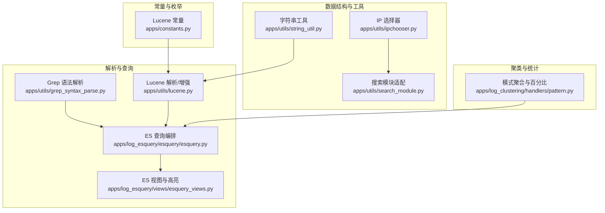
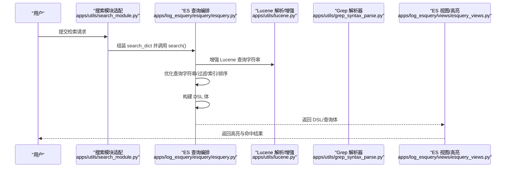
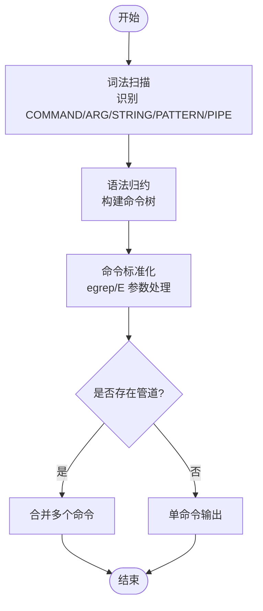
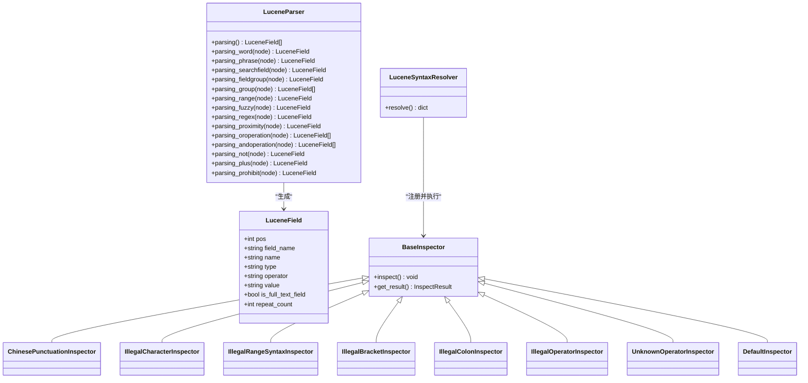
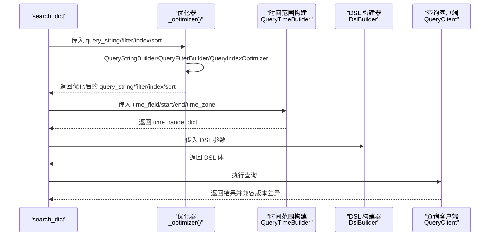
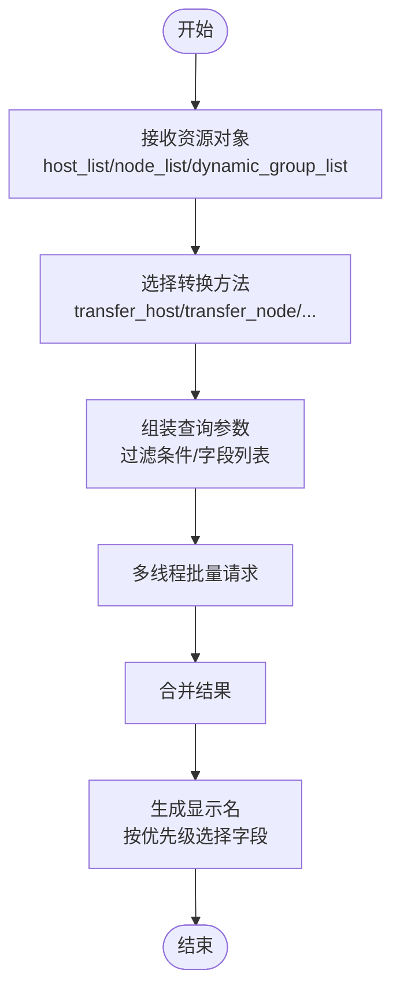
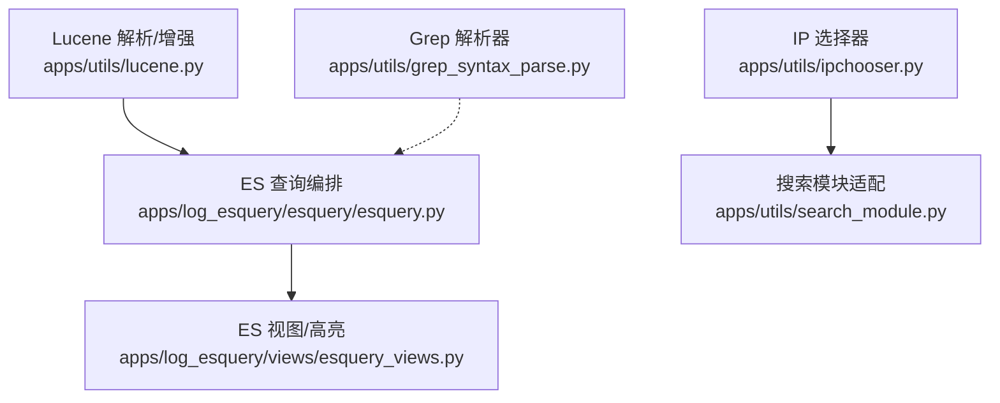

# 算法和数据结构

<cite>
**本文引用的文件**   
- [grep_syntax_parse.py](file://apps/utils/grep_syntax_parse.py)
- [lucene.py](file://apps/utils/lucene.py)
- [string_util.py](file://apps/utils/string_util.py)
- [ipchooser.py](file://apps/utils/ipchooser.py)
- [esquery.py](file://apps/log_esquery/esquery/esquery.py)
- [esquery_views.py](file://apps/log_esquery/views/esquery_views.py)
- [constants.py](file://apps/constants.py)
- [search_module.py](file://apps/utils/search_module.py)
- [pattern.py](file://apps/log_clustering/handlers/pattern.py)
</cite>

## 目录
1. [简介](#简介)
2. [项目结构](#项目结构)
3. [核心组件](#核心组件)
4. [架构总览](#架构总览)
5. [详细组件分析](#详细组件分析)
6. [依赖分析](#依赖分析)
7. [性能考虑](#性能考虑)
8. [故障排查指南](#故障排查指南)
9. [结论](#结论)
10. [附录](#附录)

## 简介
本文件面向算法与数据结构主题，系统梳理并深入讲解以下内容：
- Grep 语法解析算法：基于词法/语法分析器对 grep/egrep 命令行进行解析，输出结构化命令树，便于后续处理与执行。
- Lucene 搜索算法：解析 Lucene 查询语法，生成可执行的查询树，并提供语法修复、增强与转换能力，支撑日志检索。
- 字符串处理算法：包含正则匹配、字符集转换、字符串合法性判断等实用工具，服务于查询输入清洗与兼容。
- IP 选择算法：将多种资源对象（拓扑、动态分组、模板等）统一转换为主机集合，支持多线程批量查询与显示名生成。

同时，文档从数据结构设计、处理流程、复杂度分析、优化技巧与性能调优等方面展开，并提供可定位到源码路径的示例与使用场景说明。

## 项目结构
围绕算法与数据结构的关键模块分布如下：
- 解析与查询
  - Grep 语法解析：apps/utils/grep_syntax_parse.py
  - Lucene 查询解析与增强：apps/utils/lucene.py
  - ES 查询编排与 DSL 构建：apps/log_esquery/esquery/esquery.py
  - ES 查询视图与高亮配置：apps/log_esquery/views/esquery_views.py
- 数据结构与工具
  - 字符串工具：apps/utils/string_util.py
  - IP 选择器：apps/utils/ipchooser.py
  - 搜索模块适配：apps/utils/search_module.py
- 聚类与统计
  - 模式聚合与百分比计算：apps/log_clustering/handlers/pattern.py
- 常量与枚举
  - Lucene 语法常量：apps/constants.py

**图表来源**
- [grep_syntax_parse.py:1-139](file://apps/utils/grep_syntax_parse.py#L1-L139)
- [lucene.py:1-800](file://apps/utils/lucene.py#L1-L800)
- [esquery.py:1-405](file://apps/log_esquery/esquery/esquery.py#L1-L405)
- [esquery_views.py:150-189](file://apps/log_esquery/views/esquery_views.py#L150-L189)
- [string_util.py:1-7](file://apps/utils/string_util.py#L1-L7)
- [ipchooser.py:1-290](file://apps/utils/ipchooser.py#L1-L290)
- [search_module.py:1-409](file://apps/utils/search_module.py#L1-L409)
- [pattern.py:348-383](file://apps/log_clustering/handlers/pattern.py#L348-L383)
- [constants.py:116-157](file://apps/constants.py#L116-L157)

**章节来源**
- [grep_syntax_parse.py:1-139](file://apps/utils/grep_syntax_parse.py#L1-L139)
- [lucene.py:1-800](file://apps/utils/lucene.py#L1-L800)
- [esquery.py:1-405](file://apps/log_esquery/esquery/esquery.py#L1-L405)
- [esquery_views.py:150-189](file://apps/log_esquery/views/esquery_views.py#L150-L189)
- [string_util.py:1-7](file://apps/utils/string_util.py#L1-L7)
- [ipchooser.py:1-290](file://apps/utils/ipchooser.py#L1-L290)
- [search_module.py:1-409](file://apps/utils/search_module.py#L1-L409)
- [pattern.py:348-383](file://apps/log_clustering/handlers/pattern.py#L348-L383)
- [constants.py:116-157](file://apps/constants.py#L116-L157)

## 核心组件
- Grep 语法解析器：通过词法与语法分析，将 grep/egrep 命令行解析为命令树，支持管道链式组合、参数提取与模式识别。
- Lucene 解析器与增强器：解析 Lucene 查询树，提取字段、操作符与值；提供语法修复、大小写逻辑运算符规范化、数值范围增强等功能。
- ES 查询编排器：整合时间范围、过滤条件、索引优化、排序与 DSL 构建，生成最终查询体并调用客户端执行。
- IP 选择器：将多种资源对象统一转换为主机列表，支持批量查询与显示名生成，兼顾多线程性能。
- 字符串工具：提供正则匹配、字符集转换与合法性判断等基础能力，辅助输入清洗与兼容处理。
- 搜索模块适配：封装索引集列表、检索条件、历史记录、导出等接口，协调前端与后端查询逻辑。
- 聚类与统计：基于聚合桶进行模式统计与百分比计算，支撑日志聚类分析。

**章节来源**
- [grep_syntax_parse.py:137-139](file://apps/utils/grep_syntax_parse.py#L137-L139)
- [lucene.py:66-250](file://apps/utils/lucene.py#L66-L250)
- [esquery.py:51-225](file://apps/log_esquery/esquery/esquery.py#L51-L225)
- [ipchooser.py:110-290](file://apps/utils/ipchooser.py#L110-L290)
- [string_util.py:1-7](file://apps/utils/string_util.py#L1-L7)
- [search_module.py:44-409](file://apps/utils/search_module.py#L44-L409)
- [pattern.py:348-383](file://apps/log_clustering/handlers/pattern.py#L348-L383)

## 架构总览
整体流程从用户输入到最终结果返回，主要涉及以下步骤：
- 输入解析：Grep 语法解析器将命令行解析为结构化树；Lucene 解析器将查询字符串解析为树并进行增强与修复。
- 查询优化：ES 查询编排器对查询字符串、过滤条件、索引与排序进行优化。
- DSL 构建：基于映射与时间范围构建查询体。
- 执行与返回：调用客户端执行查询，兼容不同 ES 版本的返回结构。

**图表来源**
- [search_module.py:146-173](file://apps/utils/search_module.py#L146-L173)
- [esquery.py:149-224](file://apps/log_esquery/esquery/esquery.py#L149-L224)
- [lucene.py:599-667](file://apps/utils/lucene.py#L599-L667)
- [esquery_views.py:150-189](file://apps/log_esquery/views/esquery_views.py#L150-L189)

**章节来源**
- [search_module.py:146-173](file://apps/utils/search_module.py#L146-L173)
- [esquery.py:149-224](file://apps/log_esquery/esquery/esquery.py#L149-L224)
- [lucene.py:599-667](file://apps/utils/lucene.py#L599-L667)
- [esquery_views.py:150-189](file://apps/log_esquery/views/esquery_views.py#L150-L189)

## 详细组件分析

### Grep 语法解析算法
- 设计思路
  - 使用词法分析器识别命令、参数、引号字符串与原始模式；语法分析器将输入归约为命令树，支持管道链式组合。
  - 通过 yacc/lex 实现自顶向下的语法解析，保证对 grep/egrep 语义的正确还原。
- 数据结构
  - 词法单元：COMMAND、ARG、DOUBLE_QUOTED_STRING、SINGLE_QUOTED_STRING、RAW_PATTERN、PIPE。
  - 语法树节点：command、args、pattern 等，最终形成命令列表。
- 处理流程
  - 词法扫描 → 语法归约 → 结果树 → 命令标准化（如 egrep/E 参数识别）。
- 复杂度
  - 时间复杂度：O(n)，n 为输入长度；词法与语法分析均为线性扫描。
  - 空间复杂度：O(k)，k 为语法树节点数量，通常与输入规模近似线性。
- 优化与调优
  - 使用紧凑的正则表达式减少回溯。
  - 对常见模式进行预处理，降低语法分析器负担。
  - 错误恢复：遇到非法字符时抛出明确异常，便于上层捕获与提示。
- 使用场景
  - 将用户输入的 grep/egrep 命令行转换为结构化数据，供后续处理或执行。

**图表来源**
- [grep_syntax_parse.py:137-139](file://apps/utils/grep_syntax_parse.py#L137-L139)

**章节来源**
- [grep_syntax_parse.py:1-139](file://apps/utils/grep_syntax_parse.py#L1-L139)

### Lucene 搜索算法
- 设计思路
  - 基于 luqum 解析器生成查询树，随后遍历树节点，提取字段、操作符与值，形成结构化字段列表。
  - 提供语法修复器，自动修正括号不匹配、非法字符、RANGE 语法、多余冒号、未知操作符等问题。
  - 增强器支持大小写逻辑运算符规范化与数值范围增强，提升用户输入兼容性。
- 数据结构
  - LuceneField：记录字段位置、名称、类型、操作符、值与全文检索标识。
  - Inspectors：一系列检查器，分别负责中文标点、非法字符、RANGE 语法、括号、冒号、逻辑运算符与未知操作符修复。
  - LuceneSyntaxResolver：注册并顺序执行检查器，最多尝试固定次数，最终返回修复后的关键字与消息。
- 处理流程
  - 解析查询树 → 提取字段 → 同名字段去重编号 → 语法修复 → 增强转换 → 生成查询字符串。
- 复杂度
  - 解析与遍历：O(m)，m 为查询树节点数；通常与输入规模近似线性。
  - 修复与增强：O(p)，p 为修复规则数量与输入规模，多数为线性扫描。
- 优化与调优
  - 合理安排检查器顺序，避免冲突（如 RANGE 修复需先于非法字符修复）。
  - 使用正则表达式进行批量替换，减少多次遍历。
  - 对高频查询进行缓存（如字段解析结果），降低重复计算。
- 使用场景
  - 日志检索输入清洗与增强，兼容用户非标准输入，提升查询成功率。

**图表来源**
- [lucene.py:45-250](file://apps/utils/lucene.py#L45-L250)
- [lucene.py:550-597](file://apps/utils/lucene.py#L550-L597)

**章节来源**
- [lucene.py:66-250](file://apps/utils/lucene.py#L66-L250)
- [lucene.py:550-597](file://apps/utils/lucene.py#L550-L597)
- [constants.py:116-157](file://apps/constants.py#L116-L157)

### ES 查询编排与 DSL 构建
- 设计思路
  - 将用户输入的查询字典拆分为通用参数、时间字段、时间范围、过滤条件、排序等，分别进行优化与组装。
  - 通过 DSL 构建器生成最终查询体，支持高亮、聚合、折叠、滚动查询等特性。
- 数据结构
  - 查询字典：包含场景、索引集、时间字段、过滤、排序、高亮、聚合等键值。
  - DSL 体：包含查询、过滤、时间范围、排序、聚合、高亮等结构。
- 处理流程
  - 初始化参数 → 时间范围统一 → 查询字符串与过滤优化 → 索引与排序优化 → 构建 DSL → 执行查询 → 结果兼容处理。
- 复杂度
  - 参数初始化与优化：O(q+f+i+s)，q 为查询字符串长度，f 为过滤项数量，i 为索引优化成本，s 为排序优化成本。
  - DSL 构建：O(d)，d 为 DSL 结构复杂度。
- 优化与调优
  - 索引优化：结合时间范围与索引策略，缩小查询范围。
  - 过滤优化：将常用过滤条件前置，减少扫描。
  - 排序优化：避免在大数据集上进行昂贵排序，必要时使用预排序或分页。
- 使用场景
  - 日志检索主流程，支持高亮、聚合、滚动与导出等高级功能。

**图表来源**
- [esquery.py:99-121](file://apps/log_esquery/esquery/esquery.py#L99-L121)
- [esquery.py:149-224](file://apps/log_esquery/esquery/esquery.py#L149-L224)

**章节来源**
- [esquery.py:51-225](file://apps/log_esquery/esquery/esquery.py#L51-L225)

### IP 选择算法
- 设计思路
  - 将多种资源对象（主机、拓扑节点、动态分组、服务/集群模板等）统一转换为主机列表。
  - 支持批量查询与多线程请求，提升性能；提供显示名生成，依据优先级选择合适的标识字段。
- 数据结构
  - 主机属性：包含云区域、IP、主机 ID 等关键字段。
  - 资源对象：拓扑节点、动态分组、模板等，统一映射为主机集合。
- 处理流程
  - 输入资源对象 → 选择对应转换方法 → 组装查询参数 → 批量请求 → 合并结果 → 生成显示名。
- 复杂度
  - 转换与组装：O(n)，n 为资源对象数量。
  - 批量请求：受外部 API 性能影响，内部为线性处理。
- 优化与调优
  - 合理拆分查询条件，减少单次请求的数据量。
  - 使用多线程批量请求，缩短等待时间。
  - 缓存常用字段映射，减少重复计算。
- 使用场景
  - 日志检索中的主机筛选、动态分组解析与模板查询。

**图表来源**
- [ipchooser.py:110-290](file://apps/utils/ipchooser.py#L110-L290)

**章节来源**
- [ipchooser.py:110-290](file://apps/utils/ipchooser.py#L110-L290)

### 字符串处理算法
- 正则匹配与合法性判断
  - is_positive_or_negative_integer：判断字符串是否为正整数或负整数，用于数值字段的合法性校验。
- 字符集转换与清洗
  - HTML 实体解码、Unicode 规范化等，用于清洗用户输入。
- 使用场景
  - 在 Lucene 增强与 Grep 解析前后，对输入进行清洗与合法性验证，提升系统鲁棒性。

**章节来源**
- [string_util.py:1-7](file://apps/utils/string_util.py#L1-L7)

### 搜索模块适配与聚类统计
- 搜索模块适配
  - 封装索引集列表、检索条件、历史记录、导出等接口，协调前端与后端查询逻辑。
- 聚类统计
  - 基于聚合桶进行模式统计与百分比计算，支撑日志聚类分析。

**章节来源**
- [search_module.py:44-409](file://apps/utils/search_module.py#L44-L409)
- [pattern.py:348-383](file://apps/log_clustering/handlers/pattern.py#L348-L383)

## 依赖分析
- 组件耦合
  - Lucene 解析器与增强器独立于 ES 查询编排器，通过查询字符串交互，耦合度低，便于复用。
  - Grep 解析器与 ES 查询编排器之间无直接依赖，但均可作为输入来源参与查询构建。
  - IP 选择器与搜索模块适配器相互独立，前者专注于主机集合转换，后者专注于检索接口封装。
- 外部依赖
  - ES 查询编排器依赖 luqum 解析器与 DSL 构建器，以及查询客户端实现。
  - IP 选择器依赖蓝鲸 CMDB API 与批量请求工具，实现多线程查询。
- 循环依赖
  - 未发现循环依赖，模块职责清晰，接口边界明确。

**图表来源**
- [lucene.py:599-667](file://apps/utils/lucene.py#L599-L667)
- [esquery.py:149-224](file://apps/log_esquery/esquery/esquery.py#L149-L224)
- [grep_syntax_parse.py:137-139](file://apps/utils/grep_syntax_parse.py#L137-L139)
- [ipchooser.py:110-290](file://apps/utils/ipchooser.py#L110-L290)
- [search_module.py:146-173](file://apps/utils/search_module.py#L146-L173)
- [esquery_views.py:150-189](file://apps/log_esquery/views/esquery_views.py#L150-L189)

**章节来源**
- [lucene.py:599-667](file://apps/utils/lucene.py#L599-L667)
- [esquery.py:149-224](file://apps/log_esquery/esquery/esquery.py#L149-L224)
- [grep_syntax_parse.py:137-139](file://apps/utils/grep_syntax_parse.py#L137-L139)
- [ipchooser.py:110-290](file://apps/utils/ipchooser.py#L110-L290)
- [search_module.py:146-173](file://apps/utils/search_module.py#L146-L173)
- [esquery_views.py:150-189](file://apps/log_esquery/views/esquery_views.py#L150-L189)

## 性能考虑
- 解析与查询
  - Lucene 查询解析与增强：优先进行正则匹配与替换，避免多次遍历；合理安排检查器顺序，减少冲突与重复修复。
  - Grep 解析：使用紧凑正则减少回溯，对常见模式进行预处理。
  - ES 查询编排：索引优化与过滤前置，减少扫描范围；排序尽量避免昂贵操作。
- 数据结构
  - 使用轻量级数据类（如 LuceneField）承载字段信息，避免过度封装。
  - 列表与字典的使用遵循“读多写少”的场景，必要时采用不可变结构或缓存。
- 并发与批量
  - IP 选择器采用多线程批量请求，显著降低等待时间；注意控制并发度，避免对外部 API 造成压力。
- 存储与缓存
  - 对高频查询结果与字段映射进行缓存，减少重复计算与网络请求。
- I/O 与序列化
  - 导出与滚动查询时，注意流式处理与内存占用，避免一次性加载大量数据。

[本节为通用指导，无需特定文件分析]

## 故障排查指南
- Lucene 语法问题
  - 症状：解析失败或返回未知操作符异常。
  - 排查：启用语法修复器，检查修复消息；确认括号、冒号、逻辑运算符与 RANGE 语法是否规范。
  - 参考路径：[lucene.py:550-597](file://apps/utils/lucene.py#L550-L597)
- 查询结果异常
  - 症状：命中总数与期望不符、高亮缺失。
  - 排查：检查 DSL 构建参数与高亮配置；确认 ES 版本差异导致的 total 字段结构变化。
  - 参考路径：[esquery.py:143-147](file://apps/log_esquery/esquery/esquery.py#L143-L147), [esquery_views.py:150-189](file://apps/log_esquery/views/esquery_views.py#L150-L189)
- IP 选择失败
  - 症状：主机列表为空或部分缺失。
  - 排查：确认资源对象类型与 ID 是否正确；检查批量请求参数与权限；关注多线程返回数据合并。
  - 参考路径：[ipchooser.py:110-290](file://apps/utils/ipchooser.py#L110-L290)
- 输入合法性问题
  - 症状：数值字段校验失败。
  - 排查：使用字符串工具进行合法性判断，确保输入符合预期格式。
  - 参考路径：[string_util.py:1-7](file://apps/utils/string_util.py#L1-L7)

**章节来源**
- [lucene.py:550-597](file://apps/utils/lucene.py#L550-L597)
- [esquery.py:143-147](file://apps/log_esquery/esquery/esquery.py#L143-L147)
- [esquery_views.py:150-189](file://apps/log_esquery/views/esquery_views.py#L150-L189)
- [ipchooser.py:110-290](file://apps/utils/ipchooser.py#L110-L290)
- [string_util.py:1-7](file://apps/utils/string_util.py#L1-L7)

## 结论
本项目在算法与数据结构层面，通过解析器、增强器与编排器的协同，实现了对 Grep 与 Lucene 查询的高效处理，并结合 ES 查询 DSL 构建与 IP 选择器，形成了完整的日志检索体系。通过对复杂度的控制、合理的数据结构设计与性能优化策略，系统在保证功能完整性的同时，具备良好的扩展性与稳定性。建议在实际部署中结合监控指标持续优化索引策略、并发参数与缓存策略，以获得更佳的查询性能与用户体验。

[本节为总结性内容，无需特定文件分析]

## 附录
- 示例与使用场景
  - Grep 解析：将用户输入的 grep/egrep 命令行转换为结构化命令树，便于后续处理或执行。
    - 参考路径：[grep_syntax_parse.py:137-139](file://apps/utils/grep_syntax_parse.py#L137-L139)
  - Lucene 增强：将用户输入的查询字符串进行大小写逻辑运算符规范化与数值范围增强，提升兼容性。
    - 参考路径：[lucene.py:670-784](file://apps/utils/lucene.py#L670-L784)
  - ES 查询：通过编排器优化查询字符串、过滤条件与索引，生成 DSL 并执行查询。
    - 参考路径：[esquery.py:149-224](file://apps/log_esquery/esquery/esquery.py#L149-L224)
  - IP 选择：将多种资源对象统一转换为主机列表，支持批量查询与显示名生成。
    - 参考路径：[ipchooser.py:110-290](file://apps/utils/ipchooser.py#L110-L290)
  - 搜索模块适配：封装检索接口，协调前端与后端查询逻辑。
    - 参考路径：[search_module.py:146-173](file://apps/utils/search_module.py#L146-L173)
  - 聚类统计：基于聚合桶进行模式统计与百分比计算。
    - 参考路径：[pattern.py:348-383](file://apps/log_clustering/handlers/pattern.py#L348-L383)

[本节为附录性内容，无需特定文件分析]