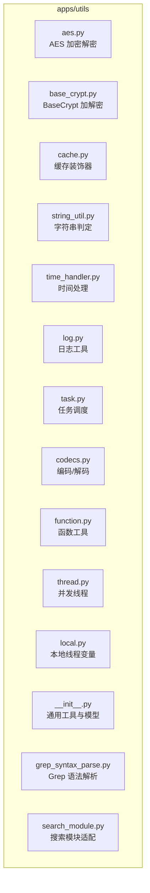
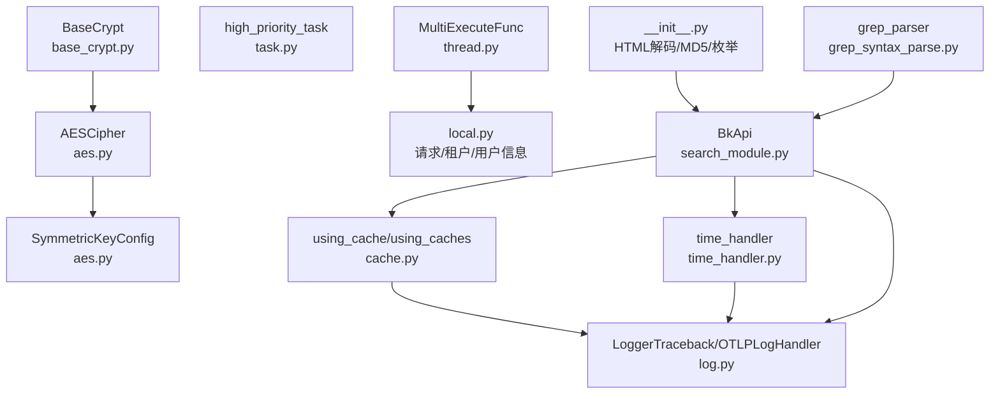
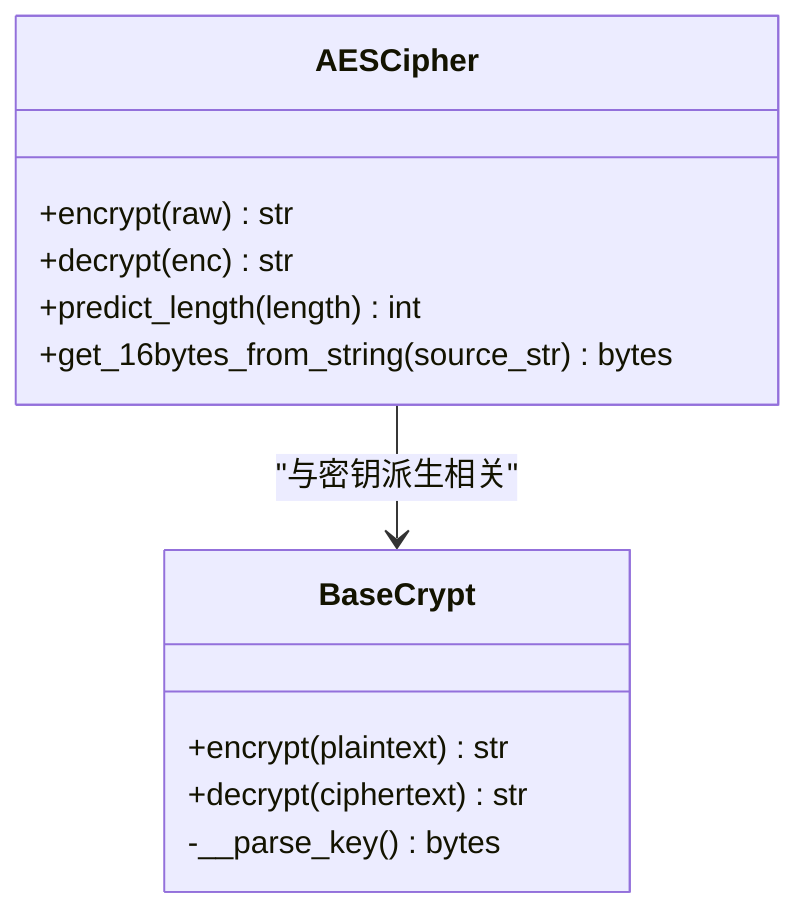
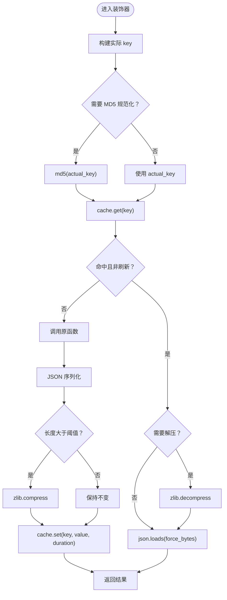
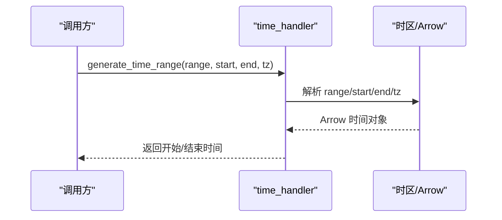
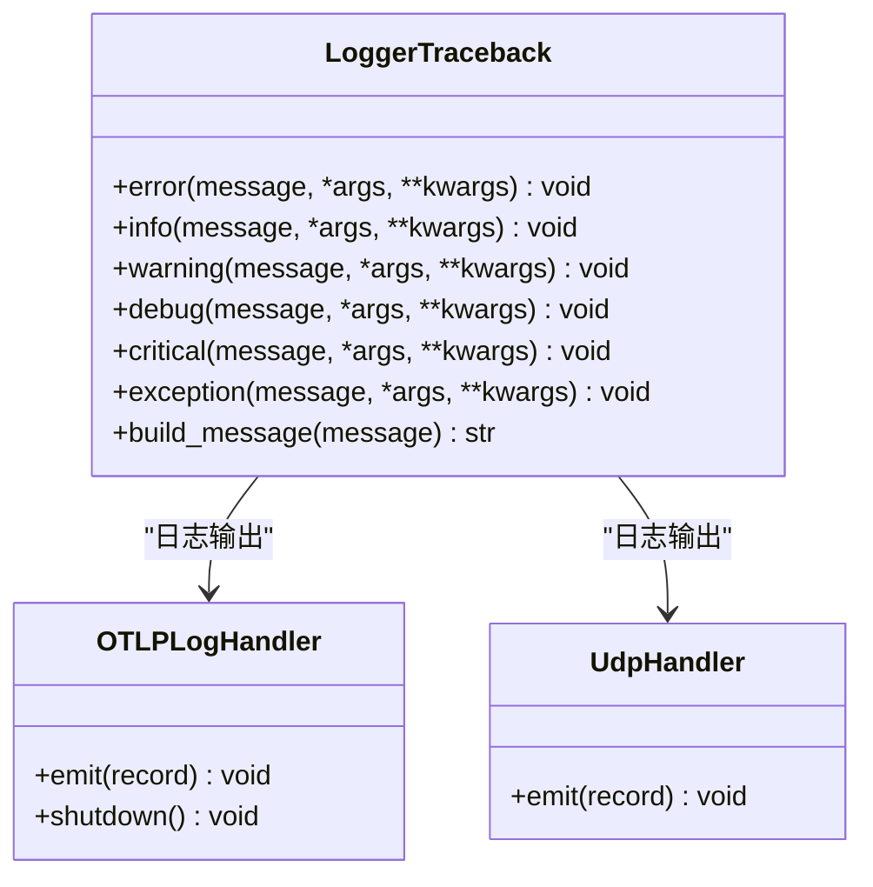
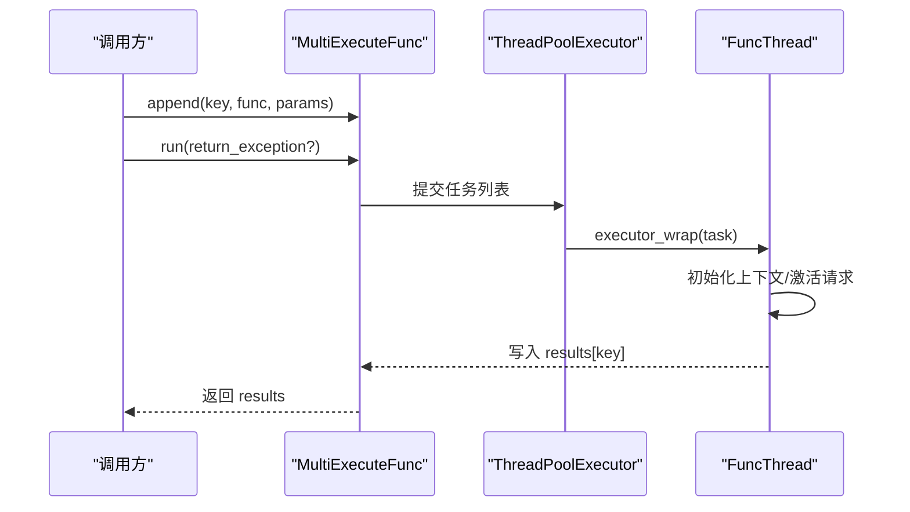
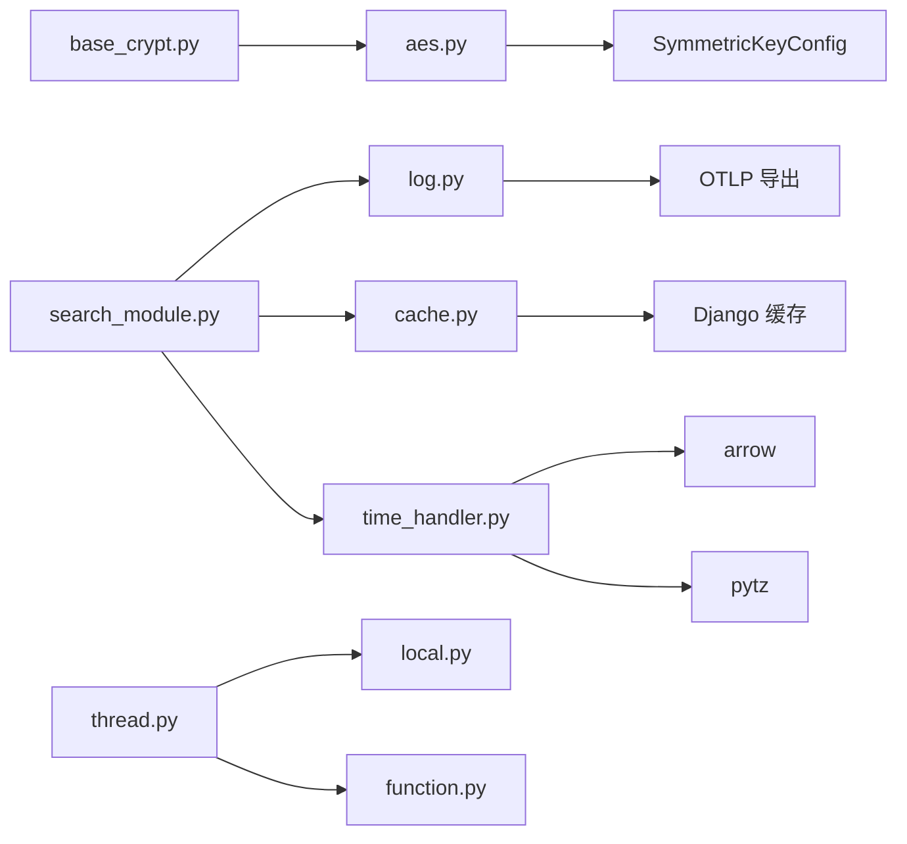

# 通用工具库

<cite>
**本文引用的文件**
- [apps/utils/aes.py](file://apps/utils/aes.py)
- [apps/utils/base_crypt.py](file://apps/utils/base_crypt.py)
- [apps/utils/cache.py](file://apps/utils/cache.py)
- [apps/utils/string_util.py](file://apps/utils/string_util.py)
- [apps/utils/time_handler.py](file://apps/utils/time_handler.py)
- [apps/utils/log.py](file://apps/utils/log.py)
- [apps/utils/task.py](file://apps/utils/task.py)
- [apps/utils/codecs.py](file://apps/utils/codecs.py)
- [apps/utils/function.py](file://apps/utils/function.py)
- [apps/utils/thread.py](file://apps/utils/thread.py)
- [apps/utils/local.py](file://apps/utils/local.py)
- [apps/utils/__init__.py](file://apps/utils/__init__.py)
- [apps/utils/grep_syntax_parse.py](file://apps/utils/grep_syntax_parse.py)
- [apps/utils/search_module.py](file://apps/utils/search_module.py)
</cite>

## 目录
1. [简介](#简介)
2. [项目结构](#项目结构)
3. [核心组件](#核心组件)
4. [架构总览](#架构总览)
5. [详细组件分析](#详细组件分析)
6. [依赖分析](#依赖分析)
7. [性能考量](#性能考量)
8. [故障排查指南](#故障排查指南)
9. [结论](#结论)
10. [附录](#附录)

## 简介
本文件为通用工具库的技术文档，覆盖以下工具类别与能力：
- 加密解密工具：AES 对称加密、BaseCrypt 加解密封装
- 缓存管理工具：基于 Django 缓存的装饰器与批量缓存装饰器
- 字符串处理工具：基础字符串判定与编码/解码
- 时间处理工具：时间戳与格式互转、时区与时长换算、时间范围生成
- 日志工具：统一日志记录、OTLP 日志导出、请求 curl 日志记录
- 任务调度工具：Celery 高优先级任务与周期任务
- 并发与线程工具：线程池并发执行、请求上下文传递
- 本地线程变量：请求与用户信息、租户信息、语言等本地存储
- 其他工具：HTML 解码、MD5、正则匹配、Grep 语法解析、搜索模块适配

## 项目结构
通用工具库位于 apps/utils 下，采用按功能域划分的模块化组织方式，各模块职责清晰、边界明确，便于复用与维护。

图表来源
- [apps/utils/aes.py:35-132](file://apps/utils/aes.py#L35-L132)
- [apps/utils/base_crypt.py:31-66](file://apps/utils/base_crypt.py#L31-L66)
- [apps/utils/cache.py:36-149](file://apps/utils/cache.py#L36-L149)
- [apps/utils/string_util.py:1-7](file://apps/utils/string_util.py#L1-L7)
- [apps/utils/time_handler.py:50-434](file://apps/utils/time_handler.py#L50-L434)
- [apps/utils/log.py:51-206](file://apps/utils/log.py#L51-L206)
- [apps/utils/task.py:16-24](file://apps/utils/task.py#L16-L24)
- [apps/utils/codecs.py:4-18](file://apps/utils/codecs.py#L4-L18)
- [apps/utils/function.py:28-40](file://apps/utils/function.py#L28-L40)
- [apps/utils/thread.py:41-127](file://apps/utils/thread.py#L41-L127)
- [apps/utils/local.py:39-243](file://apps/utils/local.py#L39-L243)
- [apps/utils/__init__.py:32-199](file://apps/utils/__init__.py#L32-L199)
- [apps/utils/grep_syntax_parse.py:1-139](file://apps/utils/grep_syntax_parse.py#L1-L139)
- [apps/utils/search_module.py:44-409](file://apps/utils/search_module.py#L44-L409)

章节来源
- [apps/utils/__init__.py:32-199](file://apps/utils/__init__.py#L32-L199)

## 核心组件
- 加密解密
  - AESCipher：基于 CBC 模式的 AES256 加解密，支持自动填充与随机 IV
  - BaseCrypt：CFB 模式 AES 加解密，内置根密钥与 IV，支持实例化密钥派生
  - 对称密钥配置：优先使用平台提供的密钥，回退到 SECRET_KEY
- 缓存管理
  - using_cache：单键缓存装饰器，支持 JSON 序列化、压缩、MD5 key 规范化
  - using_caches：批量缓存装饰器，支持 key 列表参数与增量写入
  - 常用时长别名：半分钟至一天的缓存别名
- 字符串处理
  - is_positive_or_negative_integer：判断字符串是否为正/负整数
  - unicode_str_encode/unicode_str_decode：Unicode 转义与反转义
- 时间处理
  - timeformat_to_timestamp/timestamp_to_timeformat：时间格式与时间戳互转
  - datetime_to_timestamp/timestamp_to_datetime：datetime 与时间戳互转
  - generate_time_range/generate_time_range_shift：时间范围生成与平移
  - 时区与时长：DATAAPI 时区、用户时区偏移、人类可读时间
- 日志工具
  - LoggerTraceback：带链路 ID 的统一日志记录
  - OTLPLogHandler：OpenTelemetry 日志导出处理器
  - requests_curl_log：记录 HTTP 请求 curl 信息
- 任务调度
  - high_priority_task/high_priority_periodic_task：Celery 高优先级任务与周期任务
- 并发与线程
  - FuncThread/MultiExecuteFunc：线程池并发执行，携带请求上下文与时区
  - generate_request：构造简单请求对象
- 本地线程变量
  - activate_request/get_request/get_request_id：请求与请求 ID 管理
  - get_request_username/get_request_app_code/get_request_language_code：用户、应用、语言信息
  - get_request_tenant_id/get_global_user/make_userinfo：租户与全局用户信息
- 其他工具
  - APIModel/ChoicesEnum：数据模型与枚举工具
  - html_decode/md5_sum/is_match_variate：HTML 解码、MD5、变量名正则
  - grep_parser：Grep/egrep 语法解析器
  - BkApi：搜索模块适配器，封装索引集、检索、导出等接口

章节来源
- [apps/utils/aes.py:35-132](file://apps/utils/aes.py#L35-L132)
- [apps/utils/base_crypt.py:31-66](file://apps/utils/base_crypt.py#L31-L66)
- [apps/utils/cache.py:36-149](file://apps/utils/cache.py#L36-L149)
- [apps/utils/string_util.py:1-7](file://apps/utils/string_util.py#L1-L7)
- [apps/utils/time_handler.py:50-434](file://apps/utils/time_handler.py#L50-L434)
- [apps/utils/log.py:51-206](file://apps/utils/log.py#L51-L206)
- [apps/utils/task.py:16-24](file://apps/utils/task.py#L16-L24)
- [apps/utils/thread.py:41-127](file://apps/utils/thread.py#L41-L127)
- [apps/utils/local.py:39-243](file://apps/utils/local.py#L39-L243)
- [apps/utils/__init__.py:32-199](file://apps/utils/__init__.py#L32-L199)
- [apps/utils/grep_syntax_parse.py:1-139](file://apps/utils/grep_syntax_parse.py#L1-L139)
- [apps/utils/search_module.py:44-409](file://apps/utils/search_module.py#L44-L409)

## 架构总览
通用工具库围绕“功能域”组织，各模块相对独立，通过 Django 配置、日志系统、缓存系统与 Celery 进行集成。下图展示了关键模块间的交互关系。

图表来源
- [apps/utils/aes.py:120-132](file://apps/utils/aes.py#L120-L132)
- [apps/utils/cache.py:36-149](file://apps/utils/cache.py#L36-L149)
- [apps/utils/time_handler.py:50-434](file://apps/utils/time_handler.py#L50-L434)
- [apps/utils/log.py:51-206](file://apps/utils/log.py#L51-L206)
- [apps/utils/task.py:16-24](file://apps/utils/task.py#L16-L24)
- [apps/utils/thread.py:41-127](file://apps/utils/thread.py#L41-L127)
- [apps/utils/local.py:39-243](file://apps/utils/local.py#L39-L243)
- [apps/utils/__init__.py:32-199](file://apps/utils/__init__.py#L32-L199)
- [apps/utils/grep_syntax_parse.py:1-139](file://apps/utils/grep_syntax_parse.py#L1-L139)
- [apps/utils/search_module.py:44-409](file://apps/utils/search_module.py#L44-L409)

## 详细组件分析

### 加密解密工具
- AESCipher
  - 特性：CBC 模式、PKCS7 填充、随机 IV 或固定 IV、URL 安全 Base64 输出
  - 关键方法：encrypt、decrypt、predict_length、get_16bytes_from_string
  - 使用场景：敏感数据加密、配置项加密、跨服务安全传输
- BaseCrypt
  - 特性：CFB 模式、固定根密钥/IV、实例化密钥派生
  - 关键方法：encrypt、decrypt
  - 使用场景：轻量加解密、内部数据保护
- 对称密钥配置
  - 优先使用平台密钥，否则回退到 SECRET_KEY

图表来源
- [apps/utils/aes.py:35-132](file://apps/utils/aes.py#L35-L132)
- [apps/utils/base_crypt.py:31-66](file://apps/utils/base_crypt.py#L31-L66)

章节来源
- [apps/utils/aes.py:35-132](file://apps/utils/aes.py#L35-L132)
- [apps/utils/base_crypt.py:31-66](file://apps/utils/base_crypt.py#L31-L66)

### 缓存管理工具
- using_cache
  - 功能：装饰器包装函数，自动构建 key、命中缓存直接返回、未命中调用原函数并写入缓存
  - 支持：JSON 序列化、压缩、MD5 key 规范化、刷新参数
- using_caches
  - 功能：批量缓存装饰器，支持 key 列表参数，先查缓存，缺失部分调用原函数并批量写入
- 常用时长别名：半分钟、1/2/5/10 分钟、1 小时、半天、1 天

图表来源
- [apps/utils/cache.py:36-149](file://apps/utils/cache.py#L36-L149)

章节来源
- [apps/utils/cache.py:36-149](file://apps/utils/cache.py#L36-L149)

### 字符串处理工具
- is_positive_or_negative_integer：判断字符串是否为正/负整数
- unicode_str_encode/unicode_str_decode：Unicode 转义与反转义

章节来源
- [apps/utils/string_util.py:1-7](file://apps/utils/string_util.py#L1-L7)
- [apps/utils/codecs.py:4-18](file://apps/utils/codecs.py#L4-L18)

### 时间处理工具
- 时间戳与格式互转：timeformat_to_timestamp、timestamp_to_timeformat、datetime_to_timestamp、timestamp_to_datetime
- 时间范围生成：generate_time_range、generate_time_range_shift
- 时区与时长：get_dataapi_tz、get_delta_time、get_pizza_timestamp、get_active_timezone_offset
- 人类可读时间：format_user_time_zone、format_user_time_zone_humanize
- DRF 时间序列化：SelfDRFDateTimeField
- 请求后处理：AfterRequest（统一处理响应中的时间字段）

图表来源
- [apps/utils/time_handler.py:334-414](file://apps/utils/time_handler.py#L334-L414)

章节来源
- [apps/utils/time_handler.py:50-434](file://apps/utils/time_handler.py#L50-L434)

### 日志工具
- LoggerTraceback：在日志消息前附加链路 ID，便于问题定位
- OTLPLogHandler：基于 OpenTelemetry 的日志导出处理器，支持懒初始化与批处理
- UDP 日志处理器：UdpHandler
- requests_curl_log：记录 HTTP 请求 curl 命令与响应摘要

图表来源
- [apps/utils/log.py:51-206](file://apps/utils/log.py#L51-L206)

章节来源
- [apps/utils/log.py:51-206](file://apps/utils/log.py#L51-L206)

### 任务调度工具
- high_priority_task：将任务投递到高优先级队列
- high_priority_periodic_task：将周期任务投递到高优先级队列

章节来源
- [apps/utils/task.py:16-24](file://apps/utils/task.py#L16-L24)

### 并发与线程工具
- FuncThread：封装函数执行，支持携带请求上下文、时区、异常返回
- MultiExecuteFunc：线程池并发执行多个任务，收集结果
- generate_request：构造简单请求对象，便于测试与后台任务

图表来源
- [apps/utils/thread.py:86-127](file://apps/utils/thread.py#L86-L127)

章节来源
- [apps/utils/thread.py:41-127](file://apps/utils/thread.py#L41-L127)

### 本地线程变量
- 请求管理：activate_request/get_request/get_request_id
- 用户与应用：get_request_username/get_request_app_code/get_request_language_code
- 租户与全局用户：get_request_tenant_id/get_global_user/make_userinfo
- 本地参数：set_local_param/del_local_param/get_local_param

章节来源
- [apps/utils/local.py:39-243](file://apps/utils/local.py#L39-L243)

### 其他工具
- APIModel：从数据初始化模型对象
- ChoicesEnum：枚举工具，提供 choices/dict/key 等便捷方法
- html_decode/md5_sum/is_match_variate：HTML 解码、MD5、变量名正则
- grep_parser：Grep/egrep 语法解析器，支持命令、参数、模式与管道
- BkApi：搜索模块适配器，封装索引集、检索、导出等接口

章节来源
- [apps/utils/__init__.py:32-199](file://apps/utils/__init__.py#L32-L199)
- [apps/utils/grep_syntax_parse.py:1-139](file://apps/utils/grep_syntax_parse.py#L1-L139)
- [apps/utils/search_module.py:44-409](file://apps/utils/search_module.py#L44-L409)

## 依赖分析
- 模块内聚性
  - 各工具模块职责单一，内聚度高，耦合度低
- 外部依赖
  - Django 缓存、JSON 序列化、OpenTelemetry 日志导出、Celery 任务队列
- 关键依赖链
  - AESCipher 依赖对称密钥配置；BaseCrypt 依赖 AES；using_cache 依赖 Django 缓存；time_handler 依赖 arrow/pytz；log 依赖 OTLP；thread 依赖 local 与 function；search_module 依赖 log/cache/time_handler

图表来源
- [apps/utils/aes.py:120-132](file://apps/utils/aes.py#L120-L132)
- [apps/utils/cache.py:36-149](file://apps/utils/cache.py#L36-L149)
- [apps/utils/time_handler.py:50-434](file://apps/utils/time_handler.py#L50-L434)
- [apps/utils/log.py:51-206](file://apps/utils/log.py#L51-L206)
- [apps/utils/thread.py:41-127](file://apps/utils/thread.py#L41-L127)
- [apps/utils/local.py:39-243](file://apps/utils/local.py#L39-L243)
- [apps/utils/function.py:28-40](file://apps/utils/function.py#L28-L40)
- [apps/utils/search_module.py:44-409](file://apps/utils/search_module.py#L44-L409)

章节来源
- [apps/utils/aes.py:120-132](file://apps/utils/aes.py#L120-L132)
- [apps/utils/cache.py:36-149](file://apps/utils/cache.py#L36-L149)
- [apps/utils/time_handler.py:50-434](file://apps/utils/time_handler.py#L50-L434)
- [apps/utils/log.py:51-206](file://apps/utils/log.py#L51-L206)
- [apps/utils/thread.py:41-127](file://apps/utils/thread.py#L41-L127)
- [apps/utils/local.py:39-243](file://apps/utils/local.py#L39-L243)
- [apps/utils/function.py:28-40](file://apps/utils/function.py#L28-L40)
- [apps/utils/search_module.py:44-409](file://apps/utils/search_module.py#L44-L409)

## 性能考量
- 缓存策略
  - 使用 JSON 序列化与压缩减少存储体积，仅对较长字符串启用压缩
  - 批量缓存装饰器按需调用原函数，避免重复计算
  - MD5 key 规范化避免 Redis 等缓存对特殊字符的限制
- 加密开销
  - AES-CBC 随机 IV 增加少量开销，适合一次性加密；固定 IV 可降低重复加密成本
  - BaseCrypt CFB 模式适合频繁加解密场景
- 日志导出
  - OTLP 批处理与懒初始化减少线程与网络开销
- 并发执行
  - 线程池大小应结合 CPU 与 I/O 特性调整，避免过度并发导致上下文切换开销
- 时间处理
  - Arrow 与 pytz 在大量时间转换时建议复用时区对象，减少重复构造

## 故障排查指南
- 缓存未命中或异常
  - 检查 key 构造逻辑与 MD5 规范化开关
  - 确认缓存后端可用与序列化/反序列化正确
- 加密/解密失败
  - 确认密钥长度与格式，BaseCrypt 使用实例化密钥派生
  - AES-CBC 固定 IV 场景需确保一致的 IV
- 日志无链路 ID 或导出异常
  - 检查 OTLP 配置与链路 ID 生成
  - 确认 OTLP 导出器可用与批处理器状态
- 任务未进入高优先级队列
  - 检查 settings 中高优先级队列配置
- 并发执行异常
  - 检查 FuncThread 上下文初始化与异常捕获
- 时区显示异常
  - 检查 DATAAPI_TIME_ZONE 与用户时区偏移计算

章节来源
- [apps/utils/cache.py:36-149](file://apps/utils/cache.py#L36-L149)
- [apps/utils/aes.py:35-132](file://apps/utils/aes.py#L35-L132)
- [apps/utils/log.py:51-206](file://apps/utils/log.py#L51-L206)
- [apps/utils/task.py:16-24](file://apps/utils/task.py#L16-L24)
- [apps/utils/thread.py:41-127](file://apps/utils/thread.py#L41-L127)
- [apps/utils/time_handler.py:50-434](file://apps/utils/time_handler.py#L50-L434)

## 结论
通用工具库以模块化设计实现了加密解密、缓存、字符串处理、时间处理、日志、任务调度、并发与线程、本地线程变量等核心能力，具备良好的可复用性与扩展性。通过合理的缓存策略、加密选择与日志导出机制，能够在保证安全性与可观测性的前提下提升系统性能。建议在生产环境中结合业务特性进一步细化配置与监控。

## 附录
- 常见使用场景
  - 数据加密：使用 AESCipher 或 BaseCrypt，结合对称密钥配置
  - 缓存热点：使用 using_cache/using_caches，合理设置时长与压缩
  - 时间转换：使用 time_handler 的互转函数与时间范围生成
  - 日志观测：使用 LoggerTraceback 与 OTLPLogHandler
  - 任务调度：使用 high_priority_task/periodic_task
  - 并发执行：使用 MultiExecuteFunc，注意上下文传递
  - 搜索模块：使用 BkApi 封装的索引集与检索接口