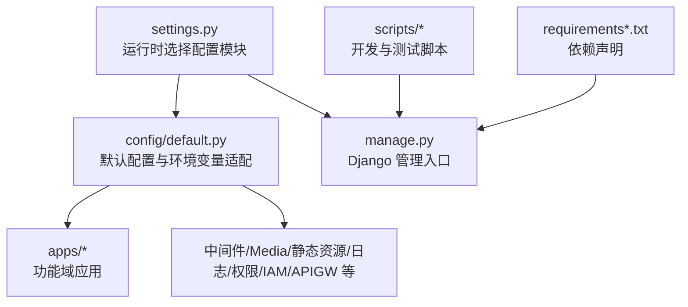
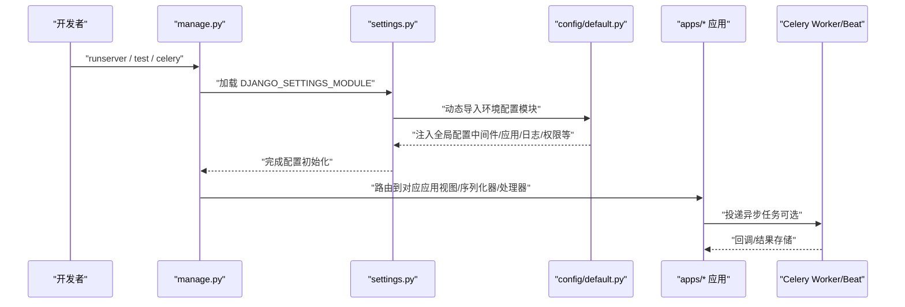
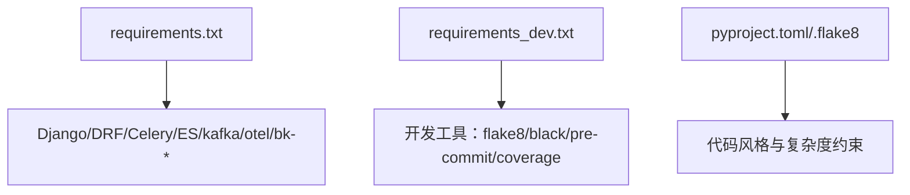

# 开发者指南

<cite>
**本文引用的文件**
- [README.md](file://README.md)
- [requirements.txt](file://requirements.txt)
- [requirements_dev.txt](file://requirements_dev.txt)
- [settings.py](file://settings.py)
- [config/default.py](file://config/default.py)
- [manage.py](file://manage.py)
- [scripts/check_commit_message.py](file://scripts/check_commit_message.py)
- [CONTRIBUTING_EN.md](file://CONTRIBUTING_EN.md)
- [.flake8](file://.flake8)
- [pyproject.toml](file://pyproject.toml)
- [apps/log_search/apps.py](file://apps/log_search/apps.py)
- [apps/log_databus/apps.py](file://apps/log_databus/apps.py)
- [Makefile](file://Makefile)
- [scripts/unit_test.sh](file://scripts/unit_test.sh)
</cite>

## 目录
1. [简介](#简介)
2. [项目结构](#项目结构)
3. [核心组件](#核心组件)
4. [架构总览](#架构总览)
5. [详细组件分析](#详细组件分析)
6. [依赖分析](#依赖分析)
7. [性能考虑](#性能考虑)
8. [故障排查指南](#故障排查指南)
9. [结论](#结论)
10. [附录](#附录)

## 简介
本指南面向开发者，帮助快速搭建开发环境、理解项目结构、掌握编码与提交规范、遵循开发流程，并提供最佳实践与常见问题解决方案。项目基于 Django 4.2 与 Python 3.6+，集成 Celery 异步任务、ES 查询、权限中心（IAM）、网关（APIGW）等能力，覆盖日志采集、清洗、查询、聚类、提取、审计、仪表盘等完整能力域。

## 项目结构
项目采用“多应用（apps）+ 配置（config）+ 工具脚本（scripts）+ 文档（docs）”的分层组织方式：
- apps：按功能域拆分的子应用，如日志搜索、采集、ES 查询、聚类、提取、审计、BCS、Grafana、AI 助手等
- config：环境配置入口，按环境加载不同配置（dev/stag/prod）
- scripts：开发与测试辅助脚本（单元测试、国际化、环境准备等）
- docs：产品与开发文档（架构、代码框架、设计等）
- 其他：静态资源、模板、国际化、Dockerfile、Makefile、requirements 等

图表来源
- [settings.py:1-47](file://settings.py#L1-L47)
- [config/default.py:1-120](file://config/default.py#L1-L120)
- [requirements.txt:1-146](file://requirements.txt#L1-L146)
- [manage.py:1-31](file://manage.py#L1-L31)

章节来源
- [settings.py:1-47](file://settings.py#L1-L47)
- [config/default.py:1-120](file://config/default.py#L1-L120)
- [requirements.txt:1-146](file://requirements.txt#L1-L146)
- [manage.py:1-31](file://manage.py#L1-L31)

## 核心组件
- 配置加载机制：settings.py 根据环境变量动态选择 config 下的环境配置模块，统一注入到 Django 运行时
- 应用注册：config/default.py 中集中注册 INSTALLED_APPS，涵盖日志搜索、采集、ES 查询、聚类、提取、审计、Grafana、IAM、APIGW 等
- 中间件体系：包含性能分析、HTTPS、APIGW JWT、权限校验、国际化、审计等中间件
- 异步任务：Celery 并发、序列化、任务导入清单由配置统一管理
- 国际化与日志：语言、时区、日志格式、JSON 输出、OTLP 上报可按环境启用

章节来源
- [config/default.py:54-95](file://config/default.py#L54-L95)
- [config/default.py:113-154](file://config/default.py#L113-L154)
- [config/default.py:196-236](file://config/default.py#L196-L236)
- [config/default.py:273-368](file://config/default.py#L273-L368)

## 架构总览
下图展示从请求进入、中间件处理、应用路由到异步任务的整体流程：

图表来源
- [settings.py:24-47](file://settings.py#L24-L47)
- [config/default.py:54-95](file://config/default.py#L54-L95)
- [manage.py:25-31](file://manage.py#L25-L31)

## 详细组件分析

### 配置与环境加载（settings → config）
- 环境识别：优先读取 BKPAAS_ENVIRONMENT；否则根据 BK_ENV 映射 dev/stag/prod
- 配置模块：通过 DJANGO_CONF_MODULE 指向 config.{env}，并将所有大写常量注入到本地命名空间
- 关键点：确保本地开发时正确设置环境变量，避免导入异常

章节来源
- [settings.py:26-47](file://settings.py#L26-L47)

### 应用注册与特性开关（config/default.py）
- INSTALLED_APPS：集中注册各功能域应用，便于按需启用/禁用
- 特性开关 FEATURE_TOGGLE：通过环境变量控制场景、功能开关（如 trace、log_desensitize、scenario_es 等）
- 菜单与权限：根据部署情况动态调整菜单项与权限动作

章节来源
- [config/default.py:54-95](file://config/default.py#L54-L95)
- [config/default.py:584-610](file://config/default.py#L584-L610)
- [config/default.py:616-800](file://config/default.py#L616-L800)

### 中间件与权限（config/default.py）
- 中间件顺序影响性能与安全，包含性能分析、HTTPS、APIGW JWT、权限校验、国际化、审计等
- 权限后端：支持 API Token、APIGW 用户模型、蓝鲸 JWT、Django ModelBackend 多种认证方式

章节来源
- [config/default.py:113-154](file://config/default.py#L113-L154)
- [config/default.py:544-550](file://config/default.py#L544-L550)

### 异步任务与并发（config/default.py）
- IS_USE_CELERY：是否启用 Celery
- 并发度：BK_CELERYD_CONCURRENCY
- 任务导入：集中声明各应用的任务模块，便于 Worker 加载
- 序列化：pickle，注意与跨语言/安全相关的风险

章节来源
- [config/default.py:196-236](file://config/default.py#L196-L236)

### 日志与可观测性（config/default.py）
- JSON 日志：K8s 模式下默认 JSON 输出，支持 OTLP Trace/Log 上报
- OTLP：可通过环境变量开启，配置导出地址与鉴权

章节来源
- [config/default.py:290-368](file://config/default.py#L290-L368)

### 应用启动与特性检查（apps/log_search/apps.py）
- 初始化：根据 BKAPP_IS_BKLOG_API 切换登录行为
- 版本同步：将 SaaS/后台版本号写入数据库
- 特性检查：根据部署情况动态调整菜单与功能开关

章节来源
- [apps/log_search/apps.py:48-155](file://apps/log_search/apps.py#L48-L155)

### 应用启动（apps/log_databus/apps.py）
- 简化应用配置，作为示例展示最小化 AppConfig 的职责

章节来源
- [apps/log_databus/apps.py:25-28](file://apps/log_databus/apps.py#L25-L28)

## 依赖分析
- 运行时依赖：Django、DRF、Celery、Redis、ES 客户端、kafka、kubernetes SDK、opentelemetry、bk-* 生态组件等
- 开发依赖：virtualenv、flake8、coverage、pre-commit、black/isort 配置等
- 依赖安装：通过 requirements.txt 与 requirements_dev.txt 统一管理

图表来源
- [requirements.txt:1-146](file://requirements.txt#L1-L146)
- [requirements_dev.txt:1-13](file://requirements_dev.txt#L1-L13)
- [.flake8:1-31](file://.flake8#L1-L31)
- [pyproject.toml:1-16](file://pyproject.toml#L1-L16)

章节来源
- [requirements.txt:1-146](file://requirements.txt#L1-L146)
- [requirements_dev.txt:1-13](file://requirements_dev.txt#L1-L13)
- [.flake8:1-31](file://.flake8#L1-L31)
- [pyproject.toml:1-16](file://pyproject.toml#L1-L16)

## 性能考虑
- 中间件顺序：将性能分析中间件置于靠前位置，便于定位瓶颈
- 日志输出：生产环境建议 JSON 输出与 OTLP 上报，减少格式转换开销
- 异步任务：合理设置并发度，避免阻塞；序列化选择需兼顾安全与性能
- 缓存与连接池：Redis、ES、DB 连接复用与超时配置需结合压测结果调优

## 故障排查指南
- 环境变量缺失：确认 BKPAAS_ENVIRONMENT/BK_ENV、BK_PAAS_HOST、BK_IAM_V3_INNER_HOST、APP_ID/APP_TOKEN 等
- 配置导入异常：检查 config/default.py 中的环境映射与 DJANGO_CONF_MODULE
- 单元测试失败：使用 Makefile 的 unittest 目标或 scripts/unit_test.sh，确保虚拟环境与依赖一致
- 提交信息不规范：使用 scripts/check_commit_message.py 校验提交前缀，遵循 CONTRIBUTING_EN.md 规范

章节来源
- [scripts/check_commit_message.py:17-56](file://scripts/check_commit_message.py#L17-L56)
- [CONTRIBUTING_EN.md:49-75](file://CONTRIBUTING_EN.md#L49-L75)
- [Makefile:1-19](file://Makefile#L1-L19)
- [scripts/unit_test.sh:1-19](file://scripts/unit_test.sh#L1-L19)

## 结论
本指南提供了从环境搭建、配置加载、应用注册、中间件与权限、异步任务、日志与可观测性到开发流程与故障排查的全景式说明。建议开发者在本地按 README 的步骤准备数据库与环境变量，结合 Makefile 与脚本完成构建与测试，并严格遵循提交规范与代码风格约束，确保高质量交付。

## 附录

### 开发环境搭建步骤
- 准备 MySQL 5.7 与 Python 3.6+，建议使用虚拟环境
- 新建数据库并创建 config/local_settings.py（示例见 README）
- 安装依赖：pip install -r requirements.txt
- 前端构建：cd web && npm install --legacy-peer-deps && npm run build
- 设置环境变量：APP_ID、BK_IAM_V3_INNER_HOST、BK_PAAS_HOST、APP_TOKEN 等
- 启动服务：python manage.py runserver 8000；celery -A worker -l info -c 8

章节来源
- [README.md:38-76](file://README.md#L38-L76)

### IDE 与调试建议
- Python：启用 Pylance/PyCharm 插件，配置项目解释器指向虚拟环境
- 代码风格：安装 pre-commit，启用 flake8/black/isort；在保存时自动格式化
- 调试：使用 Django Debug Toolbar、pyinstrument ProfilerMiddleware（通过 URL 参数启用）

章节来源
- [requirements_dev.txt:1-13](file://requirements_dev.txt#L1-L13)
- [.flake8:1-31](file://.flake8#L1-L31)
- [pyproject.toml:1-16](file://pyproject.toml#L1-L16)
- [config/default.py:108-110](file://config/default.py#L108-L110)

### 代码规范与提交规范
- 提交信息前缀：feature、bugfix、optimization、sprintfix、refactor、test、docs、merge
- 代码风格：最大行长 120，复杂度上限 25；忽略特定规则（如 E203/W503）
- 格式化工具：black、isort；flake8 与 pre-commit 钩子

章节来源
- [scripts/check_commit_message.py:17-56](file://scripts/check_commit_message.py#L17-L56)
- [CONTRIBUTING_EN.md:49-75](file://CONTRIBUTING_EN.md#L49-L75)
- [.flake8:1-31](file://.flake8#L1-L31)
- [pyproject.toml:1-16](file://pyproject.toml#L1-L16)

### 开发流程（需求 → 设计 → 实现 → 测试）
- 需求分析：在 Issue 中明确范围、验收与风险
- 设计文档：在 docs/wiki 或对应模块文档中沉淀方案
- 实现：遵循代码规范与提交规范，使用 feature 分支
- 测试：本地单元测试（Makefile/unittest），必要时补充集成测试
- 代码审查：遵循 PR 流程，保持无合并提交，必要时 rebase

章节来源
- [CONTRIBUTING_EN.md:26-48](file://CONTRIBUTING_EN.md#L26-L48)
- [Makefile:1-19](file://Makefile#L1-L19)

### 团队协作指南
- 分支策略：fork-and-pull，目标分支为 master
- 评审流程：PR → 代码审查 → 修改 → rebase 合并
- 沟通渠道：Issues 讨论、PR 评论、社区论坛

章节来源
- [CONTRIBUTING_EN.md:26-48](file://CONTRIBUTING_EN.md#L26-L48)