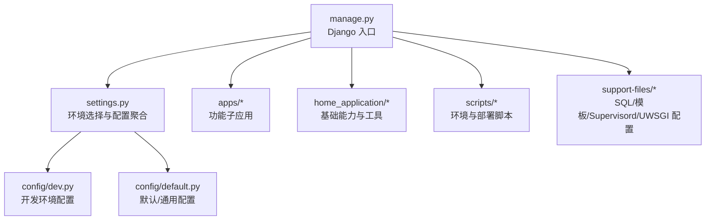
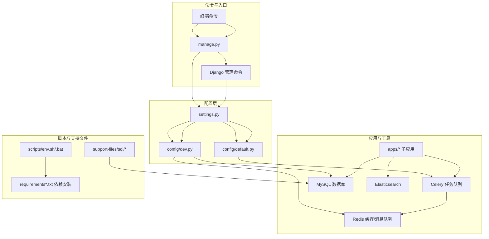
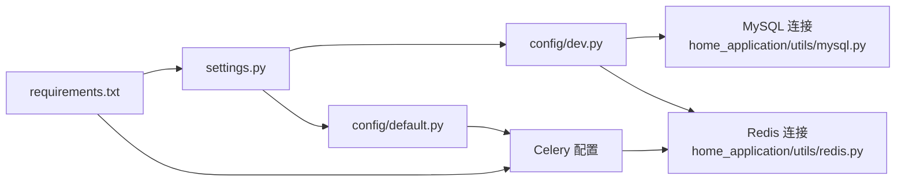

# 快速开始

<cite>
**本文引用的文件**
- [README.md](file://README.md)
- [requirements.txt](file://requirements.txt)
- [requirements_dev.txt](file://requirements_dev.txt)
- [requirements_env.txt](file://requirements_env.txt)
- [settings.py](file://settings.py)
- [config/default.py](file://config/default.py)
- [config/dev.py](file://config/dev.py)
- [manage.py](file://manage.py)
- [scripts/env.sh](file://scripts/env.sh)
- [scripts/env.bat](file://scripts/env.bat)
- [scripts/test_env.sh](file://scripts/test_env.sh)
- [support-files/sql/0001_grafana_20201113-0000_mysql.sql](file://support-files/sql/0001_grafana_20201113-0000_mysql.sql)
- [home_application/utils/mysql.py](file://home_application/utils/mysql.py)
- [home_application/utils/redis.py](file://home_application/utils/redis.py)
</cite>

## 目录
1. [简介](#简介)
2. [项目结构](#项目结构)
3. [核心组件](#核心组件)
4. [架构总览](#架构总览)
5. [详细组件分析](#详细组件分析)
6. [依赖关系分析](#依赖关系分析)
7. [性能注意事项](#性能注意事项)
8. [故障排查指南](#故障排查指南)
9. [结论](#结论)
10. [附录](#附录)

## 简介
本指南面向首次接触 BK Monitor（蓝鲸日志平台）项目的开发者，帮助你在 Windows、macOS、Linux 等常见操作系统上完成环境准备、依赖安装、数据库与缓存配置、项目启动与验证，以及常见问题排查。我们将结合项目中的配置文件与脚本，给出可操作的步骤与定位思路。

## 项目结构
该项目采用 Django 项目组织方式，核心入口与配置位于 settings.py，实际运行配置由 config/*.py 按环境加载；依赖通过 requirements*.txt 管理；启动入口通过 manage.py 调用 Django 管理命令。

图表来源
- [settings.py:1-47](file://settings.py#L1-L47)
- [config/dev.py:1-112](file://config/dev.py#L1-L112)
- [config/default.py:1-800](file://config/default.py#L1-L800)
- [manage.py:1-31](file://manage.py#L1-L31)

章节来源
- [settings.py:1-47](file://settings.py#L1-L47)
- [config/dev.py:1-112](file://config/dev.py#L1-L112)
- [config/default.py:1-800](file://config/default.py#L1-L800)
- [manage.py:1-31](file://manage.py#L1-L31)

## 核心组件
- Django 设置与环境选择：settings.py 根据环境变量动态选择 config/*.py，加载对应配置。
- 开发环境配置：config/dev.py 提供本地开发的数据库、Broker、调试等默认值。
- 依赖管理：requirements*.txt 明确 Python 包版本，含 Django、Celery、Redis、ES 等。
- 启动入口：manage.py 负责设置 DJANGO_SETTINGS_MODULE 并执行命令行。

章节来源
- [settings.py:1-47](file://settings.py#L1-L47)
- [config/dev.py:1-112](file://config/dev.py#L1-L112)
- [requirements.txt:1-146](file://requirements.txt#L1-L146)
- [requirements_dev.txt:1-13](file://requirements_dev.txt#L1-L13)
- [requirements_env.txt:1-2](file://requirements_env.txt#L1-L2)
- [manage.py:1-31](file://manage.py#L1-L31)

## 架构总览
下图展示从命令行到 Django 设置、再到各子系统的调用关系，以及 Celery 与 Redis 的交互位置。

图表来源
- [manage.py:1-31](file://manage.py#L1-L31)
- [settings.py:1-47](file://settings.py#L1-L47)
- [config/dev.py:1-112](file://config/dev.py#L1-L112)
- [config/default.py:1-800](file://config/default.py#L1-L800)
- [requirements.txt:1-146](file://requirements.txt#L1-L146)
- [support-files/sql/0001_grafana_20201113-0000_mysql.sql:1-2](file://support-files/sql/0001_grafana_20201113-0000_mysql.sql#L1-L2)

## 详细组件分析

### 环境与依赖准备
- Python 环境
  - 建议使用 Python 3.6+，推荐使用虚拟环境隔离依赖。
  - 可使用 scripts/env.sh（Linux/macOS）或 scripts/env.bat（Windows）自动切换运行版本并安装依赖。
- 系统依赖
  - 项目未显式声明系统级依赖，但涉及 MySQL、Redis、Elasticsearch、Celery 等外部组件，需提前安装并运行。
- 依赖安装
  - 使用 requirements.txt 安装生产依赖；requirements_dev.txt 为开发工具（如 pre-commit、flake8、coverage 等）。
  - requirements_env.txt 为空，表示按环境补充差异依赖（通常由部署侧处理）。

章节来源
- [requirements.txt:1-146](file://requirements.txt#L1-L146)
- [requirements_dev.txt:1-13](file://requirements_dev.txt#L1-L13)
- [requirements_env.txt:1-2](file://requirements_env.txt#L1-L2)
- [scripts/env.sh:1-53](file://scripts/env.sh#L1-L53)
- [scripts/env.bat:1-51](file://scripts/env.bat#L1-L51)

### 数据库配置（MySQL）
- 开发环境默认数据库配置位于 config/dev.py，包含 ENGINE、NAME、USER、PASSWORD、HOST、PORT 等键。
- 若使用独立数据库实例，可在 config/local_settings.py 中覆盖 DATABASES（该文件不存在时会被忽略，便于本地覆盖）。
- 初始化数据库
  - 可参考 support-files/sql/0001_grafana_20201113-0000_mysql.sql 创建 Grafana 相关数据库（项目中存在 grafana 子应用）。
  - 项目 README 提示创建名为 bk_log 的数据库，可按需创建或在配置中指定。

章节来源
- [config/dev.py:50-62](file://config/dev.py#L50-L62)
- [support-files/sql/0001_grafana_20201113-0000_mysql.sql:1-2](file://support-files/sql/0001_grafana_20201113-0000_mysql.sql#L1-L2)
- [README.md:38-56](file://README.md#L38-L56)

### 缓存与消息队列（Redis/Celery）
- 开发环境默认 Broker 使用 Redis（config/dev.py 中 BROKER_URL），并启用 Celery（config/default.py 中 IS_USE_CELERY）。
- Redis 连接参数来自 settings（如 REDIS_HOST/PORT/PASSWD），可通过环境变量或配置文件设置。
- 项目 README 提示本地 Redis 密码可通过环境变量 BKAPP_REDIS_PASSWORD 指定。

章节来源
- [config/dev.py:43-47](file://config/dev.py#L43-L47)
- [config/default.py:196-206](file://config/default.py#L196-L206)
- [README.md:64-72](file://README.md#L64-L72)
- [home_application/utils/redis.py:34-94](file://home_application/utils/redis.py#L34-L94)

### Elasticsearch（可选）
- 项目包含 elasticsearch、elasticsearch5、elasticsearch6、elasticsearch_dsl 等依赖，表明支持多版本 ES。
- 开发环境默认未强制绑定 ES，如需接入第三方 ES，可在功能模块中按需配置。

章节来源
- [requirements.txt:40-44](file://requirements.txt#L40-L44)

### 启动流程
- 本地开发环境
  - 设置环境变量（如 APP_ID、BK_IAM_V3_INNER_HOST、BK_PAAS_HOST、APP_TOKEN 等），可参考 scripts/test_env.sh。
  - 安装依赖：pip install -r requirements.txt。
  - 启动 Django 服务：python manage.py runserver 8000。
  - 启动 Celery Worker：celery -A worker -l info -c 8。
- 生产/UWSGI/Supervisord
  - 项目提供 support-files/uwsgi.ini、support-files/supervisord.conf 等文件，可用于生产部署。

章节来源
- [README.md:64-76](file://README.md#L64-L76)
- [scripts/test_env.sh:1-5](file://scripts/test_env.sh#L1-L5)
- [manage.py:1-31](file://manage.py#L1-L31)
- [support-files/](file://support-files/)

### 配置文件与环境变量
- settings.py 根据环境变量选择 config/*.py，config/dev.py 提供本地默认值，config/default.py 提供通用默认值。
- 本地覆盖：在 config/local_settings.py 中追加覆盖项（若存在）。
- 常用环境变量（示例）
  - APP_ID、BK_IAM_V3_INNER_HOST、BK_PAAS_HOST、APP_TOKEN、BKAPP_REDIS_PASSWORD、BKAPP_* 等（详见 README 与 scripts/test_env.sh）。

章节来源
- [settings.py:1-47](file://settings.py#L1-L47)
- [config/dev.py:106-111](file://config/dev.py#L106-L111)
- [README.md:64-72](file://README.md#L64-L72)
- [scripts/test_env.sh:1-5](file://scripts/test_env.sh#L1-L5)

## 依赖关系分析
下图展示关键配置与组件之间的依赖关系，帮助理解启动顺序与耦合点。

图表来源
- [settings.py:1-47](file://settings.py#L1-L47)
- [config/dev.py:50-62](file://config/dev.py#L50-L62)
- [config/default.py:196-206](file://config/default.py#L196-L206)
- [home_application/utils/mysql.py:33-109](file://home_application/utils/mysql.py#L33-L109)
- [home_application/utils/redis.py:34-94](file://home_application/utils/redis.py#L34-L94)
- [requirements.txt:1-146](file://requirements.txt#L1-L146)

章节来源
- [settings.py:1-47](file://settings.py#L1-L47)
- [config/dev.py:50-62](file://config/dev.py#L50-L62)
- [config/default.py:196-206](file://config/default.py#L196-L206)
- [home_application/utils/mysql.py:33-109](file://home_application/utils/mysql.py#L33-L109)
- [home_application/utils/redis.py:34-94](file://home_application/utils/redis.py#L34-L94)
- [requirements.txt:1-146](file://requirements.txt#L1-L146)

## 性能注意事项
- Celery 并发：可通过环境变量 BK_CELERYD_CONCURRENCY 控制并发数（config/default.py 中读取）。
- 日志格式：K8s 模式下使用 JSON 日志格式，便于集中采集与分析。
- OTLP：可按需开启 OTLP 上报（BKAPP_OTLP_LOG/BKAPP_OTLP_TRACE 等环境变量）。

章节来源
- [config/default.py:205-206](file://config/default.py#L205-L206)
- [config/default.py:290-362](file://config/default.py#L290-L362)
- [config/default.py:364-368](file://config/default.py#L364-L368)

## 故障排查指南
- 数据库连接失败
  - 检查 config/dev.py 中 DATABASES 配置与实际数据库连通性。
  - 参考 home_application/utils/mysql.py 的 ping 与全局变量/状态查询方法进行诊断。
- Redis 连接失败
  - 检查 BROKER_URL 与 REDIS_* 配置，必要时设置 BKAPP_REDIS_PASSWORD。
  - 参考 home_application/utils/redis.py 的 ping、info、队列长度检查方法进行诊断。
- Celery 无法启动
  - 确认 Redis 可达，检查 BROKER_URL。
  - 查看 config/default.py 中 Celery 相关配置（导入的任务模块、序列化器等）。
- 前端构建
  - README 提示需编译前端，若缺失静态资源可能导致页面异常。
- 环境变量缺失
  - 参考 scripts/test_env.sh 设置常用变量，避免鉴权或网关相关错误。

章节来源
- [config/dev.py:50-62](file://config/dev.py#L50-L62)
- [home_application/utils/mysql.py:95-109](file://home_application/utils/mysql.py#L95-L109)
- [home_application/utils/redis.py:83-122](file://home_application/utils/redis.py#L83-L122)
- [config/default.py:213-232](file://config/default.py#L213-L232)
- [README.md:56-76](file://README.md#L56-L76)
- [scripts/test_env.sh:1-5](file://scripts/test_env.sh#L1-L5)

## 结论
按照本指南完成 Python 环境与依赖安装、数据库与 Redis 配置、环境变量设置与服务启动，即可在本地快速运行 BK Monitor 项目。遇到问题时，可依据“故障排查指南”结合工具类方法进行定位。生产部署可参考 support-files 下的 UWSGI 与 Supervisord 配置。

## 附录

### 快速开始清单（按步骤）
- 准备 Python 环境并创建虚拟环境
- 安装依赖：pip install -r requirements.txt
- 配置数据库：在 config/dev.py 或 config/local_settings.py 中设置 DATABASES
- 启动数据库服务（如 MySQL）
- 配置 Redis：设置 BROKER_URL 与密码（如需）
- 启动 Redis 服务
- 设置环境变量（APP_ID、BK_IAM_V3_INNER_HOST、BK_PAAS_HOST、APP_TOKEN 等）
- 启动 Django：python manage.py runserver 8000
- 启动 Celery：celery -A worker -l info -c 8
- 如需接入第三方 ES，安装对应版本并按模块配置

章节来源
- [requirements.txt:1-146](file://requirements.txt#L1-L146)
- [config/dev.py:50-62](file://config/dev.py#L50-L62)
- [README.md:38-76](file://README.md#L38-L76)
- [scripts/test_env.sh:1-5](file://scripts/test_env.sh#L1-L5)