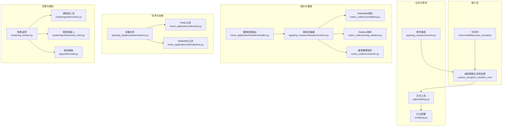
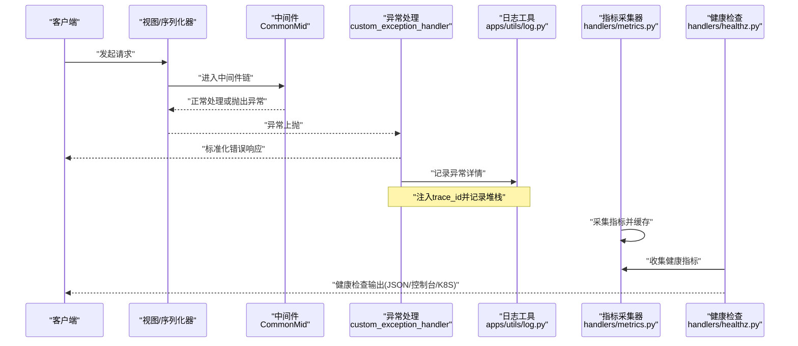
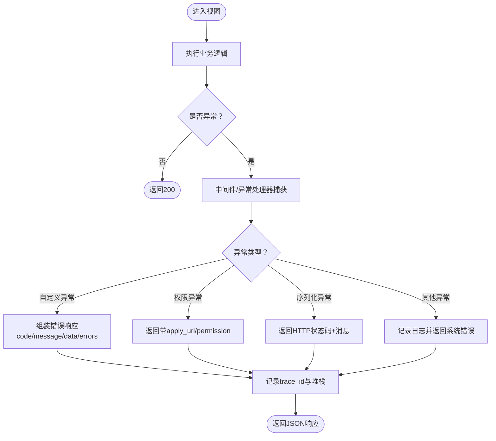
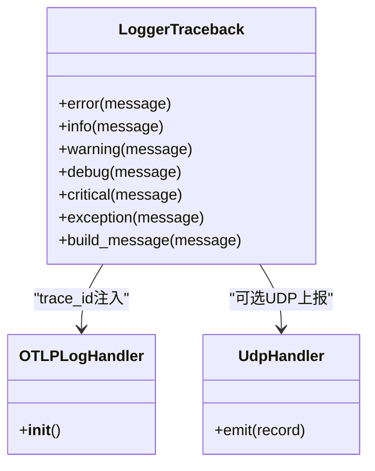
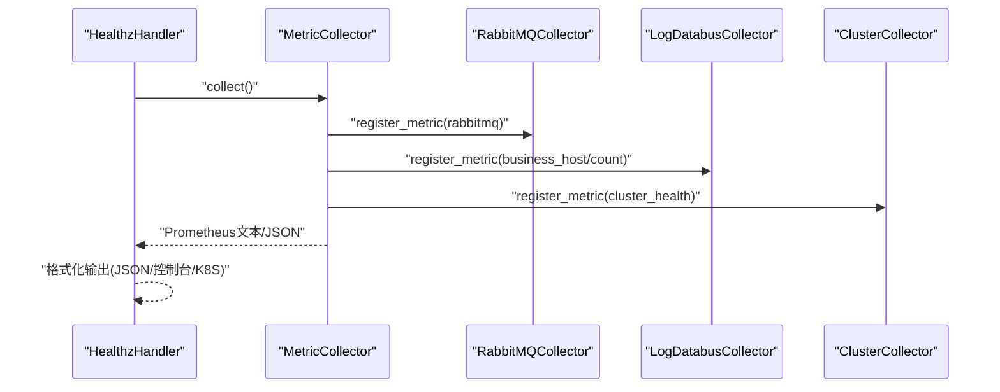
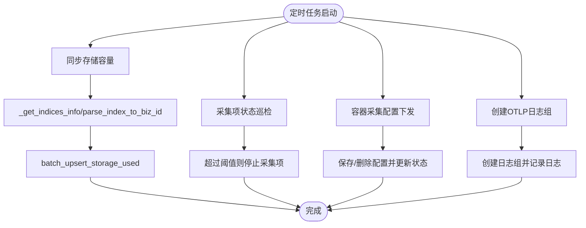
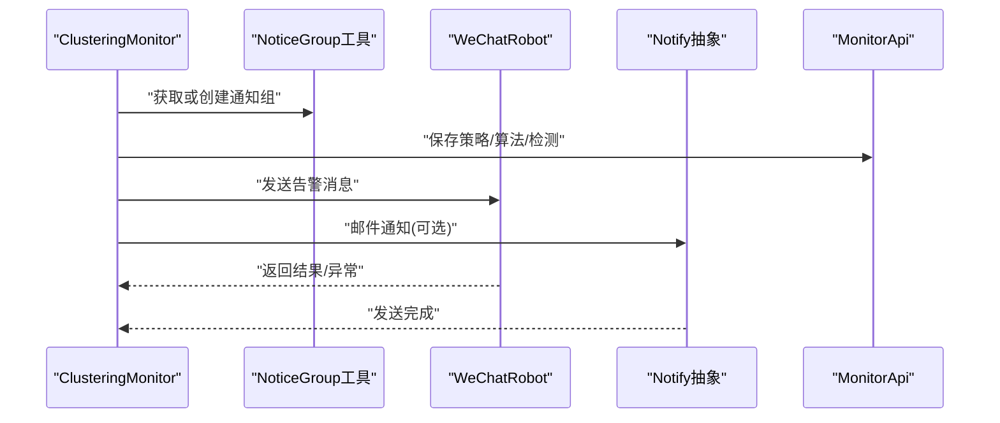
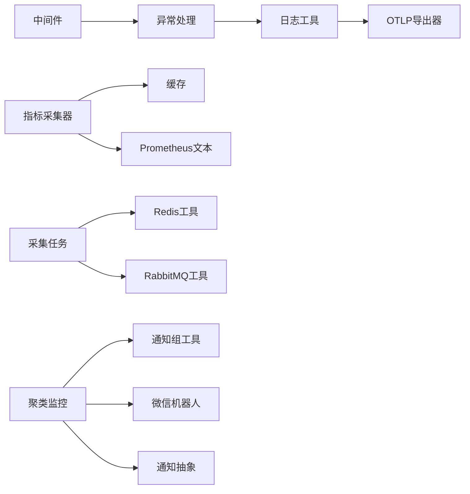

# 故障排除和调试

<cite>
**本文引用的文件**
- [apps/middlewares.py](file://apps/middlewares.py)
- [apps/generic.py](file://apps/generic.py)
- [apps/exceptions.py](file://apps/exceptions.py)
- [apps/api/exception.py](file://apps/api/exception.py)
- [config/log.py](file://config/log.py)
- [apps/utils/log.py](file://apps/utils/log.py)
- [apps/log_measure/handlers/metrics.py](file://apps/log_measure/handlers/metrics.py)
- [apps/log_measure/handlers/metric_collectors/rabbitmq.py](file://apps/log_measure/handlers/metric_collectors/rabbitmq.py)
- [apps/log_measure/handlers/metric_collectors/log_databus.py](file://apps/log_measure/handlers/metric_collectors/log_databus.py)
- [apps/log_measure/handlers/metric_collectors/cluster.py](file://apps/log_measure/handlers/metric_collectors/cluster.py)
- [home_application/handlers/healthz.py](file://home_application/handlers/healthz.py)
- [home_application/utils/redis.py](file://home_application/utils/redis.py)
- [home_application/utils/rabbitmq.py](file://home_application/utils/rabbitmq.py)
- [apps/log_databus/tasks/collector.py](file://apps/log_databus/tasks/collector.py)
- [apps/log_clustering/handlers/clustering_monitor.py](file://apps/log_clustering/handlers/clustering_monitor.py)
- [apps/log_clustering/utils/monitor.py](file://apps/log_clustering/utils/monitor.py)
- [apps/log_clustering/constants.py](file://apps/log_clustering/constants.py)
- [apps/log_clustering/utils/wechat_robot.py](file://apps/log_clustering/utils/wechat_robot.py)
- [apps/utils/notify.py](file://apps/utils/notify.py)
- [apps/log_measure/events.py](file://apps/log_measure/events.py)
</cite>

## 目录
1. [简介](#简介)
2. [项目结构](#项目结构)
3. [核心组件](#核心组件)
4. [架构总览](#架构总览)
5. [详细组件分析](#详细组件分析)
6. [依赖分析](#依赖分析)
7. [性能考量](#性能考量)
8. [故障排查指南](#故障排查指南)
9. [结论](#结论)
10. [附录](#附录)

## 简介
本文件面向运维与开发人员，提供bklog项目的故障排除与调试技术文档。内容覆盖部署问题、性能问题与集成问题的诊断流程；调试工具与技术（日志分析、性能分析、问题定位技巧）；错误处理机制（异常捕获、错误分类、恢复策略）；监控与告警配置（关键指标监控、异常检测、告警通知）；标准故障处理流程与应急响应方案，并结合仓库内真实代码路径给出可操作的排查步骤与参考。

## 项目结构
bklog采用Django+Django REST Framework的后端架构，围绕“日志采集-存储-检索-分析-告警”的全链路能力组织模块。与故障排除密切相关的模块包括：
- 中间件与异常处理：统一异常捕获、错误响应与可观测性埋点
- 日志配置与输出：多通道日志、OTLP/UDP上报
- 指标采集与健康检查：Prometheus文本格式指标、健康检查输出
- 任务与定时任务：采集项状态维护、存储容量同步等
- 聚类与告警：智能检测、通知组、微信机器人对接
- 通知体系：邮件等通知渠道封装

图表来源
- [apps/middlewares.py:125-197](file://apps/middlewares.py#L125-L197)
- [apps/generic.py:299-379](file://apps/generic.py#L299-L379)
- [config/log.py:22-157](file://config/log.py#L22-L157)
- [apps/utils/log.py:176-206](file://apps/utils/log.py#L176-L206)
- [apps/log_measure/handlers/metrics.py:121-157](file://apps/log_measure/handlers/metrics.py#L121-L157)
- [apps/log_measure/handlers/metric_collectors/rabbitmq.py:1-40](file://apps/log_measure/handlers/metric_collectors/rabbitmq.py#L1-L40)
- [apps/log_measure/handlers/metric_collectors/log_databus.py:146-243](file://apps/log_measure/handlers/metric_collectors/log_databus.py#L146-L243)
- [apps/log_measure/handlers/metric_collectors/cluster.py:33-50](file://apps/log_measure/handlers/metric_collectors/cluster.py#L33-L50)
- [home_application/handlers/healthz.py:34-120](file://home_application/handlers/healthz.py#L34-L120)
- [apps/log_databus/tasks/collector.py:100-192](file://apps/log_databus/tasks/collector.py#L100-L192)
- [home_application/utils/redis.py:93-121](file://home_application/utils/redis.py#L93-L121)
- [home_application/utils/rabbitmq.py:88-114](file://home_application/utils/rabbitmq.py#L88-L114)
- [apps/log_clustering/handlers/clustering_monitor.py:119-560](file://apps/log_clustering/handlers/clustering_monitor.py#L119-L560)
- [apps/log_clustering/utils/monitor.py:49-79](file://apps/log_clustering/utils/monitor.py#L49-L79)
- [apps/log_clustering/utils/wechat_robot.py:30-43](file://apps/log_clustering/utils/wechat_robot.py#L30-L43)
- [apps/utils/notify.py:29-71](file://apps/utils/notify.py#L29-L71)
- [apps/log_measure/events.py:19-31](file://apps/log_measure/events.py#L19-L31)

章节来源
- [apps/middlewares.py:125-197](file://apps/middlewares.py#L125-L197)
- [apps/generic.py:299-379](file://apps/generic.py#L299-L379)
- [config/log.py:22-157](file://config/log.py#L22-L157)
- [apps/utils/log.py:176-206](file://apps/utils/log.py#L176-L206)
- [apps/log_measure/handlers/metrics.py:121-157](file://apps/log_measure/handlers/metrics.py#L121-L157)

## 核心组件
- 统一异常与响应
  - 中间件统一捕获未处理异常，按类型返回标准化JSON响应
  - 通用异常处理器对自定义异常、权限异常、序列化异常等进行分类处理
- 日志与可观测性
  - 多通道日志配置，支持本地文件、组件日志、MySQL、Celery、OTLP/UDP上报
  - Trace ID注入，便于跨服务串联定位
- 指标与健康检查
  - 指标采集器注册装饰器，统一Prometheus文本格式输出
  - 健康检查输出支持JSON/控制台/K8S格式
- 任务与运维
  - 采集项状态巡检、存储容量同步、容器采集配置下发等定时任务
- 告警与通知
  - 聚类监控策略构建、通知组管理、微信机器人对接、邮件通知抽象

章节来源
- [apps/middlewares.py:125-197](file://apps/middlewares.py#L125-L197)
- [apps/generic.py:299-379](file://apps/generic.py#L299-L379)
- [config/log.py:22-157](file://config/log.py#L22-L157)
- [apps/utils/log.py:176-206](file://apps/utils/log.py#L176-L206)
- [apps/log_measure/handlers/metrics.py:71-92](file://apps/log_measure/handlers/metrics.py#L71-L92)
- [home_application/handlers/healthz.py:34-120](file://home_application/handlers/healthz.py#L34-L120)
- [apps/log_databus/tasks/collector.py:100-192](file://apps/log_databus/tasks/collector.py#L100-L192)
- [apps/log_clustering/handlers/clustering_monitor.py:119-560](file://apps/log_clustering/handlers/clustering_monitor.py#L119-L560)

## 架构总览
下图展示从请求到异常处理、日志输出、指标采集与健康检查的整体流程，以及与任务调度、告警通知的交互。

图表来源
- [apps/middlewares.py:125-197](file://apps/middlewares.py#L125-L197)
- [apps/generic.py:299-379](file://apps/generic.py#L299-L379)
- [apps/utils/log.py:176-206](file://apps/utils/log.py#L176-L206)
- [apps/log_measure/handlers/metrics.py:121-157](file://apps/log_measure/handlers/metrics.py#L121-L157)
- [home_application/handlers/healthz.py:34-120](file://home_application/handlers/healthz.py#L34-L120)

## 详细组件分析

### 组件A：异常处理与统一响应
- 功能要点
  - 中间件捕获未处理异常，区分自定义异常、蓝鲸异常与未捕获异常，分别返回不同结构
  - 通用异常处理器对404、权限、序列化、自定义异常进行分类处理，并记录日志与旁路告警
  - 错误码统一前缀拼接，便于前端识别与定位
- 关键路径
  - 中间件异常处理：[apps/middlewares.py:139-196](file://apps/middlewares.py#L139-L196)
  - 通用异常处理：[apps/generic.py:299-379](file://apps/generic.py#L299-L379)
  - 自定义异常基类与错误码：[apps/exceptions.py:26-145](file://apps/exceptions.py#L26-L145)
  - API异常封装：[apps/api/exception.py:25-41](file://apps/api/exception.py#L25-L41)

图表来源
- [apps/middlewares.py:139-196](file://apps/middlewares.py#L139-L196)
- [apps/generic.py:299-379](file://apps/generic.py#L299-L379)

章节来源
- [apps/middlewares.py:139-196](file://apps/middlewares.py#L139-L196)
- [apps/generic.py:299-379](file://apps/generic.py#L299-L379)
- [apps/exceptions.py:26-145](file://apps/exceptions.py#L26-L145)
- [apps/api/exception.py:25-41](file://apps/api/exception.py#L25-L41)

### 组件B：日志与可观测性
- 功能要点
  - 多通道日志配置：Django、组件、MySQL、Celery、root、iam、bk_dataview、bk_monitor等
  - 支持JSON格式、滚动文件、UDP/OTLP上报
  - Trace ID注入，异常堆栈记录，curl请求/响应日志辅助
- 关键路径
  - 日志配置工厂：[config/log.py:22-157](file://config/log.py#L22-L157)
  - 日志工具与OTLP/UDP处理器：[apps/utils/log.py:51-206](file://apps/utils/log.py#L51-L206)
  - 事件触发（旁路告警）：[apps/log_measure/events.py:19-31](file://apps/log_measure/events.py#L19-L31)

图表来源
- [apps/utils/log.py:51-206](file://apps/utils/log.py#L51-L206)
- [apps/log_measure/events.py:19-31](file://apps/log_measure/events.py#L19-L31)

章节来源
- [config/log.py:22-157](file://config/log.py#L22-L157)
- [apps/utils/log.py:51-206](file://apps/utils/log.py#L51-L206)
- [apps/log_measure/events.py:19-31](file://apps/log_measure/events.py#L19-L31)

### 组件C：指标采集与健康检查
- 功能要点
  - 指标采集器注册装饰器，支持缓存与Prometheus文本格式输出
  - RabbitMQ、Databus、集群健康等指标采集器
  - 健康检查输出支持多种格式，便于K8S/控制台/JSON消费
- 关键路径
  - 指标采集器入口与格式化：[apps/log_measure/handlers/metrics.py:71-157](file://apps/log_measure/handlers/metrics.py#L71-L157)
  - RabbitMQ指标采集：[apps/log_measure/handlers/metric_collectors/rabbitmq.py:1-40](file://apps/log_measure/handlers/metric_collectors/rabbitmq.py#L1-L40)
  - Databus指标采集：[apps/log_measure/handlers/metric_collectors/log_databus.py:146-243](file://apps/log_measure/handlers/metric_collectors/log_databus.py#L146-L243)
  - 集群健康指标采集：[apps/log_measure/handlers/metric_collectors/cluster.py:33-50](file://apps/log_measure/handlers/metric_collectors/cluster.py#L33-L50)
  - 健康检查输出：[home_application/handlers/healthz.py:34-120](file://home_application/handlers/healthz.py#L34-L120)

图表来源
- [apps/log_measure/handlers/metrics.py:71-157](file://apps/log_measure/handlers/metrics.py#L71-L157)
- [apps/log_measure/handlers/metric_collectors/rabbitmq.py:1-40](file://apps/log_measure/handlers/metric_collectors/rabbitmq.py#L1-L40)
- [apps/log_measure/handlers/metric_collectors/log_databus.py:146-243](file://apps/log_measure/handlers/metric_collectors/log_databus.py#L146-L243)
- [apps/log_measure/handlers/metric_collectors/cluster.py:33-50](file://apps/log_measure/handlers/metric_collectors/cluster.py#L33-L50)
- [home_application/handlers/healthz.py:34-120](file://home_application/handlers/healthz.py#L34-L120)

章节来源
- [apps/log_measure/handlers/metrics.py:71-157](file://apps/log_measure/handlers/metrics.py#L71-L157)
- [apps/log_measure/handlers/metric_collectors/rabbitmq.py:1-40](file://apps/log_measure/handlers/metric_collectors/rabbitmq.py#L1-L40)
- [apps/log_measure/handlers/metric_collectors/log_databus.py:146-243](file://apps/log_measure/handlers/metric_collectors/log_databus.py#L146-L243)
- [apps/log_measure/handlers/metric_collectors/cluster.py:33-50](file://apps/log_measure/handlers/metric_collectors/cluster.py#L33-L50)
- [home_application/handlers/healthz.py:34-120](file://home_application/handlers/healthz.py#L34-L120)

### 组件D：任务与运维（采集与存储）
- 功能要点
  - 定时任务：采集项状态巡检、存储容量同步、容器采集配置下发、OTLP日志组创建
  - Redis/RabbitMQ工具：队列长度、命中率、连接与消息统计
- 关键路径
  - 采集任务与巡检：[apps/log_databus/tasks/collector.py:100-192](file://apps/log_databus/tasks/collector.py#L100-L192)
  - Redis队列长度与命中率：[home_application/utils/redis.py:93-121](file://home_application/utils/redis.py#L93-L121)
  - RabbitMQ队列长度与消息统计：[home_application/utils/rabbitmq.py:88-114](file://home_application/utils/rabbitmq.py#L88-L114)

图表来源
- [apps/log_databus/tasks/collector.py:100-192](file://apps/log_databus/tasks/collector.py#L100-L192)
- [apps/log_databus/tasks/collector.py:240-333](file://apps/log_databus/tasks/collector.py#L240-L333)
- [apps/log_databus/tasks/collector.py:335-417](file://apps/log_databus/tasks/collector.py#L335-L417)
- [apps/log_databus/tasks/collector.py:461-506](file://apps/log_databus/tasks/collector.py#L461-L506)
- [apps/log_databus/tasks/collector.py:527-576](file://apps/log_databus/tasks/collector.py#L527-L576)
- [home_application/utils/redis.py:93-121](file://home_application/utils/redis.py#L93-L121)
- [home_application/utils/rabbitmq.py:88-114](file://home_application/utils/rabbitmq.py#L88-L114)

章节来源
- [apps/log_databus/tasks/collector.py:100-192](file://apps/log_databus/tasks/collector.py#L100-L192)
- [apps/log_databus/tasks/collector.py:240-333](file://apps/log_databus/tasks/collector.py#L240-L333)
- [apps/log_databus/tasks/collector.py:335-417](file://apps/log_databus/tasks/collector.py#L335-L417)
- [apps/log_databus/tasks/collector.py:461-506](file://apps/log_databus/tasks/collector.py#L461-L506)
- [apps/log_databus/tasks/collector.py:527-576](file://apps/log_databus/tasks/collector.py#L527-L576)
- [home_application/utils/redis.py:93-121](file://home_application/utils/redis.py#L93-L121)
- [home_application/utils/rabbitmq.py:88-114](file://home_application/utils/rabbitmq.py#L88-L114)

### 组件E：聚类监控与告警
- 功能要点
  - 构建聚类监控策略（计数、算法、检测、通知），支持通知组动态创建
  - 微信机器人对接，开关控制
  - 通知抽象（邮件等）
- 关键路径
  - 聚类监控策略构建与通知组：[apps/log_clustering/handlers/clustering_monitor.py:119-560](file://apps/log_clustering/handlers/clustering_monitor.py#L119-L560)
  - 通知组工具：[apps/log_clustering/utils/monitor.py:49-79](file://apps/log_clustering/utils/monitor.py#L49-L79)
  - 常量与触发配置：[apps/log_clustering/constants.py:95-142](file://apps/log_clustering/constants.py#L95-L142)
  - 微信机器人：[apps/log_clustering/utils/wechat_robot.py:30-43](file://apps/log_clustering/utils/wechat_robot.py#L30-L43)
  - 通知抽象：[apps/utils/notify.py:29-71](file://apps/utils/notify.py#L29-L71)

图表来源
- [apps/log_clustering/handlers/clustering_monitor.py:119-560](file://apps/log_clustering/handlers/clustering_monitor.py#L119-L560)
- [apps/log_clustering/utils/monitor.py:49-79](file://apps/log_clustering/utils/monitor.py#L49-L79)
- [apps/log_clustering/utils/wechat_robot.py:30-43](file://apps/log_clustering/utils/wechat_robot.py#L30-L43)
- [apps/utils/notify.py:29-71](file://apps/utils/notify.py#L29-L71)

章节来源
- [apps/log_clustering/handlers/clustering_monitor.py:119-560](file://apps/log_clustering/handlers/clustering_monitor.py#L119-L560)
- [apps/log_clustering/utils/monitor.py:49-79](file://apps/log_clustering/utils/monitor.py#L49-L79)
- [apps/log_clustering/constants.py:95-142](file://apps/log_clustering/constants.py#L95-L142)
- [apps/log_clustering/utils/wechat_robot.py:30-43](file://apps/log_clustering/utils/wechat_robot.py#L30-L43)
- [apps/utils/notify.py:29-71](file://apps/utils/notify.py#L29-L71)

## 依赖分析
- 组件耦合
  - 异常处理依赖中间件与通用异常类，确保前后端一致的错误契约
  - 日志工具依赖OpenTelemetry trace，保证跨进程/线程的trace_id一致性
  - 指标采集器依赖缓存与Prometheus格式化，降低重复计算与输出开销
  - 任务模块依赖Redis/RabbitMQ工具与ES客户端，保障运维操作的可观测与可恢复
  - 告警模块依赖通知组与通知抽象，形成可扩展的通知渠道
- 外部依赖
  - OpenTelemetry导出器（OTLP）、Django日志框架、Celery任务队列、蓝鲸组件API网关

图表来源
- [apps/middlewares.py:125-197](file://apps/middlewares.py#L125-L197)
- [apps/generic.py:299-379](file://apps/generic.py#L299-L379)
- [apps/utils/log.py:91-120](file://apps/utils/log.py#L91-L120)
- [apps/log_measure/handlers/metrics.py:71-92](file://apps/log_measure/handlers/metrics.py#L71-L92)
- [apps/log_databus/tasks/collector.py:100-192](file://apps/log_databus/tasks/collector.py#L100-L192)
- [home_application/utils/redis.py:93-121](file://home_application/utils/redis.py#L93-L121)
- [home_application/utils/rabbitmq.py:88-114](file://home_application/utils/rabbitmq.py#L88-L114)
- [apps/log_clustering/handlers/clustering_monitor.py:119-560](file://apps/log_clustering/handlers/clustering_monitor.py#L119-L560)
- [apps/log_clustering/utils/monitor.py:49-79](file://apps/log_clustering/utils/monitor.py#L49-L79)
- [apps/log_clustering/utils/wechat_robot.py:30-43](file://apps/log_clustering/utils/wechat_robot.py#L30-L43)
- [apps/utils/notify.py:29-71](file://apps/utils/notify.py#L29-L71)

章节来源
- [apps/middlewares.py:125-197](file://apps/middlewares.py#L125-L197)
- [apps/generic.py:299-379](file://apps/generic.py#L299-L379)
- [apps/utils/log.py:91-120](file://apps/utils/log.py#L91-L120)
- [apps/log_measure/handlers/metrics.py:71-92](file://apps/log_measure/handlers/metrics.py#L71-L92)
- [apps/log_databus/tasks/collector.py:100-192](file://apps/log_databus/tasks/collector.py#L100-L192)
- [apps/log_clustering/handlers/clustering_monitor.py:119-560](file://apps/log_clustering/handlers/clustering_monitor.py#L119-L560)

## 性能考量
- 指标采集缓存
  - 通过装饰器缓存减少重复计算，Prometheus文本格式输出降低传输体积
- 日志输出优化
  - JSON格式与滚动文件，避免频繁I/O；OTLP/UDP可选上报，减轻网络压力
- 任务批处理
  - 存储容量同步采用批量插入/更新，减少数据库往返
- 健康检查输出
  - 多格式输出适配不同消费方，避免重复计算

章节来源
- [apps/log_measure/handlers/metrics.py:71-92](file://apps/log_measure/handlers/metrics.py#L71-L92)
- [config/log.py:22-157](file://config/log.py#L22-L157)
- [apps/log_databus/tasks/collector.py:527-576](file://apps/log_databus/tasks/collector.py#L527-L576)
- [home_application/handlers/healthz.py:34-120](file://home_application/handlers/healthz.py#L34-L120)

## 故障排查指南

### 1. 部署问题
- 症状
  - 访问出现“仅支持正式环境部署”提示
  - HTTPS跳转异常
- 排查步骤
  - 检查运行模式与测试开关：[apps/middlewares.py:130-138](file://apps/middlewares.py#L130-L138)
  - 检查HTTPS强制跳转逻辑：[apps/middlewares.py:205-211](file://apps/middlewares.py#L205-L211)
  - 确认环境变量与域名配置
- 建议
  - 正式环境部署时移除测试限制或正确配置测试开关
  - 确保DEFAULT_HTTPS_HOST与证书配置正确

章节来源
- [apps/middlewares.py:130-138](file://apps/middlewares.py#L130-L138)
- [apps/middlewares.py:205-211](file://apps/middlewares.py#L205-L211)

### 2. 性能问题
- 症状
  - 接口响应慢、指标采集耗时高、队列堆积
- 排查步骤
  - 查看指标采集耗时与缓存命中：[apps/log_measure/handlers/metrics.py:128-144](file://apps/log_measure/handlers/metrics.py#L128-L144)
  - 检查Redis队列长度与命中率：[home_application/utils/redis.py:93-121](file://home_application/utils/redis.py#L93-L121)
  - 检查RabbitMQ队列长度与消息统计：[home_application/utils/rabbitmq.py:88-114](file://home_application/utils/rabbitmq.py#L88-L114)
  - 查看健康检查输出，定位瓶颈模块：[home_application/handlers/healthz.py:34-120](file://home_application/handlers/healthz.py#L34-L120)
- 建议
  - 优化采集频率与缓存策略
  - 调整队列优先级与消费者并发
  - 对热点指标增加缓存或降采样

章节来源
- [apps/log_measure/handlers/metrics.py:128-144](file://apps/log_measure/handlers/metrics.py#L128-L144)
- [home_application/utils/redis.py:93-121](file://home_application/utils/redis.py#L93-L121)
- [home_application/utils/rabbitmq.py:88-114](file://home_application/utils/rabbitmq.py#L88-L114)
- [home_application/handlers/healthz.py:34-120](file://home_application/handlers/healthz.py#L34-L120)

### 3. 集成问题
- 症状
  - 聚类告警未触发、通知组缺失、微信机器人无法发送
- 排查步骤
  - 检查聚类监控策略构建与通知组创建：[apps/log_clustering/handlers/clustering_monitor.py:119-560](file://apps/log_clustering/handlers/clustering_monitor.py#L119-L560)
  - 检查通知组工具与默认通知方式：[apps/log_clustering/utils/monitor.py:49-79](file://apps/log_clustering/utils/monitor.py#L49-L79)
  - 检查微信机器人开关与URL配置：[apps/log_clustering/utils/wechat_robot.py:30-43](file://apps/log_clustering/utils/wechat_robot.py#L30-L43)
  - 检查通知抽象与邮件模板：[apps/utils/notify.py:29-71](file://apps/utils/notify.py#L29-L71)
- 建议
  - 确保FeatureToggle开启并配置正确
  - 校验通知组成员与通知方式
  - 校验微信WebHook可用性与权限

章节来源
- [apps/log_clustering/handlers/clustering_monitor.py:119-560](file://apps/log_clustering/handlers/clustering_monitor.py#L119-L560)
- [apps/log_clustering/utils/monitor.py:49-79](file://apps/log_clustering/utils/monitor.py#L49-L79)
- [apps/log_clustering/utils/wechat_robot.py:30-43](file://apps/log_clustering/utils/wechat_robot.py#L30-L43)
- [apps/utils/notify.py:29-71](file://apps/utils/notify.py#L29-L71)

### 4. 日志分析与问题定位
- 症状
  - 无法定位异常来源、trace_id缺失、日志分散
- 排查步骤
  - 使用Trace ID串联请求链路：[apps/utils/log.py:176-177](file://apps/utils/log.py#L176-L177)
  - 检查日志配置与输出通道：[config/log.py:22-157](file://config/log.py#L22-L157)
  - 使用curl日志辅助定位第三方接口问题：[apps/utils/log.py:180-206](file://apps/utils/log.py#L180-L206)
  - 在异常处理中记录详细堆栈：[apps/generic.py:352-354](file://apps/generic.py#L352-L354)
- 建议
  - 统一注入trace_id并在所有日志中携带
  - 开启OTLP/UDP上报以便集中采集
  - 对关键路径增加日志埋点与耗时统计

章节来源
- [apps/utils/log.py:176-177](file://apps/utils/log.py#L176-L177)
- [config/log.py:22-157](file://config/log.py#L22-L157)
- [apps/utils/log.py:180-206](file://apps/utils/log.py#L180-L206)
- [apps/generic.py:352-354](file://apps/generic.py#L352-L354)

### 5. 错误处理机制
- 症状
  - 前端收到非预期错误、权限异常未正确透传
- 排查步骤
  - 检查中间件异常捕获与响应：[apps/middlewares.py:139-196](file://apps/middlewares.py#L139-L196)
  - 检查通用异常处理与错误码拼接：[apps/generic.py:299-379](file://apps/generic.py#L299-L379)
  - 检查自定义异常类与错误码定义：[apps/exceptions.py:26-145](file://apps/exceptions.py#L26-L145)
  - 检查API异常封装：[apps/api/exception.py:25-41](file://apps/api/exception.py#L25-L41)
- 建议
  - 明确异常分类与错误码前缀
  - 对权限异常返回apply_url与权限信息
  - 对未捕获异常统一返回系统错误并记录trace_id

章节来源
- [apps/middlewares.py:139-196](file://apps/middlewares.py#L139-L196)
- [apps/generic.py:299-379](file://apps/generic.py#L299-L379)
- [apps/exceptions.py:26-145](file://apps/exceptions.py#L26-L145)
- [apps/api/exception.py:25-41](file://apps/api/exception.py#L25-L41)

### 6. 监控与告警配置
- 症状
  - 指标缺失、健康检查异常、告警未触达
- 排查步骤
  - 检查指标采集器注册与缓存：[apps/log_measure/handlers/metrics.py:71-92](file://apps/log_measure/handlers/metrics.py#L71-L92)
  - 检查健康检查输出格式与建议提示：[home_application/handlers/healthz.py:34-120](file://home_application/handlers/healthz.py#L34-L120)
  - 检查聚类监控策略与通知组：[apps/log_clustering/handlers/clustering_monitor.py:119-560](file://apps/log_clustering/handlers/clustering_monitor.py#L119-L560)
  - 检查通知组与默认通知方式：[apps/log_clustering/utils/monitor.py:49-79](file://apps/log_clustering/utils/monitor.py#L49-L79)
- 建议
  - 确保指标命名规范与维度完整
  - 对关键健康指标增加建议提示
  - 对通知组与通知方式定期校验

章节来源
- [apps/log_measure/handlers/metrics.py:71-92](file://apps/log_measure/handlers/metrics.py#L71-L92)
- [home_application/handlers/healthz.py:34-120](file://home_application/handlers/healthz.py#L34-L120)
- [apps/log_clustering/handlers/clustering_monitor.py:119-560](file://apps/log_clustering/handlers/clustering_monitor.py#L119-L560)
- [apps/log_clustering/utils/monitor.py:49-79](file://apps/log_clustering/utils/monitor.py#L49-L79)

### 7. 标准流程与应急响应
- 标准流程
  - 问题发现 → 快速复现 → 日志与指标定位 → 修复验证 → 回归测试
- 应急响应
  - 临时降级/熔断（如微信机器人开关）
  - 快速回滚（版本/配置）
  - 旁路告警（事件触发）与通知
- 参考路径
  - 旁路告警事件触发：[apps/log_measure/events.py:19-31](file://apps/log_measure/events.py#L19-L31)
  - 通知抽象与邮件发送：[apps/utils/notify.py:29-71](file://apps/utils/notify.py#L29-L71)

章节来源
- [apps/log_measure/events.py:19-31](file://apps/log_measure/events.py#L19-L31)
- [apps/utils/notify.py:29-71](file://apps/utils/notify.py#L29-L71)

### 8. 实际案例
- 案例1：采集项长时间未入库
  - 现象：采集项状态异常、存储容量未增长
  - 排查：定时任务巡检与停止逻辑、索引解析与容量统计
  - 参考路径：[apps/log_databus/tasks/collector.py:100-192](file://apps/log_databus/tasks/collector.py#L100-L192)，[apps/log_databus/tasks/collector.py:240-333](file://apps/log_databus/tasks/collector.py#L240-L333)
- 案例2：RabbitMQ队列堆积
  - 现象：消息积压、消费者延迟
  - 排查：队列长度与消息统计、优先级配置
  - 参考路径：[home_application/utils/rabbitmq.py:88-114](file://home_application/utils/rabbitmq.py#L88-L114)，[apps/log_measure/handlers/metric_collectors/rabbitmq.py:1-40](file://apps/log_measure/handlers/metric_collectors/rabbitmq.py#L1-L40)
- 案例3：聚类告警未触发
  - 现象：日志量激增但未产生告警
  - 排查：策略构建、通知组、微信机器人开关
  - 参考路径：[apps/log_clustering/handlers/clustering_monitor.py:119-560](file://apps/log_clustering/handlers/clustering_monitor.py#L119-L560)，[apps/log_clustering/utils/wechat_robot.py:30-43](file://apps/log_clustering/utils/wechat_robot.py#L30-L43)

章节来源
- [apps/log_databus/tasks/collector.py:100-192](file://apps/log_databus/tasks/collector.py#L100-L192)
- [apps/log_databus/tasks/collector.py:240-333](file://apps/log_databus/tasks/collector.py#L240-L333)
- [home_application/utils/rabbitmq.py:88-114](file://home_application/utils/rabbitmq.py#L88-L114)
- [apps/log_measure/handlers/metric_collectors/rabbitmq.py:1-40](file://apps/log_measure/handlers/metric_collectors/rabbitmq.py#L1-L40)
- [apps/log_clustering/handlers/clustering_monitor.py:119-560](file://apps/log_clustering/handlers/clustering_monitor.py#L119-L560)
- [apps/log_clustering/utils/wechat_robot.py:30-43](file://apps/log_clustering/utils/wechat_robot.py#L30-L43)

## 结论
本文件基于bklog项目源码梳理了故障排除与调试的关键路径与机制，涵盖异常处理、日志与可观测性、指标采集与健康检查、任务与运维、聚类监控与告警等方面。建议在日常运维中：
- 统一异常与错误码规范，确保前后端一致
- 注入trace_id并启用OTLP/UDP上报，提升问题定位效率
- 通过缓存与批处理优化指标采集与任务执行
- 完善健康检查输出与通知渠道，确保告警及时触达
- 建立标准流程与应急响应预案，快速恢复业务

## 附录
- 关键配置项
  - 日志级别与输出通道：[config/log.py:22-157](file://config/log.py#L22-L157)
  - 中间件与异常处理：[apps/middlewares.py:125-197](file://apps/middlewares.py#L125-L197)，[apps/generic.py:299-379](file://apps/generic.py#L299-L379)
  - 指标采集与健康检查：[apps/log_measure/handlers/metrics.py:71-157](file://apps/log_measure/handlers/metrics.py#L71-L157)，[home_application/handlers/healthz.py:34-120](file://home_application/handlers/healthz.py#L34-L120)
  - 任务与运维：[apps/log_databus/tasks/collector.py:100-192](file://apps/log_databus/tasks/collector.py#L100-L192)
  - 告警与通知：[apps/log_clustering/handlers/clustering_monitor.py:119-560](file://apps/log_clustering/handlers/clustering_monitor.py#L119-L560)，[apps/log_clustering/utils/monitor.py:49-79](file://apps/log_clustering/utils/monitor.py#L49-L79)，[apps/log_clustering/utils/wechat_robot.py:30-43](file://apps/log_clustering/utils/wechat_robot.py#L30-L43)，[apps/utils/notify.py:29-71](file://apps/utils/notify.py#L29-L71)