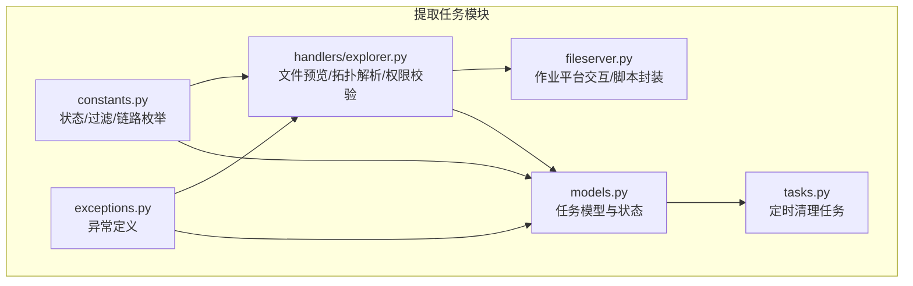
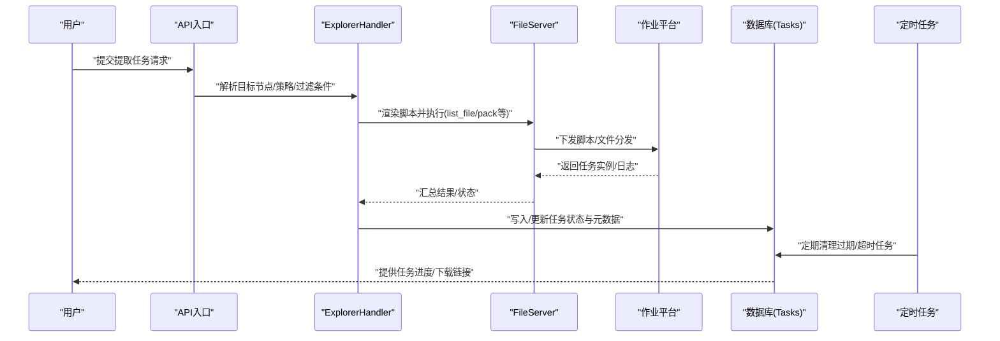
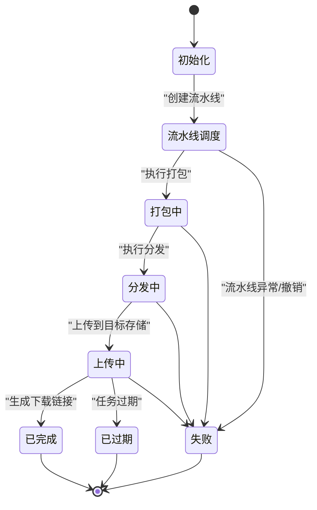
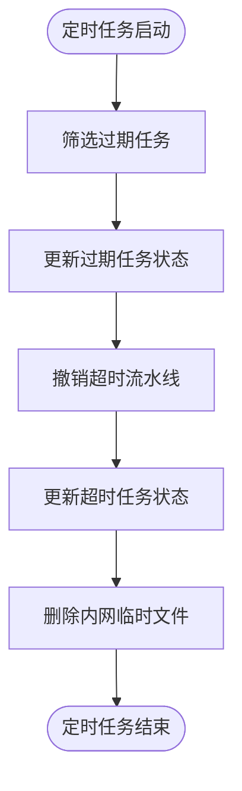
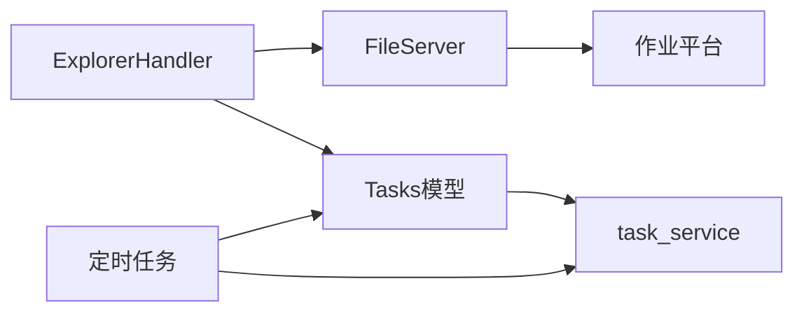

# 提取任务管理

<cite>
**本文引用的文件**
- [apps/log_extract/models.py](file://apps/log_extract/models.py)
- [apps/log_extract/tasks.py](file://apps/log_extract/tasks.py)
- [apps/log_extract/constants.py](file://apps/log_extract/constants.py)
- [apps/log_extract/handlers/explorer.py](file://apps/log_extract/handlers/explorer.py)
- [apps/log_extract/fileserver.py](file://apps/log_extract/fileserver.py)
- [apps/log_extract/exceptions.py](file://apps/log_extract/exceptions.py)
</cite>

## 目录
1. [简介](#简介)
2. [项目结构](#项目结构)
3. [核心组件](#核心组件)
4. [架构总览](#架构总览)
5. [详细组件分析](#详细组件分析)
6. [依赖分析](#依赖分析)
7. [性能考量](#性能考量)
8. [故障排查指南](#故障排查指南)
9. [结论](#结论)
10. [附录](#附录)

## 简介
本技术文档围绕“提取任务管理”模块，系统性阐述提取任务的生命周期管理（创建、状态跟踪、执行监控、结果处理）、任务配置参数（提取范围、过滤条件、输出格式、存储位置）、任务调度机制（定时清理、手动触发、批量处理）、状态管理（待执行、执行中、已完成、失败等）以及监控与告警机制。文档同时提供实际任务配置示例与常见问题的解决方案，帮助开发者与运维人员快速理解与落地。

## 项目结构
提取任务管理相关代码主要位于 apps/log_extract 目录，关键文件包括：
- 模型与状态：models.py
- 定时任务：tasks.py
- 常量与枚举：constants.py
- 任务执行与文件预览：handlers/explorer.py
- 作业平台交互与脚本封装：fileserver.py
- 异常定义：exceptions.py

图表来源
- [apps/log_extract/models.py:73-140](file://apps/log_extract/models.py#L73-L140)
- [apps/log_extract/constants.py:28-186](file://apps/log_extract/constants.py#L28-L186)
- [apps/log_extract/handlers/explorer.py:57-127](file://apps/log_extract/handlers/explorer.py#L57-L127)
- [apps/log_extract/fileserver.py:39-131](file://apps/log_extract/fileserver.py#L39-L131)
- [apps/log_extract/tasks.py:38-87](file://apps/log_extract/tasks.py#L38-L87)

章节来源
- [apps/log_extract/models.py:73-140](file://apps/log_extract/models.py#L73-L140)
- [apps/log_extract/constants.py:28-186](file://apps/log_extract/constants.py#L28-L186)
- [apps/log_extract/handlers/explorer.py:57-127](file://apps/log_extract/handlers/explorer.py#L57-L127)
- [apps/log_extract/fileserver.py:39-131](file://apps/log_extract/fileserver.py#L39-L131)
- [apps/log_extract/tasks.py:38-87](file://apps/log_extract/tasks.py#L38-L87)

## 核心组件
- 任务模型与状态
  - 任务实体包含目标节点类型、IP列表、文件路径、过滤类型与内容、下载状态、过期时间、流水线ID与组件ID、作业任务ID、云石上传/下载票据与任务ID、预览目录与时间范围、额外数据、cos文件名、链路ID等字段。
  - 提供计算总耗时、IP数量、下载文件统计等辅助方法。
- 状态与枚举
  - 下载状态涵盖初始化、流水线调度、打包、分发、上传、完成、过期、失败等。
  - 过滤类型包括关键字匹配、行数范围、尾部N行、关键字范围等。
  - 链路类型支持内网链路、腾讯云COS、BK Repo等。
- 文件预览与拓扑解析
  - 支持按实例、拓扑、服务模板三种目标节点类型获取可访问目录与文件类型交集，校验操作系统一致性，生成搜索参数并执行脚本。
- 作业平台交互
  - 封装脚本执行、任务查询、文件分发、脚本模板渲染与编码等能力。
- 定时清理任务
  - 定时清理过期任务与超时流水线任务，撤销异常状态的流水线并标记失败。

章节来源
- [apps/log_extract/models.py:73-140](file://apps/log_extract/models.py#L73-L140)
- [apps/log_extract/constants.py:28-186](file://apps/log_extract/constants.py#L28-L186)
- [apps/log_extract/handlers/explorer.py:62-127](file://apps/log_extract/handlers/explorer.py#L62-L127)
- [apps/log_extract/fileserver.py:39-131](file://apps/log_extract/fileserver.py#L39-L131)
- [apps/log_extract/tasks.py:38-87](file://apps/log_extract/tasks.py#L38-L87)

## 架构总览
提取任务管理以“任务模型”为核心，围绕“文件预览与权限校验”“作业平台交互”“状态流转与持久化”“定时清理”四个维度构建。前端通过API触发任务创建，后端解析目标节点与策略，生成脚本并下发至作业平台执行，流水线状态与作业结果回写任务模型，定时任务负责清理过期与异常任务。

图表来源
- [apps/log_extract/handlers/explorer.py:62-127](file://apps/log_extract/handlers/explorer.py#L62-L127)
- [apps/log_extract/fileserver.py:39-131](file://apps/log_extract/fileserver.py#L39-L131)
- [apps/log_extract/models.py:73-140](file://apps/log_extract/models.py#L73-L140)
- [apps/log_extract/tasks.py:38-87](file://apps/log_extract/tasks.py#L38-L87)

## 详细组件分析

### 任务模型与状态管理
- 任务实体
  - 字段覆盖目标节点类型、IP列表、文件路径、过滤配置、下载状态、过期时间、流水线ID与组件ID、作业任务ID、云石上传/下载票据与任务ID、预览配置、cos文件名、链路ID等。
  - 方法提供总耗时计算（基于流水线组件时间）、IP数量统计、下载文件统计等。
- 状态管理
  - 下载状态枚举覆盖 init、pipeline、packing、distributing、distributing_packing、uploading、cstone_uploading、downloadable、cos_upload、expired、failed 等。
  - 通过定时任务统一清理过期与超时任务，撤销流水线并标记失败。

图表来源
- [apps/log_extract/constants.py:28-56](file://apps/log_extract/constants.py#L28-L56)
- [apps/log_extract/tasks.py:38-87](file://apps/log_extract/tasks.py#L38-L87)

章节来源
- [apps/log_extract/models.py:73-140](file://apps/log_extract/models.py#L73-L140)
- [apps/log_extract/constants.py:28-56](file://apps/log_extract/constants.py#L28-L56)
- [apps/log_extract/tasks.py:38-87](file://apps/log_extract/tasks.py#L38-L87)

### 任务配置参数详解
- 提取范围
  - 目标节点类型：主机实例、拓扑、服务模板。
  - IP列表与节点列表：支持按实例或拓扑/模板节点批量选择。
  - 预览目录与时间范围：支持近一天/一周/一月/所有/自定义。
- 过滤条件
  - 过滤类型：关键字匹配、行数范围、尾部N行、关键字范围。
  - 关键字匹配类型：与/或/非；关键字长度限制。
- 输出格式与存储位置
  - 打包路径：Linux与Windows分别采用不同临时目录。
  - 中转服务器分发与打包路径、BK Repo子路径等。
  - 云存储：支持内网链路、腾讯云COS、BK Repo链路。
- 其他参数
  - 作业执行账户、脚本路径、文件搜索超时、轮询间隔等。

章节来源
- [apps/log_extract/constants.py:109-186](file://apps/log_extract/constants.py#L109-L186)
- [apps/log_extract/handlers/explorer.py:209-274](file://apps/log_extract/handlers/explorer.py#L209-L274)

### 任务调度机制
- 定时任务
  - 每日凌晨2点执行，清理过期任务与超时流水线任务，撤销异常流水线并更新状态。
- 手动触发
  - 通过API触发任务创建，内部解析目标节点与策略，生成脚本并下发作业平台。
- 批量处理
  - 支持按拓扑/模板节点批量获取主机列表，分批请求作业平台接口，提升大规模场景性能。

图表来源
- [apps/log_extract/tasks.py:38-87](file://apps/log_extract/tasks.py#L38-L87)

章节来源
- [apps/log_extract/tasks.py:38-87](file://apps/log_extract/tasks.py#L38-L87)
- [apps/log_extract/handlers/explorer.py:684-745](file://apps/log_extract/handlers/explorer.py#L684-L745)

### 任务状态管理与转换
- 状态枚举与含义
  - init、pipeline、packing、distributing、distributing_packing、uploading、cstone_uploading、downloadable、cos_upload、expired、failed。
- 转换规则
  - 从初始化到流水线调度，再到打包、分发、上传，最终进入完成或过期/失败。
  - 定时任务负责将长时间处于异常状态的任务撤销并标记失败。

章节来源
- [apps/log_extract/constants.py:28-56](file://apps/log_extract/constants.py#L28-L56)
- [apps/log_extract/tasks.py:38-87](file://apps/log_extract/tasks.py#L38-L87)

### 任务监控与告警机制
- 任务进度与统计
  - 通过任务模型方法计算总耗时、IP数量、下载文件统计，便于前端轮询展示。
- 定时清理与异常恢复
  - 定时任务撤销超时流水线并更新状态，避免僵尸任务占用资源。
- 异常处理
  - 文件预览超时、拓扑拉取失败、权限不足、策略不匹配等均抛出自定义异常，便于统一处理与告警。

章节来源
- [apps/log_extract/models.py:155-206](file://apps/log_extract/models.py#L155-L206)
- [apps/log_extract/tasks.py:38-87](file://apps/log_extract/tasks.py#L38-L87)
- [apps/log_extract/exceptions.py:137-200](file://apps/log_extract/exceptions.py#L137-L200)

### 实际任务配置示例
以下为常见配置要点（以路径代替具体值，避免泄露敏感信息）：
- 提取范围
  - 目标节点类型：主机实例
  - IP列表：["127.0.0.1:0", "..."]
  - 预览目录："/data/logs"
  - 预览时间范围：近一周
- 过滤条件
  - 过滤类型：关键字匹配
  - 关键字匹配类型：与
  - 关键字：["ERROR", "WARN"]
- 输出格式与存储
  - 链路类型：内网链路
  - 打包路径："/tmp/bk_log_extract/"
  - 最大文件大小限制：依据系统配置
- 其他
  - 作业执行账户：root
  - 文件搜索超时：60秒
  - 轮询间隔：5秒

章节来源
- [apps/log_extract/constants.py:185-247](file://apps/log_extract/constants.py#L185-L247)
- [apps/log_extract/handlers/explorer.py:209-274](file://apps/log_extract/handlers/explorer.py#L209-L274)

## 依赖分析
- 组件耦合
  - ExplorerHandler 依赖 FileServer 与作业平台接口，间接依赖任务模型与常量。
  - 任务模型依赖流水线服务以获取状态并计算耗时。
  - 定时任务依赖任务模型与流水线服务以清理过期与超时任务。
- 外部依赖
  - 作业平台（JobApi）、流水线服务（task_service）、配置项（settings）等。

图表来源
- [apps/log_extract/handlers/explorer.py:57-127](file://apps/log_extract/handlers/explorer.py#L57-L127)
- [apps/log_extract/fileserver.py:39-131](file://apps/log_extract/fileserver.py#L39-L131)
- [apps/log_extract/models.py:155-187](file://apps/log_extract/models.py#L155-L187)
- [apps/log_extract/tasks.py:38-87](file://apps/log_extract/tasks.py#L38-L87)

章节来源
- [apps/log_extract/handlers/explorer.py:57-127](file://apps/log_extract/handlers/explorer.py#L57-L127)
- [apps/log_extract/fileserver.py:39-131](file://apps/log_extract/fileserver.py#L39-L131)
- [apps/log_extract/models.py:155-187](file://apps/log_extract/models.py#L155-L187)
- [apps/log_extract/tasks.py:38-87](file://apps/log_extract/tasks.py#L38-L87)

## 性能考量
- 批量请求优化
  - 使用并发请求接口批量获取主机与拓扑信息，减少等待时间。
- 轮询与超时控制
  - 文件搜索超时、轮询间隔合理设置，避免阻塞与资源浪费。
- 路径与打包策略
  - Linux与Windows采用不同打包路径，避免跨平台兼容问题。
- 存储与网络
  - 优先使用内网链路，必要时结合云存储链路，平衡延迟与可靠性。

## 故障排查指南
- 常见异常与定位
  - 文件预览超时：检查文件搜索超时阈值与网络状况。
  - 权限不足：确认策略配置与执行人权限。
  - 拓扑拉取失败：检查业务拓扑是否存在与接口可用性。
  - 策略不匹配：确认所选服务器的授权目录与文件后缀存在交集。
- 定时清理任务失败
  - 查看定时任务日志，确认流水线撤销异常与任务状态更新是否成功。
- 任务状态异常
  - 通过任务模型提供的状态查询与耗时计算方法核对流水线组件状态。

章节来源
- [apps/log_extract/exceptions.py:137-200](file://apps/log_extract/exceptions.py#L137-L200)
- [apps/log_extract/tasks.py:68-87](file://apps/log_extract/tasks.py#L68-L87)
- [apps/log_extract/models.py:155-187](file://apps/log_extract/models.py#L155-L187)

## 结论
提取任务管理模块通过清晰的状态枚举、完善的定时清理机制、严谨的权限与拓扑校验、以及对作业平台的深度集成，实现了从任务创建到结果交付的全生命周期管理。建议在生产环境中结合监控与告警体系，持续优化超时阈值与轮询策略，确保大规模场景下的稳定性与性能。

## 附录
- 关键流程图与类图已在前述章节中给出，便于进一步理解模块内部关系与执行路径。
- 配置示例以参数形式呈现，便于快速对照与落地实施。