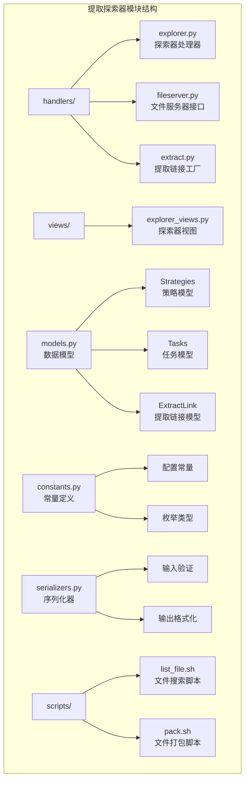
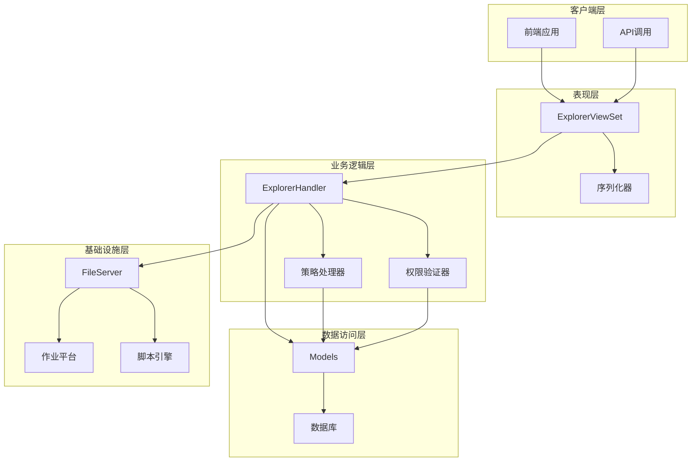
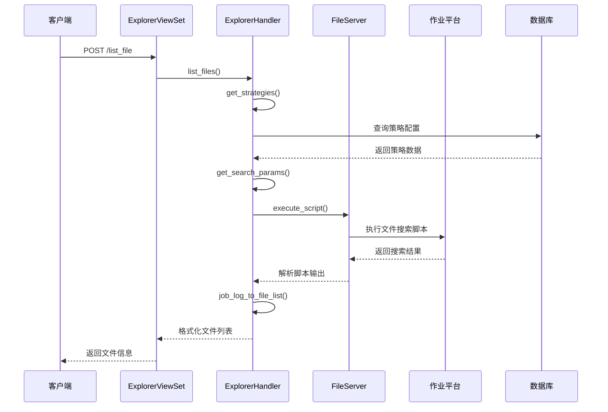
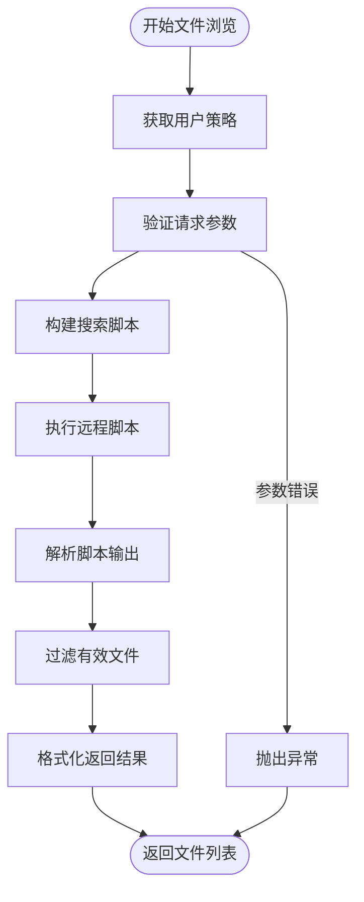
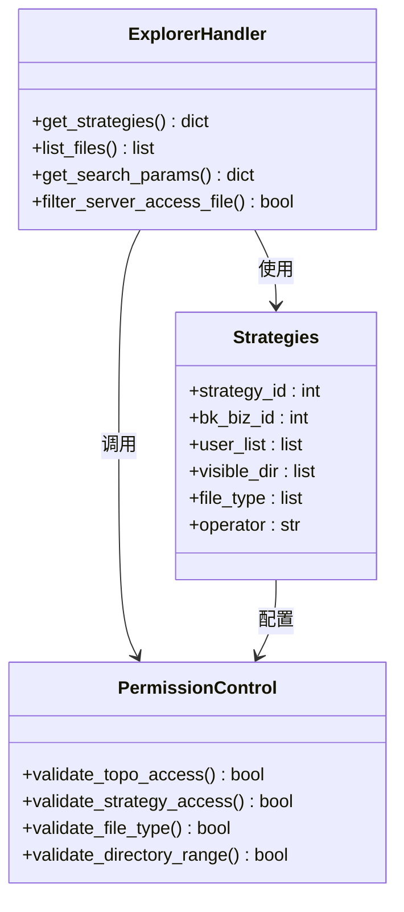
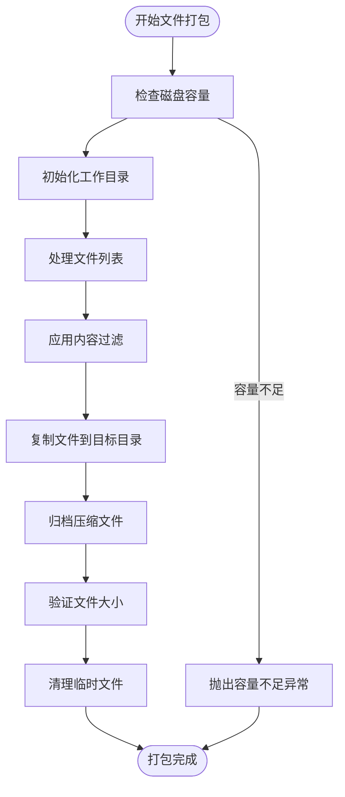
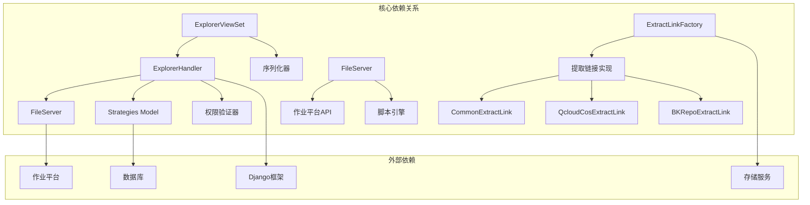

# 提取探索器管理

<cite>
**本文档引用的文件**
- [apps/log_extract/handlers/explorer.py](file://apps/log_extract/handlers/explorer.py)
- [apps/log_extract/views/explorer_views.py](file://apps/log_extract/views/explorer_views.py)
- [apps/log_extract/models.py](file://apps/log_extract/models.py)
- [apps/log_extract/constants.py](file://apps/log_extract/constants.py)
- [apps/log_extract/serializers.py](file://apps/log_extract/serializers.py)
- [apps/log_extract/fileserver.py](file://apps/log_extract/fileserver.py)
- [apps/log_extract/scripts/list_file.sh](file://apps/log_extract/scripts/list_file.sh)
- [apps/log_extract/scripts/pack.sh](file://apps/log_extract/scripts/pack.sh)
- [apps/log_extract/handlers/extract.py](file://apps/log_extract/handlers/extract.py)
</cite>

## 目录
1. [简介](#简介)
2. [项目结构](#项目结构)
3. [核心组件](#核心组件)
4. [架构概览](#架构概览)
5. [详细组件分析](#详细组件分析)
6. [依赖分析](#依赖分析)
7. [性能考虑](#性能考虑)
8. [故障排除指南](#故障排除指南)
9. [结论](#结论)
10. [附录](#附录)

## 简介

提取探索器管理模块是蓝鲸日志平台的重要组成部分，负责为用户提供安全、高效的日志文件浏览、预览和下载功能。该模块通过策略授权机制确保用户只能访问其权限范围内的文件，同时提供了强大的文件搜索和过滤能力。

该模块的核心功能包括：
- 基于策略的文件访问控制
- 多维度的文件搜索和浏览
- 实时文件预览功能
- 安全的文件打包和下载
- 支持多种操作系统和文件类型

## 项目结构

提取探索器管理模块采用清晰的分层架构设计，主要包含以下核心目录和文件：



**图表来源**
- [apps/log_extract/handlers/explorer.py:1-1035](file://apps/log_extract/handlers/explorer.py#L1-L1035)
- [apps/log_extract/views/explorer_views.py:1-274](file://apps/log_extract/views/explorer_views.py#L1-L274)

**章节来源**
- [apps/log_extract/handlers/explorer.py:1-50](file://apps/log_extract/handlers/explorer.py#L1-L50)
- [apps/log_extract/views/explorer_views.py:1-30](file://apps/log_extract/views/explorer_views.py#L1-L30)

## 核心组件

### 探索器处理器 (ExplorerHandler)

探索器处理器是整个模块的核心组件，负责协调各个子系统的协作。它实现了以下关键功能：

- **文件浏览管理**：提供文件列表查询、目录浏览、文件预览等功能
- **策略授权控制**：基于用户权限和业务策略进行访问控制
- **跨平台支持**：兼容Linux和Windows操作系统的文件系统
- **批量操作**：支持多主机、多文件的批量处理

### 文件服务器接口 (FileServer)

文件服务器接口封装了与作业平台的交互，提供了统一的脚本执行和文件传输接口：

- **脚本执行**：通过作业平台执行远程文件系统操作
- **任务监控**：跟踪脚本执行状态和结果
- **文件传输**：支持文件的分发和打包操作

### 视图控制器 (ExplorerViewSet)

视图控制器提供RESTful API接口，定义了探索器对外暴露的所有接口：

- **文件列表接口**：获取指定目录下的文件和目录列表
- **策略查询接口**：返回用户的访问策略和权限范围
- **拓扑查询接口**：提供业务拓扑结构的过滤和查询

**章节来源**
- [apps/log_extract/handlers/explorer.py:57-127](file://apps/log_extract/handlers/explorer.py#L57-L127)
- [apps/log_extract/fileserver.py:39-249](file://apps/log_extract/fileserver.py#L39-L249)
- [apps/log_extract/views/explorer_views.py:30-274](file://apps/log_extract/views/explorer_views.py#L30-L274)

## 架构概览

提取探索器管理模块采用了分层架构设计，确保了良好的可维护性和扩展性：



**图表来源**
- [apps/log_extract/views/explorer_views.py:30-274](file://apps/log_extract/views/explorer_views.py#L30-L274)
- [apps/log_extract/handlers/explorer.py:57-127](file://apps/log_extract/handlers/explorer.py#L57-L127)
- [apps/log_extract/fileserver.py:39-249](file://apps/log_extract/fileserver.py#L39-L249)

### 数据流分析



**图表来源**
- [apps/log_extract/views/explorer_views.py:103-114](file://apps/log_extract/views/explorer_views.py#L103-L114)
- [apps/log_extract/handlers/explorer.py:62-126](file://apps/log_extract/handlers/explorer.py#L62-L126)
- [apps/log_extract/fileserver.py:41-54](file://apps/log_extract/fileserver.py#L41-L54)

**章节来源**
- [apps/log_extract/handlers/explorer.py:128-141](file://apps/log_extract/handlers/explorer.py#L128-L141)
- [apps/log_extract/fileserver.py:111-131](file://apps/log_extract/fileserver.py#L111-L131)

## 详细组件分析

### 探索器处理器详解

#### 文件浏览功能

探索器处理器的核心职责是实现安全的文件浏览功能。该功能通过以下步骤实现：

1. **策略验证**：首先验证用户对目标主机和目录的访问权限
2. **参数解析**：解析用户请求的浏览参数，包括路径、时间范围等
3. **脚本执行**：通过作业平台在远端主机执行文件搜索脚本
4. **结果处理**：解析脚本输出，过滤无效文件，格式化返回数据



**图表来源**
- [apps/log_extract/handlers/explorer.py:62-126](file://apps/log_extract/handlers/explorer.py#L62-L126)
- [apps/log_extract/handlers/explorer.py:883-905](file://apps/log_extract/handlers/explorer.py#L883-L905)

#### 权限控制系统

权限控制系统是探索器安全性的核心保障，主要包含以下层次：

1. **业务拓扑权限**：基于业务拓扑结构的权限控制
2. **策略授权**：基于用户策略配置的细粒度权限控制
3. **文件类型限制**：限制用户可访问的文件类型
4. **目录范围控制**：确保用户只能访问授权的目录范围



**图表来源**
- [apps/log_extract/handlers/explorer.py:209-273](file://apps/log_extract/handlers/explorer.py#L209-L273)
- [apps/log_extract/models.py:45-60](file://apps/log_extract/models.py#L45-L60)

**章节来源**
- [apps/log_extract/handlers/explorer.py:477-526](file://apps/log_extract/handlers/explorer.py#L477-L526)
- [apps/log_extract/models.py:45-60](file://apps/log_extract/models.py#L45-L60)

### 文件打包和压缩算法

#### 打包策略

文件打包模块实现了高效的文件聚合和压缩功能，支持多种过滤和处理选项：

1. **文件过滤**：支持按关键字、行号范围、文件大小等多种方式过滤
2. **内容处理**：提供文本内容的筛选和转换功能
3. **压缩算法**：使用gzip算法进行高效压缩
4. **存储优化**：优化文件命名和存储结构



**图表来源**
- [apps/log_extract/scripts/pack.sh:149-188](file://apps/log_extract/scripts/pack.sh#L149-L188)
- [apps/log_extract/scripts/pack.sh:238-297](file://apps/log_extract/scripts/pack.sh#L238-L297)

#### 压缩选项和存储格式

打包模块支持灵活的压缩选项和存储格式配置：

- **压缩级别**：支持不同的压缩级别以平衡压缩比和速度
- **文件格式**：生成标准的tar.gz格式文件
- **存储路径**：支持自定义存储路径和命名规则
- **大小限制**：实施文件大小上限以防止资源滥用

**章节来源**
- [apps/log_extract/scripts/pack.sh:1-308](file://apps/log_extract/scripts/pack.sh#L1-L308)
- [apps/log_extract/constants.py:207-221](file://apps/log_extract/constants.py#L207-L221)

### 预览功能实现

#### 文件类型识别

预览功能通过智能的文件类型识别机制支持多种文件格式：

1. **扩展名匹配**：基于文件扩展名识别文件类型
2. **内容检测**：通过文件内容特征进行二次确认
3. **编码识别**：自动检测文件编码格式
4. **格式转换**：将二进制文件转换为可读格式

#### 内容渲染和性能优化

预览功能实现了高效的渲染和缓存机制：

- **增量加载**：支持大文件的分块加载和显示
- **内存管理**：合理控制内存使用，避免内存泄漏
- **缓存策略**：对常用文件建立缓存提高响应速度
- **并发控制**：限制同时预览的文件数量

**章节来源**
- [apps/log_extract/handlers/explorer.py:908-934](file://apps/log_extract/handlers/explorer.py#L908-L934)
- [apps/log_extract/serializers.py:45-59](file://apps/log_extract/serializers.py#L45-L59)

### 配置选项详解

#### 显示设置

探索器提供了丰富的显示配置选项：

- **文件列表排序**：支持按名称、修改时间、大小等排序
- **显示格式**：可配置文件信息的显示格式
- **分页设置**：控制文件列表的分页大小
- **预览窗口**：配置预览窗口的显示参数

#### 默认行为

系统定义了合理的默认行为：

- **默认时间范围**：设置合理的默认预览时间范围
- **默认文件类型**：配置常见的日志文件类型
- **默认排序方式**：按修改时间倒序排列
- **默认页面大小**：每页显示50个文件

#### 权限控制

权限控制是探索器安全性的核心：

- **用户认证**：基于用户身份的访问控制
- **业务授权**：基于业务范围的权限管理
- **策略继承**：支持权限的层级继承关系
- **审计日志**：记录所有访问和操作行为

**章节来源**
- [apps/log_extract/serializers.py:82-112](file://apps/log_extract/serializers.py#L82-L112)
- [apps/log_extract/constants.py:133-146](file://apps/log_extract/constants.py#L133-L146)

## 依赖分析

### 组件耦合关系



**图表来源**
- [apps/log_extract/handlers/explorer.py:30-54](file://apps/log_extract/handlers/explorer.py#L30-L54)
- [apps/log_extract/handlers/extract.py:182-194](file://apps/log_extract/handlers/extract.py#L182-L194)

### 错误处理和恢复机制

系统实现了完善的错误处理和恢复机制：

- **超时处理**：文件搜索超时的优雅降级
- **重试机制**：网络异常时的自动重试
- **回滚操作**：失败操作的自动回滚
- **状态监控**：实时监控系统状态和性能指标

**章节来源**
- [apps/log_extract/handlers/explorer.py:128-141](file://apps/log_extract/handlers/explorer.py#L128-L141)
- [apps/log_extract/fileserver.py:111-131](file://apps/log_extract/fileserver.py#L111-L131)

## 性能考虑

### 并发处理优化

探索器模块采用了多种并发处理技术来提升性能：

- **批量请求**：支持批量获取主机信息和文件列表
- **异步处理**：文件搜索和打包操作的异步执行
- **连接池**：数据库和外部API的连接复用
- **缓存机制**：常用数据的本地缓存

### 资源管理

系统实现了精细的资源管理策略：

- **内存控制**：限制单次操作的内存使用
- **文件句柄**：合理管理文件句柄数量
- **网络带宽**：控制网络传输的带宽占用
- **CPU使用**：优化计算密集型操作

## 故障排除指南

### 常见问题诊断

#### 权限相关问题

当用户无法访问某些文件或目录时，可能的原因包括：

1. **策略配置错误**：检查策略配置是否正确
2. **用户权限不足**：验证用户是否具有足够的权限
3. **目录范围限制**：确认访问的目录是否在授权范围内
4. **文件类型限制**：检查目标文件类型是否被允许

#### 性能问题

如果系统响应缓慢，可以检查：

1. **网络延迟**：监控与作业平台的网络连接质量
2. **磁盘空间**：检查打包目录的磁盘空间
3. **CPU使用率**：监控系统CPU使用情况
4. **内存占用**：检查内存使用是否正常

**章节来源**
- [apps/log_extract/handlers/explorer.py:102-113](file://apps/log_extract/handlers/explorer.py#L102-L113)
- [apps/log_extract/fileserver.py:133-141](file://apps/log_extract/fileserver.py#L133-L141)

### 调试工具和日志

系统提供了完善的调试和日志功能：

- **详细日志**：记录所有关键操作的详细信息
- **性能监控**：监控各项操作的执行时间和资源消耗
- **错误追踪**：提供完整的错误堆栈信息
- **审计日志**：记录所有用户操作和系统事件

## 结论

提取探索器管理模块通过精心设计的架构和实现，为蓝鲸日志平台提供了强大而安全的日志文件浏览和管理功能。该模块的主要优势包括：

1. **安全性**：通过多层次的权限控制确保数据安全
2. **可扩展性**：模块化设计支持功能的灵活扩展
3. **性能**：优化的算法和并发处理提升用户体验
4. **可靠性**：完善的错误处理和恢复机制保证系统稳定

未来可以进一步优化的方向包括：

- **智能化推荐**：基于用户行为的文件推荐功能
- **增强搜索**：支持更复杂的搜索条件和过滤规则
- **可视化界面**：提供更直观的文件浏览界面
- **移动端支持**：开发移动端应用提升移动办公体验

## 附录

### API使用示例

#### 文件列表查询

```bash
# 获取指定目录下的文件列表
curl -X POST /log_extract/explorer/list_file \
  -H "Content-Type: application/json" \
  -d '{
    "bk_biz_id": 251,
    "ip_list": [{"ip": "xx.x.x.x", "bk_cloud_id": 1}],
    "path": "/data/logs/",
    "is_search_child": true,
    "time_range": "1d"
  }'
```

#### 策略查询

```bash
# 查询用户的访问策略
curl -X POST /log_extract/explorer/strategies \
  -H "Content-Type: application/json" \
  -d '{
    "bk_biz_id": 251,
    "target_node_type": "INSTANCE",
    "ip_list": [{"ip": "xx.x.x.x", "bk_cloud_id": 1}]
  }'
```

### 最佳实践建议

1. **权限最小化**：为用户分配最小必要的权限
2. **定期审查**：定期审查和更新策略配置
3. **监控告警**：建立完善的监控和告警机制
4. **备份策略**：制定数据备份和恢复策略
5. **性能优化**：定期进行性能评估和优化