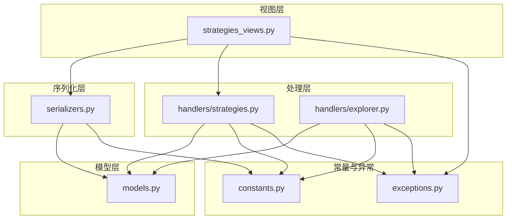
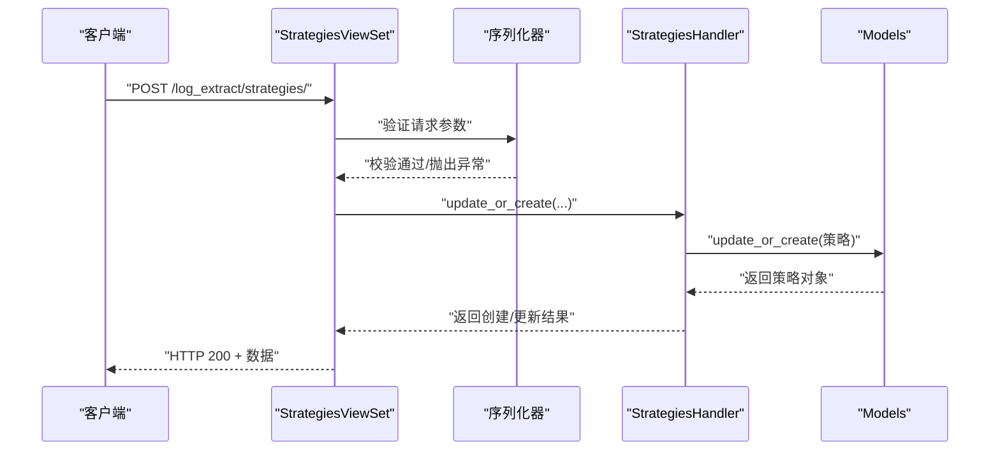
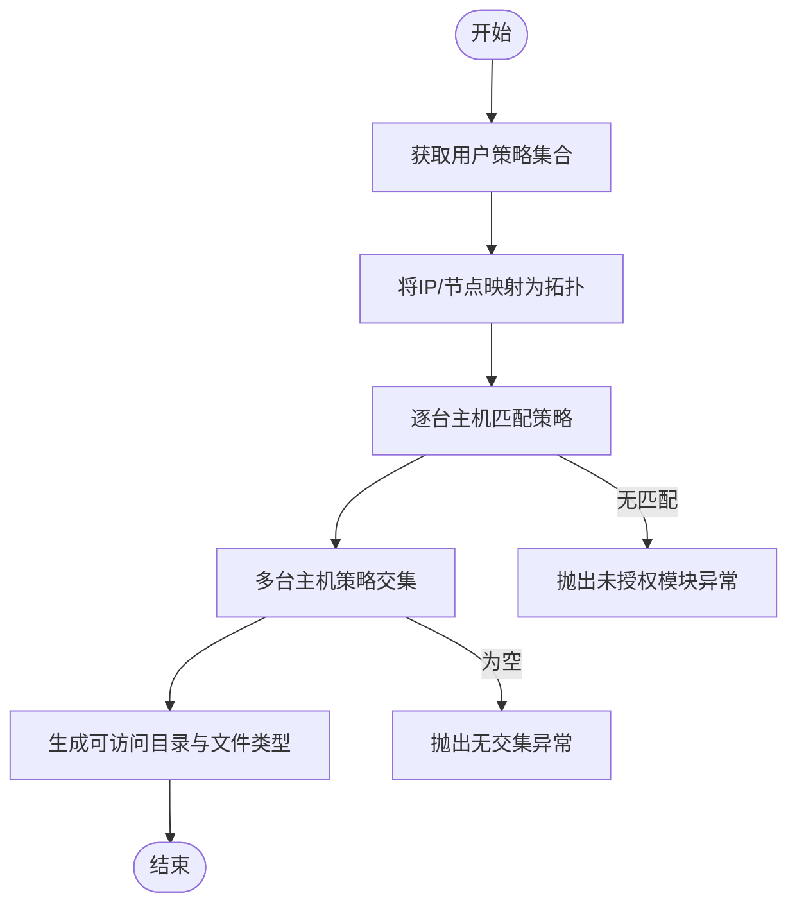
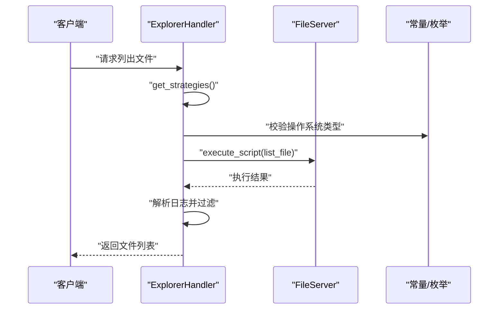
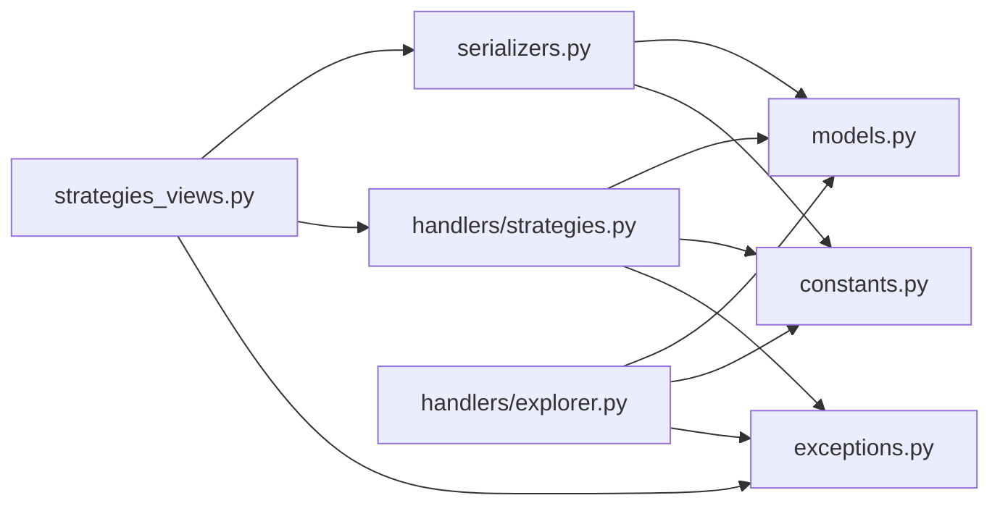

# 提取策略管理

<cite>
**本文引用的文件**
- [apps/log_extract/constants.py](file://apps/log_extract/constants.py)
- [apps/log_extract/models.py](file://apps/log_extract/models.py)
- [apps/log_extract/serializers.py](file://apps/log_extract/serializers.py)
- [apps/log_extract/handlers/strategies.py](file://apps/log_extract/handlers/strategies.py)
- [apps/log_extract/handlers/explorer.py](file://apps/log_extract/handlers/explorer.py)
- [apps/log_extract/views/strategies_views.py](file://apps/log_extract/views/strategies_views.py)
- [apps/log_extract/exceptions.py](file://apps/log_extract/exceptions.py)
</cite>

## 目录
1. [简介](#简介)
2. [项目结构](#项目结构)
3. [核心组件](#核心组件)
4. [架构概览](#架构概览)
5. [详细组件分析](#详细组件分析)
6. [依赖分析](#依赖分析)
7. [性能考虑](#性能考虑)
8. [故障排除指南](#故障排除指南)
9. [结论](#结论)
10. [附录](#附录)

## 简介
本技术文档围绕提取策略管理模块进行全面解析，涵盖策略类型定义、参数设置、生效规则、匹配算法、优先级与冲突处理、动态更新与版本管理、策略执行流程、最佳实践与性能优化建议，以及实际配置示例与常见错误解决方案。该模块负责控制用户在日志提取场景下的访问范围与能力边界，确保安全合规地进行日志文件的浏览、筛选与下载。

## 项目结构
提取策略管理模块位于 apps/log_extract 目录下，主要由以下层次构成：
- 视图层：提供策略的增删改查与拓扑查询接口
- 序列化层：负责输入参数校验与输出格式化
- 处理层：封装策略的创建、更新、删除与匹配逻辑
- 模型层：持久化存储策略、任务与链路配置
- 常量与异常：统一策略类型、枚举常量与错误码定义

图表来源
- [apps/log_extract/views/strategies_views.py:33-305](file://apps/log_extract/views/strategies_views.py#L33-L305)
- [apps/log_extract/serializers.py:1-578](file://apps/log_extract/serializers.py#L1-L578)
- [apps/log_extract/handlers/strategies.py:32-107](file://apps/log_extract/handlers/strategies.py#L32-L107)
- [apps/log_extract/handlers/explorer.py:57-1035](file://apps/log_extract/handlers/explorer.py#L57-L1035)
- [apps/log_extract/models.py:45-244](file://apps/log_extract/models.py#L45-L244)
- [apps/log_extract/constants.py:25-247](file://apps/log_extract/constants.py#L25-L247)
- [apps/log_extract/exceptions.py:27-288](file://apps/log_extract/exceptions.py#L27-L288)

章节来源
- [apps/log_extract/views/strategies_views.py:33-305](file://apps/log_extract/views/strategies_views.py#L33-L305)
- [apps/log_extract/serializers.py:1-578](file://apps/log_extract/serializers.py#L1-L578)
- [apps/log_extract/handlers/strategies.py:32-107](file://apps/log_extract/handlers/strategies.py#L32-L107)
- [apps/log_extract/handlers/explorer.py:57-1035](file://apps/log_extract/handlers/explorer.py#L57-L1035)
- [apps/log_extract/models.py:45-244](file://apps/log_extract/models.py#L45-L244)
- [apps/log_extract/constants.py:25-247](file://apps/log_extract/constants.py#L25-L247)
- [apps/log_extract/exceptions.py:27-288](file://apps/log_extract/exceptions.py#L27-L288)

## 核心组件
- 策略模型（Strategies）：存储策略ID、业务ID、策略名称、授权用户列表、目标选择类型、模块列表、可见目录、文件类型、执行人等字段
- 策略处理器（StrategiesHandler）：提供策略的创建/更新/删除能力，并进行名称唯一性与执行人合法性校验
- 探索器处理器（ExplorerHandler）：实现策略匹配与权限判定，计算用户可访问目录与文件类型交集，生成搜索参数
- 序列化器（Serializers）：对策略创建/更新、拓扑查询、任务创建等请求参数进行严格校验
- 常量与枚举（Constants）：定义策略类型、文件过滤类型、目标节点类型、链路类型等
- 异常体系（Exceptions）：统一策略相关的异常类型与错误码

章节来源
- [apps/log_extract/models.py:45-60](file://apps/log_extract/models.py#L45-L60)
- [apps/log_extract/handlers/strategies.py:32-107](file://apps/log_extract/handlers/strategies.py#L32-L107)
- [apps/log_extract/handlers/explorer.py:209-820](file://apps/log_extract/handlers/explorer.py#L209-L820)
- [apps/log_extract/serializers.py:379-451](file://apps/log_extract/serializers.py#L379-L451)
- [apps/log_extract/constants.py:109-178](file://apps/log_extract/constants.py#L109-L178)
- [apps/log_extract/exceptions.py:207-235](file://apps/log_extract/exceptions.py#L207-L235)

## 架构概览
策略管理采用“视图-序列化-处理-模型”的分层架构，结合权限与拓扑查询，完成策略的配置、匹配与执行。

图表来源
- [apps/log_extract/views/strategies_views.py:104-164](file://apps/log_extract/views/strategies_views.py#L104-L164)
- [apps/log_extract/serializers.py:405-451](file://apps/log_extract/serializers.py#L405-L451)
- [apps/log_extract/handlers/strategies.py:46-90](file://apps/log_extract/handlers/strategies.py#L46-L90)
- [apps/log_extract/models.py:45-60](file://apps/log_extract/models.py#L45-L60)

## 详细组件分析

### 策略类型与参数定义
- 策略类型（SelectType）：支持按模块（module）或按拓扑（topo）两种授权方式
- 目标节点类型（LogExtractTargetNodeTypeEnum）：支持实例、拓扑、服务模板三种
- 文件过滤类型（FilterType）：支持关键字过滤、行数范围、最新N行、关键字范围过滤
- 链路类型（ExtractLinkType）：支持内网链路、腾讯云COS链路、BK仓库链路
- 关键字匹配类型（KeywordType）：支持与、或、非

章节来源
- [apps/log_extract/constants.py:109-178](file://apps/log_extract/constants.py#L109-L178)
- [apps/log_extract/constants.py:59-74](file://apps/log_extract/constants.py#L59-L74)
- [apps/log_extract/constants.py:119-131](file://apps/log_extract/constants.py#L119-L131)
- [apps/log_extract/constants.py:93-107](file://apps/log_extract/constants.py#L93-L107)

### 策略模型与字段
- 策略表（Strategies）：包含策略ID、业务ID、策略名称、授权用户列表、目标选择类型、模块列表、可见目录、文件类型、执行人等
- 任务表（Tasks）：包含任务ID、业务ID、目标节点类型、IP列表、节点列表、文件路径、过滤类型与内容、下载状态、过期时间、流水线ID、作业任务ID、链路ID等
- 链路表（ExtractLink）：包含链路ID、链路类型、执行人、业务ID、云账号信息、启用状态等

章节来源
- [apps/log_extract/models.py:45-60](file://apps/log_extract/models.py#L45-L60)
- [apps/log_extract/models.py:73-140](file://apps/log_extract/models.py#L73-L140)
- [apps/log_extract/models.py:209-244](file://apps/log_extract/models.py#L209-L244)

### 策略匹配算法与优先级
策略匹配分为三层：
1) 权限获取与合并
- 根据请求用户与外部用户权限，查询其在业务下可访问的策略集合
- 将策略按“按模块”和“按拓扑”两类分别收集，转换为模块/拓扑集合

2) 目标拓扑映射
- 将用户选择的IP或节点映射为拓扑列表，确保每台主机都有对应拓扑
- 校验所有主机的操作系统类型一致

3) 策略匹配与交集计算
- 对每个拓扑，匹配策略中的模块/拓扑授权项，生成可访问策略集合
- 对多台主机的策略集合求交集，得到用户可访问的目录与文件类型集合
- 若交集为空，抛出“未授权模块”或“无交集”异常

图表来源
- [apps/log_extract/handlers/explorer.py:209-274](file://apps/log_extract/handlers/explorer.py#L209-L274)
- [apps/log_extract/handlers/explorer.py:764-820](file://apps/log_extract/handlers/explorer.py#L764-L820)
- [apps/log_extract/handlers/explorer.py:852-882](file://apps/log_extract/handlers/explorer.py#L852-L882)
- [apps/log_extract/exceptions.py:147-170](file://apps/log_extract/exceptions.py#L147-L170)

章节来源
- [apps/log_extract/handlers/explorer.py:209-274](file://apps/log_extract/handlers/explorer.py#L209-L274)
- [apps/log_extract/handlers/explorer.py:764-820](file://apps/log_extract/handlers/explorer.py#L764-L820)
- [apps/log_extract/handlers/explorer.py:852-882](file://apps/log_extract/handlers/explorer.py#L852-L882)
- [apps/log_extract/exceptions.py:147-170](file://apps/log_extract/exceptions.py#L147-L170)

### 冲突解决与优先级处理
- 目录优先级：当请求目录与多个策略目录存在包含关系时，按包含深度优先匹配，取最深的策略作为候选
- 文件类型冲突：对同一目录，策略的文件类型集合取并集；跨主机时取交集
- 执行人与权限：若策略未配置执行人或执行人无权限，将导致后续任务执行失败，需在策略配置阶段避免

章节来源
- [apps/log_extract/handlers/explorer.py:852-882](file://apps/log_extract/handlers/explorer.py#L852-L882)
- [apps/log_extract/handlers/explorer.py:936-963](file://apps/log_extract/handlers/explorer.py#L936-L963)

### 动态更新与版本管理机制
- 策略更新：通过 StrategiesHandler.update_or_create 完成，支持策略名称在同一业务下唯一性校验、执行人合法性校验
- 删除策略：通过 StrategiesHandler.delete_strategies 完成软删除，并记录用户操作审计
- 版本管理：策略模型继承 OperateRecordModel，具备创建/更新时间与操作人字段，便于审计追踪

章节来源
- [apps/log_extract/handlers/strategies.py:46-107](file://apps/log_extract/handlers/strategies.py#L46-L107)
- [apps/log_extract/models.py:34-42](file://apps/log_extract/models.py#L34-L42)

### 策略执行流程
策略执行贯穿于“文件预览/搜索”与“任务创建/下载”两个阶段：
- 文件预览阶段
  - ExplorerHandler.list_files：获取策略 → 生成搜索参数 → 调用FileServer执行脚本 → 解析结果
  - 关键异常：执行人无权限、文件预览超时、拓扑不匹配等

- 任务创建阶段
  - 视图层接收请求 → 序列化器校验 → 生成任务记录 → 调用链路工厂执行下载

图表来源
- [apps/log_extract/handlers/explorer.py:62-127](file://apps/log_extract/handlers/explorer.py#L62-L127)
- [apps/log_extract/handlers/explorer.py:128-159](file://apps/log_extract/handlers/explorer.py#L128-L159)
- [apps/log_extract/constants.py:180-247](file://apps/log_extract/constants.py#L180-L247)

章节来源
- [apps/log_extract/handlers/explorer.py:62-127](file://apps/log_extract/handlers/explorer.py#L62-L127)
- [apps/log_extract/handlers/explorer.py:128-159](file://apps/log_extract/handlers/explorer.py#L128-L159)
- [apps/log_extract/constants.py:180-247](file://apps/log_extract/constants.py#L180-L247)

### API与配置示例
- 策略列表接口：GET /log_extract/strategies/?bk_biz_id=${bk_biz_id}
- 创建策略接口：POST /log_extract/strategies/
- 更新策略接口：PUT /log_extract/strategies/${strategy_id}/
- 删除策略接口：DELETE /log_extract/strategies/${strategy_id}/
- 获取拓扑接口：GET /log_extract/strategies/topo/?bk_biz_id=${bk_biz_id}

章节来源
- [apps/log_extract/views/strategies_views.py:48-102](file://apps/log_extract/views/strategies_views.py#L48-L102)
- [apps/log_extract/views/strategies_views.py:104-164](file://apps/log_extract/views/strategies_views.py#L104-L164)
- [apps/log_extract/views/strategies_views.py:166-231](file://apps/log_extract/views/strategies_views.py#L166-L231)
- [apps/log_extract/views/strategies_views.py:232-305](file://apps/log_extract/views/strategies_views.py#L232-L305)

## 依赖分析
- 视图层依赖序列化器与处理器，处理器依赖模型与常量，异常用于统一错误处理
- 探索器处理器依赖拓扑查询、权限校验与FileServer执行脚本
- 序列化器依赖常量与模型，确保参数合法性与业务约束

图表来源
- [apps/log_extract/views/strategies_views.py:33-305](file://apps/log_extract/views/strategies_views.py#L33-L305)
- [apps/log_extract/serializers.py:1-578](file://apps/log_extract/serializers.py#L1-L578)
- [apps/log_extract/handlers/strategies.py:32-107](file://apps/log_extract/handlers/strategies.py#L32-L107)
- [apps/log_extract/handlers/explorer.py:57-1035](file://apps/log_extract/handlers/explorer.py#L57-L1035)
- [apps/log_extract/models.py:45-244](file://apps/log_extract/models.py#L45-L244)
- [apps/log_extract/constants.py:25-247](file://apps/log_extract/constants.py#L25-L247)
- [apps/log_extract/exceptions.py:27-288](file://apps/log_extract/exceptions.py#L27-L288)

章节来源
- [apps/log_extract/views/strategies_views.py:33-305](file://apps/log_extract/views/strategies_views.py#L33-L305)
- [apps/log_extract/serializers.py:1-578](file://apps/log_extract/serializers.py#L1-L578)
- [apps/log_extract/handlers/strategies.py:32-107](file://apps/log_extract/handlers/strategies.py#L32-L107)
- [apps/log_extract/handlers/explorer.py:57-1035](file://apps/log_extract/handlers/explorer.py#L57-L1035)
- [apps/log_extract/models.py:45-244](file://apps/log_extract/models.py#L45-L244)
- [apps/log_extract/constants.py:25-247](file://apps/log_extract/constants.py#L25-L247)
- [apps/log_extract/exceptions.py:27-288](file://apps/log_extract/exceptions.py#L27-L288)

## 性能考虑
- 批量拓扑查询：使用批量请求与线程池并发获取主机拓扑，减少等待时间
- 任务轮询间隔：策略轮询间隔与最大轮询次数合理配置，避免长时间占用资源
- 文件搜索超时：预览文件搜索设置超时阈值，防止长时间阻塞
- 目录与文件类型匹配：采用集合运算与正则匹配，尽量减少重复计算

章节来源
- [apps/log_extract/handlers/explorer.py:971-1025](file://apps/log_extract/handlers/explorer.py#L971-L1025)
- [apps/log_extract/constants.py:180-187](file://apps/log_extract/constants.py#L180-L187)
- [apps/log_extract/constants.py:220-221](file://apps/log_extract/constants.py#L220-L221)

## 故障排除指南
- 策略不存在：检查策略ID是否正确，确认策略是否被删除或软删除
- 策略名称重复：同一业务下策略名称需唯一，更新时需排除自身ID
- 执行人不合法：执行人必须为原执行人或当前用户
- 未授权模块：检查策略授权的模块/拓扑与用户选择的主机是否匹配
- 无交集：多台主机授权目录或文件类型无交集，需调整策略或主机选择
- 文件预览超时：检查FileServer执行状态与网络连通性
- 链路不存在：确认链路ID有效且处于启用状态

章节来源
- [apps/log_extract/exceptions.py:207-235](file://apps/log_extract/exceptions.py#L207-L235)
- [apps/log_extract/exceptions.py:147-170](file://apps/log_extract/exceptions.py#L147-L170)
- [apps/log_extract/exceptions.py:192-195](file://apps/log_extract/exceptions.py#L192-L195)
- [apps/log_extract/exceptions.py:260-273](file://apps/log_extract/exceptions.py#L260-L273)

## 结论
提取策略管理模块通过清晰的分层设计与严格的参数校验，实现了对日志提取访问范围的精细化控制。策略匹配算法基于拓扑与模块授权，结合目录与文件类型的交并运算，确保用户只能访问被授权的资源。配合完善的异常体系与性能优化措施，能够稳定支撑大规模场景下的日志提取需求。

## 附录
- 最佳实践
  - 策略命名：在同一业务下保持策略名称唯一，便于识别与审计
  - 授权粒度：优先使用“按模块”授权，减少拓扑授权的复杂度
  - 目录设计：目录以“/”结尾，文件类型不带“.”前缀，避免路径与正则冲突
  - 执行人：为策略配置具备相应权限的执行人，避免任务执行失败
- 常见错误与解决方案
  - “策略不存在”：核对策略ID与业务ID，确认策略状态
  - “策略名称重复”：修改策略名称或删除重复策略
  - “未授权模块”：检查策略授权与主机拓扑映射
  - “无交集”：调整策略授权或主机选择，确保目录与文件类型有交集
  - “文件预览超时”：检查FileServer状态与网络连通性，适当延长超时时间