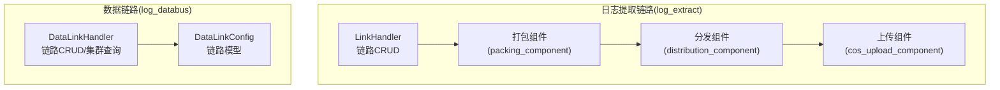
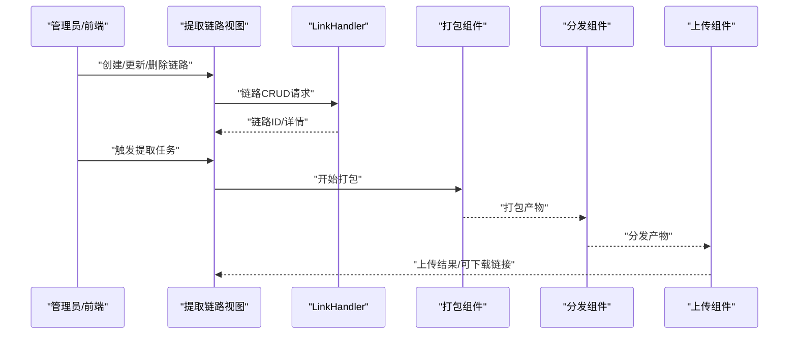
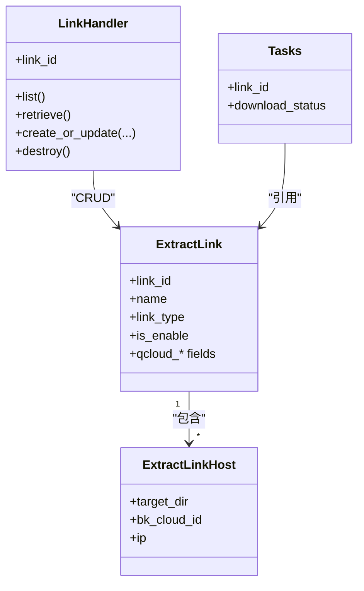
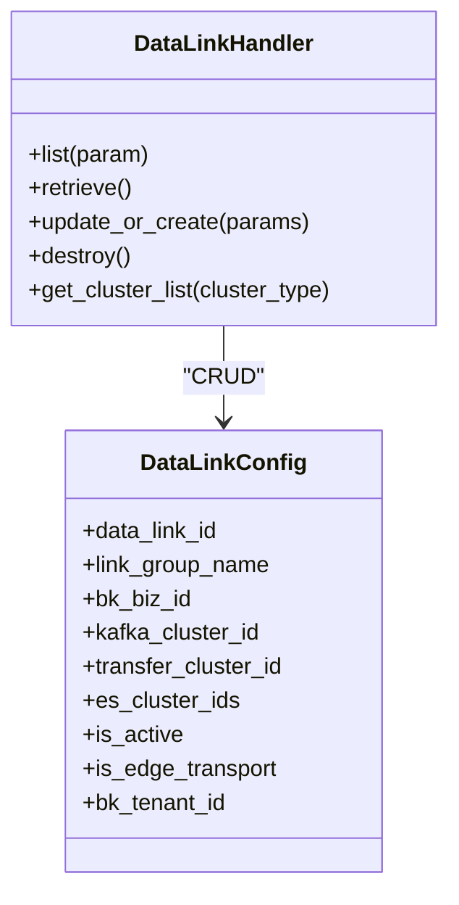
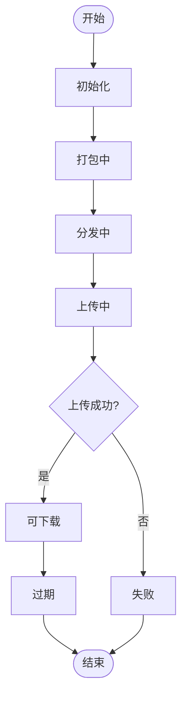
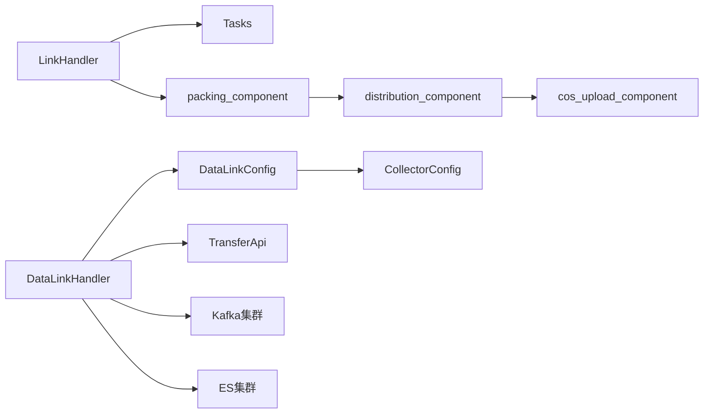

# 提取链路管理

<cite>
**本文引用的文件**
- [apps/log_extract/handlers/link.py](file://apps/log_extract/handlers/link.py)
- [apps/log_extract/constants.py](file://apps/log_extract/constants.py)
- [apps/log_databus/handlers/link.py](file://apps/log_databus/handlers/link.py)
- [apps/log_databus/models.py](file://apps/log_databus/models.py)
- [apps/log_databus/migrations/0035_datalinkconfig_deploy_options.py](file://apps/log_databus/migrations/0035_datalinkconfig_deploy_options.py)
- [apps/log_databus/migrations/0044_datalinkconfig_bk_tenant_id.py](file://apps/log_databus/migrations/0044_datalinkconfig_bk_tenant_id.py)
- [apps/log_databus/migrations/0045_collectorconfig_is_nanos.py](file://apps/log_databus/migrations/0045_collectorconfig_is_nanos.py)
- [apps/log_databus/migrations/0046_collectorconfig_enable_v4.py](file://apps/log_databus/migrations/0046_collectorconfig_enable_v4.py)
- [apps/log_extract/components/collections/packing_component.py](file://apps/log_extract/components/collections/packing_component.py)
- [apps/log_extract/components/collections/distribution_component.py](file://apps/log_extract/components/collections/distribution_component.py)
- [apps/log_extract/components/collections/cos_upload_component.py](file://apps/log_extract/components/collections/cos_upload_component.py)
- [apps/log_extract/views/tasks.py](file://apps/log_extract/views/tasks.py)
- [apps/log_extract/views/link_views.py](file://apps/log_extract/views/link_views.py)
- [apps/log_databus/views/link_views.py](file://apps/log_databus/views/link_views.py)
- [apps/log_extract/urls.py](file://apps/log_extract/urls.py)
- [apps/log_databus/urls.py](file://apps/log_databus/urls.py)
</cite>

## 目录
1. [简介](#简介)
2. [项目结构](#项目结构)
3. [核心组件](#核心组件)
4. [架构总览](#架构总览)
5. [详细组件分析](#详细组件分析)
6. [依赖分析](#依赖分析)
7. [性能考虑](#性能考虑)
8. [故障排查指南](#故障排查指南)
9. [结论](#结论)
10. [附录](#附录)

## 简介
本技术文档围绕“提取链路管理”模块展开，聚焦于日志提取链路的架构设计、节点配置、数据传输协议与链路拓扑；详述链路节点的管理（发现、健康检查、故障转移）；解释数据传输机制（批量/增量/断点续传）；阐述监控与告警（性能指标、异常检测、自动恢复）；并给出链路配置优化策略（带宽管理、负载均衡、安全防护）及实际配置示例与故障排查指南。

## 项目结构
提取链路管理涉及两个主要模块：
- 日志提取链路（log_extract）：负责提取任务的链路配置、节点管理、打包、分发与上传等流程。
- 数据链路（log_databus）：负责采集链路的集群配置、链路拓扑与下发参数等。

二者在功能边界上互补：log_extract关注“从目标节点拉取并交付”的链路；log_databus关注“采集侧链路”（Kafka/Transfer/ES）。

图表来源
- [apps/log_extract/handlers/link.py:30-197](file://apps/log_extract/handlers/link.py#L30-L197)
- [apps/log_extract/components/collections/packing_component.py](file://apps/log_extract/components/collections/packing_component.py)
- [apps/log_extract/components/collections/distribution_component.py](file://apps/log_extract/components/collections/distribution_component.py)
- [apps/log_extract/components/collections/cos_upload_component.py](file://apps/log_extract/components/collections/cos_upload_component.py)
- [apps/log_databus/handlers/link.py:38-209](file://apps/log_databus/handlers/link.py#L38-L209)
- [apps/log_databus/models.py:455-482](file://apps/log_databus/models.py#L455-L482)

章节来源
- [apps/log_extract/handlers/link.py:30-197](file://apps/log_extract/handlers/link.py#L30-L197)
- [apps/log_databus/handlers/link.py:38-209](file://apps/log_databus/handlers/link.py#L38-L209)
- [apps/log_databus/models.py:455-482](file://apps/log_databus/models.py#L455-L482)

## 核心组件
- 提取链路管理器（LinkHandler）
  - 负责提取链路的创建、更新、删除与详情查询；维护链路与节点映射关系；记录操作审计。
- 数据链路管理器（DataLinkHandler）
  - 负责数据链路的创建/修改/删除；查询链路列表与详情；获取Transfer/Kafka/ES集群列表。
- 数据链路模型（DataLinkConfig）
  - 定义链路的唯一标识、所属业务/租户、Kafka/Transfer/ES集群集合、是否激活、是否边缘链路、部署选项等。
- 提取常量与状态
  - 定义提取任务状态、过滤类型、链路类型、打包/分发路径、轮询间隔、超时等配置。

章节来源
- [apps/log_extract/handlers/link.py:30-197](file://apps/log_extract/handlers/link.py#L30-L197)
- [apps/log_databus/handlers/link.py:38-209](file://apps/log_databus/handlers/link.py#L38-L209)
- [apps/log_databus/models.py:455-482](file://apps/log_databus/models.py#L455-L482)
- [apps/log_extract/constants.py:28-247](file://apps/log_extract/constants.py#L28-L247)

## 架构总览
提取链路管理采用“链路配置 + 流程组件”的分层设计：
- 配置层：链路CRUD、节点绑定、链路类型（内网/COS/BK Repo）。
- 流程层：打包（本地/临时目录）、分发（中转服务器/分发目录）、上传（COS/BK Repo）。
- 监控层：任务状态机（初始化/打包/分发/上传/可下载/过期/失败），轮询与超时控制。
- 下游对接：与Transfer/Kafka/ES集群交互，支持边缘链路与多租户隔离。

图表来源
- [apps/log_extract/handlers/link.py:72-166](file://apps/log_extract/handlers/link.py#L72-L166)
- [apps/log_extract/components/collections/packing_component.py](file://apps/log_extract/components/collections/packing_component.py)
- [apps/log_extract/components/collections/distribution_component.py](file://apps/log_extract/components/collections/distribution_component.py)
- [apps/log_extract/components/collections/cos_upload_component.py](file://apps/log_extract/components/collections/cos_upload_component.py)

## 详细组件分析

### 提取链路管理（LinkHandler）
- 功能职责
  - 列出启用的提取链路，返回链路ID与显示名。
  - 查询链路详情，包含链路基本信息与节点列表。
  - 创建/更新链路：校验重名、更新时禁止修改进行中的任务、批量写入节点。
  - 删除链路：禁止删除进行中的任务。
  - 记录用户操作审计（创建/更新/删除）。
- 关键约束
  - 链路名称在同一租户内唯一。
  - 更新/删除前需确保无进行中的任务。
  - 密钥字段在编辑时可选择性更新。
- 与任务系统的耦合
  - 通过任务状态判断是否允许修改/删除。

图表来源
- [apps/log_extract/handlers/link.py:30-197](file://apps/log_extract/handlers/link.py#L30-L197)

章节来源
- [apps/log_extract/handlers/link.py:41-197](file://apps/log_extract/handlers/link.py#L41-L197)

### 数据链路管理（DataLinkHandler）
- 功能职责
  - 列出链路：按是否边缘链路与更新时间排序，业务独立链路优先于公共链路。
  - 查询链路详情：返回链路组名、业务ID、Kafka/Transfer/ES集群ID、是否激活、描述。
  - 创建/更新链路：校验同名冲突、禁止缩小ES集群集合、支持租户维度隔离。
  - 删除链路。
  - 获取集群列表：Transfer/Kafka/ES集群，过滤公共集群。
- 关键约束
  - 同租户内链路组名唯一。
  - 更新时若变更Kafka/Transfer集群，需满足集合包含关系。
  - 仅返回注册系统为默认的公共集群。
- 多租户与边缘链路
  - 通过租户ID隔离链路；支持边缘存查链路标记。

图表来源
- [apps/log_databus/handlers/link.py:38-209](file://apps/log_databus/handlers/link.py#L38-L209)
- [apps/log_databus/models.py:455-482](file://apps/log_databus/models.py#L455-L482)

章节来源
- [apps/log_databus/handlers/link.py:48-209](file://apps/log_databus/handlers/link.py#L48-L209)
- [apps/log_databus/models.py:455-482](file://apps/log_databus/models.py#L455-L482)

### 数据传输机制（打包/分发/上传）
- 打包（packing_component）
  - 使用临时目录存放打包产物，Linux与Windows路径不同。
  - 支持批量获取作业实例IP日志的IP列表上限，避免单次请求过大。
- 分发（distribution_component）
  - 中转服务器分发路径与分发打包路径分离，便于资源隔离。
- 上传（cos_upload_component）
  - 支持多种链路类型（内网/COS/BK Repo），根据链路类型选择对应上传组件。
- 任务状态机
  - 初始化 → 任务调度 → 打包中 → 分发中 → 分发打包中 → 上传中 → 可下载/过期/失败。
  - 前端轮询间隔与最大轮询次数受常量控制。

图表来源
- [apps/log_extract/constants.py:28-56](file://apps/log_extract/constants.py#L28-L56)
- [apps/log_extract/constants.py:214-221](file://apps/log_extract/constants.py#L214-L221)

章节来源
- [apps/log_extract/constants.py:28-56](file://apps/log_extract/constants.py#L28-L56)
- [apps/log_extract/constants.py:214-221](file://apps/log_extract/constants.py#L214-L221)
- [apps/log_extract/components/collections/packing_component.py](file://apps/log_extract/components/collections/packing_component.py)
- [apps/log_extract/components/collections/distribution_component.py](file://apps/log_extract/components/collections/distribution_component.py)
- [apps/log_extract/components/collections/cos_upload_component.py](file://apps/log_extract/components/collections/cos_upload_component.py)

### 链路节点管理（发现/健康/故障转移）
- 节点发现与绑定
  - 提取链路通过节点列表绑定目标主机（含云区域ID与IP），用于后续打包与分发。
- 健康检查与容错
  - 任务状态机覆盖“失败/过期”，前端轮询与超时控制保障进度可观测。
  - 批量获取作业实例IP日志的IP列表上限，降低单次调用压力。
- 故障转移
  - 通过任务状态与重试策略实现自动恢复；链路删除/更新前校验任务状态，避免并发破坏。

章节来源
- [apps/log_extract/handlers/link.py:47-70](file://apps/log_extract/handlers/link.py#L47-L70)
- [apps/log_extract/constants.py:224-226](file://apps/log_extract/constants.py#L224-L226)

### 监控与告警（性能指标/异常检测/自动恢复）
- 性能指标
  - 任务轮询间隔、最大轮询次数、文件搜索超时、打包临时目录等参数可调。
- 异常检测
  - 任务状态包含“失败/过期”，上传失败进入失败态。
- 自动恢复
  - 通过状态机推进与前端轮询实现进度跟踪；失败态可触发重试或人工干预。

章节来源
- [apps/log_extract/constants.py:185-187](file://apps/log_extract/constants.py#L185-L187)
- [apps/log_extract/constants.py:220-221](file://apps/log_extract/constants.py#L220-L221)
- [apps/log_extract/constants.py:28-56](file://apps/log_extract/constants.py#L28-L56)

### 链路配置优化策略
- 带宽管理
  - 控制打包/分发路径与并发度，结合任务轮询间隔与超时参数平衡吞吐与延迟。
- 负载均衡
  - 多节点分发与多链路并行，边缘链路与公共链路分离，提升整体可用性。
- 安全防护
  - 密钥字段在编辑时可选择性更新；租户维度隔离链路，避免跨租户访问。

章节来源
- [apps/log_extract/handlers/link.py:113-115](file://apps/log_extract/handlers/link.py#L113-L115)
- [apps/log_databus/handlers/link.py:133-152](file://apps/log_databus/handlers/link.py#L133-L152)
- [apps/log_databus/models.py:476-476](file://apps/log_databus/models.py#L476-L476)

### 实际配置示例与接口
- 提取链路
  - 创建/更新：包含链路名称、类型、操作人、业务ID、密钥、桶与地域、是否启用、节点列表。
  - 删除：需确保无进行中任务。
- 数据链路
  - 创建/更新：包含链路组名、业务ID、Kafka/Transfer/ES集群ID、是否激活、描述。
  - 查询集群：支持Transfer/Kafka/ES集群列表获取。
- 视图与URL
  - 提取链路与数据链路均提供视图与URL路由，便于前后端对接。

章节来源
- [apps/log_extract/handlers/link.py:72-166](file://apps/log_extract/handlers/link.py#L72-L166)
- [apps/log_databus/handlers/link.py:109-157](file://apps/log_databus/handlers/link.py#L109-L157)
- [apps/log_extract/views/link_views.py](file://apps/log_extract/views/link_views.py)
- [apps/log_databus/views/link_views.py](file://apps/log_databus/views/link_views.py)
- [apps/log_extract/urls.py](file://apps/log_extract/urls.py)
- [apps/log_databus/urls.py](file://apps/log_databus/urls.py)

## 依赖分析
- 提取链路依赖
  - 与任务系统（Tasks）强关联，更新/删除前需校验任务状态。
  - 与打包/分发/上传组件协作，形成完整数据流。
- 数据链路依赖
  - 与Transfer/Kafka/ES集群交互，支持公共集群过滤与租户隔离。
  - 与采集配置（CollectorConfig）协同，支持边缘链路与v4链路标记。

图表来源
- [apps/log_extract/handlers/link.py:96-107](file://apps/log_extract/handlers/link.py#L96-L107)
- [apps/log_databus/handlers/link.py:167-209](file://apps/log_databus/handlers/link.py#L167-L209)
- [apps/log_databus/models.py:455-482](file://apps/log_databus/models.py#L455-L482)

章节来源
- [apps/log_extract/handlers/link.py:96-107](file://apps/log_extract/handlers/link.py#L96-L107)
- [apps/log_databus/handlers/link.py:167-209](file://apps/log_databus/handlers/link.py#L167-L209)
- [apps/log_databus/models.py:455-482](file://apps/log_databus/models.py#L455-L482)

## 性能考虑
- 轮询与超时
  - 任务轮询间隔与最大轮询次数影响前端体验与后端压力，应结合任务规模调优。
- 打包与分发
  - 临时目录与分发目录分离，避免IO争用；批量获取IP日志上限有助于控制单次请求规模。
- 集群与链路
  - 边缘链路与公共链路分离，减少跨业务干扰；多租户隔离降低资源竞争。

章节来源
- [apps/log_extract/constants.py:185-187](file://apps/log_extract/constants.py#L185-L187)
- [apps/log_extract/constants.py:224-226](file://apps/log_extract/constants.py#L224-L226)
- [apps/log_databus/handlers/link.py:74-89](file://apps/log_databus/handlers/link.py#L74-L89)

## 故障排查指南
- 链路创建/更新失败
  - 检查链路名称是否重复；确认无进行中的任务；核对密钥是否必填。
- 任务状态异常
  - 查看任务状态是否停留在“失败/过期”；结合轮询间隔与超时参数定位问题。
- 上传失败
  - 校验链路类型与上传组件配置；检查桶/地域/密钥是否正确。
- 集群不可用
  - 使用集群列表接口确认Transfer/Kafka/ES集群状态；仅选择注册系统为默认的公共集群。

章节来源
- [apps/log_extract/handlers/link.py:93-94](file://apps/log_extract/handlers/link.py#L93-L94)
- [apps/log_extract/constants.py:28-56](file://apps/log_extract/constants.py#L28-L56)
- [apps/log_databus/handlers/link.py:167-209](file://apps/log_databus/handlers/link.py#L167-L209)

## 结论
提取链路管理模块以“链路配置 + 流程组件”为核心，实现了从节点管理、打包分发到上传交付的完整闭环，并通过任务状态机与轮询机制保障可观测性。数据链路模块提供采集侧的集群与链路能力，支持边缘链路与多租户隔离。通过合理的带宽管理、负载均衡与安全防护策略，可在保证稳定性的同时提升整体吞吐与用户体验。

## 附录
- 链路类型与常量
  - 提取链路类型：内网链路、腾讯云COS链路、BK Repo链路（受特性开关控制）。
  - 任务状态：初始化/任务调度/打包中/分发中/分发打包中/上传中/可下载/过期/失败。
- 迁移与扩展
  - 新增部署选项、租户ID、纳秒采集、v4链路等字段，增强链路能力与兼容性。

章节来源
- [apps/log_extract/constants.py:119-131](file://apps/log_extract/constants.py#L119-L131)
- [apps/log_extract/constants.py:28-56](file://apps/log_extract/constants.py#L28-L56)
- [apps/log_databus/migrations/0035_datalinkconfig_deploy_options.py:13-17](file://apps/log_databus/migrations/0035_datalinkconfig_deploy_options.py#L13-L17)
- [apps/log_databus/migrations/0044_datalinkconfig_bk_tenant_id.py:13-17](file://apps/log_databus/migrations/0044_datalinkconfig_bk_tenant_id.py#L13-L17)
- [apps/log_databus/migrations/0045_collectorconfig_is_nanos.py:13-17](file://apps/log_databus/migrations/0045_collectorconfig_is_nanos.py#L13-L17)
- [apps/log_databus/migrations/0046_collectorconfig_enable_v4.py:13-17](file://apps/log_databus/migrations/0046_collectorconfig_enable_v4.py#L13-L17)