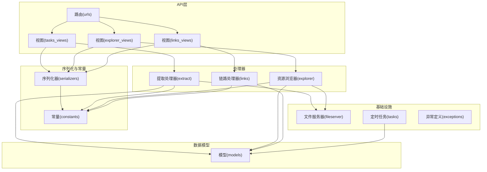
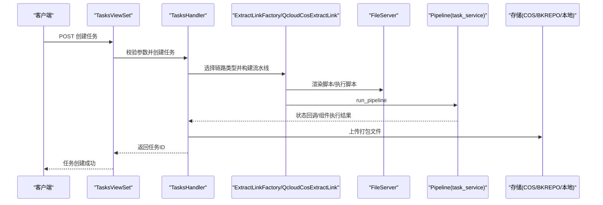
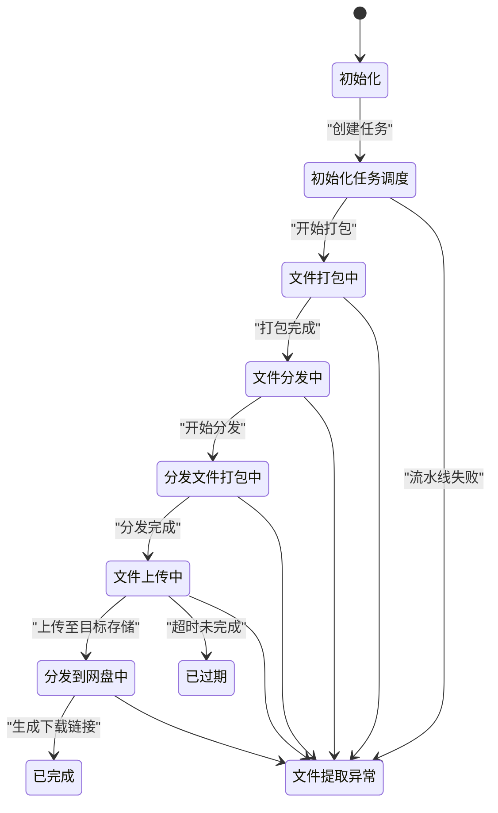
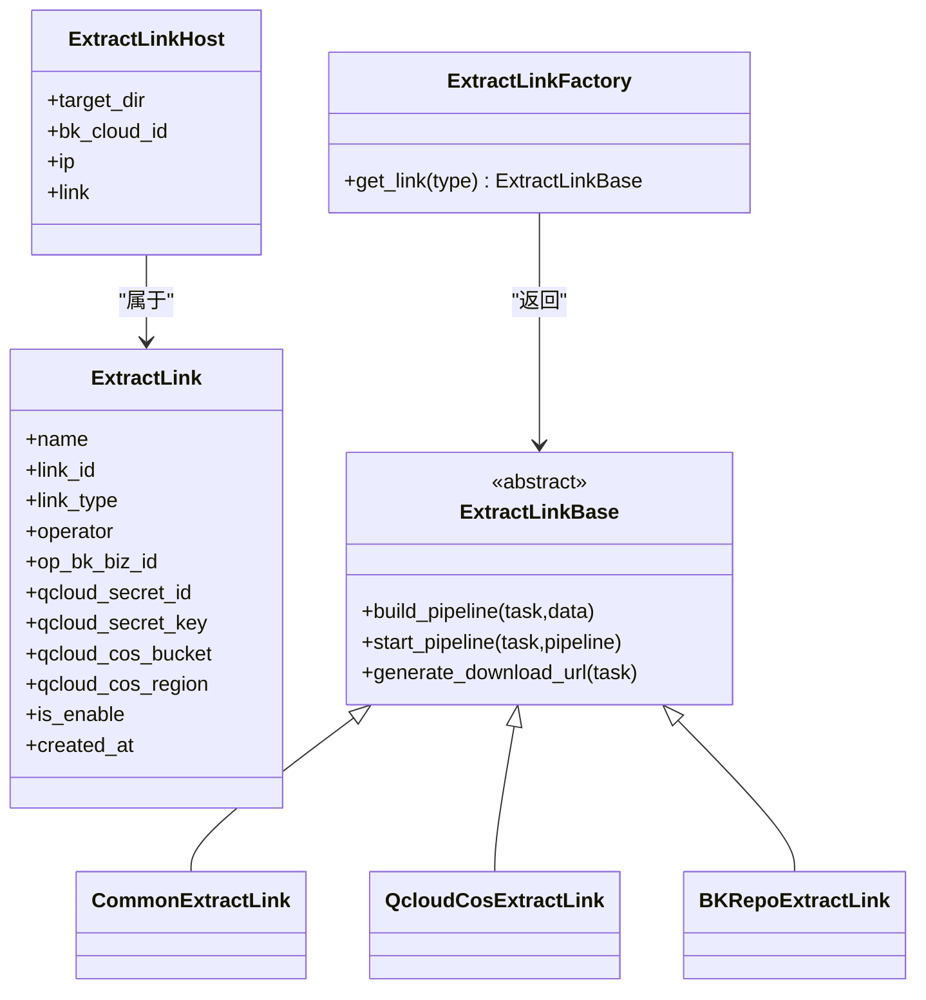
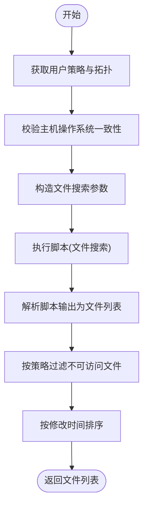
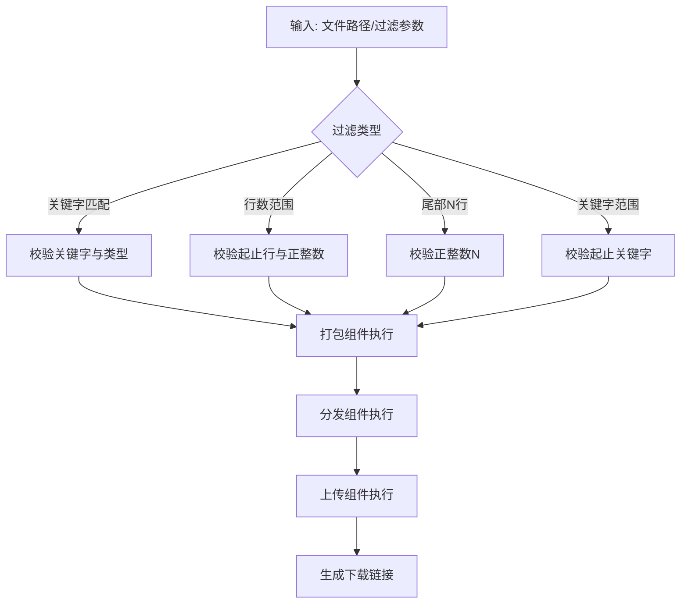
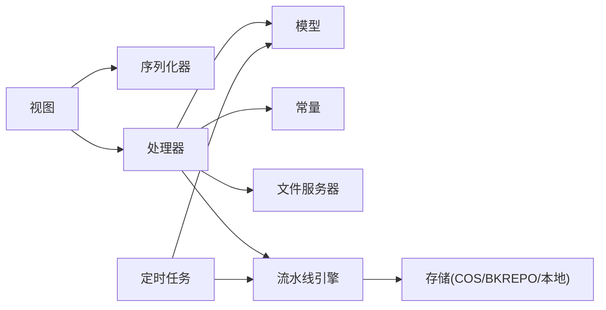

# 日志提取系统

<cite>
**本文档引用的文件**
- [apps/log_extract/models.py](file://apps/log_extract/models.py)
- [apps/log_extract/serializers.py](file://apps/log_extract/serializers.py)
- [apps/log_extract/constants.py](file://apps/log_extract/constants.py)
- [apps/log_extract/handlers/extract.py](file://apps/log_extract/handlers/extract.py)
- [apps/log_extract/handlers/explorer.py](file://apps/log_extract/handlers/explorer.py)
- [apps/log_extract/fileserver.py](file://apps/log_extract/fileserver.py)
- [apps/log_extract/tasks.py](file://apps/log_extract/tasks.py)
- [apps/log_extract/views/tasks_views.py](file://apps/log_extract/views/tasks_views.py)
- [apps/log_extract/views/explorer_views.py](file://apps/log_extract/views/explorer_views.py)
- [apps/log_extract/views/links_views.py](file://apps/log_extract/views/links_views.py)
- [apps/log_extract/urls.py](file://apps/log_extract/urls.py)
- [apps/log_extract/exceptions.py](file://apps/log_extract/exceptions.py)
</cite>

## 目录
1. [简介](#简介)
2. [项目结构](#项目结构)
3. [核心组件](#核心组件)
4. [架构总览](#架构总览)
5. [详细组件分析](#详细组件分析)
6. [依赖关系分析](#依赖关系分析)
7. [性能考虑](#性能考虑)
8. [故障排查指南](#故障排查指南)
9. [结论](#结论)
10. [附录](#附录)

## 简介
本技术文档面向日志提取系统，围绕提取任务的管理机制、提取链路的配置与监控、提取策略（批量/增量/条件过滤）、提取结果的打包与下载、以及性能优化方法进行系统性说明。文档旨在帮助开发者与运维人员快速理解系统设计、掌握配置与排障流程，并提供可操作的最佳实践。

## 项目结构
日志提取系统位于 apps/log_extract 目录下，采用“视图-序列化器-处理器-模型”的分层架构，配合定时任务与流水线引擎实现任务调度与状态监控。

图表来源
- [apps/log_extract/urls.py:34-39](file://apps/log_extract/urls.py#L34-L39)
- [apps/log_extract/views/tasks_views.py:40-52](file://apps/log_extract/views/tasks_views.py#L40-L52)
- [apps/log_extract/views/explorer_views.py:30-31](file://apps/log_extract/views/explorer_views.py#L30-L31)
- [apps/log_extract/views/links_views.py:31-37](file://apps/log_extract/views/links_views.py#L31-L37)
- [apps/log_extract/serializers.py:1-50](file://apps/log_extract/serializers.py#L1-L50)
- [apps/log_extract/constants.py:25-40](file://apps/log_extract/constants.py#L25-L40)
- [apps/log_extract/handlers/extract.py:22-51](file://apps/log_extract/handlers/extract.py#L22-L51)
- [apps/log_extract/handlers/explorer.py:57-61](file://apps/log_extract/handlers/explorer.py#L57-L61)
- [apps/log_extract/fileserver.py:39-54](file://apps/log_extract/fileserver.py#L39-L54)
- [apps/log_extract/tasks.py:38-87](file://apps/log_extract/tasks.py#L38-L87)
- [apps/log_extract/models.py:45-140](file://apps/log_extract/models.py#L45-L140)

章节来源
- [apps/log_extract/urls.py:34-39](file://apps/log_extract/urls.py#L34-L39)
- [apps/log_extract/views/tasks_views.py:40-52](file://apps/log_extract/views/tasks_views.py#L40-L52)
- [apps/log_extract/views/explorer_views.py:30-31](file://apps/log_extract/views/explorer_views.py#L30-L31)
- [apps/log_extract/views/links_views.py:31-37](file://apps/log_extract/views/links_views.py#L31-L37)

## 核心组件
- 任务模型与状态：Tasks 表记录任务元数据、过滤条件、链路信息与下载状态；提供总耗时、IP数量、文件统计等辅助方法。
- 提取链路模型：ExtractLink/ExtractLinkHost 定义链路类型、执行人、目标节点与中转机配置。
- 序列化器：负责输入校验（路径合法性、过滤类型、时间范围、链路存在性等）与输出格式化。
- 处理器：
  - ExplorerHandler：文件预览、拓扑过滤、策略授权校验与目录/文件列举。
  - ExtractLinkFactory/QcloudCosExtractLink/CommonExtractLink/BKRepoExtractLink：根据链路类型构建流水线与生成下载链接。
- 文件服务器：封装 JOB 平台脚本执行、文件分发、日志解析与脚本模板渲染。
- 定时任务：清理过期任务、撤销超时流水线并标记失败状态。

章节来源
- [apps/log_extract/models.py:73-140](file://apps/log_extract/models.py#L73-L140)
- [apps/log_extract/models.py:209-244](file://apps/log_extract/models.py#L209-L244)
- [apps/log_extract/serializers.py:179-275](file://apps/log_extract/serializers.py#L179-L275)
- [apps/log_extract/handlers/explorer.py:57-127](file://apps/log_extract/handlers/explorer.py#L57-L127)
- [apps/log_extract/handlers/extract.py:105-195](file://apps/log_extract/handlers/extract.py#L105-L195)
- [apps/log_extract/fileserver.py:39-131](file://apps/log_extract/fileserver.py#L39-L131)
- [apps/log_extract/tasks.py:38-87](file://apps/log_extract/tasks.py#L38-L87)

## 架构总览
系统通过视图接收请求，经序列化器校验后交由处理器完成业务逻辑，处理器调用文件服务器执行脚本与分发，使用流水线引擎驱动组件化流程，最终根据链路类型生成下载链接或本地文件。

图表来源
- [apps/log_extract/views/tasks_views.py:125-232](file://apps/log_extract/views/tasks_views.py#L125-L232)
- [apps/log_extract/handlers/extract.py:129-147](file://apps/log_extract/handlers/extract.py#L129-L147)
- [apps/log_extract/fileserver.py:41-54](file://apps/log_extract/fileserver.py#L41-L54)
- [apps/log_extract/handlers/extract.py:66-82](file://apps/log_extract/handlers/extract.py#L66-L82)

## 详细组件分析

### 任务管理与状态监控
- 任务创建：序列化器校验目标节点类型、文件路径合法性、过滤类型与链路存在性；处理器创建任务并启动流水线。
- 状态流转：通过流水线组件状态与常量枚举维护下载状态（初始化、打包、分发、上传、可下载、过期、失败）。
- 轮询与详情：提供轮询接口与任务详情接口，返回状态、过程信息与步骤状态。
- 过期清理：定时任务清理超时流水线并标记失败，删除内网链路过期文件。

图表来源
- [apps/log_extract/constants.py:28-56](file://apps/log_extract/constants.py#L28-L56)
- [apps/log_extract/tasks.py:38-87](file://apps/log_extract/tasks.py#L38-L87)
- [apps/log_extract/views/tasks_views.py:284-329](file://apps/log_extract/views/tasks_views.py#L284-L329)

章节来源
- [apps/log_extract/views/tasks_views.py:125-232](file://apps/log_extract/views/tasks_views.py#L125-L232)
- [apps/log_extract/views/tasks_views.py:284-329](file://apps/log_extract/views/tasks_views.py#L284-L329)
- [apps/log_extract/tasks.py:38-87](file://apps/log_extract/tasks.py#L38-L87)
- [apps/log_extract/constants.py:28-56](file://apps/log_extract/constants.py#L28-L56)

### 提取链路配置与管理
- 链路类型：内网链路、腾讯云 COS、BK Repo；工厂类根据配置映射链路实现。
- 链路模型：包含链路名称、类型、执行人、业务ID、云存储配置与中转机列表。
- 视图接口：提供链路列表、详情、创建、更新、删除能力；仅超级用户可写。

图表来源
- [apps/log_extract/models.py:209-244](file://apps/log_extract/models.py#L209-L244)
- [apps/log_extract/handlers/extract.py:182-194](file://apps/log_extract/handlers/extract.py#L182-L194)
- [apps/log_extract/handlers/extract.py:105-195](file://apps/log_extract/handlers/extract.py#L105-L195)
- [apps/log_extract/views/links_views.py:31-46](file://apps/log_extract/views/links_views.py#L31-L46)

章节来源
- [apps/log_extract/models.py:209-244](file://apps/log_extract/models.py#L209-L244)
- [apps/log_extract/handlers/extract.py:182-194](file://apps/log_extract/handlers/extract.py#L182-L194)
- [apps/log_extract/views/links_views.py:130-207](file://apps/log_extract/views/links_views.py#L130-L207)

### 文件预览与策略授权
- 策略授权：基于用户、业务与拓扑/模块授权，计算可访问目录与文件类型交集。
- 文件预览：调用文件服务器执行脚本，解析输出，过滤策略外文件，支持时间范围与子目录搜索。
- 拓扑过滤：对用户可见拓扑树进行过滤与还原，确保权限合规。

图表来源
- [apps/log_extract/handlers/explorer.py:209-273](file://apps/log_extract/handlers/explorer.py#L209-L273)
- [apps/log_extract/handlers/explorer.py:62-126](file://apps/log_extract/handlers/explorer.py#L62-L126)
- [apps/log_extract/fileserver.py:177-202](file://apps/log_extract/fileserver.py#L177-L202)

章节来源
- [apps/log_extract/handlers/explorer.py:209-273](file://apps/log_extract/handlers/explorer.py#L209-L273)
- [apps/log_extract/handlers/explorer.py:62-126](file://apps/log_extract/handlers/explorer.py#L62-L126)
- [apps/log_extract/fileserver.py:177-202](file://apps/log_extract/fileserver.py#L177-L202)

### 提取策略实现（批量/增量/条件过滤）
- 过滤类型：关键字匹配、行数范围、尾部N行、关键字范围过滤。
- 条件过滤：序列化器对关键字长度、空格、行数范围、关键字范围等进行严格校验。
- 批量与增量：通过文件服务器脚本参数控制批量打包与增量过滤；分发组件将文件分发至中转机或目标存储。

图表来源
- [apps/log_extract/serializers.py:277-337](file://apps/log_extract/serializers.py#L277-L337)
- [apps/log_extract/handlers/extract.py:197-242](file://apps/log_extract/handlers/extract.py#L197-L242)
- [apps/log_extract/fileserver.py:177-202](file://apps/log_extract/fileserver.py#L177-L202)

章节来源
- [apps/log_extract/serializers.py:277-337](file://apps/log_extract/serializers.py#L277-L337)
- [apps/log_extract/handlers/extract.py:197-242](file://apps/log_extract/handlers/extract.py#L197-L242)

### 提取结果管理（打包、上传与下载）
- 内网链路：本地打包后通过下载接口直接下载。
- 云存储链路：上传至 COS 或 BK Repo，生成下载链接。
- 下载接口：支持重定向下载或返回直链；本地链路需解密目标文件名。

章节来源
- [apps/log_extract/handlers/extract.py:169-180](file://apps/log_extract/handlers/extract.py#L169-L180)
- [apps/log_extract/views/tasks_views.py:237-256](file://apps/log_extract/views/tasks_views.py#L237-L256)
- [apps/log_extract/views/tasks_views.py:457-475](file://apps/log_extract/views/tasks_views.py#L457-L475)

## 依赖关系分析
- 视图依赖序列化器与处理器；处理器依赖模型、常量与文件服务器；定时任务依赖模型与流水线服务。
- 链路工厂根据功能开关映射链路类型，避免硬编码耦合。
- 文件服务器封装 JOB 平台调用与脚本模板渲染，降低处理器复杂度。

图表来源
- [apps/log_extract/views/tasks_views.py:40-52](file://apps/log_extract/views/tasks_views.py#L40-L52)
- [apps/log_extract/serializers.py:179-275](file://apps/log_extract/serializers.py#L179-L275)
- [apps/log_extract/handlers/extract.py:22-51](file://apps/log_extract/handlers/extract.py#L22-L51)
- [apps/log_extract/fileserver.py:39-54](file://apps/log_extract/fileserver.py#L39-L54)
- [apps/log_extract/tasks.py:38-87](file://apps/log_extract/tasks.py#L38-L87)

章节来源
- [apps/log_extract/handlers/extract.py:22-51](file://apps/log_extract/handlers/extract.py#L22-L51)
- [apps/log_extract/fileserver.py:39-54](file://apps/log_extract/fileserver.py#L39-L54)
- [apps/log_extract/tasks.py:38-87](file://apps/log_extract/tasks.py#L38-L87)

## 性能考虑
- 并发处理：文件服务器对主机日志查询采用分批获取，避免单次请求过大；拓扑查询使用多执行器并行。
- 内存管理：打包路径区分 Linux 与 Windows；限制单次打包文件数量与最大文件大小，防止内存峰值过高。
- 网络优化：分发组件将文件分发至中转机，减少远端直传压力；云存储链路使用 SDK 上传与直链生成。
- 轮询与超时：前端轮询间隔与任务超时时间由常量统一配置，避免频繁请求与资源占用。

章节来源
- [apps/log_extract/fileserver.py:150-174](file://apps/log_extract/fileserver.py#L150-L174)
- [apps/log_extract/fileserver.py:222-224](file://apps/log_extract/fileserver.py#L222-L224)
- [apps/log_extract/constants.py:185-221](file://apps/log_extract/constants.py#L185-L221)

## 故障排查指南
- 任务创建失败：检查过滤类型、文件路径合法性、链路是否存在；查看序列化器错误提示。
- 任务状态异常：查看流水线状态与组件执行日志；确认权限与拓扑匹配。
- 文件预览超时：检查脚本执行权限、时间范围与子目录搜索设置；确认主机操作系统一致性。
- 下载失败：确认任务未过期、链路配置正确、存储可用；核对下载链接生成与本地文件存在性。
- 定时清理：若出现超时任务未撤销，检查定时任务日志与流水线撤销异常。

章节来源
- [apps/log_extract/exceptions.py:42-94](file://apps/log_extract/exceptions.py#L42-L94)
- [apps/log_extract/exceptions.py:192-200](file://apps/log_extract/exceptions.py#L192-L200)
- [apps/log_extract/tasks.py:68-86](file://apps/log_extract/tasks.py#L68-L86)

## 结论
日志提取系统通过清晰的分层架构、严格的参数校验与完善的链路抽象，实现了从文件预览、任务创建、流水线执行到结果下载的完整闭环。结合定时清理与状态监控，系统具备良好的稳定性与可观测性。建议在生产环境中合理配置链路类型、控制批量规模与超时时间，并定期审查策略授权与拓扑一致性。

## 附录

### 提取配置示例（路径与过滤）
- 批量提取：提供多个文件路径，系统按路径批量打包。
- 增量提取：通过“尾部N行”过滤，仅提取最新若干行。
- 条件过滤：支持关键字匹配（与/或/非）、行数范围、关键字范围过滤。

章节来源
- [apps/log_extract/serializers.py:277-337](file://apps/log_extract/serializers.py#L277-L337)
- [apps/log_extract/serializers.py:179-275](file://apps/log_extract/serializers.py#L179-L275)

### 常见问题与解决方案
- 路径非法：确保路径以允许前缀开头且不包含非法片段；文件类型后缀不带点。
- 过滤参数错误：关键字长度、行数范围、空格与空值均有限制。
- 链路不存在：确认链路ID有效且链路类型正确。
- 任务过期：及时轮询或重新创建任务；检查定时清理策略。

章节来源
- [apps/log_extract/serializers.py:45-59](file://apps/log_extract/serializers.py#L45-L59)
- [apps/log_extract/serializers.py:255-270](file://apps/log_extract/serializers.py#L255-L270)
- [apps/log_extract/exceptions.py:117-124](file://apps/log_extract/exceptions.py#L117-L124)