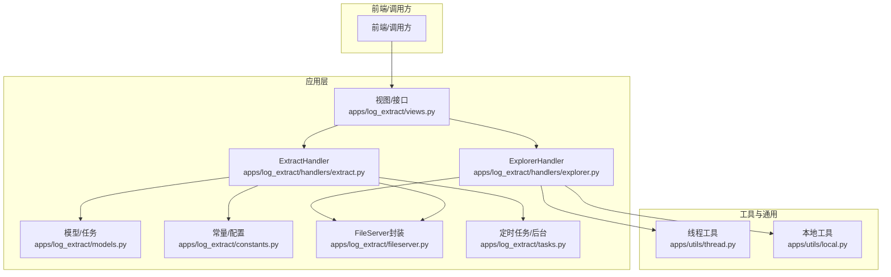
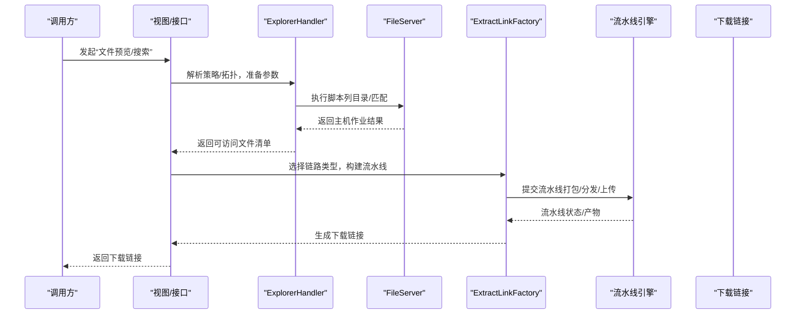
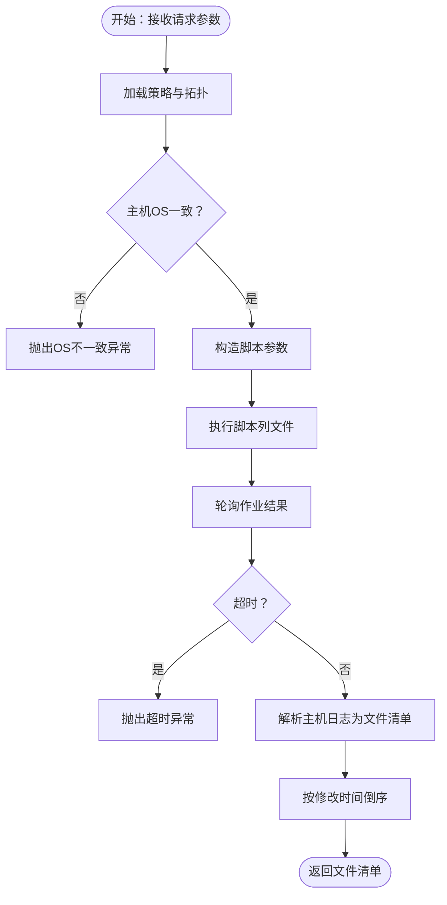
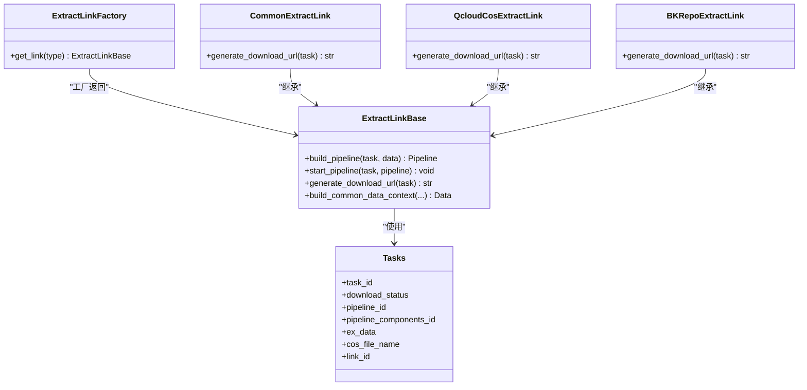
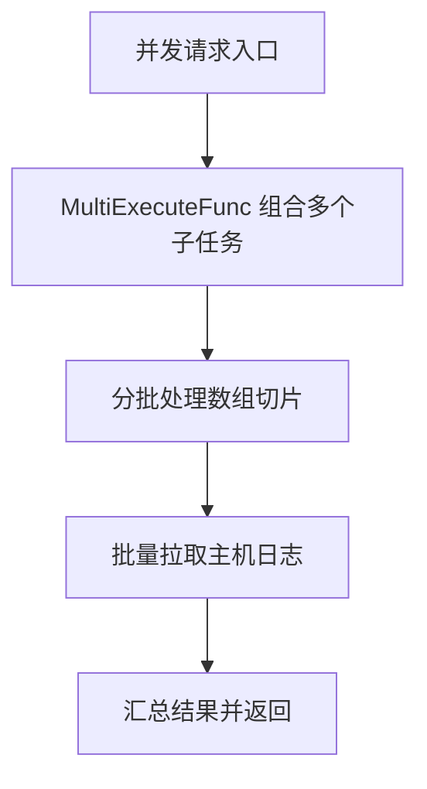
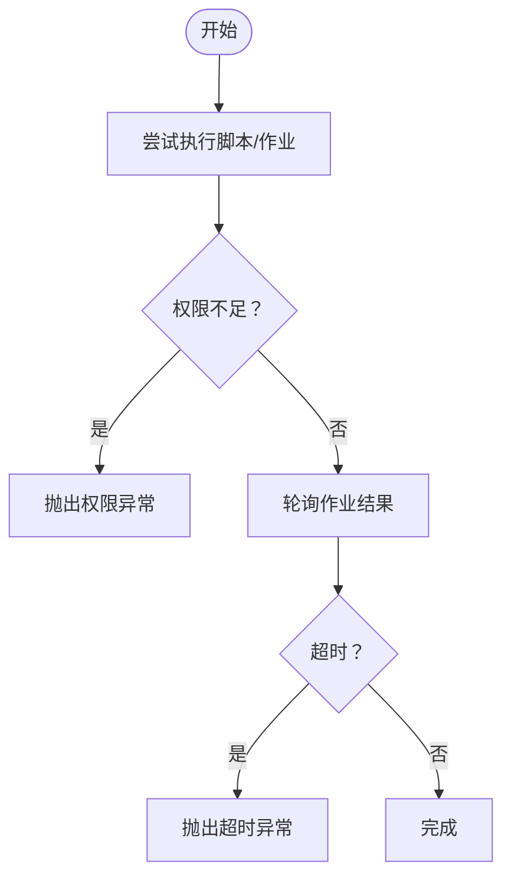
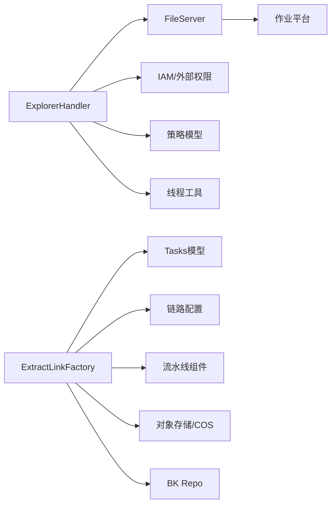

# 本地提取处理

<cite>
**本文引用的文件**
- [apps/log_extract/constants.py](file://apps/log_extract/constants.py)
- [apps/log_extract/models.py](file://apps/log_extract/models.py)
- [apps/log_extract/handlers/explorer.py](file://apps/log_extract/handlers/explorer.py)
- [apps/log_extract/handlers/extract.py](file://apps/log_extract/handlers/extract.py)
- [apps/log_extract/fileserver.py](file://apps/log_extract/fileserver.py)
- [apps/log_extract/tasks.py](file://apps/log_extract/tasks.py)
- [apps/utils/thread.py](file://apps/utils/thread.py)
- [apps/utils/local.py](file://apps/utils/local.py)
- [apps/log_extract/views.py](file://apps/log_extract/views.py)
</cite>

## 目录
1. [简介](#简介)
2. [项目结构](#项目结构)
3. [核心组件](#核心组件)
4. [架构总览](#架构总览)
5. [详细组件分析](#详细组件分析)
6. [依赖关系分析](#依赖关系分析)
7. [性能考量](#性能考量)
8. [故障排查指南](#故障排查指南)
9. [结论](#结论)
10. [附录](#附录)

## 简介
本技术文档聚焦“本地提取处理”能力，系统性阐述本地文件读取、处理与输出的完整流程，涵盖线程池管理与并发策略、任务分配与资源控制、性能优化、容错与重试、与远程处理的差异与适用场景、配置参数与调优方法，以及实际使用示例与常见问题解决方案。目标读者既包括一线开发，也包括对底层机制感兴趣的运维与测试同学。

## 项目结构
本地提取处理位于蓝鲸日志平台 SaaS 的 log_extract 应用中，围绕“文件预览/搜索 → 任务创建 → 流水线编排 → 打包/分发/上传 → 下载链接生成”的主路径展开；同时通过策略与拓扑授权控制访问范围，确保安全合规。

图表来源
- [apps/log_extract/views.py](file://apps/log_extract/views.py)
- [apps/log_extract/handlers/explorer.py](file://apps/log_extract/handlers/explorer.py)
- [apps/log_extract/handlers/extract.py](file://apps/log_extract/handlers/extract.py)
- [apps/log_extract/models.py](file://apps/log_extract/models.py)
- [apps/log_extract/constants.py](file://apps/log_extract/constants.py)
- [apps/log_extract/fileserver.py](file://apps/log_extract/fileserver.py)
- [apps/log_extract/tasks.py](file://apps/log_extract/tasks.py)
- [apps/utils/thread.py](file://apps/utils/thread.py)
- [apps/utils/local.py](file://apps/utils/local.py)

章节来源
- [apps/log_extract/constants.py:185-247](file://apps/log_extract/constants.py#L185-L247)
- [apps/log_extract/models.py:45-140](file://apps/log_extract/models.py#L45-L140)
- [apps/log_extract/handlers/explorer.py:57-127](file://apps/log_extract/handlers/explorer.py#L57-L127)
- [apps/log_extract/handlers/extract.py:62-103](file://apps/log_extract/handlers/extract.py#L62-L103)

## 核心组件
- 授权与拓扑解析：ExplorerHandler 负责基于用户策略与拓扑授权，计算可访问目录与文件类型集合，校验操作系统一致性，生成可执行的脚本与作业参数。
- 本地文件读取与预览：通过 FileServer 封装的脚本执行能力，在目标主机侧执行 list_file 等动作，收集文件元数据并解析为统一结构。
- 任务与流水线：ExtractLinkFactory 根据链路类型（内网/云COS/BK Repo）构建不同流水线，包含打包、分发、上传等阶段；Tasks 模型承载任务状态与进度。
- 并发与线程：ExplorerHandler 在查询作业结果与批量拉取主机日志时，采用分批与并发工具提升吞吐；线程池与并发策略贯穿文件搜索与结果聚合。
- 安全与鉴权：策略表、拓扑树过滤、IAM 外部权限、作业执行人与权限校验共同构成访问边界。

章节来源
- [apps/log_extract/handlers/explorer.py:209-274](file://apps/log_extract/handlers/explorer.py#L209-L274)
- [apps/log_extract/handlers/explorer.py:62-127](file://apps/log_extract/handlers/explorer.py#L62-L127)
- [apps/log_extract/handlers/extract.py:182-195](file://apps/log_extract/handlers/extract.py#L182-L195)
- [apps/log_extract/models.py:73-140](file://apps/log_extract/models.py#L73-L140)
- [apps/log_extract/constants.py:190-247](file://apps/log_extract/constants.py#L190-L247)

## 架构总览
本地提取的端到端流程如下：

图表来源
- [apps/log_extract/handlers/explorer.py:62-127](file://apps/log_extract/handlers/explorer.py#L62-L127)
- [apps/log_extract/handlers/extract.py:182-195](file://apps/log_extract/handlers/extract.py#L182-L195)
- [apps/log_extract/fileserver.py](file://apps/log_extract/fileserver.py)

## 详细组件分析

### 文件预览与搜索（ExplorerHandler）
- 目标：在目标主机上按策略与时间范围列出可访问的文件与目录，支持子目录递归、时间过滤与关键字过滤。
- 关键流程：
  - 策略与拓扑：根据用户与业务维度获取授权策略，合并多主机可访问目录与文件类型交集，校验操作系统一致性。
  - 参数构造：将策略中的允许目录、文件类型、时间范围、是否递归等组装为脚本参数。
  - 脚本执行：调用 FileServer 执行 list_file 脚本，轮询作业结果直至完成或超时。
  - 结果解析：解析主机日志输出，去重并标准化为文件/目录项，按修改时间排序返回。
- 并发与批处理：对主机日志批量拉取与分组，避免单次请求过大；对拓扑查询采用多执行器并发组合。
- 错误处理：针对权限不足、拓扑不匹配、OS 不一致、超时等场景抛出明确异常，便于前端提示与重试。

图表来源
- [apps/log_extract/handlers/explorer.py:62-127](file://apps/log_extract/handlers/explorer.py#L62-L127)
- [apps/log_extract/handlers/explorer.py:128-159](file://apps/log_extract/handlers/explorer.py#L128-L159)
- [apps/log_extract/handlers/explorer.py:209-274](file://apps/log_extract/handlers/explorer.py#L209-L274)

章节来源
- [apps/log_extract/handlers/explorer.py:62-127](file://apps/log_extract/handlers/explorer.py#L62-L127)
- [apps/log_extract/handlers/explorer.py:128-159](file://apps/log_extract/handlers/explorer.py#L128-L159)
- [apps/log_extract/handlers/explorer.py:209-274](file://apps/log_extract/handlers/explorer.py#L209-L274)

### 任务创建与流水线编排（ExtractLinkFactory 与流水线）
- 目标：根据链路类型（内网/云COS/BK Repo）构建不同的流水线，串联“打包→分发→上传”，并生成下载链接。
- 关键点：
  - 工厂模式：ExtractLinkFactory 基于配置开关与链路类型返回对应链路实现类。
  - 流水线构建：Common/QcloudCos/BKRepo 三类链路均以“打包/分发/上传”为主线，通过 PipelineBuilder 组合组件，设置输入输出变量。
  - 状态管理：任务模型 Tasks 记录流水线ID、组件ID、状态、过期时间、分发/上传任务ID等，支撑前端轮询与后台任务。
- 下载链接：内网链路通过反向URL加密参数；云COS/BK Repo 通过对应SDK/存储生成直链。

图表来源
- [apps/log_extract/handlers/extract.py:62-103](file://apps/log_extract/handlers/extract.py#L62-L103)
- [apps/log_extract/handlers/extract.py:105-195](file://apps/log_extract/handlers/extract.py#L105-L195)
- [apps/log_extract/models.py:73-140](file://apps/log_extract/models.py#L73-L140)

章节来源
- [apps/log_extract/handlers/extract.py:62-103](file://apps/log_extract/handlers/extract.py#L62-L103)
- [apps/log_extract/handlers/extract.py:105-195](file://apps/log_extract/handlers/extract.py#L105-L195)
- [apps/log_extract/models.py:73-140](file://apps/log_extract/models.py#L73-L140)

### 线程池管理与并发策略
- 并发工具：ExplorerHandler 使用 MultiExecuteFunc 对拓扑查询与主机日志拉取进行并发组合，减少串行等待。
- 批处理：对主机日志IP列表按固定批次大小分组，降低单次请求压力。
- 轮询与节流：文件搜索超时控制与轮询间隔配置，避免长时间占用资源。
- 线程池：线程池相关能力由通用工具模块提供，具体在本地提取中体现为并发执行与分批处理。

图表来源
- [apps/log_extract/handlers/explorer.py:151-159](file://apps/log_extract/handlers/explorer.py#L151-L159)
- [apps/log_extract/handlers/explorer.py:696-745](file://apps/log_extract/handlers/explorer.py#L696-L745)
- [apps/utils/thread.py](file://apps/utils/thread.py)

章节来源
- [apps/log_extract/handlers/explorer.py:151-159](file://apps/log_extract/handlers/explorer.py#L151-L159)
- [apps/log_extract/handlers/explorer.py:696-745](file://apps/log_extract/handlers/explorer.py#L696-L745)
- [apps/utils/thread.py](file://apps/utils/thread.py)

### 容错机制与重试策略
- 作业执行权限：当作业API权限不足时，捕获特定错误码并提示策略执行人缺少权限，避免静默失败。
- 轮询超时：文件搜索阶段设置超时阈值，超时即抛出明确异常，前端可引导重试或调整参数。
- 流水线启动重试：流水线提交失败时，内置有限次数重试函数，失败则标记任务状态为失败并记录原因。
- 数据恢复：任务模型记录各阶段组件ID与状态，便于后续查询与恢复。

图表来源
- [apps/log_extract/handlers/explorer.py:102-114](file://apps/log_extract/handlers/explorer.py#L102-L114)
- [apps/log_extract/handlers/explorer.py:128-141](file://apps/log_extract/handlers/explorer.py#L128-L141)
- [apps/log_extract/handlers/extract.py:53-59](file://apps/log_extract/handlers/extract.py#L53-L59)

章节来源
- [apps/log_extract/handlers/explorer.py:102-114](file://apps/log_extract/handlers/explorer.py#L102-L114)
- [apps/log_extract/handlers/explorer.py:128-141](file://apps/log_extract/handlers/explorer.py#L128-L141)
- [apps/log_extract/handlers/extract.py:53-59](file://apps/log_extract/handlers/extract.py#L53-L59)

### 本地处理与远程处理的区别与适用场景
- 本地处理（内网链路）：
  - 优点：无需第三方对象存储，下载链接由内网反向URL生成，适合内网环境与合规要求。
  - 场景：企业内网、对数据不出境有严格要求的场景。
- 远程处理（云COS/BK Repo）：
  - 优点：可利用云存储高并发与CDN加速，适合跨域/公网下载。
  - 场景：跨地域分发、公网下载、大规模并发下载。
- 选择依据：根据 FEATURE_TOGGLE 开关与链路类型配置决定可用链路；若仅开启内网链路，则默认走本地处理。

章节来源
- [apps/log_extract/handlers/extract.py:182-195](file://apps/log_extract/handlers/extract.py#L182-L195)
- [apps/log_extract/constants.py:119-131](file://apps/log_extract/constants.py#L119-L131)

### 配置参数与性能调优
- 轮询与超时：
  - 任务轮询间隔与最大轮询次数、文件搜索超时时间，直接影响响应速度与资源占用。
- 打包与分发路径：
  - 本地打包临时目录、中转服务器分发目录、BK Repo 子路径等，需结合磁盘空间与网络带宽调优。
- 批处理大小：
  - 主机日志拉取批次大小影响IO与内存占用，建议根据目标主机规模与网络状况调整。
- OS 与账号：
  - Linux 默认 root，Windows 通过配置项指定；确保作业执行账户具备目标目录读取权限。
- 关键参数定位：
  - 轮询间隔、最大轮询次数、搜索超时、打包路径、允许目录前缀、作业成功状态码等。

章节来源
- [apps/log_extract/constants.py:185-247](file://apps/log_extract/constants.py#L185-L247)

## 依赖关系分析
- 模块耦合：
  - ExplorerHandler 依赖 FileServer、拓扑查询、IAM 权限、策略模型与线程工具。
  - ExtractLinkFactory 依赖链路类型配置与任务模型，面向流水线组件。
- 外部依赖：
  - 作业平台（Job）、配置平台（CC）、对象存储（COS/BK Repo）、反向URL路由。
- 循环依赖：
  - 代码层面未见循环导入；模型与处理器通过工厂与服务调用解耦。

图表来源
- [apps/log_extract/handlers/explorer.py:30-54](file://apps/log_extract/handlers/explorer.py#L30-L54)
- [apps/log_extract/handlers/extract.py:42-51](file://apps/log_extract/handlers/extract.py#L42-L51)
- [apps/log_extract/models.py:45-140](file://apps/log_extract/models.py#L45-L140)

章节来源
- [apps/log_extract/handlers/explorer.py:30-54](file://apps/log_extract/handlers/explorer.py#L30-L54)
- [apps/log_extract/handlers/extract.py:42-51](file://apps/log_extract/handlers/extract.py#L42-L51)
- [apps/log_extract/models.py:45-140](file://apps/log_extract/models.py#L45-L140)

## 性能考量
- 并发与批处理：合理设置主机日志拉取批次大小，避免单次请求过大导致超时或内存压力。
- 轮询策略：根据目标主机数量与网络状况调整轮询间隔与超时阈值，平衡响应速度与资源消耗。
- IO 与磁盘：本地打包路径与中转分发目录的磁盘空间与IO能力直接影响打包与分发效率。
- 网络与CDN：远程链路可借助CDN加速下载，但需考虑跨域与合规限制。
- 任务状态监控：通过任务模型记录的组件ID与状态，便于定位瓶颈与复盘。

## 故障排查指南
- 权限不足：当作业API返回特定权限码时，提示策略执行人缺少权限，需在策略中修正执行人或申请权限。
- 拓扑不匹配：用户选择的主机与拓扑解析结果数量不一致，需检查拓扑数据或选择方式。
- OS 不一致：多主机操作系统不一致会阻断后续流程，需统一目标主机OS类型。
- 超时：文件搜索超时可能由网络抖动或主机IO慢引起，建议扩大超时阈值或分批重试。
- 下载失败：检查流水线状态、分发/上传任务ID与对象存储凭证；确认下载链接有效期与加密参数。

章节来源
- [apps/log_extract/handlers/explorer.py:102-114](file://apps/log_extract/handlers/explorer.py#L102-L114)
- [apps/log_extract/handlers/explorer.py:241-247](file://apps/log_extract/handlers/explorer.py#L241-L247)
- [apps/log_extract/handlers/explorer.py:128-141](file://apps/log_extract/handlers/explorer.py#L128-L141)
- [apps/log_extract/handlers/extract.py:78-83](file://apps/log_extract/handlers/extract.py#L78-L83)

## 结论
本地提取处理通过“策略+拓扑+作业平台+流水线”的组合，实现了在受控范围内对远端主机日志的安全、高效提取。其并发策略、批处理与重试机制有效提升了稳定性与吞吐；通过链路工厂与任务模型，实现了内网与远程链路的灵活切换。建议在生产环境中结合业务规模与合规要求，合理配置轮询、批处理与路径参数，并建立完善的监控与告警体系。

## 附录

### 实际使用示例（步骤说明）
- 文件预览/搜索
  - 输入：业务ID、目标IP、请求目录、是否递归、时间范围、起止时间。
  - 输出：可访问文件清单（含路径、大小、修改时间）。
  - 关键路径参考：[apps/log_extract/handlers/explorer.py:62-127](file://apps/log_extract/handlers/explorer.py#L62-L127)
- 创建提取任务
  - 输入：文件列表、过滤类型与内容、链路类型、目标节点类型与节点列表。
  - 输出：任务ID、流水线ID、下载链接。
  - 关键路径参考：[apps/log_extract/handlers/extract.py:182-195](file://apps/log_extract/handlers/extract.py#L182-L195)
- 下载文件
  - 内网链路：通过反向URL携带加密参数下载。
  - 远程链路：通过对象存储直链下载。
  - 关键路径参考：[apps/log_extract/handlers/extract.py:170-174](file://apps/log_extract/handlers/extract.py#L170-L174)

### 常见问题与解决方案
- 为什么找不到任何文件？
  - 检查策略授权目录与文件类型是否覆盖目标路径；确认是否递归搜索与时间范围设置。
  - 参考：[apps/log_extract/handlers/explorer.py:75-88](file://apps/log_extract/handlers/explorer.py#L75-L88)
- 为什么提示权限不足？
  - 策略执行人缺少作业平台权限，需在策略中修正或申请权限。
  - 参考：[apps/log_extract/handlers/explorer.py:102-114](file://apps/log_extract/handlers/explorer.py#L102-L114)
- 为什么下载链接无效？
  - 检查任务状态、对象存储凭证与下载链接有效期；确认链路类型与配置开关。
  - 参考：[apps/log_extract/handlers/extract.py:117-127](file://apps/log_extract/handlers/extract.py#L117-L127)