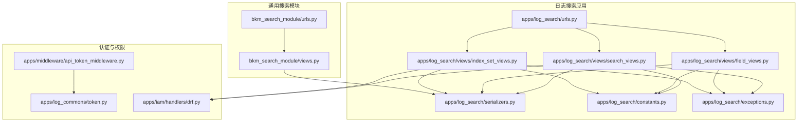
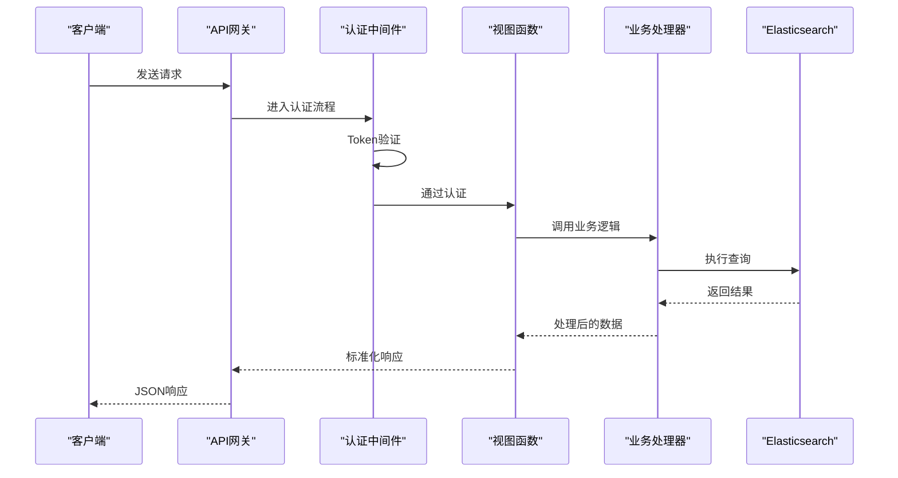
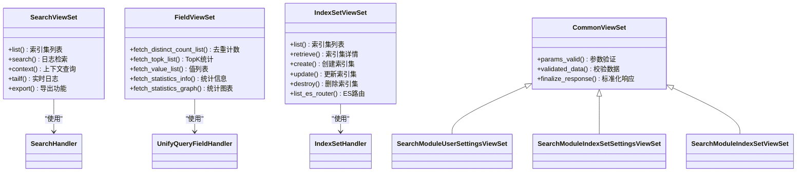
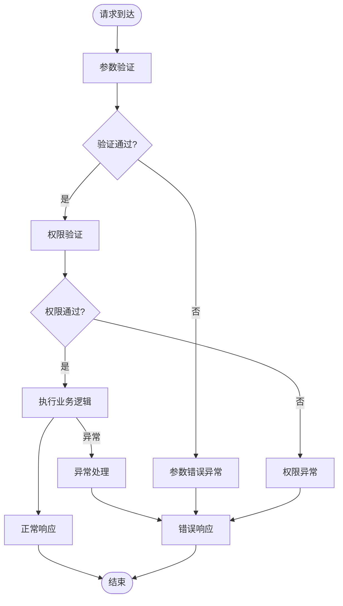

# 搜索API接口

<cite>
**本文档引用的文件**
- [apps/log_search/views/search_views.py](file://apps/log_search/views/search_views.py)
- [apps/log_search/views/field_views.py](file://apps/log_search/views/field_views.py)
- [apps/log_search/views/index_set_views.py](file://apps/log_search/views/index_set_views.py)
- [apps/log_search/urls.py](file://apps/log_search/urls.py)
- [apps/log_search/serializers.py](file://apps/log_search/serializers.py)
- [apps/log_search/constants.py](file://apps/log_search/constants.py)
- [apps/log_search/exceptions.py](file://apps/log_search/exceptions.py)
- [apps/middleware/api_token_middleware.py](file://apps/middleware/api_token_middleware.py)
- [apps/log_commons/token.py](file://apps/log_commons/token.py)
- [apps/iam/handlers/drf.py](file://apps/iam/handlers/drf.py)
- [bkm_search_module/views.py](file://bkm_search_module/views.py)
- [bkm_search_module/urls.py](file://bkm_search_module/urls.py)
</cite>

## 目录
1. [简介](#简介)
2. [项目结构](#项目结构)
3. [核心组件](#核心组件)
4. [架构概览](#架构概览)
5. [详细组件分析](#详细组件分析)
6. [依赖关系分析](#依赖关系分析)
7. [性能考虑](#性能考虑)
8. [故障排除指南](#故障排除指南)
9. [结论](#结论)
10. [附录](#附录)

## 简介
本文件为蓝鲸日志平台搜索API接口的完整技术文档，涵盖以下核心能力：
- 日志检索API：支持关键字检索、条件过滤、排序、聚合、上下文查询、实时日志等
- 索引集管理API：支持索引集的增删改查、字段配置、权限设置
- 字段查询API：支持字段发现、字段统计、字段过滤
- 认证与授权：支持Token验证、权限检查、访问控制
- 错误码与异常处理：统一的错误码体系与异常处理机制

## 项目结构
日志搜索API主要分布在两个应用中：
- apps/log_search：核心搜索功能，包含检索、字段统计、索引集管理等
- bkm_search_module：通用搜索模块，提供独立的索引集配置与用户设置接口



**图表来源**
- [apps/log_search/urls.py:26-66](file://apps/log_search/urls.py#L26-L66)
- [bkm_search_module/urls.py:12-20](file://bkm_search_module/urls.py#L12-L20)

**章节来源**
- [apps/log_search/urls.py:26-66](file://apps/log_search/urls.py#L26-L66)
- [bkm_search_module/urls.py:12-20](file://bkm_search_module/urls.py#L12-L20)

## 核心组件
本节概述三大核心组件及其职责：

### 搜索视图组件（SearchViewSet）
负责日志检索相关接口，包括：
- 索引集列表查询
- 日志内容检索
- 上下文查询
- 实时日志
- 导出功能
- 聚合图表

### 字段视图组件（FieldViewSet）
负责字段统计与分析，包括：
- 字段去重计数
- 字段TopK统计
- 字段值列表
- 字段统计信息
- 字段统计图表

### 索引集视图组件（IndexSetViewSet）
负责索引集管理，包括：
- 索引集列表与详情
- 索引集创建、更新、删除
- ES路由查询
- 标签管理
- 脱敏配置

**章节来源**
- [apps/log_search/views/search_views.py:124-800](file://apps/log_search/views/search_views.py#L124-L800)
- [apps/log_search/views/field_views.py:38-197](file://apps/log_search/views/field_views.py#L38-L197)
- [apps/log_search/views/index_set_views.py:62-800](file://apps/log_search/views/index_set_views.py#L62-L800)

## 架构概览
系统采用DRF框架，结合IAM权限控制和Token认证机制：



**图表来源**
- [apps/middleware/api_token_middleware.py:22-76](file://apps/middleware/api_token_middleware.py#L22-L76)
- [apps/log_search/views/search_views.py:133-172](file://apps/log_search/views/search_views.py#L133-L172)

## 详细组件分析

### 搜索API接口

#### 1. 索引集列表查询
- **HTTP方法**: GET
- **URL模式**: `/search/index_set/`
- **功能**: 获取用户有权限的索引集列表
- **请求参数**:
  - `space_uid`: 空间唯一标识（必填）
  - `is_group`: 是否分组展示（可选）
- **响应格式**: 索引集列表，包含权限信息

#### 2. 日志内容检索
- **HTTP方法**: POST
- **URL模式**: `/search/index_set/{index_set_id}/search/`
- **功能**: 执行日志检索
- **请求参数**:
  - `start_time/end_time`: 查询时间范围
  - `time_range`: 时间标识符
  - `keyword`: 搜索关键字
  - `host_scopes`: 主机范围
  - `addition`: 额外过滤条件
  - `begin/size`: 分页参数
  - `aggs`: ES聚合参数
- **响应格式**: 检索结果，包含日志列表和字段统计

#### 3. 上下文查询
- **HTTP方法**: POST
- **URL模式**: `/search/index_set/{index_set_id}/context/`
- **功能**: 获取指定日志的上下文
- **请求参数**: 包含日志标识和上下文大小

#### 4. 实时日志
- **HTTP方法**: POST
- **URL模式**: `/search/index_set/{index_set_id}/tail_f/`
- **功能**: 实时监控日志流

#### 5. 导出功能
- **HTTP方法**: POST
- **URL模式**: `/search/index_set/{index_set_id}/export/`
- **功能**: 导出检索结果为文件
- **请求参数**: 导出字段、文件类型等

**章节来源**
- [apps/log_search/views/search_views.py:174-778](file://apps/log_search/views/search_views.py#L174-L778)

### 字段查询API接口

#### 1. 字段去重计数
- **HTTP方法**: POST
- **URL模式**: `/field/index_set/fetch_distinct_count_list/`
- **功能**: 获取字段去重计数列表
- **请求参数**: 查询字段基础参数

#### 2. 字段TopK统计
- **HTTP方法**: POST
- **URL模式**: `/field/index_set/fetch_topk_list/`
- **功能**: 获取字段TopK统计信息
- **请求参数**: 聚合字段名称、限制数量

#### 3. 字段值列表
- **HTTP方法**: POST
- **URL模式**: `/field/index_set/fetch_value_list/`
- **功能**: 获取字段值列表并导出CSV
- **请求参数**: 聚合字段、限制数量

#### 4. 字段统计信息
- **HTTP方法**: POST
- **URL模式**: `/field/index_set/statistics/info/`
- **功能**: 获取字段统计信息
- **请求参数**: 字段类型、字段名称

#### 5. 字段统计图表
- **HTTP方法**: POST
- **URL模式**: `/field/index_set/statistics/graph/`
- **功能**: 获取字段统计图表数据
- **请求参数**: 字段类型、阈值等

**章节来源**
- [apps/log_search/views/field_views.py:55-197](file://apps/log_search/views/field_views.py#L55-L197)

### 索引集管理API接口

#### 1. 索引集列表
- **HTTP方法**: GET
- **URL模式**: `/index_set/`
- **功能**: 获取索引集列表
- **请求参数**: 分页参数、空间标识等

#### 2. 索引集详情
- **HTTP方法**: GET
- **URL模式**: `/index_set/{index_set_id}/`
- **功能**: 获取索引集详细信息

#### 3. 创建索引集
- **HTTP方法**: POST
- **URL模式**: `/index_set/`
- **功能**: 创建新的索引集
- **请求参数**: 索引集名称、场景、索引列表等

#### 4. 更新索引集
- **HTTP方法**: POST
- **URL模式**: `/index_set/{index_set_id}/`
- **功能**: 更新现有索引集

#### 5. 删除索引集
- **HTTP方法**: DELETE
- **URL模式**: `/index_set/{index_set_id}/`
- **功能**: 删除索引集

#### 6. ES路由查询
- **HTTP方法**: GET
- **URL模式**: `/index_set/list_es_router/`
- **功能**: 查询ES路由信息

**章节来源**
- [apps/log_search/views/index_set_views.py:189-800](file://apps/log_search/views/index_set_views.py#L189-L800)

### 通用搜索模块API接口

#### 1. 用户配置管理
- **HTTP方法**: GET/POST
- **URL模式**: `/settings/`
- **功能**: 获取和保存用户配置

#### 2. 索引集字段配置
- **HTTP方法**: GET/POST/PUT/DELETE
- **URL模式**: `/index_set/{index_set_id}/settings/`
- **功能**: 管理索引集字段配置

#### 3. 索引集操作
- **HTTP方法**: GET/POST/PUT/DELETE
- **URL模式**: `/index_set/`
- **功能**: 索引集列表、条件查询、历史记录等

**章节来源**
- [bkm_search_module/views.py:86-277](file://bkm_search_module/views.py#L86-L277)

## 依赖关系分析



**图表来源**
- [apps/log_search/views/search_views.py:124-800](file://apps/log_search/views/search_views.py#L124-L800)
- [apps/log_search/views/field_views.py:38-197](file://apps/log_search/views/field_views.py#L38-L197)
- [apps/log_search/views/index_set_views.py:62-800](file://apps/log_search/views/index_set_views.py#L62-L800)
- [bkm_search_module/views.py:33-84](file://bkm_search_module/views.py#L33-L84)

**章节来源**
- [apps/log_search/views/search_views.py:124-800](file://apps/log_search/views/search_views.py#L124-L800)
- [apps/log_search/views/field_views.py:38-197](file://apps/log_search/views/field_views.py#L38-L197)
- [apps/log_search/views/index_set_views.py:62-800](file://apps/log_search/views/index_set_views.py#L62-L800)
- [bkm_search_module/views.py:33-84](file://bkm_search_module/views.py#L33-L84)

## 性能考虑
1. **查询优化**：
   - 支持Scroll查询处理大数据量
   - 提供聚合查询优化
   - 支持字段去重计数的并发执行

2. **缓存策略**：
   - 字段统计结果缓存
   - 索引集权限信息缓存
   - ES查询结果缓存

3. **异步处理**：
   - 导出任务异步执行
   - 字段统计的多线程并发
   - 聚合查询的批处理

## 故障排除指南

### 常见错误码
- **40000**: 认证相关错误
- **401**: 索引集不存在
- **402**: 时间字段信息缺失
- **408**: ES数据源连接失败
- **417**: Trace查询时间字段不存在
- **501**: 异步导出最大条数限制
- **902**: JWT校验失败
- **904**: 缺少token或token为空

### 异常处理流程



**图表来源**
- [apps/log_search/exceptions.py:286-679](file://apps/log_search/exceptions.py#L286-L679)

### 常见问题解决
1. **权限不足**：检查IAM权限配置和用户角色
2. **查询超时**：优化查询条件，减少时间范围
3. **导出失败**：检查索引集字段配置和存储空间
4. **Token失效**：重新生成API Token

**章节来源**
- [apps/log_search/exceptions.py:286-679](file://apps/log_search/exceptions.py#L286-L679)

## 结论
本API接口提供了完整的日志搜索解决方案，具备以下特点：
- 全面的检索功能，支持复杂查询条件
- 灵活的索引集管理，支持多种场景
- 丰富的字段分析工具
- 完善的权限控制和认证机制
- 统一的错误处理和异常管理

建议在生产环境中合理配置缓存和异步任务，以提升系统性能和用户体验。

## 附录

### API使用示例

#### curl命令示例
```bash
# 获取索引集列表
curl -X GET "https://your-domain.com/search/index_set/?space_uid=bkcc__2"

# 执行日志检索
curl -X POST "https://your-domain.com/search/index_set/1/search/" \
  -H "Content-Type: application/json" \
  -d '{
    "keyword": "error",
    "start_time": "2023-01-01 00:00:00",
    "end_time": "2023-01-01 01:00:00",
    "size": 100
  }'

# 获取字段统计
curl -X POST "https://your-domain.com/field/index_set/statistics/info/" \
  -H "Content-Type: application/json" \
  -d '{
    "agg_field": "status_code",
    "field_type": "integer"
  }'
```

### SDK调用示例
```python
# Python SDK示例
from blueking.component.shortcuts import get_client_by_request

client = get_client_by_request(request)
result = client.log_search.search(
    index_set_id=1,
    params={
        "keyword": "error",
        "start_time": "2023-01-01 00:00:00",
        "end_time": "2023-01-01 01:00:00"
    }
)
```

### 认证配置
1. **Token认证**：
   - 设置请求头：`X-Bklog-Token: YOUR_TOKEN`
   - 可选：`X-Bklog-Space-Uid: SPACE_UID`

2. **IAM权限**：
   - 需要`SEARCH_LOG`权限
   - 支持批量权限检查
   - 支持实例级权限控制

**章节来源**
- [apps/middleware/api_token_middleware.py:22-76](file://apps/middleware/api_token_middleware.py#L22-L76)
- [apps/iam/handlers/drf.py:41-200](file://apps/iam/handlers/drf.py#L41-L200)