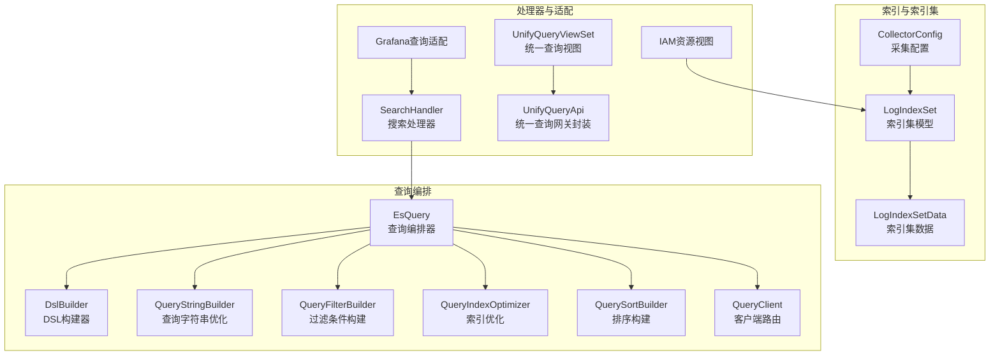
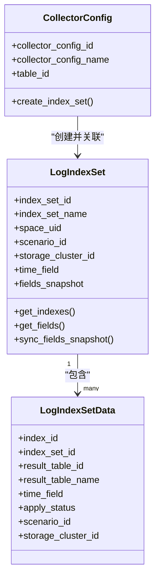
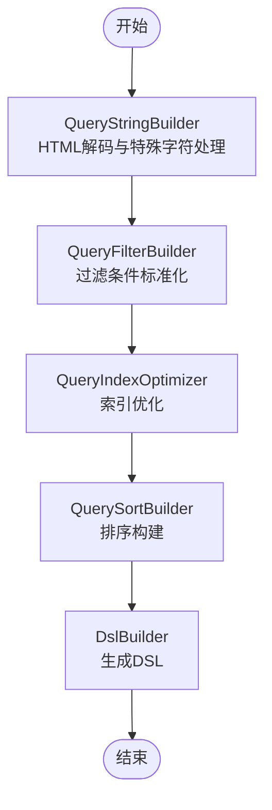
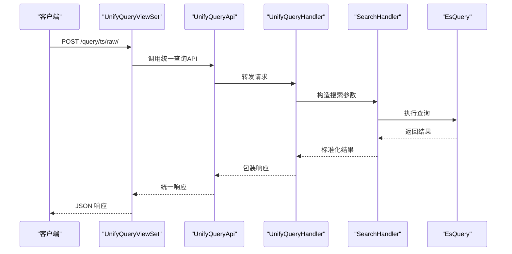
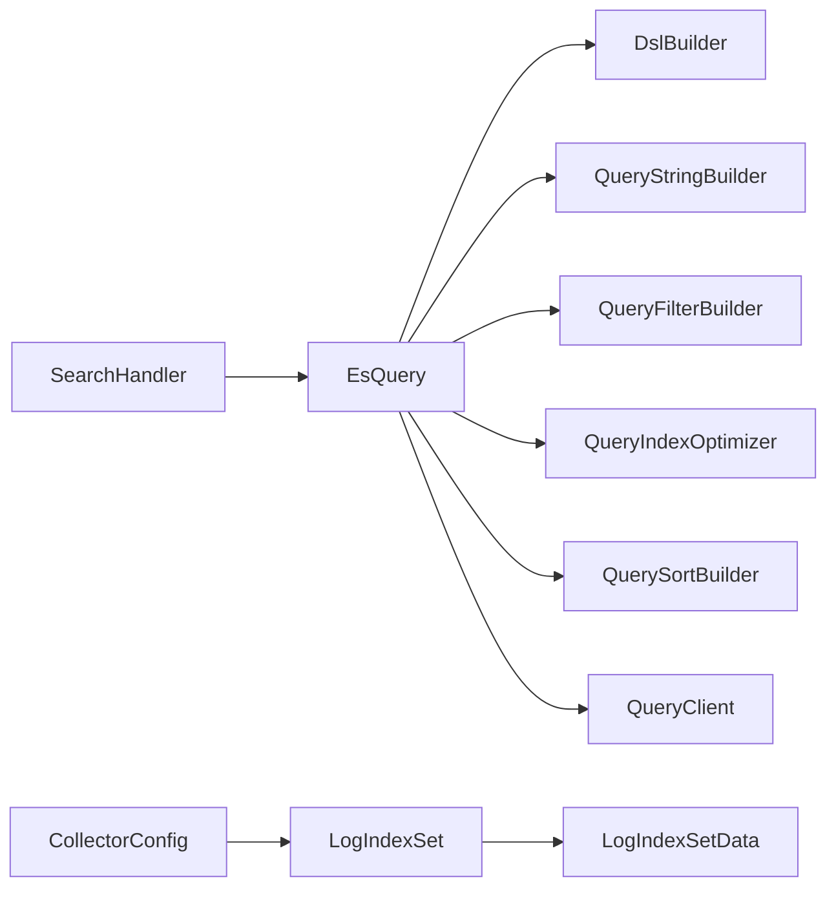

# 日志检索系统

<cite>
**本文引用的文件**
- [apps/log_search/models.py](file://apps/log_search/models.py)
- [apps/log_databus/models.py](file://apps/log_databus/models.py)
- [apps/log_esquery/esquery/esquery.py](file://apps/log_esquery/esquery/esquery.py)
- [apps/log_esquery/esquery/dsl_builder/dsl_builder.py](file://apps/log_esquery/esquery/dsl_builder/dsl_builder.py)
- [apps/log_esquery/esquery/dsl_builder/query_builder/query_builder_logic.py](file://apps/log_esquery/esquery/dsl_builder/query_builder/query_builder_logic.py)
- [apps/log_esquery/esquery/builder/query_string_builder.py](file://apps/log_esquery/esquery/builder/query_string_builder.py)
- [apps/log_esquery/esquery/builder/query_filter_builder.py](file://apps/log_esquery/esquery/builder/query_filter_builder.py)
- [apps/log_esquery/esquery/builder/query_index_optimizer.py](file://apps/log_esquery/esquery/builder/query_index_optimizer.py)
- [apps/log_esquery/esquery/builder/query_sort_builder.py](file://apps/log_esquery/esquery/builder/query_sort_builder.py)
- [apps/log_esquery/esquery/client/QueryClient.py](file://apps/log_esquery/esquery/client/QueryClient.py)
- [apps/log_search/handlers/search/search_handlers_esquery.py](file://apps/log_search/handlers/search/search_handlers_esquery.py)
- [apps/log_unifyquery/views.py](file://apps/log_unifyquery/views.py)
- [apps/api/modules/unify_query.py](file://apps/api/modules/unify_query.py)
- [apps/iam/views/resources.py](file://apps/iam/views/resources.py)
- [apps/grafana/handlers/query.py](file://apps/grafana/handlers/query.py)
- [apps/log_search/constants.py](file://apps/log_search/constants.py)
</cite>

## 目录
1. [简介](#简介)
2. [项目结构](#项目结构)
3. [核心组件](#核心组件)
4. [架构总览](#架构总览)
5. [详细组件分析](#详细组件分析)
6. [依赖分析](#依赖分析)
7. [性能考虑](#性能考虑)
8. [故障排查指南](#故障排查指南)
9. [结论](#结论)
10. [附录](#附录)

## 简介
本技术文档面向“日志检索系统”，聚焦于基于 Elasticsearch 的检索能力实现，涵盖以下主题：
- Elasticsearch 集成与索引管理：索引集模型、索引集数据、索引集创建与字段快照同步、时间字段与索引优化策略
- 查询语法支持：全文检索、字段查询、时间范围筛选、布尔逻辑组合、通配符与特殊字符处理
- 统一查询接口设计：参数标准化、结果格式统一、跨平台兼容性
- 性能优化策略：查询缓存、索引优化、分页与滚动查询、聚合与高亮
- API 接口文档与查询示例：提供接口规范与典型查询场景

## 项目结构
围绕日志检索的关键模块与文件组织如下：
- 索引与索引集模型：apps/log_search/models.py、apps/log_databus/models.py
- ES 查询编排与 DSL 构建：apps/log_esquery/esquery/*.py
- 查询处理器与适配器：apps/log_search/handlers/search/search_handlers_esquery.py
- 统一查询入口与网关封装：apps/log_unifyquery/views.py、apps/api/modules/unify_query.py
- IAM 资源视图与索引集权限：apps/iam/views/resources.py
- Grafana 查询适配：apps/grafana/handlers/query.py
- 常量与阈值：apps/log_search/constants.py



图表来源
- [apps/log_search/models.py:337-745](file://apps/log_search/models.py#L337-L745)
- [apps/log_databus/models.py:102-412](file://apps/log_databus/models.py#L102-L412)
- [apps/log_esquery/esquery/esquery.py:51-405](file://apps/log_esquery/esquery/esquery.py#L51-L405)
- [apps/log_esquery/esquery/dsl_builder/dsl_builder.py:34-61](file://apps/log_esquery/esquery/dsl_builder/dsl_builder.py#L34-L61)
- [apps/log_esquery/esquery/builder/query_string_builder.py:31-54](file://apps/log_esquery/esquery/builder/query_string_builder.py#L31-L54)
- [apps/log_esquery/esquery/builder/query_filter_builder.py:26-48](file://apps/log_esquery/esquery/builder/query_filter_builder.py#L26-L48)
- [apps/log_esquery/esquery/builder/query_index_optimizer.py:33-138](file://apps/log_esquery/esquery/builder/query_index_optimizer.py#L33-L138)
- [apps/log_esquery/esquery/builder/query_sort_builder.py:26-45](file://apps/log_esquery/esquery/builder/query_sort_builder.py#L26-L45)
- [apps/log_esquery/esquery/client/QueryClient.py:28-53](file://apps/log_esquery/esquery/client/QueryClient.py#L28-L53)
- [apps/log_search/handlers/search/search_handlers_esquery.py:166-800](file://apps/log_search/handlers/search/search_handlers_esquery.py#L166-L800)
- [apps/log_unifyquery/views.py:33-184](file://apps/log_unifyquery/views.py#L33-L184)
- [apps/api/modules/unify_query.py:52-107](file://apps/api/modules/unify_query.py#L52-L107)
- [apps/iam/views/resources.py:364-395](file://apps/iam/views/resources.py#L364-L395)
- [apps/grafana/handlers/query.py:367-399](file://apps/grafana/handlers/query.py#L367-L399)

章节来源
- [apps/log_search/models.py:337-745](file://apps/log_search/models.py#L337-L745)
- [apps/log_databus/models.py:102-412](file://apps/log_databus/models.py#L102-L412)
- [apps/log_esquery/esquery/esquery.py:51-405](file://apps/log_esquery/esquery/esquery.py#L51-L405)
- [apps/log_search/handlers/search/search_handlers_esquery.py:166-800](file://apps/log_search/handlers/search/search_handlers_esquery.py#L166-L800)
- [apps/log_unifyquery/views.py:33-184](file://apps/log_unifyquery/views.py#L33-L184)
- [apps/api/modules/unify_query.py:52-107](file://apps/api/modules/unify_query.py#L52-L107)
- [apps/iam/views/resources.py:364-395](file://apps/iam/views/resources.py#L364-L395)
- [apps/grafana/handlers/query.py:367-399](file://apps/grafana/handlers/query.py#L367-L399)

## 核心组件
- 索引集模型与索引集数据
  - LogIndexSet：索引集实体，包含场景、存储集群、时间字段、字段快照、权限与标签等元信息
  - LogIndexSetData：索引集下的具体索引（结果表）映射，含审批状态、时间字段、存储集群等
  - 采集配置与索引集联动：CollectorConfig.create_index_set 与 LogIndexSet 关联
- 查询编排器 EsQuery
  - 参数增强（Lucene 语法）、时间范围构建、索引优化、过滤与排序构建、DSL 生成、客户端路由与结果兼容
- DSL 构建器与查询优化器
  - DslBuilder：将查询参数转为 ES DSL
  - QueryStringBuilder：查询字符串 HTML 解码与特殊字符处理
  - QueryFilterBuilder：过滤条件标准化
  - QueryIndexOptimizer：按时间范围与场景优化索引集合
  - QuerySortBuilder：排序字段与方向标准化
- 客户端路由 QueryClient：按场景选择具体 ES 客户端实现
- 统一查询接口
  - UnifyQueryViewSet：提供 ts/ts/reference/ts/raw 等统一检索接口
  - UnifyQueryApi：统一查询网关封装，Header 注入与响应包装

章节来源
- [apps/log_search/models.py:337-745](file://apps/log_search/models.py#L337-L745)
- [apps/log_databus/models.py:102-412](file://apps/log_databus/models.py#L102-L412)
- [apps/log_esquery/esquery/esquery.py:51-405](file://apps/log_esquery/esquery/esquery.py#L51-L405)
- [apps/log_esquery/esquery/dsl_builder/dsl_builder.py:34-61](file://apps/log_esquery/esquery/dsl_builder/dsl_builder.py#L34-L61)
- [apps/log_esquery/esquery/builder/query_string_builder.py:31-54](file://apps/log_esquery/esquery/builder/query_string_builder.py#L31-L54)
- [apps/log_esquery/esquery/builder/query_filter_builder.py:26-48](file://apps/log_esquery/esquery/builder/query_filter_builder.py#L26-L48)
- [apps/log_esquery/esquery/builder/query_index_optimizer.py:33-138](file://apps/log_esquery/esquery/builder/query_index_optimizer.py#L33-L138)
- [apps/log_esquery/esquery/builder/query_sort_builder.py:26-45](file://apps/log_esquery/esquery/builder/query_sort_builder.py#L26-L45)
- [apps/log_esquery/esquery/client/QueryClient.py:28-53](file://apps/log_esquery/esquery/client/QueryClient.py#L28-L53)
- [apps/log_unifyquery/views.py:33-184](file://apps/log_unifyquery/views.py#L33-L184)
- [apps/api/modules/unify_query.py:52-107](file://apps/api/modules/unify_query.py#L52-L107)

## 架构总览
系统采用“索引集模型 + 查询编排 + DSL 构建 + 客户端路由”的分层架构，统一查询入口通过网关封装，兼容多场景（采集日志、数据平台、第三方 ES）。

```mermaid
sequenceDiagram
participant Client as "客户端"
participant View as "UnifyQueryViewSet"
participant Handler as "UnifyQueryHandler/UnifyQueryApi"
participant Search as "SearchHandler"
participant Esq as "EsQuery"
participant DSL as "DslBuilder"
participant Opt as "索引/过滤/排序优化器"
participant QC as "QueryClient"
participant ES as "Elasticsearch"
Client->>View : POST /query/ts*
View->>Handler : 转发请求
Handler->>Search : 构造搜索参数
Search->>Esq : 传入查询字典
Esq->>Opt : 优化查询字符串/过滤/索引/排序
Esq->>DSL : 生成DSL
Esq->>QC : 获取客户端实例
QC->>ES : 发起查询
ES-->>QC : 返回结果
QC-->>Esq : 结果回传
Esq-->>Search : 结果回传
Search-->>Handler : 标准化结果
Handler-->>View : 统一响应
View-->>Client : JSON 响应
```

图表来源
- [apps/log_unifyquery/views.py:33-184](file://apps/log_unifyquery/views.py#L33-L184)
- [apps/log_search/handlers/search/search_handlers_esquery.py:166-800](file://apps/log_search/handlers/search/search_handlers_esquery.py#L166-L800)
- [apps/log_esquery/esquery/esquery.py:51-405](file://apps/log_esquery/esquery/esquery.py#L51-L405)
- [apps/log_esquery/esquery/dsl_builder/dsl_builder.py:34-61](file://apps/log_esquery/esquery/dsl_builder/dsl_builder.py#L34-L61)
- [apps/log_esquery/esquery/builder/query_index_optimizer.py:33-138](file://apps/log_esquery/esquery/builder/query_index_optimizer.py#L33-L138)
- [apps/log_esquery/esquery/builder/query_filter_builder.py:26-48](file://apps/log_esquery/esquery/builder/query_filter_builder.py#L26-L48)
- [apps/log_esquery/esquery/builder/query_sort_builder.py:26-45](file://apps/log_esquery/esquery/builder/query_sort_builder.py#L26-L45)
- [apps/log_esquery/esquery/client/QueryClient.py:28-53](file://apps/log_esquery/esquery/client/QueryClient.py#L28-L53)

## 详细组件分析

### 索引集与索引管理
- 索引集模型
  - 字段快照：支持字段快照同步与失效回退，保障字段信息一致性
  - 场景与存储：支持 log、bkdata、es 三种场景，存储集群 ID 与时间字段配置
  - 权限与标签：view_roles、标签、收藏等
- 索引集数据
  - 与 LogIndexSet 一对多映射，记录结果表、时间字段、审批状态、存储集群等
- 采集配置联动
  - 采集配置创建时可自动创建索引集，并建立索引集与采集配置的关联



图表来源
- [apps/log_search/models.py:337-745](file://apps/log_search/models.py#L337-L745)
- [apps/log_databus/models.py:102-412](file://apps/log_databus/models.py#L102-L412)

章节来源
- [apps/log_search/models.py:337-745](file://apps/log_search/models.py#L337-L745)
- [apps/log_databus/models.py:102-412](file://apps/log_databus/models.py#L102-L412)

### 查询语法与DSL构建
- 查询字符串优化
  - HTML 解码与特殊字符处理，避免非法 Lucene 语法
- 过滤条件构建
  - 标准化字段、运算符、值与组合条件（and/or）
- 索引优化
  - 按时间范围与场景生成精确索引集合，减少扫描范围
- 排序构建
  - 标准化排序字段与方向，支持时间字段与上下文字段组合
- DSL 生成
  - 统一 DSL 结构，支持聚合、高亮、折叠、search_after 等



图表来源
- [apps/log_esquery/esquery/builder/query_string_builder.py:31-54](file://apps/log_esquery/esquery/builder/query_string_builder.py#L31-L54)
- [apps/log_esquery/esquery/builder/query_filter_builder.py:26-48](file://apps/log_esquery/esquery/builder/query_filter_builder.py#L26-L48)
- [apps/log_esquery/esquery/builder/query_index_optimizer.py:33-138](file://apps/log_esquery/esquery/builder/query_index_optimizer.py#L33-L138)
- [apps/log_esquery/esquery/builder/query_sort_builder.py:26-45](file://apps/log_esquery/esquery/builder/query_sort_builder.py#L26-L45)
- [apps/log_esquery/esquery/dsl_builder/dsl_builder.py:34-61](file://apps/log_esquery/esquery/dsl_builder/dsl_builder.py#L34-L61)

章节来源
- [apps/log_esquery/esquery/builder/query_string_builder.py:31-54](file://apps/log_esquery/esquery/builder/query_string_builder.py#L31-L54)
- [apps/log_esquery/esquery/builder/query_filter_builder.py:26-48](file://apps/log_esquery/esquery/builder/query_filter_builder.py#L26-L48)
- [apps/log_esquery/esquery/builder/query_index_optimizer.py:33-138](file://apps/log_esquery/esquery/builder/query_index_optimizer.py#L33-L138)
- [apps/log_esquery/esquery/builder/query_sort_builder.py:26-45](file://apps/log_esquery/esquery/builder/query_sort_builder.py#L26-L45)
- [apps/log_esquery/esquery/dsl_builder/dsl_builder.py:34-61](file://apps/log_esquery/esquery/dsl_builder/dsl_builder.py#L34-L61)

### 统一查询接口设计
- 接口路径与用途
  - /query/ts/：时序型检索
  - /query/ts/reference/：非时序型检索
  - /query/ts/raw/：时序型检索原始日志
- 请求头与鉴权
  - X-Bk-Scope-Skip-Space、X-Bk-Scope-Space-Uid、Bk-Query-Source
  - 白名单与 Token 校验
- 响应格式
  - 统一包装 data/result 字段，便于前端消费



图表来源
- [apps/log_unifyquery/views.py:33-184](file://apps/log_unifyquery/views.py#L33-L184)
- [apps/api/modules/unify_query.py:52-107](file://apps/api/modules/unify_query.py#L52-L107)
- [apps/log_search/handlers/search/search_handlers_esquery.py:166-800](file://apps/log_search/handlers/search/search_handlers_esquery.py#L166-L800)

章节来源
- [apps/log_unifyquery/views.py:33-184](file://apps/log_unifyquery/views.py#L33-L184)
- [apps/api/modules/unify_query.py:52-107](file://apps/api/modules/unify_query.py#L52-L107)
- [apps/log_search/handlers/search/search_handlers_esquery.py:166-800](file://apps/log_search/handlers/search/search_handlers_esquery.py#L166-L800)

### 权限控制与索引集管理
- IAM 资源视图
  - 支持按索引集名称搜索、带路径资源树返回、多租户模式过滤
- 索引集权限
  - LogIndexSet.view_roles 冗余字段配合 AUTH 模块处理查看权限
- 索引集创建与字段管理
  - 采集配置创建索引集，字段快照同步，时间字段与排序字段配置

章节来源
- [apps/iam/views/resources.py:364-395](file://apps/iam/views/resources.py#L364-L395)
- [apps/log_search/models.py:337-745](file://apps/log_search/models.py#L337-L745)
- [apps/log_databus/models.py:102-412](file://apps/log_databus/models.py#L102-L412)

### 跨平台兼容与适配
- Grafana 查询适配
  - 通过 FeatureToggle 切换使用统一查询或原生 ES 查询
  - 自动构造查询参数并标准化字段顺序

章节来源
- [apps/grafana/handlers/query.py:367-399](file://apps/grafana/handlers/query.py#L367-L399)

## 依赖分析
- 组件耦合
  - SearchHandler 依赖 EsQuery 与多个优化器；EsQuery 依赖 QueryClient 路由到具体场景实现
  - 索引集模型与采集配置模型存在创建与关联关系
- 外部依赖
  - Elasticsearch 客户端、luqum（DSL 语法解析）、时间范围工具、缓存与线程池等



图表来源
- [apps/log_search/handlers/search/search_handlers_esquery.py:166-800](file://apps/log_search/handlers/search/search_handlers_esquery.py#L166-L800)
- [apps/log_esquery/esquery/esquery.py:51-405](file://apps/log_esquery/esquery/esquery.py#L51-L405)
- [apps/log_search/models.py:337-745](file://apps/log_search/models.py#L337-L745)
- [apps/log_databus/models.py:102-412](file://apps/log_databus/models.py#L102-L412)

章节来源
- [apps/log_search/handlers/search/search_handlers_esquery.py:166-800](file://apps/log_search/handlers/search/search_handlers_esquery.py#L166-L800)
- [apps/log_esquery/esquery/esquery.py:51-405](file://apps/log_esquery/esquery/esquery.py#L51-L405)
- [apps/log_search/models.py:337-745](file://apps/log_search/models.py#L337-L745)
- [apps/log_databus/models.py:102-412](file://apps/log_databus/models.py#L102-L412)

## 性能考虑
- 查询缓存
  - 字段快照缓存与预查询结果缓存，降低重复字段获取与映射查询开销
- 索引优化
  - QueryIndexOptimizer 按时间范围与场景生成精确索引集合，避免全量扫描
- 分页与滚动
  - 单次最大结果窗口限制与滚动查询（scroll）策略，结合异步导出与快速下载策略
- 聚合与高亮
  - 聚合桶数量限制与高亮长度限制，避免内存与 CPU 峰值
- 客户端路由
  - 按场景选择最优客户端实现，减少不必要的网络与协议转换

章节来源
- [apps/log_search/constants.py:105-180](file://apps/log_search/constants.py#L105-L180)
- [apps/log_esquery/esquery/builder/query_index_optimizer.py:33-138](file://apps/log_esquery/esquery/builder/query_index_optimizer.py#L33-L138)
- [apps/log_search/handlers/search/search_handlers_esquery.py:643-711](file://apps/log_search/handlers/search/search_handlers_esquery.py#L643-L711)

## 故障排查指南
- 常见异常与定位
  - 索引集不存在、字段映射异常、排序字段异常、聚合桶过多、高亮异常、时间字段类型不匹配
- 错误处理流程
  - 统一异常捕获与日志记录，必要时回退到字段快照或降级查询
- 监控指标
  - 查询耗时、查询次数、客户端状态等指标可用于性能与稳定性监控

章节来源
- [apps/log_search/constants.py:37-48](file://apps/log_search/constants.py#L37-L48)
- [apps/log_search/handlers/search/search_handlers_esquery.py:768-798](file://apps/log_search/handlers/search/search_handlers_esquery.py#L768-L798)

## 结论
本系统以索引集为核心抽象，结合查询编排与 DSL 构建，实现了对 Elasticsearch 的高效检索能力。通过统一查询接口与多场景客户端路由，满足多平台与多业务的检索需求。在性能方面，通过索引优化、分页与滚动、缓存与指标监控等手段，确保在大规模数据场景下的稳定与高效。

## 附录

### API 接口文档
- 统一查询接口
  - POST /query/ts/：时序型检索
  - POST /query/ts/reference/：非时序型检索
  - POST /query/ts/raw/：时序型检索原始日志
- 请求头
  - X-Bk-Scope-Skip-Space、X-Bk-Scope-Space-Uid、Bk-Query-Source
- 响应
  - data/result 包裹结构，便于前端统一处理

章节来源
- [apps/log_unifyquery/views.py:33-184](file://apps/log_unifyquery/views.py#L33-L184)
- [apps/api/modules/unify_query.py:52-107](file://apps/api/modules/unify_query.py#L52-L107)

### 查询示例（路径参考）
- 全文检索与字段组合
  - [apps/log_esquery/esquery/builder/query_string_builder.py:31-54](file://apps/log_esquery/esquery/builder/query_string_builder.py#L31-L54)
  - [apps/log_esquery/esquery/builder/query_filter_builder.py:26-48](file://apps/log_esquery/esquery/builder/query_filter_builder.py#L26-L48)
- 时间范围与索引优化
  - [apps/log_esquery/esquery/builder/query_index_optimizer.py:33-138](file://apps/log_esquery/esquery/builder/query_index_optimizer.py#L33-L138)
- 排序与 DSL 生成
  - [apps/log_esquery/esquery/builder/query_sort_builder.py:26-45](file://apps/log_esquery/esquery/builder/query_sort_builder.py#L26-L45)
  - [apps/log_esquery/esquery/dsl_builder/dsl_builder.py:34-61](file://apps/log_esquery/esquery/dsl_builder/dsl_builder.py#L34-L61)