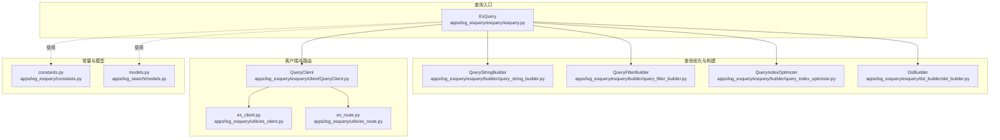
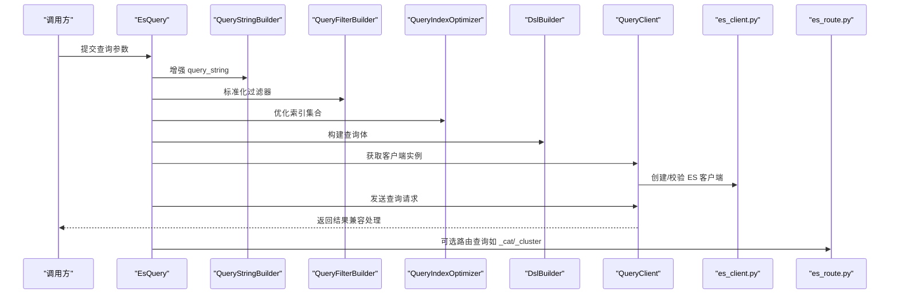
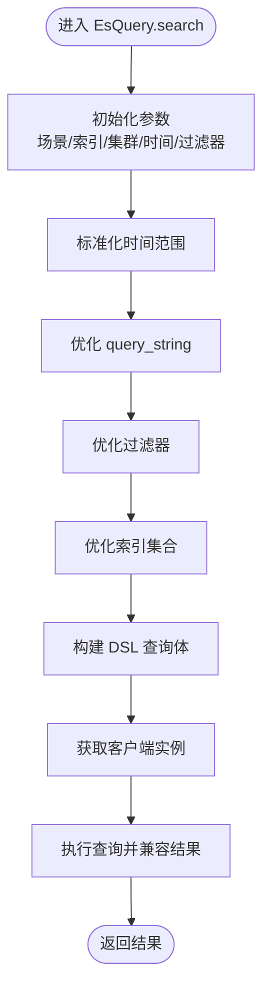
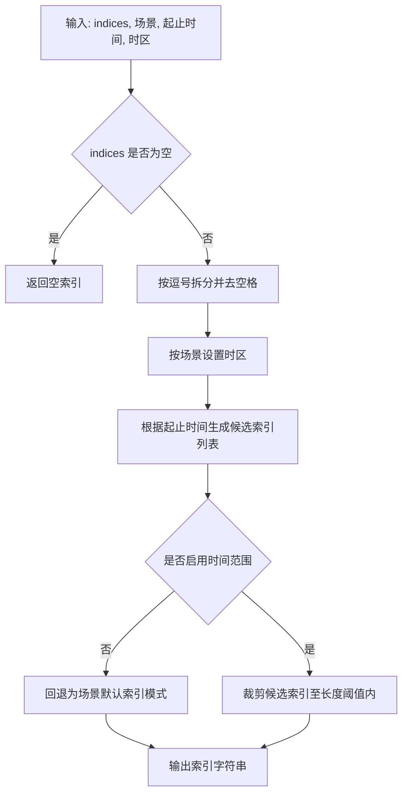
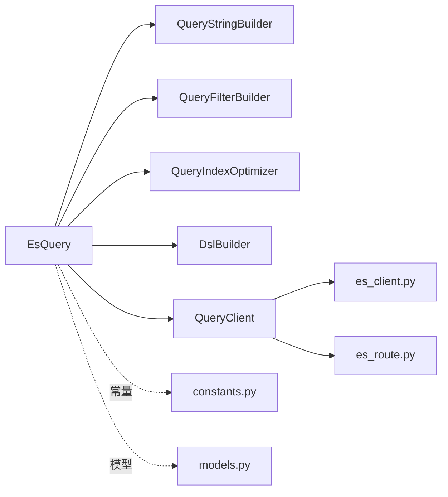

# 检索引擎

<cite>
**本文引用的文件**
- [apps/log_esquery/esquery/esquery.py](file://apps/log_esquery/esquery/esquery.py)
- [apps/log_esquery/esquery/builder/query_string_builder.py](file://apps/log_esquery/esquery/builder/query_string_builder.py)
- [apps/log_esquery/esquery/builder/query_filter_builder.py](file://apps/log_esquery/esquery/builder/query_filter_builder.py)
- [apps/log_esquery/esquery/builder/query_index_optimizer.py](file://apps/log_esquery/esquery/builder/query_index_optimizer.py)
- [apps/log_esquery/esquery/client/QueryClient.py](file://apps/log_esquery/esquery/client/QueryClient.py)
- [apps/log_esquery/utils/es_client.py](file://apps/log_esquery/utils/es_client.py)
- [apps/log_esquery/utils/es_route.py](file://apps/log_esquery/utils/es_route.py)
- [apps/log_esquery/constants.py](file://apps/log_esquery/constants.py)
- [apps/log_search/models.py](file://apps/log_search/models.py)
- [apps/log_esquery/esquery/dsl_builder/dsl_builder.py](file://apps/log_esquery/esquery/dsl_builder/dsl_builder.py)
</cite>

## 目录
1. [简介](#简介)
2. [项目结构](#项目结构)
3. [核心组件](#核心组件)
4. [架构总览](#架构总览)
5. [详细组件分析](#详细组件分析)
6. [依赖分析](#依赖分析)
7. [性能考虑](#性能考虑)
8. [故障排查指南](#故障排查指南)
9. [结论](#结论)
10. [附录](#附录)

## 简介
本技术文档面向“日志检索引擎”，聚焦于基于 Elasticsearch 的检索实现，涵盖以下主题：
- Elasticsearch 集成与连接管理
- 查询路由与索引选择策略
- 检索语法支持范围与 DSL 构建
- 查询优化策略（索引优化、查询缓存、分页与排序）
- 预查询优化机制（查询预处理、索引选择、性能监控）
- 查询性能调优最佳实践（查询模板、批量查询、异步处理）
- 具体查询示例与错误处理机制

## 项目结构
检索引擎位于 apps/log_esquery 子模块，围绕 EsQuery 核心类组织，配合 DSL 构建器、索引优化器、过滤器构建器、查询客户端与工具函数，形成完整的查询链路。

图表来源
- [apps/log_esquery/esquery/esquery.py:1-405](file://apps/log_esquery/esquery/esquery.py#L1-L405)
- [apps/log_esquery/esquery/builder/query_string_builder.py:1-54](file://apps/log_esquery/esquery/builder/query_string_builder.py#L1-L54)
- [apps/log_esquery/esquery/builder/query_filter_builder.py:1-48](file://apps/log_esquery/esquery/builder/query_filter_builder.py#L1-L48)
- [apps/log_esquery/esquery/builder/query_index_optimizer.py:1-138](file://apps/log_esquery/esquery/builder/query_index_optimizer.py#L1-L138)
- [apps/log_esquery/esquery/dsl_builder/dsl_builder.py:1-195](file://apps/log_esquery/esquery/dsl_builder/dsl_builder.py#L1-L195)
- [apps/log_esquery/esquery/client/QueryClient.py:1-53](file://apps/log_esquery/esquery/client/QueryClient.py#L1-L53)
- [apps/log_esquery/utils/es_client.py:1-123](file://apps/log_esquery/utils/es_client.py#L1-L123)
- [apps/log_esquery/utils/es_route.py:1-99](file://apps/log_esquery/utils/es_route.py#L1-L99)
- [apps/log_esquery/constants.py:1-33](file://apps/log_esquery/constants.py#L1-L33)
- [apps/log_search/models.py:191-214](file://apps/log_search/models.py#L191-L214)

章节来源
- [apps/log_esquery/esquery/esquery.py:1-405](file://apps/log_esquery/esquery/esquery.py#L1-L405)
- [apps/log_search/models.py:191-214](file://apps/log_search/models.py#L191-L214)

## 核心组件
- EsQuery：统一查询编排器，负责参数初始化、时间范围标准化、查询字符串与过滤器优化、索引选择、DSL 构建、客户端调用与结果兼容性处理。
- QueryStringBuilder：对 query_string 做 HTML 解码与特殊字符检查，自动补全通配符，确保 Lucene 语法安全。
- QueryFilterBuilder：将外部过滤条件转换为内部统一的过滤字典列表，支持字段、运算符、值、条件与类型。
- QueryIndexOptimizer：根据场景（log/bkdata/es）与时区、起止时间动态裁剪索引集合，避免跨时间范围扫描。
- DslBuilder：基于 elasticsearch-dsl 构建最终查询体，支持排序、聚合、高亮、collapse、search_after、分片切片等。
- QueryClient：按场景动态选择具体客户端（log/bkdata/es），封装连接与调用。
- es_client.py：Elasticsearch 客户端工厂与连通性探测，支持多版本适配与认证异常处理。
- es_route.py：对 ES 集群的路由查询（如 _cat、_cluster、_nodes），用于索引列表与节点统计。
- constants.py：通用常量（默认 schema、通配符模式、索引长度阈值等）。
- models.py：场景枚举（LOG/BKDATA/ES）等基础模型，供查询链路使用。

章节来源
- [apps/log_esquery/esquery/esquery.py:51-405](file://apps/log_esquery/esquery/esquery.py#L51-L405)
- [apps/log_esquery/esquery/builder/query_string_builder.py:31-54](file://apps/log_esquery/esquery/builder/query_string_builder.py#L31-L54)
- [apps/log_esquery/esquery/builder/query_filter_builder.py:26-48](file://apps/log_esquery/esquery/builder/query_filter_builder.py#L26-L48)
- [apps/log_esquery/esquery/builder/query_index_optimizer.py:33-138](file://apps/log_esquery/esquery/builder/query_index_optimizer.py#L33-L138)
- [apps/log_esquery/esquery/dsl_builder/dsl_builder.py:34-195](file://apps/log_esquery/esquery/dsl_builder/dsl_builder.py#L34-L195)
- [apps/log_esquery/esquery/client/QueryClient.py:28-53](file://apps/log_esquery/esquery/client/QueryClient.py#L28-L53)
- [apps/log_esquery/utils/es_client.py:40-123](file://apps/log_esquery/utils/es_client.py#L40-L123)
- [apps/log_esquery/utils/es_route.py:28-99](file://apps/log_esquery/utils/es_route.py#L28-L99)
- [apps/log_esquery/constants.py:22-33](file://apps/log_esquery/constants.py#L22-L33)
- [apps/log_search/models.py:191-214](file://apps/log_search/models.py#L191-L214)

## 架构总览
检索请求从 EsQuery 入口开始，依次经过查询字符串增强、过滤器标准化、索引优化、时间范围构建、DSL 构建，最终通过 QueryClient 调用具体存储后端（log/bkdata/es），并返回兼容后的结果。

图表来源
- [apps/log_esquery/esquery/esquery.py:99-224](file://apps/log_esquery/esquery/esquery.py#L99-L224)
- [apps/log_esquery/esquery/builder/query_string_builder.py:31-54](file://apps/log_esquery/esquery/builder/query_string_builder.py#L31-L54)
- [apps/log_esquery/esquery/builder/query_filter_builder.py:26-48](file://apps/log_esquery/esquery/builder/query_filter_builder.py#L26-L48)
- [apps/log_esquery/esquery/builder/query_index_optimizer.py:33-138](file://apps/log_esquery/esquery/builder/query_index_optimizer.py#L33-L138)
- [apps/log_esquery/esquery/dsl_builder/dsl_builder.py:34-195](file://apps/log_esquery/esquery/dsl_builder/dsl_builder.py#L34-L195)
- [apps/log_esquery/esquery/client/QueryClient.py:28-53](file://apps/log_esquery/esquery/client/QueryClient.py#L28-L53)
- [apps/log_esquery/utils/es_client.py:40-123](file://apps/log_esquery/utils/es_client.py#L40-L123)
- [apps/log_esquery/utils/es_route.py:28-99](file://apps/log_esquery/utils/es_route.py#L28-L99)

## 详细组件分析

### EsQuery：查询编排与优化
- 参数初始化：场景、索引、集群 ID、时间字段、时间范围、时区、是否使用时间范围等。
- 时间范围标准化：统一起止时间，支持自定义与相对时间范围。
- 查询增强：对 query_string 进行 HTML 解码与特殊字符检查，必要时自动包裹通配符。
- 过滤器优化：将外部过滤条件标准化为内部结构，便于后续 DSL 构建。
- 索引优化：根据场景与时区裁剪索引集合，避免跨时间范围扫描。
- DSL 构建：组装查询体，支持排序、聚合、高亮、collapse、search_after、分片切片等。
- 客户端调用：按场景选择客户端，发起查询并进行结果兼容处理。
- 其他能力：mapping、indices、cluster_stats、cat_indices、es_route 等辅助查询。

图表来源
- [apps/log_esquery/esquery/esquery.py:99-224](file://apps/log_esquery/esquery/esquery.py#L99-L224)

章节来源
- [apps/log_esquery/esquery/esquery.py:51-405](file://apps/log_esquery/esquery/esquery.py#L51-L405)

### QueryStringBuilder：查询语法增强
- HTML 解码：对 query_string 进行解码，避免特殊字符被转义。
- 特殊字符检查：识别 Lucene 特殊字符与布尔关键字，若未显式使用则自动包裹通配符，提升易用性。
- 默认模式：空字符串时采用通配符模式，保证查询有效性。

章节来源
- [apps/log_esquery/esquery/builder/query_string_builder.py:31-54](file://apps/log_esquery/esquery/builder/query_string_builder.py#L31-L54)
- [apps/log_esquery/constants.py:26-30](file://apps/log_esquery/constants.py#L26-L30)

### QueryFilterBuilder：过滤器标准化
- 输入：外部过滤条件列表（字段、运算符、值、条件、类型）。
- 输出：内部统一的过滤字典列表，便于 DSL 构建器直接消费。
- 支持：and/or 条件、字段类型过滤等。

章节来源
- [apps/log_esquery/esquery/builder/query_filter_builder.py:26-48](file://apps/log_esquery/esquery/builder/query_filter_builder.py#L26-L48)

### QueryIndexOptimizer：索引优化与时间裁剪
- 场景适配：LOG/BKDATA/ES 场景下采用不同的索引命名与时间格式。
- 时区处理：LOG 使用 GMT，BKDATA 使用本地时区；支持自定义时区。
- 时间范围裁剪：按日/月粒度生成候选索引，避免超长索引列表。
- 默认回退：当未启用时间范围或无匹配索引时，按场景拼接通配符索引。
- 字符替换：LOG 场景下将点号替换为下划线，适配索引命名规范。

图表来源
- [apps/log_esquery/esquery/builder/query_index_optimizer.py:33-138](file://apps/log_esquery/esquery/builder/query_index_optimizer.py#L33-L138)
- [apps/log_esquery/constants.py:32](file://apps/log_esquery/constants.py#L32)

章节来源
- [apps/log_esquery/esquery/builder/query_index_optimizer.py:33-138](file://apps/log_esquery/esquery/builder/query_index_optimizer.py#L33-L138)

### DslBuilder：DSL 构建与高级特性
- 查询体组装：基于 elasticsearch-dsl 构建 query、from/size、sort、collapse、aggregations、highlight 等。
- 时间范围：可选禁用时间范围，支持 range 查询。
- 高亮：仅在存在查询或过滤时启用高亮，避免无效开销。
- search_after：支持基于游标的深度分页，替代 from+size。
- 分片切片：支持按时间字段切片并行查询，提升大结果集吞吐。
- 特殊字符检测：辅助判断是否需要特殊处理的查询字符串。

章节来源
- [apps/log_esquery/esquery/dsl_builder/dsl_builder.py:34-195](file://apps/log_esquery/esquery/dsl_builder/dsl_builder.py#L34-L195)

### QueryClient：场景化客户端选择
- 映射：LOG → QueryClientLog，BKDATA → QueryClientBkData，ES → QueryClientEs。
- 参数传递：LOG/ES 场景传递存储集群 ID；BKDATA 场景传递认证方法与数据令牌。
- 动态导入：通过模块路径动态加载具体客户端实现。

章节来源
- [apps/log_esquery/esquery/client/QueryClient.py:28-53](file://apps/log_esquery/esquery/client/QueryClient.py#L28-L53)

### es_client.py：Elasticsearch 客户端工厂与连通性
- 多版本适配：根据版本前缀选择 elasticsearch5/elasticsearch6/elasticsearch。
- IPv6 支持：对 IPv6 地址自动加方括号。
- 认证与连通性：支持 HTTP Basic 认证、socket ping、HEAD 请求探测。
- 异常处理：认证异常、网络不可达、ES 不存活等统一异常封装。

章节来源
- [apps/log_esquery/utils/es_client.py:40-123](file://apps/log_esquery/utils/es_client.py#L40-L123)

### es_route.py：ES 路由查询
- 场景适配：BKDATA 场景下走后端接口代理；LOG/ES 场景直接调用 ES 路由。
- 索引过滤：LOG 场景下按索引集命名规则过滤 _cat/indices 结果。
- 常用路由：_cat/indices、_cluster/stats、_nodes/stats 等。

章节来源
- [apps/log_esquery/utils/es_route.py:28-99](file://apps/log_esquery/utils/es_route.py#L28-L99)

### constants.py：常量定义
- 默认 schema、通配符模式、空查询默认体、索引长度阈值等。

章节来源
- [apps/log_esquery/constants.py:22-33](file://apps/log_esquery/constants.py#L22-L33)

### models.py：场景与索引集模型
- 场景枚举：LOG/BKDATA/ES。
- 索引集：包含时间字段、时间字段类型/单位、存储集群 ID、索引列表等元信息。
- 预查询：索引集支持预查询校验与消息记录，便于性能监控与问题定位。

章节来源
- [apps/log_search/models.py:191-214](file://apps/log_search/models.py#L191-L214)
- [apps/log_search/models.py:337-423](file://apps/log_search/models.py#L337-L423)

## 依赖分析
- 组件耦合
  - EsQuery 作为编排器，依赖多个构建器与工具模块，耦合度适中，职责清晰。
  - QueryClient 通过场景映射解耦具体实现，利于扩展新场景。
- 外部依赖
  - elasticsearch、elasticsearch5、elasticsearch6：多版本客户端适配。
  - elasticsearch-dsl：DSL 构建与查询体生成。
  - dateutil、arrow：时间范围与时区处理。
- 循环依赖
  - 未发现循环依赖迹象，模块间通过接口与常量交互。

图表来源
- [apps/log_esquery/esquery/esquery.py:51-405](file://apps/log_esquery/esquery/esquery.py#L51-L405)
- [apps/log_esquery/esquery/client/QueryClient.py:28-53](file://apps/log_esquery/esquery/client/QueryClient.py#L28-L53)
- [apps/log_esquery/utils/es_client.py:40-123](file://apps/log_esquery/utils/es_client.py#L40-L123)
- [apps/log_esquery/utils/es_route.py:28-99](file://apps/log_esquery/utils/es_route.py#L28-L99)
- [apps/log_esquery/constants.py:22-33](file://apps/log_esquery/constants.py#L22-L33)
- [apps/log_search/models.py:191-214](file://apps/log_search/models.py#L191-L214)

## 性能考虑
- 索引优化
  - 通过 QueryIndexOptimizer 按日/月粒度裁剪索引，减少扫描范围。
  - LOG/BKDATA 场景下按 GMT/本地时区与命名规范生成索引，避免全量扫描。
- 查询缓存
  - 索引集字段快照：通过索引集模型的字段快照机制，降低频繁字段查询成本。
- 分页与排序
  - search_after：适用于深度分页，避免 deep pagination 的性能问题。
  - 排序需结合预查询与索引选择，避免无谓的跨索引排序。
- 聚合与高亮
  - 仅在必要时启用高亮；聚合按需设计，避免过度聚合导致内存压力。
- 并行与切片
  - 分片切片（slice_search）可提升大结果集吞吐，但需合理设置切片数量与时间字段。
- 连接与路由
  - es_client.py 提供连通性探测与认证异常处理，避免无效重试与错误传播。
  - es_route.py 提供路由查询，辅助诊断集群状态与索引分布。

章节来源
- [apps/log_esquery/esquery/builder/query_index_optimizer.py:76-138](file://apps/log_esquery/esquery/builder/query_index_optimizer.py#L76-L138)
- [apps/log_esquery/esquery/dsl_builder/dsl_builder.py:128-148](file://apps/log_esquery/esquery/dsl_builder/dsl_builder.py#L128-L148)
- [apps/log_search/models.py:636-653](file://apps/log_search/models.py#L636-L653)
- [apps/log_esquery/utils/es_client.py:80-123](file://apps/log_esquery/utils/es_client.py#L80-L123)
- [apps/log_esquery/utils/es_route.py:28-99](file://apps/log_esquery/utils/es_route.py#L28-L99)

## 故障排查指南
- 认证异常
  - es_client.py 捕获认证异常并抛出自定义异常，检查用户名/密码与证书配置。
- 网络不可达
  - socket ping 与 HEAD 请求探测失败时，检查主机/端口与网络策略。
- ES 不存活
  - HEAD 请求返回失败时，确认 ES 集群健康状态与服务端口。
- 场景不支持
  - 某些操作在 BKDATA 场景下不支持（如 scroll），需切换场景或调整查询方式。
- 索引查询失败
  - BKDATA 场景下需提供业务 ID；否则抛出查询失败异常。
- 结果兼容
  - 不同 ES 版本 Total 字段结构差异，统一兼容处理。

章节来源
- [apps/log_esquery/utils/es_client.py:80-123](file://apps/log_esquery/utils/es_client.py#L80-L123)
- [apps/log_esquery/esquery/esquery.py:226-246](file://apps/log_esquery/esquery/esquery.py#L226-L246)
- [apps/log_esquery/esquery/esquery.py:318-321](file://apps/log_esquery/esquery/esquery.py#L318-L321)
- [apps/log_esquery/esquery/esquery.py:143-147](file://apps/log_esquery/esquery/esquery.py#L143-L147)

## 结论
该检索引擎以 EsQuery 为核心，结合查询字符串增强、过滤器标准化、索引优化与 DSL 构建，实现了对 Elasticsearch 的高效集成。通过场景化客户端、连通性探测与路由查询，保障了查询稳定性与可观测性。配合预查询与字段快照机制，进一步提升了查询性能与用户体验。建议在生产环境中优先采用索引优化、search_after 分页、分片切片与必要的查询缓存策略，并持续监控索引分布与查询耗时，以实现稳定高效的日志检索能力。

## 附录

### 检索语法支持范围
- 全文检索
  - 通过 QueryStringBuilder 自动包裹通配符，支持模糊匹配。
  - 也可显式使用 Lucene 特殊字符与布尔关键字。
- 字段精确匹配
  - 通过 QueryFilterBuilder 的字段/值/运算符组合实现。
- 通配符查询
  - 默认通配符模式与显式通配符均可使用。
- 正则表达式
  - Lucene 支持正则表达式，需注意性能影响。
- 布尔逻辑组合
  - 支持 AND/OR/NOT/TO 等关键字与括号组合。

章节来源
- [apps/log_esquery/esquery/builder/query_string_builder.py:31-54](file://apps/log_esquery/esquery/builder/query_string_builder.py#L31-L54)
- [apps/log_esquery/esquery/builder/query_filter_builder.py:26-48](file://apps/log_esquery/esquery/builder/query_filter_builder.py#L26-L48)
- [apps/log_esquery/constants.py:26-30](file://apps/log_esquery/constants.py#L26-L30)

### 查询优化策略
- 索引优化：按日/月裁剪索引，避免全量扫描。
- 查询缓存：索引集字段快照与预查询校验。
- 分页处理：search_after 替代 deep pagination。
- 结果排序：结合索引选择与时间范围，避免跨索引排序。

章节来源
- [apps/log_esquery/esquery/builder/query_index_optimizer.py:76-138](file://apps/log_esquery/esquery/builder/query_index_optimizer.py#L76-L138)
- [apps/log_search/models.py:636-653](file://apps/log_search/models.py#L636-L653)
- [apps/log_esquery/esquery/dsl_builder/dsl_builder.py:128-148](file://apps/log_esquery/esquery/dsl_builder/dsl_builder.py#L128-L148)

### 预查询优化机制
- 查询预处理：EnhanceLuceneAdapter 增强 query_string。
- 索引选择：QueryIndexOptimizer 在时间范围内选择最优索引集合。
- 性能监控：索引集预查询标记与消息记录，便于问题定位。

章节来源
- [apps/log_esquery/esquery/esquery.py:57-61](file://apps/log_esquery/esquery/esquery.py#L57-L61)
- [apps/log_esquery/esquery/builder/query_index_optimizer.py:76-138](file://apps/log_esquery/esquery/builder/query_index_optimizer.py#L76-L138)
- [apps/log_search/models.py:360-363](file://apps/log_search/models.py#L360-L363)

### 查询性能调优最佳实践
- 查询模板：固定常用过滤与排序，减少动态拼装。
- 批量查询：合并相似查询，利用索引优化减少扫描。
- 异步处理：对长耗时查询采用异步任务与分页拉取。
- 分片切片：对大结果集启用切片并行查询。
- 高亮与聚合：按需启用，避免不必要的计算。

章节来源
- [apps/log_esquery/esquery/dsl_builder/dsl_builder.py:128-148](file://apps/log_esquery/esquery/dsl_builder/dsl_builder.py#L128-L148)
- [apps/log_search/models.py:386-395](file://apps/log_search/models.py#L386-L395)

### 具体查询示例（路径指引）
- 全文检索示例：参考 [apps/log_esquery/esquery/builder/query_string_builder.py:31-54](file://apps/log_esquery/esquery/builder/query_string_builder.py#L31-L54)
- 字段精确匹配示例：参考 [apps/log_esquery/esquery/builder/query_filter_builder.py:26-48](file://apps/log_esquery/esquery/builder/query_filter_builder.py#L26-L48)
- 索引优化示例：参考 [apps/log_esquery/esquery/builder/query_index_optimizer.py:76-138](file://apps/log_esquery/esquery/builder/query_index_optimizer.py#L76-L138)
- DSL 构建示例：参考 [apps/log_esquery/esquery/dsl_builder/dsl_builder.py:34-195](file://apps/log_esquery/esquery/dsl_builder/dsl_builder.py#L34-L195)
- 客户端调用示例：参考 [apps/log_esquery/esquery/client/QueryClient.py:28-53](file://apps/log_esquery/esquery/client/QueryClient.py#L28-L53)
- 路由查询示例：参考 [apps/log_esquery/utils/es_route.py:28-99](file://apps/log_esquery/utils/es_route.py#L28-L99)