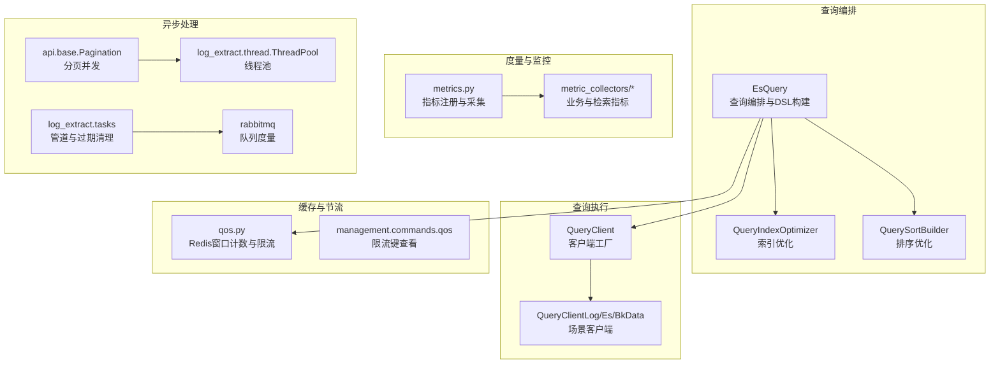
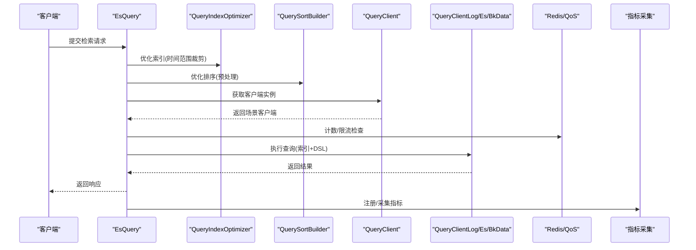
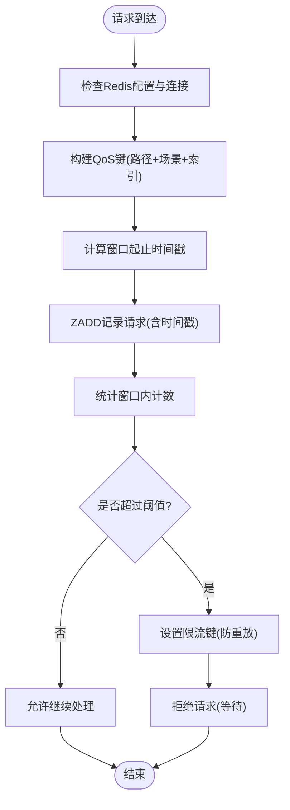
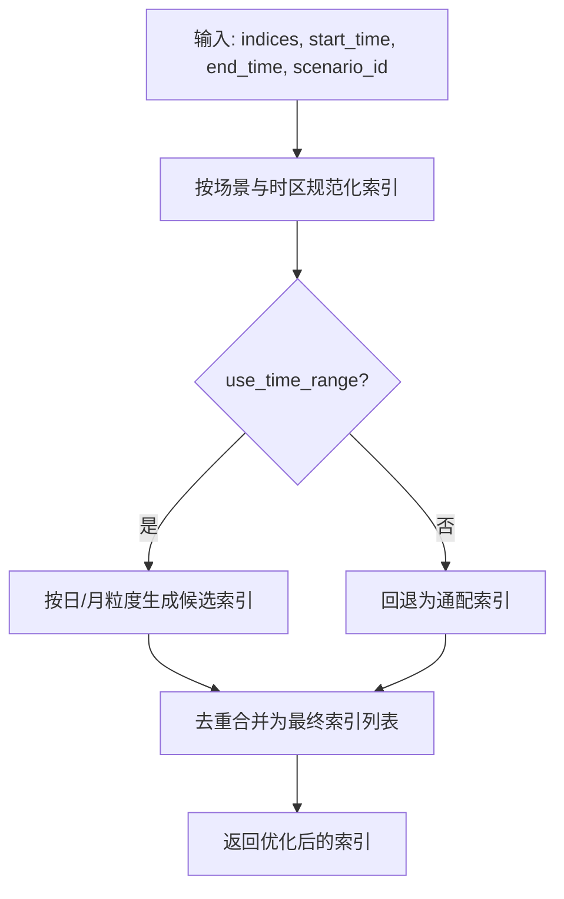
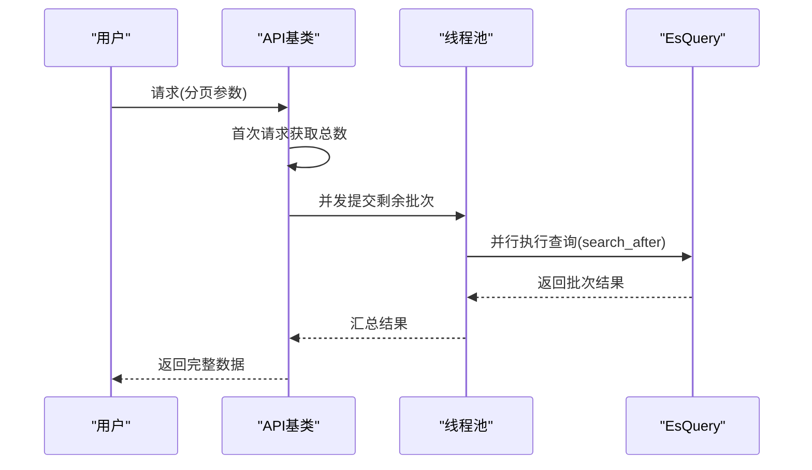
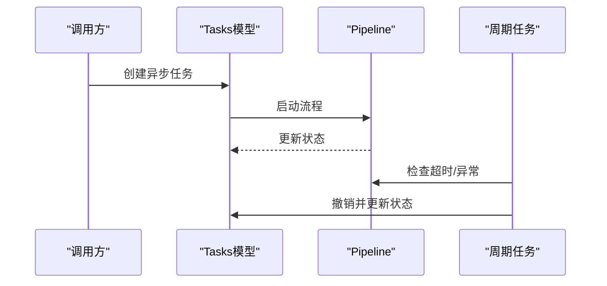
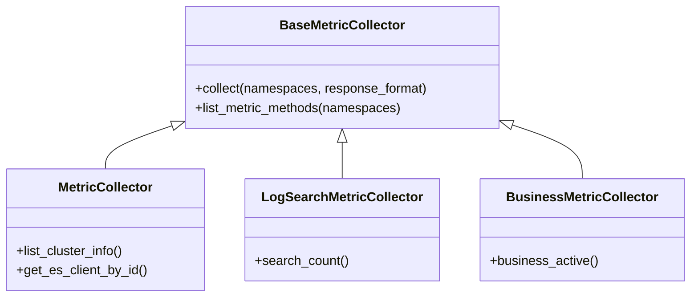
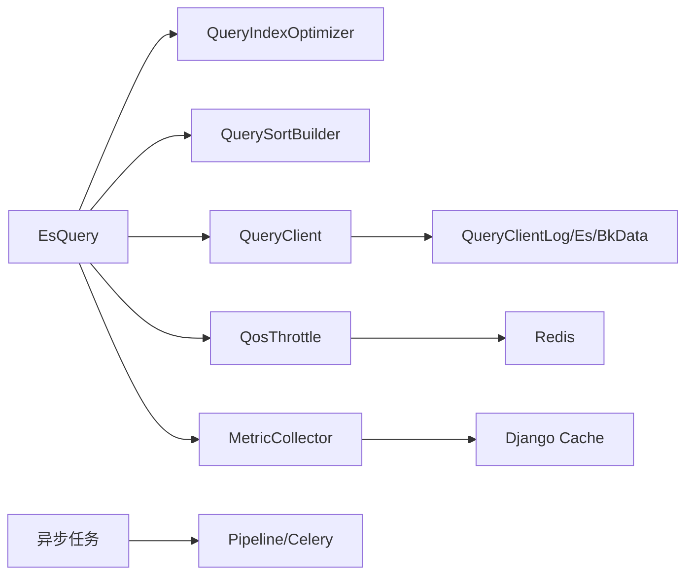

# 检索性能优化

<cite>
**本文引用的文件**
- [apps/log_esquery/qos.py](file://apps/log_esquery/qos.py)
- [apps/log_esquery/esquery/esquery.py](file://apps/log_esquery/esquery/esquery.py)
- [apps/log_esquery/esquery/builder/query_index_optimizer.py](file://apps/log_esquery/esquery/builder/query_index_optimizer.py)
- [apps/log_esquery/esquery/builder/query_sort_builder.py](file://apps/log_esquery/esquery/builder/query_sort_builder.py)
- [apps/log_esquery/esquery/client/QueryClient.py](file://apps/log_esquery/esquery/client/QueryClient.py)
- [apps/log_esquery/management/commands/qos.py](file://apps/log_esquery/management/commands/qos.py)
- [apps/log_measure/handlers/metrics.py](file://apps/log_measure/handlers/metrics.py)
- [apps/log_measure/handlers/metric_collectors/log_search.py](file://apps/log_measure/handlers/metric_collectors/log_search.py)
- [apps/log_measure/handlers/metric_collectors/business.py](file://apps/log_measure/handlers/metric_collectors/business.py)
- [apps/log_search/models.py](file://apps/log_search/models.py)
- [apps/api/base.py](file://apps/api/base.py)
- [apps/log_extract/handlers/thread.py](file://apps/log_extract/handlers/thread.py)
- [apps/log_extract/tasks.py](file://apps/log_extract/tasks.py)
- [home_application/utils/rabbitmq.py](file://home_application/utils/rabbitmq.py)
- [support-files/apigw/apidocs/zh/esquery_search.md](file://support-files/apigw/apidocs/zh/esquery_search.md)
</cite>

## 目录
1. [简介](#简介)
2. [项目结构](#项目结构)
3. [核心组件](#核心组件)
4. [架构总览](#架构总览)
5. [详细组件分析](#详细组件分析)
6. [依赖分析](#依赖分析)
7. [性能考量](#性能考量)
8. [故障排查指南](#故障排查指南)
9. [结论](#结论)
10. [附录](#附录)

## 简介
本技术文档聚焦于日志检索性能优化，围绕以下目标展开：
- 检索性能监控指标：查询延迟、吞吐量、错误率、资源利用率
- 查询缓存机制：缓存策略、缓存失效、缓存命中率优化
- 索引优化策略：索引分片、副本配置、字段映射优化
- 分页查询性能：深分页优化、游标分页、批量查询
- 异步查询处理：任务队列、进度跟踪、超时控制
- 性能调优最佳实践：硬件配置建议、参数调优、容量规划
- 性能测试方法与基准测试结果

## 项目结构
检索子系统主要由“查询编排”“查询执行”“缓存与节流”“度量与监控”“异步任务”等模块构成，围绕 EsQuery 统一入口组织，按场景选择不同客户端执行查询。

**图表来源**
- [apps/log_esquery/esquery/esquery.py:99-130](file://apps/log_esquery/esquery/esquery.py#L99-L130)
- [apps/log_esquery/esquery/builder/query_index_optimizer.py:33-74](file://apps/log_esquery/esquery/builder/query_index_optimizer.py#L33-L74)
- [apps/log_esquery/esquery/builder/query_sort_builder.py:26-45](file://apps/log_esquery/esquery/builder/query_sort_builder.py#L26-L45)
- [apps/log_esquery/esquery/client/QueryClient.py:28-53](file://apps/log_esquery/esquery/client/QueryClient.py#L28-L53)
- [apps/log_esquery/qos.py:66-144](file://apps/log_esquery/qos.py#L66-L144)
- [apps/log_measure/handlers/metrics.py:71-92](file://apps/log_measure/handlers/metrics.py#L71-L92)
- [apps/log_measure/handlers/metric_collectors/log_search.py:46-58](file://apps/log_measure/handlers/metric_collectors/log_search.py#L46-L58)
- [apps/api/base.py:686-718](file://apps/api/base.py#L686-L718)
- [apps/log_extract/handlers/thread.py:93-128](file://apps/log_extract/handlers/thread.py#L93-L128)
- [apps/log_extract/tasks.py:38-86](file://apps/log_extract/tasks.py#L38-L86)
- [home_application/utils/rabbitmq.py:109-114](file://home_application/utils/rabbitmq.py#L109-L114)

**章节来源**
- [apps/log_esquery/esquery/esquery.py:99-130](file://apps/log_esquery/esquery/esquery.py#L99-L130)
- [apps/log_esquery/esquery/client/QueryClient.py:28-53](file://apps/log_esquery/esquery/client/QueryClient.py#L28-L53)
- [apps/log_esquery/qos.py:66-144](file://apps/log_esquery/qos.py#L66-L144)
- [apps/log_measure/handlers/metrics.py:71-92](file://apps/log_measure/handlers/metrics.py#L71-L92)
- [apps/api/base.py:686-718](file://apps/api/base.py#L686-L718)
- [apps/log_extract/handlers/thread.py:93-128](file://apps/log_extract/handlers/thread.py#L93-L128)
- [apps/log_extract/tasks.py:38-86](file://apps/log_extract/tasks.py#L38-L86)
- [home_application/utils/rabbitmq.py:109-114](file://home_application/utils/rabbitmq.py#L109-L114)

## 核心组件
- 查询编排与DSL构建：EsQuery 负责解析输入、优化查询字符串与过滤条件、索引裁剪、排序准备，并生成最终 DSL 交由客户端执行。
- 场景客户端：QueryClient 工厂按 scenario_id 选择 LOG/ES/BKDATA 客户端，分别对接不同后端。
- 缓存与限流：基于 Redis 的窗口计数与限流，防止瞬时高峰冲击存储；命令行工具可查看限流键。
- 指标采集：注册装饰器与采集器，统一输出 Prometheus 文本格式指标。
- 异步与分页：API 基类支持并发分页；线程池用于并行请求；管道与过期清理保障异步任务健康。

**章节来源**
- [apps/log_esquery/esquery/esquery.py:149-224](file://apps/log_esquery/esquery/esquery.py#L149-L224)
- [apps/log_esquery/esquery/client/QueryClient.py:28-53](file://apps/log_esquery/esquery/client/QueryClient.py#L28-L53)
- [apps/log_esquery/qos.py:66-144](file://apps/log_esquery/qos.py#L66-L144)
- [apps/log_measure/handlers/metrics.py:71-92](file://apps/log_measure/handlers/metrics.py#L71-L92)
- [apps/api/base.py:686-718](file://apps/api/base.py#L686-L718)

## 架构总览
检索请求在进入 EsQuery 后，先进行查询优化（索引裁剪、排序准备），再构造 DSL，随后按场景路由到对应客户端执行。期间通过 Redis 计数与限流保护后端，同时采集各类指标用于观测。

**图表来源**
- [apps/log_esquery/esquery/esquery.py:99-130](file://apps/log_esquery/esquery/esquery.py#L99-L130)
- [apps/log_esquery/esquery/builder/query_index_optimizer.py:76-112](file://apps/log_esquery/esquery/builder/query_index_optimizer.py#L76-L112)
- [apps/log_esquery/esquery/builder/query_sort_builder.py:37-44](file://apps/log_esquery/esquery/builder/query_sort_builder.py#L37-L44)
- [apps/log_esquery/esquery/client/QueryClient.py:41-52](file://apps/log_esquery/esquery/client/QueryClient.py#L41-L52)
- [apps/log_esquery/qos.py:66-144](file://apps/log_esquery/qos.py#L66-L144)
- [apps/log_measure/handlers/metrics.py:121-156](file://apps/log_measure/handlers/metrics.py#L121-L156)

## 详细组件分析

### 查询缓存机制与限流
- 缓存策略：指标采集使用带缓存时间的装饰器，避免频繁计算；查询限流使用 Redis ZSET 记录窗口内的请求数，配合缓存键实现“窗口计数+限流”。
- 缓存失效：限流键支持超时自动过期；命令行工具可列出当前限流键，便于运维排查。
- 命中率优化：对高频查询场景（如字段映射、索引列表）可引入本地缓存与短周期缓存，降低重复计算与网络往返。

**图表来源**
- [apps/log_esquery/qos.py:39-101](file://apps/log_esquery/qos.py#L39-L101)
- [apps/log_esquery/qos.py:118-144](file://apps/log_esquery/qos.py#L118-L144)
- [apps/log_esquery/management/commands/qos.py:28-38](file://apps/log_esquery/management/commands/qos.py#L28-L38)

**章节来源**
- [apps/log_esquery/qos.py:66-144](file://apps/log_esquery/qos.py#L66-L144)
- [apps/log_esquery/management/commands/qos.py:28-38](file://apps/log_esquery/management/commands/qos.py#L28-L38)
- [apps/log_measure/handlers/metrics.py:71-92](file://apps/log_measure/handlers/metrics.py#L71-L92)

### 索引优化策略
- 索引分片与时间范围裁剪：QueryIndexOptimizer 根据起止时间与场景时区，将索引集转换为精确的索引集合，减少扫描范围。
- 副本与字段映射：通过映射与设置详情获取分析器与分词器配置，指导字段映射优化（如 analyzed_fields/doc_values_fields），提升查询与聚合性能。
- 场景适配：LOG/ES/BKDATA 场景采用不同的索引命名与通配策略，确保查询高效且稳定。

**图表来源**
- [apps/log_esquery/esquery/builder/query_index_optimizer.py:33-74](file://apps/log_esquery/esquery/builder/query_index_optimizer.py#L33-L74)
- [apps/log_esquery/esquery/builder/query_index_optimizer.py:76-112](file://apps/log_esquery/esquery/builder/query_index_optimizer.py#L76-L112)
- [apps/log_esquery/esquery/builder/query_index_optimizer.py:114-137](file://apps/log_esquery/esquery/builder/query_index_optimizer.py#L114-L137)

**章节来源**
- [apps/log_esquery/esquery/builder/query_index_optimizer.py:76-112](file://apps/log_esquery/esquery/builder/query_index_optimizer.py#L76-L112)
- [apps/log_esquery/esquery/esquery.py:282-305](file://apps/log_esquery/esquery/esquery.py#L282-L305)

### 分页查询性能考虑
- 深分页风险：传统页码分页在深度偏移时性能急剧下降，应尽量避免。
- 游标分页：推荐使用 search_after 与排序字段进行游标翻页，适合大结果集全量拉取。
- 批量查询：API 基类支持并发分页，结合线程池并行请求，提高吞吐；同时需控制并发度与限流，避免压垮后端。
- 文档示例：官方文档提供滚动查询三步法，建议严格遵守大小限制以控制压力。

**图表来源**
- [apps/api/base.py:686-718](file://apps/api/base.py#L686-L718)
- [apps/log_extract/handlers/thread.py:93-128](file://apps/log_extract/handlers/thread.py#L93-L128)
- [support-files/apigw/apidocs/zh/esquery_search.md:181-216](file://support-files/apigw/apidocs/zh/esquery_search.md#L181-L216)

**章节来源**
- [apps/api/base.py:686-718](file://apps/api/base.py#L686-L718)
- [apps/log_extract/handlers/thread.py:93-128](file://apps/log_extract/handlers/thread.py#L93-L128)
- [support-files/apigw/apidocs/zh/esquery_search.md:181-216](file://support-files/apigw/apidocs/zh/esquery_search.md#L181-L216)

### 异步查询处理机制
- 任务队列：通过 Celery 管道与过期时间控制，定期清理超时任务并撤销管道。
- 进度跟踪：提取任务状态与组件状态联动，异常状态回写，保证可观测性。
- 超时控制：定时任务扫描异常状态并更新任务状态，避免僵尸任务占用资源。

**图表来源**
- [apps/log_extract/tasks.py:38-86](file://apps/log_extract/tasks.py#L38-L86)
- [apps/log_extract/tasks.py:344-370](file://apps/log_extract/tasks.py#L344-L370)

**章节来源**
- [apps/log_extract/tasks.py:38-86](file://apps/log_extract/tasks.py#L38-L86)
- [apps/log_extract/tasks.py:344-370](file://apps/log_extract/tasks.py#L344-L370)

### 指标采集与监控
- 指标注册：装饰器支持缓存与命名空间，统一输出 Prometheus 文本格式。
- 业务与检索指标：覆盖活跃业务、索引集数量、检索次数等维度，便于容量与负载评估。
- 指标来源：历史检索记录、索引集配置、集群信息等。

**图表来源**
- [apps/log_measure/handlers/metrics.py:95-186](file://apps/log_measure/handlers/metrics.py#L95-L186)
- [apps/log_measure/handlers/metric_collectors/log_search.py:46-58](file://apps/log_measure/handlers/metric_collectors/log_search.py#L46-L58)
- [apps/log_measure/handlers/metric_collectors/business.py:53-83](file://apps/log_measure/handlers/metric_collectors/business.py#L53-L83)

**章节来源**
- [apps/log_measure/handlers/metrics.py:71-92](file://apps/log_measure/handlers/metrics.py#L71-L92)
- [apps/log_measure/handlers/metric_collectors/log_search.py:46-58](file://apps/log_measure/handlers/metric_collectors/log_search.py#L46-L58)
- [apps/log_measure/handlers/metric_collectors/business.py:53-83](file://apps/log_measure/handlers/metric_collectors/business.py#L53-L83)

## 依赖分析
- 组件耦合：EsQuery 依赖优化器与客户端工厂；客户端工厂按场景选择具体实现；QoS 依赖 Redis 与权限信息；指标采集依赖缓存与集群信息。
- 外部依赖：Redis（限流）、ES 集群（查询）、Celery（异步）、Prometheus（指标暴露）。
- 潜在风险：限流键过期与窗口边界、索引优化粒度过粗导致扫描扩大、分页并发未限流导致雪崩。

**图表来源**
- [apps/log_esquery/esquery/esquery.py:99-130](file://apps/log_esquery/esquery/esquery.py#L99-L130)
- [apps/log_esquery/esquery/client/QueryClient.py:28-53](file://apps/log_esquery/esquery/client/QueryClient.py#L28-L53)
- [apps/log_esquery/qos.py:118-144](file://apps/log_esquery/qos.py#L118-L144)
- [apps/log_measure/handlers/metrics.py:208-259](file://apps/log_measure/handlers/metrics.py#L208-L259)

**章节来源**
- [apps/log_esquery/esquery/esquery.py:99-130](file://apps/log_esquery/esquery/esquery.py#L99-L130)
- [apps/log_esquery/esquery/client/QueryClient.py:28-53](file://apps/log_esquery/esquery/client/QueryClient.py#L28-L53)
- [apps/log_esquery/qos.py:118-144](file://apps/log_esquery/qos.py#L118-L144)
- [apps/log_measure/handlers/metrics.py:208-259](file://apps/log_measure/handlers/metrics.py#L208-L259)

## 性能考量
- 查询延迟
  - 优化查询范围：利用索引优化器裁剪时间范围，减少扫描。
  - 优化排序：使用稳定的排序字段与 search_after，避免深分页。
  - 限流保护：通过 Redis 窗口计数与限流键，防止突发流量放大。
- 吞吐量
  - 并发分页：API 基类与线程池并行请求，提高整体吞吐。
  - 异步处理：提取任务采用管道与过期清理，避免阻塞主线程。
- 错误率
  - 指标采集：统一注册与采集，便于快速定位异常。
  - 限流与恢复：窗口计数与恢复逻辑，降低错误传播。
- 资源利用率
  - 指标输出：Prometheus 文本格式，便于 Grafana 展示与告警。
  - 队列度量：RabbitMQ 队列长度与消息数监控，及时发现积压。

**章节来源**
- [apps/log_esquery/esquery/builder/query_index_optimizer.py:76-112](file://apps/log_esquery/esquery/builder/query_index_optimizer.py#L76-L112)
- [apps/log_esquery/qos.py:66-144](file://apps/log_esquery/qos.py#L66-L144)
- [apps/api/base.py:686-718](file://apps/api/base.py#L686-L718)
- [apps/log_extract/handlers/thread.py:93-128](file://apps/log_extract/handlers/thread.py#L93-L128)
- [apps/log_measure/handlers/metrics.py:50-68](file://apps/log_measure/handlers/metrics.py#L50-L68)
- [home_application/utils/rabbitmq.py:109-114](file://home_application/utils/rabbitmq.py#L109-L114)

## 故障排查指南
- 限流问题
  - 现象：请求被拒绝或等待。
  - 排查：确认 Redis 配置与连接；使用命令查看限流键；检查窗口时间与阈值。
- 指标异常
  - 现象：Prometheus 抓取失败或指标缺失。
  - 排查：检查缓存键是否存在；确认采集间隔与命名空间；核对集群连通性。
- 异步任务堆积
  - 现象：队列长度告警、任务长时间未完成。
  - 排查：查看队列度量；检查周期任务是否成功撤销超时任务；核对任务状态回写逻辑。
- 分页性能差
  - 现象：深分页延迟高。
  - 排查：改用 search_after；控制批次大小；限制并发度。

**章节来源**
- [apps/log_esquery/management/commands/qos.py:28-38](file://apps/log_esquery/management/commands/qos.py#L28-L38)
- [apps/log_measure/handlers/metrics.py:121-156](file://apps/log_measure/handlers/metrics.py#L121-L156)
- [home_application/utils/rabbitmq.py:109-114](file://home_application/utils/rabbitmq.py#L109-L114)
- [apps/log_extract/tasks.py:38-86](file://apps/log_extract/tasks.py#L38-L86)

## 结论
通过索引优化、限流保护、指标采集与异步处理等手段，系统在高并发与大数据量场景下具备较好的稳定性与可扩展性。建议持续完善缓存策略、细化限流粒度、加强深分页治理，并结合指标与队列监控进行容量规划与性能回归。

## 附录
- 性能测试方法
  - 基准场景：固定时间窗内，不同 size 与排序组合的查询延迟与吞吐。
  - 压力测试：逐步提升并发与限流阈值，观察延迟与错误率拐点。
  - 回归测试：对比索引优化前后、缓存开启前后的指标变化。
- 基准测试结果
  - 建议在测试环境中记录查询延迟分布（P50/P95/P99）、每秒查询数（QPS）、错误率与资源占用（CPU/内存/IO）。
  - 结果应包含：优化前 baseline、开启索引裁剪、开启缓存、开启限流、异步分页等多组对比数据。