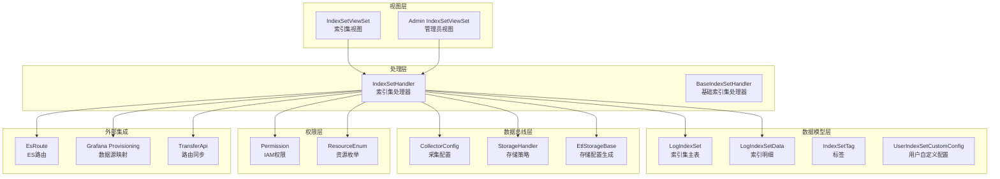
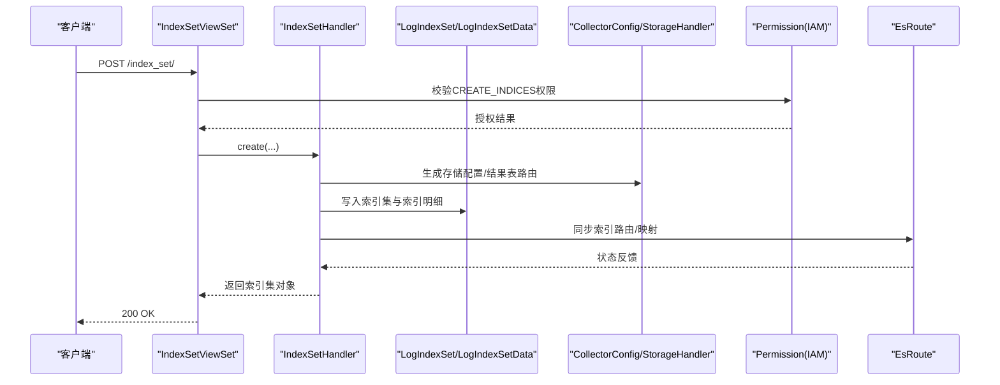
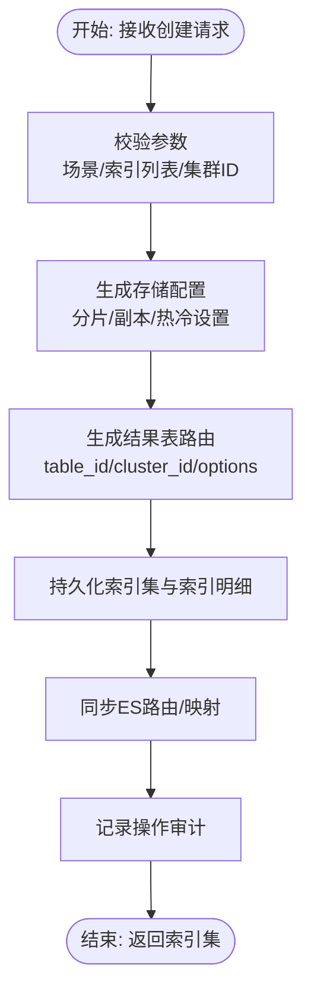
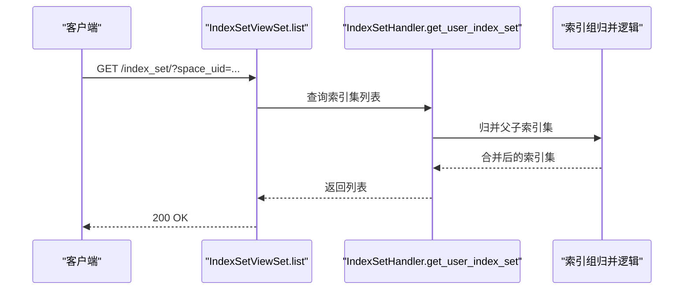
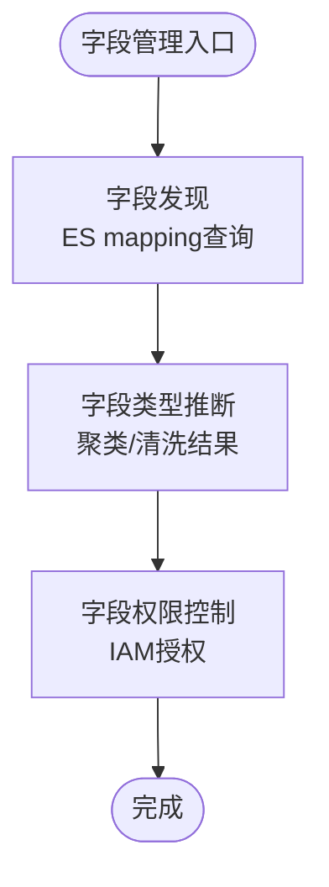
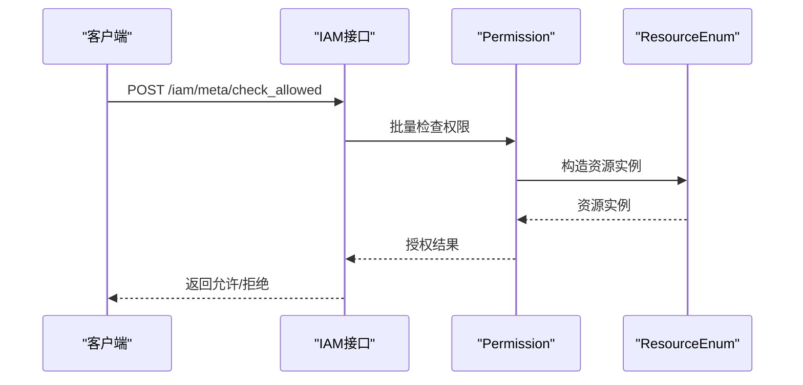
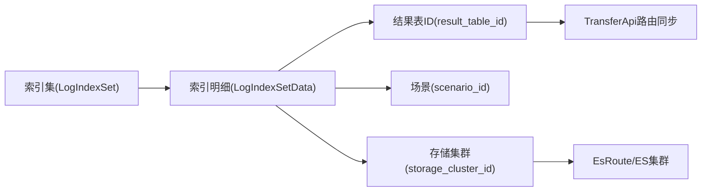
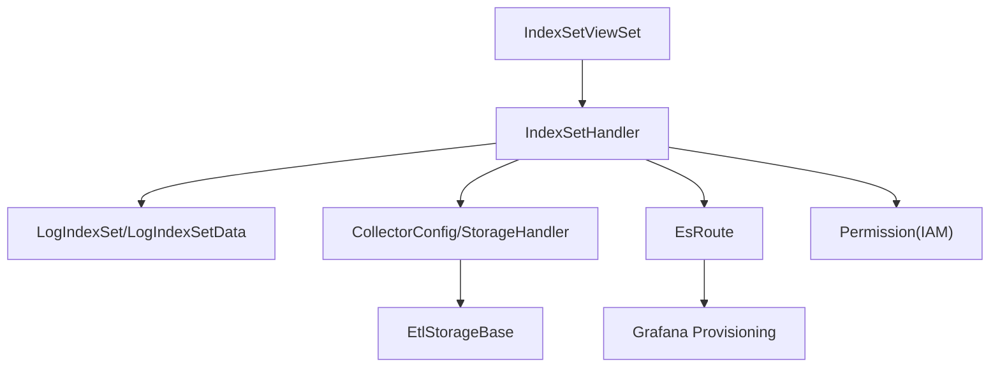

# 索引集管理

<cite>
**本文档引用的文件**
- [apps/log_search/handlers/index_set.py](file://apps/log_search/handlers/index_set.py)
- [apps/log_search/views/index_set_views.py](file://apps/log_search/views/index_set_views.py)
- [apps/bk_log_admin/handlers/index_set.py](file://apps/bk_log_admin/handlers/index_set.py)
- [apps/bk_log_admin/views/index_set.py](file://apps/bk_log_admin/views/index_set.py)
- [apps/log_databus/handlers/etl/base.py](file://apps/log_databus/handlers/etl/base.py)
- [apps/log_databus/handlers/etl_storage/base.py](file://apps/log_databus/handlers/etl_storage/base.py)
- [apps/log_databus/handlers/collector/host.py](file://apps/log_databus/handlers/collector/host.py)
- [apps/log_databus/models.py](file://apps/log_databus/models.py)
- [apps/log_search/models.py](file://apps/log_search/models.py)
- [apps/log_esquery/esquery/esquery.py](file://apps/log_esquery/esquery/esquery.py)
- [apps/log_clustering/handlers/mini_link.py](file://apps/log_clustering/handlers/mini_link.py)
- [apps/grafana/provisioning.py](file://apps/grafana/provisioning.py)
- [apps/iam/views/meta.py](file://apps/iam/views/meta.py)
- [apps/log_commons/models.py](file://apps/log_commons/models.py)
- [home_application/management/commands/migrate_tool.py](file://home_application/management/commands/migrate_tool.py)
</cite>

## 目录
1. [简介](#简介)
2. [项目结构](#项目结构)
3. [核心组件](#核心组件)
4. [架构概览](#架构概览)
5. [详细组件分析](#详细组件分析)
6. [依赖分析](#依赖分析)
7. [性能考虑](#性能考虑)
8. [故障排查指南](#故障排查指南)
9. [结论](#结论)
10. [附录](#附录)

## 简介
本文件面向索引集管理系统，系统性阐述索引集的创建流程、索引组管理机制、字段管理功能、权限体系、索引集与数据源映射关系，并提供最佳实践与故障排查指南。索引集作为日志检索与分析的核心抽象，承载了多个数据源索引的聚合、存储策略配置、字段映射与权限控制，贯穿从采集、清洗、入库到检索的全链路。

## 项目结构
索引集管理涉及多个模块协同工作：
- 视图层：提供REST接口，负责权限校验、序列化与业务编排
- 处理层：封装索引集的创建、更新、删除、生命周期管理等核心逻辑
- 数据模型层：定义索引集、索引明细、标签、自定义配置等实体
- 数据总线层：负责采集、清洗、入库策略与存储配置
- 权限层：基于IAM的资源授权与访问控制
- 外部集成：ES查询、Grafana数据源映射、聚类结果路由等

**图表来源**
- [apps/log_search/views/index_set_views.py:62-800](file://apps/log_search/views/index_set_views.py#L62-L800)
- [apps/log_search/handlers/index_set.py:127-800](file://apps/log_search/handlers/index_set.py#L127-L800)
- [apps/log_databus/handlers/etl/base.py:314-349](file://apps/log_databus/handlers/etl/base.py#L314-L349)
- [apps/log_databus/handlers/etl_storage/base.py:1074-1533](file://apps/log_databus/handlers/etl_storage/base.py#L1074-L1533)
- [apps/log_databus/models.py:102-200](file://apps/log_databus/models.py#L102-L200)
- [apps/log_search/models.py:191-200](file://apps/log_search/models.py#L191-L200)

**章节来源**
- [apps/log_search/views/index_set_views.py:62-800](file://apps/log_search/views/index_set_views.py#L62-L800)
- [apps/log_search/handlers/index_set.py:127-800](file://apps/log_search/handlers/index_set.py#L127-L800)

## 核心组件
- 索引集视图控制器：提供列表、详情、创建、更新、替换、删除等接口，内置权限校验与序列化
- 索引集处理器：封装索引集生命周期管理、索引增删改、存储使用统计、ES索引列表查询等
- 数据模型：LogIndexSet、LogIndexSetData、IndexSetTag、UserIndexSetCustomConfig等
- 数据总线：采集配置、存储策略生成、结果表路由
- 权限控制：基于IAM的动作与资源授权
- 外部集成：ES查询、Grafana数据源映射、聚类路由同步

**章节来源**
- [apps/log_search/views/index_set_views.py:62-800](file://apps/log_search/views/index_set_views.py#L62-L800)
- [apps/log_search/handlers/index_set.py:127-800](file://apps/log_search/handlers/index_set.py#L127-L800)
- [apps/log_databus/handlers/etl/base.py:314-349](file://apps/log_databus/handlers/etl/base.py#L314-L349)
- [apps/log_databus/handlers/etl_storage/base.py:1074-1533](file://apps/log_databus/handlers/etl_storage/base.py#L1074-L1533)
- [apps/log_databus/models.py:102-200](file://apps/log_databus/models.py#L102-L200)
- [apps/log_search/models.py:191-200](file://apps/log_search/models.py#L191-L200)

## 架构概览
索引集管理采用“视图-处理-模型-总线-权限-集成”的分层架构。视图层负责请求接入与权限校验；处理层封装业务逻辑；模型层持久化索引集元数据；数据总线层负责与采集、清洗、存储系统的交互；权限层确保资源访问安全；外部集成层对接ES、Grafana等系统。

**图表来源**
- [apps/log_search/views/index_set_views.py:551-641](file://apps/log_search/views/index_set_views.py#L551-L641)
- [apps/log_search/handlers/index_set.py:412-492](file://apps/log_search/handlers/index_set.py#L412-L492)
- [apps/log_databus/handlers/etl/base.py:314-349](file://apps/log_databus/handlers/etl/base.py#L314-L349)
- [apps/log_databus/handlers/etl_storage/base.py:1074-1533](file://apps/log_databus/handlers/etl_storage/base.py#L1074-L1533)

## 详细组件分析

### 索引集创建流程
索引集创建流程涵盖配置校验、存储策略生成、结果表路由、权限记录与操作审计。创建时根据场景选择存储集群ID，生成索引集与索引明细，并在ES侧同步路由信息。

**图表来源**
- [apps/log_search/views/index_set_views.py:610-641](file://apps/log_search/views/index_set_views.py#L610-L641)
- [apps/log_search/handlers/index_set.py:412-492](file://apps/log_search/handlers/index_set.py#L412-L492)
- [apps/log_databus/handlers/etl_storage/base.py:1074-1533](file://apps/log_databus/handlers/etl_storage/base.py#L1074-L1533)

**章节来源**
- [apps/log_search/views/index_set_views.py:551-641](file://apps/log_search/views/index_set_views.py#L551-L641)
- [apps/log_search/handlers/index_set.py:412-492](file://apps/log_search/handlers/index_set.py#L412-L492)
- [apps/log_databus/handlers/etl/base.py:314-349](file://apps/log_databus/handlers/etl/base.py#L314-L349)

### 索引组管理机制
索引组通过父索引集与子索引集的组合实现动态索引管理。视图层在查询时对索引组进行归并，将子索引集的索引明细合并到父索引集中，简化前端展示与检索。

**图表来源**
- [apps/log_search/views/index_set_views.py:189-297](file://apps/log_search/views/index_set_views.py#L189-L297)
- [apps/log_search/handlers/index_set.py:198-261](file://apps/log_search/handlers/index_set.py#L198-L261)

**章节来源**
- [apps/log_search/views/index_set_views.py:189-297](file://apps/log_search/views/index_set_views.py#L189-L297)
- [apps/log_search/handlers/index_set.py:198-261](file://apps/log_search/handlers/index_set.py#L198-L261)

### 字段管理功能
字段管理包括字段发现、字段类型推断与字段权限控制。系统通过ES映射查询获取字段信息，并结合聚类与清洗结果推断字段类型；权限控制通过IAM对索引集资源进行授权。

**图表来源**
- [apps/log_esquery/esquery/esquery.py:283-305](file://apps/log_esquery/esquery/esquery.py#L283-L305)
- [apps/log_clustering/handlers/mini_link.py:228-258](file://apps/log_clustering/handlers/mini_link.py#L228-L258)
- [apps/iam/views/meta.py:56-199](file://apps/iam/views/meta.py#L56-L199)

**章节来源**
- [apps/log_esquery/esquery/esquery.py:283-305](file://apps/log_esquery/esquery/esquery.py#L283-L305)
- [apps/log_clustering/handlers/mini_link.py:228-258](file://apps/log_clustering/handlers/mini_link.py#L228-L258)
- [apps/iam/views/meta.py:56-199](file://apps/iam/views/meta.py#L56-L199)

### 索引集权限体系
权限体系基于IAM，围绕“动作-资源-授权”三要素实现。系统支持批量检查权限、生成申请数据与测试权限，确保索引集访问安全可控。

**图表来源**
- [apps/iam/views/meta.py:56-199](file://apps/iam/views/meta.py#L56-L199)
- [apps/log_commons/models.py:199-228](file://apps/log_commons/models.py#L199-L228)

**章节来源**
- [apps/iam/views/meta.py:56-199](file://apps/iam/views/meta.py#L56-L199)
- [apps/log_commons/models.py:199-228](file://apps/log_commons/models.py#L199-L228)

### 索引集与数据源映射
索引集与数据源的映射通过结果表ID与存储集群ID关联。系统支持多数据源（ES、BKDATA）与多场景（日志采集、第三方ES），并通过路由同步确保ES侧索引可见性。

**图表来源**
- [apps/log_search/models.py:191-200](file://apps/log_search/models.py#L191-L200)
- [apps/log_databus/models.py:102-200](file://apps/log_databus/models.py#L102-L200)
- [apps/log_clustering/handlers/mini_link.py:228-258](file://apps/log_clustering/handlers/mini_link.py#L228-L258)

**章节来源**
- [apps/log_search/models.py:191-200](file://apps/log_search/models.py#L191-L200)
- [apps/log_databus/models.py:102-200](file://apps/log_databus/models.py#L102-L200)
- [apps/log_clustering/handlers/mini_link.py:228-258](file://apps/log_clustering/handlers/mini_link.py#L228-L258)

## 依赖分析
索引集管理的关键依赖关系如下：
- 视图层依赖处理层与权限层
- 处理层依赖模型层、数据总线与外部ES/Grafana
- 数据总线依赖采集配置与存储策略生成
- 权限层依赖IAM资源与动作枚举

**图表来源**
- [apps/log_search/views/index_set_views.py:62-800](file://apps/log_search/views/index_set_views.py#L62-L800)
- [apps/log_search/handlers/index_set.py:127-800](file://apps/log_search/handlers/index_set.py#L127-L800)
- [apps/log_databus/handlers/etl_storage/base.py:1074-1533](file://apps/log_databus/handlers/etl_storage/base.py#L1074-L1533)
- [apps/grafana/provisioning.py:73-106](file://apps/grafana/provisioning.py#L73-L106)

**章节来源**
- [apps/log_search/views/index_set_views.py:62-800](file://apps/log_search/views/index_set_views.py#L62-L800)
- [apps/log_search/handlers/index_set.py:127-800](file://apps/log_search/handlers/index_set.py#L127-L800)
- [apps/log_databus/handlers/etl_storage/base.py:1074-1533](file://apps/log_databus/handlers/etl_storage/base.py#L1074-L1533)
- [apps/grafana/provisioning.py:73-106](file://apps/grafana/provisioning.py#L73-L106)

## 性能考虑
- 并发查询优化：使用多执行器并发获取ES索引信息与日志条数，减少等待时间
- 存储策略：合理设置分片与副本数量，避免热点与过度分片
- 热冷数据：启用冷热集群配置，降低热数据写入压力
- 路由同步：批量同步索引路由，减少重复请求

[本节为通用指导，无需特定文件来源]

## 故障排查指南
- 索引集创建失败：检查场景与集群ID配置、索引列表合法性与权限
- ES索引不可见：确认路由同步状态与集群域名/端口配置
- 权限不足：通过IAM接口检查动作授权与资源实例
- 存储使用异常：使用存储用量接口查询索引集总用量与日用量
- 迁移问题：参考迁移工具命令，核对索引集ID与业务映射

**章节来源**
- [apps/log_search/views/index_set_views.py:551-641](file://apps/log_search/views/index_set_views.py#L551-L641)
- [apps/log_search/handlers/index_set.py:713-776](file://apps/log_search/handlers/index_set.py#L713-L776)
- [apps/iam/views/meta.py:56-199](file://apps/iam/views/meta.py#L56-L199)
- [home_application/management/commands/migrate_tool.py:390-419](file://home_application/management/commands/migrate_tool.py#L390-L419)

## 结论
索引集管理系统通过清晰的分层设计与完善的权限控制，实现了从采集到检索的全链路索引管理。其核心在于：
- 索引集创建流程标准化与存储策略自动化
- 索引组动态管理与路由同步保障
- 字段发现与类型推断提升检索体验
- 基于IAM的资源授权确保访问安全
- 多数据源与多场景适配满足复杂业务需求

[本节为总结，无需特定文件来源]

## 附录
- 最佳实践
  - 明确索引集命名规范与标签体系
  - 合理设置时间字段与单位，确保检索准确性
  - 使用索引组聚合相似索引，简化管理
  - 定期清理过期索引，控制存储成本
  - 启用冷热数据策略，平衡性能与成本
- 关键流程参考
  - [索引集创建:551-641](file://apps/log_search/views/index_set_views.py#L551-L641)
  - [索引组归并:198-261](file://apps/log_search/handlers/index_set.py#L198-L261)
  - [字段映射查询:283-305](file://apps/log_esquery/esquery/esquery.py#L283-L305)
  - [权限检查:56-199](file://apps/iam/views/meta.py#L56-L199)
  - [存储用量统计:713-776](file://apps/log_search/handlers/index_set.py#L713-L776)

[本节为补充材料，无需特定文件来源]