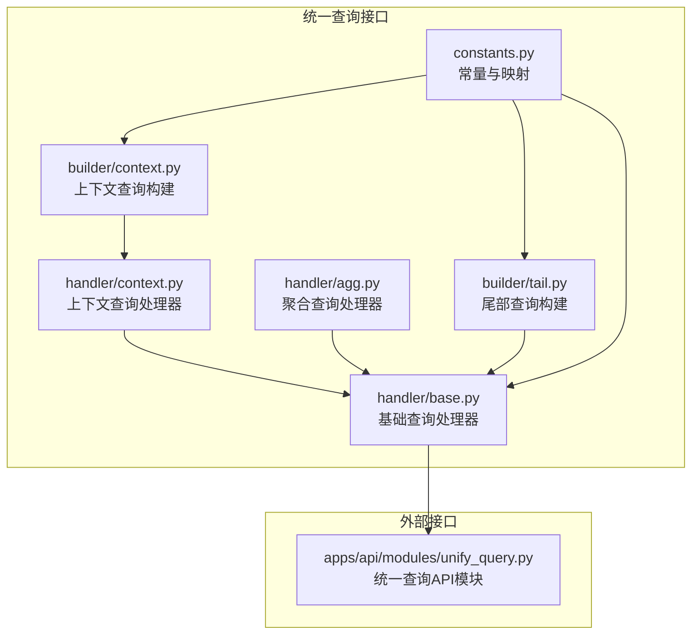
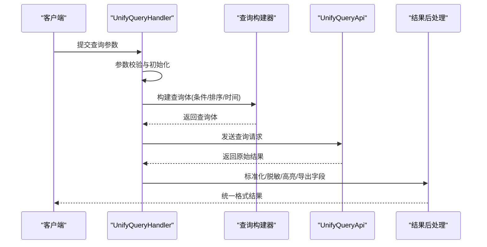
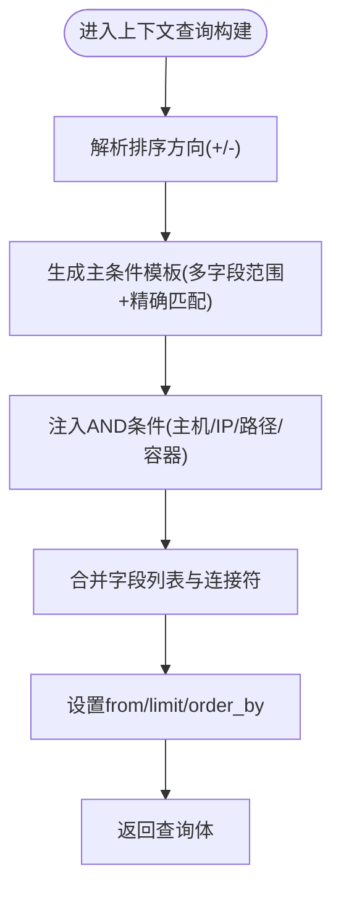
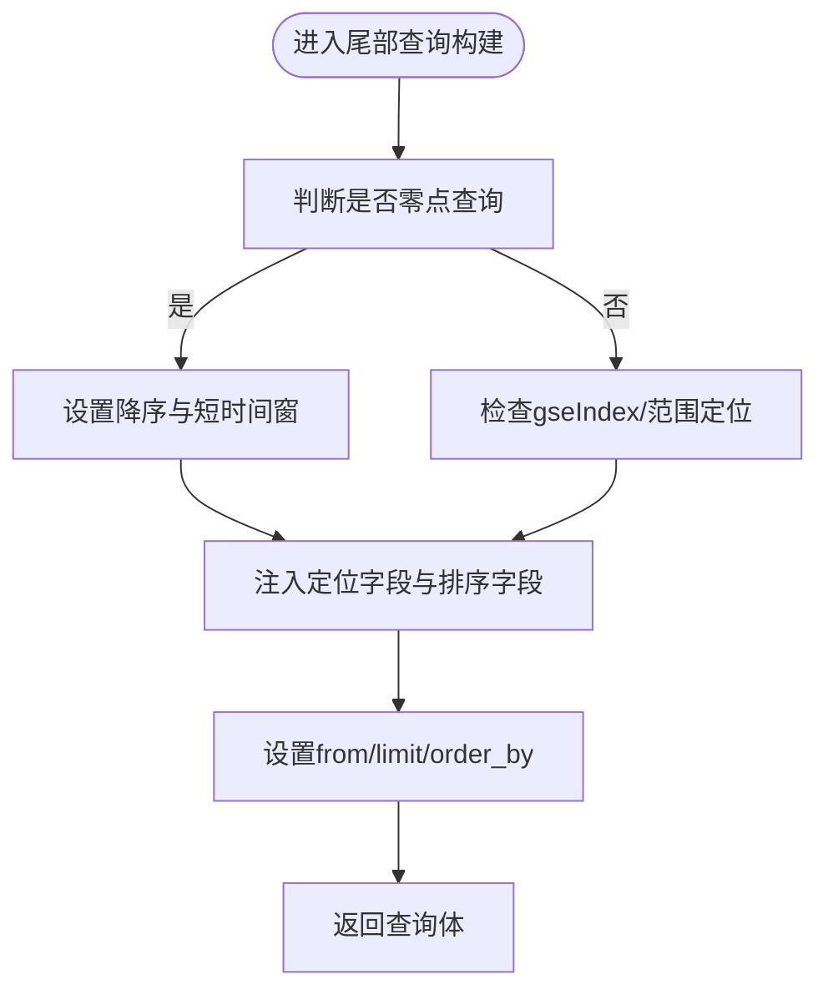
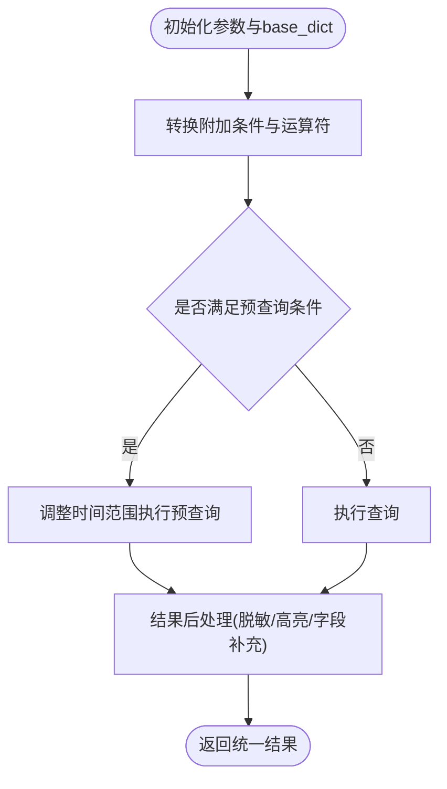
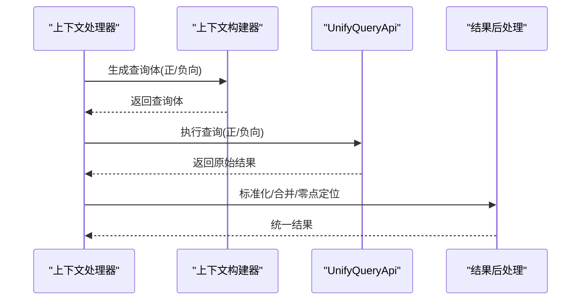
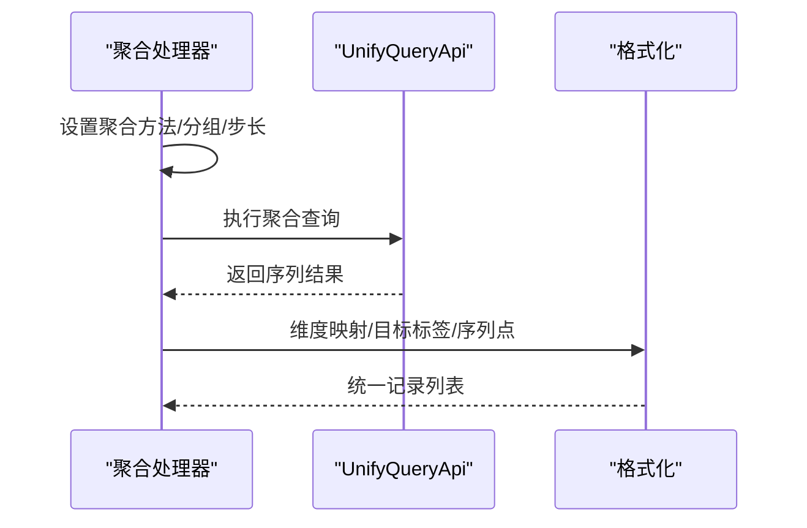
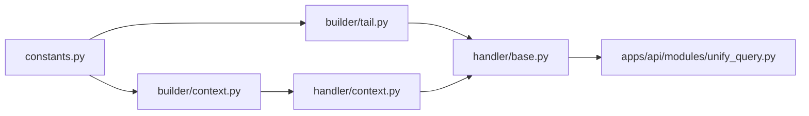

# 统一查询接口

<cite>
**本文引用的文件**
- [apps/log_unifyquery/constants.py](file://apps/log_unifyquery/constants.py)
- [apps/log_unifyquery/builder/context.py](file://apps/log_unifyquery/builder/context.py)
- [apps/log_unifyquery/builder/tail.py](file://apps/log_unifyquery/builder/tail.py)
- [apps/log_unifyquery/handler/base.py](file://apps/log_unifyquery/handler/base.py)
- [apps/log_unifyquery/handler/context.py](file://apps/log_unifyquery/handler/context.py)
- [apps/log_unifyquery/handler/agg.py](file://apps/log_unifyquery/handler/agg.py)
- [apps/api/modules/unify_query.py](file://apps/api/modules/unify_query.py)
</cite>

## 目录
1. [简介](#简介)
2. [项目结构](#项目结构)
3. [核心组件](#核心组件)
4. [架构总览](#架构总览)
5. [详细组件分析](#详细组件分析)
6. [依赖分析](#依赖分析)
7. [性能考虑](#性能考虑)
8. [故障排查指南](#故障排查指南)
9. [结论](#结论)
10. [附录](#附录)

## 简介
本技术文档围绕“统一查询接口”展开，系统化阐述其设计理念与实现机制，重点覆盖以下方面：
- 查询参数标准化：统一输入参数、时间字段、排序字段、附加条件的规范化处理。
- 结果格式统一：统一输出结构、字段映射、高亮与脱敏处理、导出字段控制。
- 跨平台兼容性：适配不同场景（ES/BKDATA/LOG）与不同查询模式（上下文、尾部、聚合）。
- 查询构建器：查询上下文管理、查询链构建（条件拼装、排序、时间范围）、查询优化策略。
- 查询处理器：查询解析、参数验证、执行调度、结果聚合与后处理。
- 查询上下文管理：会话与状态维护、超时控制、预查询优化。
- 查询结果标准化：字段映射、数据转换、格式统一。

## 项目结构
统一查询接口位于 apps/log_unifyquery 目录，主要由常量、查询构建器与处理器组成，并通过统一 API 模块对外提供服务。

**图表来源**
- [apps/log_unifyquery/constants.py:1-100](file://apps/log_unifyquery/constants.py#L1-L100)
- [apps/log_unifyquery/builder/context.py:1-285](file://apps/log_unifyquery/builder/context.py#L1-L285)
- [apps/log_unifyquery/builder/tail.py:1-326](file://apps/log_unifyquery/builder/tail.py#L1-L326)
- [apps/log_unifyquery/handler/base.py:1-800](file://apps/log_unifyquery/handler/base.py#L1-L800)
- [apps/log_unifyquery/handler/context.py:1-262](file://apps/log_unifyquery/handler/context.py#L1-L262)
- [apps/log_unifyquery/handler/agg.py:1-73](file://apps/log_unifyquery/handler/agg.py#L1-L73)
- [apps/api/modules/unify_query.py](file://apps/api/modules/unify_query.py)

**章节来源**
- [apps/log_unifyquery/constants.py:1-100](file://apps/log_unifyquery/constants.py#L1-L100)
- [apps/log_unifyquery/builder/context.py:1-285](file://apps/log_unifyquery/builder/context.py#L1-L285)
- [apps/log_unifyquery/builder/tail.py:1-326](file://apps/log_unifyquery/builder/tail.py#L1-L326)
- [apps/log_unifyquery/handler/base.py:1-800](file://apps/log_unifyquery/handler/base.py#L1-L800)
- [apps/log_unifyquery/handler/context.py:1-262](file://apps/log_unifyquery/handler/context.py#L1-L262)
- [apps/log_unifyquery/handler/agg.py:1-73](file://apps/log_unifyquery/handler/agg.py#L1-L73)
- [apps/api/modules/unify_query.py](file://apps/api/modules/unify_query.py)

## 核心组件
- 常量与映射
  - 聚合类型、字段类型映射、运算符映射、高级运算符映射、分页键等。
- 查询构建器
  - 上下文查询构建：按排序字段与目标字段构造查询条件，支持 ES/BKDATA/LOG 场景。
  - 尾部查询构建：实时日志查询，支持零点查询、定位字段、容器字段等。
- 查询处理器
  - 基础处理器：参数初始化、时间字段与排序解析、附加条件转换、预查询、结果后处理。
  - 上下文处理器：组合上下/下文查询，结果归并与零点定位。
  - 聚合处理器：基于时间序列接口的聚合查询，维度分组与序列格式化。

**章节来源**
- [apps/log_unifyquery/constants.py:25-100](file://apps/log_unifyquery/constants.py#L25-L100)
- [apps/log_unifyquery/builder/context.py:90-285](file://apps/log_unifyquery/builder/context.py#L90-L285)
- [apps/log_unifyquery/builder/tail.py:37-326](file://apps/log_unifyquery/builder/tail.py#L37-L326)
- [apps/log_unifyquery/handler/base.py:98-800](file://apps/log_unifyquery/handler/base.py#L98-L800)
- [apps/log_unifyquery/handler/context.py:24-262](file://apps/log_unifyquery/handler/context.py#L24-L262)
- [apps/log_unifyquery/handler/agg.py:17-73](file://apps/log_unifyquery/handler/agg.py#L17-L73)

## 架构总览
统一查询接口通过“处理器 + 构建器 + 常量”的分层设计，向上提供统一查询能力，向下对接不同场景的数据源与查询 API。

**图表来源**
- [apps/log_unifyquery/handler/base.py:196-265](file://apps/log_unifyquery/handler/base.py#L196-L265)
- [apps/log_unifyquery/builder/context.py:90-163](file://apps/log_unifyquery/builder/context.py#L90-L163)
- [apps/log_unifyquery/builder/tail.py:37-127](file://apps/log_unifyquery/builder/tail.py#L37-L127)
- [apps/api/modules/unify_query.py](file://apps/api/modules/unify_query.py)

## 详细组件分析

### 查询构建器：上下文查询
- 设计要点
  - 支持三种场景：BKDATA、LOG、自定义字段。
  - 通过排序字段与目标字段构造“主条件 + AND 条件”的组合，实现跨字段的有序定位。
  - 自动注入排序字段、from/limit、order_by 等。
- 关键流程
  - 解析排序方向与排序字段，生成范围条件与精确匹配条件。
  - 将 AND 条件（如主机、路径、容器等）嵌入到每个主条件分支。
  - 输出统一查询体，供处理器调用。

**图表来源**
- [apps/log_unifyquery/builder/context.py:31-87](file://apps/log_unifyquery/builder/context.py#L31-L87)
- [apps/log_unifyquery/builder/context.py:90-163](file://apps/log_unifyquery/builder/context.py#L90-L163)
- [apps/log_unifyquery/builder/context.py:165-224](file://apps/log_unifyquery/builder/context.py#L165-L224)
- [apps/log_unifyquery/builder/context.py:226-285](file://apps/log_unifyquery/builder/context.py#L226-L285)

**章节来源**
- [apps/log_unifyquery/builder/context.py:31-285](file://apps/log_unifyquery/builder/context.py#L31-L285)

### 查询构建器：尾部查询
- 设计要点
  - 实时日志查询，支持零点查询（反向排序）与增量定位（基于 gseIndex/iterationIndex）。
  - 自动注入 serverIp/ip、路径、容器扩展字段等条件。
  - 根据场景设置默认 limit 与排序方向。
- 关键流程
  - 根据 zero 或 gseIndex 决定时间窗口与范围条件。
  - 注入定位字段与排序字段，生成统一查询体。

**图表来源**
- [apps/log_unifyquery/builder/tail.py:29-127](file://apps/log_unifyquery/builder/tail.py#L29-L127)
- [apps/log_unifyquery/builder/tail.py:129-238](file://apps/log_unifyquery/builder/tail.py#L129-L238)
- [apps/log_unifyquery/builder/tail.py:241-326](file://apps/log_unifyquery/builder/tail.py#L241-L326)

**章节来源**
- [apps/log_unifyquery/builder/tail.py:29-326](file://apps/log_unifyquery/builder/tail.py#L29-L326)

### 查询处理器：基础处理器
- 设计要点
  - 参数初始化：索引集、业务 ID、关键字、排序、时间范围、聚合字段。
  - 附加条件转换：标准运算符映射、高级运算符转换、逗号分隔 IN 处理。
  - 预查询优化：根据首排序字段与时间边界进行预裁剪，减少无效查询。
  - 结果后处理：脱敏、高亮、CMDB/BCS 字段补充、导出字段映射、统一字段命名。
- 关键流程
  - 初始化 base_dict（query_list、order_by、step、时间范围等）。
  - 调用 query_ts_raw/query_ts_reference 执行查询。
  - _deal_query_result 标准化输出结构与字段。

**图表来源**
- [apps/log_unifyquery/handler/base.py:588-634](file://apps/log_unifyquery/handler/base.py#L588-L634)
- [apps/log_unifyquery/handler/base.py:221-252](file://apps/log_unifyquery/handler/base.py#L221-L252)
- [apps/log_unifyquery/handler/base.py:646-707](file://apps/log_unifyquery/handler/base.py#L646-L707)

**章节来源**
- [apps/log_unifyquery/handler/base.py:98-800](file://apps/log_unifyquery/handler/base.py#L98-L800)

### 查询处理器：上下文处理器
- 设计要点
  - 支持零点查询（同时发起上下两段查询并合并），并进行零点定位与计数起点计算。
  - 非零点查询仅发起单向查询。
  - 根据索引集的 target_fields/sort_fields 或场景类型（BKDATA/LOG）选择不同的上下文构建策略。
- 关键流程
  - _get_context_body 选择构建器并生成查询体。
  - query_ts_raw 执行查询，_deal_query_result 标准化。
  - _analyze_context_result 定位零点与统计起点。

**图表来源**
- [apps/log_unifyquery/handler/context.py:24-117](file://apps/log_unifyquery/handler/context.py#L24-L117)
- [apps/log_unifyquery/handler/context.py:119-169](file://apps/log_unifyquery/handler/context.py#L119-L169)
- [apps/log_unifyquery/handler/context.py:171-262](file://apps/log_unifyquery/handler/context.py#L171-L262)
- [apps/log_unifyquery/builder/context.py:90-285](file://apps/log_unifyquery/builder/context.py#L90-L285)

**章节来源**
- [apps/log_unifyquery/handler/context.py:24-262](file://apps/log_unifyquery/handler/context.py#L24-L262)

### 查询处理器：聚合处理器
- 设计要点
  - 支持多种聚合方法（含去重与计数特例），按 group_by 维度分组。
  - 通过时间序列接口执行聚合，再格式化为统一序列结构。
  - 可选维度脱敏。
- 关键流程
  - 设置 function 与 time_aggregation（或去重特例）。
  - 调用 query_ts 或 query_ts_reference。
  - _format_agg_series 格式化维度、目标标签与时间序列点。

**图表来源**
- [apps/log_unifyquery/handler/agg.py:17-73](file://apps/log_unifyquery/handler/agg.py#L17-L73)

**章节来源**
- [apps/log_unifyquery/handler/agg.py:17-73](file://apps/log_unifyquery/handler/agg.py#L17-L73)

### 查询上下文管理与超时控制
- 会话与状态
  - 处理器通过 base_dict 与 result_merge_base_dict 维护查询上下文，确保多索引集合并查询的一致性。
- 超时与预查询
  - 预查询：当首排序字段为时间字段且满足时间边界时，自动缩短查询区间，提升响应速度。
  - 尾部查询：零点查询采用降序与短时间窗，快速定位最新日志。
- 超时控制
  - 通过统一 API 的超时与错误处理机制保障稳定性（异常捕获与日志记录）。

**章节来源**
- [apps/log_unifyquery/handler/base.py:221-252](file://apps/log_unifyquery/handler/base.py#L221-L252)
- [apps/log_unifyquery/builder/tail.py:57-64](file://apps/log_unifyquery/builder/tail.py#L57-L64)

### 查询结果的标准化处理
- 字段映射与转换
  - 统一字段命名（如索引集 ID、文档 ID），嵌套字段展开/折叠。
  - 高亮字段处理与移除。
- 数据转换
  - 脱敏：支持字段级与文本字段级脱敏，支持特权用户豁免。
  - CMDB/BCS 字段补充：自动注入主机与集群信息。
- 格式统一
  - 输出结构包含 total、took、list、origin_log_list、aggregations 等统一字段。
  - 导出字段支持点号路径访问与虚拟字段导出。

**章节来源**
- [apps/log_unifyquery/handler/base.py:646-707](file://apps/log_unifyquery/handler/base.py#L646-L707)
- [apps/log_unifyquery/handler/base.py:757-792](file://apps/log_unifyquery/handler/base.py#L757-L792)

## 依赖分析
- 组件耦合
  - 处理器依赖构建器生成查询体；构建器依赖常量中的映射与场景定义。
  - 处理器通过统一 API 模块执行查询，结果后处理依赖脱敏与字段映射工具。
- 外部依赖
  - 统一查询 API 模块负责与底层数据源交互。
  - 特性开关与权限控制影响脱敏策略与白名单行为。

**图表来源**
- [apps/log_unifyquery/constants.py:1-100](file://apps/log_unifyquery/constants.py#L1-L100)
- [apps/log_unifyquery/builder/context.py:1-285](file://apps/log_unifyquery/builder/context.py#L1-L285)
- [apps/log_unifyquery/builder/tail.py:1-326](file://apps/log_unifyquery/builder/tail.py#L1-L326)
- [apps/log_unifyquery/handler/context.py:1-262](file://apps/log_unifyquery/handler/context.py#L1-L262)
- [apps/log_unifyquery/handler/base.py:1-800](file://apps/log_unifyquery/handler/base.py#L1-L800)
- [apps/api/modules/unify_query.py](file://apps/api/modules/unify_query.py)

**章节来源**
- [apps/log_unifyquery/constants.py:1-100](file://apps/log_unifyquery/constants.py#L1-L100)
- [apps/log_unifyquery/builder/context.py:1-285](file://apps/log_unifyquery/builder/context.py#L1-L285)
- [apps/log_unifyquery/builder/tail.py:1-326](file://apps/log_unifyquery/builder/tail.py#L1-L326)
- [apps/log_unifyquery/handler/context.py:1-262](file://apps/log_unifyquery/handler/context.py#L1-L262)
- [apps/log_unifyquery/handler/base.py:1-800](file://apps/log_unifyquery/handler/base.py#L1-L800)
- [apps/api/modules/unify_query.py](file://apps/api/modules/unify_query.py)

## 性能考虑
- 预查询优化
  - 当首排序字段为时间字段且满足边界条件时，缩短查询区间，显著降低无效扫描。
- 分页与滚动
  - 尾部查询默认较小 limit，避免一次性拉取过多数据；下载场景使用滚动接口。
- 聚合周期自适应
  - 根据查询时间跨度自动选择聚合周期，平衡精度与性能。
- 脱敏与高亮
  - 脱敏与高亮处理在结果后阶段完成，避免重复计算；特权用户可关闭脱敏以提升性能。

[本节为通用性能建议，无需特定文件引用]

## 故障排查指南
- 常见问题
  - 查询无结果：检查索引集是否正确、关键字是否被增强、附加条件是否有效。
  - 排序字段不生效：确认字段是否支持排序（doc_values），或调整排序字段。
  - 脱敏异常：检查脱敏配置与白名单，必要时临时关闭脱敏定位问题。
  - 聚合结果异常：核对 group_by 维度与聚合方法，确认时间聚合窗口设置。
- 定位手段
  - 查看统一查询 API 的异常日志与错误码。
  - 使用 dsl 字段（上下文处理器返回）核对最终查询体。
  - 检查时间范围与排序方向是否符合预期。

**章节来源**
- [apps/log_unifyquery/handler/base.py:221-252](file://apps/log_unifyquery/handler/base.py#L221-L252)
- [apps/log_unifyquery/handler/context.py:70-78](file://apps/log_unifyquery/handler/context.py#L70-L78)

## 结论
统一查询接口通过“参数标准化 + 查询构建器 + 处理器 + 结果标准化”的完整链路，实现了跨场景、跨平台的一致查询体验。其关键优势在于：
- 明确的参数与结果规范，便于前端与上层系统集成；
- 面向不同场景的查询构建器，保证查询效率与准确性；
- 预查询、脱敏、高亮、导出等后处理能力，满足生产环境的多样化需求。

## 附录

### 使用示例（步骤说明）
- 上下文查询
  - 准备参数：索引集 ID、业务 ID、关键字、排序字段、目标字段、定位字段值。
  - 调用上下文处理器，获取统一结果与零点位置。
- 尾部查询
  - 准备参数：索引集 ID、业务 ID、定位字段（如 gseIndex）、serverIp/ip、路径、容器字段。
  - 调用尾部查询构建器与处理器，获取实时日志。
- 聚合查询
  - 准备参数：索引集 ID、业务 ID、聚合方法、分组维度、时间间隔。
  - 调用聚合处理器，获取序列化结果。

[本节为使用说明，不直接分析具体文件，故不附“章节来源”]