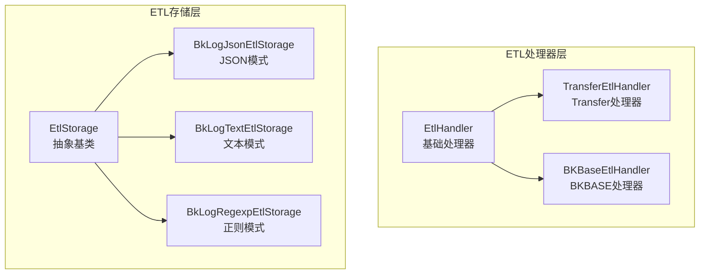
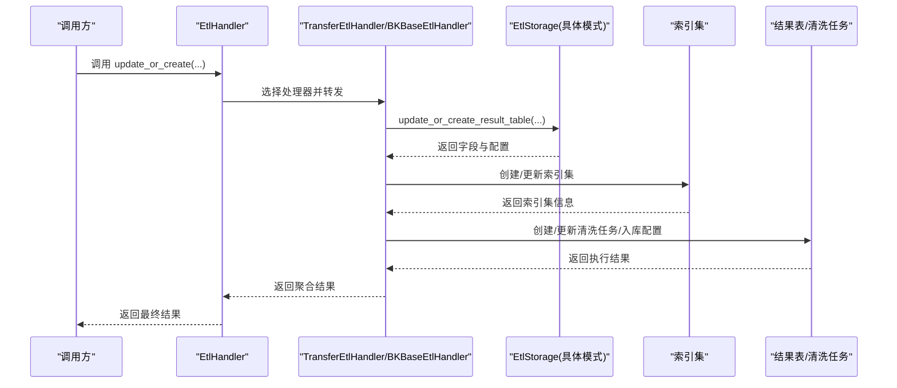
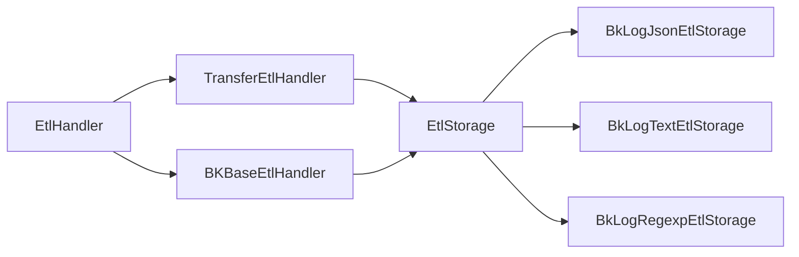

# 数据转换引擎

<cite>
**本文引用的文件**
- [apps/log_databus/handlers/etl/base.py](file://apps/log_databus/handlers/etl/base.py)
- [apps/log_databus/handlers/etl/__init__.py](file://apps/log_databus/handlers/etl/__init__.py)
- [apps/log_databus/handlers/etl/bkbase.py](file://apps/log_databus/handlers/etl/bkbase.py)
- [apps/log_databus/handlers/etl/transfer.py](file://apps/log_databus/handlers/etl/transfer.py)
- [apps/log_databus/handlers/etl_storage/base.py](file://apps/log_databus/handlers/etl_storage/base.py)
- [apps/log_databus/handlers/etl_storage/bk_log_json.py](file://apps/log_databus/handlers/etl_storage/bk_log_json.py)
- [apps/log_databus/handlers/etl_storage/bk_log_text.py](file://apps/log_databus/handlers/etl_storage/bk_log_text.py)
- [apps/log_databus/handlers/etl_storage/bk_log_regexp.py](file://apps/log_databus/handlers/etl_storage/bk_log_regexp.py)
</cite>

## 目录
1. [简介](#简介)
2. [项目结构](#项目结构)
3. [核心组件](#核心组件)
4. [架构总览](#架构总览)
5. [详细组件分析](#详细组件分析)
6. [依赖分析](#依赖分析)
7. [性能考虑](#性能考虑)
8. [故障排查指南](#故障排查指南)
9. [结论](#结论)
10. [附录](#附录)

## 简介
本技术文档围绕“数据转换引擎”展开，系统性阐述蓝鲸日志平台中ETL处理流程的实现机制，涵盖数据抽取、转换与加载的关键步骤；详解数据类型转换（字符串、数值、日期时间）的处理逻辑；解释字段映射配置（字段重命名、合并、拆分）的实现原理；说明数据质量控制（空值处理、重复过滤、异常标记）的策略；并提供性能优化与内存管理建议、使用示例与调试技巧。

## 项目结构
数据转换引擎主要由两层组成：
- ETL处理器层：负责根据采集场景选择具体处理器（如Transfer、BKBASE），协调结果表创建、索引集维护、清洗任务启停等。
- ETL存储层：负责不同ETL模式（文本、JSON、正则、分隔符）的字段提取、类型映射、V4清洗规则构建与预览。

图表来源
- [apps/log_databus/handlers/etl/base.py:72-388](file://apps/log_databus/handlers/etl/base.py#L72-L388)
- [apps/log_databus/handlers/etl/transfer.py:42-268](file://apps/log_databus/handlers/etl/transfer.py#L42-L268)
- [apps/log_databus/handlers/etl/bkbase.py:39-190](file://apps/log_databus/handlers/etl/bkbase.py#L39-L190)
- [apps/log_databus/handlers/etl_storage/base.py:63-1708](file://apps/log_databus/handlers/etl_storage/base.py#L63-L1708)
- [apps/log_databus/handlers/etl_storage/bk_log_json.py:29-390](file://apps/log_databus/handlers/etl_storage/bk_log_json.py#L29-L390)
- [apps/log_databus/handlers/etl_storage/bk_log_text.py:28-226](file://apps/log_databus/handlers/etl_storage/bk_log_text.py#L28-L226)
- [apps/log_databus/handlers/etl_storage/bk_log_regexp.py:33-380](file://apps/log_databus/handlers/etl_storage/bk_log_regexp.py#L33-L380)

章节来源
- [apps/log_databus/handlers/etl/__init__.py:21-24](file://apps/log_databus/handlers/etl/__init__.py#L21-L24)

## 核心组件
- EtlHandler：统一入口，负责根据采集配置选择具体处理器、容量校验、ITSMSOP钩子、结果表与索引集的创建/更新、预览接口等。
- TransferEtlHandler：面向Transfer清洗链路，负责结果表创建、索引集维护、聚类联动、清洗快照落盘等。
- BKBaseEtlHandler：面向BKBASE清洗链路，负责清洗任务创建/更新、入库配置创建/更新、清洗任务启停等。
- EtlStorage：抽象基类，定义ETL模式通用能力（类型映射、V4规则构建、分词器生成、预览接口等）。
- 具体存储实现：BkLogJsonEtlStorage、BkLogTextEtlStorage、BkLogRegexpEtlStorage分别对应JSON、文本、正则三种ETL模式。

章节来源
- [apps/log_databus/handlers/etl/base.py:72-388](file://apps/log_databus/handlers/etl/base.py#L72-L388)
- [apps/log_databus/handlers/etl/transfer.py:42-268](file://apps/log_databus/handlers/etl/transfer.py#L42-L268)
- [apps/log_databus/handlers/etl/bkbase.py:39-190](file://apps/log_databus/handlers/etl/bkbase.py#L39-L190)
- [apps/log_databus/handlers/etl_storage/base.py:63-1708](file://apps/log_databus/handlers/etl_storage/base.py#L63-L1708)

## 架构总览
ETL处理流程分为三步：抽取（采集原始日志）、转换（按ETL模式解析字段、类型转换、时间解析、字段映射）、加载（创建/更新结果表、索引集、清洗任务）。

图表来源
- [apps/log_databus/handlers/etl/base.py:150-259](file://apps/log_databus/handlers/etl/base.py#L150-L259)
- [apps/log_databus/handlers/etl/transfer.py:42-214](file://apps/log_databus/handlers/etl/transfer.py#L42-L214)
- [apps/log_databus/handlers/etl/bkbase.py:78-190](file://apps/log_databus/handlers/etl/bkbase.py#L78-L190)
- [apps/log_databus/handlers/etl_storage/base.py:119-133](file://apps/log_databus/handlers/etl_storage/base.py#L119-L133)

## 详细组件分析

### ETL处理器层
- EtlHandler
  - 处理器选择：根据采集配置的处理器类型动态导入具体处理器类。
  - 容量校验：针对ES存储容量进行业务维度校验，避免超配。
  - ITSMSOP钩子：在需要评估时创建单据并阻塞后续流程直至审批完成。
  - 结果表与索引集：通过EtlStorage创建/更新结果表，并创建/更新索引集。
  - 预览接口：支持V4/V3两种预览方式，便于前端可视化调试。
  - 时间解析：支持多种时间格式与自定义格式，统一转换为毫秒时间戳。
- TransferEtlHandler
  - 聚类联动：当开启聚类时，自动注入签名字段、更新聚类清洗配置。
  - 索引集字段同步：从索引集对象继承排序与目标字段配置。
  - 清洗快照：将当前ETL参数与字段写入清理快照，便于增量更新。
- BKBaseEtlHandler
  - 清洗任务生命周期：创建、启动、重启、停止清洗任务。
  - 入库配置：根据集群配置创建/更新入库配置，支持物理表名拼接与合流。

章节来源
- [apps/log_databus/handlers/etl/base.py:72-388](file://apps/log_databus/handlers/etl/base.py#L72-L388)
- [apps/log_databus/handlers/etl/transfer.py:42-268](file://apps/log_databus/handlers/etl/transfer.py#L42-L268)
- [apps/log_databus/handlers/etl/bkbase.py:39-190](file://apps/log_databus/handlers/etl/bkbase.py#L39-L190)

### ETL存储层
- EtlStorage（抽象）
  - 类型映射：将字段类型映射为ES字段类型，保证入库一致性。
  - V4规则构建：统一构建clean_rules，支持内置字段、时间字段、flat_field、ext_json、parse_failure标记、path正则等。
  - 分词器生成：基于字段配置生成analyzer/tokenizer，支持大小写敏感与自定义分词字符组。
  - 预览接口：提供V3/V4预览能力，便于前端交互调试。
- BkLogJsonEtlStorage
  - JSON解析：先从原始数据解析出json_data，再从bk_separator_object提取字段。
  - 字段映射：支持字段重命名（alias_name）、类型转换、保留原文、保留异常内容等。
  - V4规则：包含内置字段提取、items迭代、log原文提取、正则/JSON解析、字段映射、时间字段生成、ext_json、path正则等完整链路。
- BkLogTextEtlStorage
  - 直接入库：将iter_item的data字段作为log原文入库。
  - V4规则：包含JSON解析、内置字段提取、items迭代、log原文提取、flat_field提取、path正则等。
- BkLogRegexpEtlStorage
  - 正则解析：从iter_string应用正则表达式，生成bk_separator_object。
  - 字段映射：按字段名映射到正则捕获组，支持字段重命名与类型转换。
  - V4规则：包含JSON解析、内置字段提取、items迭代、log原文提取、正则解析、字段映射、时间字段生成、ext_json、path正则等。

章节来源
- [apps/log_databus/handlers/etl_storage/base.py:63-1708](file://apps/log_databus/handlers/etl_storage/base.py#L63-L1708)
- [apps/log_databus/handlers/etl_storage/bk_log_json.py:29-390](file://apps/log_databus/handlers/etl_storage/bk_log_json.py#L29-L390)
- [apps/log_databus/handlers/etl_storage/bk_log_text.py:28-226](file://apps/log_databus/handlers/etl_storage/bk_log_text.py#L28-L226)
- [apps/log_databus/handlers/etl_storage/bk_log_regexp.py:33-380](file://apps/log_databus/handlers/etl_storage/bk_log_regexp.py#L33-L380)

### 数据类型转换与时间解析
- 字段类型映射
  - 将字段类型映射为ES字段类型，确保入库一致性。
  - 支持string/int/long/float/double/object/bool等常见类型。
- 时间解析
  - 支持标准ISO8601、多种自定义格式、Unix时间戳（秒/毫秒/微秒）。
  - 自定义格式跳过严格校验，直接生成当前时间戳。
  - 将解析后的时间统一转换为毫秒时间戳，供索引与查询使用。
- 纳秒时间戳
  - 对于纳秒级时间格式，生成dtEventTimeStampNanos字段，用于高精度时间存储。

章节来源
- [apps/log_databus/handlers/etl_storage/base.py:200-306](file://apps/log_databus/handlers/etl_storage/base.py#L200-L306)
- [apps/log_databus/handlers/etl/base.py:271-303](file://apps/log_databus/handlers/etl/base.py#L271-L303)

### 字段映射配置实现原理
- 字段重命名
  - 通过alias_name实现字段别名映射，V4规则中使用assign算子设置alias。
- 字段合并/拆分
  - 正则模式：通过正则捕获组实现字段拆分；通过多个捕获组合并为新字段。
  - JSON模式：通过JSON路径提取与assign算子实现字段映射与重命名。
- flat_field
  - 对数组元素逐项迭代，从iter_item提取flat_field字段，支持多维结构扁平化。
- path正则
  - 从filename提取路径，应用正则捕获组生成path相关字段，便于分类检索。
- ext_json
  - 当启用保留额外JSON时，从separator_node排除已定义字段，剩余键值对生成__ext_json字典字段。

章节来源
- [apps/log_databus/handlers/etl_storage/bk_log_json.py:129-244](file://apps/log_databus/handlers/etl_storage/bk_log_json.py#L129-L244)
- [apps/log_databus/handlers/etl_storage/bk_log_regexp.py:160-268](file://apps/log_databus/handlers/etl_storage/bk_log_regexp.py#L160-L268)
- [apps/log_databus/handlers/etl_storage/bk_log_text.py:93-158](file://apps/log_databus/handlers/etl_storage/bk_log_text.py#L93-L158)

### 数据质量控制机制
- 空值处理
  - 正则/JSON解析失败时，可通过error_strategy设置为drop或null，决定丢弃或置空。
  - retain_original_text与enable_retain_content：在解析失败时保留原文或强制写入log字段。
- 重复数据过滤
  - 通过ES唯一字段列表unique_field_list在存储层配置，避免重复写入。
- 异常数据标记
  - record_parse_failure：启用后在separator_node上生成解析失败标记字段，便于识别异常样本。
- 纳秒时间戳
  - 对纳秒级时间格式生成dtEventTimeStampNanos字段，避免精度丢失。

章节来源
- [apps/log_databus/handlers/etl_storage/bk_log_json.py:129-129](file://apps/log_databus/handlers/etl_storage/bk_log_json.py#L129-L129)
- [apps/log_databus/handlers/etl_storage/bk_log_regexp.py:227-234](file://apps/log_databus/handlers/etl_storage/bk_log_regexp.py#L227-L234)
- [apps/log_databus/handlers/etl_storage/base.py:638-665](file://apps/log_databus/handlers/etl_storage/base.py#L638-L665)

### 预览与调试流程
- 预览接口
  - V3：基于Python正则/JSON解析生成字段预览。
  - V4：调用清洗调试接口，返回规则输出的字段与值。
- 调试技巧
  - 先在预览接口验证字段映射与类型转换。
  - 关注解析失败标记字段，定位异常样本。
  - 对复杂正则，先在本地验证捕获组命名与顺序。

章节来源
- [apps/log_databus/handlers/etl/base.py:262-268](file://apps/log_databus/handlers/etl/base.py#L262-L268)
- [apps/log_databus/handlers/etl_storage/bk_log_json.py:41-84](file://apps/log_databus/handlers/etl_storage/bk_log_json.py#L41-L84)
- [apps/log_databus/handlers/etl_storage/bk_log_regexp.py:71-119](file://apps/log_databus/handlers/etl_storage/bk_log_regexp.py#L71-L119)

## 依赖分析
- 组件耦合
  - EtlHandler与具体处理器（TransferEtlHandler、BKBaseEtlHandler）通过动态导入解耦。
  - EtlStorage与具体模式（JSON/文本/正则）通过工厂方法解耦。
- 外部依赖
  - 清洗与入库：调用TransferApi、BkDataDatabusApi等外部接口。
  - 存储配置：读取集群信息、热温分层配置等。
- 循环依赖
  - 未发现循环导入；各模块职责清晰，边界明确。

图表来源
- [apps/log_databus/handlers/etl/base.py:90-105](file://apps/log_databus/handlers/etl/base.py#L90-L105)
- [apps/log_databus/handlers/etl/transfer.py:42-61](file://apps/log_databus/handlers/etl/transfer.py#L42-L61)
- [apps/log_databus/handlers/etl/bkbase.py:39-77](file://apps/log_databus/handlers/etl/bkbase.py#L39-L77)
- [apps/log_databus/handlers/etl_storage/base.py:74-86](file://apps/log_databus/handlers/etl_storage/base.py#L74-L86)

## 性能考虑
- 规则构建
  - V4清洗规则采用流水线式算子组合，尽量减少中间对象拷贝。
  - 对大字段集合，优先使用assign算子批量映射，避免多次遍历。
- 内存管理
  - 预览接口在V3中使用Python正则，注意大样本场景下的内存占用。
  - V4预览调用外部调试接口，避免本地解析的内存压力。
- 存储配置
  - 合理设置shards与replicas，结合热温分层降低查询与写入开销。
  - 唯一字段列表unique_field_list避免重复写入，减少索引膨胀。
- 并发与事务
  - 结果表与索引集更新使用数据库事务，保证一致性；建议在批量场景下合并操作以减少事务次数。

## 故障排查指南
- 常见错误与定位
  - 采集配置不存在：抛出采集配置不存在异常，检查collector_config_id。
  - 结果表ID重复：抛出结果表ID重复异常，检查table_id是否已被占用。
  - 存储容量超限：抛出存储使用异常，检查业务容量与已用量。
  - 时间格式解析失败：抛出时间解析异常，核对time_format与time_zone配置。
  - 正则表达式无效：抛出验证异常，检查separator_regexp是否为空或无法匹配。
- 调试步骤
  - 使用预览接口验证字段映射与类型转换。
  - 开启record_parse_failure标记，定位异常样本。
  - 检查V4规则链路：JSON解析、正则/JSON解析、字段映射、时间字段生成、ext_json、path正则等节点是否正确。
  - 核对保留原文与保留异常内容配置，确认解析失败时的数据落盘策略。

章节来源
- [apps/log_databus/handlers/etl/base.py:82-88](file://apps/log_databus/handlers/etl/base.py#L82-L88)
- [apps/log_databus/handlers/etl/base.py:107-124](file://apps/log_databus/handlers/etl/base.py#L107-L124)
- [apps/log_databus/handlers/etl/base.py:271-303](file://apps/log_databus/handlers/etl/base.py#L271-L303)
- [apps/log_databus/handlers/etl_storage/bk_log_regexp.py:43-49](file://apps/log_databus/handlers/etl_storage/bk_log_regexp.py#L43-L49)

## 结论
数据转换引擎通过“处理器层 + 存储层”的分层设计，实现了对多种ETL模式的统一抽象与扩展。其核心能力包括：
- 统一的ETL流程编排（抽取/转换/加载）
- 灵活的字段映射与类型转换
- 完整的V4清洗规则构建与预览
- 丰富的数据质量控制策略
- 明确的性能与调试指引

该架构既满足现有业务需求，又为未来扩展（如更多ETL模式、更复杂的字段映射）提供了清晰的扩展点。

## 附录
- 使用示例（步骤说明）
  - 选择ETL模式：根据日志格式选择JSON/文本/正则模式。
  - 配置字段映射：定义字段名、别名、类型、是否分析、是否维度等。
  - 配置时间字段：选择内置时间字段或自定义时间字段，并设置时区与格式。
  - 启用质量控制：根据需要开启保留原文、保留异常内容、解析失败标记等。
  - 预览与验证：使用预览接口验证字段映射与类型转换。
  - 创建/更新：调用update_or_create完成结果表、索引集与清洗任务的创建/更新。
- 调试技巧
  - 优先验证正则表达式的捕获组命名与顺序。
  - 对复杂JSON结构，先在V4预览接口中观察字段提取效果。
  - 关注解析失败标记字段，快速定位异常样本。
  - 合理设置唯一字段列表，避免重复写入带来的性能问题。