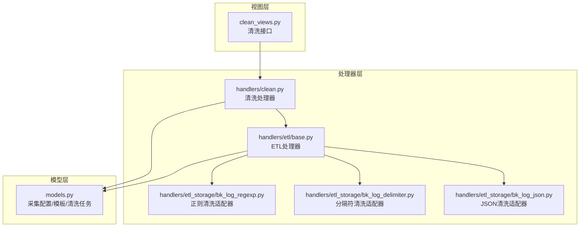
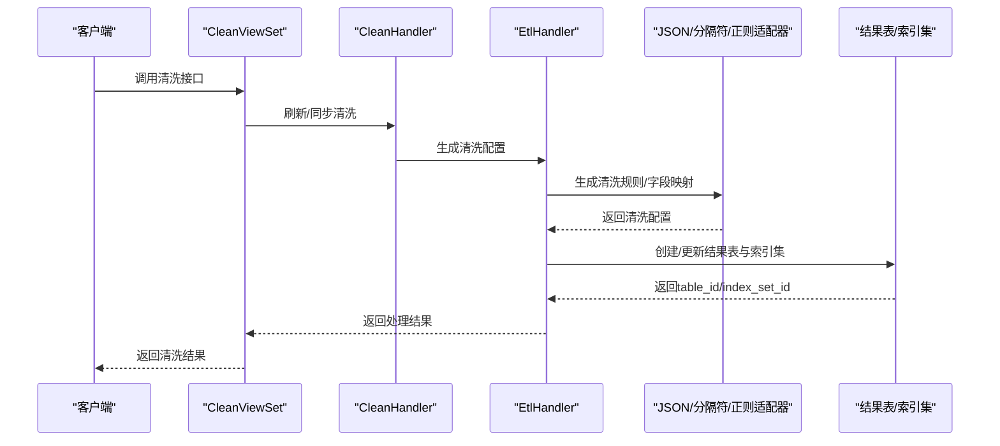
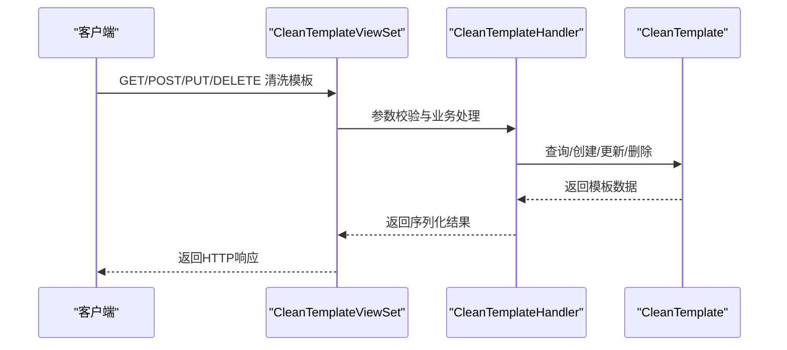
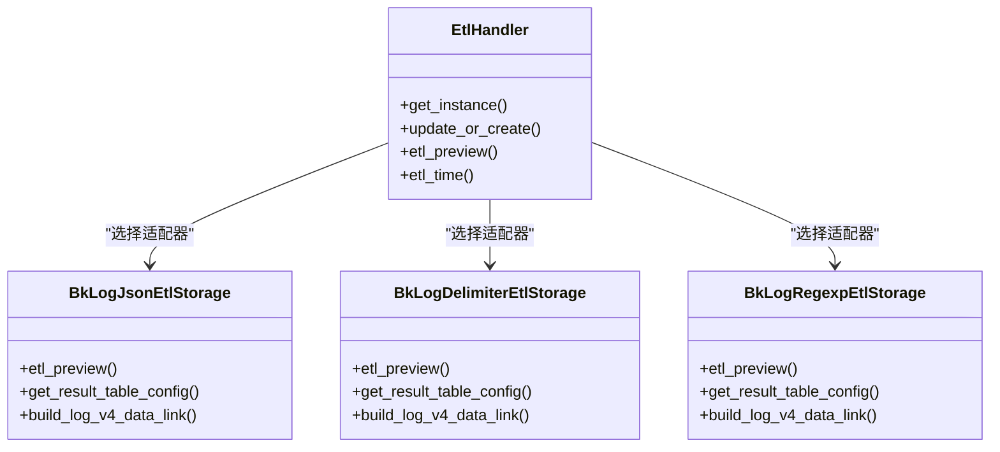
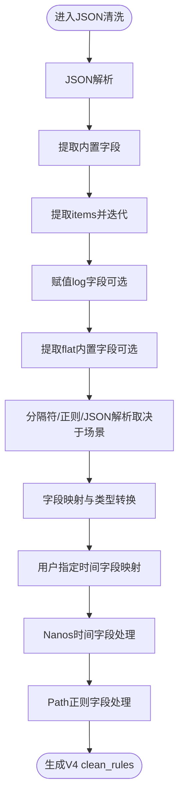
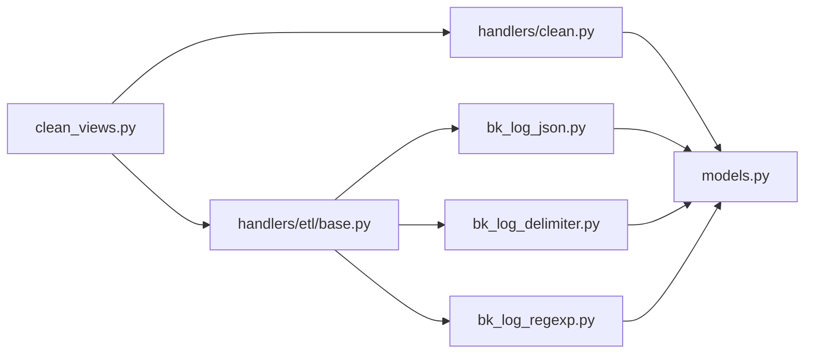

# 日志清洗系统

<cite>
**本文引用的文件**
- [apps/log_databus/models.py](file://apps/log_databus/models.py)
- [apps/log_databus/views/clean_views.py](file://apps/log_databus/views/clean_views.py)
- [apps/log_databus/handlers/clean.py](file://apps/log_databus/handlers/clean.py)
- [apps/log_databus/handlers/etl/base.py](file://apps/log_databus/handlers/etl/base.py)
- [apps/log_databus/handlers/etl_storage/bk_log_json.py](file://apps/log_databus/handlers/etl_storage/bk_log_json.py)
- [apps/log_databus/handlers/etl_storage/bk_log_delimiter.py](file://apps/log_databus/handlers/etl_storage/bk_log_delimiter.py)
- [apps/log_databus/handlers/etl_storage/bk_log_regexp.py](file://apps/log_databus/handlers/etl_storage/bk_log_regexp.py)
</cite>

## 目录
1. [简介](#简介)
2. [项目结构](#项目结构)
3. [核心组件](#核心组件)
4. [架构总览](#架构总览)
5. [详细组件分析](#详细组件分析)
6. [依赖分析](#依赖分析)
7. [性能考虑](#性能考虑)
8. [故障排查指南](#故障排查指南)
9. [结论](#结论)
10. [附录](#附录)

## 简介
本技术文档面向“日志清洗系统”，围绕ETL（抽取、转换、加载）处理流程展开，系统性阐述数据抽取、转换与加载的完整机制；详解清洗规则配置方法（内置清洗场景、自定义清洗规则、清洗模板管理）；解释数据转换引擎工作原理（数据类型转换、字段映射配置、数据质量控制）；给出清洗策略实现细节（正则表达式处理、JSON解析、文本分割等）；并提供清洗效果验证方法与性能优化建议，附带实际配置示例与常见问题解决方案。

## 项目结构
日志清洗系统主要由以下模块构成：
- 数据模型层：采集配置、清洗模板、清洗任务等模型定义
- 视图层：清洗列表、模板管理、预览接口等REST接口
- 处理器层：清洗处理器、ETL处理器、清洗存储适配器（JSON/分隔符/正则）
- 工具与常量：清洗参数、字段模板、内置字段等

**图表来源**
- [apps/log_databus/views/clean_views.py:46-557](file://apps/log_databus/views/clean_views.py#L46-L557)
- [apps/log_databus/handlers/clean.py:37-156](file://apps/log_databus/handlers/clean.py#L37-L156)
- [apps/log_databus/handlers/etl/base.py:72-388](file://apps/log_databus/handlers/etl/base.py#L72-L388)
- [apps/log_databus/handlers/etl_storage/bk_log_json.py:29-390](file://apps/log_databus/handlers/etl_storage/bk_log_json.py#L29-L390)
- [apps/log_databus/handlers/etl_storage/bk_log_delimiter.py:43-465](file://apps/log_databus/handlers/etl_storage/bk_log_delimiter.py#L43-L465)
- [apps/log_databus/handlers/etl_storage/bk_log_regexp.py:33-380](file://apps/log_databus/handlers/etl_storage/bk_log_regexp.py#L33-L380)
- [apps/log_databus/models.py:102-822](file://apps/log_databus/models.py#L102-L822)

**章节来源**
- [apps/log_databus/views/clean_views.py:46-557](file://apps/log_databus/views/clean_views.py#L46-L557)
- [apps/log_databus/handlers/clean.py:37-156](file://apps/log_databus/handlers/clean.py#L37-L156)
- [apps/log_databus/handlers/etl/base.py:72-388](file://apps/log_databus/handlers/etl/base.py#L72-L388)
- [apps/log_databus/handlers/etl_storage/bk_log_json.py:29-390](file://apps/log_databus/handlers/etl_storage/bk_log_json.py#L29-L390)
- [apps/log_databus/handlers/etl_storage/bk_log_delimiter.py:43-465](file://apps/log_databus/handlers/etl_storage/bk_log_delimiter.py#L43-L465)
- [apps/log_databus/handlers/etl_storage/bk_log_regexp.py:33-380](file://apps/log_databus/handlers/etl_storage/bk_log_regexp.py#L33-L380)
- [apps/log_databus/models.py:102-822](file://apps/log_databus/models.py#L102-L822)

## 核心组件
- 清洗处理器（CleanHandler）：负责刷新高级清洗、同步清洗状态、删除清洗配置等
- ETL处理器（EtlHandler）：统一入口，按清洗引擎（Transfer/BKBASE）调度具体清洗存储适配器，生成结果表与索引集
- 清洗存储适配器（JSON/分隔符/正则）：针对不同清洗场景生成清洗规则与字段映射
- 视图控制器（CleanViewSet/CleanTemplateViewSet）：提供清洗列表、模板增删改查、预览接口
- 数据模型（CollectorConfig/CleanTemplate/BKDataClean等）：承载采集配置、清洗模板、清洗任务等元数据

**章节来源**
- [apps/log_databus/handlers/clean.py:37-156](file://apps/log_databus/handlers/clean.py#L37-L156)
- [apps/log_databus/handlers/etl/base.py:72-388](file://apps/log_databus/handlers/etl/base.py#L72-L388)
- [apps/log_databus/handlers/etl_storage/bk_log_json.py:29-390](file://apps/log_databus/handlers/etl_storage/bk_log_json.py#L29-L390)
- [apps/log_databus/handlers/etl_storage/bk_log_delimiter.py:43-465](file://apps/log_databus/handlers/etl_storage/bk_log_delimiter.py#L43-L465)
- [apps/log_databus/handlers/etl_storage/bk_log_regexp.py:33-380](file://apps/log_databus/handlers/etl_storage/bk_log_regexp.py#L33-L380)
- [apps/log_databus/views/clean_views.py:46-557](file://apps/log_databus/views/clean_views.py#L46-L557)
- [apps/log_databus/models.py:102-822](file://apps/log_databus/models.py#L102-L822)

## 架构总览
ETL处理流程分为三层：
- 抽取（Extract）：从采集配置读取原始日志，结合清洗模板与清洗参数
- 转换（Transform）：基于清洗引擎生成清洗规则，执行JSON解析、正则提取、分隔符切分、字段映射、时间字段处理、路径字段处理等
- 加载（Load）：创建/更新结果表与索引集，写入ES/Doris等存储

**图表来源**
- [apps/log_databus/views/clean_views.py:46-557](file://apps/log_databus/views/clean_views.py#L46-L557)
- [apps/log_databus/handlers/clean.py:37-156](file://apps/log_databus/handlers/clean.py#L37-L156)
- [apps/log_databus/handlers/etl/base.py:72-388](file://apps/log_databus/handlers/etl/base.py#L72-L388)
- [apps/log_databus/handlers/etl_storage/bk_log_json.py:29-390](file://apps/log_databus/handlers/etl_storage/bk_log_json.py#L29-L390)
- [apps/log_databus/handlers/etl_storage/bk_log_delimiter.py:43-465](file://apps/log_databus/handlers/etl_storage/bk_log_delimiter.py#L43-L465)
- [apps/log_databus/handlers/etl_storage/bk_log_regexp.py:33-380](file://apps/log_databus/handlers/etl_storage/bk_log_regexp.py#L33-L380)

## 详细组件分析

### 清洗接口与模板管理
- 清洗列表：支持分页、关键词过滤、清洗类型过滤
- 清洗模板：支持创建、更新、删除、可见范围控制、字段列表与清洗参数
- 预览接口：支持多种清洗类型（JSON/分隔符/正则）的字段提取预览

**图表来源**
- [apps/log_databus/views/clean_views.py:199-557](file://apps/log_databus/views/clean_views.py#L199-L557)
- [apps/log_databus/handlers/clean.py:73-156](file://apps/log_databus/handlers/clean.py#L73-L156)

**章节来源**
- [apps/log_databus/views/clean_views.py:199-557](file://apps/log_databus/views/clean_views.py#L199-L557)
- [apps/log_databus/handlers/clean.py:73-156](file://apps/log_databus/handlers/clean.py#L73-L156)

### ETL处理器与清洗引擎
- EtlHandler：统一入口，按清洗引擎（Transfer/BKBASE）动态导入具体处理器
- 校验与限制：采集停止状态不可编辑、结果表ID重复检查、存储容量限制检查
- 结果表与索引集：调用清洗存储适配器生成配置，创建/更新结果表与索引集
- 时间解析：支持多种时间格式与时区转换
- 自动化钩子：聚类场景下的字段插入与前缀处理

**图表来源**
- [apps/log_databus/handlers/etl/base.py:72-388](file://apps/log_databus/handlers/etl/base.py#L72-L388)
- [apps/log_databus/handlers/etl_storage/bk_log_json.py:29-390](file://apps/log_databus/handlers/etl_storage/bk_log_json.py#L29-L390)
- [apps/log_databus/handlers/etl_storage/bk_log_delimiter.py:43-465](file://apps/log_databus/handlers/etl_storage/bk_log_delimiter.py#L43-L465)
- [apps/log_databus/handlers/etl_storage/bk_log_regexp.py:33-380](file://apps/log_databus/handlers/etl_storage/bk_log_regexp.py#L33-L380)

**章节来源**
- [apps/log_databus/handlers/etl/base.py:72-388](file://apps/log_databus/handlers/etl/base.py#L72-L388)

### JSON清洗适配器
- 字段提取预览：支持V4调试接口与传统预览
- 结果表配置：保留原文、扁平化、删除字段、内置字段合并
- V4数据链路：构建完整的clean_rules，包含JSON解析、内置字段提取、迭代、字段映射、时间字段、Nanos时间、Path字段等

**图表来源**
- [apps/log_databus/handlers/etl_storage/bk_log_json.py:129-244](file://apps/log_databus/handlers/etl_storage/bk_log_json.py#L129-L244)

**章节来源**
- [apps/log_databus/handlers/etl_storage/bk_log_json.py:29-390](file://apps/log_databus/handlers/etl_storage/bk_log_json.py#L29-L390)

### 分隔符清洗适配器
- 字段提取预览：以分隔符切分，生成字段列表
- 结果表配置：生成separator_field_list，支持删除字段占位
- V4数据链路：先JSON解析，再迭代，提取原文，再按field_index映射

**章节来源**
- [apps/log_databus/handlers/etl_storage/bk_log_delimiter.py:43-465](file://apps/log_databus/handlers/etl_storage/bk_log_delimiter.py#L43-L465)

### 正则表达式清洗适配器
- 字段提取预览：基于正则命名捕获组提取字段
- 结果表配置：校验字段是否在正则中定义
- V4数据链路：先JSON解析，再迭代，提取原文，再正则解析映射

**章节来源**
- [apps/log_databus/handlers/etl_storage/bk_log_regexp.py:33-380](file://apps/log_databus/handlers/etl_storage/bk_log_regexp.py#L33-L380)

### 清洗策略实现细节
- 正则表达式处理：严格校验正则有效性与字段完整性
- JSON解析：支持错误策略（丢弃/置空），保留原文与扩展JSON
- 文本分割：分隔符切分，支持删除字段占位与最大分片限制
- 字段映射：按字段类型转换为ES类型，支持别名与删除标记
- 时间字段处理：支持用户指定时间字段与Nanos时间字段
- Path字段处理：基于正则提取路径维度字段

**章节来源**
- [apps/log_databus/handlers/etl_storage/bk_log_json.py:129-244](file://apps/log_databus/handlers/etl_storage/bk_log_json.py#L129-L244)
- [apps/log_databus/handlers/etl_storage/bk_log_delimiter.py:120-178](file://apps/log_databus/handlers/etl_storage/bk_log_delimiter.py#L120-L178)
- [apps/log_databus/handlers/etl_storage/bk_log_regexp.py:121-158](file://apps/log_databus/handlers/etl_storage/bk_log_regexp.py#L121-L158)

### 清洗模板管理
- 模板创建/更新：支持可见范围（当前业务/多业务/全部业务）、字段列表、清洗参数
- 模板删除：仅模板创建业务可删除
- 模板预览：支持多种清洗类型的字段提取预览

**章节来源**
- [apps/log_databus/handlers/clean.py:73-156](file://apps/log_databus/handlers/clean.py#L73-L156)
- [apps/log_databus/views/clean_views.py:232-557](file://apps/log_databus/views/clean_views.py#L232-L557)

### 数据质量控制
- 采集状态检查：停止状态不可编辑
- 结果表ID去重：避免重复创建
- 存储容量限制：业务容量阈值检查
- 时间格式解析：严格校验与异常处理
- 错误策略：JSON解析失败时的丢弃/置空策略

**章节来源**
- [apps/log_databus/handlers/etl/base.py:107-124](file://apps/log_databus/handlers/etl/base.py#L107-L124)
- [apps/log_databus/handlers/etl/base.py:199-204](file://apps/log_databus/handlers/etl/base.py#L199-L204)
- [apps/log_databus/handlers/etl/base.py:271-303](file://apps/log_databus/handlers/etl/base.py#L271-L303)

## 依赖分析
- 清洗处理器依赖采集配置模型与清洗模板模型
- ETL处理器依赖清洗存储适配器与索引集处理器
- 清洗存储适配器依赖清洗参数与字段模板
- 视图控制器依赖清洗处理器与ETL处理器

**图表来源**
- [apps/log_databus/views/clean_views.py:46-557](file://apps/log_databus/views/clean_views.py#L46-L557)
- [apps/log_databus/handlers/clean.py:37-156](file://apps/log_databus/handlers/clean.py#L37-L156)
- [apps/log_databus/handlers/etl/base.py:72-388](file://apps/log_databus/handlers/etl/base.py#L72-L388)
- [apps/log_databus/handlers/etl_storage/bk_log_json.py:29-390](file://apps/log_databus/handlers/etl_storage/bk_log_json.py#L29-L390)
- [apps/log_databus/handlers/etl_storage/bk_log_delimiter.py:43-465](file://apps/log_databus/handlers/etl_storage/bk_log_delimiter.py#L43-L465)
- [apps/log_databus/handlers/etl_storage/bk_log_regexp.py:33-380](file://apps/log_databus/handlers/etl_storage/bk_log_regexp.py#L33-L380)
- [apps/log_databus/models.py:102-822](file://apps/log_databus/models.py#L102-L822)

**章节来源**
- [apps/log_databus/views/clean_views.py:46-557](file://apps/log_databus/views/clean_views.py#L46-L557)
- [apps/log_databus/handlers/clean.py:37-156](file://apps/log_databus/handlers/clean.py#L37-L156)
- [apps/log_databus/handlers/etl/base.py:72-388](file://apps/log_databus/handlers/etl/base.py#L72-L388)
- [apps/log_databus/handlers/etl_storage/bk_log_json.py:29-390](file://apps/log_databus/handlers/etl_storage/bk_log_json.py#L29-L390)
- [apps/log_databus/handlers/etl_storage/bk_log_delimiter.py:43-465](file://apps/log_databus/handlers/etl_storage/bk_log_delimiter.py#L43-L465)
- [apps/log_databus/handlers/etl_storage/bk_log_regexp.py:33-380](file://apps/log_databus/handlers/etl_storage/bk_log_regexp.py#L33-L380)
- [apps/log_databus/models.py:102-822](file://apps/log_databus/models.py#L102-L822)

## 性能考虑
- 预览接口：优先使用V4调试接口，减少本地复杂计算
- 字段映射：尽量减少删除字段与扁平化层级，降低内存与CPU开销
- 正则表达式：避免回溯陷阱，使用命名捕获组，确保字段完整性
- 分隔符：控制separator_field_list长度，避免超过阈值
- 时间解析：统一时间格式与时区，减少解析失败与重试
- 存储容量：合理设置保留周期与副本数，避免超限导致失败

## 故障排查指南
- 清洗预览失败：检查清洗参数（分隔符/正则/字段索引）是否正确
- 结果表ID重复：确认table_id唯一性，避免重复创建
- 采集停止状态：确认采集配置处于激活状态
- 存储容量超限：检查业务容量阈值与已用容量
- 时间解析异常：核对时间格式与时区配置
- 模板权限异常：确认模板可见范围与操作权限

**章节来源**
- [apps/log_databus/handlers/etl/base.py:107-124](file://apps/log_databus/handlers/etl/base.py#L107-L124)
- [apps/log_databus/handlers/etl/base.py:199-204](file://apps/log_databus/handlers/etl/base.py#L199-L204)
- [apps/log_databus/handlers/etl/base.py:271-303](file://apps/log_databus/handlers/etl/base.py#L271-L303)
- [apps/log_databus/handlers/etl_storage/bk_log_delimiter.py:138-178](file://apps/log_databus/handlers/etl_storage/bk_log_delimiter.py#L138-L178)
- [apps/log_databus/handlers/etl_storage/bk_log_regexp.py:125-158](file://apps/log_databus/handlers/etl_storage/bk_log_regexp.py#L125-L158)
- [apps/log_databus/handlers/clean.py:134-146](file://apps/log_databus/handlers/clean.py#L134-L146)

## 结论
日志清洗系统通过清晰的ETL分层设计，实现了从抽取、转换到加载的完整闭环。清洗模板与多种清洗适配器提供了灵活的配置能力，配合严格的错误处理与质量控制，保障了清洗过程的稳定性与可维护性。通过合理的参数配置与性能优化策略，可在保证清洗效果的同时提升整体吞吐与稳定性。

## 附录
- 实际配置示例（路径参考）
  - JSON清洗模板字段与参数：[apps/log_databus/handlers/etl_storage/bk_log_json.py:86-127](file://apps/log_databus/handlers/etl_storage/bk_log_json.py#L86-L127)
  - 分隔符清洗模板字段与参数：[apps/log_databus/handlers/etl_storage/bk_log_delimiter.py:120-178](file://apps/log_databus/handlers/etl_storage/bk_log_delimiter.py#L120-L178)
  - 正则清洗模板字段与参数：[apps/log_databus/handlers/etl_storage/bk_log_regexp.py:121-158](file://apps/log_databus/handlers/etl_storage/bk_log_regexp.py#L121-L158)
  - 清洗模板预览接口：[apps/log_databus/views/clean_views.py:503-557](file://apps/log_databus/views/clean_views.py#L503-L557)
- 常见问题
  - 分隔符/正则为空：检查清洗参数必填项
  - 字段未在正则中定义：核对字段命名与正则捕获组
  - 采集停止状态：激活采集配置后重试
  - 存储容量超限：调整保留周期或清理历史数据