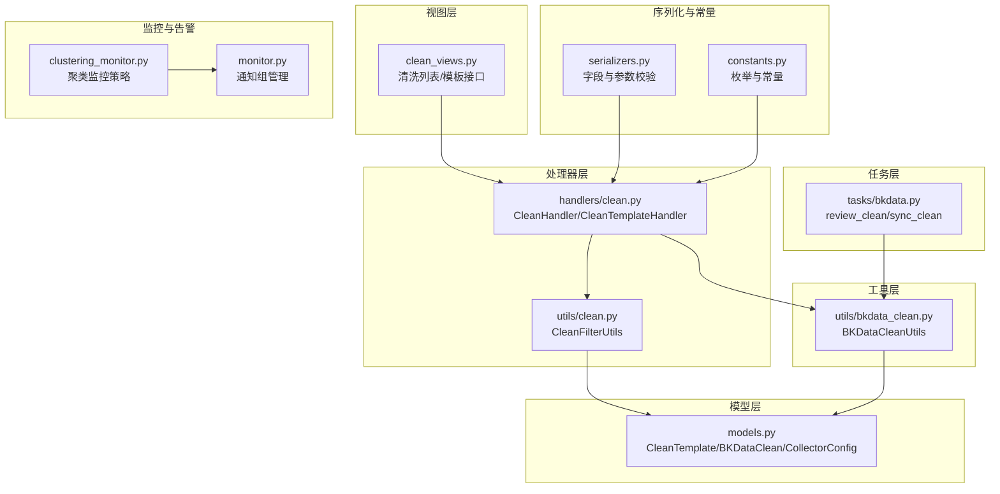
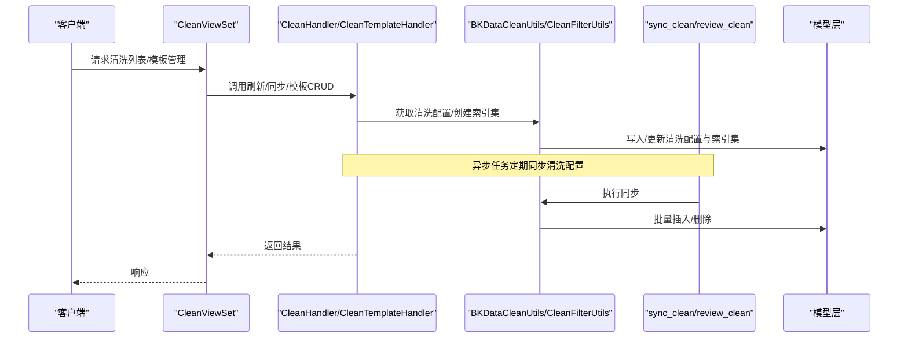
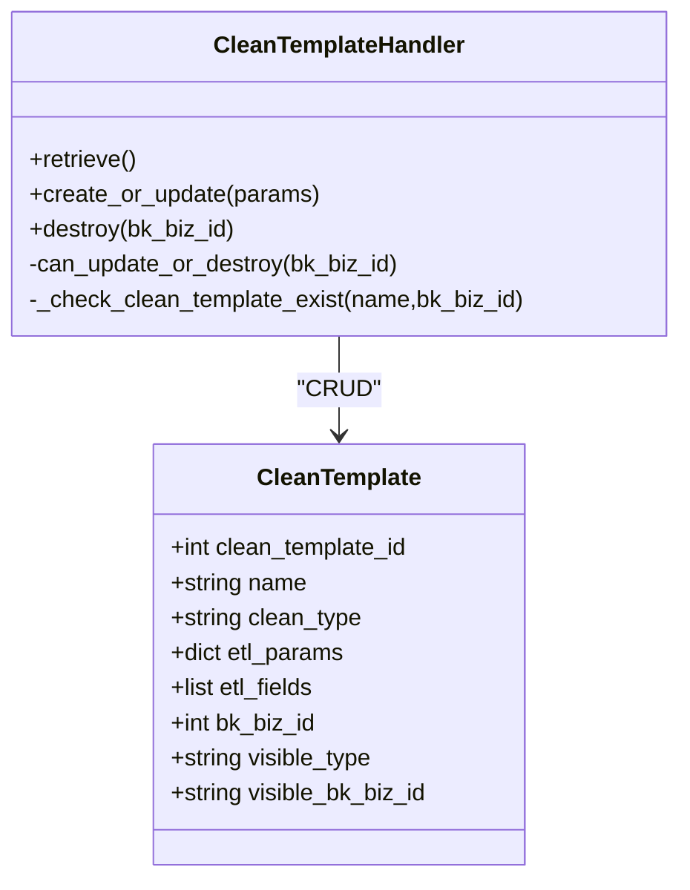
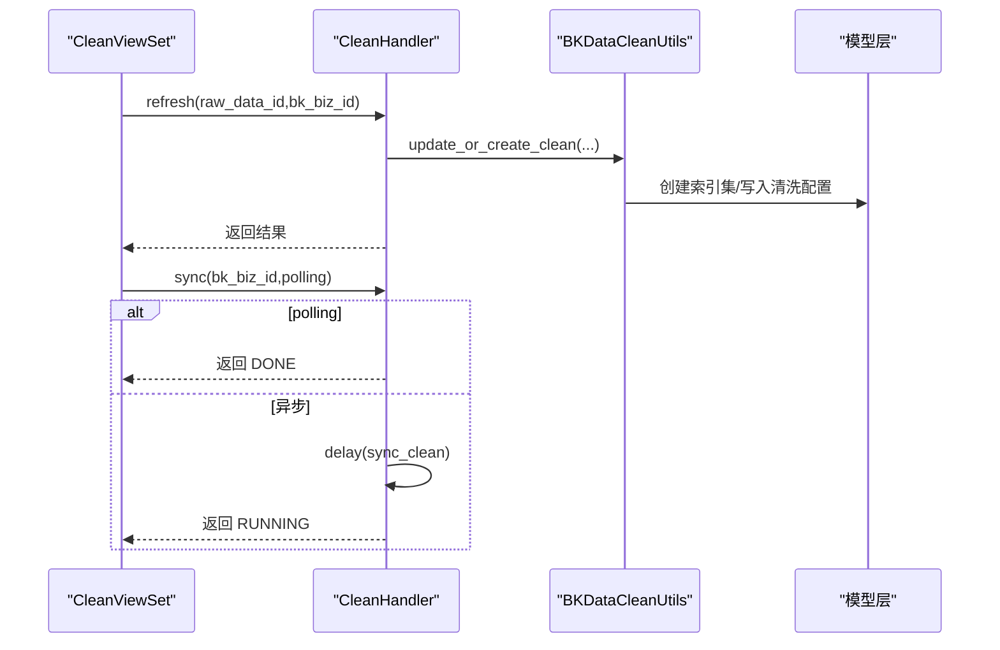
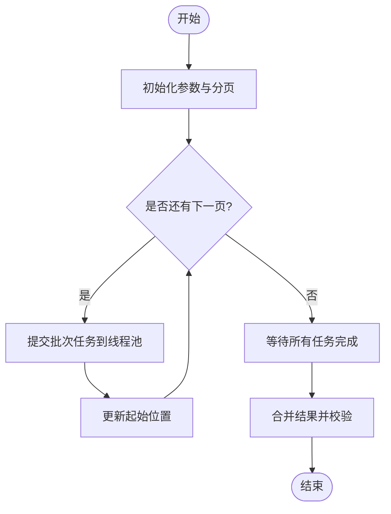
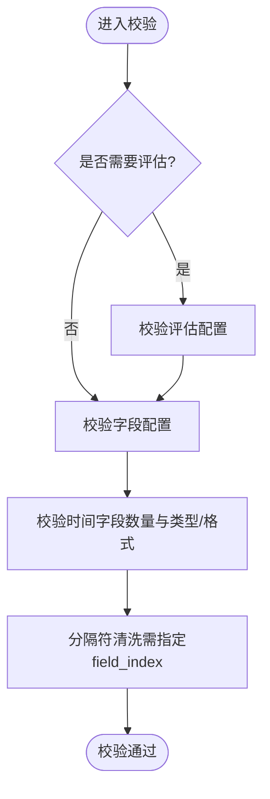
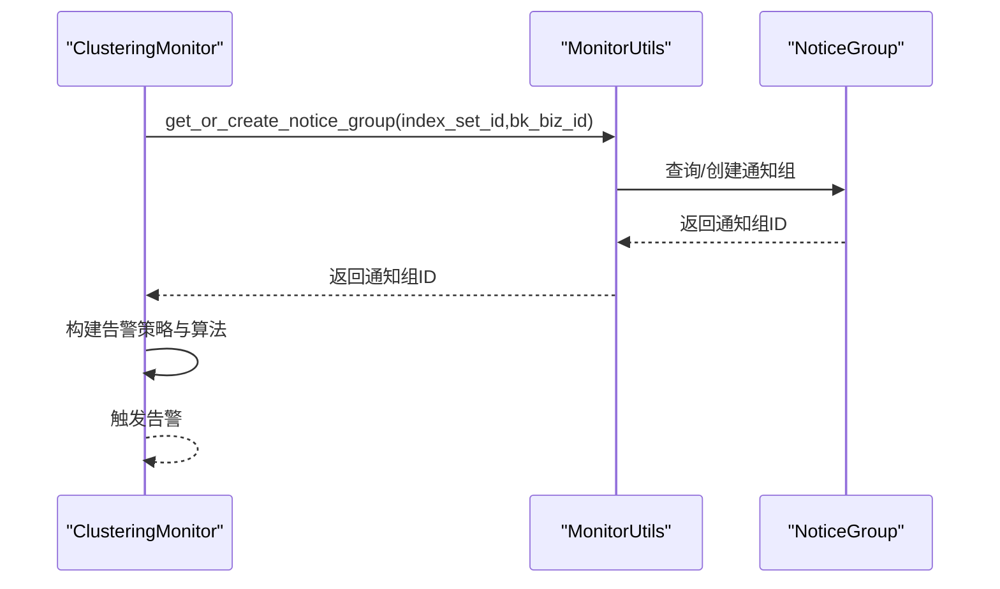
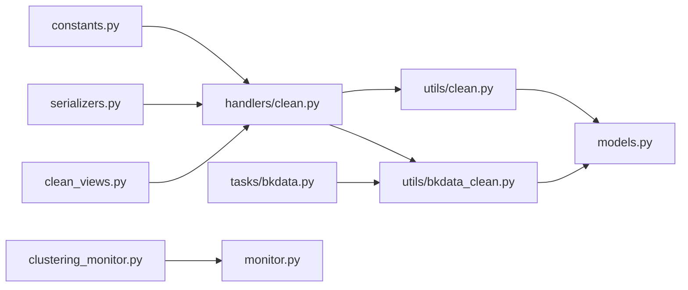

# 清洗策略管理

<cite>
**本文引用的文件**
- [apps/log_databus/models.py](file://apps/log_databus/models.py)
- [apps/log_databus/views/clean_views.py](file://apps/log_databus/views/clean_views.py)
- [apps/log_databus/handlers/clean.py](file://apps/log_databus/handlers/clean.py)
- [apps/log_databus/utils/clean.py](file://apps/log_databus/utils/clean.py)
- [apps/log_databus/tasks/bkdata.py](file://apps/log_databus/tasks/bkdata.py)
- [apps/log_databus/utils/bkdata_clean.py](file://apps/log_databus/utils/bkdata_clean.py)
- [apps/log_databus/serializers.py](file://apps/log_databus/serializers.py)
- [apps/log_databus/constants.py](file://apps/log_databus/constants.py)
- [apps/log_clustering/handlers/clustering_monitor.py](file://apps/log_clustering/handlers/clustering_monitor.py)
- [apps/log_clustering/utils/monitor.py](file://apps/log_clustering/utils/monitor.py)
</cite>

## 目录
1. [简介](#简介)
2. [项目结构](#项目结构)
3. [核心组件](#核心组件)
4. [架构总览](#架构总览)
5. [详细组件分析](#详细组件分析)
6. [依赖分析](#依赖分析)
7. [性能考虑](#性能考虑)
8. [故障排查指南](#故障排查指南)
9. [结论](#结论)
10. [附录](#附录)

## 简介
本技术文档围绕清洗策略管理模块，系统阐述清洗策略的生命周期管理（创建、激活、停用、删除）、批量清洗处理机制（大文件、分片、进度跟踪）、清洗效果验证方法（数据质量评估、字段完整性检查、格式验证）、监控与告警机制（执行状态、错误日志、性能指标），并提供优化建议与常见问题排查方案。文档面向开发者与运维工程师，兼顾可读性与实操性。

## 项目结构
清洗策略管理相关代码主要分布在以下模块：
- 视图层：提供清洗列表、模板管理、预览等接口
- 处理器层：封装清洗逻辑（刷新、同步、模板 CRUD）
- 工具层：清洗过滤、索引集与清洗配置的映射与同步
- 任务层：异步同步清洗配置与索引集
- 模型层：清洗模板、清洗配置、采集配置等实体
- 序列化与常量：参数校验、字段校验、枚举与常量定义
- 监控与告警：聚类监控策略与通知组管理

图表来源
- [apps/log_databus/views/clean_views.py:1-557](file://apps/log_databus/views/clean_views.py#L1-L557)
- [apps/log_databus/handlers/clean.py:1-156](file://apps/log_databus/handlers/clean.py#L1-L156)
- [apps/log_databus/utils/clean.py:1-152](file://apps/log_databus/utils/clean.py#L1-L152)
- [apps/log_databus/tasks/bkdata.py:1-279](file://apps/log_databus/tasks/bkdata.py#L1-L279)
- [apps/log_databus/utils/bkdata_clean.py:1-183](file://apps/log_databus/utils/bkdata_clean.py#L1-L183)
- [apps/log_databus/models.py:1-822](file://apps/log_databus/models.py#L1-L822)
- [apps/log_databus/serializers.py:900-1099](file://apps/log_databus/serializers.py#L900-L1099)
- [apps/log_databus/constants.py:1-755](file://apps/log_databus/constants.py#L1-L755)
- [apps/log_clustering/handlers/clustering_monitor.py:119-560](file://apps/log_clustering/handlers/clustering_monitor.py#L119-L560)
- [apps/log_clustering/utils/monitor.py:49-79](file://apps/log_clustering/utils/monitor.py#L49-L79)

章节来源
- [apps/log_databus/views/clean_views.py:1-557](file://apps/log_databus/views/clean_views.py#L1-L557)
- [apps/log_databus/handlers/clean.py:1-156](file://apps/log_databus/handlers/clean.py#L1-L156)
- [apps/log_databus/utils/clean.py:1-152](file://apps/log_databus/utils/clean.py#L1-L152)
- [apps/log_databus/tasks/bkdata.py:1-279](file://apps/log_databus/tasks/bkdata.py#L1-L279)
- [apps/log_databus/utils/bkdata_clean.py:1-183](file://apps/log_databus/utils/bkdata_clean.py#L1-L183)
- [apps/log_databus/models.py:1-822](file://apps/log_databus/models.py#L1-L822)
- [apps/log_databus/serializers.py:900-1099](file://apps/log_databus/serializers.py#L900-L1099)
- [apps/log_databus/constants.py:1-755](file://apps/log_databus/constants.py#L1-L755)
- [apps/log_clustering/handlers/clustering_monitor.py:119-560](file://apps/log_clustering/handlers/clustering_monitor.py#L119-L560)
- [apps/log_clustering/utils/monitor.py:49-79](file://apps/log_clustering/utils/monitor.py#L49-L79)

## 核心组件
- 清洗模板（CleanTemplate）：定义清洗类型、参数与字段，支持可见范围控制
- 高级清洗配置（BKDataClean）：与计算平台清洗配置映射，自动创建索引集
- 清洗处理器（CleanHandler/CleanTemplateHandler）：提供刷新、同步、模板 CRUD 等能力
- 清洗过滤器（CleanFilterUtils）：聚合采集项与高级清洗，支持筛选与分页
- 异步任务（review_clean/sync_clean）：周期性或触发式同步清洗配置与索引集
- 参数与字段校验（serializers.py）：清洗参数、字段合法性校验
- 枚举与常量（constants.py）：清洗配置类型、可见性、异步状态等

章节来源
- [apps/log_databus/models.py:536-565](file://apps/log_databus/models.py#L536-L565)
- [apps/log_databus/handlers/clean.py:37-156](file://apps/log_databus/handlers/clean.py#L37-L156)
- [apps/log_databus/utils/clean.py:35-152](file://apps/log_databus/utils/clean.py#L35-L152)
- [apps/log_databus/tasks/bkdata.py:194-226](file://apps/log_databus/tasks/bkdata.py#L194-L226)
- [apps/log_databus/serializers.py:900-1099](file://apps/log_databus/serializers.py#L900-L1099)
- [apps/log_databus/constants.py:275-278](file://apps/log_databus/constants.py#L275-L278)

## 架构总览
清洗策略管理采用“视图-处理器-工具-任务-模型”的分层架构，通过异步任务与定时任务实现清洗配置与索引集的自动同步，同时提供模板化配置与严格的参数校验保障数据质量。

图表来源
- [apps/log_databus/views/clean_views.py:46-196](file://apps/log_databus/views/clean_views.py#L46-L196)
- [apps/log_databus/handlers/clean.py:37-156](file://apps/log_databus/handlers/clean.py#L37-L156)
- [apps/log_databus/utils/bkdata_clean.py:149-167](file://apps/log_databus/utils/bkdata_clean.py#L149-L167)
- [apps/log_databus/tasks/bkdata.py:194-226](file://apps/log_databus/tasks/bkdata.py#L194-L226)

## 详细组件分析

### 组件A：清洗模板生命周期管理
- 创建：通过模板序列化器校验参数与字段，持久化 CleanTemplate
- 激活/停用：通过模板可见性控制与业务范围设置实现跨业务共享
- 更新：校验模板唯一性与可见性权限，支持增量更新
- 删除：校验删除权限，删除模板并记录日志

图表来源
- [apps/log_databus/models.py:536-546](file://apps/log_databus/models.py#L536-L546)
- [apps/log_databus/handlers/clean.py:73-156](file://apps/log_databus/handlers/clean.py#L73-L156)

章节来源
- [apps/log_databus/handlers/clean.py:92-156](file://apps/log_databus/handlers/clean.py#L92-L156)
- [apps/log_databus/serializers.py:1062-1074](file://apps/log_databus/serializers.py#L1062-L1074)

### 组件B：清洗配置刷新与同步
- 刷新：根据原始数据 ID 与业务 ID，调用工具类更新或创建清洗配置与索引集
- 同步：支持轮询与异步两种模式，带锁避免重复执行，定时任务周期性扫描

图表来源
- [apps/log_databus/views/clean_views.py:132-196](file://apps/log_databus/views/clean_views.py#L132-L196)
- [apps/log_databus/handlers/clean.py:45-71](file://apps/log_databus/handlers/clean.py#L45-L71)
- [apps/log_databus/utils/bkdata_clean.py:149-167](file://apps/log_databus/utils/bkdata_clean.py#L149-L167)
- [apps/log_databus/tasks/bkdata.py:211-226](file://apps/log_databus/tasks/bkdata.py#L211-L226)

章节来源
- [apps/log_databus/handlers/clean.py:45-71](file://apps/log_databus/handlers/clean.py#L45-L71)
- [apps/log_databus/tasks/bkdata.py:194-226](file://apps/log_databus/tasks/bkdata.py#L194-L226)
- [apps/log_databus/utils/bkdata_clean.py:149-167](file://apps/log_databus/utils/bkdata_clean.py#L149-L167)

### 组件C：批量清洗处理与进度跟踪
- 大文件处理：通过分页并发请求与线程池实现批量拉取与处理
- 分片处理：利用线程池并发分批处理，提升吞吐
- 进度跟踪：通过轮询同步状态与缓存锁实现幂等与去重

图表来源
- [apps/log_databus/utils/clean.py:124-152](file://apps/log_databus/utils/clean.py#L124-L152)
- [apps/log_databus/tasks/bkdata.py:194-226](file://apps/log_databus/tasks/bkdata.py#L194-L226)

章节来源
- [apps/log_databus/utils/clean.py:124-152](file://apps/log_databus/utils/clean.py#L124-L152)
- [apps/log_databus/tasks/bkdata.py:194-226](file://apps/log_databus/tasks/bkdata.py#L194-L226)

### 组件D：清洗效果验证与格式校验
- 字段完整性检查：清洗字段必须包含有效字段，时间字段仅允许一个
- 格式验证：分隔符清洗需指定字段索引；时间字段类型与格式需匹配
- 评估配置：当需要评估时，必须提供评估配置

图表来源
- [apps/log_databus/serializers.py:958-995](file://apps/log_databus/serializers.py#L958-L995)

章节来源
- [apps/log_databus/serializers.py:958-995](file://apps/log_databus/serializers.py#L958-L995)

### 组件E：监控与告警机制
- 聚类监控策略：基于日志数量等指标构建智能检测策略，支持告警阈值与恢复窗口
- 通知组管理：自动创建或获取通知组，确保告警消息触达维护人

图表来源
- [apps/log_clustering/handlers/clustering_monitor.py:119-560](file://apps/log_clustering/handlers/clustering_monitor.py#L119-L560)
- [apps/log_clustering/utils/monitor.py:65-79](file://apps/log_clustering/utils/monitor.py#L65-L79)

章节来源
- [apps/log_clustering/handlers/clustering_monitor.py:119-560](file://apps/log_clustering/handlers/clustering_monitor.py#L119-L560)
- [apps/log_clustering/utils/monitor.py:65-79](file://apps/log_clustering/utils/monitor.py#L65-L79)

## 依赖分析
- 视图层依赖处理器层与序列化器，负责参数解析与权限控制
- 处理器层依赖工具层与模型层，实现业务逻辑与数据持久化
- 工具层依赖模型层与外部接口，完成清洗配置与索引集映射
- 任务层依赖工具层，实现周期性与异步同步
- 监控与告警模块依赖通知组与策略构建工具

图表来源
- [apps/log_databus/views/clean_views.py:1-557](file://apps/log_databus/views/clean_views.py#L1-L557)
- [apps/log_databus/handlers/clean.py:1-156](file://apps/log_databus/handlers/clean.py#L1-L156)
- [apps/log_databus/utils/bkdata_clean.py:1-183](file://apps/log_databus/utils/bkdata_clean.py#L1-L183)
- [apps/log_databus/utils/clean.py:1-152](file://apps/log_databus/utils/clean.py#L1-L152)
- [apps/log_databus/models.py:1-822](file://apps/log_databus/models.py#L1-L822)
- [apps/log_databus/tasks/bkdata.py:1-279](file://apps/log_databus/tasks/bkdata.py#L1-L279)
- [apps/log_databus/serializers.py:1-1836](file://apps/log_databus/serializers.py#L1-L1836)
- [apps/log_databus/constants.py:1-755](file://apps/log_databus/constants.py#L1-L755)
- [apps/log_clustering/handlers/clustering_monitor.py:119-560](file://apps/log_clustering/handlers/clustering_monitor.py#L119-L560)
- [apps/log_clustering/utils/monitor.py:49-79](file://apps/log_clustering/utils/monitor.py#L49-L79)

章节来源
- [apps/log_databus/views/clean_views.py:1-557](file://apps/log_databus/views/clean_views.py#L1-L557)
- [apps/log_databus/handlers/clean.py:1-156](file://apps/log_databus/handlers/clean.py#L1-L156)
- [apps/log_databus/utils/bkdata_clean.py:1-183](file://apps/log_databus/utils/bkdata_clean.py#L1-L183)
- [apps/log_databus/utils/clean.py:1-152](file://apps/log_databus/utils/clean.py#L1-L152)
- [apps/log_databus/models.py:1-822](file://apps/log_databus/models.py#L1-L822)
- [apps/log_databus/tasks/bkdata.py:1-279](file://apps/log_databus/tasks/bkdata.py#L1-L279)
- [apps/log_databus/serializers.py:1-1836](file://apps/log_databus/serializers.py#L1-L1836)
- [apps/log_databus/constants.py:1-755](file://apps/log_databus/constants.py#L1-L755)
- [apps/log_clustering/handlers/clustering_monitor.py:119-560](file://apps/log_clustering/handlers/clustering_monitor.py#L119-L560)
- [apps/log_clustering/utils/monitor.py:49-79](file://apps/log_clustering/utils/monitor.py#L49-L79)

## 性能考虑
- 异步与锁：通过缓存锁与异步任务避免重复同步，降低并发冲突
- 批量写入：使用批量插入与删除减少数据库往返
- 线程池并发：分页并发请求与线程池处理提升大文件处理吞吐
- 定时任务：周期性同步减少实时压力，保证最终一致性

## 故障排查指南
- 同步状态异常
  - 现象：同步状态长时间为 RUNNING
  - 排查：检查缓存锁是否过期、任务是否被阻塞、外部接口调用是否异常
  - 参考
    - [apps/log_databus/tasks/bkdata.py:211-226](file://apps/log_databus/tasks/bkdata.py#L211-L226)
    - [apps/log_databus/utils/bkdata_clean.py:169-182](file://apps/log_databus/utils/bkdata_clean.py#L169-L182)
- 字段校验失败
  - 现象：清洗字段校验报错
  - 排查：确认时间字段数量与类型/格式匹配、分隔符清洗需指定 field_index、评估配置是否填写
  - 参考
    - [apps/log_databus/serializers.py:958-995](file://apps/log_databus/serializers.py#L958-L995)
- 权限与可见性
  - 现象：模板更新/删除权限异常
  - 排查：确认模板创建业务与当前业务一致，可见范围配置是否正确
  - 参考
    - [apps/log_databus/handlers/clean.py:85-87](file://apps/log_databus/handlers/clean.py#L85-L87)
    - [apps/log_databus/handlers/clean.py:119-126](file://apps/log_databus/handlers/clean.py#L119-L126)
- 告警未触发
  - 现象：聚类告警未按预期触发
  - 排查：检查通知组是否创建成功、告警策略阈值与恢复窗口配置
  - 参考
    - [apps/log_clustering/utils/monitor.py:65-79](file://apps/log_clustering/utils/monitor.py#L65-L79)
    - [apps/log_clustering/handlers/clustering_monitor.py:119-560](file://apps/log_clustering/handlers/clustering_monitor.py#L119-L560)

章节来源
- [apps/log_databus/tasks/bkdata.py:211-226](file://apps/log_databus/tasks/bkdata.py#L211-L226)
- [apps/log_databus/utils/bkdata_clean.py:169-182](file://apps/log_databus/utils/bkdata_clean.py#L169-L182)
- [apps/log_databus/serializers.py:958-995](file://apps/log_databus/serializers.py#L958-L995)
- [apps/log_databus/handlers/clean.py:85-87](file://apps/log_databus/handlers/clean.py#L85-L87)
- [apps/log_databus/handlers/clean.py:119-126](file://apps/log_databus/handlers/clean.py#L119-L126)
- [apps/log_clustering/utils/monitor.py:65-79](file://apps/log_clustering/utils/monitor.py#L65-L79)
- [apps/log_clustering/handlers/clustering_monitor.py:119-560](file://apps/log_clustering/handlers/clustering_monitor.py#L119-L560)

## 结论
清洗策略管理模块通过模板化配置、严格的参数与字段校验、异步同步与定时任务、以及完善的监控告警机制，实现了从策略创建到执行验证的全生命周期闭环。建议在生产环境中合理配置评估与可见性策略，结合线程池并发与缓存锁机制，持续优化清洗性能与稳定性。

## 附录
- 实际操作示例（路径参考）
  - 创建清洗模板
    - [apps/log_databus/views/clean_views.py:425-483](file://apps/log_databus/views/clean_views.py#L425-L483)
    - [apps/log_databus/handlers/clean.py:113-132](file://apps/log_databus/handlers/clean.py#L113-L132)
  - 更新清洗模板
    - [apps/log_databus/views/clean_views.py:365-423](file://apps/log_databus/views/clean_views.py#L365-L423)
    - [apps/log_databus/handlers/clean.py:128-132](file://apps/log_databus/handlers/clean.py#L128-L132)
  - 删除清洗模板
    - [apps/log_databus/views/clean_views.py:485-501](file://apps/log_databus/views/clean_views.py#L485-L501)
    - [apps/log_databus/handlers/clean.py:134-146](file://apps/log_databus/handlers/clean.py#L134-L146)
  - 刷新高级清洗
    - [apps/log_databus/views/clean_views.py:132-166](file://apps/log_databus/views/clean_views.py#L132-L166)
    - [apps/log_databus/handlers/clean.py:45-55](file://apps/log_databus/handlers/clean.py#L45-L55)
  - 同步清洗配置
    - [apps/log_databus/views/clean_views.py:168-196](file://apps/log_databus/views/clean_views.py#L168-L196)
    - [apps/log_databus/tasks/bkdata.py:194-226](file://apps/log_databus/tasks/bkdata.py#L194-L226)
  - 清洗模板预览
    - [apps/log_databus/views/clean_views.py:503-556](file://apps/log_databus/views/clean_views.py#L503-L556)
    - [apps/log_databus/serializers.py:1062-1074](file://apps/log_databus/serializers.py#L1062-L1074)