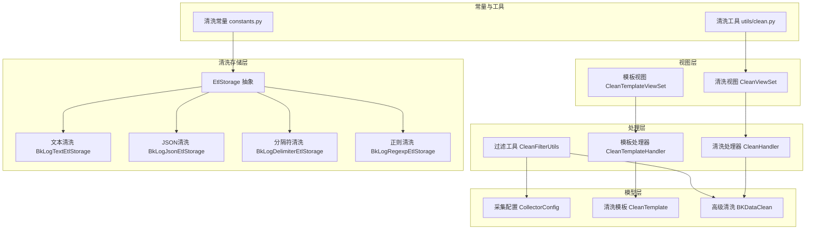
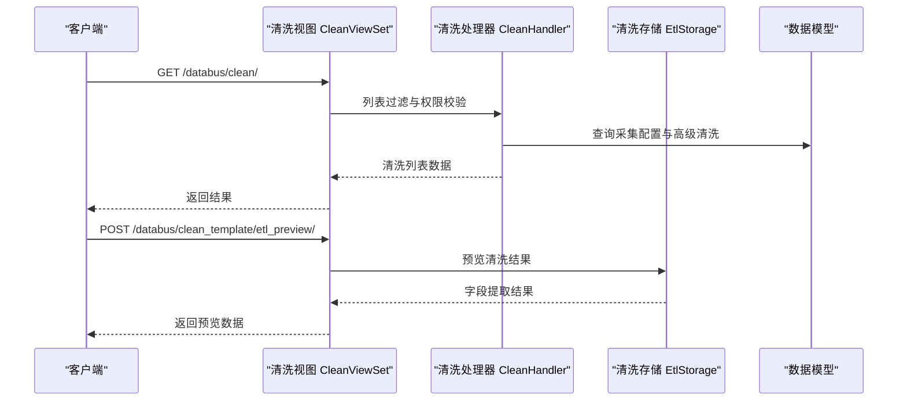
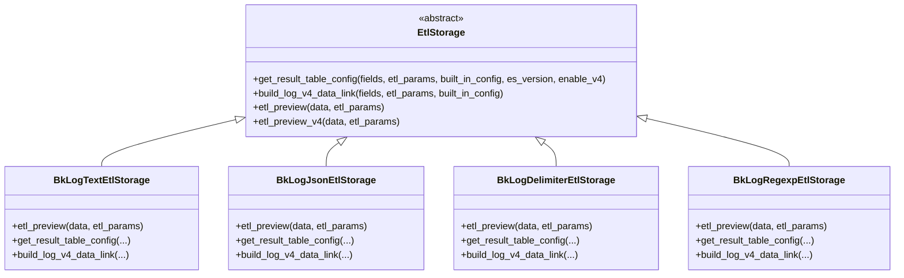
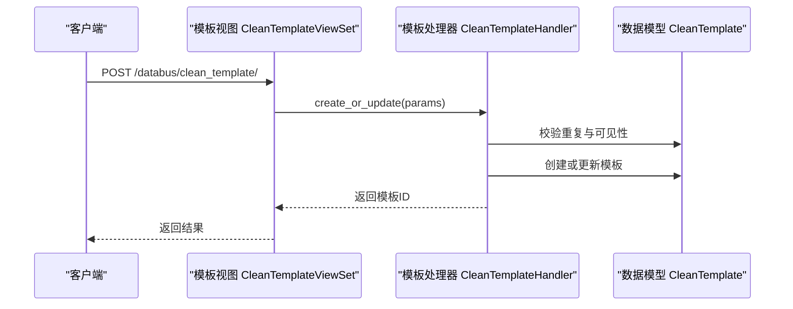
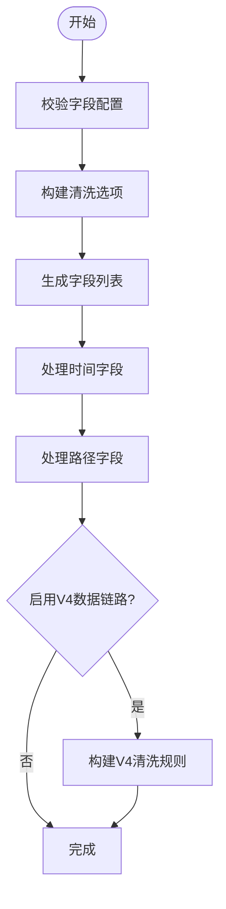
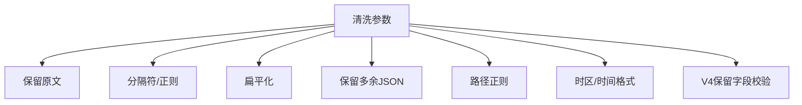
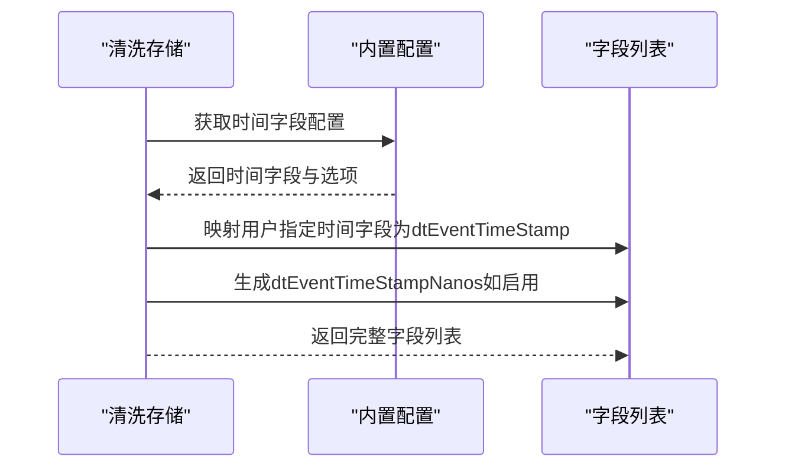
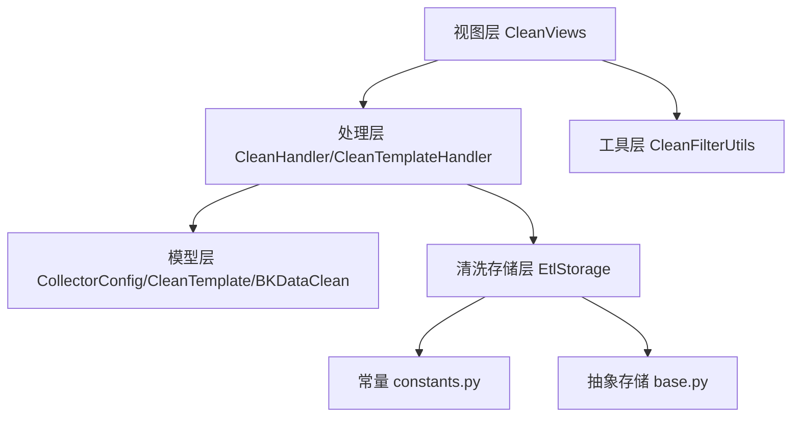

# 清洗规则配置

<cite>
**本文引用的文件**
- [apps/log_databus/handlers/clean.py](file://apps/log_databus/handlers/clean.py)
- [apps/log_databus/views/clean_views.py](file://apps/log_databus/views/clean_views.py)
- [apps/log_databus/models.py](file://apps/log_databus/models.py)
- [apps/log_databus/constants.py](file://apps/log_databus/constants.py)
- [apps/log_databus/utils/clean.py](file://apps/log_databus/utils/clean.py)
- [apps/log_databus/handlers/etl_storage/bk_log_text.py](file://apps/log_databus/handlers/etl_storage/bk_log_text.py)
- [apps/log_databus/handlers/etl_storage/bk_log_delimiter.py](file://apps/log_databus/handlers/etl_storage/bk_log_delimiter.py)
- [apps/log_databus/handlers/etl_storage/bk_log_regexp.py](file://apps/log_databus/handlers/etl_storage/bk_log_regexp.py)
- [apps/log_databus/handlers/etl_storage/bk_log_json.py](file://apps/log_databus/handlers/etl_storage/bk_log_json.py)
- [apps/log_databus/handlers/etl_storage/base.py](file://apps/log_databus/handlers/etl_storage/base.py)
- [apps/log_clustering/handlers/data_access/data_access.py](file://apps/log_clustering/handlers/data_access/data_access.py)
</cite>

## 目录
1. [简介](#简介)
2. [项目结构](#项目结构)
3. [核心组件](#核心组件)
4. [架构概览](#架构概览)
5. [详细组件分析](#详细组件分析)
6. [依赖关系分析](#依赖关系分析)
7. [性能考虑](#性能考虑)
8. [故障排查指南](#故障排查指南)
9. [结论](#结论)
10. [附录](#附录)

## 简介
本技术文档围绕清洗规则配置模块，系统阐述了清洗场景支持、模板管理机制、自定义规则配置、参数选项、验证方法与最佳实践。通过对清洗场景类型、内置字段、时间字段处理、路径字段、V4数据链路等关键能力的深入分析，帮助用户高效完成清洗规则的创建、编辑与维护。

## 项目结构
清洗规则配置模块主要分布在以下子系统：
- 视图层：提供清洗列表、模板管理、预览等功能接口
- 处理层：封装清洗刷新、同步、模板创建/更新/删除等业务逻辑
- 数据模型层：定义采集配置、清洗模板、清洗记录等核心实体
- 清洗存储层：实现不同清洗场景（文本、JSON、分隔符、正则）的配置生成与字段映射
- 常量与工具：定义清洗配置常量、可见性枚举、过滤与预览工具

**图表来源**
- [apps/log_databus/views/clean_views.py:46-197](file://apps/log_databus/views/clean_views.py#L46-L197)
- [apps/log_databus/handlers/clean.py:37-156](file://apps/log_databus/handlers/clean.py#L37-L156)
- [apps/log_databus/utils/clean.py:35-152](file://apps/log_databus/utils/clean.py#L35-L152)
- [apps/log_databus/models.py:102-565](file://apps/log_databus/models.py#L102-L565)
- [apps/log_databus/handlers/etl_storage/base.py:121-871](file://apps/log_databus/handlers/etl_storage/base.py#L121-L871)

**章节来源**
- [apps/log_databus/views/clean_views.py:46-197](file://apps/log_databus/views/clean_views.py#L46-L197)
- [apps/log_databus/handlers/clean.py:37-156](file://apps/log_databus/handlers/clean.py#L37-L156)
- [apps/log_databus/utils/clean.py:35-152](file://apps/log_databus/utils/clean.py#L35-L152)
- [apps/log_databus/models.py:102-565](file://apps/log_databus/models.py#L102-L565)
- [apps/log_databus/handlers/etl_storage/base.py:121-871](file://apps/log_databus/handlers/etl_storage/base.py#L121-L871)

## 核心组件
- 清洗处理器 CleanHandler：负责刷新高级清洗、同步清洗状态等
- 模板处理器 CleanTemplateHandler：负责清洗模板的创建、更新、删除与可见性控制
- 清洗视图 CleanViewSet：提供清洗列表、删除清洗、刷新、同步等接口
- 模板视图 CleanTemplateViewSet：提供模板列表、详情、创建、更新、删除、预览等接口
- 清洗存储 EtlStorage 及其实现：负责不同清洗场景的配置生成、字段映射、V4数据链路构建
- 过滤工具 CleanFilterUtils：统一清洗列表展示与权限控制
- 数据模型：采集配置、清洗模板、高级清洗记录等

**章节来源**
- [apps/log_databus/handlers/clean.py:37-156](file://apps/log_databus/handlers/clean.py#L37-L156)
- [apps/log_databus/views/clean_views.py:46-557](file://apps/log_databus/views/clean_views.py#L46-L557)
- [apps/log_databus/utils/clean.py:35-152](file://apps/log_databus/utils/clean.py#L35-L152)
- [apps/log_databus/models.py:102-565](file://apps/log_databus/models.py#L102-L565)

## 架构概览
清洗规则配置遵循“视图-处理-存储-模型”的分层架构：
- 视图层接收前端请求，进行参数校验与权限控制
- 处理层协调数据模型与清洗存储，生成最终的清洗配置
- 清洗存储层根据清洗场景类型生成字段列表、时间字段、路径字段与V4数据链路
- 模型层持久化采集配置与清洗模板，支持可见性控制与业务隔离

**图表来源**
- [apps/log_databus/views/clean_views.py:46-197](file://apps/log_databus/views/clean_views.py#L46-L197)
- [apps/log_databus/handlers/clean.py:37-156](file://apps/log_databus/handlers/clean.py#L37-L156)
- [apps/log_databus/handlers/etl_storage/base.py:121-871](file://apps/log_databus/handlers/etl_storage/base.py#L121-L871)

## 详细组件分析

### 清洗场景支持
清洗场景类型由常量定义，支持文本、JSON、分隔符、正则与自定义等模式。不同场景通过各自的存储实现生成字段列表与清洗配置。

- 文本清洗（bk_log_text）：直接入库，保留原文字段，支持内置字段与时间字段
- JSON清洗（bk_log_json）：解析JSON，支持字段映射、扁平化、保留多余JSON
- 分隔符清洗（bk_log_delimiter）：按分隔符切分，支持字段索引映射与路径字段
- 正则清洗（bk_log_regexp）：按正则表达式提取，支持命名捕获组与路径字段
- 自定义清洗（custom）：通过清洗存储抽象扩展

**图表来源**
- [apps/log_databus/handlers/etl_storage/base.py:121-871](file://apps/log_databus/handlers/etl_storage/base.py#L121-L871)
- [apps/log_databus/handlers/etl_storage/bk_log_text.py:28-226](file://apps/log_databus/handlers/etl_storage/bk_log_text.py#L28-L226)
- [apps/log_databus/handlers/etl_storage/bk_log_json.py:29-390](file://apps/log_databus/handlers/etl_storage/bk_log_json.py#L29-L390)
- [apps/log_databus/handlers/etl_storage/bk_log_delimiter.py:43-465](file://apps/log_databus/handlers/etl_storage/bk_log_delimiter.py#L43-L465)
- [apps/log_databus/handlers/etl_storage/bk_log_regexp.py:33-380](file://apps/log_databus/handlers/etl_storage/bk_log_regexp.py#L33-L380)

**章节来源**
- [apps/log_databus/constants.py:388-409](file://apps/log_databus/constants.py#L388-L409)
- [apps/log_databus/handlers/etl_storage/bk_log_text.py:28-226](file://apps/log_databus/handlers/etl_storage/bk_log_text.py#L28-L226)
- [apps/log_databus/handlers/etl_storage/bk_log_json.py:29-390](file://apps/log_databus/handlers/etl_storage/bk_log_json.py#L29-L390)
- [apps/log_databus/handlers/etl_storage/bk_log_delimiter.py:43-465](file://apps/log_databus/handlers/etl_storage/bk_log_delimiter.py#L43-L465)
- [apps/log_databus/handlers/etl_storage/bk_log_regexp.py:33-380](file://apps/log_databus/handlers/etl_storage/bk_log_regexp.py#L33-L380)

### 清洗模板管理机制
清洗模板用于复用清洗配置，支持模板创建、更新、删除与可见性控制。模板的可见性类型包括当前业务、多业务、当前租户、全业务与业务属性，便于跨业务共享与权限控制。

- 创建/更新：支持模板名称、类型、清洗参数、字段定义与可见性配置
- 删除：校验模板归属业务，防止越权删除
- 可见性：通过可见类型与可见业务范围控制模板使用范围

**图表来源**
- [apps/log_databus/views/clean_views.py:209-502](file://apps/log_databus/views/clean_views.py#L209-L502)
- [apps/log_databus/handlers/clean.py:73-156](file://apps/log_databus/handlers/clean.py#L73-L156)
- [apps/log_databus/models.py:536-565](file://apps/log_databus/models.py#L536-L565)

**章节来源**
- [apps/log_databus/views/clean_views.py:209-502](file://apps/log_databus/views/clean_views.py#L209-L502)
- [apps/log_databus/handlers/clean.py:73-156](file://apps/log_databus/handlers/clean.py#L73-L156)
- [apps/log_databus/models.py:536-565](file://apps/log_databus/models.py#L536-L565)

### 自定义清洗规则配置
自定义清洗规则通过字段映射、数据类型转换与清洗逻辑定义实现：
- 字段映射：分隔符与正则场景通过字段索引或命名捕获组映射到目标字段
- 数据类型转换：根据字段类型进行输出类型转换，确保ES字段类型一致
- 清洗逻辑：内置字段提取、时间字段处理、路径字段解析、清洗失败标记等

**图表来源**
- [apps/log_databus/handlers/etl_storage/bk_log_delimiter.py:120-178](file://apps/log_databus/handlers/etl_storage/bk_log_delimiter.py#L120-L178)
- [apps/log_databus/handlers/etl_storage/bk_log_regexp.py:121-158](file://apps/log_databus/handlers/etl_storage/bk_log_regexp.py#L121-L158)
- [apps/log_databus/handlers/etl_storage/bk_log_json.py:86-127](file://apps/log_databus/handlers/etl_storage/bk_log_json.py#L86-L127)
- [apps/log_databus/handlers/etl_storage/bk_log_text.py:53-91](file://apps/log_databus/handlers/etl_storage/bk_log_text.py#L53-L91)

**章节来源**
- [apps/log_databus/handlers/etl_storage/bk_log_delimiter.py:120-178](file://apps/log_databus/handlers/etl_storage/bk_log_delimiter.py#L120-L178)
- [apps/log_databus/handlers/etl_storage/bk_log_regexp.py:121-158](file://apps/log_databus/handlers/etl_storage/bk_log_regexp.py#L121-L158)
- [apps/log_databus/handlers/etl_storage/bk_log_json.py:86-127](file://apps/log_databus/handlers/etl_storage/bk_log_json.py#L86-L127)
- [apps/log_databus/handlers/etl_storage/bk_log_text.py:53-91](file://apps/log_databus/handlers/etl_storage/bk_log_text.py#L53-L91)

### 清洗参数配置选项
清洗参数涵盖保留原文、分隔符、正则表达式、扁平化、保留多余JSON、路径正则等：
- 保留原文：保留原始日志文本，便于全文检索与溯源
- 分隔符/正则：定义字段切分与提取规则
- 扁平化：将嵌套结构展平，便于查询与聚合
- 保留多余JSON：将JSON对象序列化后入库，提升可读性
- 路径正则：从日志路径中提取维度字段

**图表来源**
- [apps/log_databus/constants.py:264-272](file://apps/log_databus/constants.py#L264-L272)
- [apps/log_databus/handlers/etl_storage/base.py:135-147](file://apps/log_databus/handlers/etl_storage/base.py#L135-L147)
- [apps/log_databus/handlers/etl_storage/bk_log_delimiter.py:124-133](file://apps/log_databus/handlers/etl_storage/bk_log_delimiter.py#L124-L133)
- [apps/log_databus/handlers/etl_storage/bk_log_regexp.py:130-139](file://apps/log_databus/handlers/etl_storage/bk_log_regexp.py#L130-L139)
- [apps/log_databus/handlers/etl_storage/bk_log_json.py:91-104](file://apps/log_databus/handlers/etl_storage/bk_log_json.py#L91-L104)

**章节来源**
- [apps/log_databus/constants.py:264-272](file://apps/log_databus/constants.py#L264-L272)
- [apps/log_databus/handlers/etl_storage/base.py:135-147](file://apps/log_databus/handlers/etl_storage/base.py#L135-L147)
- [apps/log_databus/handlers/etl_storage/bk_log_delimiter.py:124-133](file://apps/log_databus/handlers/etl_storage/bk_log_delimiter.py#L124-L133)
- [apps/log_databus/handlers/etl_storage/bk_log_regexp.py:130-139](file://apps/log_databus/handlers/etl_storage/bk_log_regexp.py#L130-L139)
- [apps/log_databus/handlers/etl_storage/bk_log_json.py:91-104](file://apps/log_databus/handlers/etl_storage/bk_log_json.py#L91-L104)

### 时间字段处理
时间字段处理贯穿多种场景，支持内置时间字段、用户指定时间字段、纳秒时间戳与时间格式转换：
- 内置时间字段：从内置配置中提取时间字段与选项
- 用户指定时间字段：将用户选择的时间字段映射为dtEventTimeStamp
- 纳秒时间戳：生成dtEventTimeStampNanos字段，支持纳秒级时间
- 时间格式：支持毫秒、微秒、纳秒等精度与时区配置

**图表来源**
- [apps/log_databus/handlers/etl_storage/bk_log_delimiter.py:275-282](file://apps/log_databus/handlers/etl_storage/bk_log_delimiter.py#L275-L282)
- [apps/log_databus/handlers/etl_storage/bk_log_regexp.py:252-260](file://apps/log_databus/handlers/etl_storage/bk_log_regexp.py#L252-L260)
- [apps/log_databus/handlers/etl_storage/bk_log_json.py:225-236](file://apps/log_databus/handlers/etl_storage/bk_log_json.py#L225-L236)
- [apps/log_databus/handlers/etl_storage/bk_log_text.py:93-158](file://apps/log_databus/handlers/etl_storage/bk_log_text.py#L93-L158)

**章节来源**
- [apps/log_databus/handlers/etl_storage/bk_log_delimiter.py:275-282](file://apps/log_databus/handlers/etl_storage/bk_log_delimiter.py#L275-L282)
- [apps/log_databus/handlers/etl_storage/bk_log_regexp.py:252-260](file://apps/log_databus/handlers/etl_storage/bk_log_regexp.py#L252-L260)
- [apps/log_databus/handlers/etl_storage/bk_log_json.py:225-236](file://apps/log_databus/handlers/etl_storage/bk_log_json.py#L225-L236)
- [apps/log_databus/handlers/etl_storage/bk_log_text.py:93-158](file://apps/log_databus/handlers/etl_storage/bk_log_text.py#L93-L158)

### IP地址解析与特殊字符处理
- IP地址解析：通过内置字段与路径字段解析IP相关信息，支持多维分析
- 特殊字符处理：保留原文与清洗失败标记，便于问题定位与审计

**章节来源**
- [apps/log_databus/handlers/etl_storage/bk_log_delimiter.py:314-341](file://apps/log_databus/handlers/etl_storage/bk_log_delimiter.py#L314-L341)
- [apps/log_databus/handlers/etl_storage/bk_log_json.py:180-190](file://apps/log_databus/handlers/etl_storage/bk_log_json.py#L180-L190)
- [apps/log_databus/handlers/etl_storage/base.py:845-867](file://apps/log_databus/handlers/etl_storage/base.py#L845-L867)

### V4数据链路与内置字段
V4数据链路提供更强大的清洗能力，包含JSON解析、内置字段提取、迭代处理、字段映射与路径字段：
- 保留字段校验：禁止使用V4保留字段名，避免冲突
- 清洗规则：按阶段构建清洗规则，确保数据流转正确
- 存储配置：ES与Doris存储配置，支持唯一字段与时区设置

**章节来源**
- [apps/log_databus/handlers/etl_storage/base.py:135-147](file://apps/log_databus/handlers/etl_storage/base.py#L135-L147)
- [apps/log_databus/handlers/etl_storage/bk_log_text.py:93-158](file://apps/log_databus/handlers/etl_storage/bk_log_text.py#L93-L158)
- [apps/log_databus/handlers/etl_storage/bk_log_delimiter.py:180-291](file://apps/log_databus/handlers/etl_storage/bk_log_delimiter.py#L180-L291)
- [apps/log_databus/handlers/etl_storage/bk_log_regexp.py:160-268](file://apps/log_databus/handlers/etl_storage/bk_log_regexp.py#L160-L268)
- [apps/log_databus/handlers/etl_storage/bk_log_json.py:129-244](file://apps/log_databus/handlers/etl_storage/bk_log_json.py#L129-L244)

### 清洗规则验证与最佳实践
- 字段完整性校验：分隔符与正则场景要求字段必须在参数中定义
- 保留字段冲突：V4场景禁止使用保留字段名
- 预览验证：通过预览接口验证字段提取效果
- 最佳实践：
  - 合理设置保留原文，便于全文检索与问题定位
  - 使用路径正则提取维度字段，减少后续处理成本
  - 启用V4数据链路以获得更灵活的清洗能力
  - 明确时间字段与精度，确保时间序列分析准确性

**章节来源**
- [apps/log_databus/handlers/etl_storage/bk_log_delimiter.py:125-129](file://apps/log_databus/handlers/etl_storage/bk_log_delimiter.py#L125-L129)
- [apps/log_databus/handlers/etl_storage/bk_log_regexp.py:125-129](file://apps/log_databus/handlers/etl_storage/bk_log_regexp.py#L125-L129)
- [apps/log_databus/handlers/etl_storage/base.py:135-147](file://apps/log_databus/handlers/etl_storage/base.py#L135-L147)
- [apps/log_databus/views/clean_views.py:503-556](file://apps/log_databus/views/clean_views.py#L503-L556)

## 依赖关系分析
清洗规则配置模块的依赖关系清晰，各层职责明确：
- 视图层依赖处理层与工具层
- 处理层依赖模型层与清洗存储层
- 清洗存储层依赖常量与工具函数
- 数据模型提供持久化与权限控制

**图表来源**
- [apps/log_databus/views/clean_views.py:46-557](file://apps/log_databus/views/clean_views.py#L46-L557)
- [apps/log_databus/handlers/clean.py:37-156](file://apps/log_databus/handlers/clean.py#L37-L156)
- [apps/log_databus/utils/clean.py:35-152](file://apps/log_databus/utils/clean.py#L35-L152)
- [apps/log_databus/models.py:102-565](file://apps/log_databus/models.py#L102-L565)
- [apps/log_databus/handlers/etl_storage/base.py:121-871](file://apps/log_databus/handlers/etl_storage/base.py#L121-L871)
- [apps/log_databus/constants.py:1-755](file://apps/log_databus/constants.py#L1-L755)

**章节来源**
- [apps/log_databus/views/clean_views.py:46-557](file://apps/log_databus/views/clean_views.py#L46-L557)
- [apps/log_databus/handlers/clean.py:37-156](file://apps/log_databus/handlers/clean.py#L37-L156)
- [apps/log_databus/utils/clean.py:35-152](file://apps/log_databus/utils/clean.py#L35-L152)
- [apps/log_databus/models.py:102-565](file://apps/log_databus/models.py#L102-L565)
- [apps/log_databus/handlers/etl_storage/base.py:121-871](file://apps/log_databus/handlers/etl_storage/base.py#L121-L871)
- [apps/log_databus/constants.py:1-755](file://apps/log_databus/constants.py#L1-L755)

## 性能考虑
- 预览接口：通过SDK预览清洗结果，避免实际写入，降低资源消耗
- 扁平化处理：合理使用扁平化可减少嵌套层级，提升查询性能
- 路径正则：从路径中提取维度字段，减少运行时解析成本
- V4数据链路：在保证功能需求的前提下，合理使用V4链路以获得更好的性能与灵活性

## 故障排查指南
- 字段未定义：分隔符与正则场景需确保字段在参数中定义
- 保留字段冲突：V4场景禁止使用保留字段名，需更换字段名
- 预览失败：检查参数完整性与正则表达式有效性
- 权限问题：确认模板可见性配置与业务归属

**章节来源**
- [apps/log_databus/handlers/etl_storage/bk_log_delimiter.py:125-129](file://apps/log_databus/handlers/etl_storage/bk_log_delimiter.py#L125-L129)
- [apps/log_databus/handlers/etl_storage/bk_log_regexp.py:125-129](file://apps/log_databus/handlers/etl_storage/bk_log_regexp.py#L125-L129)
- [apps/log_databus/handlers/etl_storage/base.py:135-147](file://apps/log_databus/handlers/etl_storage/base.py#L135-L147)
- [apps/log_databus/views/clean_views.py:503-556](file://apps/log_databus/views/clean_views.py#L503-L556)

## 结论
清洗规则配置模块通过清晰的分层设计与丰富的清洗场景支持，为用户提供灵活、可靠的日志清洗能力。结合模板管理、参数配置、V4数据链路与严格验证机制，能够满足多样化的清洗需求并保障数据质量。

## 附录
- 清洗场景类型：文本、JSON、分隔符、正则、自定义
- 可见性类型：当前业务、多业务、当前租户、全业务、业务属性
- V4保留字段：json_data、items、iter_item、iter_string、bk_separator_object、bk_separator_object_path

**章节来源**
- [apps/log_databus/constants.py:388-409](file://apps/log_databus/constants.py#L388-L409)
- [apps/log_databus/constants.py:88-106](file://apps/log_databus/constants.py#L88-L106)
- [apps/log_databus/constants.py:264-272](file://apps/log_databus/constants.py#L264-L272)