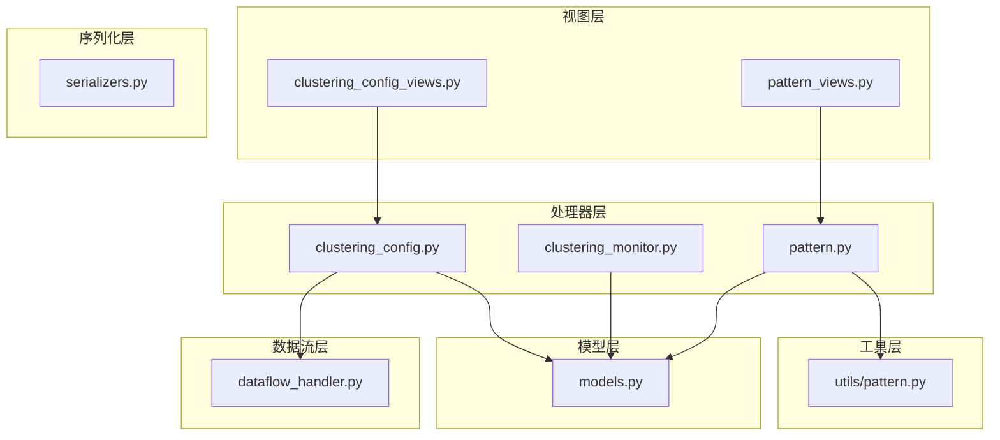
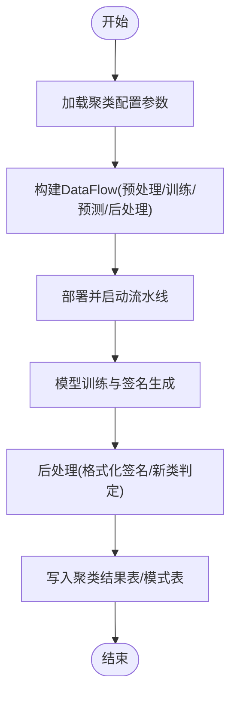
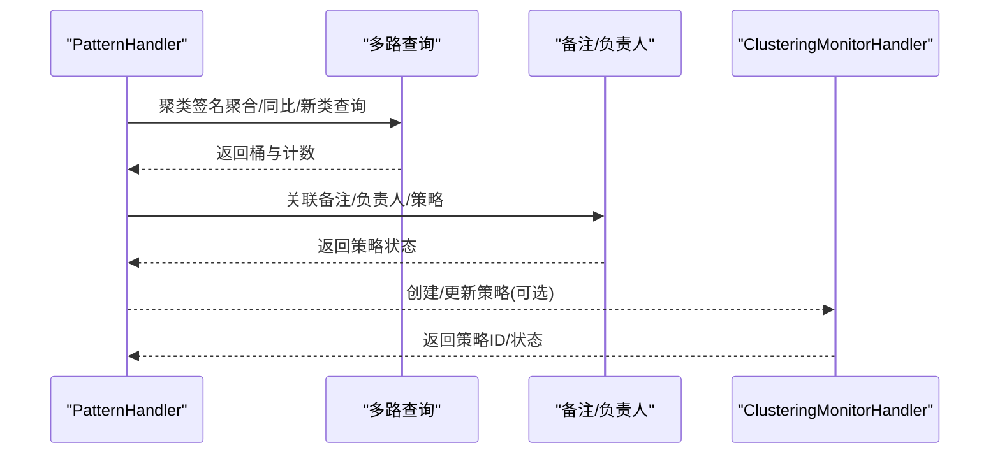
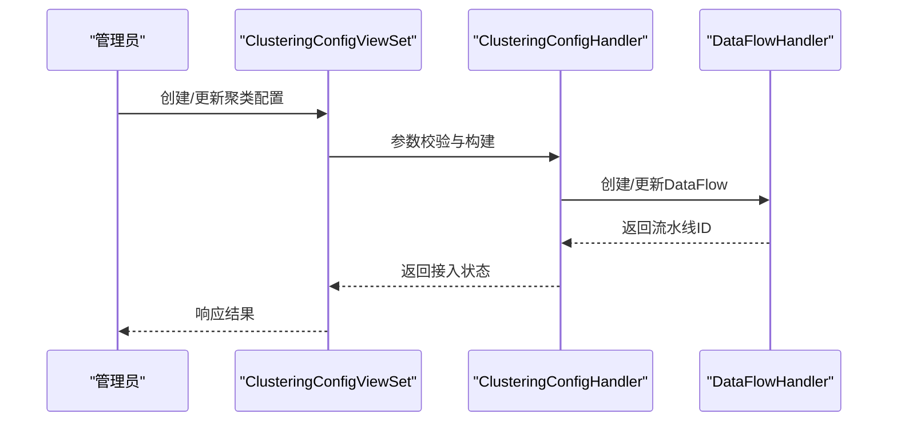
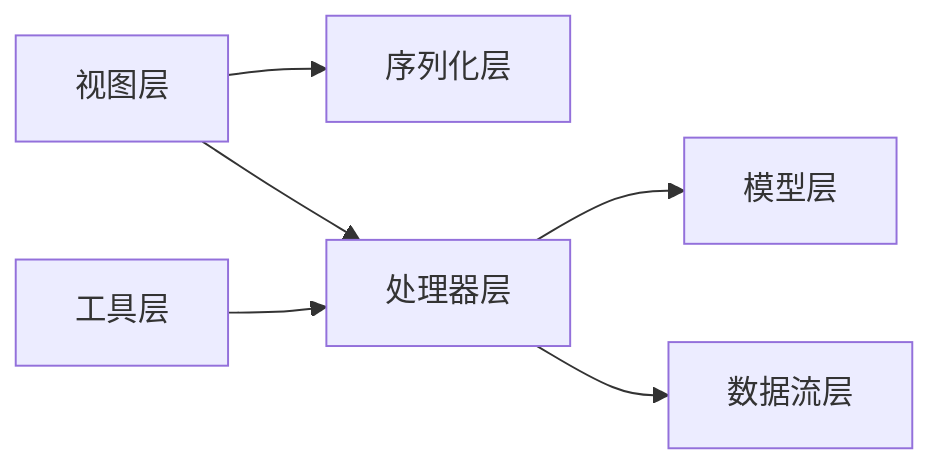

# 日志聚类分析

<cite>
**本文档引用的文件**
- [models.py](file://apps/log_clustering/models.py)
- [constants.py](file://apps/log_clustering/constants.py)
- [clustering_config_views.py](file://apps/log_clustering/views/clustering_config_views.py)
- [pattern_views.py](file://apps/log_clustering/views/pattern_views.py)
- [clustering_config.py](file://apps/log_clustering/handlers/clustering_config.py)
- [pattern.py](file://apps/log_clustering/handlers/pattern.py)
- [clustering_monitor.py](file://apps/log_clustering/handlers/clustering_monitor.py)
- [pattern.py（工具）](file://apps/log_clustering/utils/pattern.py)
- [dataflow_handler.py](file://apps/log_clustering/handlers/dataflow/dataflow_handler.py)
- [serializers.py](file://apps/log_clustering/serializers.py)
</cite>

## 目录
1. [简介](#简介)
2. [项目结构](#项目结构)
3. [核心组件](#核心组件)
4. [架构总览](#架构总览)
5. [详细组件分析](#详细组件分析)
6. [依赖分析](#依赖分析)
7. [性能考虑](#性能考虑)
8. [故障排查指南](#故障排查指南)
9. [结论](#结论)
10. [附录](#附录)

## 简介
本技术文档面向“日志聚类分析系统”，围绕AI聚类算法实现、模式识别与异常检测、告警机制设计、聚类配置管理、结果可视化与评估优化等方面进行系统性梳理。文档基于仓库中的日志聚类模块，结合视图层、处理器层、数据流层与工具层，提供从数据接入、聚类训练、模式识别到告警与可视化的完整技术脉络，并给出可操作的配置示例与结果分析思路。

## 项目结构
日志聚类相关代码主要集中在 apps/log_clustering 目录下，采用“视图-序列化-处理器-模型-工具-数据流”的分层组织方式：
- 视图层：负责REST接口定义与权限控制，如聚类配置、模式检索、订阅与报告等。
- 序列化层：统一输入参数校验与默认值处理。
- 处理器层：封装业务逻辑，如聚类配置接入、模式检索、监控策略创建与更新等。
- 模型层：定义聚类配置、签名与模式、订阅、模板等数据模型。
- 工具层：提供正则调试、分词与模式生成等辅助能力。
- 数据流层：对接计算平台DataFlow，构建预处理、模型训练与预测、后处理等流水线。

**图表来源**
- [clustering_config_views.py:41-367](file://apps/log_clustering/views/clustering_config_views.py#L41-L367)
- [pattern_views.py:43-400](file://apps/log_clustering/views/pattern_views.py#L43-L400)
- [clustering_config.py:67-523](file://apps/log_clustering/handlers/clustering_config.py#L67-L523)
- [pattern.py:75-685](file://apps/log_clustering/handlers/pattern.py#L75-L685)
- [clustering_monitor.py:68-615](file://apps/log_clustering/handlers/clustering_monitor.py#L68-L615)
- [models.py:107-344](file://apps/log_clustering/models.py#L107-L344)
- [pattern.py（工具）:1-182](file://apps/log_clustering/utils/pattern.py#L1-L182)
- [dataflow_handler.py:124-800](file://apps/log_clustering/handlers/dataflow/dataflow_handler.py#L124-L800)

**章节来源**
- [clustering_config_views.py:41-367](file://apps/log_clustering/views/clustering_config_views.py#L41-L367)
- [pattern_views.py:43-400](file://apps/log_clustering/views/pattern_views.py#L43-L400)
- [clustering_config.py:67-523](file://apps/log_clustering/handlers/clustering_config.py#L67-L523)
- [pattern.py:75-685](file://apps/log_clustering/handlers/pattern.py#L75-L685)
- [clustering_monitor.py:68-615](file://apps/log_clustering/handlers/clustering_monitor.py#L68-L615)
- [models.py:107-344](file://apps/log_clustering/models.py#L107-L344)
- [pattern.py（工具）:1-182](file://apps/log_clustering/utils/pattern.py#L1-L182)
- [dataflow_handler.py:124-800](file://apps/log_clustering/handlers/dataflow/dataflow_handler.py#L124-L800)

## 核心组件
- 聚类配置模型 ClusteringConfig：承载聚类参数、训练与预测流水线配置、结果表、告警开关与存储类型等。
- 模式与签名模型 AiopsSignatureAndPattern、ClusteringRemark：存储聚类得到的模式、原始日志、备注与负责人等。
- 视图控制器 ClusteringConfigViewSet、PatternViewSet：提供聚类配置、调试、接入状态、模式检索、备注与负责人设置、策略开关等接口。
- 处理器 ClusteringConfigHandler、PatternHandler、ClusteringMonitorHandler：封装接入流程、模式检索与聚合、监控策略创建与更新。
- 工具函数 pattern.debug：提供正则调试与模式生成。
- 数据流 DataFlowHandler：构建预处理、模型训练与预测、后处理流水线，对接计算平台。

**章节来源**
- [models.py:107-344](file://apps/log_clustering/models.py#L107-L344)
- [clustering_config_views.py:41-367](file://apps/log_clustering/views/clustering_config_views.py#L41-L367)
- [pattern_views.py:43-400](file://apps/log_clustering/views/pattern_views.py#L43-L400)
- [clustering_config.py:67-523](file://apps/log_clustering/handlers/clustering_config.py#L67-L523)
- [pattern.py:75-685](file://apps/log_clustering/handlers/pattern.py#L75-L685)
- [clustering_monitor.py:68-615](file://apps/log_clustering/handlers/clustering_monitor.py#L68-L615)
- [pattern.py（工具）:162-182](file://apps/log_clustering/utils/pattern.py#L162-L182)
- [dataflow_handler.py:124-800](file://apps/log_clustering/handlers/dataflow/dataflow_handler.py#L124-L800)

## 架构总览
系统以“配置驱动+数据流引擎”为核心，通过视图层接收请求，序列化层进行参数校验，处理器层协调模型与数据流，最终落盘到聚类结果表与模式表，并通过监控策略触发告警。

```mermaid
sequenceDiagram
participant Client as "客户端"
participant View as "视图层"
participant Handler as "处理器层"
participant DF as "数据流层"
participant Store as "存储层"
Client->>View : 提交聚类配置/调试/接入
View->>Handler : 参数校验与业务编排
Handler->>DF : 构建/更新/启动DataFlow
DF-->>Handler : 返回流水线ID/状态
Handler->>Store : 写入聚类配置/模式/备注
Handler-->>View : 返回结果
View-->>Client : 响应结果
```

**图表来源**
- [clustering_config_views.py:104-126](file://apps/log_clustering/views/clustering_config_views.py#L104-L126)
- [clustering_config.py:92-98](file://apps/log_clustering/handlers/clustering_config.py#L92-L98)
- [dataflow_handler.py:124-149](file://apps/log_clustering/handlers/dataflow/dataflow_handler.py#L124-L149)
- [models.py:107-191](file://apps/log_clustering/models.py#L107-L191)

**章节来源**
- [clustering_config_views.py:104-126](file://apps/log_clustering/views/clustering_config_views.py#L104-L126)
- [clustering_config.py:92-98](file://apps/log_clustering/handlers/clustering_config.py#L92-L98)
- [dataflow_handler.py:124-149](file://apps/log_clustering/handlers/dataflow/dataflow_handler.py#L124-L149)
- [models.py:107-191](file://apps/log_clustering/models.py#L107-L191)

## 详细组件分析

### AI聚类算法与训练流程
- 算法选择与参数
  - 训练参数来源于聚类配置模型字段，包括最小日志数量、敏感度列表、预定义变量、分隔符、最大日志长度、大小写敏感、搜索树深度与最大子节点数等。
  - 参数通过 DataFlowHandler 统一注入到训练节点，确保与计算平台参数保持一致。
- 训练与预测流水线
  - 预处理：过滤规则、字段转换、样本集生成。
  - 模型训练：根据输入字段动态扩展模型特征，输出聚类签名与模式。
  - 后处理：格式化签名、新类判定、分流至ES/Doris存储。
- 参数调优建议
  - 敏感度与最小成员数：通过聚类结果统计与人工抽检，逐步调整以平衡误报与漏报。
  - 预定义变量：结合业务日志特征，持续优化正则模板，提升分词与模式提取质量。
  - 过滤规则：剔除无效字段与噪声，减少离群干扰。

**图表来源**
- [dataflow_handler.py:281-472](file://apps/log_clustering/handlers/dataflow/dataflow_handler.py#L281-L472)
- [models.py:107-191](file://apps/log_clustering/models.py#L107-L191)

**章节来源**
- [models.py:107-191](file://apps/log_clustering/models.py#L107-L191)
- [dataflow_handler.py:151-163](file://apps/log_clustering/handlers/dataflow/dataflow_handler.py#L151-L163)
- [dataflow_handler.py:281-472](file://apps/log_clustering/handlers/dataflow/dataflow_handler.py#L281-L472)

### 模式识别与异常检测
- 模式识别
  - 通过 PatternHandler 聚合签名计数、同比统计、新类标记与备注/负责人信息，形成可检索的模式视图。
  - 支持按分组字段聚合，兼容Doris与统一查询两种存储路径。
- 异常检测
  - 新类告警：基于预测节点输出的新类标识与敏感度字段，结合阈值与时间窗口触发。
  - 数量突增告警：基于日志计数聚合，设定敏感度与阈值，检测异常波动。
- 告警策略
  - 通过 ClusteringMonitorHandler 创建/更新策略，绑定通知组与消息模板，支持按签名与分组维度细化告警。

**图表来源**
- [pattern.py:89-238](file://apps/log_clustering/handlers/pattern.py#L89-L238)
- [pattern.py:406-445](file://apps/log_clustering/handlers/pattern.py#L406-L445)
- [clustering_monitor.py:401-420](file://apps/log_clustering/handlers/clustering_monitor.py#L401-L420)

**章节来源**
- [pattern.py:89-238](file://apps/log_clustering/handlers/pattern.py#L89-L238)
- [pattern.py:406-445](file://apps/log_clustering/handlers/pattern.py#L406-L445)
- [clustering_monitor.py:401-420](file://apps/log_clustering/handlers/clustering_monitor.py#L401-L420)

### 聚类配置管理
- 配置入口
  - 通过 ClusteringConfigViewSet 提供获取、创建、更新、接入状态查询、调试与正则校验等接口。
- 接入流程
  - 校验索引集场景与采集项配置，生成默认配置，创建DataFlow并异步启动。
  - 接入完成后更新状态，支持后续更新与重启流水线。
- 参数与模板
  - 支持自定义正则模板或使用内置模板；模板变更会同步到聚类配置。

**图表来源**
- [clustering_config_views.py:127-232](file://apps/log_clustering/views/clustering_config_views.py#L127-L232)
- [clustering_config.py:100-213](file://apps/log_clustering/handlers/clustering_config.py#L100-L213)
- [dataflow_handler.py:124-149](file://apps/log_clustering/handlers/dataflow/dataflow_handler.py#L124-L149)

**章节来源**
- [clustering_config_views.py:127-232](file://apps/log_clustering/views/clustering_config_views.py#L127-L232)
- [clustering_config.py:100-213](file://apps/log_clustering/handlers/clustering_config.py#L100-L213)
- [dataflow_handler.py:124-149](file://apps/log_clustering/handlers/dataflow/dataflow_handler.py#L124-L149)

### 结果可视化与订阅
- 模式检索
  - PatternViewSet 提供模式搜索接口，支持关键词、同比、分组、备注/负责人筛选等。
- 订阅与报告
  - 支持按场景配置订阅通道、频率、内容模板与变量，生成定时报告。
- 可视化建议
  - 基于聚类签名计数与同比变化，结合趋势图与热力图展示异常分布。

**章节来源**
- [pattern_views.py:50-133](file://apps/log_clustering/views/pattern_views.py#L50-L133)
- [pattern.py:89-238](file://apps/log_clustering/handlers/pattern.py#L89-L238)

### 聚类效果评估与优化
- 评估指标
  - 聚类稳定性：签名覆盖率、模式复现率、新类误报率。
  - 业务有效性：告警命中率、平均处置时延、误报成本。
- 优化策略
  - 参数调优：敏感度、最小成员数、过滤规则。
  - 模板迭代：正则模板与分词策略持续优化。
  - 流水线治理：定期重启与资源配额调整，保障吞吐与延迟。

**章节来源**
- [constants.py:77-123](file://apps/log_clustering/constants.py#L77-L123)
- [pattern.py:353-364](file://apps/log_clustering/handlers/pattern.py#L353-L364)

## 依赖分析
- 视图层依赖处理器层与序列化层，保证接口安全与参数一致性。
- 处理器层依赖模型层与数据流层，协调业务与计算平台。
- 工具层为处理器层提供正则与分词能力。
- 模型层贯穿各层，承载配置、结果与策略数据。

**图表来源**
- [clustering_config_views.py:41-367](file://apps/log_clustering/views/clustering_config_views.py#L41-L367)
- [pattern_views.py:43-400](file://apps/log_clustering/views/pattern_views.py#L43-L400)
- [clustering_config.py:67-523](file://apps/log_clustering/handlers/clustering_config.py#L67-L523)
- [pattern.py:75-685](file://apps/log_clustering/handlers/pattern.py#L75-L685)
- [clustering_monitor.py:68-615](file://apps/log_clustering/handlers/clustering_monitor.py#L68-L615)
- [models.py:107-344](file://apps/log_clustering/models.py#L107-L344)
- [pattern.py（工具）:1-182](file://apps/log_clustering/utils/pattern.py#L1-L182)
- [dataflow_handler.py:124-800](file://apps/log_clustering/handlers/dataflow/dataflow_handler.py#L124-L800)

**章节来源**
- [clustering_config_views.py:41-367](file://apps/log_clustering/views/clustering_config_views.py#L41-L367)
- [pattern_views.py:43-400](file://apps/log_clustering/views/pattern_views.py#L43-L400)
- [clustering_config.py:67-523](file://apps/log_clustering/handlers/clustering_config.py#L67-L523)
- [pattern.py:75-685](file://apps/log_clustering/handlers/pattern.py#L75-L685)
- [clustering_monitor.py:68-615](file://apps/log_clustering/handlers/clustering_monitor.py#L68-L615)
- [models.py:107-344](file://apps/log_clustering/models.py#L107-L344)
- [pattern.py（工具）:1-182](file://apps/log_clustering/utils/pattern.py#L1-L182)
- [dataflow_handler.py:124-800](file://apps/log_clustering/handlers/dataflow/dataflow_handler.py#L124-L800)

## 性能考虑
- 数据流层面
  - 合理设置批处理与资源配额，避免内存与CPU瓶颈。
  - 使用缓存与异步任务降低接口响应延迟。
- 查询层面
  - 统一查询与Doris直连双路径，按场景切换以平衡延迟与稳定性。
- 存储层面
  - ES与Doris双存储类型支持，按业务规模与查询复杂度选择最优方案。

[本节为通用指导，无需特定文件引用]

## 故障排查指南
- 接入状态异常
  - 通过接入状态接口检查DataFlow状态与数据写入情况，定位失败节点。
- 正则调试失败
  - 使用调试接口验证正则表达式与分词结果，修正非法正则。
- 策略未生效
  - 检查策略ID与告警组状态，必要时重新创建策略并绑定负责人。

**章节来源**
- [clustering_config.py:307-394](file://apps/log_clustering/handlers/clustering_config.py#L307-L394)
- [clustering_config_views.py:335-366](file://apps/log_clustering/views/clustering_config_views.py#L335-L366)
- [clustering_monitor.py:431-471](file://apps/log_clustering/handlers/clustering_monitor.py#L431-L471)

## 结论
本系统通过“配置驱动+数据流引擎”的方式，实现了从日志接入、聚类训练、模式识别到异常告警的全链路闭环。配合灵活的参数与模板管理、完善的监控策略与可视化能力，能够满足生产环境对稳定性与可运维性的要求。建议在实际落地中持续优化参数与模板，完善告警策略与订阅体系，并建立定期评估与迭代机制。

[本节为总结性内容，无需特定文件引用]

## 附录

### 聚类配置示例（参考）
- 基本参数
  - 聚合字段：日志字段
  - 最小日志数量：≥1
  - 敏感度列表：0.1~0.5
  - 预定义变量：业务正则模板
  - 分隔符：空格/制表符
  - 最大日志长度：默认
  - 大小写敏感：否
  - 搜索树深度：5
  - 最大子节点数：100
- 过滤规则：按业务字段过滤空值与噪声
- 告警策略：开启新类告警与数量突增告警

**章节来源**
- [models.py:107-191](file://apps/log_clustering/models.py#L107-L191)
- [serializers.py:98-113](file://apps/log_clustering/serializers.py#L98-L113)
- [constants.py:77-123](file://apps/log_clustering/constants.py#L77-L123)

### 聚类结果分析案例（参考）
- 案例目标：定位某业务线高频异常模式
- 分析步骤
  - 使用模式检索接口，按时间范围与关键词筛选
  - 查看同比变化与新类标记，识别异常趋势
  - 关联备注与负责人，确认处置进展
  - 基于告警策略核对告警命中情况
- 输出建议
  - 聚类签名计数TopN
  - 同比变化与占比
  - 新类标识与时间窗口
  - 备注与负责人信息

**章节来源**
- [pattern_views.py:50-133](file://apps/log_clustering/views/pattern_views.py#L50-L133)
- [pattern.py:89-238](file://apps/log_clustering/handlers/pattern.py#L89-L238)
- [clustering_monitor.py:401-420](file://apps/log_clustering/handlers/clustering_monitor.py#L401-L420)