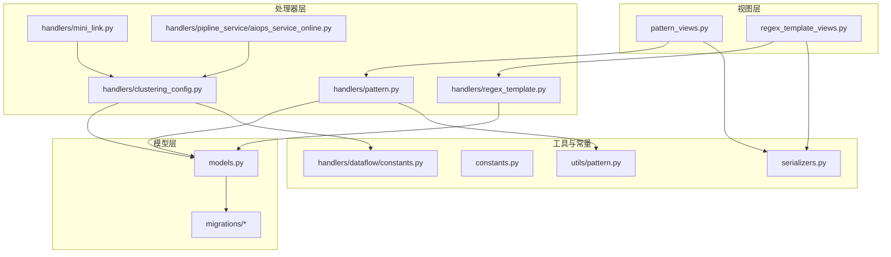
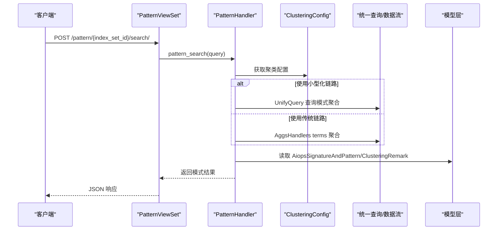
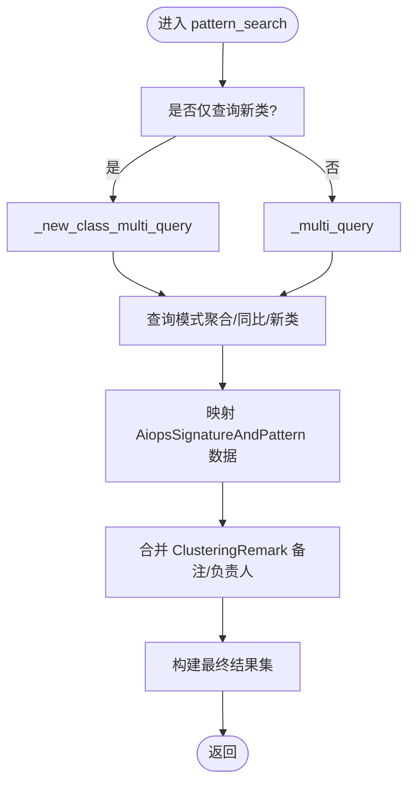
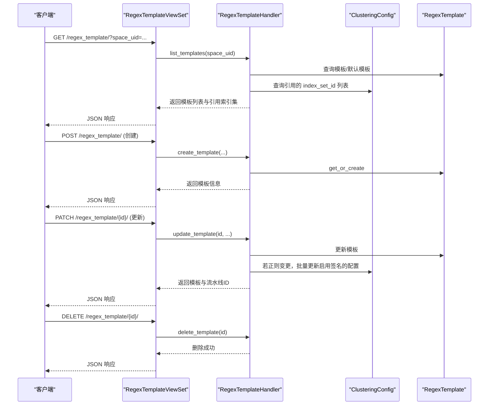
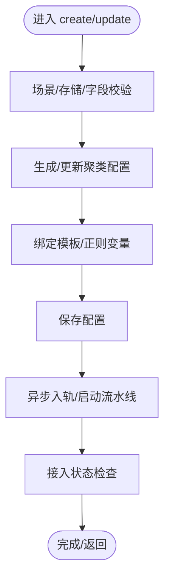
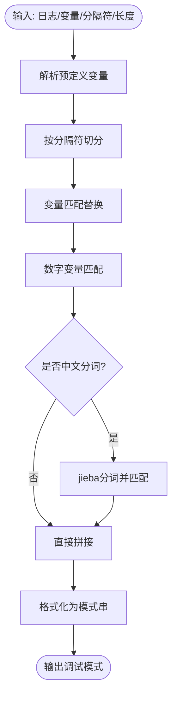
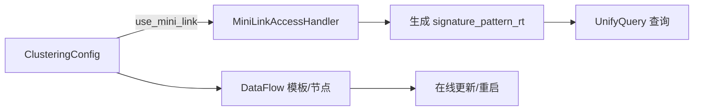
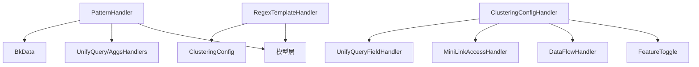

# 模式识别系统

<cite>
**本文档引用的文件**
- [apps/log_clustering/models.py](file://apps/log_clustering/models.py)
- [apps/log_clustering/utils/pattern.py](file://apps/log_clustering/utils/pattern.py)
- [apps/log_clustering/handlers/pattern.py](file://apps/log_clustering/handlers/pattern.py)
- [apps/log_clustering/handlers/regex_template.py](file://apps/log_clustering/handlers/regex_template.py)
- [apps/log_clustering/constants.py](file://apps/log_clustering/constants.py)
- [apps/log_clustering/views/pattern_views.py](file://apps/log_clustering/views/pattern_views.py)
- [apps/log_clustering/views/regex_template_views.py](file://apps/log_clustering/views/regex_template_views.py)
- [apps/log_clustering/handlers/clustering_config.py](file://apps/log_clustering/handlers/clustering_config.py)
- [apps/log_clustering/handlers/dataflow/constants.py](file://apps/log_clustering/handlers/dataflow/constants.py)
- [apps/log_clustering/serializers.py](file://apps/log_clustering/serializers.py)
- [apps/log_clustering/migrations/0033_auto_20241016_0944.py](file://apps/log_clustering/migrations/0033_auto_20241016_0944.py)
- [apps/log_clustering/migrations/0039_clusteringconfig_predict_cluster_and_more.py](file://apps/log_clustering/migrations/0039_clusteringconfig_predict_cluster_and_more.py)
- [apps/log_clustering/handlers/mini_link.py](file://apps/log_clustering/handlers/mini_link.py)
- [apps/log_clustering/handlers/pipline_service/aiops_service_online.py](file://apps/log_clustering/handlers/pipline_service/aiops_service_online.py)
</cite>

## 目录
1. [简介](#简介)
2. [项目结构](#项目结构)
3. [核心组件](#核心组件)
4. [架构总览](#架构总览)
5. [详细组件分析](#详细组件分析)
6. [依赖分析](#依赖分析)
7. [性能考虑](#性能考虑)
8. [故障排查指南](#故障排查指南)
9. [结论](#结论)
10. [附录](#附录)

## 简介
本技术文档面向“模式识别系统”，聚焦于日志聚类与模式识别的完整实现，涵盖正则表达式匹配、模式模板管理、模式相似度计算、日志模式提取与标准化、模式聚类、结果存储与查询展示、性能优化与准确率提升策略，并提供可落地的示例与模板配置案例。系统通过统一查询引擎与数据流（DataFlow）实现日志聚类与模式检索，支持传统ES链路与小型化链路两种接入路径。

## 项目结构
围绕模式识别的核心模块主要分布在 apps/log_clustering 目录下，包含模型定义、工具函数、处理器、视图、序列化器、常量与迁移脚本等。整体采用“视图-处理器-模型-工具”的分层设计，配合数据流与统一查询能力实现端到端的模式识别与检索。

图表来源
- [apps/log_clustering/views/pattern_views.py:43-134](file://apps/log_clustering/views/pattern_views.py#L43-L134)
- [apps/log_clustering/views/regex_template_views.py:36-105](file://apps/log_clustering/views/regex_template_views.py#L36-L105)
- [apps/log_clustering/handlers/pattern.py:75-138](file://apps/log_clustering/handlers/pattern.py#L75-L138)
- [apps/log_clustering/handlers/regex_template.py:39-96](file://apps/log_clustering/handlers/regex_template.py#L39-L96)
- [apps/log_clustering/handlers/clustering_config.py:67-214](file://apps/log_clustering/handlers/clustering_config.py#L67-L214)
- [apps/log_clustering/handlers/mini_link.py:56-82](file://apps/log_clustering/handlers/mini_link.py#L56-L82)
- [apps/log_clustering/handlers/pipline_service/aiops_service_online.py:143-172](file://apps/log_clustering/handlers/pipline_service/aiops_service_online.py#L143-L172)
- [apps/log_clustering/utils/pattern.py:1-182](file://apps/log_clustering/utils/pattern.py#L1-L182)
- [apps/log_clustering/constants.py:1-336](file://apps/log_clustering/constants.py#L1-L336)
- [apps/log_clustering/handlers/dataflow/constants.py:1-120](file://apps/log_clustering/handlers/dataflow/constants.py#L1-L120)
- [apps/log_clustering/serializers.py:40-120](file://apps/log_clustering/serializers.py#L40-L120)
- [apps/log_clustering/models.py:107-191](file://apps/log_clustering/models.py#L107-L191)
- [apps/log_clustering/migrations/0033_auto_20241016_0944.py:23-47](file://apps/log_clustering/migrations/0033_auto_20241016_0944.py#L23-L47)

章节来源
- [apps/log_clustering/views/pattern_views.py:43-134](file://apps/log_clustering/views/pattern_views.py#L43-L134)
- [apps/log_clustering/views/regex_template_views.py:36-105](file://apps/log_clustering/views/regex_template_views.py#L36-L105)
- [apps/log_clustering/handlers/pattern.py:75-138](file://apps/log_clustering/handlers/pattern.py#L75-L138)
- [apps/log_clustering/handlers/regex_template.py:39-96](file://apps/log_clustering/handlers/regex_template.py#L39-L96)
- [apps/log_clustering/handlers/clustering_config.py:67-214](file://apps/log_clustering/handlers/clustering_config.py#L67-L214)
- [apps/log_clustering/utils/pattern.py:1-182](file://apps/log_clustering/utils/pattern.py#L1-L182)
- [apps/log_clustering/constants.py:1-336](file://apps/log_clustering/constants.py#L1-L336)
- [apps/log_clustering/models.py:107-191](file://apps/log_clustering/models.py#L107-L191)

## 核心组件
- 模式处理器 PatternHandler：负责模式检索、同比计算、新类识别、备注与负责人管理、结果聚合与展示。
- 正则模板处理器 RegexTemplateHandler：负责模板的创建、更新、删除、模板列表与引用索引集映射。
- 聚类配置处理器 ClusteringConfigHandler：负责聚类接入创建、更新、接入状态检查、调试、字段预检与业务ID校验。
- 模式工具 pattern：提供正则解析、分词与匹配、中文分词、模式格式化与调试能力。
- 视图层：提供模式检索、备注/负责人设置、模板管理等REST接口。
- 模型层：ClusteringConfig、AiopsSignatureAndPattern、ClusteringRemark、RegexTemplate 等。
- 常量与序列化器：定义枚举、字段、校验规则与请求参数结构。

章节来源
- [apps/log_clustering/handlers/pattern.py:75-138](file://apps/log_clustering/handlers/pattern.py#L75-L138)
- [apps/log_clustering/handlers/regex_template.py:39-159](file://apps/log_clustering/handlers/regex_template.py#L39-L159)
- [apps/log_clustering/handlers/clustering_config.py:67-214](file://apps/log_clustering/handlers/clustering_config.py#L67-L214)
- [apps/log_clustering/utils/pattern.py:22-182](file://apps/log_clustering/utils/pattern.py#L22-L182)
- [apps/log_clustering/views/pattern_views.py:43-134](file://apps/log_clustering/views/pattern_views.py#L43-L134)
- [apps/log_clustering/views/regex_template_views.py:36-105](file://apps/log_clustering/views/regex_template_views.py#L36-L105)
- [apps/log_clustering/models.py:66-191](file://apps/log_clustering/models.py#L66-L191)
- [apps/log_clustering/constants.py:234-336](file://apps/log_clustering/constants.py#L234-L336)
- [apps/log_clustering/serializers.py:40-120](file://apps/log_clustering/serializers.py#L40-L120)

## 架构总览
系统通过视图层接收请求，交由处理器层执行业务逻辑，处理器层读写模型层数据并调用工具层与外部服务（统一查询、数据流）。小型化链路与传统链路通过配置切换，支持不同存储后端（ES/Doris）与不同的结果表结构。

图表来源
- [apps/log_clustering/views/pattern_views.py:50-134](file://apps/log_clustering/views/pattern_views.py#L50-L134)
- [apps/log_clustering/handlers/pattern.py:89-138](file://apps/log_clustering/handlers/pattern.py#L89-L138)
- [apps/log_clustering/models.py:107-191](file://apps/log_clustering/models.py#L107-L191)

## 详细组件分析

### 组件A：模式处理器 PatternHandler
- 功能职责
  - 模式检索：根据时间范围、关键词、附加条件、分组字段等查询模式聚合桶。
  - 同比计算：基于指定小时差生成同比时间窗口，计算同比计数与百分比变化。
  - 新类识别：基于新类策略输出或聚类结果表，识别近期新增模式类别。
  - 备注与负责人：支持为签名或原始模式添加/更新/删除备注，设置/更新负责人。
  - 结果聚合：合并模式数据、备注、负责人、策略状态、占比与同比信息。
- 关键流程
  - 检索入口：pattern_search → _multi_query/_new_class_multi_query
  - 聚合字段：pattern_aggs_field（小型化链路使用 signature，否则使用 __dist_{level}）
  - 结果映射：_parse_pattern_aggs_result/_get_group_by_value
  - 模式数据：_get_pattern_data（小型化链路走 UnifyQuery，传统链路走 BkData）
  - 新类：_get_new_class（基于新类策略输出或聚类结果表）

图表来源
- [apps/log_clustering/handlers/pattern.py:89-238](file://apps/log_clustering/handlers/pattern.py#L89-L238)
- [apps/log_clustering/handlers/pattern.py:260-307](file://apps/log_clustering/handlers/pattern.py#L260-L307)
- [apps/log_clustering/handlers/pattern.py:309-404](file://apps/log_clustering/handlers/pattern.py#L309-L404)
- [apps/log_clustering/handlers/pattern.py:447-527](file://apps/log_clustering/handlers/pattern.py#L447-L527)

章节来源
- [apps/log_clustering/handlers/pattern.py:75-685](file://apps/log_clustering/handlers/pattern.py#L75-L685)

### 组件B：正则模板管理 RegexTemplateHandler
- 功能职责
  - 模板列表：若空间无模板则创建默认模板；支持查询引用的索引集列表。
  - 模板创建：按空间唯一标识与模板名创建模板，预设正则变量。
  - 模板更新：支持更新模板名与正则变量；当正则变量变更时，自动同步启用签名的聚类配置。
  - 模板删除：若被索引集引用则禁止删除。
- 关键流程
  - list_templates：默认模板回退与引用索引集映射
  - create_template/update_template/delete_template
  - update_template 中的同步逻辑：遍历启用签名的 ClusteringConfig 并触发更新

图表来源
- [apps/log_clustering/views/regex_template_views.py:59-105](file://apps/log_clustering/views/regex_template_views.py#L59-L105)
- [apps/log_clustering/views/regex_template_views.py:107-138](file://apps/log_clustering/views/regex_template_views.py#L107-L138)
- [apps/log_clustering/views/regex_template_views.py:140-169](file://apps/log_clustering/views/regex_template_views.py#L140-L169)
- [apps/log_clustering/views/regex_template_views.py:171-184](file://apps/log_clustering/views/regex_template_views.py#L171-L184)
- [apps/log_clustering/handlers/regex_template.py:39-159](file://apps/log_clustering/handlers/regex_template.py#L39-L159)
- [apps/log_clustering/handlers/clustering_config.py:274-287](file://apps/log_clustering/handlers/clustering_config.py#L274-L287)

章节来源
- [apps/log_clustering/handlers/regex_template.py:39-159](file://apps/log_clustering/handlers/regex_template.py#L39-L159)
- [apps/log_clustering/views/regex_template_views.py:36-185](file://apps/log_clustering/views/regex_template_views.py#L36-L185)

### 组件C：聚类配置 ClusteringConfigHandler
- 功能职责
  - 创建接入：校验场景与存储配置，生成聚类配置，绑定默认模板，异步触发接入任务。
  - 更新接入：构建数据流上下文，生成并启动更新流水线，延迟重启相关flow。
  - 接入状态检查：检查数据写入、flow运行状态与接入完成标志。
  - 调试：调用工具层 pattern.debug 进行正则调试。
  - 字段预检：确保聚类字段未被删除。
  - 业务ID校验：通过空间关系解析真实业务ID。
- 关键流程
  - create：校验场景→生成默认配置→绑定模板→保存→异步入轨
  - update：构建上下文→生成流水线→启动→记录任务→延迟重启
  - get_access_status：数据写入检查→flow状态检查→接入完成标记
  - debug：调用 pattern.debug

图表来源
- [apps/log_clustering/handlers/clustering_config.py:100-214](file://apps/log_clustering/handlers/clustering_config.py#L100-L214)
- [apps/log_clustering/handlers/clustering_config.py:215-287](file://apps/log_clustering/handlers/clustering_config.py#L215-L287)
- [apps/log_clustering/handlers/clustering_config.py:307-394](file://apps/log_clustering/handlers/clustering_config.py#L307-L394)
- [apps/log_clustering/handlers/clustering_config.py:434-446](file://apps/log_clustering/handlers/clustering_config.py#L434-L446)

章节来源
- [apps/log_clustering/handlers/clustering_config.py:67-523](file://apps/log_clustering/handlers/clustering_config.py#L67-L523)

### 组件D：模式工具 pattern（正则与分词）
- 功能职责
  - 解析预定义变量：将“名称:正则”形式解析为编译后的正则对象列表。
  - 文本分词与匹配：按分隔符切分，逐个变量匹配替换，支持数字变量与中文分词。
  - 模式格式化：将分词结果格式化为带占位符的模式串。
  - 调试：整合输入、变量、分隔符与最大长度，输出调试模式串。
- 关键流程
  - parse_regex：拆分“名称:正则”→编译正则→返回变量列表
  - match_text_and_tokenize：变量匹配→数字变量匹配→中文分词→拼接变量令牌
  - debug：解码预设变量→排序→分组→分词→格式化

图表来源
- [apps/log_clustering/utils/pattern.py:22-182](file://apps/log_clustering/utils/pattern.py#L22-L182)

章节来源
- [apps/log_clustering/utils/pattern.py:1-182](file://apps/log_clustering/utils/pattern.py#L1-L182)

### 组件E：小型化链路与数据流
- 小型化链路
  - 通过 FeatureToggle 判断是否启用小型化链路。
  - 生成 signature_pattern_rt 等结果表ID，使用 UnifyQuery 查询模式数据。
  - 支持 predict_cluster 字段与 st_list 等配置。
- 数据流
  - 预处理/后处理/预测/日志数量聚合等 Flow 模板与节点定义。
  - 在线更新时，比较模型参数字段差异并更新流水线。

图表来源
- [apps/log_clustering/handlers/mini_link.py:56-82](file://apps/log_clustering/handlers/mini_link.py#L56-L82)
- [apps/log_clustering/handlers/mini_link.py:104-135](file://apps/log_clustering/handlers/mini_link.py#L104-L135)
- [apps/log_clustering/handlers/pipline_service/aiops_service_online.py:143-172](file://apps/log_clustering/handlers/pipline_service/aiops_service_online.py#L143-L172)
- [apps/log_clustering/handlers/dataflow/constants.py:71-92](file://apps/log_clustering/handlers/dataflow/constants.py#L71-L92)
- [apps/log_clustering/migrations/0039_clusteringconfig_predict_cluster_and_more.py:12-27](file://apps/log_clustering/migrations/0039_clusteringconfig_predict_cluster_and_more.py#L12-L27)

章节来源
- [apps/log_clustering/handlers/mini_link.py:56-135](file://apps/log_clustering/handlers/mini_link.py#L56-L135)
- [apps/log_clustering/handlers/pipline_service/aiops_service_online.py:143-172](file://apps/log_clustering/handlers/pipline_service/aiops_service_online.py#L143-L172)
- [apps/log_clustering/handlers/dataflow/constants.py:71-92](file://apps/log_clustering/handlers/dataflow/constants.py#L71-L92)
- [apps/log_clustering/migrations/0039_clusteringconfig_predict_cluster_and_more.py:1-27](file://apps/log_clustering/migrations/0039_clusteringconfig_predict_cluster_and_more.py#L1-L27)

## 依赖分析
- 组件耦合
  - PatternHandler 依赖 ClusteringConfig、AiopsSignatureAndPattern、ClusteringRemark、UnifyQuery/AggsHandlers、BkData。
  - RegexTemplateHandler 依赖 RegexTemplate、ClusteringConfig、LogIndexSet。
  - ClusteringConfigHandler 依赖 FeatureToggle、DataFlow、MiniLink、SpaceApi、UnifyQueryFieldHandler。
- 外部依赖
  - 统一查询：UnifyQueryApi、UnifyQueryFieldHandler
  - 数据流：DataFlowHandler、在线服务构建与启动
  - 存储：ES/Doris（通过存储类型与结果表配置切换）
- 循环依赖
  - 未发现直接循环依赖；处理器之间通过模型与工具层间接交互。

图表来源
- [apps/log_clustering/handlers/pattern.py:53-72](file://apps/log_clustering/handlers/pattern.py#L53-L72)
- [apps/log_clustering/handlers/regex_template.py:34-36](file://apps/log_clustering/handlers/regex_template.py#L34-L36)
- [apps/log_clustering/handlers/clustering_config.py:28-64](file://apps/log_clustering/handlers/clustering_config.py#L28-L64)

章节来源
- [apps/log_clustering/handlers/pattern.py:53-72](file://apps/log_clustering/handlers/pattern.py#L53-L72)
- [apps/log_clustering/handlers/regex_template.py:34-36](file://apps/log_clustering/handlers/regex_template.py#L34-L36)
- [apps/log_clustering/handlers/clustering_config.py:28-64](file://apps/log_clustering/handlers/clustering_config.py#L28-L64)

## 性能考虑
- 查询性能
  - 使用小型化链路时，直接查询 signature 字段，减少中间聚合开销。
  - 传统链路通过 AggsHandlers 进行 terms 聚合，建议合理设置 group_by 与分隔符，避免过度细分。
  - 限制查询时间窗口与条数，避免大范围扫描。
- 存储与索引
  - ES/Doris 存储类型通过配置切换，结合结果表字段命名规范（如 __dist_{level}、signature）优化查询。
  - 控制最大日志长度与分隔符，减少正则匹配与分词成本。
- 正则与分词
  - 预定义变量按重要性排序，优先匹配高价值变量，降低回溯成本。
  - 中文分词仅在必要时启用，避免对纯英文日志造成额外开销。
- 流水线与缓存
  - 更新聚类配置后延迟重启相关flow，减少频繁重启带来的抖动。
  - 使用缓存记录最近一次重启时间，避免重复触发。

## 故障排查指南
- 接入状态异常
  - 检查原始日志与聚类日志计数，确认数据写入是否正常。
  - 校验 DataFlow 流程状态与最新部署状态，定位失败节点。
- 正则调试失败
  - 确认预定义变量格式正确，正则表达式合法。
  - 检查分隔符与最大日志长度参数是否合理。
- 模板更新未生效
  - 确认模板正则变量变更后是否触发 ClusteringConfigHandler 的同步更新。
  - 检查模板引用的索引集是否正确映射。
- 小型化链路异常
  - 确认 FeatureToggle 开关与空间业务ID映射。
  - 检查 signature_pattern_rt 等结果表ID生成与查询权限。

章节来源
- [apps/log_clustering/handlers/clustering_config.py:307-394](file://apps/log_clustering/handlers/clustering_config.py#L307-L394)
- [apps/log_clustering/handlers/clustering_config.py:434-446](file://apps/log_clustering/handlers/clustering_config.py#L434-L446)
- [apps/log_clustering/handlers/regex_template.py:122-133](file://apps/log_clustering/handlers/regex_template.py#L122-L133)
- [apps/log_clustering/handlers/mini_link.py:104-135](file://apps/log_clustering/handlers/mini_link.py#L104-L135)

## 结论
本系统通过清晰的分层设计与灵活的接入方式，实现了从日志到模式的全链路识别与检索。正则模板与聚类配置的解耦设计使得规则管理与策略调整更加便捷；小型化链路与传统链路并存，满足不同场景的性能与扩展需求。通过合理的参数配置、正则优化与数据流治理，可在保证准确性的同时显著提升性能与稳定性。

## 附录

### 示例与模板配置案例
- 模式检索示例
  - 请求参数要点：时间范围、关键词、附加条件、分组字段、是否仅新类、同比小时、备注/负责人过滤。
  - 返回字段：模式串、签名、计数、占比、同比计数与百分比、备注、负责人、策略状态、分组值。
- 正则模板配置
  - 模板创建：指定空间唯一标识与模板名，系统默认注入预设变量。
  - 模板更新：支持仅更新模板名或仅更新预设变量，二者不可同时为空。
  - 模板删除：若已被索引集引用则禁止删除。
- 聚类接入配置
  - 创建接入：自动绑定默认模板，生成聚类配置并异步入轨。
  - 更新接入：比较模型参数差异，增量更新流水线并延迟重启。
  - 接入状态：检查原始日志与聚类日志计数、DataFlow 状态与接入完成标志。

章节来源
- [apps/log_clustering/views/pattern_views.py:50-134](file://apps/log_clustering/views/pattern_views.py#L50-L134)
- [apps/log_clustering/views/regex_template_views.py:107-169](file://apps/log_clustering/views/regex_template_views.py#L107-L169)
- [apps/log_clustering/handlers/clustering_config.py:100-214](file://apps/log_clustering/handlers/clustering_config.py#L100-L214)
- [apps/log_clustering/handlers/clustering_config.py:215-287](file://apps/log_clustering/handlers/clustering_config.py#L215-L287)
- [apps/log_clustering/serializers.py:40-120](file://apps/log_clustering/serializers.py#L40-L120)