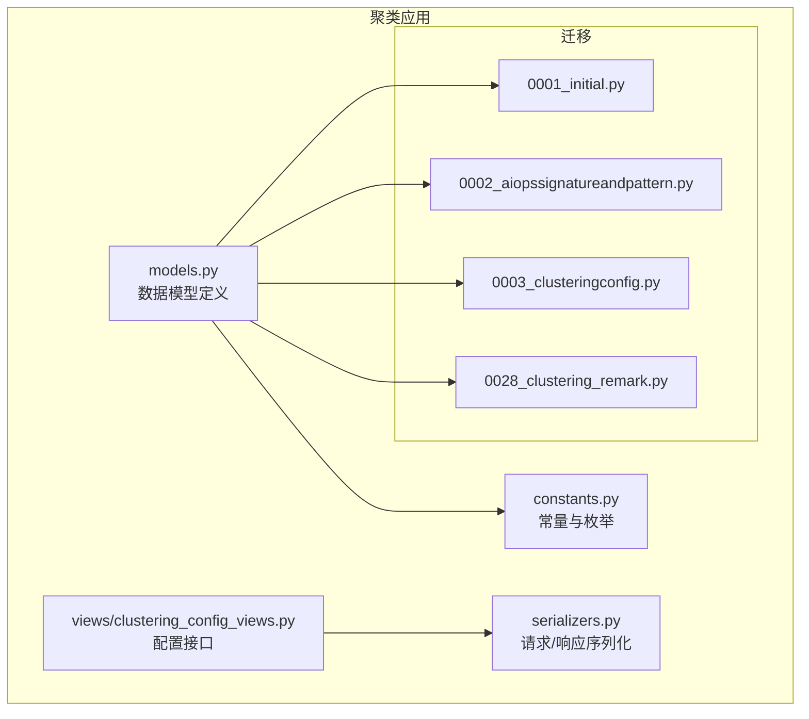
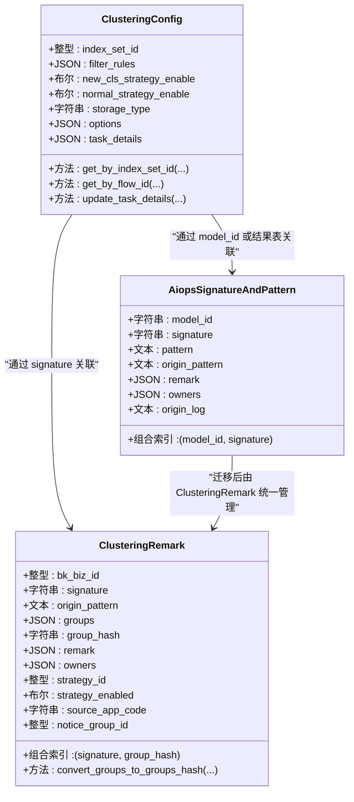
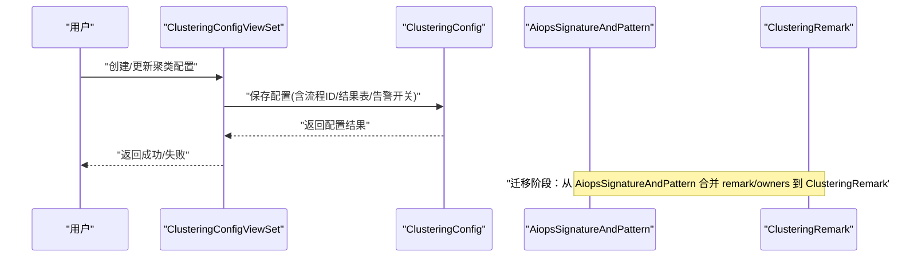
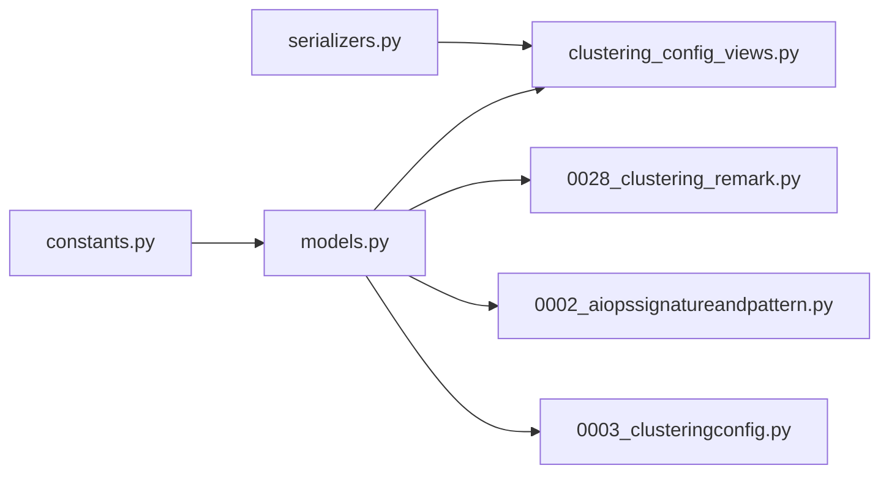

# 聚类数据模型

<cite>
**本文引用的文件**
- [models.py](file://apps/log_clustering/models.py)
- [constants.py](file://apps/log_clustering/constants.py)
- [0001_initial.py](file://apps/log_clustering/migrations/0001_initial.py)
- [0002_aiopssignatureandpattern.py](file://apps/log_clustering/migrations/0002_aiopssignatureandpattern.py)
- [0003_clusteringconfig.py](file://apps/log_clustering/migrations/0003_clusteringconfig.py)
- [0028_clustering_remark.py](file://apps/log_clustering/migrations/0028_clustering_remark.py)
- [clustering_config_views.py](file://apps/log_clustering/views/clustering_config_views.py)
- [serializers.py](file://apps/log_clustering/serializers.py)
</cite>

## 目录
1. [简介](#简介)
2. [项目结构](#项目结构)
3. [核心组件](#核心组件)
4. [架构总览](#架构总览)
5. [详细组件分析](#详细组件分析)
6. [依赖分析](#依赖分析)
7. [性能考虑](#性能考虑)
8. [故障排查指南](#故障排查指南)
9. [结论](#结论)
10. [附录](#附录)

## 简介
本文件聚焦于“聚类数据模型”的技术文档，围绕以下关键模型展开：ClusteringConfig（聚类配置）、AiopsSignatureAndPattern（数据指纹与模式）、ClusteringRemark（聚类备注与策略关联）。文档将从字段定义、业务含义、使用场景、索引设计与性能优化、迁移管理、使用示例与最佳实践等方面进行全面阐述，并提供可视化的关系图与流程图，帮助读者快速理解并正确使用这些模型。

## 项目结构
聚类相关的核心代码位于 apps/log_clustering 应用下，主要涉及：
- 数据模型定义：apps/log_clustering/models.py
- 常量与枚举：apps/log_clustering/constants.py
- 迁移文件：apps/log_clustering/migrations/*.py
- 视图与序列化器：apps/log_clustering/views/* 与 apps/log_clustering/serializers.py

图表来源
- [models.py:46-344](file://apps/log_clustering/models.py#L46-L344)
- [constants.py:197-336](file://apps/log_clustering/constants.py#L197-L336)
- [0001_initial.py:35-96](file://apps/log_clustering/migrations/0001_initial.py#L35-L96)
- [0002_aiopssignatureandpattern.py:34-53](file://apps/log_clustering/migrations/0002_aiopssignatureandpattern.py#L34-L53)
- [0003_clusteringconfig.py:34-67](file://apps/log_clustering/migrations/0003_clusteringconfig.py#L34-L67)
- [0028_clustering_remark.py:53-61](file://apps/log_clustering/migrations/0028_clustering_remark.py#L53-L61)

章节来源
- [models.py:1-344](file://apps/log_clustering/models.py#L1-L344)
- [constants.py:1-336](file://apps/log_clustering/constants.py#L1-L336)

## 核心组件
本节概述三个关键模型的职责与典型用途：
- ClusteringConfig：承载聚类算法的配置、流程ID、结果表、告警策略开关与输出、存储类型等，是聚类能力的“配置中枢”。
- AiopsSignatureAndPattern：存储模型产出的“数据指纹+模式”，用于模式识别与展示；早期包含备注与负责人字段，后迁移至 ClusteringRemark。
- ClusteringRemark：存储业务侧对“数据指纹”的备注、负责人、策略启用状态、来源系统、通知组等，实现“模式-备注-策略”的解耦与持久化。

章节来源
- [models.py:66-344](file://apps/log_clustering/models.py#L66-L344)
- [constants.py:197-336](file://apps/log_clustering/constants.py#L197-L336)

## 架构总览
下图展示了三个核心模型之间的关系与典型交互路径（以配置、模式、备注为主线）：

图表来源
- [models.py:66-344](file://apps/log_clustering/models.py#L66-L344)

## 详细组件分析

### ClusteringConfig（聚类配置）
- 业务含义
  - 描述一次聚类任务的完整配置，包括输入索引集、聚类参数、流程ID、结果表、告警策略开关与输出、存储类型等。
  - 提供便捷查询方法：按 index_set_id 或流程ID反查配置，便于任务状态回写与联动。
- 关键字段要点
  - 索引与查询：index_set_id 使用数据库索引；提供 get_by_index_set_id 与 get_by_flow_id 查询辅助。
  - 告警策略：new_cls_strategy_enable/normal_strategy_enable 控制新类与数量突增告警是否启用；对应输出结果表字段用于策略绑定。
  - 存储类型：storage_type 支持 Elasticsearch/Doris；doris_storage 可单独指定 Doris 集群。
  - 流程与任务：包含预处理/后处理/预测/日志数量聚合等流程ID与配置，task_details 记录节点状态。
- 使用场景
  - 配置接入：创建/更新聚类配置，同步到数据流引擎。
  - 任务追踪：通过 update_task_details 回写节点状态，驱动前端展示。
  - 策略联动：根据 enable 开关与输出结果表创建/更新监控策略。
- 性能与索引
  - index_set_id 已建立索引，适合高频按索引集查询。
  - JSON 字段较多，建议在读取时按需选择字段，避免全量加载。
- 典型调用路径
  - 视图层：/clustering_config/{index_set_id}/access/create、/access/update、/access/status 等接口。
  - 处理器：ClusteringConfigHandler 负责业务逻辑编排。

章节来源
- [models.py:107-245](file://apps/log_clustering/models.py#L107-L245)
- [clustering_config_views.py:127-265](file://apps/log_clustering/views/clustering_config_views.py#L127-L265)

### AiopsSignatureAndPattern（数据指纹与模式）
- 业务含义
  - 存储模型产出的“数据指纹（signature）+模式（pattern）”，并保留原始 pattern、原始日志、备注与负责人等元信息。
- 关键字段要点
  - model_id + signature 组成联合索引，支持按模型与指纹高效查询。
  - remark/owners 在早期版本用于业务备注与负责人管理，后续迁移到 ClusteringRemark。
- 使用场景
  - 模式展示与检索：按 signature 快速定位模式。
  - 迁移支撑：作为 ClusteringRemark 的数据来源之一。
- 性能与索引
  - 联合索引 (model_id, signature) 有利于高并发查询与去重。

章节来源
- [models.py:66-78](file://apps/log_clustering/models.py#L66-L78)
- [0002_aiopssignatureandpattern.py:34-53](file://apps/log_clustering/migrations/0002_aiopssignatureandpattern.py#L34-L53)

### ClusteringRemark（聚类备注与策略）
- 业务含义
  - 将“数据指纹”与“业务备注/负责人/策略”解耦，统一管理，支持按 signature+group_hash 快速定位。
  - 支持策略启用状态、来源系统、通知组等字段，便于与监控策略联动。
- 关键字段要点
  - signature + group_hash 组合索引，确保按指纹与分组维度的高效查询。
  - groups 字段通过 convert_groups_to_groups_hash 方法生成 group_hash，保证一致性。
  - strategy_enabled/source_app_code/notice_group_id 等字段支撑策略与通知集成。
- 使用场景
  - 备注与负责人管理：为特定 signature 维护备注与负责人列表。
  - 策略开关：控制是否启用基于该 signature 的告警策略。
  - 迁移与兼容：从 AiopsSignatureAndPattern 迁移 remark/owners 至 ClusteringRemark，提升可维护性。
- 性能与索引
  - 组合索引 (signature, group_hash) 是查询热点，建议优先使用该维度进行过滤。
  - groups 字段为字典，建议在写入前排序并序列化，确保 hash 一致。

章节来源
- [models.py:80-105](file://apps/log_clustering/models.py#L80-L105)
- [0028_clustering_remark.py:16-51](file://apps/log_clustering/migrations/0028_clustering_remark.py#L16-L51)

### 关系与数据流向（迁移与查询）
- 迁移关系
  - AiopsSignatureAndPattern 中的 remark/owners 在迁移脚本中被抽取并合并，写入 ClusteringRemark，形成“指纹-备注-负责人”的统一存储。
- 查询关系
  - ClusteringConfig 通过 signature 与 AiopsSignatureAndPattern/ClusteringRemark 建立关联，用于策略绑定与结果展示。
  - ClusteringRemark 通过 signature+group_hash 实现高效检索，支持按业务维度分组与过滤。

图表来源
- [clustering_config_views.py:127-233](file://apps/log_clustering/views/clustering_config_views.py#L127-L233)
- [models.py:107-245](file://apps/log_clustering/models.py#L107-L245)
- [0028_clustering_remark.py:16-51](file://apps/log_clustering/migrations/0028_clustering_remark.py#L16-L51)

## 依赖分析
- 内部依赖
  - models.py 依赖 constants.py 中的枚举与常量（如存储类型、订阅类型、策略类型等），确保字段取值规范化。
  - 视图层依赖序列化器对请求参数进行校验与转换。
- 外部依赖
  - 数据库索引：联合索引 (model_id, signature)、(signature, group_hash)、index_set_id 等，支撑高频查询。
  - 迁移脚本：0028_clustering_remark.py 将历史数据迁移至 ClusteringRemark，避免重复查询与分散存储。

图表来源
- [constants.py:197-336](file://apps/log_clustering/constants.py#L197-L336)
- [models.py:66-344](file://apps/log_clustering/models.py#L66-L344)
- [serializers.py:98-120](file://apps/log_clustering/serializers.py#L98-L120)
- [clustering_config_views.py:41-102](file://apps/log_clustering/views/clustering_config_views.py#L41-L102)
- [0002_aiopssignatureandpattern.py:34-53](file://apps/log_clustering/migrations/0002_aiopssignatureandpattern.py#L34-L53)
- [0003_clusteringconfig.py:34-67](file://apps/log_clustering/migrations/0003_clusteringconfig.py#L34-L67)
- [0028_clustering_remark.py:53-61](file://apps/log_clustering/migrations/0028_clustering_remark.py#L53-L61)

章节来源
- [models.py:1-344](file://apps/log_clustering/models.py#L1-L344)
- [constants.py:1-336](file://apps/log_clustering/constants.py#L1-L336)
- [serializers.py:1-290](file://apps/log_clustering/serializers.py#L1-L290)
- [clustering_config_views.py:1-367](file://apps/log_clustering/views/clustering_config_views.py#L1-L367)

## 性能考虑
- 索引设计
  - 联合索引 (model_id, signature)：用于按模型与指纹查询模式。
  - 联合索引 (signature, group_hash)：用于按指纹与分组查询备注与策略。
  - 单列索引 index_set_id：用于按索引集查询配置。
- 查询优化
  - 优先使用组合索引进行过滤，减少全表扫描。
  - JSON 字段较多时，尽量只读取必要字段，避免大对象传输。
  - 对 groups 字典写入前排序并序列化，确保 group_hash 一致性，降低重复计算。
- 写入优化
  - 批量写入：迁移脚本使用 bulk_create 提升导入效率。
  - 任务状态回写：update_task_details 仅更新 task_details 字段，避免全量保存。

章节来源
- [models.py:76-78](file://apps/log_clustering/models.py#L76-L78)
- [models.py:95-96](file://apps/log_clustering/models.py#L95-L96)
- [models.py:213-244](file://apps/log_clustering/models.py#L213-L244)
- [0028_clustering_remark.py:50-51](file://apps/log_clustering/migrations/0028_clustering_remark.py#L50-L51)

## 故障排查指南
- 常见问题
  - 查询不到 ClusteringConfig：确认 index_set_id 是否正确，或尝试 get_by_flow_id 按流程ID查询。
  - 模式缺失或重复：检查 AiopsSignatureAndPattern 是否存在，迁移脚本是否执行成功。
  - 备注/负责人未生效：确认 ClusteringRemark 的 signature+group_hash 是否匹配，group_hash 是否通过 convert_groups_to_groups_hash 生成。
- 排查步骤
  - 核对迁移脚本执行状态：0028_clustering_remark.py 是否成功将 remark/owners 合并到 ClusteringRemark。
  - 校验索引是否存在：确认联合索引 (model_id, signature) 与 (signature, group_hash) 是否存在。
  - 检查任务状态：通过 update_task_details 回写节点状态，核对 task_details 结构。
- 相关接口参考
  - 配置接入与更新：/clustering_config/{index_set_id}/access/create、/access/update
  - 任务状态查询与重试：/pipeline/state、/pipeline/retry、/pipeline/skip、/pipeline/fail

章节来源
- [models.py:192-244](file://apps/log_clustering/models.py#L192-L244)
- [clustering_config_views.py:104-126](file://apps/log_clustering/views/clustering_config_views.py#L104-L126)
- [0028_clustering_remark.py:16-51](file://apps/log_clustering/migrations/0028_clustering_remark.py#L16-L51)

## 结论
本文档系统梳理了聚类数据模型的设计与使用，重点覆盖 ClusteringConfig、AiopsSignatureAndPattern、ClusteringRemark 三者的字段定义、业务含义、关系设计、索引与性能优化、迁移管理与使用示例。通过合理的索引设计与查询优化策略，结合迁移脚本与视图接口，能够有效支撑聚类配置管理、模式识别与告警策略联动等核心场景。

## 附录

### 字段与枚举速览
- 存储类型（storage_type）
  - elasticsearch、doris
- 策略类型（strategy_type）
  - new_cls_strategy、normal_strategy
- 订阅类型（subscription_type）
  - email、wechat
- 规则类型（regex_rule_type）
  - customize、template

章节来源
- [constants.py:252-336](file://apps/log_clustering/constants.py#L252-L336)

### 使用示例与最佳实践
- 配置接入
  - 通过 /clustering_config/{index_set_id}/access/create 接口提交聚类配置，包含业务ID、字段、过滤规则、告警开关等。
  - 建议在创建后立即调用 /access/status 检查接入状态。
- 任务状态回写
  - 使用 update_task_details 按流程ID与节点ID回写状态，避免全量保存。
- 备注与负责人管理
  - 通过 ClusteringRemark 的 signature+group_hash 维护备注与负责人，确保 groups 排序后生成一致的 group_hash。
- 迁移注意事项
  - 确保 0028_clustering_remark.py 迁移脚本执行成功，避免历史 remark/owners 丢失。

章节来源
- [clustering_config_views.py:127-265](file://apps/log_clustering/views/clustering_config_views.py#L127-L265)
- [models.py:213-244](file://apps/log_clustering/models.py#L213-L244)
- [0028_clustering_remark.py:16-51](file://apps/log_clustering/migrations/0028_clustering_remark.py#L16-L51)